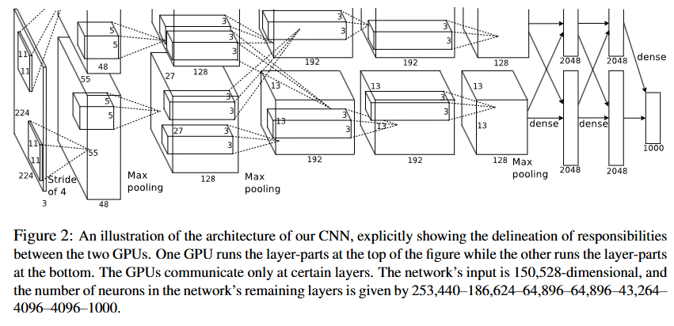

# AlexNet

**top-1 错误率**：指模型预测的最可能类别与图像真实类别不一致的样本数占总样本数的比例。

**top-5 错误率**：是指正确标签不在模型预测的前五个最可能标签中的测试图像占比。

## 摘要

1. 训练了一个大型的深度卷积神经网络，其在测试集上能达到--的错误率，相比之前提升明显
2. 该神经网络的参数数量--，神经元--，由五个卷积层，三个全连接层组成，最后通过softmax输出结果
3. 为了加快训练，采用非饱和式神经元，即dropout，减少全连接层的过拟合现象

## 1 Introduction

介绍背景：当前目标识别主要依赖机器学习，在一些小的数据集中机器学习具有不错的效果，但面对现实场景中的物体，具有较大的可变性，因此有必要使用更大的数据集

卷积神经网络可以拥有大量的先验知识，同时具有很强的学习能力（通过改变网络的深度和广度来控制），与标准前馈神经网络相比，连接的参数要少得多，并且更容易训练，而且理论最佳性能可能略逊一筹

尽管拥有如此多的特性，但其训练成本仍然较高，从这引入GPU来进行计算

## 2 The Dataset

介绍ImageNet---包含1500万张带标注高分辨率图像的数据集，大概分为22000个类别

预处理图像，将图像下采样到固定分辨率256*256

## 3 The Architecture

网络架构如图，包含五个卷积层和三个全连接层

### 3.1 ReLU Nonlinearity

引入ReLU激活函数，比f(x)=tanh(x)等激活函数更快

### 3.2 Training on Multiple GPUs

由于当时条件限制，将网络分布到两块GPU上进行训练

### 3.3 Local Response Normalization

ReLU不需要对输入进行归一化处理防止自身达到饱和状态

利用局部归一化方案有助于提升泛化能力，提出“亮度归一化”

### 3.4 Overlapping Pooling

通俗来讲，就是令卷积的步长<卷积核大小的一半

传统的卷积核每次卷积都不会覆盖之前已经卷积处理过的区域，该方案设置较小步长，可以令top1和top5的错误率降低，且更难出现过拟合

### 3.5 Overall Architecture

前五个是卷积层，剩下的三个是全连接层。最后一个全连接层的输出被输入到一个具有 1000 个类别的 softmax 层，该层会生成一个关于 1000 个类别标签的概率分布。

两个GPU在某些层进行通信

第二个卷积层将第一个卷积层的（经过响应归一化和池化的）输出作为输入，并使用 256 个大小为 5×5×48 的内核进行过滤。第三个、第四个和第五个卷积层相互连接，中间没有任何池化层或归一化层。第三个卷积层有 384 个大小为 3×3×256 的内核，与第二个卷积层的（归一化、池化后的）输出相连。第四个卷积层有 384 个大小为 3×3×192 的内核，第五个卷积层有 256 个大小为 3×3×192 的内核。全连接层每层都有 4096 个神经元。

## 4 Reducing Overfitting

介绍两种对抗过拟合的主要方法

### 4.1 Data Augmentation

1. 通过生成图像平移和水平翻转（现在也经常用于提高模型的泛化能力）
2. 改变RGB通道的强度

### 4.2 Dropout

将许多不同模型的预测结果结合起来是一种非常成功的降低测试误差的方法 

最近引入的一种称为 “随机失活” 的技术 [10]，包括以 0.5 的概率将每个隐藏神经元的输出设置为零。以这种方式 “被失活” 的神经元既不参与前向传播，也不参与反向传播。

每当呈现一个输入时，神经网络就会对不同的架构进行采样，但所有这些架构都共享权重。

这种技术减少了神经元之间复杂的协同适应，因为一个神经元不能依赖于特定的其他神经元的存在。因此，它被迫学习更具鲁棒性的特征，这些特征与其他神经元的许多不同随机子集结合起来是有用的。

## 5 Details of Learing

主要介绍参数的设置

第一个卷积层学习到的96个卷积核展示，上面48个是第一块GPU学到的，下面48个由第二块GPU学到

## 6 Results

介绍网络在ImageNet中取得的结果，相较之前的方法有了很大的提升

### 6.1 Qualitative Evaluations

列举一些识别结果进行分析

## 7 Discussion

结果表明，一个大型的深度卷积神经网络能够在一个极具挑战性的数据集上，通过纯监督学习取得破纪录的成绩。

网络的深度对于取得我们这样的结果来说确实非常重要。

到目前为止，随着我们的网络规模扩大以及训练时间延长，我们的实验结果得到了改善

