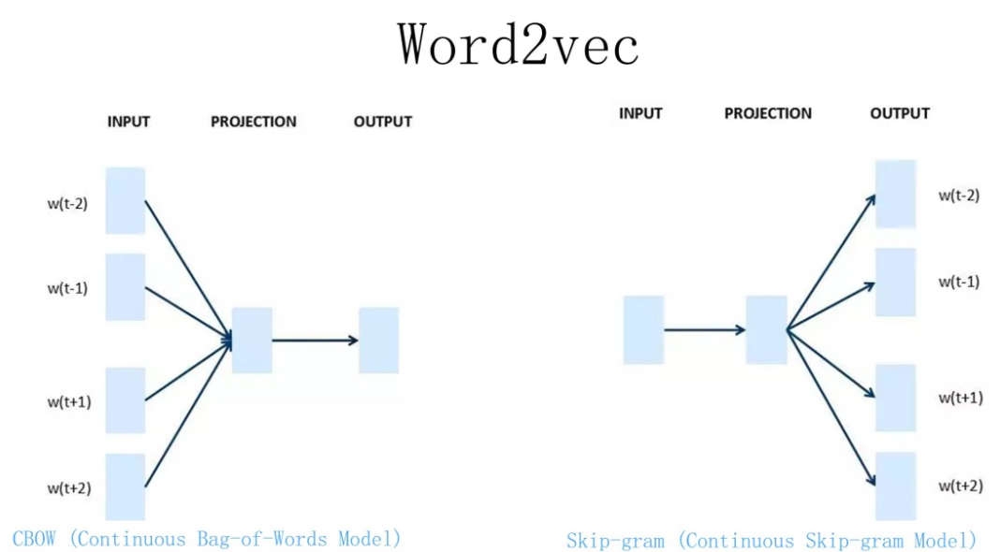
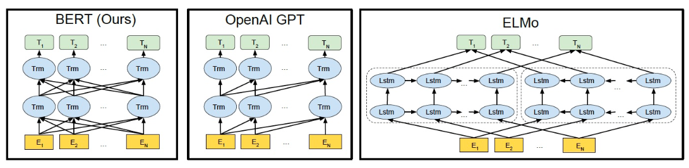
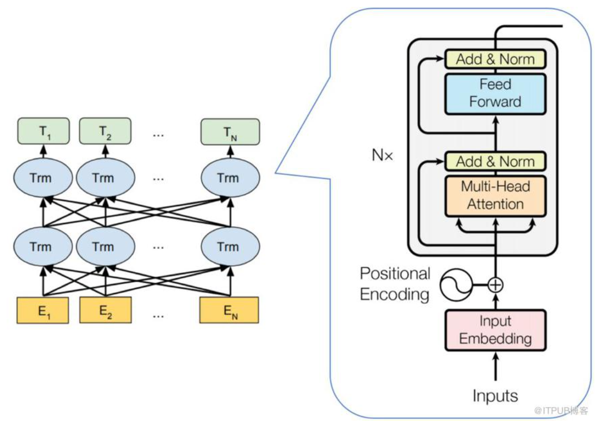
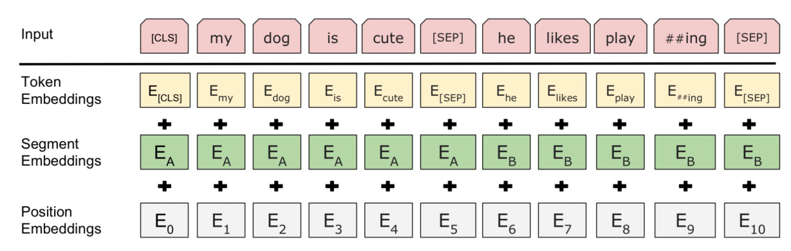
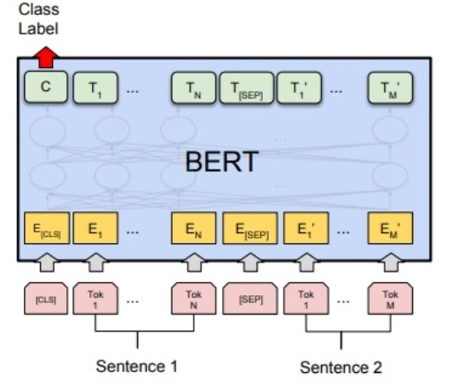
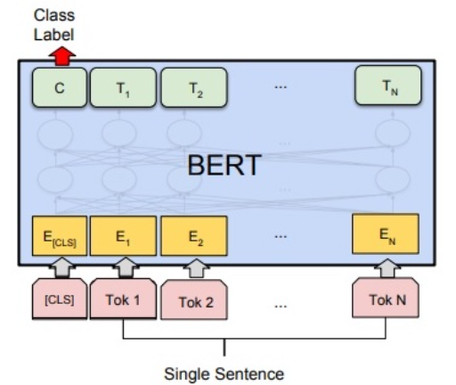
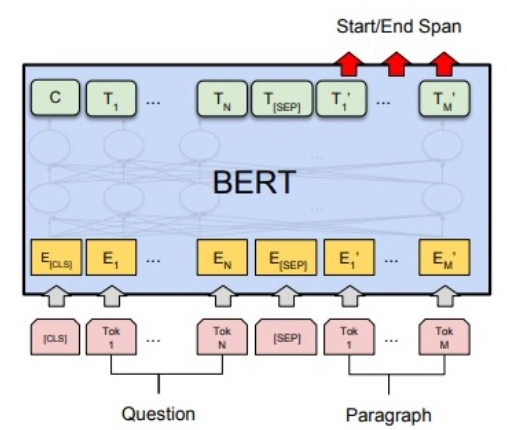
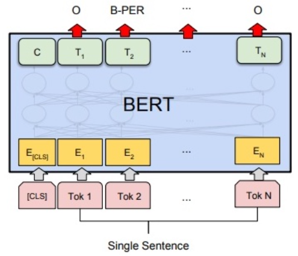

# BERT

BERT 并不是一个具有极大创新的算法，更多的是一个集大成者，把 BERT 之前各个语言模型的优点集于一身，并作出了适当的改进，而拥有了如今无与伦比的能力。

BERT 既然是集大成者，那么集了哪些大成呢？

1. BERT 作为一个预训练语言模型，它的预训练思想借鉴了图像领域中的**预训练**的思想；
2. 作者说的是**借鉴了完形填空任务的思想（双向编码）**，但感觉应该也借鉴了 Word2Vec 的 CBOW 的思想，因为两者本质上是相同的；
3. 没有使用传统的类 RNN 模型作为特征提取器，而是使用了**最近火热的 Transformer 作为特征提取器，而 Transformer 又使用了 Attention 机制作为特征提取器，更是火上浇油**；
4. 真要说创新，也许就是在 CBOW 的思想之上，添加了语言掩码模型（MLM），减少了训练阶段和推理阶段（测试阶段）的不匹配，避免了过拟合；
5. 由于单词预测粒度的训练到不了句子关系这个层级，为了**学会捕捉句子之间的语义联系**，BERT 采用了下句预测（NSP ）作为无监督预训练的一部分，这也算是一个小小的创新吧。

# Word2Vec模型

利用上下文的单词，来预测中间的单词，对于一个单词的解释，利用上下文信息作出的解释会更合理

Word2Vec 还提供了 2 种训练方法：

1. 第一种叫 CBOW，**核心思想是从一个句子里面把一个词抠掉**，用这个词的上文和下文去预测被抠掉的这个词；
2. 第二种叫做 Skip-gram，和 CBOW 正好反过来，输入某个单词，要求网络预测它的上下文单词。

# 1.BERT：公认的里程碑

- BERT 的意义在于：从大量无标记数据集中训练得到的深度模型，可以显著提高各项自然语言处理任务的准确率。
- 近年来优秀预训练语言模型的集大成者：参考了 ELMO 模型的双向编码思想、借鉴了 GPT 用 Transformer 作为特征提取器的思路、采用了 word2vec 所使用的 CBOW 方法
- BERT 和 GPT 之间的区别：
  - GPT：**GPT 使用 Transformer Decoder 作为特征提取器、具有良好的文本生成能力**，然而当前词的语义只能由其前序词决定，并且在语义理解上不足
  - BERT：使用了 Transformer Encoder 作为特征提取器，并使用了与其配套的掩码训练方法。**虽然使用双向编码让 BERT 不再具有文本生成能力，但是 BERT 的语义信息提取能力更强**
- 单向编码和双向编码的差异，以该句话举例 “今天天气很{}，我们不得不取消户外运动”，分别从单向编码和双向编码的角度去考虑 {} 中应该填什么词：
  - 单向编码：单向编码只会考虑 “今天天气很”，以人类的经验，大概率会从 “好”、“不错”、“差”、“糟糕” 这几个词中选择，这些词可以被划为截然不同的两类
  - 双向编码：**双向编码会同时考虑上下文的信息**，即除了会考虑 “今天天气很” 这五个字，还会考虑 “我们不得不取消户外运动” 来帮助模型判断，则大概率会从 “差”、“糟糕” 这一类词中选择

# 2.BERT的结构

- ELMo 使用自左向右编码和自右向左编码的两个 LSTM 网络，分别以 $P(w_i|w_1,\cdots,w_{i-1})$ 和 $P(w_i|w_{i+1},\cdots,w_n)$ 为目标函数独立训练，**将训练得到的特征向量以拼接的形式实现双向编码，本质上还是单向编码，只不过是两个方向上的单向编码的拼接而成的双向编码**。
- GPT 使用 Transformer Decoder 作为 Transformer Block，以 P(w_i|w_1,\cdots,w_{i-1})$ 为目标函数进行训练，**用 Transformer Block 取代 LSTM 作为特征提取器，实现了单向编码，是一个标准的预训练语言模型，即使用 Fine-Tuning 模式解决下游任务。**
- BERT 也是一个标准的预训练语言模型，**它以 $P(w_i|w_1,\cdots,w_{i-1},w_{i+1},\cdots,w_n)$ 为目标函数进行训练，BERT 使用的编码器属于双向编码器**。
  + BERT 和 ELMo 的区别在于使用 Transformer Block 作为特征提取器，加强了语义特征提取的能力；
  + BERT 和 GPT 的区别在于使用 Transformer Encoder 作为 Transformer Block，并且将 GPT 的单向编码改成双向编码，也就是说 BERT 舍弃了文本生成能力，换来了更强的语义理解能力。

BERT 的模型结构如下图所示：

从上图可以发现，BERT 的模型结构其实就是 Transformer Encoder 模块的堆叠。

# 3.BERT之无监督训练

BERT 采用二段式训练方法：

1. 第一阶段：使用易获取的大规模无标签余料，来训练基础语言模型；
2. 第二阶段：根据指定任务的少量带标签训练数据进行微调训练。

不同于 GPT 等标准语言模型使用 $P(w_i|w_1,\cdots,w_{i-1})$ 为目标函数进行训练，能看到全局信息的 BERT 使用 $P(w_i|w_1,\cdots,w_{i-1},w_{i+1},\cdots,w_n)$ 为目标函数进行训练。

并且 BERT 用语言掩码模型（MLM）方法训练词的语义理解能力；用下句预测（NSP）方法训练句子之间的理解能力，从而更好地支持下游任务。

# 4.BERT之语言掩码模型（MLM）

BERT 作者认为，**使用自左向右编码和自右向左编码的单向编码器拼接而成的双向编码器，在性能、参数规模和效率等方面，都不如直接使用深度双向编码器强大**

由于无法使用标准语言模型的训练模式，**BERT 借鉴完形填空任务和 CBOW 的思想**，使用语言掩码模型（MLM ）方法训练模型。

MLM 方法也就是随机去掉句子中的部分 token（单词），然后模型来预测被去掉的 token 是什么。**这样实际上已经不是传统的神经网络语言模型(类似于生成模型)了，而是单纯作为分类问题**，根据这个时刻的 hidden state 来预测这个时刻的 token 应该是什么，而不是预测下一个时刻的词的概率分布了。

随机去掉的 token 被称作掩码词，在训练中，掩码词将以 15% 的概率被替换成 [MASK]，也就是说随机 mask 语料中 15% 的 token，这个操作则称为掩码操作。注意：**在CBOW 模型中，每个词都会被预测一遍。**

但是这样设计 MLM 的训练方法会引入弊端：**在模型微调训练阶段或模型推理（测试）阶段，输入的文本中将没有 [MASK]，进而导致产生由训练和预测数据偏差导致的性能损失。**

考虑到上述的弊端，BERT 并没有总用 [MASK] 替换掩码词，而是按照一定比例选取替换词。在选择 15% 的词作为掩码词后这些掩码词有三类替换选项：

+ 80% 的训练样本中：将选中的词用 [MASK] 来代替
+ 10% 的训练样本中：选中的词不发生变化，**该做法是为了缓解训练文本和预测文本的偏差带来的性能损失**
+ 10% 的训练样本中：将选中的词用任意的词来进行代替，**该做法是为了让 BERT 学会根据上下文信息自动纠错**

作者在论文中提到这样做的好处是，编码器不知道哪些词需要预测的，哪些词是错误的，因此**被迫需要学习每一个 token 的表示向量**，另外作者也**表示双向编码器比单项编码器训练要慢**，进而导致BERT 的训练效率低了很多，但是实验也证明 MLM 训练方法可以让 BERT 获得超出同期所有预训练语言模型的语义理解能力，牺牲训练效率是值得的。

# 5. BERT之下句预测（NSP）

在很多自然语言处理的下游任务中，如问答和自然语言推断，都基于两个句子做逻辑推理，而语言模型并不具备直接捕获句子之间的语义联系的能力，或者可以说成**单词预测粒度的训练到不了句子关系这个层级**，为了**学会捕捉句子之间的语义联系**，BERT 采用了下句预测（NSP ）作为无监督预训练的一部分。

NSP 的具体做法是，BERT 输入的语句将由两个句子构成，其中，50% 的概率将语义连贯的两个连续句子作为训练文本（**连续句对一般选自篇章级别的语料，以此确保前后语句的语义强相关**），另外 50% 的概率将完全随机抽取两个句子作为训练文本。

通过训练 [CLS] 编码后的输出标签，**BERT 可以学会捕捉两个输入句对的文本语义**，在连续句对的预测任务中，BERT 的正确率可以达到 97%-98%。

# 6. BERT之输入表示

BERT 在预训练阶段使用了前文所述的两种训练方法，**在真实训练中一般是两种方法混合使用**。总的损失函数是 MLM 损失和 NSP 损失的加权和。

由于 BERT 通过 Transformer 模型堆叠而成，所以 BERT 的输入需要两套 Embedding 操作：

1. 一套为 One-hot 词表映射编码（对应下图的 Token Embeddings）；
2. 另一套为位置编码（对应下图的 Position Embeddings），**不同于 Transformer 的位置编码用三角函数表示，BERT 的位置编码将在预训练过程中训练得到（训练思想类似于Word Embedding 的 Q 矩阵）**
3. 由于在 MLM 的训练过程中，存在单句输入和双句输入的情况，因此 BERT 还需要一套区分输入语句的分割编码（对应下图的 Segment Embeddings），BERT 的分割编码也将在预训练过程中训练得到

# 7.BERT 下游任务改造

## 7.1 句对分类

给定两个句子，判断它们的关系，称为句对分类，例如判断句对是否相似、判断后者是否为前者的答案。

针对句对分类任务，BERT 在预训练过程中就使用了 NSP 训练方法获得了直接捕获句对语义关系的能力。

**如下图所示，句对用 [SEP] 分隔符拼接成文本序列，在句首加入标签 [CLS]，将句首标签所对应的输出值作为分类标签，计算预测分类标签与真实分类标签的交叉熵，将其作为优化目标，在任务数据上进行微调训练。**

## 7.2 单句分类

给定一个句子，判断该句子的类别，统称为单句分类，例如判断情感类别、判断是否为语义连贯的句子。

针对单句二分类任务，也无须对 BERT 的输入数据和输出数据的结构做任何改动。

**如下图所示，单句分类在句首加入标签 [CLS]，将句首标签所对应的输出值作为分类标签，计算预测分类标签与真实分类标签的交叉熵，将其作为优化目标，在任务数据上进行微调训练。**

## 7.3 文本问答

给定一个问句和一个蕴含答案的句子，找出答案在后这种的位置，称为文本问答，例如给定一个问题（句子 A），在给定的段落（句子 B）中标注答案的其实位置和终止位置。

**文本问答任何和前面讲的其他任务有较大的差别，无论是在优化目标上，还是在输入数据和输出数据的形式上，都需要做一些特殊的处理。**

为了标注答案的起始位置和终止位置，BERT 引入两个辅助向量 s（start，判断答案的起始位置） 和 e（end，判断答案的终止位置）。

**如下图所示，BERT 判断句子 B 中答案位置的做法是，将句子 B 中的每一个次得到的最终特征向量 $T_{i}^{\prime}$ 经过全连接层（利用全连接层将词的抽象语义特征转化为任务指向的特征）后，分别与向量 s 和 e 求内积，对所有内积分别进行 softmax 操作，即可得到词 Tokn m（m∈[1,M]）作为答案其实位置和终止位置的概率。最后，去概率最大的片段作为最终的答案**。

## 7.4 单句标注

给定一个句子，标注每个次的标签，称为单句标注。例如给定一个句子，标注句子中的人名、地名和机构名。

单句标注任务和 BERT 预训练任务具有较大差异，但与文本问答任务较为相似。

**如下图所示，在进行单句标注任务时，需要在每个词的最终语义特征向量之后添加全连接层，将语义特征转化为序列标注任务所需的特征，单句标注任务需要对每个词都做标注，因此不需要引入辅助向量，直接对经过全连接层后的结果做 Softmax 操作，即可得到各类标签的概率分布。**

## 7.5 BERT效果展示

无论如何，从上述讲解可以看出，NLP 四大类任务都可以比较方便地改造成 Bert 能够接受的方式，总之不同类型的任务需要对模型做不同的修改，但是修改都是非常简单的，最多加一层神经网络即可。这其实是 Bert 的非常大的优点，这意味着它几乎可以做任何NLP的下游任务，具备普适性，这是很强的。

# 8. 总结

 Bert 是 NLP 里里程碑式的工作，对于后面 NLP 的研究和工业应用产生长久的影响

