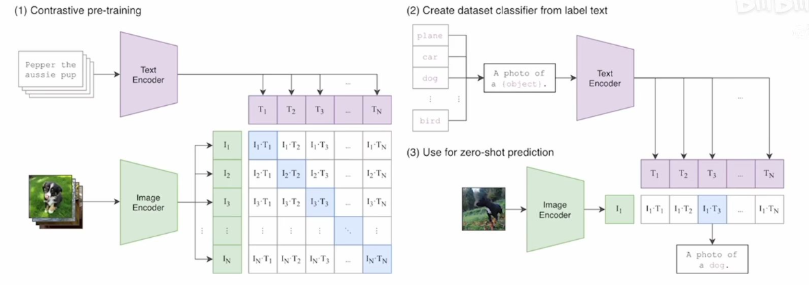
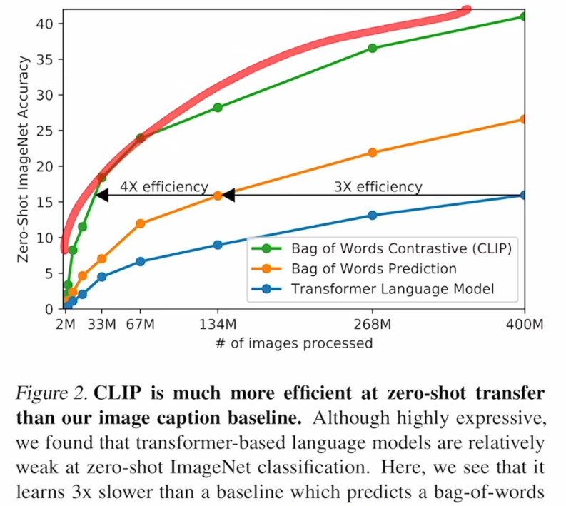
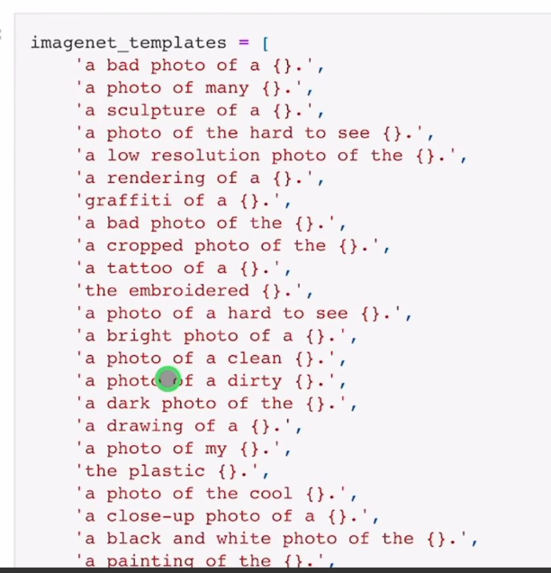
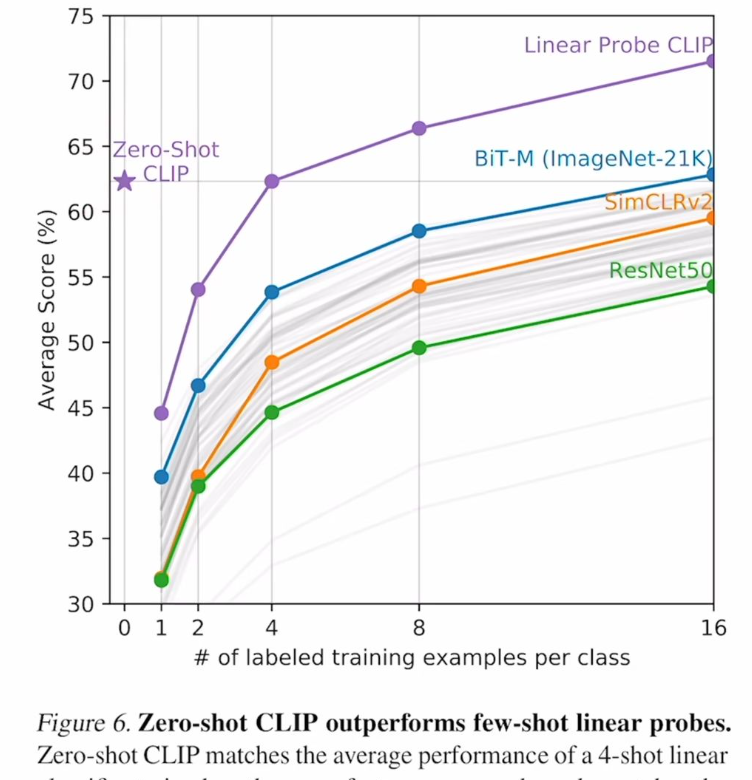
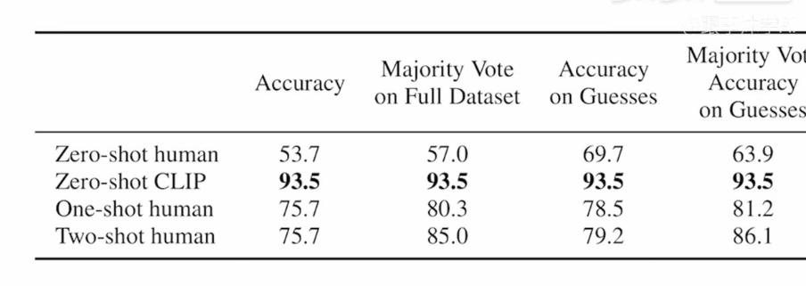
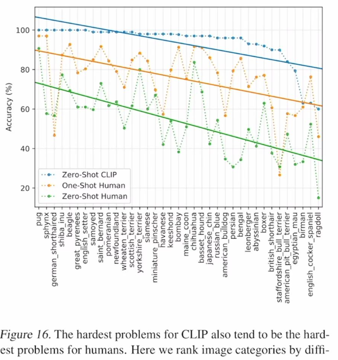

# CLIP

视频为：[CLIP论文视频精讲](https://www.bilibili.com/video/BV1SL4y1s7LQ/?spm_id_from=333.788.videopod.sections&vd_source=56e8908484ae6d7f0f89185181217d3e)

笔记来自：[评论区](https://www.bilibili.com/opus/725701958260752386?spm_id_from=333.1387.0.0)

官方代码：[GitHub](https://github.com/openai/CLIP)

中文版：[Chinese-CLIP](https://github.com/OFA-Sys/Chinese-CLIP)

2021年2月底提出，方法很简单，效果非常好（Zero-shot）

Clip如何进行预训练：

输入：图片+文字的配对

进入Encoder，生成特征

在特征上作对比学习

特征矩阵里获得正样本和负样本

**训练集**：4亿个图片和文本的配对，数据集清理的非常好。

Prompt template

Clip这篇论文后面提出了**prompt engineering**和prompt ensemble两种方式来提高模型的准确率。

识别图片的机制，是用图片给到图片编码器，再去和ImageNet的1000个分类词做相关性匹配，把相关性最大的词挑出来，即完成分类。

Clip的有趣应用:

1. 生成图
2. 物体分割和检测
3. 视频检索（可以做OCR了）
4. ...

因为迁移性好，就可以摆脱基础类的限制

论文标题：**利用自然语言的监督信号，训练迁移性好的视觉网络**

不需要特定领域的数据（或者少量数据）就可以实现很好的效果

大规模的没有标注的数据就可以拿来训练。

CONVIRT和CLIP非常像了，但只在医疗图像上做。

之前的那些方法没有这么大的数据集，没有这么多的算力， 没有这么大的模型，没有这么好的自监督训练的方式， 所以大家的效果都不好（特别是zero-shot）

**Mahajan et al.(2018)**搜集了Ins的图片+标签来作为数据集。【给了CLIP启发】

之前的这些方法，和借助NLP去学习图像表征的方法，最大的区别在**规模（数据的规模和模型的规模）**

accelerator year：加速器年，一种衡量算力的计算逻辑，方便做训练量对比。

CLIP论文里，把借助NLP去学习图像表征的方法们(**Mahajan et al.(2018)、**CONVIRT**这些**)，**规模给搞上去**！

CLIP这个模型，想法简单，实现高效，性能在各个数据集上又好，泛化性也不错。

CLIP如何预训练：

transformer出来后，NLP那边彻底革命了，出现了Deep contextual representation learning，就是具备上下文语义环境的学习方式。在这种自监督学习的范式下，NLP可以使用上取之不尽用之不竭的文本监督信号了。

35:20

为多模态的训练铺平了道路。

用自然语言信号来训练视觉模型，好处非常多

1. 你不需要再去标注这些数据了（这个过程很复杂），现在只需要去网上下载图片文字的配对，别的都不需要做，数据的规模很容易就变大。而且，因为监督信号是文本，比起N选1的标签，模型输入输出的自由度会大很多。
2. 由于训练的时候把图片和文字绑到了一起，所以学到的是一个多模态的特征，而不只是一个视觉特征。和语言联系在一起后，就很容易做zero-shot的迁移学习了。但如果只是做一种单模态的自监督学习的话，你都只能学到视觉的特征，而无法和自然语言联系到一起，这样还是很难去做zero-shot的迁移。

由于没有符合OpenAI要求的大数据集，选择自己做一个，这个新的大数据集不光带来了CLIP，还有DallE

4亿的数据集名称：WIT（WebImageText）

由于训练量太大，所以训练效率至关重要，把训练任务变成对比任务，训练效率提高了4倍

51:01

如何在很多的GPU上去训练超级大的模型，对应[翻译博文](https://mp.weixin.qq.com/s/3oR9DoIVq843_U_EzFSndA)

52:34

为什么要做Zero-shot Transfer，训练一个又大又好的模型，就可以不再训练或者不再微调。

57:46

Prompt engineering

为什么要做：

1. Prompt的多义性
2. 预训练时基本都是一个句子，很少是一个单词，可如果做推理的时候，输入只是单词，抽取出来的特征可能就不好

CLIP的解决方案：Prompt template：“A photo of a {label}”

使用了这个template后，准确度提升了1.3%

如果提前知道一些信息，对于zero-shot推理非常有帮助，比如：对于食物的训练集，"a type of food"

用了80个提示词模板，最后emsemble起来，

Linear Probe，冻住主体，抽特征，只微调分类头

对于难的任务，需要做few-shot迁移学习

fine-tune 微调

01:17:47

CLIP和人类的对比

37类狗的数据集，人类还是打不过CLIP

37类狗的种类数据单独拉出来

可以发现，人类觉得容易的，CLIP表现也好。人类觉得难的，CLIP也觉得难

-->**人工智能就是模仿人**

01:23:33

CLIP强，但没有那么强。如果想要在ImageNet上面达到头部算法的效果，还需要扩大1000倍的训练量，这是OpenAI都无法支撑的。

在有些数据集上Zero-shot也不行

对于抽象和难的任务效果也不好

CLIP的效果还是依赖于4亿的图片集，MNIST是几十年前提出的小数据集，CLIP的表现就很差，原因是训练数据内并没包含MNIST的图片。

第七个局限性：**爬下来的4亿个图片文字集，没有经过清洗和过滤过**，导致CLIP模型会带有社会的偏见。

01:31:24

Clip的研究动机，就是因为在NLP领域，利用大规模数据去预训练模型，而且用跟下游任务无关的训练方式（比如完形填空），在这两种工具的加持下，NLP获得了革命性的成功，比如GPT-3。

所以希望把NLP方面的成功复制到其他领域内，比如说视觉。应用了之后，发现效果确实不错。

CLIP工作最大的贡献，在于**打破了固定种类标签的范式**。

