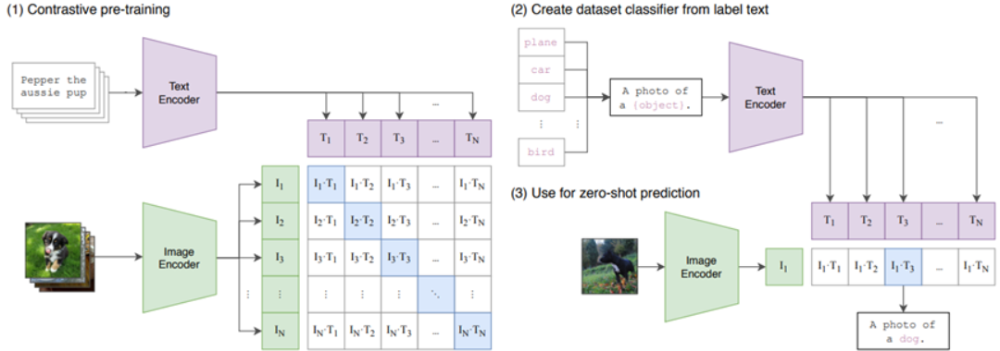

# CLIP改进工作串讲_上

多模态学习：

| 时间 | 名字       | 领域     | 简介                                   |
| :--: | :--------- | -------- | -------------------------------------- |
| 2021 | CLIP       |          | 图片和文本之间的对比学习               |
| 2021 | ViLT       |          | 第一个摆脱了目标检测的视觉文本模型     |
| 2021 | ViLD       | 目标检测 | CLIP蒸馏帮助开集目标检测               |
| 2021 | GLIP       | 目标检测 | 联合目标检测和文本定位                 |
| 2021 | CLIP4Clip  | 视频     | 拿CLIP直接做视频文本retrieval          |
| 2021 | ActionCLIP | 视频     | 用多模态对比学习有监督的做视频动作分类 |
| 2021 | PointCLIP  | 3D       | 3D变2D，巧妙利用CLIP做点云             |
| 2022 | LSeg       | 分割     | 有监督的开集分割                       |
| 2022 | GroupViT   | 分割     | 只用图像文本对也能无监督做分割         |
| 2022 | CLIPasso   | 图像生成 | CLIP跨界生成简笔画                     |
| 2022 | DepthCLIP  | 3D       | 用文本跨界估计深度                     |

# 回顾CLIP

用对比学习的方式学习一个视觉-语言的多模态模型。

1. 对比学习预训练，**文本和图片分别经过编码器得到特征**。对角线上为n个正样本对，其他位置为n2-1负样本对。**图片特征与文本特征建立了联系，此时模型从图片学到的特征可能不仅仅是图片本身的特征，还有文本的语义信息**。openAI自建大规模的数据集WIT（webimage text）
2. zero-shot推理，**prompt template**。单词变成句子（预训练时是句子，避免distribution gap），再经过预训练好的文本编码器，得到**文本特征**。
3. 测试图片经过预训练好的图片编码器，得到图片的特征。将图片特征与文本特征进行cos相似度计算，进行**匹配**。

与**图片对应的文本可以看做高级标签，文本与图像建立了联系，文本引导模型从图片中提取文本的语义信息。**

**本节主要讲分割和目标检测：**

分割：

+ LSeg：Language-Driven Semantic Segmentation
+ GroupViT: Semantic Segmentation Emerges from Text Supervision

目标检测：

+ ViLD: Open-Vocabulary Object Detection Via Vision and Language Knowledge Distillation
+ GLIP：Grounded Language-Image Pre-traing

# LSeg 

(Language-driven semantic segmentation) ICLR2022

第一行图中，能够完美的将狗和树分开，为了验证模型的容错能力，加一个汽车vehicle的标签，模型中也并没有出现汽车的轮廓。另一方面，模型也能区分子类父类，标签中不再给出dog而是给出pet，dog的轮廓同样可以被分割开来。

第三行图中，椅子、墙壁甚至地板和天花板这种极为相似的目标也被完美的分割开来。

如上图，与CLIP结构非常像，模型总揽图中图像和文本分别经过图像编码器（Image Encoder）和文本编码器（Text Encoder）得到密集dense的图像文本特征。此处密集的图像特征需进一步放大（up scaling）得到新的特征的图与原图大小一致，这一步也是为分割任务的实现。然后模型的输出与ground true的监督信号做一个交叉熵损失就可以训练起来了。Image Encoder的结构就是ViT+decoder，其中decoder的作用就是把一个bottleneck feature慢慢upscale上去。

这里的Loss不像CLIP使用对比学的loss，而是跟那些Ground True mask做的cross entropy loss，并非一个无监督训练。这篇论文的意义在于将文本的分支加入到传统的有监督分割的pipeline模型中。通过矩阵相乘将文本和图像结合起来了。训练时可以学到language aware（语言文本意识）的视觉特征。从而在最后推理的时候能使用文本的prompt任意的得到分割的效果。

本文中文本编码器的参数完全使用的CLIP的文本编码器的参数，因为分割任务的数据集都比较小（10-20万），为保证文本编码器的泛化性，就直接使用并锁住CLIP中文本编码器的参数。图像编码器使用Vit / DEit的预训练权重，使用CLIP的预训练权重效果不太好。

Spatial Regularization Blocks这个模块是简单的conv卷积或者DWconv，这一层进一步学习文本图像融合后的特征，理解文本与图像如何交互。后边的消融实验证明，两层Spatial Regularization Blocks效果最好，但是四层Spatial Regularization Blocks突然就崩了。其实Spatial Regularization Blocks这个模块对整个性能没有多大影响，可以先不去考虑。

PASCAL数据集上的结果，LSeg在zero-shot 上效果要好不少，但是对于1-shot来说还是差了15个点左右。如果使用大模型（ViT-L）也还是差了6个点左右。

本质上再算图像特征和文本特征之间的相似性，并不是真的再做一个分类，就会把dog识别成toy玩具狗。

# **Group ViT**

**（Semantic Segmentation Emerges from Text Supervision）CVPR2022**

LSeg来自文本的监督信号，并不依赖于Segmentation mask的手工标注。而是像CLIP一样利用图像文本对使用对比学习的方式进行无监督的训练。

视觉方面做分割，grouping是一种常用的方法。如果有一些聚类的中心点，从这些中心点开始发散，把周围相似的点逐渐扩散成一个group，那这个group即相当于一个Segmentation mask。

让模型在最初的时候能将周围相邻相似的像素点group起来，变成Segmentation mask。Group ViT的贡献就是在也有的ViT模型中加入Grouping Block，同时加入了可学习的Group Tokens。

图像编码器就是一个ViT，12层Transformer Layers。输入有两个部分，一个是来自原始图像的Patch Embedding，另外一个是可学习的Group Tokens。假设输入图像为224*224@3，每个patch的大小为16×16，得到14×14个196个长为384（**196****×384**）的序列。（384对应ViT-small，特征维度384）。另外一个输入Group Tokens初始设为**64****×384****，**64可以理解为64个聚类中心，代表每张图片有64个类别。6层Transformer Layers交汇之后认为Group Tokens学的已经差不多了，聚类中心也学的不错了，加入一个Grouping Block聚类一下，合并称为更大的Group，学到一些更有语义的信息。利用Grouping Block将图像（Patch Embedding）上的直接assign到64个Group Tokens上。相当于做了一次聚类的分配。

Grouping Block先用类似自注意力的方式算了一下相似度矩阵，然后利用相似度矩阵帮助聚类中心的分配，并将196×684降维到64×384。聚类中心分配过程不可导，利用**gumbel softmax**将该过程变成可导的。第二阶段使用8个Group Tokens将相似的类别进一步合并，将64个Group合并为8个Group。目前图像被分成了8大块，每个块代表一个类别的特征。然后与CLIP一致，通过图像文本对算一个对比学习的loss，然后训练。CLIP中，一个文本对应一张图像的特征，很容易算一个对比学习的loss。但是现在文本端为一个特征，图像端则为8×384的8个特征，无法与文本特征匹配。作者使用了Avg Pooling的方式。得到一个1×384的特征，这样文本特征和图像特征就可以匹配起来了。

接下来看模型如果做zero-shot的推理过程。文本和图像分别经过各自的编码器得到文本特征和图像特征，然后计算相似度，得到最匹配的图像文本对。局限性在于最后的聚类中心（Group Tokens）只有8类，从一张图像中最多分割出八个目标。

作者也做了消融实验，发现64-8的组合效果最好。

每个阶段可视化如图所示，第一阶段中Group5的类别为眼睛，图中确实可以将不同生物眼睛很好的分割出来。第二阶段对应大的目标区域，第三行第二阶段Group6对应类别草地，草地也被较好的分割出来。Grouping Token起到了聚类中心的作用，用Grouping这种思想完成无监督的分割。

与baselin方法比起来确实有提升，第一个用文本做监督信号的工作。还可以做zero-shot 的推理。但是对于有监督的模型如DeepLabV3plus已经达到了87左右的mlou，高了30多个点。分数差这么多的一个重要原因是，受限于CLIP的约束，该方法在分割领域的效果很好，在分类领域效果则不行，如果直接将正确的分类放到分割的物体上，则模型效果有大大的提高。

未来工作，一是没有使用dense prediction的特性，如空洞卷积、金字塔池化以及U-Net的结构，从而获取更多的上下文信息和多尺度信息。另一方面是推理过程中，作者设定了相似度阈值0.9，对于相似度小于0.9的阈值，则认为是背景类。

# **ViLD**

**（Open-Vocabulary Object Detection via Vision and Language Knowledge Distillation)  ICLR 2022**

基于视觉语言（图像文本）知识蒸馏的目标检测

CLIP模型当成teacher模型，去蒸馏自己的模型，从而达到zero-shot。

模型具有检测新类别的能力。

baseline方法是一个Mask R-CNN由两阶段组成，一是生成proposal，然后筛选pospoal，第二步是进过分类头为每个pospoal确定目标类别。目标检测目标函数两部分，一部分是分类损失一部分是边界框回归参数（框定位）。**文本来自物体的类别，是有监督的学习。**

**ViLD-Text****模型将图像特征和文本特征联系到一起，但是open vocabulary****（zero-shot****）的能力还有待加强。文本端模型参数锁住。然后文本特征与图像特征做点乘，得到相似度就可以计算交叉熵，进而训练模型。**

图像**region embedding****和背景以及文本特征**做点乘计算相似度。这里**ViLD-Text**只是把图像特征和文本特征做了一下关联，这样就可以做zero-shot了。

ViLD-image右侧这里将M个proposal（这里M个相对于ViLD-Text中N个proposals更少了，**M个是从N个中通过RPN预抽取出来的**，这样做可以加速计算）经过裁剪和resize后送进CLIP中预训练好的图像编码器，得到M个image embedding（图像特征）。上述过程可以理解为将筛选后的每个proposal看做一个图像并提取特征。这里使用CLIP提取的proposal的特征看做伪标签，也就是groun true。右侧也就是知识蒸馏中的teacher网络。

另一边，将M个proposal送进目标检测的框架，希望这边抽出的特征与teacher网络（CLIP图像编码器抽取的特征）那边的特征尽可能一致。这样一来，**监督信号就是CLIP中图像编码器抽取的特征，不再是人工标注的特征。因此，就不再受基础类的限制了，proposal既可以来自基础类Bade Category，也可以来自New Category。监督信号是CLIP里来的，而不是人工标注来的。**

ViLD-image与ViLD-text结合起来即为ViLD。右侧为teacher网络，只有训练的时候抽取伪标签用，测试的时候用不到。左侧将N+M个proposal同时输入进目标检测框架，然后分开，M一端抽取的特征与右侧teacher网络的伪标签计算L1-loss。N一端用于抽取每个proposal的特征并与文本和背景配对计算交叉熵损失。

模型总览如上图，训练过程：一张图像经过backbone和RPN抽取proposal，然后每个proposal通过conv抽取region embedding。同时，经过裁剪和resize的proposal经过CLIP预训练好的图像编码器得到image embedding作为伪标签。然后region embedding与image embedding计算L1-loss。与此同时，文本信息经过文本编码器得到text embedding，region embedding与text embedding点乘计算相似度进一步计算交叉熵损失来匹配图像文本对。

测试过程：region embedding与text embedding（可以有新类）去匹配。

这个数据集有很多特别小或者不常见的物体，因此对这些物体标注也很少。APr就是对这种特别小的物体的检测结果。可以看出ViLD表现还是很好的，已经超过了监督学习+RFS的方法(这里这些小物体本来标注就很少，即使是基督的方式，模型看到的也不多，甚至可能产生误导)。

# **GLIP_V1/V2**

**（Ground Language-Image Pre-train）CVPR2022**

vision grounding任务：给你一句话，你去把这句话里的物体在当前图片中定位出来。就类似一个目标检测任务。

CLIP是一个图像文本配对任务。

将两个任务结合起来，再加入伪标签（self training），这样模型就可以在没有标注过的图像文本对上生成bbox标签。从而扩张整个训练数据集的数量。

图像先经过图像编码器得到目标/区域特征O，然后经过一个分类头，也就是乘权重矩阵W得到输出类别的logits Scls，然后计算Scls与真实类别的交叉熵损失。

grounding模型中，作者计算了匹配分数，看图像中的区域怎么与句子中的单词匹配上（点乘相似度）。

图像和句子分别经过各自的编码器得到各自的特征image embedding和text embedd，然后计算匹配度，其实就是ViLD中的ViLD-text分支。

经过理论验证，vision grounding与检测这两个任务是可以统一起来的，然后又经过实验，在COCO上的分数也是完全匹配的。GLIP是完全可以迁移到任何一个目标检测的数据集上得。接下来就是看如何扩大数据集，如何将预训练模型训练的更好。

图像过图像编码器得到image embedding，文本过文本编码器得到text embedding。

Deep Fusion：当文本特征和图像特征被抽取之后，理论上可以直接计算相似度矩阵。但是直接算的话，图像文本的joint embedding space（结合后的特征空间）还没有学的很好（Lseg通过conv继续学习）。多加一些层数融合一下，相似的概念拉近一些，关联性更强，最后算相似度也更有针对性。具体就是用cross attention交互了一下。

目标函数，有监督的方式，时时刻刻都有bbox，抽取出的目标/区域特征模型是知道和哪个单词对应的。算完点乘后可以去算Alignment loss（匹配损失）。这样就完成了文本和图像特征的融合，接下来就可以做zero-shot。对于定位location-loss来说，算一个最基本的L1-loss就可以了。

作者展示了两个非常难的任务，一是检测两个针管和一瓶疫苗。现有的数据集中似乎没有针管和疫苗这种类别。但是GLIP自己做出来对文本的理解，给出了疫苗和针管的检测结果。下边这个例子是一张图片的描述，都是一些比较抽象的概念，但是GLIP也能做得很好。 

最新的很多工作DyHead和SoftTeacher没有zero-shot能力，但是经过微调后在COCO数据集上能够达到60左右的AP。GLIP-L具有zero-shot 的能力，能够达到将近50的AP，而且微调后也能达到60多一点的AP。整体来看效果还是不错的。

来自：https://www.bilibili.com/opus/710512153576079460?spm_id_from=333.999.0.0
