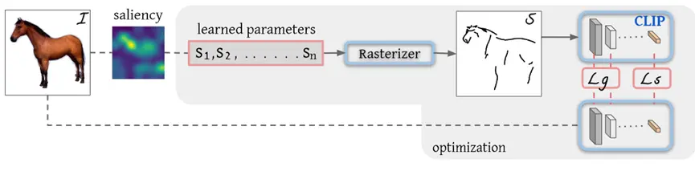
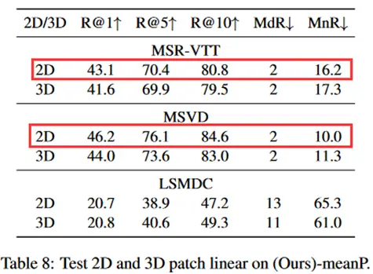

# CLIP改进工作串讲_下

本节拓展到图像生成、视频、语音和3D领域

图像生成：

+ CLIPasso：Semantically-Aware Object Sketching

视频领域：

+ CLIP4Clip：An Empirical Study of CLIP for End to End Video Clip Retrieval
+ ActionCLIP: A New Paradigm for Video Action Recognition

下游任务：

+ How Much Can CLIP Benefit Vision-and-Language Task?

语音领域

+ AudioCLIP: Extending CLIP to Image, Text and Audio

3D领域：

+ PointCLIP: Point Cloud Understanding by CLIP

+ Can Language Understand Depth?

CLIPasso中文献14：https://distill.pub/2021/multimodal-neurons/，将CLIP模型分析的很透彻，值得一读

# CLIPasso

**Semantically-Aware Object Sketching**

**图像生成抽象的简笔画**

保持语义信息的物体素描：**图片变成简笔画的形式，可生成各种层次的主要轮廓并且保留其主要视觉特征。**不仅要把原来的物体变成一个非常简单的形象，也要保证观众能不能看出这到底是个什么物体，这就需要模型抓住**原来物体最关键的一些特征**。

相关工作：之前的研究都是去收集好的、抽象层次固定的数据集，这属于一种**data driven****的方式**，这种方式生成的**素描画风格和形式就收到了限制**。这就违背了图像生成的初衷（不同层次）。另一方面，使用固定的数据集还有一个劣势，就是**种类不能很丰富**，现有的素描数据集种类非常有限。

那么如何摆脱对于有监督数据集的依赖呢？如何寻找一个图像的语义信息抽取的特别好的模型呢？答案就是CLIP！由于**图像语义配对的学习方式，对物体的语义信息抓取的特别好，而且又有出色的zero-shot能力。CLIP不受图像风格的限制，始终都能把图像特征编码的非常好。**

能通过控制笔画的多少，生成不同层次的简笔画。

主体部分：任务就是**在白纸上随机生成Bezier曲线，然后通过不停的训练，这些曲线就组合成了简笔画。**

贝兹（Bezier）曲线就是空间中一系列点控制的曲线（学过CAD的朋友应该了解），在二维空间中的点（x，y），**每条线由四点个（p1~p4）控制**。通过模型的训练更改四个点的位置来控制Bezier曲线，最后生成简笔画。

随机生成了笔画为n的Bezier曲线，然后通过Rsaterizer（光栅化器）将笔画映射到二维画布上。**文章的贡献有两点，前边是如何选择更好的初始化，后边是选择了一个更合适的损失函数。**

得到了初步的简笔画，**把CLIP模型作为teacher网络，生成伪标签（Ground True），然后用来蒸馏自己的模型。**这里借助了CLIP模型的稳健性，如果说**初步的简笔画和CLIP输入的原始图像都是一个物体（如上图中都是马），那么经过CLIP后应该都是对马这个物体的描述，两者因尽可能接近。**因此就可以将CLIP的image embedding作为伪标签也就是ground true计算损失函数。

作者在原文中也说得很清楚，直接使用一个预训好的CLIP的图像编码器，不需要进一步训练就可以提取自然图像和简笔画。另外，预训好的CLIP的图像编码器由于通过图像文本匹配的方法训练好了，就可以提取出高级的语义信息。**损失就是通过余弦相似度计算，**生成简笔画与原始图像经过CLIP图像编码后越相似，损失越小。

除了高级的语义描述要尽可能一致外，低层次的空间信息（动作或位置、结构）也应该相似。为了测量这种几何上的相似性，使用L2损失。**这里是把模型的前几层拿出来算目标函数**，比如Res50，将Res-Layer2、Res-Layer3、Res-Layer4这些层的特征拿出来算目标函数。因为**前边层的特征有长宽的概念，对位置（几何）比较敏感。**用这些特征去算loss，就能保证几何形状，物体的朝向的一致性。最终的目标函数就是将两者相加，**两者结合保证了物体语义上、几何上的一致性。**

再一个就是贝兹（Bezier）曲线初始化，最开始的点放在哪很有讲究。就需要一个比较稳定的初始化方式，才能让模型更普适。作者提出**基于saliency的初始化方式，具体来说就是用一个训练好的ViT，把最后一个多头自注意力取加权平均做成saliency MAP，**就在这些映射上去看哪些特征更显著，然后在显著的区域上去采点。你在**显著性的区域上采点**，就是你已经知道了一个物体，或者说你已经沿着这个物体的边界去画贝兹曲线了。因此，你初始化的简笔画以及很不错了，与你最后的简笔画相差不多了。

模型一共训练2000次迭代，但在100次迭代时就差不多收敛了，轮廓已经比较明显。这篇文章还有一个很好的点就是模型训练很快。只用一张V100的GPU就能在六分钟完成2000次迭代。

使用注意力采点的初始化后，眼睛等细致的关键特征就在简笔画中体现出来。对比Proposed图和采点图已经非常相似了，这说明一个好的初始化还是非常重要的。

后处理这边是模型每次都生成三个简笔画，然后计算三个loss，最终去最小的loss的简笔画作为最终的输出。

文章主要有以下两个买点：

1. CLIP Passo不受物体类别限制，可以为不常见的物体生成简笔画。
2. CLIP Passo可以通过**控制笔画数量**来达到任何程度的抽象。

与其他方法相比，CLIP Passo更具备语义信息，更能抓住物体的本质。值得一提的是，右下角CLIP Passo感觉并不如其他方法生成的好，CLIP Passo没有把眼睛生成出来，头发也有些许的草率，或许是更为抽象吧~。

局限性：

1. **图像有背景的时候，CLIP Passo效果就会差一些。**CLIP Passo还是比较依赖自注意力初始化的，如果一张图像很复杂，那么**注意力可能就不在要描述的物体上了，初始化时注意力采点可能就会采到其他物体上，**初始化就比较差，最终的效果也就不会好。也就是说抗干扰性要差一些。文中采用的方法就是automati mask，取出前景，遮住背景，然后送进CLIP Passo。这就复杂了一些，变成了two-stage 的模型，如果能提出新的loss能把带背景或噪声的图片解决的很好，那也是很有意义的。
2. CLIP Passo初始化时，**笔画都是同时生成的，不像人一样是一笔一笔序列式生成的**（有前后顺序，下一笔参考上一笔）。

# CLIP4clip

**An Empirical Study of CLIP for End to End Video Clip R**

视频检索，CLIP4clip中CLIP指OpenAI的CLIP模型，clip指的是视频中的clip。CLIP模型很适合做Retrieval（检索）任务，因为它就是做图像和文本之间相似性，根据相似性可以去做ranking、matching以及retrieve等任务。而且由于双塔结构（图像文本编码器分开），得到的image embedding和text embedding做一步点乘就可以计算相似度，因此非常容易扩展。

文本这边没什么区别，就是文本信息经过文本编码器得到text embedding。**视频这边多了时间维度，由一个个视频帧组成**。n个视频帧每一帧打成patch作为编码器输入，得到n个CLS Token（对应帧数）。一个文本特征对应n个图像特征。

本文是一个Empirical Study，就把以往的方法都尝试了一遍，选出来最好的。主要尝试了**三种维度不匹配的相似度方式**。

第一种最简单的方式，不带任何参数（不需要学习），用了一个**平均池化操作，在时间维度上取平均，**这样文本信息和视频信息的维度就对应起来了，就可以计算相似度了。但是这种方法没有考虑时序的特性，也就是前后帧之间先后关系。例如一个人坐下和站起是两个相反的过程，但是使用平均池化的操作就很可能无法识别出两个动作的区别。即使如此，这种方式也是目前最被接受的方式。

第二种方式意在把时序性融合进去，时序建模常用LSTM，将n个帧的特征作为LSTM的输入，最后的输出就是与文本特征维度对应的一个特征，而且融合了时序信息。现在使用**加入了位置信息（position embedding）的Transformer代替LSTM来提取具有时序信息的特征。**

第二种方式融合的时候是Late Fusion，就是后期融合，文本和图像特征抽完之后再去融合。第三种方式就考虑将**一个文本特征先和n个帧的视频图像特征融合，然后通过一个MLP去算相似度。这样不仅实现了时序信息的融合，还实现了文本和视频帧的融合。最后所有的特征（1个文本特征和n个视频帧的图像特征）都变成一个特征，然后去算相似度。**

公式中T代表类别编码，有文本类别和视频帧类别两种，P代表位置编码。然后通过两个全连接层（FC）中间加一个Rule激活函数计算相似度。

在MSR-VTT数据集上结果如图，CLIP4clip的方法Recall 达到了40左右的结果，相较于其他方法提升了20多个点。

图b是zero-shot的结果，MIL-NCE的方法CLIP的方法进行比较，数据集规模分别是100million和400million，差不得不多。但是使用了CLIP直接zero-shot就有了31.2的点，比原来方法都要高。CLIP模型迁移性很好，直接拿来视频这边也表现很好。

图c主要是想说明M的数据量的情况，表a在7k个训练数据上训练，表c在9k个训练数据上训练。随着训练数据的增加，结果又能提升。对比三种求相似度的方式，在少量训练数据情况下，取平均的方式最好达到了42.1个点。因为**CLIP在400million数据集上做预训练，如果下游任务数据不够多，不建议去做参数的改变，因此不带参数的平均池化的方式最有效**。而随着训练数据的增加9k，采用带有位置编码的Transformer效果最好，达到了44.5个点。这种现象在其他数据集也有类似现象，**Mean pooling效果一般是最好的。**

结论，作者就是使用预训练好的CLIP在video text retrieval领域。首先，使用了三种计算相似度的方式，mean pooling的效果简单高效，早起融合的tighr type反而效果不好，这很可能是下游任务数据太少造成的过拟合等问题（下游任务数据少，模型非常复杂）。其次，图像转到视频，存在domain gap（域偏差），如果视频这边找到足够多的数据集再去预训练，这样迁移的效果会更好。另外，作者尝试了2Dpatch和3Dpatch（老师这里应该是口误了，原文表8以及4.7节说明了**2Dpatch效果要好一些**）。最后，CLIP用在video text retrieval领域学习率是一个非常敏感的参数。

原文中表8以及4.7节说明，我们认为3D patch能提取每一帧间的时序信息并生成更好的区分特征，因此3D patch会有更好的表现。但是结果与我们所期望的不一致，**3D patch** **产生了比2D patch更为糟糕worse的结果。**作者也给出了解释，原因就是**CLIP预训练就是在2D图像上预训练的**，这种差异就造成了使用3D进行初始化时很难学到时序信息。

# ActionCLIP

ActionCLIP:A New Paradigm for Video Action Recognition

动作识别，实际上是一个分类任务

# CLIP-ViL

How Much Can CLIP Benefit Vision-and-Language Tasks?

将CLIP用回Vision Language下游任务

CLIP模型做预训练参数，仍然能提高下游Vision Language task的准确度

拿CLIP模型，做视觉编码器的初始化参数

# AudioCLIP

语音领域的应用，增加语音模态，灵活，简单

# PointCLIP

PointCLIP:Point Cloud Understanding by CLIP

CVPR

将3D图像投射到2D平面上

# DepthCLIP

Can Language Understand Depth?

CLIP能否应用到深度领域

把深度估计看为分类问题

来自：https://www.bilibili.com/opus/710512153576079460?spm_id_from=333.999.0.0