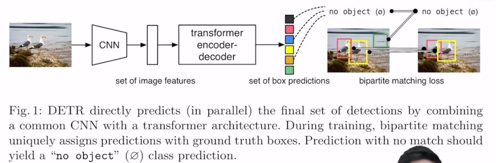
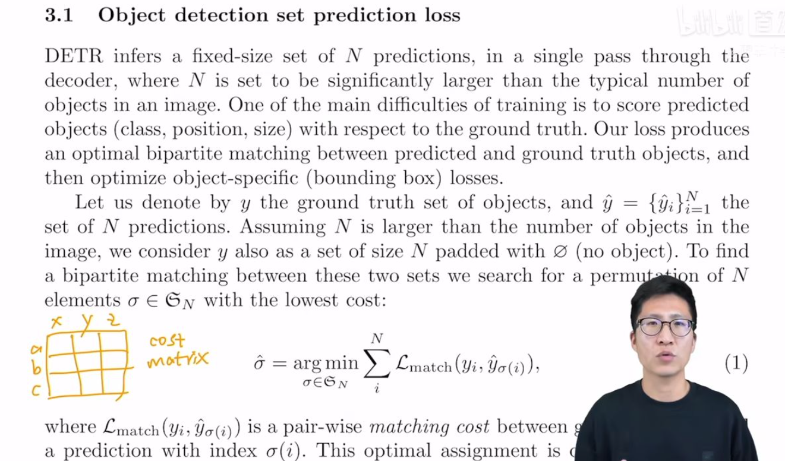
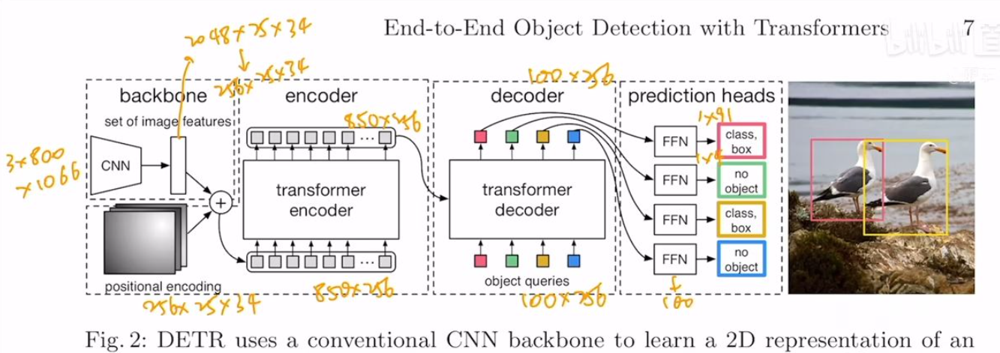
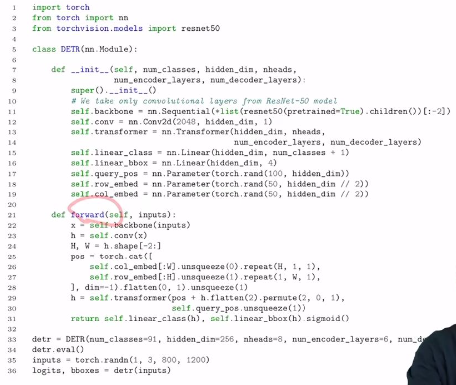
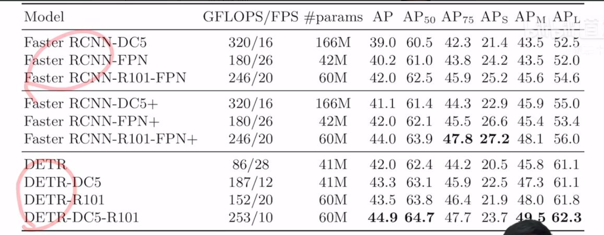
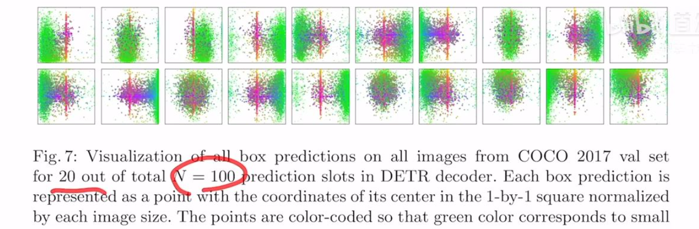

# DETR

End-to-End Object Detection with Transformers

# 1.前言

1、大家为什么喜欢他？

2、为什么他是目标检测领域的里程碑式的工作？

3、为什么是一个全新架构？

文章题目：简单明了，包含两个关键词：端到端、transformer

目标检测领域：从目标检测开始火到detr都很少有端到端的方法，大部分方法最后至少需要后处理操作（NMS, non-maximum suppression非极大值抑制）

无论是proposal based方法、anchor based方法、non-anchor based方法，最后都会生成很多预测框，如何去除这些冗余的框就是NMS要做的事情，

问题：

1、而有了NMS，模型调参就会很复杂，

2、而且即使训练好了一个模型，部署起来也非常困难（NMS不是所有硬件都支持）

所以一个简单的、端到端模型一直是大家梦寐以求的，detr解决了这些痛点

1. 不需要proposal、不需要anchor，直接利用transformer这种全局建模的能力，把目标检测看做是集合预测问题
2. 因为有了这种全局建模的能力，detr不会有那么多冗余框，最后出什么结果就是什么结果，不需要NMS做后处理，让模型的训练和部署简单不少

目的：不想让大家觉得目标检测是比图像分类难很多的任务，都可以用简单的，优雅的框架做出来

作者团队：来自Facebook AI（meta AI）

# 2.摘要

集合预测：目标检测本来任务就是给定一个图像，预测一堆框，每个框不仅要知道的其坐标，还要知道框里包含物体的类别，这些框就是一个集合，不同的图像对应的集合也是不同的，**给定一个图片，我要预测这个集合**

贡献：

1. 把目标检测做成一个端到端的框架，把之前特别依赖人的先验知识的部分删掉了（NMS部分、anchor），一旦把这两个部分拿掉之后，我们也不用费尽心思设计这种anchor，最后不会出现这么多框，不会用到NMS，也不会用到很多超参去调
2. 提出新的目标函数，通过二分图匹配的方式，强制模型输出一组独一无二的预测（没有那么多冗余框，每个物体理想状态下就会生成一个框）
3. 使用encoder-decoder的架构 

两个小贡献：

1. decoder还有另外一个输入learned object query，类似anchor的意思（给定这些object query之后，detr就可以把learned object query和全局图像信息结合一起，通过不同的做注意力操作，从而让模型直接输出最后的一组预测框）
2. 想法&&实效性：并行比串行更合适，并不是检测一个大物体前必须先检测一个小物体，或从左到右检测，我们希望越快越好

DETR的好处：

1. 简单性：想法上简单，不需要一个特殊的library，只要硬件支持transformer或CNN，就一定支持detr
2. 性能：在coco数据集上，detr和一个训练非常好的faster RCNN基线网络取得了差不多的效果，模型内存和速度也和faster RCNN差不多
3. 想法好，解决了目标检测领域很多痛点，写作好
4. 别的任务：全景分割任务上detr效果很好，detr能够非常简单拓展到其他任务上
5. Facebook research的代码一般都非常好

# 3.引言

1. 目标检测任务：对每一个感兴趣的物体，去预测一些框，和物体类别，就是一个集合预测问题
2. 现在大多数好用的目标检测器，都是用间接的方式去处理集合预测问题，（1）比如proposal方式（如RCNN系列工作），（2）anchor方式（YOLO系列，focal loss），non-anchor based方法（物体中心点center net，FCOS），他们都没有直接做集合预测任务，而是设计一个替代（回归、分类）解决目标检测问题。所有这些方法性能受限于后处理操作（NMS），由于用了anchor和NMS导致检测器都非常复杂，难以优化和调参
3. 端到端的思想已经在别的很多任务里大范围使用，而且使任务更加简单好用，我们不要先验知识，就是要用一个端到端网络

**DERT训练流程：**

1. CNN提特征 
2. 特征拉直，送到encoder-decoder中，encoder作用：进一步学习全局信息，为近下来的decoder，也就是最后出预测框做铺垫
3. decoder生成框的输出，当你有了图像特征之后，还会有一个object query（限定了你要出多少框），通过query和特征在decoder里进行自注意力操作，得到输出的框（文中是100，无论是什么图片都会预测100个框）
4. loss ：二分图匹配，计算100个预测的框和2个GT框的matching loss，决定100个预测框哪两个是独一无二对应到红黄色的GT框，匹配的框去算目标检测的loss

**推理**：

1、2、3一致，第四步loss不需要，直接在最后的输出上用一个阈值卡一个输出的置信度，置信度比较大（>0.7的）保留，置信度小于0.7的当做背景物体

15:50 结果

1. detr对大物体预测很准，归功于transformer，能进行全局建模（原来使用anchor的话就会受限于anchor大小）
2. 缺陷：对小物体效果不好（多尺度、多特征，可以提高小物体的检测）
3. detr训练很慢，500个epoch（coco大多数模型一般训练几十个epoch就行）

# 4.相关工作

19:18

目标检测：

根据初始猜测做预测：

+ two-stage:初始猜测是中间的proposal
+ one-stage:初始猜测是anchor或物体中心点

最近一篇论文做了详细比较，发现他们的性能和刚开始的初始猜测非常相关，怎么做后处理对性能影响至关重要

怎么后处理：

+ 集合思想：可学习的NMS方法、关系型网络，可以利用自注意力方法去处理物体之间的联系，得出独一无二的预测，就不需要后处理的步骤（性能较低）

  解决：人工干预：手工设计的场景特征帮助模型学习，但是detr目标是想让目标检测任务更加简单，不希望用到过多人工先验知识

+ 循环检测器：encoder-decoder

  让detr工作主要原因：transformer

# 5.方法

分两块：

1. 基于集合的目标函数怎么做，作者如何通过二分图匹配把预测的框和GT框连接在一起，算得目标函数
2. detr具体模型架构

24:01

目标函数部分

detr模型最后输出是一个固定集合，无论图片是什么，最后都会输出n个（本文n=100）

问题：detr每次都会出100个输出，但是实际上一个图片的GT的bounding box可能只有几个，如何匹配？如何计算loss？怎么知道哪个预测框对应GT框？

25:07

百科举例：分配工人干活，让最后之处最小

scipy包提供的linear sum assignment

26:33

detr论文里：代码也用的linear sum assignment函数

a,b,c看成100个预测框，x,y,z看成GT框，损失矩阵未必都是正方形

27:02

损失矩阵的值应该放些什么？loss包含两部分：分类loss、出框的准确度

29:56

detr主体网络框架（图2：图1的升级版）

35:40

真代码（简化版）

# 6.实验

表1detr和faster RCNN的对比

+表示用更好的训练策略把三个模型重新训练一遍

gflops参数：每秒进行的浮点运算次数

gflops越小，模型越小，跑起来越快？X

如果更关心速度，比较fps

41:24

检测效果

detr由于使用transformer全局建模，没有用anchor，想检测多大物体就检测多大，所以检测大物体效果较好

detr框架太简单，没有多尺度特征，没有FPN，没有复杂的目标检测头，所以在小目标检测效果不好

42:18 水论文技巧

44:45

结论

45:02

decoder

47:22

object query可视化（n=100，这里只有20个）

到底学了什么（绿色代表小的bounding box，红色代表大的横向bounding box，蓝色代表大的竖向bounding box）object query和anchor有些像，anchor是提前定一些bounding box，把预测和这些提前定好的bounding box对比，object query是可以学习的

来自：[B站](https://www.bilibili.com/opus/711637847320297504?spm_id_from=333.1387.0.0)