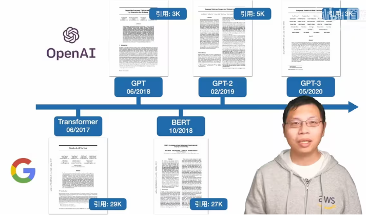
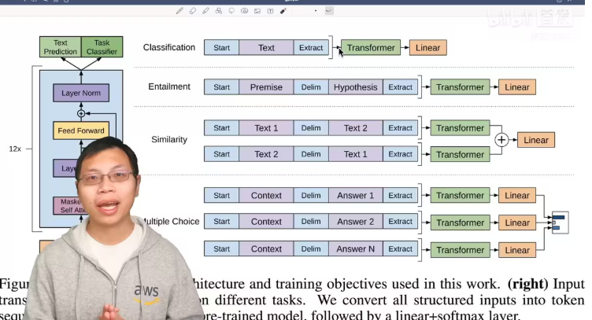

# GPT、GPT-2、GPT-3论文精读

05：52

GPT2，搜集了更大的数据集，训练了一个更大的模型。

GPT3比GPT2数据和模型都大了一百倍，暴力出奇迹。

OpenAI想解决更大的问题。

10:16 

# GPT

**Improving Language Understanding by Generative Pre-Training**

使用通用的预训练来提升语言的理解能力

ImageNe有标号的图片和文字对应关系的数据集，100万的量

换算到文本，1张图片的信息对等于10个句子，意味着自然语言处理需要1000万的标好的数据集才能够进行训练。

之前都是计算机视觉在引领潮流，现在来到了自然语言处理届，然后很多创新优惠反馈回CV。

CLIP打通了文本和图像。

16:46 半监督学习（自监督学习）

核心思想：

我有一些标好的数据，但我还有大量的相似的没有标好的数据，我怎么样把这些没有标好的数据用过来，这就是半监督学习想学习的东西。

半监督学习现在被统称为自监督学习（Self supervised Learning）

CLIP里面也是同样的算法。

20:09

Transformer的解码器，只看当前词和词之前的信息，不看后面的词。

Bert是完形填空，GPT是预测未来（预测开放式的结局）。难，但是未来很牛逼。

比如股票的信息~

 这是作者为何一直不断的把模型做大，一直不断努力最后才能做出GPT3。选择了更难的技术路线，但很可能天花板就更高。

GPT是预训练模型，是Transformer的解码器。

26:20

第一行是分类

第二行是蕴含，下一句的假设是否被上一句的事实所支持。比如上一句是A送B玫瑰，下一句是A喜欢B。

第三行是相似

第四行，多选题，选答案。算置信度，选最大的那个。

都可以构造成序列，预训练好Transformer的模型，不变。

用的12层解码器，每一层768个维度。

31:38 Bert

33:19 

# GPT-2

**Language Models are Unsupervised Multitask Learners**

语言模型是无监督的多任务学习器

GPT-2 15亿参数，百万网页的数据集：WebText。

**Zero-Shot**：

现在的模型，泛化性不好，一个数据集在一个应用上面不错，但不好应用在另一个应用。举例，我拿来写情书OK，但写PRD不OK。

Multitask Learning，多任务学习，训练一个模型的时候，同时看多个数据集。但在NLP上用的不多。

现在流行的还是，预训练，然后再对每一个任务做有监督的学习的微调。**这样的问题就是对于每一个任务都需要重新微调，以及要导入有标号的数据。**

Common Crawl，这是有一群人写的一个网络爬虫，不断的去网上抓取网页。TB级的数量级，但数据需要清洗，很麻烦。

后面用Reddit，大家可以自主的放网页上去，大家可以投票，Karma是用户对帖子的评价，选取有3个Karma的帖子，拿到4500万的链接，一共有800万个文档，40GB的文字

GPT2在很多任务上得分并不高，更多地看起来还是在讲Zero-Shot的问题。

46:09 

# GPT-3

**Language Models are Few-Shot Learners**

语言模型是few shot learners

GPT2在子任务上不提供任何的样本，直接使用预训练模型去对子任务做预测。

一篇论文的价值取决于你的**新意度\*有效性\*问题的大小**

所以还是要回到few-shot上面来，

自回归模型，1750亿个可学习的参数，

**GPT3可以生成一些新闻的文章，人类很难分辨**。

微调问题：

1. 对于每一次都需要一些标号的数据；
2. 微调效果好，不一定模型的泛化性能好
3. 人类不需要很大的数据集来学会绝大部分的语言任务

“In-Context learning”：GPT3因为模型太大了，更新不了，所以不会去更新所谓的权重。

评估GPT3：

1. few-shot：每个子任务提供10-100个训练样本；
2. one-shot：1个样本
3. zero-shot：0个样本

01:22:43 GPT3局限性

长文本比较弱，写小说就不行。

结构和算法上的局限性，只能往前看。

对于词的预测是平均的，不知道什么词才是重点。虚词。

视频、真实世界的物理交互是无法理解的

样本有效性不够

训练起来非常的贵

**无法解释，不知道为何得出的输出**

负面：

1. 可能会被用来做坏事
2. 散布一些不实的消息
3. 论文造假
4. 公平性、偏见
5. 性别

b. 种族

c.宗教

能耗

来自：https://www.bilibili.com/opus/759858244076175397?spm_id_from=333.1387.0.0