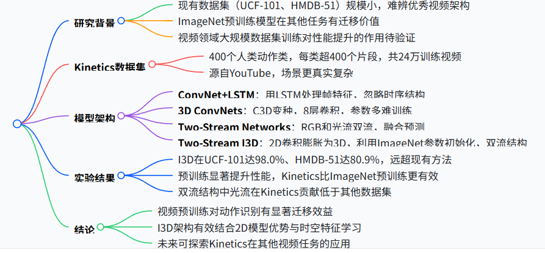
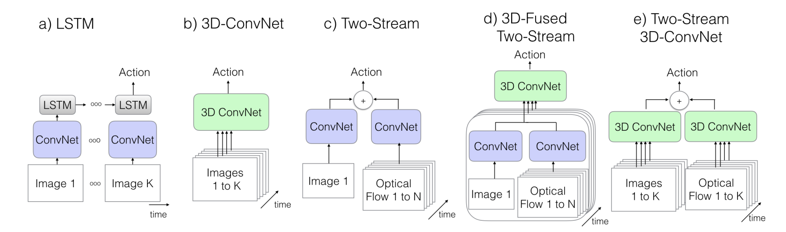
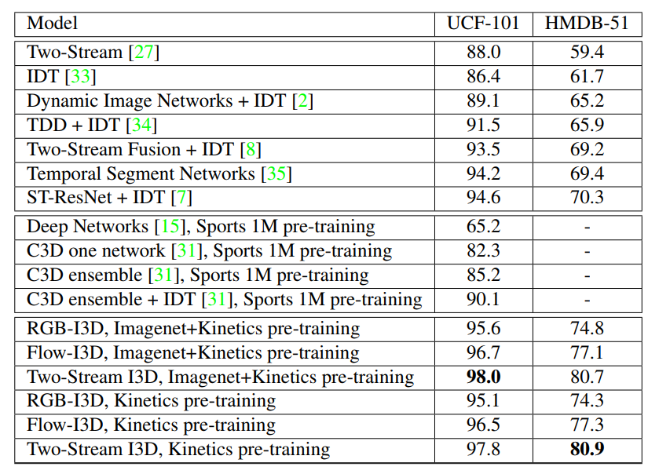

# I3D

Quo Vadis,Action Recognition?A New Model and the Kinetics Datasei

提出 **Kinetics Dataset** 数据集

# Abstract

当前动作分类数据集（如 UCF-101 和 HMDB-51）视频数量有限，导致难以确定优秀的视频架构，而本文借助新的 Kinetics 人类动作视频数据集（400 个人类动作类别，每类超 400 个片段，源自 YouTube）重新评估了现有先进架构，并引入**Two-Stream Inflated 3D ConvNet（I3D）**，该模型通过将 2D 卷积网络的滤波器和池化核膨胀为 3D（即将3\*3的卷积核膨胀为3\*3\*3），利用 ImageNet 架构设计及参数学习时空特征提取器。实验表明，在 Kinetics 上预训练后，I3D 模型显著提升了动作分类性能，在 HMDB-51 达 80.9%、UCF-101 达 98.0%。

# 研究背景与目标

1. **现有数据集局限**：UCF-101 和 HMDB-51 等动作分类数据集视频数量少（约 1 万视频），导致各方法在小基准数据集上性能相近，难以区分优秀架构。
2. **ImageNet 迁移启发**：ImageNet 预训练模型在目标检测、分割等任务中表现出良好迁移性，但视频领域大规模数据集预训练的效果尚不明确。
3. **研究目标**：利用新构建的 Kinetics 数据集重新评估现有架构，并提出新模型，探索视频预训练对动作识别的提升。

# Kinetics 数据集

| 特征 | 详情                                                         |
| ---- | ------------------------------------------------------------ |
| 规模 | 400 个人类动作类，每类超 400 个片段，共 24 万训练视频，测试集每类 100 片段 |
| 来源 | 源自 YouTube，包含真实、具挑战性的场景，如 “拥抱”“洗碗” 等   |
| 特点 | 片段时长约 10 秒，无未修剪视频，涵盖单人动作、人际互动、人与物体交互 |

# 动作分类架构

1. **ConvNet+LSTM**：在 Inception-V1 后接 LSTM 层（512 隐藏单元），处理帧特征时序关系，输入为 25 帧 RGB 视频。
2. **3D ConvNets**：C3D 变种，8 层卷积 + 5 层池化，输入 16 帧 112×112 片段，使用批量归一化。
3. Two-Stream Networks：
   - 原始双流：RGB 单帧和 10 帧光流分别经 ConvNet，测试时平均预测。
   - 3D 融合双流：5 帧 RGB 和 50 帧光流经 3D 卷积融合，减少测试时间增强。
4. Two-Stream Inflated 3D ConvNets（I3D）：
   - **核心思想**：将 2D 卷积核膨胀为 3D（如 N×N→N×N×N），利用 ImageNet 预训练参数初始化，满足 “无聊视频固定点” 原则（重复帧输入时输出与单帧一致）。
   - **结构设计**：基于 Inception-V1，前两层最大池化不做时间池化，最终平均池化用 2×7×7 核，输入 64 帧片段。
   - **双流配置**：RGB 和光流各用一个 I3D 网络，测试时平均预测。

**Two-Stream I3D 模型的核心创新点是什么？**

核心创新是将 2D 卷积网络（如 Inception-V1）的滤波器和池化核膨胀为 3D，使其能学习时空特征，同时利用 ImageNet 预训练参数初始化，满足 “无聊视频固定点” 原则，保留 2D 模型优势；结合双流结构（RGB 和光流），提升对动作的识别能力。

# 实验结果

**预训练效果**：ImageNet 预训练对 Kinetics 训练有帮助，Kinetics 预训练显著提升小数据集性能，I3D 迁移能力最佳。

# 结论

1. **数据集价值**：Kinetics 的大规模数据推动动作识别研究，验证了视频预训练的有效性。
2. **模型优势**：I3D 通过膨胀 2D 模型为 3D，结合双流结构，有效利用时空信息，性能远超现有方法。
3. **未来方向**：探索 Kinetics 在视频分割、目标检测等任务的迁移，优化模型对相机运动的鲁棒性。

# 关键点总结

1. 一般不对时间维度下采样（这个应该看任务，有的还是会下采样的） 
2. I3D贡献在于把2D成熟的框架应用在3D，且证明了迁移学习在videol的可行性
3. I3D本质是把2D网络在时间维度复制份再把所有权重/n 
4. I3D优势：参数量级较轻（远<C3D)，时间跨度较大(>同类基于two-stream的结构）
5. 有光流信息可以大幅提高效益整体end2end fine-tune比fix框架参数fine-tune的效果好
6. kinetics数据集数据量适中且分类涉及领域广，更适合做pre-train。K优于UCF-101(太小)，YouTube8M(太大)，Sports1M(领域太窄)，HMDB-51(太难)

