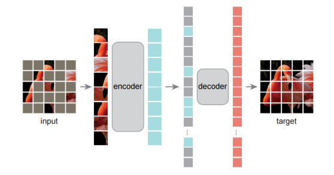

# MAE

想要快速了解该模型，仅看第三部分方法即可，参照模型架构图可以快速了解该模型

# Abstract

masked autoencoder（MAE）是一种可扩展的 (scalable) CV 自监督学习器。

MAE 的思想：mask 输入图像的随机 patches，并重建缺失的 pixels。

MAE 基于两个核心设计：

+ 开发了一个非对称 (asymmetric) 的编码器-解码器架构，编码器只操作于 patches 的可见子集 (无 mask tokens)，轻量级解码器从潜在表示和 mask tokens 中重构原始图像；
+ 高比例地 mask 输入图像 (如 75%) 产生了一个重要 (non-trival) 和有意义的自监督任务。

我们的可扩展方法 允许学习 具有良好泛化能力的高容量 (high-capacity) 模型：例如，在只用 ImageNet-1K 的方法中，一个普通的 ViT-Huge 达到最佳准确率 (87.8%)。在下游任务中的迁移性能优于有监督预训练，并表现出有前景的扩展行为 (scaling behavior)。

# 一. 引言

**Masked autoencoding 的思想，是一种更一般的 denoising autoencoders 的形式，是自然的且适用于 CV 的**。

**是什么使 masked autoencoding 在视觉和语言之间有所不同**？

+ 要将 mask token 或位置嵌入等 “indicators” 集成到卷积网络中并不简单。然而，随着 ViT 的引入，架构的鸿沟已经得到了解决且，不应再构成障碍。
+ 语言和视觉之间的信息密度不同。语言是由人类产生的信号，具有高度的语义性和信息密集性 (highly semantic and information-generated)。当训练一个模型只预测每个句子中缺失的一些单词时，这项任务似乎能诱导 (induce) 复杂的语言理解。相反，图像是具有大量空间冗余的自然信号。为克服这种差异并鼓励学习有用的特征，我们展示了一个在 CV 中表现很好的简单策略：**masking 非常高比例的随机 patches。**
+ autoencoder 的解码器，它将潜在的表示映射回输入，在重建文本和图像之间起着不同的作用。在视觉中，解码器重建像素，因此其输出的语义级别低于常见的识别任务。相反，在语言中，解码器预测包含丰富语义信息的缺失单词。虽然在 BERT 中，解码器可以是简单的 (一个MLP)，但我们发现，对于图像，解码器的设计 在决定学习到的潜在表示的语义水平中 起着关键作用。

在此分析的驱动下 (Driven by this analysis)，我们提出了一种简单的、有效的、可扩展的 masked autoencoder (MAE) 形式，用于视觉表示学习。

# 二. 相关工作

**Masked language modeling (MLM)**及其对手 autoregressive，如 BERT 和 GPT，是 NLP 中非常成功的预训练方法。这些方法已被证明能够良好扩展/放缩 (scale excellently)，并且大量的证据表明，这些预训练好的表示可以很好地推广到各种下游任务。

 **Autoencoding** 是学习表示的一种经典方法。它有一个将输入映射到潜在表示 (latent representations) 的编码器，和一个重建输入的解码器。Denoising autoencoders (DAE) 非常近似的工作

**Masked image encoding** 方法从被 masking 损坏的图像中学习表示。

**Self-supervised learning** 方法对 CV 具有显著兴趣，通常聚焦于预训练的不同前置 (pretext) 任务。

# 三. 方法

masked autoencoder (MAE) 是一种简单的 autoencoding 方法，它可以重建原始信号。

像所有的 autoencoders 一样，本方法有一个 将观察到的信号映射到一个潜在表示 的编码器 ，和一个从潜在表示重建原始信号 的解码器。

与经典的 autoencoders 不同，我们采用了一种**非对称的设计**，**允许编码器只操作部分的、观察到的信号 (没有 mask tokens)**，以及一个轻量级的解码器，从潜在表示和 mask tokens 重j建完整的信号。

MAE架构：

1. **Masking**，在预训练过程中，mask掉大量的随机patches（论文为75%），这样可以很大程度消除冗余。均匀分布防止了潜在的中心偏差。

2.  **MAE encoder**，编码器是一个只应用于 visible & unmasked patches 的 ViT，编码器 **通过一个添加了位置嵌入的线性投影** 来嵌入 patches，然后通过一系列 Transformer blocks 处理结果集。

3. **MAE decoder**，MAE 解码器的输入是完整的 tokens 集合，包括 **经编码的可见 patches**和 **mask tokens**。每个 mask token 是一个共享的、经学习的向量，它指示要预测的缺失 patches 的存在。**向这个完整集中的所有 tokens 添加位置嵌入，否则 mask token 就没有关于它们在图像中所处的位置的信息**。该解码器有另一系列的 Transformer blocks。

   MAE 解码器 **仅用于在预训练时执行图像重建任务** **(只有编码器产生用于识别的图像表示)**。因此，解码器架构可以以独立于编码器设计的方式灵活设计。实验使用非常小的解码器，比编码器更窄更浅 (narrow and shallow)。例如，相比于编码器，默认的解码器的每个 token 计算 < 10%。通过这种不对称的设计，完整的 tokens 集只由轻量级的解码器来处理，这大大减少了预训练时间。

4. **Reconstruction target**，MAE 通过预测每个 masked patch 的像素值来重建输入。**解码器输出的每个元素 都是一个 代表一个 patch 的像素值的向量。解码器的最后一层是一个线性投影，其输出通道数 等于 一个 patch 中的像素值数** 。解码器的输出被 reshaped 以形成一幅经重建的图像。损失函数为像素空间中经重建图像和原始图像间的 MSE，且 只计算在 masked patches 上的损失，类似于 BERT (不同于 计算所有像素损失的传统 denoising autoencoders (DAE)，仅在 masked patch 上计算损失 纯粹是由 结果驱动的：计算所有像素上的损失会导致准确率的轻微下降，例如 ∼0.5%)。

   我们还研究了一个变体，其 **重建目标** 是 **每个 masked patch 的归一化像素值**。具体来说，计算一个 patch 中所有像素的平均值和标准差来归一化 patch。在实验中，使用归一化像素作为重建目标，**改善了表示的质量**。

5. **Simple implementation**，MAE 预训练可以高效地实现 而无需任何专门的稀疏操作。首先，为每个输入 patch 生成一个 token (通过添加位置嵌入的线性投影)。接着，随机 shuffle tokens 列表，并根据 masking 比例删除 tokens 列表的最后一部分。该过程为编码器产生一个小的 tokens 子集，相当于 无替换的 patches 采样 (无放回抽样?)。编码后，为经编码的 patches 列表 额外加入 一个 mask tokens 列表，并 unshuffle (随机 shuffle 的反操作) 该完整列表，以将所有 tokens 与它们的 tagrtes 对齐。解码器被用于这个完整的列表 (添加了位置嵌入)。如上所述 (as noted)，无需稀疏操作。这个简单的实现引入了可以忽略不计的开销，因为 shuffle 和 unshuffle 操作很快。

# 四. 实验部分结论

1. MAE 的主要特性
   - **掩蔽率**：75% 的掩蔽率对线性探测和微调都有较好效果，与 BERT 典型的 15% 掩蔽率不同。线性探测精度随掩蔽率增加而稳步提升，微调结果对掩蔽率则相对不敏感。
   - **解码器设计**：深度足够的解码器对线性探测很重要，能提升精度；但在微调时，解码器深度影响较小。默认的轻量级解码器（8 层，512 通道）计算量小，性能表现良好。
   - **掩码标记**：编码器跳过掩码标记可提高精度、减少训练计算量和内存消耗，提升训练效率。
   - **重建目标**：使用归一化像素作为重建目标可提高精度，表明高频分量在方法中有用。与预测离散标记相比，基于像素的 MAE 更简单高效。
   - **数据增强**：MAE 使用裁剪增强或不使用增强都能表现良好，与对比学习方法依赖数据增强的特性不同。
   - **掩码采样策略**：简单随机采样对 MAE 效果最佳，能实现高掩蔽率，平衡速度和精度。
   - **训练时长**：训练时间越长，MAE 精度提升越明显，1600 个 epoch 时线性探测精度仍未饱和。
2. 与先前结果的比较
   - **与自监督方法比较**：在 ViT-B 模型上，各方法微调结果相近；在 ViT-L 和 ViT-H 模型上，MAE 表现出色，使用 ViT-H（448 尺寸）在仅使用 ImageNet-1K 数据时达到 87.8% 的准确率，超越先前所有方法。与 BEiT 相比，MAE 更准确、更简单且训练速度更快。
   - **与监督预训练比较**：MAE 仅使用 ImageNet-1K 数据预训练，泛化能力更好，高容量模型从中受益更多，有助于模型规模的扩展。
3. **部分微调实验**：部分微调（微调最后几层，冻结其他层）能显著提升精度，微调几个块（如 4 或 6 个）可达到接近全量微调的精度。MAE 的表示在非线性特征方面更强，尽管线性可分性不如 MoCo v3，但在微调非线性头部时表现更好。
4. **迁移学习实验**：在 COCO 目标检测和实例分割、ADE20K 语义分割以及 iNaturalists 和 Places 分类任务中，MAE 预训练的模型均优于监督预训练模型。在大多数情况下，基于像素的 MAE 与基于标记的 BEiT 性能相当或更优，且 MAE 更简单快速。

# 五. 讨论与结论

**具有良好扩展性 (scale well) 的简单算法是深度学习的核心**

**视觉中的自监督学习现在可能开始了 (be embarking on) 与 NLP 类似的轨迹**。

我们的 MAE 推断出了复杂的、整体的重建，**表明它已经学习了许多视觉概念，即语义 (semantics)**。我们 **假设这种行为是基于 在 MAE 内部的丰富的隐藏表示 而发生的**。

