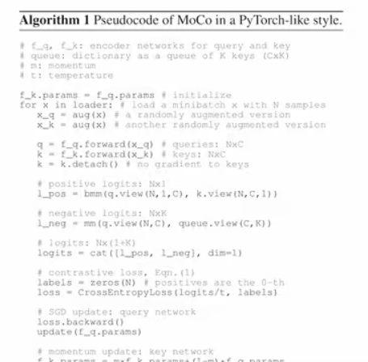

# MoCo

Momentum Contrast for Unsupervised Visual Representation Learning

MoCo: CVPR 2020 最佳论文，视觉 + 对比学习的里程碑式的工作

对比学习：

- 简单、好用；
- 19年以来，视觉领域乃至整个 ML 领域最火的方向之一；
- 盘活了从17年很卷的CV领域，MoCo是其中的优秀工作之一

**MoCo：无监督的表征学习工作 在 CV上表现怎么样？**

- 分类：逼近了有监督的 baseline
- 检测、分割、人体关键点检测：大幅超越有监督预训练的模型 (ImageNet 上预训练的模型)
- CV 领域的定心丸，无监督学习真的可以，有可能真的不需要大规模、有标号的数据集做预训练。
- 侧面正面了 **Yann LeCun** 的 NeurIPS 2016 的演讲图

# 1、标题 + 作者

- 动量从数学上可以理解成一种加权移动平均：
- yt = m * y（ t - 1 ）+（ 1 - m ）* xt
- m就是动量的超参数
- y（ t - 1 ）是上一个时刻的输出
- yt是这一时刻想要改变的输出
- xt是当前时刻的输入
- 简单来说，就是不想让当前时刻的输出完全依赖于当前时刻的输入，所以这里引入了之前的输出，并且给了他一个权重
- 因为这里动量的超参数m是介于0和1之间的数，如果m很大（趋近于1）的时候，yt的改变是非常缓慢的，因为后面的1-m基本就趋近于0，也即是说不怎么依赖当前的输入；反过来说，如果m很小的话，那就是说当前的输出更多地依赖于当前的输入
- MoCo利用了动量的这种特性，从而缓慢地更新一个编码器，让中间学习的字典中的特征尽可能地保持一致

# 2、摘要

本文提出了MoCo去做无监督的表征学习，虽然是基于对比学习的，但是本文是从另外一个角度来看对比学习，也就是说把对比学习看作是一个字典查询的任务

具体来说，就是做一个动态的字典，这个动态的字典由两个部分组成

- 第一个部分是一个队列，因为队列中的样本不需要做梯度回传，所以就可以往队列中放很多负样本，从而使得这个字典变得很大
- 第二个部分是一个移动平均的编码器，使用这个移动平均的编码器的目的是想让字典中的特征尽量的保持一致。作者发现在训练的过程中，如果能有一个很大而且比较一致的字典，会对无监督的对比学习非常有好处

这篇论文主要的亮点在于它的结果，所以剩下大篇幅的摘要留给了结果：

分类：

- 在ImageNet数据集上，如果使用大家普遍采用的linear protocol去做测试的话，MoCo能够取得跟之前最好的无监督学习方式差不多或者更好一点的结果
- linear protocol：如果先预训练好一个骨干网络，当把它用到不同的数据集上的时候，将它的骨干网络冻住（backbone freeze），然后只去学习最后的那个全连接层，也就是分类头，这样就相当于把提前训练好的预训练模型当成了一个特征提取器，只用它来抽取特征，这样就可以间接证明之前预训练好的那个模型的特征到底好不好

更重要的是MoCo学习到的特征能够很好地迁移到下游的任务，这才是整篇文章的精髓

- 之所以想做大规模的无监督预训练，就是想去学到一个很好的特征，然后这个特征拥有很好的迁移性，就可以在没有那么多标注数据的下游任务里获得很好的结果

MoCo作为一个无监督的预训练模型，能够在7个下游任务（分割、检测等）上，而且比如说在VOC、COCO这些数据集上超越之前的有监督的预训练模型，有时候甚至是大幅度超越

- 这里的counterpart是说模型使用的是一样的，比如说都是Res50，只是训练的方式不一样，一个是用有监督的带标签的数据去训练，一个是用无监督不带标签的数据去训练

最后作者总结说，这就意味着对于很多视觉任务来说，无监督和有监督的表征学习中间的鸿沟已经填上了

- 之前虽然有一些无监督的工作能够在某个数据集或者是某个任务上能够比它对应的有监督预训练模型好一点，但是MoCo是第一个能够在这么多主流视觉任务上，全面地让无监督训练的模型比有监督训练的模型表现要好

# **3、引言**

# **4、结论**

MoCo的最后一部分不光是结论，主要的内容都围绕在了讨论上面，结论其实就是一句话，MoCo在一系列的方法和数据集上都取得了比较好的效果

接下来就是讨论了两个比较有趣的问题

1、通过实验，作者发现当预训练的数据集从ImageNet换到Instagram的时候，提升虽然是有的，但是都相对来说比较小，只有零点几个点或者一个点，但是数据集是从一百万增加到10亿了，扩大了一千倍，这样的提升着实是有点小，所以作者觉得是因为大规模的数据集没有被很好地利用起来，可能一个更好的代理任务有可能解决这个问题

2、除了这个简单的个体判别任务，有没有可能把MoCo和另外一个代理任务（**Masked auto-encoding）**结合起来用，就像NLP中的BERT一样，用masked language modeling完形填空去自监督地训练模型**（MAE）**

最后作者希望MoCo能够对其他那些使用对比学习的代理任务有帮助，之所以强调对比学习是因为MoCo设计的初衷就是去构造一个大的字典，从而让正负样本能够更有效地进行对比，提供一个稳定地自监督信号，最后去训练模型

# 5、相关工作

见《MoCo----相关工作》

# 6、MoCo方法

之前的对比学习以及最新的一些效果比较好的变体，它们都可以想象成是训练一个编码器，从而去做一个字典查找的任务

假设有一个编码好的query q，也就是特征，还有一系列已经编码好的样本，也就是k0、k1、k2等，这些可以看作是字典中的那些key

- 这里做了一个假设：在这个字典中只有一个key是跟query是配对的，也就是说它们两个互为正样本对，这个key叫做key positive
- 之所以有这个假设，前面在讲个体判别任务的时候也提到过，这个代理任务就是从一个图片经过两种变换得到两种图片，其中一个作为基准图片，另外一个作为正样本，所以就是只有一个正样本对。当然理论上是可以使用多个正样本对，之后也有工作证明使用多个正样本对有可能会提升任务的性能

一旦定义好了正样本和负样本，接下来就需要一个对比学习的目标函数，这个对比学习的目标函数最好能满足以下要求

- 当query q和唯一的正样本k plus相似的时候，它的loss值应该比较低
- 当query q和其他所有的key都不相似的时候，这个loss的值也应该比较低

这个也是训练模型的目标，如果已经能够达到这么一种状态，就说明模型差不多训练好了，当然希望目标函数的loss值尽可能的低，就不要再去更新模型了；反之，如果q和正样本key plus不相似，或者说query q和本来应该是负样本的那些key相似，那么这个目标函数的loss值就应该尽可能的大，从而去惩罚这个模型，让模型加速更新它的参数

在本文中，采取了一个叫做InfoNCE的对比学习函数来训练整个模型

- InfoNCE：先看下图中右边手写的式子，它是softmax的操作，那如果是在有监督学习的范式下，也就是有一个one-hot向量来当作ground truth

- 其实在前面加上一个-log，整个其实就是cross entry loss，也就是交叉熵目标函数，但是需要注意的是红色圆圈圈出来的k在有监督学习中指的是这个数据集有多少个类别（比如说ImageNet就是1000类，k就是1000，是一个固定的数）
- 回到对比学习，其实对比学习理论上来说是可以用上面这个公式去计算loss的，但是实际上行不通。如果说像大部分对比学习的工作一样，就使用instance discrimination这个代理任务去当自监督信号的话，那这里的类别数k将会是一个非常巨大的数字，就拿ImageNet数据集来举例，这里的k就不再是1000了，而是128万，就是有多少图片就有多少类
- softmax在有这么多类别的时候，它其实是工作不了的，同时因为这里还有exponential操作，当向量的维度是几百万的时候，计算复杂度是相当高的，如果每个训练的iteration都要这样去计算loss，那么训练的时间将会大大延长

所以就有了NCE loss（noise contrastive estimation的缩写），之前因为类别太多所以没办法计算softmax，从而没办法计算目标函数，NCE的做法是：将这么多的类简化成一个二分类问题，现在只有两个类别了

- 一个是数据类别data sample
- 一个是噪声类别noisy sample

那么每次只需要拿数据样本和噪声样本做对比就可以了，也就是文中所说的noise contrastive。但是如果还是将整个数据集剩下的图片都当做负样本，那么其实noise contrastive estimatation解决了类别多的问题，但是计算复杂度还是没有降下来，那么该如何让loss计算的更快一点呢？没有别的办法，只有取近似了

- 意思就是说，与其在整个数据集上算loss，不如就从这个数据集中选一些负样本来算loss就可以了，这也是这里estimation的含义，它只是估计、近似
- 但是按照一般的规律，如果选取的样本很少，就没有那么近似了，结果自然就会比较差。选的样本越多，自然就跟使用整个数据集的图片的结果更加近似，效果自然也会更好，所以这也是MoCo一直强调的希望字典足够大，因为越大的字典，越能够提供更好的近似

总的来说，NCE这个loss就是把一个超级多类分类的问题变成了一系列的二分类的问题，从而让大家还是可以使用softmax操作

这里说的InfoNCE其实就是NCE的一个简单的变体，作者认为如果只把问题看作是一个二分类（只有数据样本和噪声样本）的话，可能对模型学习不是很友好，毕竟在那么多的噪声样本中，大家很有可能不是一个类，所以还是把它看成一个多分类的问题比较合理，于是NCE就变成了InfoNCE，公式如下图所示

- 公式中的q * k，其实就相当于是logit，也可以类比为上面softmax中的z，也是模型出来的logit
- 公式中的τ是一个温度的超参数，这个温度一般是用来控制分布的形状的，τ的值越大，1/τ就越小，就相当于将分布中的数值都变小了，尤其是经过exponential之后就变得更小了，最后就会导致这个分布变得更平滑；相反，如果τ取得值越小，也就是1/τ越大，那么分布里的值也就相应的变大，经过exponential之后，原来大的值变得更大了，就使得这个分布更集中，也就变得更加peak了。
- 所以说温度这个超参数的选择也是很有讲究的，如果温度设的越大，那么对比损失对所有的负样本都一视同仁，导致学习的模型没有轻重；如果温度的值设的过小，又会让模型只关注那些特别困难的样本，其实那些负样本很有可能是潜在的正样本，如果模型过度地关注这些特别困难的负样本，会导致模型很难收敛，或者学好的特征不好去泛化。
- 但是温度这个超参数终究只是一个标量，如果忽略掉它，就会发现，其实这个InfoNCE loss就是cross entropy loss，唯一的区别就在于在cross entropy loss中k指代的是数据集里类别的多少，但是在对比学习的InfoNCE loss中，k指的是负样本的数量
- 公式下面分母中的求和其实是在一个正样本和k个负样本上做的，因为是从0到k，所以是k+1个样本，也就指的是字典里所有的key
- 如果直观地想一下，InfoNCE loss就是一个cross entropy loss，它做的就是一个k+1类的分类任务，它的目的就是想把q这个图片分成k plus这个类。所以到这里可以发现，InfoNCE也不是那么难理解，和之前常用的cross entropy loss是有很大联系的
- 如果直接跳到后面MoCo的伪代码的话，也会发现MoCo这个loss的实现就是基于cross entropy loss实现的

既然已经有了这个代理任务提供的正负样本，也有了可以用来训练模型的目标函数输入和模型大概是什么？（这里作者还是从一个自顶向下的方式去写的）

普遍来说，query q是一个输入xq通过一个编码器fq得到的，同理所有的k的表示也都是key的输入通过了一个key的编码器，输入和模型具体的实现是由具体的代理任务决定

- 在代理任务不一样的时候，输入xq和xk既可以是图片，也可以是图片块，或者是含有上下文的一系列的图片块

对于模型，query的编码器和key的编码器既可以是相等的（就是说模型的架构一样，参数也是完全共享的），或者说它们的参数是部分共享的，也可以是彻底不一样的两个网络

（整个论文，每一段和每一段之间最好都有承上启下的段落，每当开始讲一个新的东西的时候最好先讲一下为什么需要它，一旦有了这个承上启下的段落，也就是因为所以的逻辑关系之后，论文读起来就会更加顺畅。否则论文上来每一段都是直接讲方法的话，很容易让人看得一头雾水，无论自己觉得写的有多清晰，读者可能从一开始就没明白为什么要这么做）

作者说从以上角度，对比学习是一种在高维的连续的输入信号上去构建字典的一种方式

- 这里的高维和连续其实指的就是图片

这个字典是动态的

- 之所以是动态的是因为这个字典中的key都是随机取样的，而且给这些key做编码的编码器在训练的过程中也是在不停的改变
- 这和之前所讲的无论是在有监督还是无监督的方法都不太一样，因为之前的那些工作最后学习的target都是一个固定的目标，所以作者认为，如果想学一个好的特征，这个字典就必须拥有两个特性（大，大的字典能够包含很多语义丰富的负样本，从而有助于学到更有判别性的特征；一致性主要是为了模型的训练，能够便面学到一些trivial solution，也就是一些捷径解）

所以基于以上的研究动机，作者就提出了momentum contrast

文章的第一个贡献：如何把一个字典看成队列

作者说，方法的核心其实就是把一个字典用队列的形式表现出来

- 队列其实就是一种数据结构，如果有一个队列，里面有很多元素，假如新来的元素从下面进来，为了维持这个队列的大小，最老的数据会从队列中出去，所以说队列一般被称作是一个fifo（first in first out，先进先出）的数据结构

- 作者在这里是用一个队列去代表一个字典，也就是说整个的队列就是一个字典，里面的元素就是放进去的key
- 在模型训练的过程中，每一个mini-batch就会有新的一批key被送进来，同时也会有一批老的key移出去，所以用队列的好处是可以重复使用那些已经编码好的key，而这些key是从之前的那些mini-batch中得到的，比如说队尾指的是当前mini-batch送进来的新key，那么紧挨着它上面的那些key就是在它之前的那些mini-batch编码好送进来的
- 这样使用了队列之后，就可以把字典的大小和mini-batch的大小彻底剥离开了，就可以在模型的训练过程中使用一个比较标准的mini-batch size，一般是128或者是256，但是字典的大小可以变得非常大，它的大小非常灵活，而且可以当作一个超参数一样单独设置

这个字典一直都是所有数据的一个子集

- 在算对比学习目标函数的时候只是取一个近似，而不是在整个数据集上算loss

使用队列的数据结构，可以让维护这个字典的计算开销非常小

- 事实也是如此，如果把字典的大小从几百变到几千或者上万，整体的训练时间基本是不变的

最后作者又强调了为什么要使用队列这个数据结构：因为队列有先进先出的特性，这样每次移出队列的都是最老的那些mini-batch，也就是最早计算的那些mini-batch，这样对于对比学习来说是很有利的，因为从一致性的角度来说，最早计算的那些mini-batch的key是最过时的，也就是说跟最新的这个mini-batch算的key是最不一致的

文章的第二个贡献：如何使用动量的思想去更新编码器

用队列的形式当然可以使这个字典变得更大，但是也因为使用了非常大的字典，也就是非常长的队列，就导致没办法给队列中所有的元素进行梯度回传了，也就是说，key的编码器无法通过反向传播的方式去更新它的参数

- 如果想更新这个key的编码器，其实有一个非常简单的方法：就是每个训练iteration结束之后，将更新好的编码器参数fq直接复制过来给key的编码器fk就可以了
- 这个想法简单确实是简单，但是作者紧接着说这种方式的结果并不好，原因是一个快速改变的编码器降低了这个队列中所有key的特征的一致性

- 假如现在有一个队列如上图所示，新的元素从左边进来，旧的元素从右边出去，假设mini-batch size就是1，也就是说每次只更新一个key，k1、k2等这些所有的key都是由不同的编码器产生的，这样的话这些快速改变的编码器就会降低所有key之间的一致性

所以作者提出了动量更新的方式来解决这个问题

- 如果将key编码器fk参数设为θk，query编码器的参数fq设为θq，那θk就是以以下公式所示的动量改变方式进行更新的

- 上式中m是动量参数，它是一个0到1之间的数
- θq，也就是query编码器，是通过梯度反向回传来更新它的模型参数的
- θk除了刚开始是用θq初始化以外，后面的更新大部分主要是靠自己，因为如果动量参数m设的很大，那么θk更新就非常缓慢，所以作者接下来说，因为使用了这种动量更新的方式，随意虽然在队列里的key都是由不同的编码器产生得到的，但是因为这些编码器之间的区别极小，所以产生的key的一致性都很强
- 为了强调这一观点，作者说，他们在实验中使用了一个相对比较大的动量0.999，意思就是每次θk更新的时候，99.9%都是来自原来的编码器参数，只有0.1%是从更新好的θq中借鉴过来的，自然而然的，θk的更新就非常缓慢了
- 作者还做了对比实验，当他把这个动量变小一点，变成0.9的时候（其实0.9也不算小了），作者说使用一个相对较大的动量0.999比0.9效果要好得多，所以就意味着，如果想充分利用好队列，一个缓慢更新的key编码器是至关重要的，因为它可以保证这个队列里所有的key是相对一致的

到这里，其实MoCo的主要贡献旧已经讲完了，但是如果对对比学习不是很熟的人来说可能还是不太理解MoCo的前向过程到底是什么样子的，可惜的是这篇论文并没有提供一个很直观、形象的模型总览图，取而代之的是伪代码，写得相当简洁明了，理解和复现都比较容易

作者在引言中提到过，之前的那些对比学习方法都可以看作是字典查找，但是它们都或多或少受限于字典的大小和字典的一致性的问题，这里作者将之前的方法总结了一下，归纳成了两种架构

1、第一种就是比较直接的**端到端学习的方式**

- 端到端学习，顾名思义就是编码器都是可以通过梯度回传来更新模型参数的
- 下图的标题中也写道编码器q和k可以是不同的网络，但是之前很多工作都用的是同样的网络，为了简单起见，MoCo实验中编码器q和k是同一个模型，也就是一个Res50

- 这里为什么可以使用同一个模型？因为模型的正负样本都是从同一个mini-batch里来的，也就是xq和xk都是从同一个batch中来的，它做一次forward就能得到所有样本的特征，而且这些样本是高度一致的，因为都是来自一个编码器
- 听起来确实很美好，编码器都能用反向回传学习了，特征也高度一致了，但是它的局限性就在于字典的大小，因为在端到端的学习框架中，字典的大小和mini-batch size的大小是等价的，如果想要一个很大的字典，里面有成千上万个key的话，也就意味着mini-batch size的大小必须也是成千上万的，这个难度就比较高了。因为现在的GPU是塞不下这么大的batch-size的，而且就算有内存够大的硬件，能塞下这么大的batch-size，但是大的batch-size的优化也是一个难点，如果处理不得当，模型是很难收敛的
- 所以作者说这种端到端学习的方式受限于字典的大小，之所以选择读MoCo这篇论文而不是SimCLR，是因为SimCLR就是这种端到端的学习方式，它还用了更多的数据增强，而且提出了在编码器之后再用一个projector，会让学到的特征大大变好，但是总体来说SimCLR就是端到端的学习方式，之所以这么做，是因为google有TPU，TPU内存大，所以可以无脑上batch-size，SimCLR中选用了8192当作batch-size，这样最后就会有10000多个负样本，这个负样本的规模就足够对比学习了，所以SimCLR就可以用这么简单的方式直接去做端到端的学习
- 端到端学习的优点在于编码器是可以实时更新的，所以导致它字典里的那些key的一致性是非常高的，但是它的缺点在于因为它的字典大小（就是batch-size的大小），导致这个字典不能设置的过大，否则硬件内存吃不消

2、**memory bank**（更关注字典的大小，而牺牲一些一致性）

- 在memory bank中其实就只有一个编码，也就是query的编码器是可以通过梯度回传来进行更新学习的
- 但是对于字典中的key是没有一个单独的编码器的
- memory bank把整个数据集的特征都存到了一起，对于ImageNet来说，memory bank中就有128万个特征（看上去好像很大，但是memory bank的作者在论文中说，因为每一个特征只有128维，所以即使整个memory bank中有128万个key，最后也只需要600M的空间就能把所有的这些key存下来了，即使是对整个数据集的特征做一遍最近邻查询，在泰坦XGPU上也只需要20毫秒，所以是非常高效的）
- 一旦有了这个memory bank，在每次模型做训练的时候，只需要从memory bank中随机抽样很多的key出来当作字典就可以了，就相当于下图中红色圆圈圈出来的整个右边的那些操作都是在线下执行的，所以完全不用担心硬件内存的问题，也就是字典可以抽样抽的很大，但是有得必有舍，memory bank的做法在特征一致性上就处理的不是很好

- 假如说有一个memory bank如下图所示，里面有128万个key，它在训练的时候是随机抽样很多样本出来当作字典，这里为了方便讲解，将它简化为顺序抽样而且字典的大小就是3，也就是说当在做对比学习的时候，当前用的mini-batch可以先把k1、k2、k3这三个key抽出来当作负样本，然后去和query计算loss

- 算完这个loss，回传的梯度更新了左边的编码器encoder之后，memory bank的做法就是会用新的编码器在原来对应的位置上，也就是k1、k2、k3的位置上的那些样本去生成新的特征，也就是下图中蓝色的新的k1、k2、k3，然后把新的key放回到memory bank中就把memory bank更新了

- 依此类推，下一次假如是将4、5、6这三个key抽出来做一次模型更新，然后再把新的key4、5、6放回去，那么4、5、6也就被更新了
- 这里也就有一个问题：因为这里的特征都是在不同时刻的编码器得到的，而且这些编码器都是通过梯度回传来进行快速更新的，这也就意味着这里得到的特征都缺乏一致性
- 而且memory bank还有另外一个问题，因为memory bank中存储了所有的图片，也就意味着模型训练了整整一个epoch才能把整个memory bank更新一遍，那也就意味着，当开始下一个epoch训练的时候，假如选了三个key，那这三个key的特征都是上一个epoch不知道哪个时间点算出来的特征了，这也就导致query的特征和key的特征差的特别远
- 所以总结一下，就是memory bank的做法就是牺牲了特征的一致性，从而获得了可以构造很大的字典的特权

显然，无论是端到端的学习还是memory bank的方法，都和作者说的一样，受限于字典大小和特征一致性这两方面中的至少一个，所以为了解决之前这两种做法的局限性，作者就提出了MoCo

- MoCo采用队列的形式去实现字典，从而使得它不像端到端的学习一样受限于batch-size的大小
- 同时为了提高字典中特征的一致性，MoCo使用了动量编码器
- 其实从整体上来看，MoCo跟Memory bank的方法是更加接近的，它们都只有一个编码器（query的编码器，它是通过梯度回传来更新模型参数的），它们的字典都是采取了额外的数据结构进行存储从而和batch-size剥离开了，memory bank中使用了memory bank，而MoCo中使用了队列
- memory bank这篇论文（文献61）也意识到了特征不一致性所带来的坏处了，所以作者当时还加了另外一个loss（proximal optimization），目的就是为了让训练变得更加平滑，这其实和MoCo中的动量更新是有异曲同工之效的
- MoCo的作者也提到memory bank这篇论文中也提到了动量更新，只不过它的动量更新的是特征，而MoCo中动量更新的是编码器，而且MoCo的作者还补充说MoCo的扩展性很好，他可以在上亿级别的图像库上进行训练
- 但是对于特别大的数据集memory bank的方法就捉襟见肘了，因为它需要将所有的特征都存到一个memory bank中，对于ImageNet这种百万规模的数据集来说，存下的特征只需要600兆的空间，但是对于一个拥有亿级图片规模的数据，存储所有的特征就需要几十G甚至上百G的内存了，所以memory bank的扩展性不如MoCo好

总之，MoCo既简单又高效，而且扩展性还好，它能同时提供一个又大而且又一致的字典，从而进行对比学习

**代理任务**

作者为了简单起见，使用了个体判别的任务，个体判别任务的定义如下图所示

**MoCo论文中的小trick：Shuffling BN**

（这个操作在接下来很多论文里，甚至包括作者团队接下来的工作，比如SimSiam也没有再用Shuffling NB这个操作了）

因为用了BN以后，很有可能造成当前batch里的样本中间的信息的泄露，因为BN要计算这些样本的running mean和running variance，也就是说，它能通过这些泄露信息很容易地找到正样本，而不需要真正地去学一个好的模型（也就是作者所说的模型会走一条捷径）

如何解决这个问题？

因为BN这个操作大部分时候都是在当前GPU上计算的，所以作者在做多卡训练之前，先把样本的顺序打乱再送到所有的GPU上去，算完了特征之后再回复顺序去算最后的loss，这样的话对loss是没有任何影响的，但是每个GPU上的BN计算就不一样了，就不会再存在信息泄露的问题了

类似的BN操作还在后续BYOL那篇论文中引起了一段很有意思的乌龙事件，总之，BN操作让人又爱又恨，用的好威力无穷，但是90%的情况都是属于用的不好的，会带来各种莫名其妙的问题，而且很难去debug，所以现在换成transformer也好，这样直接就用layer norm，就能暂时不用理会BN了

# **7、实验**

**数据集的使用**

- 在做无监督的预训练的时候，使用了标准的ImageNet数据集
- 为了验证MoCo的扩展性好，还使用了facebook自己的Instagram 1Billion的数据集
- ImageNet一般都叫做ImageNet 1k，因为它有1000个类别，但是作者这里叫ImageNet 1 million，在MoCo的论文中使用的是个体判别的任务，所以类别数不再是1000，而是整个数据集图片的数量，也就是1 million
- Instagram这个数据集作者在之前的引言中也提到过，他和ImageNet有一些不一样的特性：它展示了真实的世界中数据的分布（长尾的、不均衡的）；同时他的图片既有那种只有一两个物体的，也有有很多物体或者是场景层面的图片

**训练的情况**

- 因为还是CNN时代，所以还是使用的SGD当成优化器
- 对于ImageNet数据集来说，作者用的是标准的batch-size 256在一台8卡机上进行训练
- 如果是使用Res50网络结构的话，训练200个epoch大概需要53个小时
- 相对于SimCLR、SwAV或者BYOL这些工作，MoCo不论是从硬件本身还是从训练时长上，都已经是最affordable的方法了，其实后面还可以了解到，MoCo或者MoCoV2这一系列的方法，它们的泛化性能非常好，在做下游任务的时候，学到的特征依旧非常强大，所以看起来SimCLR的引用会比MoCo稍微高一些，但是其实真正在视觉领域里，大家在别的任务上使用对比学习的时候，绝大多数工作都是沿用的MoCo的这套框架

**结果**

作者分成了两大部分进行了结果的展示

1、Linear Classification Protocol：将训练好的模型当作一个特征提取器

- 在完成了无监督学习的预训练之后，将模型的backbone冻住，只将它作为一个特征提取器，然后在上面训练一个全连接层去充当分类头，训练这个分类头用了100个epoch
- 结果的衡量是在ImageNet的测试集上，包括了1-crop、top-crop的准确度
- 作者做了一个grid search，然后发现最佳的学习率是30.这个其实是很不可思议的，因为除了在神经网络搜索（NAS）的那些工作里可能会搜到一些比较夸张的学习率之外，过去几十年里用神经网络的工作，都没有用超过1的学习率，因为已经预训练好了一个网络，所以只需要做微调就可以了，所以学习率最大可能也就是设个0.1，然后0.01、0.001这样往下降，很少有人会设一个比1大的学习率，但是在这里竟然是30.所以说做无监督学习或者说是做对比学习可以看一下学习率，如果结果不好，很有可能是学习率没有设置对
- 基于这个现象，作者也做了总结，这个学习率确实比较诡异，它暗示了这种无监督对比学习学到的特征分布跟有监督学习学到的特征的分布是非常不同的

**第一个消融实验**：

- 这个消融实验主要是用来**对比三种对比学习的流派**：端到端学习、memory bank和本文提到的MoCo
- 横坐标用k表示，指的是用了多少个负样本，也可以粗略地理解为字典的大小
- 纵坐标指的是在ImageNet数据集上的top one的准确率，也就是Linear Classification Protocol下的准确率
- 黑色的线表示的是端到端的学习，它的结果只有三个点，因为受限于显卡内存（用一台8卡v100内存32g的机器能塞下的最大的batch-size只有1024）
- 蓝色的线表示的是memory bank的形式，它可以用很大的字典，所以它可以走得很远，但是它的效果整体上要比端到端学习和MoCo的结果都要差一截。作者说这是因为特征的不一致性导致的
- 橙色的线表示MoCo，MoCo确实可以有很大的字典，之所以停在65536这个数字，从图中可以看到，从16384到65536性能也已经比较饱和了，所以再大也可能不会带来更多的性能提升了。如果拿MoCo和端到端学习的方法做比较，可以发现，它们的曲线在刚开始的时候的重合度还是比较高的，但是作者说，因为没有实验的支撑，不知道黑线是否能继续按照现有的趋势继续增长下去，有可能结果会更高，也有可能结果会更低，但是因为做不了实验，所以无从得知

所以基于图3，MoCo是性能最好，对硬件要求最低，而且扩展性也比较好的方法

**第二个消融实验**

这个消融实验是为了证实本文的第二个贡献，也就是动量更新带来的好处，如下图所示（在写论文的时候，如果是自己提出了有几点贡献，那就一定得做针对这几点贡献的消融实验，这样才能证明提出的贡献是有效的，否则口说无凭）

- 动量使用一个相对较大的值0.999或者0.9999的时候性能是最好的，差不多都是59，这就说明了一个变化非常缓慢的编码器是对对比学习有好处的，因为它能够提供一个一致性的特征
- 但是当把动量逐渐变小，变到0.99或者是0.9的时候，性能的下降就比较明显了，尤其是当直接去掉动量，直接将快速更新的query编码器拿过来当key编码器用的时候，就会发现不光是性能下降的问题，整个模型甚至都不能收敛，loss一直在震荡，从而导致训练失败
- 这个table非常有力地证明了作者的论点，就是要建立一个一致性的字典

**ImageNet数据集上效果的比较**

下图中所有的方法都是在Linear Classification Protocol下面进行的，也就是说都是把这个网络当成一个特征提取器，抽出特征再去训练一个全连接层当作分类头，最后得到结果，所有的结果都没有更新backbone

- 表格中上半部分都不是使用的对比学习，下半部分都是使用的对比学习
- 首先可以发现，对比学习的效果还是不错的，因为明显准确率要比没有使用对比学习得到得结果要好
- 作者还强调：在无监督学习中，模型的大小还是非常关键的（模型越大，一般效果就会越好），所以只是比较最后的准确度，而不去关注模型大小的话，就不太公平了，所以作者在表格中列出了所使用的网络结构以及网络的模型参数大小，这样就可以做一个相对全面而且相对公平的比较了
- 比如只看标准的Res50，它的模型参数都是24million，MoCo要比之前的结果高两个点，已经算是很大的提升了，如果不对模型架构做限制，MoCo只用375million就已经能达到68.6了，还是比之前的方法都要高的
- 作者在有的准确度后面加了特殊标记，有这些特殊标记的方法都用了fast auto augment做了数据增强，而这个数据增强的策略之前是在ImageNet用有监督的训练方式训练得到的，这就有一点不太公平
- 对于CMC来说，其实是用了两个网络，而不是只是一个网络，所它其实是47M（两个24）
- 但是不论是用了更好的数据增强，还是用了两个甚至是更多的编码器，总而言之，MoCo既能在小模型上得到最好的效果，也能在大模型的比较中得到最好的结果

2、**迁移学习的效果**

文章的最后一个章节，也是全文的点睛之笔，作者就是想验证一下MoCo预训练模型得到的特征到底在下游任务上能不能有好的迁移学习效果

无监督学习最主要的目标就是学习一个可以迁移的特征

- 用ImageNet做有监督的预训练，它最有用、最有影响力的时候就是在当在下游任务上做微调，可以用这个预训练模型做模型的初始化，从而当下游任务只有很少的标注数据的时候也能获得很好的效果

作者用视觉领域中最常见、应用最广的检测任务来做无监督的MoCo预训练模型和ImageNet的有监督预训练模型之间的比较

**归一化**

- 如果拿MoCo学出来的模型直接当一个特征提取器的话，那它在做微调的时候的最佳学习率是30，也就说明MoCo学到的特征跟有监督学到的特征的分布是非常不一样的，但是现在需要拿这个特征去做下游的任务，不可能在每个下游任务上都去做一遍grid search找一下它最佳的学习率是多少，这个相对来讲比较麻烦，也失去了无监督预训练的意义，所以作者就想，如果可以拿之前有监督的预训练已经设置好的超参数来做微调的话，既可以做公平对比，而且也不用做grid search。
- 一般来说，当分布不一致的时候，最常想到的方法就是归一化，所以作者这里使用了特征归一化的方法，具体来说就是整个模型现在都在微调，而且尤其是BN层（作者用的是sync BN，也就是synchronized batch norm，就是将多级训练的所有GPU上的batch norm的统计量都合起来，算完running mean、running variance之后再做BN层的更新，这样就会让特征的规划做的更彻底一点，也会让模型的训练更稳定一些）。
- 在新加的层中，比如说在做检测的时候都会用fbn的结构，作者在这里也用了BN，目的就是去调整一下值域的大小，从而便于做特征的归一化
- 一旦做完归一化之后，作者发现就可以拿这些有监督训练用的超参数来做微调了

**schedule**

- 作者之前有一篇论文（文献31）发现：当下游任务的数据集足够大的时候，可以不需要预训练，直接从随机初始化开始从头训练，最后的效果一样可以很好。有了这个结论，无论是有监督的预训练还是无监督的预训练就都无所谓了，反正已经不需要预训练的模型去做初始化了，这样就没办法体现MoCo的优越性了
- 但是在文献31中说的是当训练足够长的时候，也就是训练6*或者9*的学习时长的时候，如果训练的短的话，预训练模型还是有用的，那么就在预训练时长短的时候做比较就可以了
- 所以在本文中，作者说只用1*或者2*的学习时长，这个时候预训练还是非常有用的，就可以比较到底是MoCo预训练的好还是有监督的ImageNet的训练好了

总之，归一化和学习时长都是为了铺垫：当使用MoCo的预训练模型去做微调的时候，微调也是跟有监督预训练模型在微调时候的方式是一样的，这样做的好处是当在不同的数据集或者不同的任务上做微调的时候，就不用再去调参了，就用之前调好的参数就行了

- 作者补充说这么做可能对MoCo来说是不利的，因为如果针对提出的方法做超参搜索的话，有可能得到更好的结果
- 但即使是这样，MoCo的表现也都还是很好的
- 在pascal VOC数据集上做检测的结果如下图所示

- 表a和表b分别是用了两种不同的网络结构，每一个表格中都是四行
- 第一行使用的是随机初始化的模型再做微调，所以它是一个基线网络，分数比较低
- 第二行使用的是有监督的ImageNet的预训练的模型做初始化然后再做微调，也就是一个比较强的极限结果
- 最后两行分别是MoCo在ImageNet上和在Instagram 1Billion上做无监督预训练当作模型的初始化，然后再做微调
- 除了表a中的第三行的第一个结果MoCo是略微不如有监督预训练的模型，在其他所有的衡量指标下MoCo ImageNet就已经超过了有监督的预训练模型
- 当换成更大的数据集Instagram 1Billion的时候还会有进一步的提升，其实Instagram 1Billion带来的提升都不是很大，只有零点几个点

接下来作者又再次比较了三种对比学习的方式：端到端学习、memory bank、MoCo，前一次对比是在ImageNet做Linear Classification Protocol下面做测试，现在是在下游任务上再做一次对比，如果还是MoCo最好的话，说服力就比较强了，如下图说示

- MoCo和前面两种方式比起来确实是好了很多，而且最主要的是之前的两种方法都没有超越有监督预训练模型的结果，只有MoCo是真的超越了

在COCO数据集上作者比较了四个设置

- 前两个用的都是Res50 fbn，但是学习时长不一样，一个是1*，一个是2*
- 后面两行用的是res50 c4的结构，一个是1*，一个是2*
- 除了在设置a里面MoCo的模型稍显逊色，在剩下的三个设置下，MoCo预训练的模型都比ImageNet有监督预训练模型得到的效果要好

作者又测试了别的不同的任务

- keypoint detection人体关键点检测
- pose estimation姿态检测
- 实例分割
- 语义分割

基本的结论还是MoCo预训练的模型在大部分时候都比ImageNet的预训练模型要好，即使偶尔比不过也是稍显逊色

作者最后总结：MoCo在很多的下游任务上都超越了ImageNet的有监督预训练模型，但是在零零星星的几个任务上，MoCo稍微差了一点，主要是集中在实例分割和语义分割的任务上，所以接下来大家也都怀疑对比学习的方式是不是不太适合做dence prediction的task，就是这种每个像素点都要去预测的任务，所以后续也涌现了很多基于这个出发点的工作，比如dence contrast或者是pixel contrast之类

文章最后的结论：

MoCo在很多的视觉任务上，已经大幅度的把无监督和有监督之间的坑给填上了

最后作者强调MoCo在Instagram数据集中是要比ImageNet训练出来的模型要好的，而且是在所有任务上普遍表现的都很好，这说明了MoCo的扩展习惯很好，也就是说如果有更多的数据，MoCo有可能就能学到更好的模型，这和NLP中得到的结论是一样的，这也符合了无监督学习的终极目标

# **8、总结**

MoCo这篇论文以及它高效的实现，能让大多数人有机会用普通的GPU就能跑对比学习的实验，做研究

因为MoCo在各个视觉任务上取得了更好的性能，也激发了很多后续分析性的工作，去研究MoCo学出来的特征到底和有监督学出来的特征有什么不同，还能从别的什么方向去提高对比学习