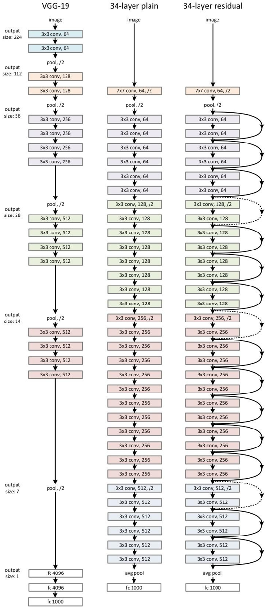

# ResNet

在目标检测领域，mAP 用于评估目标检测算法在多个类别上的检测性能。它综合考虑了算法对不同类别的目标检测的准确率和召回率。

**计算方式**：首先，对于每个类别，计算该类别的平均精度（AP）。这涉及到将检测结果与真实标注进行对比，根据检测框的位置和类别准确性来确定真阳性、假阳性和假阴性等指标，进而计算出不同召回率下的精确率，再通过计算精确率 - 召回率曲线下的面积得到该类别的 AP。最后，将所有类别（一般是数据集里的所有目标类别）的 AP 值求平均，得到 mAP。

mAP 的值越高，说明模型在检索或检测任务中的性能越好，能够更准确地找到相关信息或检测出目标物体，并将其正确分类和定位。

习惯性在第一页放一张精美的图片

# Abstract

深度神经网络的训练难度更大。我们提出了一种残差学习框架，以简化比以往使用的网络更深的网络的训练过程。

我们提供了全面的实证证据，表明这些残差网络更易于优化，并且可以通过大幅增加网络深度来提高精度。

深度神经网络训练难度大，我们提出一直XX方法，这种方法可以达到XX的效果，在XX数据集上能够达到XX的效果，与之前的一些XX相比效果怎么怎么样

# 1.Introduction

深度网络以端到端的多层方式自然地整合了低 / 中 / 高级特征和分类器，并且特征的 “层次” 可以通过堆叠层的数量（深度）来丰富。

最近的研究表明，网络深度至关重要，深度学习网络一般追求窄而深，而不是宽而浅。梯度消失和梯度爆炸从一开始就阻碍模型的收敛，通过初始归一化和中间层归一化可以很大程度解决这个问题。但随着网络深度的加深，准确率会达到饱和，然后迅速下降，这种退化并不是由过拟合导致的。

在本文中，引入深度残差学习框架来解决退化问题。我们不再期望每几个堆叠的层直接拟合期望的潜在映射，而是明确让这些层拟合残差映射。

形式上，将期望的潜在映射表示为*H*(*x*) ，我们让堆叠的非线性层拟合另一个映射*F*(*x*):=*H*(*x*)−*x* 。原始映射就被重新表述为*F*(*x*)+*x* 。

*F*(*x*)+*x*的公式可以通过具有 “快捷连接” 的前馈神经网络来实现（图 2）。快捷连接是指跳过一个或多个层的连接。在我们的例子中，快捷连接简单地执行恒等映射，其输出与堆叠层的输出相加（图 2）。

我们在 ImageNet 上进行了全面的实验，以展示退化问题并评估我们的方法。我们表明：

1. 我们极深的残差网络易于优化，而对应的 “普通” 网络（简单堆叠层）在深度增加时表现出更高的训练误差；
2. 我们的深度残差网络可以轻松地从大幅增加的深度中获得准确率提升，产生的结果明显优于以前的网络。

# 2. Related Work

## Residual Representations

在图像识别中，VLAD 是一种通过相对于字典的残差向量进行编码的表示方法，而 Fisher 向量可以被表述为 VLAD 的概率版本。它们都是用于图像检索和分类的强大浅层表示。对于向量量化，编码残差向量比编码原始向量更有效。

## Shortcut Connections

与我们的工作同时进行的 “高速公路网络” 提出了带有门控函数的快捷连接。这些门是数据相关的且有参数，与我们无参数的恒等快捷连接形成对比。当门控快捷连接 “关闭”（接近零）时，高速公路网络中的层表示非残差函数。相反，我们的公式始终学习残差函数；我们的恒等快捷连接从不关闭，所有信息始终传递，并学习额外的残差函数。此外，高速公路网络在深度大幅增加（例如超过 100 层）时并未显示出准确率的提升。

# 3.Deep Residual Learning

## 3.1 Residual Learing

我们令堆叠层的输出逼近F*(*x*):=*H*(*x*)−*x，原始函数因此变为F*(*x*)+*x

## 3.2 Identity Mapping by Shortcuts

$$
\mathbf{y}=\mathcal{F}(\mathbf{x},\{W_i\})+\mathbf{x}.
$$

这里*x*和*y*是所考虑层的输入和输出向量。函数*F*(*x*,Wi)表示要学习的残差映射。

公式中的快捷连接既不引入额外参数，也不增加计算复杂度。

公式中*x*和*F*的维度必须相等。如果不相等（例如，在改变输入 / 输出通道时），我们可以通过快捷连接执行线性投影Ws以匹配维度：
$$
\mathbf{y}=\mathcal{F}(\mathbf{x},\{W_i\})+W_s\mathbf{x}.
$$

## 3.3 Network Architectures

我们测试了各种普通 / 残差网络，并观察到一致的现象。为了提供讨论的实例，我们如下描述两种用于 ImageNet 的模型。

### Plain Network

我们的普通基线模型主要受 VGG 网络理念的启发（图 3 左）。卷积层大多使用 3×3 的滤波器，并遵循两个简单的设计规则：（i）对于相同的输出特征图大小，层具有相同数量的滤波器；（ii）如果特征图大小减半，滤波器数量加倍，以保持每层的时间复杂度。我们直接通过步长为 2 的卷积层进行下采样。网络以全局平均池化层和具有 softmax 的 1000 路全连接层结束。图 3（中）中加权层的总数为 34 层。

### Residual Network

基于上述普通网络，我们插入快捷连接（图 3 右），将网络转换为其对应的残差版本。当输入和输出维度相同时，可以直接使用恒等快捷连接（图 3 中的实线快捷连接）。当维度增加时（图 3 中的虚线快捷连接），我们考虑两种选择：（A）快捷连接仍然执行恒等映射，通过填充额外的零条目来增加维度。此选项不引入额外参数；（B）使用公式 (2) 中的投影快捷连接来匹配维度（通过 1×1 卷积完成）。对于这两种选项，当快捷连接跨越两种大小的特征图时，它们以步长 2 执行。

图 3. ImageNet 的示例网络架构。左图：作为参考的 VGG-19 模型【41】（196 亿次浮点运算）。中图：具有 34 个参数层的普通网络（36 亿次浮点运算）。右图：具有 34 个参数层的残差网络（36 亿次浮点运算）。虚线表示的快捷连接用于增加维度。表 1 展示了更多细节和其他变体。

## 3.4 Implementation

我们在 ImageNet 上的实现遵循文献的实践。图像的短边在 [256, 480] 中随机采样进行尺度增强。从图像或其水平翻转中随机采样一个 224×224 的裁剪，并减去每个像素的均值。使用文献中的标准颜色增强。我们在每次卷积之后、激活之前采用批量归一化（BN），遵循文献的做法。我们按照文献初始化权重，并从头开始训练所有普通 / 残差网络。我们使用小批量大小为 256 的随机梯度下降法。学习率从 0.1 开始，当误差平稳时除以 10，模型训练最多 60×10⁴次迭代。我们使用 0.0001 的权重衰减和 0.9 的动量。我们不使用随机失活，遵循文献的做法。

# 4. Experiments

## 4.1 ImageNet 分类

### Plain Networks

结果表明，更深的 34 层普通网络比更浅的 18 层普通网络具有更高的验证误差。我们认为这种优化困难不太可能是由梯度消失引起的。我们推测深度普通网络可能具有指数级低的收敛速度，这影响了训练误差的降低。这种优化困难的原因将在未来进行研究。

### Residual Networks

基线架构与上述普通网络相同，只是在每对 3×3 滤波器之间添加了快捷连接，如图 3（右）所示。在第一次比较（表 2 和图 4 右）中，我们对所有快捷连接使用恒等映射，并对增加维度使用零填充（选项 A）。

从表 2 和图 4 中我们有三个主要发现。第一，采用残差学习后情况发生了逆转 ——34 层的残差网络比 18 层的残差网络表现更好（提升了 2.8%）。更重要的是，34 层残差网络的训练误差明显更低，并且在验证数据上具有很好的泛化能力。这表明在这种设置下，退化问题得到了很好的解决，我们成功地从增加的深度中获得了准确率的提升。

接下来，我们研究投影快捷连接（公式 (2)）。在表 3 中，我们比较了三种选择：(A) 增加维度时使用零填充快捷连接，且所有快捷连接都无参数（与表 2 和图 4 右图相同）；(B) 增加维度时使用投影快捷连接，其他快捷连接为恒等连接；(C) 所有快捷连接均为投影连接。

表 3 显示，这三种选择都比普通网络好得多。选项 B 略优于选项 A。我们认为这是因为选项 A 中零填充的维度实际上没有进行残差学习。选项 C 比选项 B 稍好一点，我们将其归因于众多（十三个）投影快捷连接引入的额外参数。但是选项 A、B、C 之间的差异很小，这表明投影快捷连接对于解决退化问题并非必不可少。

### Deeper Bottleneck Architectures

接下来，我们介绍用于 ImageNet 的更深层网络。考虑到可承受的训练时间，我们将构建模块修改为瓶颈设计 。对于每个残差函数 F，我们使用 3 层堆叠结构，而非 2 层（见图 5）。这三层分别是 1×1 卷积层、3×3 卷积层和 1×1 卷积层，其中 1×1 卷积层负责先降维，再升维（恢复维度），使得 3×3 卷积层成为具有较小输入 / 输出维度的瓶颈层。图 5 展示了一个示例，两种设计的时间复杂度相近。

无参数的恒等快捷连接对于瓶颈架构尤为重要。如果将图 5（右）中的恒等快捷连接替换为投影连接，可以发现时间复杂度和模型大小都会翻倍，因为该快捷连接连接到了两个高维端点。所以，对于瓶颈设计而言，恒等快捷连接能带来更高效的模型。

50 层残差网络：我们用这种 3 层瓶颈模块替换 34 层网络中的每个 2 层模块，从而得到一个 50 层的残差网络（见表 1）。在增加维度时我们采用选项 B。这个模型的浮点运算量为 38 亿次。

101 层和 152 层残差网络：我们通过使用更多的 3 层模块构建了 101 层和 152 层的残差网络（见表 1）。值得注意的是，尽管深度显著增加，但 152 层的残差网络（113 亿次浮点运算）的复杂度仍然低于 VGG-16/19 网络（分别为 153 亿次和 196 亿次浮点运算 ）。

50 层、101 层和 152 层的残差网络在准确率上比 34 层的残差网络有显著提升（见表 3 和表 4）。我们没有观察到退化问题，因此从大幅增加的深度中获得了显著的准确率提升。深度带来的优势在所有评估指标上都有体现（见表 3 和表 4）。

### Comparisons with State-of-the-art Methods

在表 4 中，我们将模型与此前最优的单模型结果进行了对比。我们的 34 层残差网络基线模型取得了极具竞争力的准确率。我们的 152 层残差网络单模型在验证集上的前 5 错误率为 4.49%。这一单模型结果超越了之前所有的集成模型结果（见表 5）。

## 4.2 CIFAR-10 and Analysis

介绍了实验的一些情况

### Analysis of Layer Responses

图 7 展示了层响应的标准差（std）。这些响应是每个 3×3 层在批归一化（BN）之后、其他非线性操作（ReLU / 相加）之前的输出。对于残差网络（ResNets），这一分析揭示了残差函数的响应强度。图 7 表明，残差网络的响应通常比普通网络的响应要小。这些结果支持了我们在 3.1 节中提到的基本动机，即残差函数的值通常比非残差函数更接近零。我们还注意到，更深的残差网络的响应幅度更小，图 7 中 ResNet-20、ResNet-56 和 ResNet-110 之间的比较就证明了这一点。当网络层数更多时，残差网络的单个层对信号的修改往往更少。

探索超过 1000 层的网络。我们探索了一个深度极大的、超过 1000 层的模型。我们设置*n*=200，这产生了一个 1202 层的网络，按照上述方式进行训练。我们的方法没有表现出优化方面的困难，并且这个 1000层的网络能够使训练误差小于0.1%（图 6，右侧）。其测试误差仍然相当不错（7.93%，见表 6）。

但对于这个深度极大的模型而言，仍然存在一些尚未解决的问题。这个 1202 层网络的测试结果比我们的 110 层网络要差，尽管二者的训练误差相近。

## 4.3 Object Detection on PASCAL and MS COCO

介绍了在COCO数据集上得到的效果

