# Swin Transformer

# 1. 网络整体架构

Swin Transformer使用了类似卷积神经网络中的层次化构建方法（Hierarchical feature maps），比如特征图尺寸中有对图像下采样4倍的，8倍的以及16倍的，这样的backbone有助于在此基础上构建目标检测，实例分割等任务。而在之前的Vision Transformer中是一开始就直接下采样16倍，后面的特征图也是维持这个下采样率不变。
在Swin Transformer中使用了Windows Multi-Head Self-Attention(W-MSA)的概念，比如在下图的4倍下采样和8倍下采样中，将特征图划分成了多个不相交的区域（Window），并且Multi-Head Self-Attention只在每个窗口（Window）内进行。相对于Vision Transformer中直接对整个（Global）特征图进行Multi-Head Self-Attention，这样做的目的是能够减少计算量的，尤其是在浅层特征图很大的时候。这样做虽然减少了计算量但也会隔绝不同窗口之间的信息传递，所以在论文中作者又提出了 Shifted Windows Multi-Head Self-Attention(SW-MSA)的概念，通过此方法能够让信息在相邻的窗口中进行传递
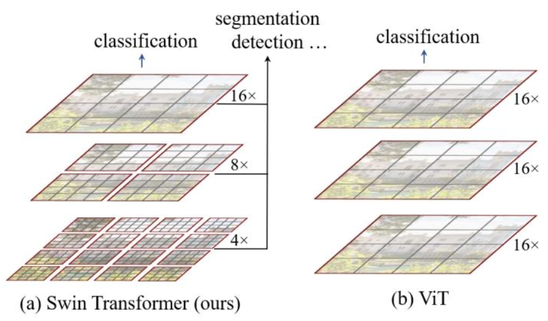

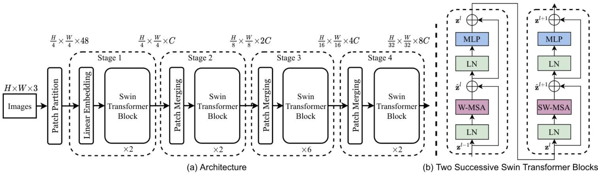

网络架构基本流程：

1. 首先将图片输入到Patch Partition模块中进行分块，即每4x4相邻的像素为一个Patch，然后在channel方向展平（flatten）。假设输入的是RGB三通道图片，那么每个patch就有4x4=16个像素，然后每个像素有R、G、B三个值所以展平后是16x3=48，所以通过Patch Partition后图像shape由 [H, W, 3]变成了 [H/4, W/4, 48]。然后在通过Linear Embeding层对每个像素的channel数据做线性变换，由48变成C，即图像shape再由 [H/4, W/4, 48]变成了 [H/4, W/4, C]。其实在源码中Patch Partition和Linear Embeding就是直接通过一个卷积层实现的，和之前Vision Transformer中讲的 Embedding层结构一模一样。
2. 然后就是通过四个Stage构建不同大小的特征图，除了Stage1中先通过一个Linear Embeding层外，剩下三个stage都是先通过一个**Patch Merging**层进行下采样。然后都是重复堆叠Swin Transformer Block注意这里的Block其实有两种结构，如图(b)中所示，这两种结构的不同之处仅在于一个使用了**W-MSA**结构，一个使用了**SW-MSA**结构。而且这两个结构是成对使用的，先使用一个W-MSA结构再使用一个SW-MSA结构。所以你会发现堆叠Swin Transformer Block的次数都是偶数（因为成对使用）。
3. 最后对于分类网络，后面还会接上一个Layer Norm层、全局池化层以及全连接层得到最终输出。

# 2. Patch Merging 详解

前面有说，在每个Stage中首先要通过一个Patch Merging层进行下采样（Stage1除外）。如下图所示，假设输入Patch Merging的是一个4x4大小的单通道特征图（feature map），Patch Merging会将每个2x2的相邻像素划分为一个patch，然后将每个patch中相同位置（同一颜色）像素给拼在一起就得到了4个feature map。接着将这四个feature map在深度方向进行concat拼接，然后在通过一个LayerNorm层。最后通过一个全连接层在feature map的深度方向做线性变化，将feature map的深度由C变成C/2。通过这个简单的例子可以看出，通过Patch Merging层后，feature map的高和宽会减半，深度会翻倍。

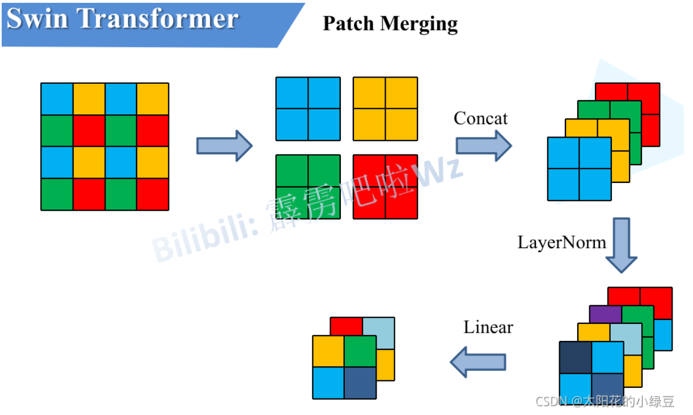

# 3. W-MSA详解

引入Windows Multi-head Self-Attention（W-MSA）模块是为了减少计算量。如下图所示，左侧使用的是普通的Multi-head Self-Attention（MSA）模块，对于feature map中的每个像素（或称作token，patch）在Self-Attention计算过程中需要和所有的像素去计算。但在图右侧，在使用Windows Multi-head Self-Attention（W-MSA）模块时，首先将feature map按照MxM（例子中的M=2）大小划分成一个个Windows，然后单独对每个Windows内部进行Self-Attention。
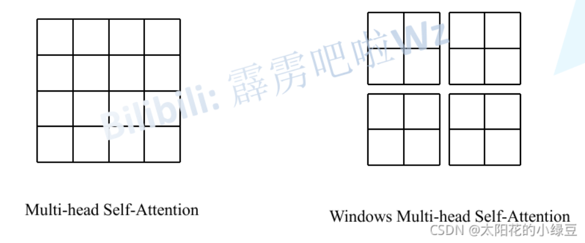

两者的计算量具体差多少呢？原论文中有给出下面两个公式，这里忽略了Softmax的计算复杂度：

$$
\Omega(\mathrm{MSA})=4\mathrm{hwC}^2+2\mathrm{(hw)}^2\mathrm{C}
$$

$$
\Omega(\mathrm{W}-\mathrm{MSA})=4\mathrm{hwC}^2+2\mathrm{M}^2\mathrm{hwC}
$$

- h代表feature map的高度
- w代表feature map的宽度
- C代表feature map的深度
- M代表每个窗口（Windows）的大小

公式如何计算在此略过，详情请看原文[链接](https://blog.csdn.net/qq_37541097/article/details/121119988)

# 4. SW-MSA详解

Swin Transformer 与传统 Transformer 相比，在计算复杂度上有何优势？

- 传统 Transformer 在计算自注意力时，复杂度与 token 数量呈二次方关系，对于高分辨率图像或大量 token 的任务计算成本高昂。而 Swin Transformer 通过在非重叠窗口内计算自注意力，当窗口内补丁数量固定时，计算复杂度与图像大小呈线性关系，大大降低了计算成本，使其更适用于视觉任务。

前面有说，采用W-MSA模块时，只会在每个窗口内进行自注意力计算，所以窗口与窗口之间是无法进行信息传递的。为了解决这个问题，作者引入了Shifted Windows Multi-Head Self-Attention（SW-MSA）模块，即进行偏移的W-MSA。如下图所示，左侧使用的是刚刚讲的W-MSA（假设是第L层），那么根据之前介绍的W-MSA和SW-MSA是成对使用的，那么第L+1层使用的就是SW-MSA（右侧图）。根据左右两幅图对比能够发现窗口（Windows）发生了偏移（可以理解成窗口从左上角分别向右侧和下方各偏移了 $\left\lfloor\frac{\mathrm{M}}2\right\rfloor $ 个像素）。看下偏移后的窗口（右侧图），比如对于第一行第2列的2x4的窗口，它能够使第L层的第一排的两个窗口信息进行交流。再比如，第二行第二列的4x4的窗口，他能够使第L层的四个窗口信息进行交流，其他的同理。那么这就解决了不同窗口之间无法进行信息交流的问题。

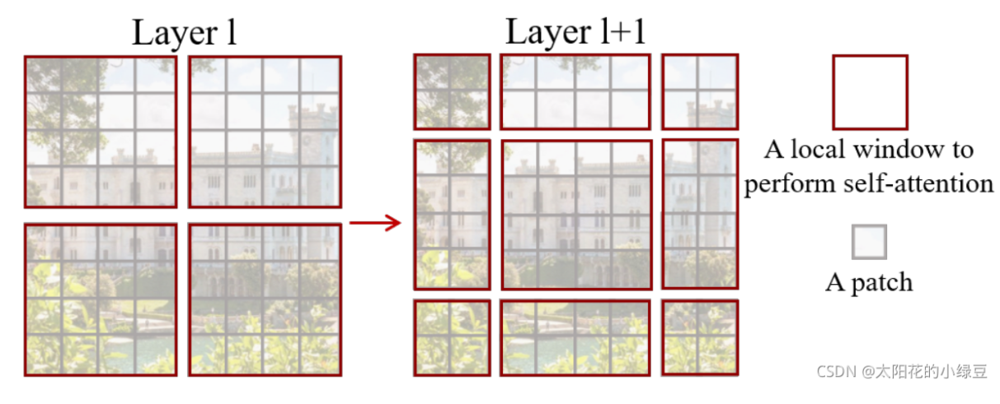

根据上图，可以发现通过将窗口进行偏移后，由原来的4个窗口变成9个窗口了。后面又要对每个窗口内部进行MSA，这样做感觉又变麻烦了。为了解决这个麻烦，作者又提出而了Efficient batch computation for shifted configuration，一种更加高效的计算方法。下面是原论文给的示意图。

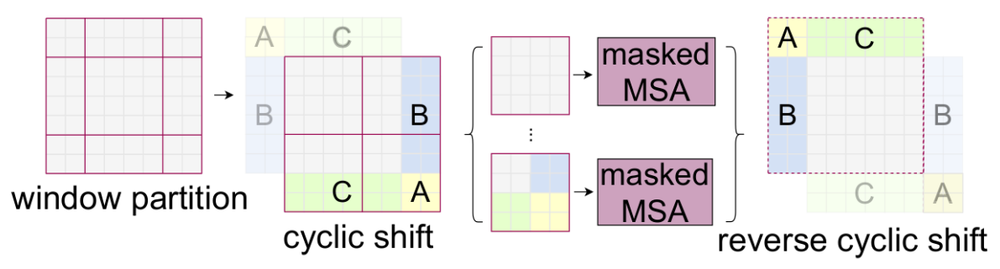

下图左侧是刚刚通过偏移窗口后得到的新窗口，右侧是为了方便大家理解，对每个窗口加上了一个标识。然后0对应的窗口标记为区域A，3和6对应的窗口标记为区域B，1和2对应的窗口标记为区域C。

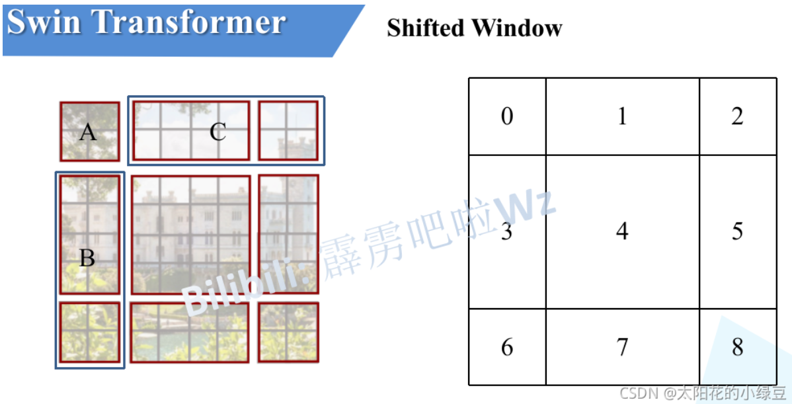

然后先将区域A和C移到最下方。接着，再将区域A和B移至最右侧。

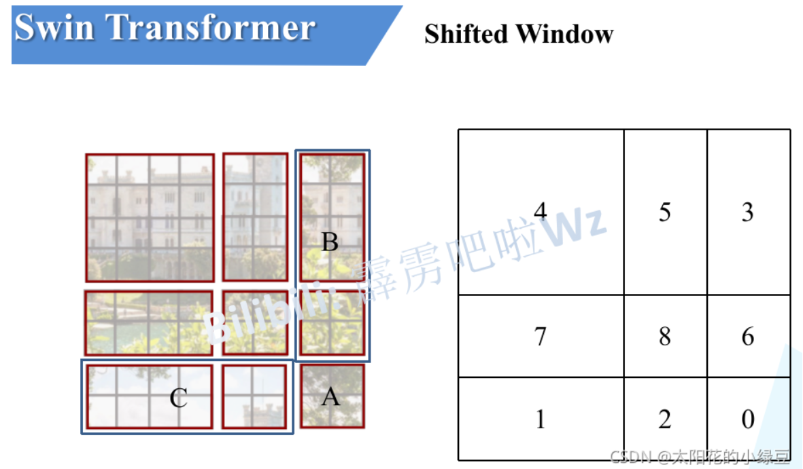

移动完后，4是一个单独的窗口；将5和3合并成一个窗口；7和1合并成一个窗口；8、6、2和0合并成一个窗口。这样又和原来一样是4个4x4的窗口了，所以能够保证计算量是一样的。这里肯定有人会想，把不同的区域合并在一起（比如5和3）进行MSA，这信息不就乱窜了吗？是的，为了防止这个问题，在实际计算中使用的是masked MSA即带蒙板mask的MSA，这样就能够通过设置蒙板来隔绝不同区域的信息了。关于mask如何使用，可以看下下面这幅图，下图是以上面的区域5和区域3为例。

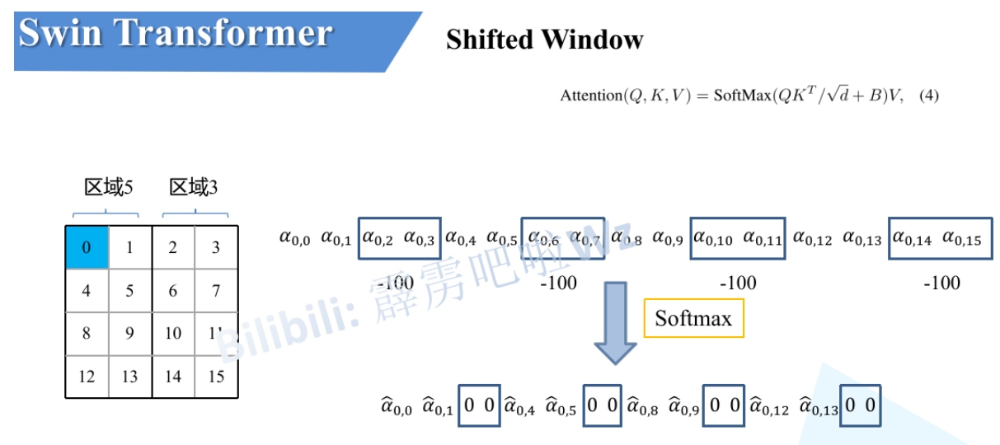

掩码可视化：

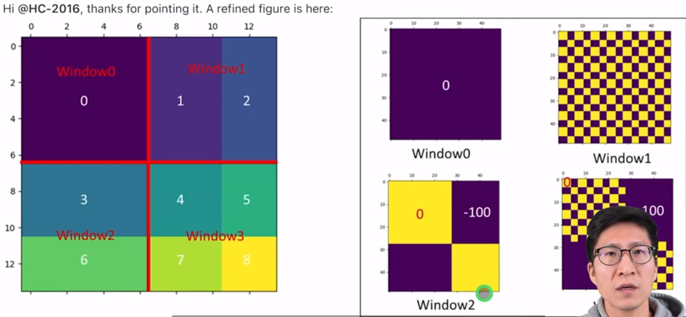

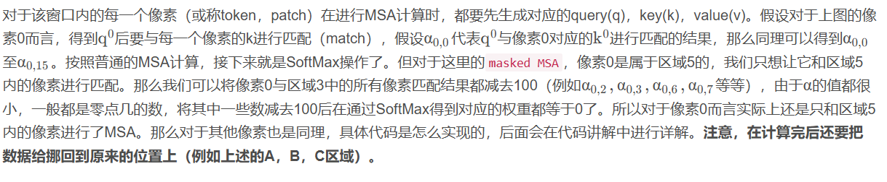

# 5. Relative Position Bias详解

移位窗口自注意力中的相对位置偏差对模型性能有怎样的影响？

- 相对位置偏差在多个视觉任务中对模型性能有显著提升作用。在 ImageNet-1K 图像分类中，Swin-T 使用相对位置偏差相比无位置编码和绝对位置嵌入，top-1 准确率分别提升 1.2% 和 0.8%；在 COCO 目标检测中，box AP 分别提升 1.3 和 1.5，mask AP 分别提升 1.1 和 1.3；在 ADE20K 语义分割中，mIoU 分别提升 2.3 和 2.9。加入绝对位置嵌入虽对图像分类有少量提升，但会损害目标检测和语义分割性能。

# 6. 总结

Swin Transformer 在不同视觉任务中的实验设置有哪些差异？

- **图像分类（ImageNet-1K）**：有常规 ImageNet-1K 训练和 ImageNet-22K 预训练 + ImageNet-1K 微调两种设置。前者使用 AdamW 优化器训练 300 个 epoch，采用余弦退火学习率调度和 20 个 epoch 的线性热身；后者在 ImageNet-22K 上预训练 90 个 epoch，使用线性衰减学习率调度和 5 个 epoch 的线性热身，在 ImageNet-1K 微调时训练 30 个 epoch。
- **目标检测（COCO）**：消融研究使用四个典型框架，采用多尺度训练、AdamW 优化器（初始学习率 0.0001，权重衰减 0.05，批次大小 16）和 3x 训练计划（36 个 epoch）；系统级比较采用改进的 HTC（HTC++）框架，更强的多尺度训练、6x 训练计划（72 个 epoch）、soft-NMS 和 ImageNet-22K 预训练模型初始化。
- **语义分割（ADE20K）**：使用 UperNet 框架，采用 AdamW 优化器（初始学习率 6×10⁻⁵，权重衰减 0.01），线性学习率衰减调度和 1500 次迭代的线性热身，在 8 个 GPU 上训练 160K 次迭代，采用多种数据增强方式，不同模型输入分辨率不同，推理时采用多尺度测试。

原文链接：https://blog.csdn.net/qq_37541097/article/details/121119988
