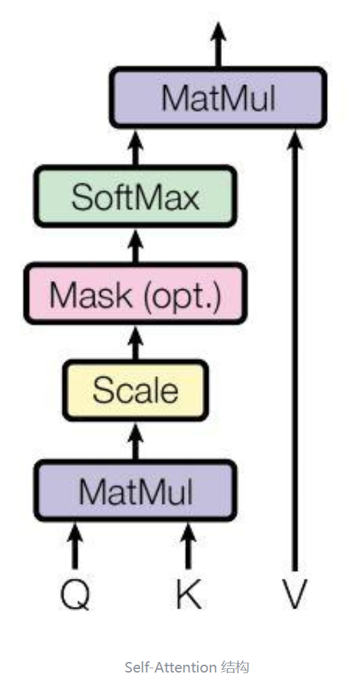
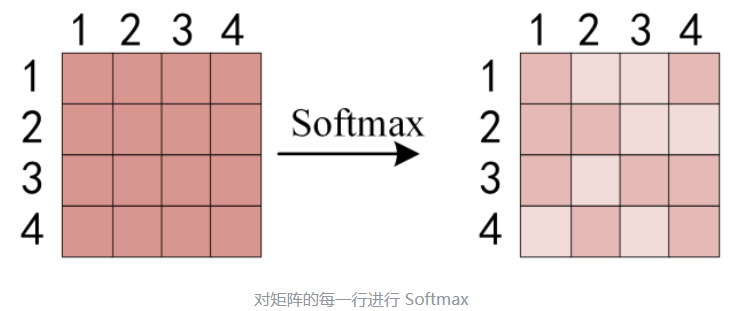

# Transformer

# 前言

本文只讲解Transformer的结构及数据之间的流转计算，详细视频教程可参考[李宏毅老师的机器学习教程](https://www.youtube.com/watch?v=ugWDIIOHtPA&list=PLJV_el3uVTsOK_ZK5L0Iv_EQoL1JefRL4&index=61)

# 1.Transformer整体结构

相信大家对这幅图也已经很熟悉了，不少地方都能见到这幅图的身影，该结构采用Encoder-Decoder，接下来按照输入-输出的部分介绍该结构

# 2.输入向量和位置编码

对于输入来说我们都知道需要将词语转化为向量才能够输入计算机进行处理，这里就是将每一个词的Embedding与其位置的Embedding相加得到输入的词向量

## 2.1 单词Embedding

将词语转换为词向量的方法，最简单的方法是one-hot，但这种方法相对来说效果较差，无法保留词性之间的关系，其方法还有Word2Vec、Glove等。

## 2.2 位置Embedding

因为Transformer不采用RNN结构，而是采用全局信息，因此使用位置Embedding来保存单词之间的相对位置关系。

位置 Embedding 用 **PE**表示，**PE** 的维度与单词 Embedding 是一样的。PE 可以通过训练得到，也可以使用某种公式计算得到。在 Transformer 中采用了后者，计算公式如下：
$$
PE_{(pos,2i)}=\sin{(pos/1000^{2i/d})}
$$

$$
PE_{(pos,2i+1)}=\cos{(pos/10000^{2i/d})}
$$

其中，pos 表示单词在句子中的位置，d 表示 PE的维度 (与词 Embedding 一样)，2i 表示偶数的维度，2i+1 表示奇数维度 (即 2i≤d, 2i+1≤d)。使用这种公式计算 PE 有以下的好处：

- 使 PE 能够适应比训练集里面所有句子更长的句子，假设训练集里面最长的句子是有 20 个单词，突然来了一个长度为 21 的句子，则使用公式计算的方法可以计算出第 21 位的 Embedding。
- 可以让模型容易地计算出相对位置，对于固定长度的间距 k，**PE(pos+k)** 可以用 **PE(pos)** 计算得到。因为 Sin(A+B) = Sin(A)Cos(B) + Cos(A)Sin(B), Cos(A+B) = Cos(A)Cos(B) - Sin(A)Sin(B)。

将单词的词 Embedding 和位置 Embedding 相加，就可以得到单词的表示向量 **x**，**x** 就是 Transformer 的输入。

## 2.3输入

经过前两部后，我们得到Transformer的输入$X$，通常为一个矩阵$X_{n\times d}$，其中$n$是句子中的单词个数，$d$表示向量的维度（论文中d=512），每一行是一个单词的词向量表示$x$。

# 3.自注意力机制

Transformer中用到的是多头注意力机制，但要想更好地理解它，我们要从自注意力机制Self-Attention开始

## 3.1 Self-Attention

上图是Self-Attention的结构，计算时需要用到Q（查询）、K（键值）、V（值），在Transformer的Encoder中，Self-Attention接收的是输入矩阵$X_{n*d}$，在Decoder中，Self-Attention接收的是Encoderblock的输出（同样是一个$n*d$维矩阵，我们用$C_{n*d}$表示）。

### 3.1.1 Q、K、V如何计算

既然我们知道Self-Attention接收的是Q、K、V矩阵，而我们在上一步传入的是句子的向量表示$X_{n*d}$，那么Q、K、V也一定是由$X_{n*d}$计算而来。

我们使用线性变化矩阵$W^{Q}、W^{K}、W^{V}$来计算得到Q、K、V，计算如下，其中X、Q、K、V的每一行都表示一个单词。在自注意力机制中，我们实际需要训练的权重也就只有$W^{Q}、W^{K}、W^{V}$这三个参数而已。

### 3.1.2 Self-Attention的输出

得到矩阵Q、K、V之后就可以计算出Self-Attention的输出，计算公式如下：
$$
\mathrm{Attention}(Q,K,V)=\mathrm{softmax}\left(\frac{QK^{T}}{\sqrt{d_{k}}}\right)V
$$
其中，$d_{k}$是Q、K矩阵的列数，即向量维度

公式中计算矩阵**Q**和**K**每一行向量的内积，为了防止内积过大，因此除以$d_{k}$的平方根。**Q**乘以**K**的转置后，得到的矩阵行列数都为 n，n 为句子单词数，这个矩阵可以表示单词之间的 attention 强度。下图为**Q**乘以 $k^{T}$ ，1234 表示的是句子中的单词。

得到 $QK^{T}$ 之后，使用 Softmax 计算每一个单词对于其他单词的 attention 系数，公式中的 Softmax 是对矩阵的每一行进行 Softmax，即每一行的和都变为 1.

得到 Softmax 矩阵之后可以和**V**相乘，得到最终的输出**Z**。

上图中 Softmax 矩阵的第 1 行表示单词 1 与其他所有单词的 attention 系数，最终单词 1 的输出 Z1 等于所有单词 i 的值 $V_{i}$ 根据 attention 系数的比例加在一起得到，如下图所示：

## 3.2 Multi-Head Attention

