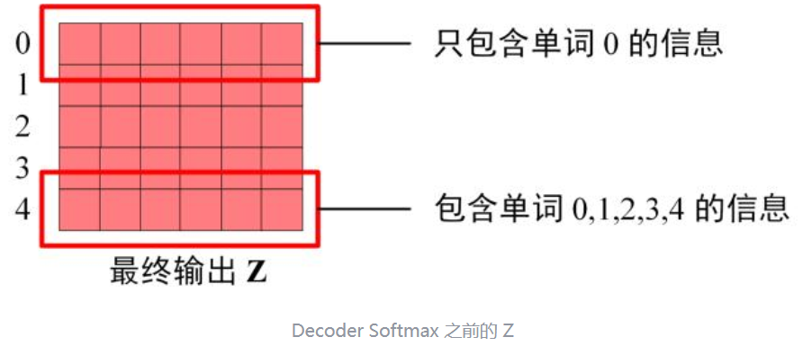

# Transformer

# 前言

本文只讲解Transformer的结构及数据之间的流转计算，详细视频教程可参考[李宏毅老师的机器学习教程](https://www.youtube.com/watch?v=ugWDIIOHtPA&list=PLJV_el3uVTsOK_ZK5L0Iv_EQoL1JefRL4&index=61)

# 1.Transformer整体结构

相信大家对这幅图也已经很熟悉了，不少地方都能见到这幅图的身影，该结构采用Encoder-Decoder，接下来按照输入-输出的部分介绍该结构

# 2.输入向量和位置编码

对于输入来说我们都知道需要将词语转化为向量才能够输入计算机进行处理，这里就是将每一个词的Embedding与其位置的Embedding相加得到输入的词向量

## 2.1 单词Embedding

将词语转换为词向量的方法，最简单的方法是one-hot，但这种方法相对来说效果较差，无法保留词性之间的关系，其方法还有Word2Vec、Glove等。

## 2.2 位置Embedding

因为Transformer不采用RNN结构，而是采用全局信息，因此使用位置Embedding来保存单词之间的相对位置关系。

位置 Embedding 用 **PE**表示，**PE** 的维度与单词 Embedding 是一样的。PE 可以通过训练得到，也可以使用某种公式计算得到。在 Transformer 中采用了后者，计算公式如下：
$$
PE_{(pos,2i)}=\sin{(pos/1000^{2i/d})}
$$

$$
PE_{(pos,2i+1)}=\cos{(pos/10000^{2i/d})}
$$

其中，pos 表示单词在句子中的位置，d 表示 PE的维度 (与词 Embedding 一样)，2i 表示偶数的维度，2i+1 表示奇数维度 (即 2i≤d, 2i+1≤d)。使用这种公式计算 PE 有以下的好处：

- 使 PE 能够适应比训练集里面所有句子更长的句子，假设训练集里面最长的句子是有 20 个单词，突然来了一个长度为 21 的句子，则使用公式计算的方法可以计算出第 21 位的 Embedding。
- 可以让模型容易地计算出相对位置，对于固定长度的间距 k，**PE(pos+k)** 可以用 **PE(pos)** 计算得到。因为 Sin(A+B) = Sin(A)Cos(B) + Cos(A)Sin(B), Cos(A+B) = Cos(A)Cos(B) - Sin(A)Sin(B)。

将单词的词 Embedding 和位置 Embedding 相加，就可以得到单词的表示向量 **x**，**x** 就是 Transformer 的输入。

## 2.3输入

经过前两部后，我们得到Transformer的输入$X$，通常为一个矩阵$X_{n\times d}$，其中$n$是句子中的单词个数，$d$表示向量的维度（论文中d=512），每一行是一个单词的词向量表示$x$。

# 3.自注意力机制

Transformer中用到的是多头注意力机制，但要想更好地理解它，我们要从自注意力机制Self-Attention开始

## 3.1 Self-Attention

上图是Self-Attention的结构，计算时需要用到Q（查询）、K（键值）、V（值），在Transformer的Encoder中，Self-Attention接收的是输入矩阵$X_{n*d}$，在Decoder中，Self-Attention接收的是Encoderblock的输出（同样是一个$n*d$维矩阵，我们用$C_{n*d}$表示）。

### 3.1.1 Q、K、V如何计算

既然我们知道Self-Attention接收的是Q、K、V矩阵，而我们在上一步传入的是句子的向量表示$X_{n*d}$，那么Q、K、V也一定是由$X_{n*d}$计算而来。

我们使用线性变化矩阵$W^{Q}、W^{K}、W^{V}$来计算得到Q、K、V，计算如下，其中X、Q、K、V的每一行都表示一个单词。在自注意力机制中，我们实际需要训练的权重也就只有$W^{Q}、W^{K}、W^{V}$这三个参数而已。

### 3.1.2 Self-Attention的输出

得到矩阵Q、K、V之后就可以计算出Self-Attention的输出，计算公式如下：
$$
\mathrm{Attention}(Q,K,V)=\mathrm{softmax}\left(\frac{QK^{T}}{\sqrt{d_{k}}}\right)V
$$
**其中，$d_{k}$是Q、K矩阵的列数，即向量维度**

公式中计算矩阵**Q**和**K**每一行向量的内积，为了防止内积过大，因此除以$d_{k}$的平方根。**Q**乘以**K**的转置后，得到的矩阵行列数都为 n，n 为句子单词数，这个矩阵可以表示单词之间的 attention 强度。下图为**Q**乘以 $k^{T}$ ，1234 表示的是句子中的单词。

得到 $QK^{T}$ 之后，使用 Softmax 计算每一个单词对于其他单词的 attention 系数，公式中的 Softmax 是对矩阵的每一行进行 Softmax，即每一行的和都变为 1.

得到 Softmax 矩阵之后可以和**V**相乘，得到最终的输出**Z**。**其中输出Z的维度也是 $n*d$**

上图中 Softmax 矩阵的第 1 行表示单词 1 与其他所有单词的 attention 系数，最终单词 1 的输出 Z1 等于所有单词 i 的值 $V_{i}$ 根据 attention 系数的比例加在一起得到，如下图所示：

### 3.1.3 补充解释

这部分来自李宏毅机器学习课程

针对我们的每一个q、k、v向量（输入词向量的表示），我们用一个词向量的q向量表示，与其它词向量的k向量表示进行**点乘**得到$\alpha$，这个$\alpha$就代表这两个词向量之间关系的**权重**，也即注意力权重

结合下图理解，当我们用$q^{2}$词向量与其它词向量的k向量表示进行相乘时，就得到了这个词向量与其它词向量之间关系的权重$\alpha_{2,1}$、$\alpha_{2,2}$、$\alpha_{2,3}$、$\alpha_{2,4}$

转化为矩阵运算就是上面所用到的$QK^{T}$，图中用的$KQ^{T}$，不过原理都一样

通过矩阵的运算，$QK^{T}$得到了单词间的注意力权重矩阵$A$，为了防止内积过大，因此除以$d_{k}$的平方根（$d_{k}$是Q、K矩阵的列数，即向量的维度），然后经过一个Softmax计算每一个单词对于其他单词的 attention 系数$A^{'}$，公式中的 Softmax 是对矩阵的每一行进行 Softmax，即每一行的和都变为 1.

得到 Softmax 矩阵之后可以和值矩阵**V**相乘，得到最终的输出**Z**。

整体的过程如下图：我们所需要训练的参数仅仅只有$W^{q}$、$W^{k}$、$W^{v}$

## 3.2 Multi-Head Attention

Multi-Head Attention 包含多个 Self-Attention 层，首先将输入**X**分别传递到 h 个不同的 Self-Attention 中，计算得到 h 个输出矩阵**Z**。

下图是 h=8 时候的情况，此时会得到 8 个输出矩阵**Z**。

得到 8 个输出矩阵 Z1 到 Z8 之后，Multi-Head Attention 将它们拼接在一起 **(Concat)**，然后传入一个**Linear**层，得到 Multi-Head Attention 最终的输出**Z**。

**可以看到 Multi-Head Attention** **输出的矩阵Z与其输入的矩阵X的维度是一样的**，均为（n*d）

# 4.Encoder 结构

我们经过了Multi-Head Attention，接下来就该Add&Norm、Feed Froward和Add&Norm了

## 4.1 Add & Norm

这部分分别由Add和Norm两部分组成，计算公式如下：
$$
\mathrm{LayerNorm}\big(X+\text{MultiHeadAttention}(X)\big)
$$

$$
\mathrm{LayerNorm}\big(X+\text{FeedForward}(X)\big)
$$

其中 **X**表示 Multi-Head Attention 或者 Feed Forward 的输入，MultiHeadAttention(**X**) 和 FeedForward(**X**) 表示输出 (输出与输入 **X** 维度是一样的，所以可以相加)。

**Add**指 **X**+MultiHeadAttention(**X**)，是一种残差连接，通常用于解决多层网络训练的问题，可以让网络只关注当前差异的部分，在 ResNet 中经常用到，详细请看ResNet

**Norm**指 Layer Normalization，通常用于 RNN 结构，Layer Normalization 会将每一层神经元的输入都转成均值方差都一样的，这样可以加快收敛。

与其功能类似的还有Batch Normalization，但Batch Normalization通常适用于有固定长度的输入中，常用于CV领域，这里我们采用Layer Normalization。

## 4.2 Feed Forward

Feed Forward 层比较简单，是一个两层的全连接层，第一层的激活函数为 ReLU，第二层不使用激活函数，对应的公式如下：
$$
\max(0,XW_1+b_1)W_2+b_2
$$
**X**是输入，Feed Forward 最终得到的输出矩阵的维度与**X**一致。

## 4.3 组成Encoder

通过上面描述的 Multi-Head Attention, Feed Forward, Add & Norm 就可以构造出一个 Encoder block，Encoder block 接收输入矩阵 $X_{n*d}$ ，并输出一个矩阵 $O_{n*d}$。通过多个 Encoder block 叠加就可以组成 Encoder。

第一个 Encoder block 的输入为句子单词的表示向量矩阵，后续 Encoder block 的输入是前一个 Encoder block 的输出，最后一个 Encoder block 输出的矩阵就是**编码信息矩阵 C**，这一矩阵后续会用到 Decoder 中。

# 5. Decoder结构

 Transformer 的 Decoder block 结构，与 Encoder block 相似，但是存在一些区别：

+ 包含两个 Multi-Head Attention 层。
+ 第一个 Multi-Head Attention 层采用了 Masked 操作。
+ 第二个 Multi-Head Attention 层的**K, V**矩阵使用 Encoder 的**编码信息矩阵C**进行计算，而**Q**使用上一个 Decoder block 的输出计算。
+ 最后有一个 Softmax 层计算下一个翻译单词的概率。

## 5.1 Masked Multi-Head Attention

Decoder block 的第一个 Multi-Head Attention 采用了 Masked 操作，因为在翻译的过程中是顺序翻译的，即翻译完第 i 个单词，才可以翻译第 i+1 个单词。通过 Masked 操作可以防止第 i 个单词知道 i+1 个单词之后的信息。

如下图所示。首先根据输入 "<Begin>" 预测出第一个单词为 "I"，然后根据输入 "<Begin> I" 预测下一个单词 "have"。

Decoder 可以在训练的过程中使用 Teacher Forcing 并且并行化训练，即将正确的单词序列 (<Begin> I have a cat) 和对应输出 (I have a cat <end>) 传递到 Decoder。那么在预测第 i 个输出时，就要将第 i+1 之后的单词掩盖住，**注意 Mask 操作是在 Self-Attention 的 Softmax 之前使用的，下面用 0 1 2 3 4 5 分别表示 "<Begin> I have a cat <end>"。**

**第一步：**是 Decoder 的输入矩阵和 **Mask** 矩阵，输入矩阵包含 "<Begin> I have a cat" (0, 1, 2, 3, 4) 五个单词的表示向量，**Mask** 是一个 5×5 的矩阵。在 **Mask** 可以发现单词 0 只能使用单词 0 的信息，而单词 1 可以使用单词 0, 1 的信息，即只能使用之前的信息。

**第二步：**接下来的操作和之前的 Self-Attention 一样，通过输入矩阵**X**计算得到**Q,K,V**矩阵。然后计算**Q**和 $K^{T}$ 的乘积 $QK^{T}$ 。

**第三步：**在得到 $QK^{T}$ 之后需要进行 Softmax，计算 attention score，我们在 Softmax 之前需要使用**Mask**矩阵遮挡住每一个单词之后的信息，遮挡操作如下：

得到 **Mask** $QK^{T}$ 之后在 **Mask** $QK^{T}$上进行 Softmax，每一行的和都为 1。但是单词 0 在单词 1, 2, 3, 4 上的 attention score 都为 0。

**第四步：**使用 **Mask** $QK^{T}$与矩阵 **V**相乘，得到输出 **Z**，则单词 1 的输出向量 $Z_{1}$ 是只包含单词 1 信息的。

**第五步：**通过上述步骤就可以得到一个 Mask Self-Attention 的输出矩阵 $Z_i$ ，然后和 Encoder 类似，通过 Multi-Head Attention 拼接多个输出$Z_i$然后计算得到第一个 Multi-Head Attention 的输出**Z**，**Z**与输入**X**维度一样。

## 5.2 Multi-Head Attention

Decoder block 第二个 Multi-Head Attention 变化不大， 主要的区别在于其中 Self-Attention 的 **K, V**矩阵不是使用 上一个 Decoder block 的输出计算的，而是使用 **Encoder 的编码信息矩阵 C** 计算的。

根据 Encoder 的输出 **C**计算得到 **K, V**，根据上一个 Decoder block 的输出 **Z** 计算 **Q** (如果是第一个 Decoder block 则使用输入矩阵 **X** 进行计算)，后续的计算方法与之前描述的一致。

这样做的好处是在 Decoder 的时候，每一位单词都可以利用到 Encoder 所有单词的信息 (这些信息无需 **Mask**)。

## 5.3 Softmax 预测输出单词

Decoder block 最后的部分是利用 Softmax 预测下一个单词，在之前的网络层我们可以得到一个最终的输出 Z，因为 Mask 的存在，使得单词 0 的输出 Z0 只包含单词 0 的信息，如下：

Softmax 根据输出矩阵的每一行预测下一个单词

# 6. 总结

+ Transformer 与 RNN 不同，可以比较好地并行训练。
+ Transformer 本身是不能利用单词的顺序信息的，因此需要在输入中添加位置 Embedding，否则 Transformer 就是一个词袋模型了。
+ Transformer 的重点是 Self-Attention 结构，其中用到的 **Q, K, V**矩阵通过输出进行线性变换得到。
+ Transformer 中 Multi-Head Attention 中有多个 Self-Attention，可以捕获单词之间多种维度上的相关系数 attention score。

