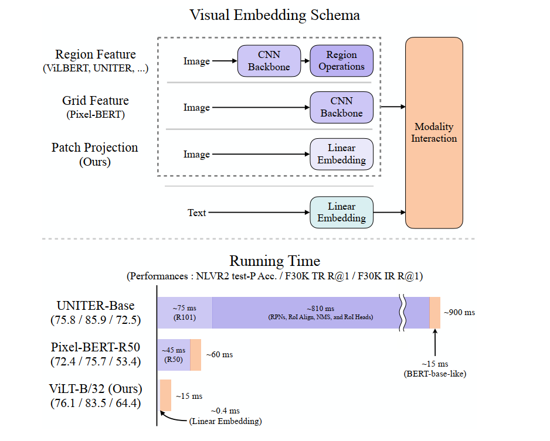
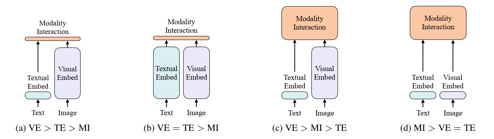
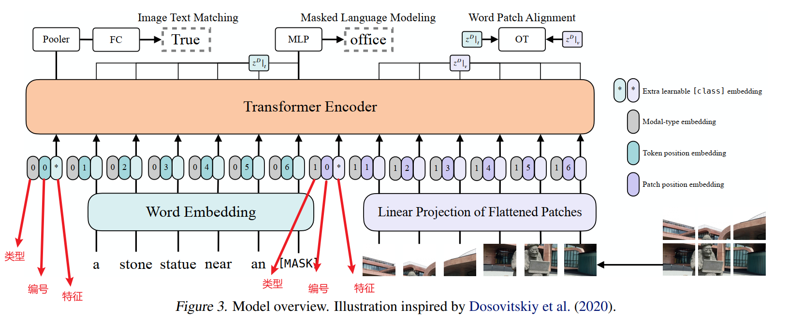

# ViLT

ViLT: Vision-and-Language Transformer Without Convolution or Region Supervision

手速比较快，在ViT发表之后，很快将其中的对图像的处理部分应用到多模态领域

# 背景与动机

Vision-and-Language Pre-training（VLP）模型在视觉与语言联合任务（如图文检索、视觉问答等）上取得了显著效果。但现有主流方法在视觉特征提取上依赖两大“重资产”：

1. **区域级特征（Region Features）**：先用 Faster R-CNN 等检测器产生 RoI，再经过 RoI Align、NMS 等多步处理，费时数百毫秒。
2. **卷积网格特征（Grid Features）**：用 ResNet 系列深层 CNN 提取整图特征，同样计算量大（几十至上百 GFLOPs）和时延高。

作者指出，这两种方式在**推理速度**和**表达能力**上都存在瓶颈：①特征提取往往比后续 Transformer 交互计算更耗时；②视觉 embedder 的能力上限受其预定义视觉词汇限制 。因此，文中提出一种“极简”方案——ViLT，将视觉输入的嵌入简化到与文本一样的线性投影级别，从而大幅降低参数量与计算时延。

通过图片对比也可以看出，使用ViLT模型后计算量大大减小

非常经典的一幅图，总结归纳了多模态领域的文本端和图像端的种类

通常我们认为，图像端要比文本端大模型训练效果会较好

# ViLT模型架构

### Patch 投影 + 单流 Transformer

- **Patch 投影**：将输入图像按 32×32大小切块，展平后线性映射到与文本 embedding 相同的维度（768 维），仅需 2.4M 参数 。
- **文本嵌入**：使用标准 BERT tokenizer（bert-base-uncased）和随机初始化的词/位置/类型嵌入。
- **单流融合**：将图像 patch 序列与文本 token 序列在维度上拼接，输入同一个 Transformer 编码器（12 层、12 头、MLP hidden 3072）。与双流（ViLBERT/LXMERT）相比，参数更少，交互更深 。
- **Pooler**：取融合序列首位后加一层线性+tanh 作为全局表示。

# 预训练目标

ViLT 的预训练主要包含以下三个目标函数（loss）：

1. **Image–Text Matching（ITM）**
   - 随机以 50% 的概率将正确配对的图像替换为其他图像，构造“正样本／负样本”对。
   - 将 Transformer 输出的 pooled 表征 ppp 送入一个单层线性分类头，预测该图文对是否匹配，计算交叉熵负对数似然损失作为 ITM loss。 
2. **Word–Patch Alignment（WPA）正则项**
   - 借鉴 Chen 等人（2019）的 word–region 对齐思想，取 Transformer 最后一层输出 zDz^DzD 中的文本子集 z∣tDz^D_{\vert t}z∣tD 与视觉子集 z∣vDz^D_{\vert v}z∣vD，用 IPOT（Inexact Proximal point method for Optimal Transport）计算它们之间的近似 Wasserstein 距离。
   - 将该距离乘以 0.1 后加到 ITM loss 上，鼓励模型在对齐层面加强跨模态一致性。 
3. **Masked Language Modeling（MLM）**
   - 按照 BERT 的策略，以 15% 概率随机选取文本 token 做掩码（Whole Word Masking），只保留被 mask 的 token 的上下文表示 z\masked∣tDz^D_{\masked\vert t}z\masked∣tD。
   - 对这些被掩码的 token 用一个两层 MLP 预测其原始词表索引，同样计算交叉熵负对数似然作为 MLM loss。 

> **可选的 Masked Patch Prediction（MPP）目标**
>  论文中还尝试了对图像 patch 做掩码，并让模型预测该 patch 的平均 RGB 值（类似视觉自监督的 MRM），但实验证明这一 MPP 目标对下游任务性能无显著提升，因此最终并未将其纳入正式预训练方案。 

综上，ViLT 的总 loss 为

$$
\mathcal{L}=\mathcal{L}_{\mathrm{ITM}}+0.1\mathcal{L}_{\mathrm{WPA}}+\mathcal{L}_{\mathrm{MLM}}
$$

通过这组轻量而有效的目标函数，ViLT 在不借助卷积或区域检测的情况下，依然能学到强大的跨模态表示。

