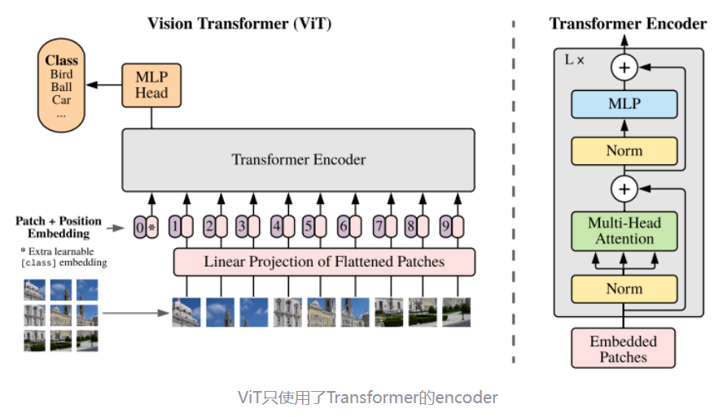
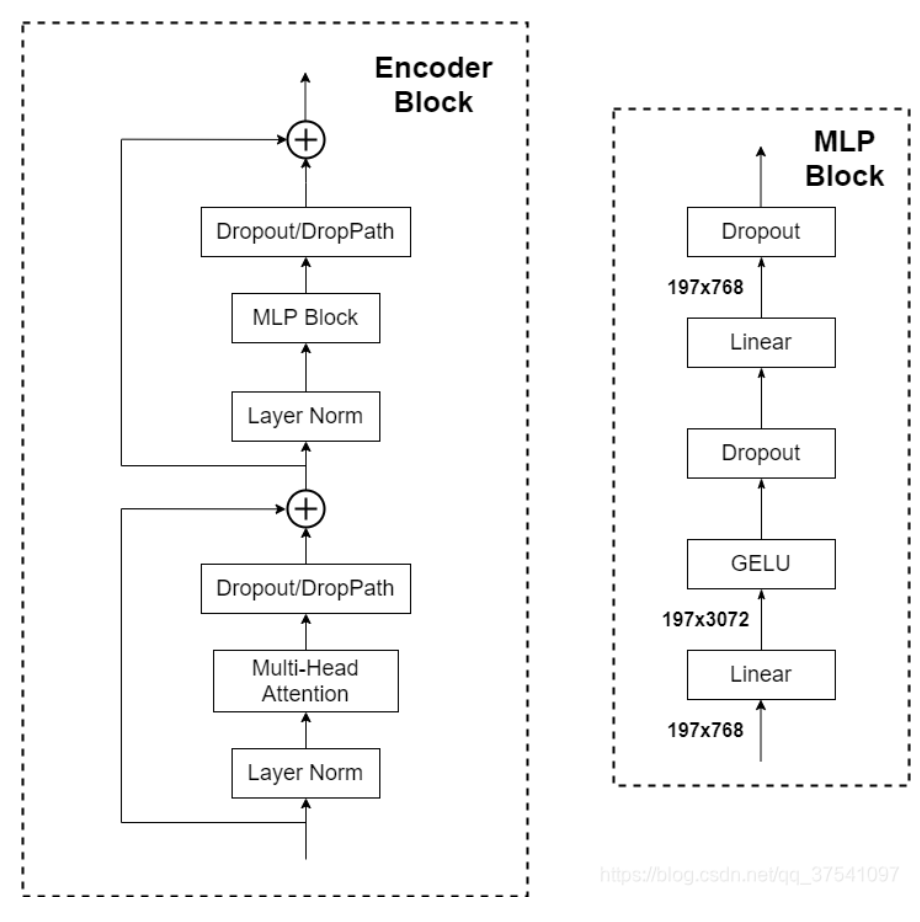
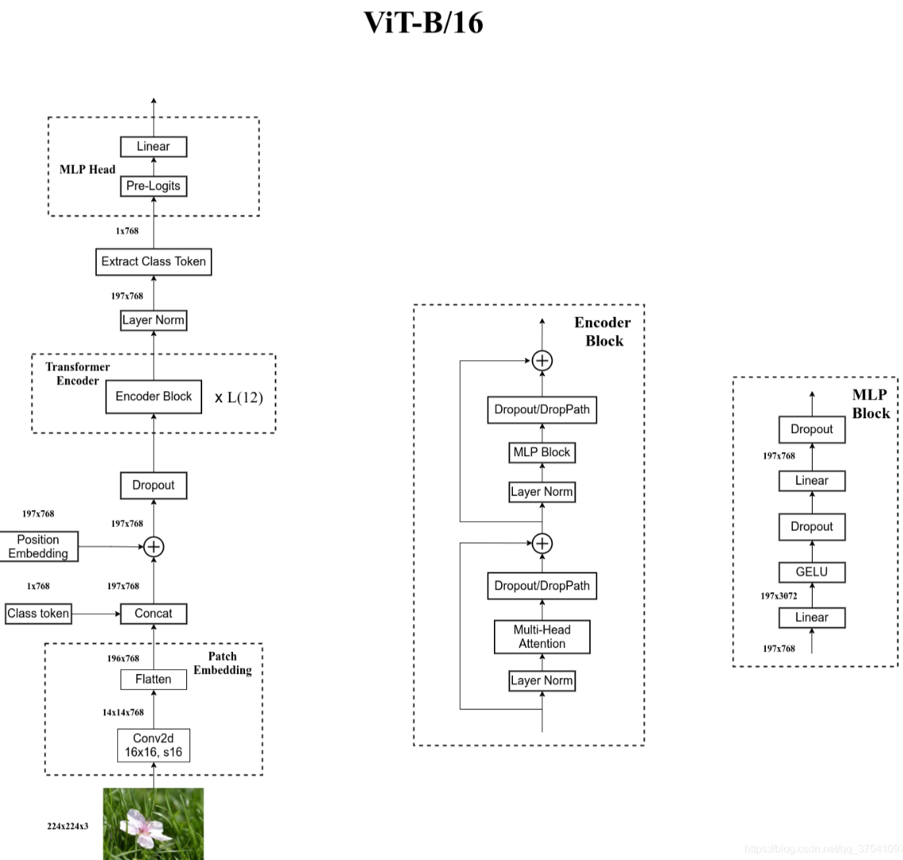

# ViT

本论文用来证明Transformer在CV领域确实是有效的，而且效果惊人。

本篇论文为了展示计算机视觉与自然语言处理大一统，因此没有采用更多的针对计算机视觉任务的特殊改进，全部仍采用Transformer的一套结构，只有在输入的时候进行处理，使其符合Transformer模型的输入，如果有Transformer基础，那么模型不难理解。

# ViT结构

ViT将输入图片分为多个patch（16x16），再将每个patch投影为固定长度的向量送入Transformer，后续encoder的操作和原始Transformer中完全相同。但是因为对图片分类，因此在输入序列中加入一个特殊的token，该token对应的输出即为最后的类别预测

# 1. patch embedding

例如输入图片大小为224x224，将图片分为固定大小的patch，patch大小为16x16，则每张图像会生成224x224/16x16=196个patch，即输入序列长度为**196**，每个patch维度16x16x3=**768**，线性投射层的维度为768xN (N=768)，因此输入通过线性投射层之后的维度依然为196x768，即一共有196个token，每个token的维度是768。这里还需要加上一个特殊字符[cls]，这个[cls]也是一个可训练的参数，因此最终的维度是**197x768**。到目前为止，已经通过patch embedding将一个视觉问题转化为了一个seq2seq问题

# 2. positional encoding

ViT同样需要加入位置编码，位置编码可以理解为一张表，表一共有N行，N的大小和输入序列长度相同，每一行代表一个向量，向量的维度和输入序列embedding的维度相同（768）。注意位置编码的操作是sum，而不是concat。加入位置编码信息之后，维度依然是**197x768**

# 3. LN/multi-head attention/LN

LN输出维度依然是197x768。多头自注意力时，先将输入映射到q，k，v，如果只有一个头，qkv的维度都是197x768，如果有12个头（768/12=64），则qkv的维度是197x64，一共有12组qkv，最后再将12组qkv的输出拼接起来，输出维度是197x768，然后在过一层LN，维度依然是**197x768**

# 4. MLP

将维度放大再缩小回去，197x768放大为197x3072，再缩小变为**197x768**

一个block之后维度依然和输入相同，都是197x768，因此可以堆叠多个block。最后会将特殊字符cls对应的输出 $Z_L^{0}$ 作为encoder的最终输出 ，代表最终的image presentation（另一种做法是不加cls字符，对所有的tokens的输出做一个平均）

