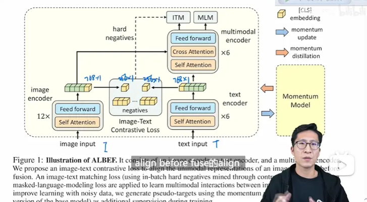

# 多模态论文串讲_上

多模态5类任务

1. 图文检索：提供文本，搜寻图片；提供图片，搜索文本。召回率
2. 视觉蕴含VE：给定假设，推断前提，判断假设和前提是否关联，三分类问题，准确度
3. 视觉问答：给定文本问题和一张图片，推理问题的答案；这里分为闭集VQA，意味着会给出预定的答案，作多分类；开集VQA，就是生成式文本推理（Bert），难；
4. 视觉推理VR：预测一个文本，能否描述一对图片，二分类，准确度
5. visual grounding：视觉定位，给定文本描述，在图像中定位特定匹配的区域。

朱老师的建议：多阅读相关文献，得到一些insight，什么是可以发扬光大的，什么是 可以移除的

# ALBEF

**Align before Fuse:Vision and Language Representation Learning with Momentum Distillation**

ALBEF两个贡献:

1. align before fuse
2. 克服noisy data，提出了一个用momentum model去生成pseudo target，从而做这种自训练的方式

提出一个用momentum model去生成pseudo target，去做一些理论分析

结论就是说文章里的这些训练的目标函数，包括LIM、ITM，还有momentum distillation，其实它们的最终作用，都是为同一个这个图像文本对，去生成不同的这个视角，其实也就是变相的在做一种data augmentation。

21:58 没有多模态融合这个效果可能不那么好

23:56 Momentum Model

momentum model， 动量设定得非常大，使得产生的特征非常稳定！ 

通过ITC loss， 拉近 特征， MoCo的动量更新

后6层的训练：

ITM loss：Image Text Matching

hard negatives，最难的负样本

MLM loss：BERT用的完形填空

这篇文章的另一个贡献：momentum distillation

上来就说 为什么要做动量蒸馏，也就是研究动机

self-training 就是来解决这个问题

先构造一个动量模型，构造 pseudo targets

动量模型如何构造？ => MoCo

EMA

有时候，pseudo tartget 比 ground true 描述得更好

38:01 两个contribution

42:09 开始介绍 做的任务，5个

做的5个任务，还是比较全面得

视觉检索

视觉蕴含

VQA，视觉问答

视觉推理

Visual Grounding

45:25 看结果

首先做了一个消融实验，验证他们提出来的，哪些有用哪些没用

【消融实验也是 朱老师 最爱看的部分，因为可以得到很多有用的insight】

baseline

ITC，也就是Align Before Fuse里的Align

发现这个提升是非常巨大的，2-3个点

这个ITC loss 真的是YYDS

在不同任务上都有提升

也就是说CLIP、MoCo这种对比学习的方式还是很厉害的，即使是mask modeling 当前非常火爆的情况下，朱老师仍觉得对比学习还是有值得挖掘的点，或者值得继续做下去的潜力

小贡献：Hard Negative，0.5左右的提升

相当不错的技巧

47:05 Momentum Disti

Momentum Distillation 带来的提升不是那么大，但这个研究方向还是很好的，怎么从Noise Data里去学习有效的表征，是一个非常有趣的研究方向

# VLMo

**VLMO:Unified Vision-Language Pre-Training with Mixture-of-Modality-Experts**

51:17 VLMo

论文的一个结构上的改进，也就是所说的Mixture-of-Modality-Experts

另一个就是训练方式上的改进

他们做的这种分阶段的模型预训练，其实都是师出有名，有非常强的研究动机

研究动机1：

CLIP采用双塔结构与一些单塔结构模型的优缺点比较，如何将他们进行一个结合，也就所说的Mixture-of-Modality-Experts

研究动机2：

数据集不够，但是分开来看，视觉和NLP各自都有大的数据集

58:11 模型结构

唯一的区别：

不同的模态有各自的FFN

【多模态 + transformer 真是绝配】

三个loss：ITC, ITM,MLM 

自注意力层 都是 共享参数的

好处：就是灵活

缺点：训练超慢，64张卡训练2天

01:04:07 第二个contributio

分阶段的训练策略

到底哪些需要冻住？

在视觉训练 的 自注意力，就能直接拿来 做文本【惊！】【已经在很多工作里 被 证明是有效的】

01:06:57 VLMo的实验结果

科研启发：根据你contribution，也不是所有Setting都要比。你要选择那些对你有利，或许说能更好的把你的故事讲出来的setting去做

比ALBEF 又高2-3个点

01:09:22 作者团队持续改进

01:11:10 科研感悟

来自：https://www.bilibili.com/opus/738797635662512162?spm_id_from=333.1387.0.0

