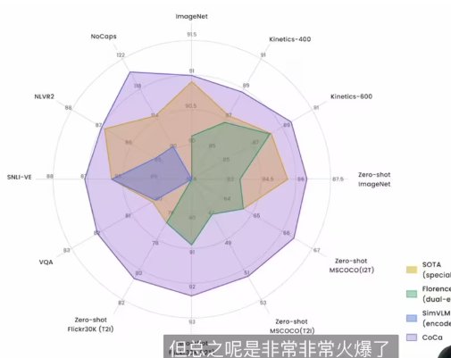

# 多模态论文串讲_下

# BLIP

BLIP: Bootstrapping Language-Image Pre-training for Unified Vision-Language Understanding and Generation

代码: https://github.com/salesforce/BLIP

本文是 ALBEF 原班人马做的，基本可以看做吸收了 VLMo 思想的 ALBEF。训练的 loss 和技巧都与 ALBEF 一致，属于 ALBEF 的后续工作

关键的改进：

1. 模型结构上整合了 ALBEF 和和 VLMo。VLMo 参数共享，但是不存在单独编码器；ALBEF 存在单独编码器但是部分参数不共享。这篇论文存在单独的 vision encoder 和 text encoder。多模态的参数是以 cross-attention 模块插入到文本编码器实现的，cross-attention 模块享受文本编码器的参数（可以看 col 2 和 col3）
2. 增加了解码器（参考 col 4），为了做生成任务。解码器拿到视觉特征和未掩码的语言特征，过一个 casual self-attention 层，做 GPT 用的那种 lm 任务。这里区别于 MLM 的那种 mask 机制，是通过 causal self-attention 来实现因果推理的

3. 除了上面的主要部分，还有一个重要的部分是利用训练好的模型生成伪标签。将训练好的模型里的不同的部分拿出来在 COCO 上稍微微调一下，decoder 部分可以生成文本，算 ITM loss 的那个模块可以做 image-text pair 的过滤，通过输出打分、置信度的方式。在实验中，BLIP 的解码能力似乎很强，用这种范式生成的文本不仅人看着觉得不错，用于自训练后也可以涨点 2-3，非常显著。

 一个例子是 stable diffusion 的官方博文里提到了，他们在做微调时，会遇到数据集只有图片没有 caption 的情况，比如 pokeman 数据。他们用 BLIP 来做caption生成，然后微调 stable diffusion 发现效果很好。

 另一个例子是知名的开源多模态数据集 LAION，他们也用了 BLIP 来辅助制作数据集。他们的过程在官网公布了，可以参考。

总结：

个人感觉模型部分的改进可能有用可能没有用，但是解码器输出的 caption 确实是不错。以至于很多下游任务都拿 BLIP 来生成 caption。

# CoCa

 CoCa: Contrastive Captioners are Image-Text Foundation Models

github: https://github.com/lucidrains/CoCa-pytorch

它也是 ALBEF 的后续工作，模型非常像。区别在于：

1. 图像用了 attentional pooling，这在本文的实验中有效
2. 去掉了 ITM loss，目的是加快训练，原本文本需要 forward 2-3 次，去掉 ITM loss 之后只需要 forward 一次就可以了。在 ALBEF 中，ITM 需要完整的 text，而 MLM 需要掩码，所以是两次输入。在 BLIP 中，ITC 一次，ITM 因为在文本模型中插入了新的模块，所以得单独做前向。而 LM 因为用了既多了新的模块又得用 causal self-attention 所以又得单独做一次。在 CoCa 中，为了完成 captioning loss 和 ITC loss，只需要做一次前向即可。GPT 中把 cls-token 放在最后面就可以得到全局表征来做 ITC loss 了。

​	简单快速的方法可以有效地 scale，而我们知道复杂的模型设计、loss 设计经常不如简单地放大模型、增加数据有效。参考凯明的 FLYP。

这种画图的方式很不错，很直观。可以参考，以后也画成这样。

总结：

简单有效的结构设计，我对 CoCa 的印象是简单有效。它的峰值性能我没有感觉很炸裂，可能是模型、数据 scale 之后自然的结果。但是它的 zero-shot 性能让我印象很深刻，在 imagenet 上微调不微调的差距很小，这一点非常非常关键。

读到 coca，我对多模态的疑问还有两点：

1. mixture of experts 的结构没有在本文中得到应用，但我感觉是个相当有前途的结构
2. 双向的生成 loss 还是没人做，谁说只能图像辅助文本?

# BEiTv3

Image as a Foreign Language:BEIT Pretraining for All Vision and Vision-Language Tasks

论文的卖点是大一统。在 introduction 章节详细介绍了大一统指的是统一模型、loss 和数据。我觉得可以简单地概括为：用统一的 multi-way transformer (mixture of experts ) 架构和单个 masked modeling loss，将任意模态看做是同一个模态来建模。

具体而言，它指的是在将任意模态输入网络后，都表现为 list of tokens，直接将它们看做是相同的模态来做 masked modeling 就好了。如果想要拿过去做下游任务的话，直接将需要的那部分模型拿出来即可。比如做视觉任务就拿视觉模型，做语言任务就拿语言模型。如果是做多模态任务，可以灵活地模拟不同的需求，比如：1. 做生成任务可以拿多模态部分的参数出来 2. 做图文检索可以单独取出视觉部分和语言部分来模拟 CLIP。不仅仅是能做任意任务，还继承了前作的优点，比如 CLIP 这种弱跨模态交互带来的计算效率的优势。

来自：https://www.bilibili.com/opus/752609374341431335?spm_id_from=333.1387.0.0

