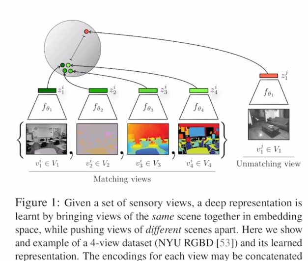
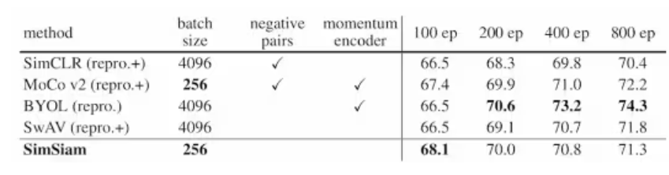
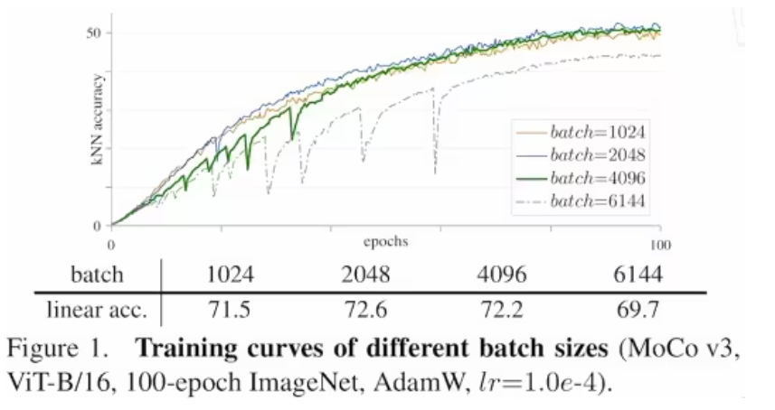

# 对比学习论文串讲

对比学习发展主要分为四个阶段：

| 百花齐放    |          | 模型、方法、目标函数、代理任务均未统一            |
| ----------- | -------- | ------------------------------------------------- |
| 2018        | InstDisc | 提出实例判别和memory bank做对比学习               |
| 2018        | CPC      | 对比预测编码，图像语音文本强化学习全部都能做      |
| 2019        | CMC      | 多视角下的对比学习                                |
| CV双雄      |          | 发展迅速，上述工作间隔时间很短                    |
| 2019        | MoCov1   | 无监督训练效果也很好                              |
| 2020        | SimCLRv1 | 简单的对比学习（数据增强+MLP head + 大batch训练久 |
| 2020        | MoCov2   | MoCov1 + improvements from SimCLRv1               |
| 2020        | SimCLRv2 | 大的字监督预训练模型很适合做半监督学习            |
| 2020        | SWaV     | 聚类对比学习                                      |
| 不用负样本  |          |                                                   |
| 2020        | BYOL     | 不需要负样本的对比学习                            |
| 2020        | SimSiam  | 化繁为简的孪生表征学习，将所有方法总结归纳        |
| Transformer |          | 对于自监督学习，无论对比学习还是掩码学习，都用ViT |
| 2021        | MoCov3   | 如何更稳定的自监督训练ViT                         |
| 2021        | DINO     | transformer加自监督在视觉也很香                   |

动量编码器，很好的提点的工具

# 第一阶段 百花齐放

## InstDisc

Unsupervised Feature Learning via Non-Parametric Instance Discrimination **提出了个体判别任务以及memory bank**：

作者根据观察提出了个体判别任务：无监督的学习方式就是把按照类别走的有监督信号推到了极致，现在**把每一个 instance都看成是一个类别，也就是每一张图片都看作是一个类别，其它照片则是另外的类别，目标是能学一种特征能把每一个图片都区分开来**

**文章的方法：**

- 通过一个卷积神经网络把所有的图片都编码成一个特征（这些特征在最后的特征空间里能够尽可能的分开，因为对于个体判别任务来说每个图片都是自己的类，所以说每个图片都应该和别的图片尽量的分开）
- 训练这个卷积神经网络使用的是对比学习，所以需要有正样本和负样本，根据个体判别这个任务，正样本就是这个图片本身（可能经过一些数据增强），负样本就是数据集里所有其它的图片
- 做对比学习，大量的负样本特征到底应该存在哪呢？本文用了 memory bank 的形式：就是说把所有图片的特征全都存到memory bank 里，也就是一个字典（ImageNet数据集有128万的图片，也就是说memory bank里要存128万行，也就意味着每个特征的维度不能太高，否则存储代价太大了，本文用的是128维）

**前向过程：**

- 假如batch size是256，也就是说有256个图片进入到编码器中，通过一个 Res 50，最后的特征维度是2048维，然后把它降维降到128维，这就是每个图片的特征大小
- batch size 是 256 的话也就意味着有256个正样本，那负样本从哪来呢？自然是从 memory bank 里随机地抽一些负样本出来。本文抽了4,096个负样本出来
- 有了正样本也有了负样本，就可以用NCE loss 计算对比学习的目标函数
- 一旦更新完这个网络，就可以把 mini batch里的数据样本所对应的那些特征，在 memory bank 里更换掉，这样 memory bank 就得到了更新
- 接下来就是反复这个过程，不停的去更新这个编码 t，不停的更新这个 memory bank，最后学到这个特征尽可能的有区分性

**本文的方法还有很多细节都设计的非常巧妙**

- 比如说 proximal regularization：它给模型的训练加了一个约束，从而能让 memory bank 里的那些特征进行动量式的更新，跟 MoCo 的想法是非常一致的
- 另外设置里面超参数的设定，比如说算 loss 的时候温度的设置是0.07，选了4,000个负样本，训练是200个epochs，batch size 是256，起始的 learning rate 是0.03，之后其它论文（尤其是 MoCo）所有的这些实验细节，MoCo 都是严格按照 Inst Disc 来的，这些超参数都没有进行更改。
- 所以说 Inst Disc 这篇论文也是一个里程碑式的工作：它不仅提出了个体判别这个代理任务，而且用这个代理任务和 **NCE loss**做对比学习，从而取得了不错的无监督表征学习的结果，同时它还提出了用别的数据结构存储这种大量的负样本，以及如何对特征进行动量的更新，所以真的是对后来对比学习的工作起到了至关重要的推进作用

## Inva Spread  

**Unsupervised Embedding Learning via Invariant and Spreading Instance Feature** 这是一篇 CVPR 19的论文，**是 SimCLR 的一个前身**，它没有使用额外的数据结构去存储大量的负样本，它的正负样本就是来自于同一个 minibach，而且它只用一个编码器进行端到端的学习

- 如图1所示，同样的图片通过编码器以后，它的特征应该很类似，不同的图片，它的特征出来就应该不类似，这就是题目中说的invariant和 spreading，就是说对于相似的图片、相似的物体，特征应该保持不变性，但是对于不相似的物体或者完全不沾边的物体，特征应该尽可能的分散开
- 代理任务也是选取了个体判别这个任务

**前向过程：**

- 如果 batch size 是256，也就是说一共有256个图片，经过数据增强，又得到了256张图片
- 对于 x1 这张图片来说， x1' 就是它的正样本，它的负样本是所有剩下的这些图片（包括原始的图片以及经过数据增强后的图片），也就是说正样本是256，负样本是256减1*2，就是除去样本本身之外 mini-batch 剩下的所有样本以及它经过数据增强后的样本，也就是这里为什么要*2，这些都是负样本
- 它和 Inst Disc d的区别：Inst Disc中，正样本虽然是256，它的负样本是从一个 memory bank 里抽出来的，它用的负样本是4096甚至还可以更大
- 本文为什么要从同一个 mini-batch 里去选正负样本？因为这样就可以用一个编码器做端到端的训练了，这也就是MoCo里讲过的端到端的学习方式
- 剩下的前向过程都是差不多的，就是过完编码器以后，再过一层全连接层就把这个特征的维度降的很低，就变成128了，正样本比如说上图中绿色的球在最后的特征空间上应该尽可能的接近，但是这个绿色的球跟别的颜色的特征应该尽可能的拉远
- 本文所用的目标函数也是 NCE loss 的一个变体
- 所以说之所以讲这篇论文，是因为它刚好属于另一个流派，也就是端到端的学习，而且只用一个编码器，不需要借助外部的数据结构去存储大量的负样本，它的正负样本都来自于同一个 minibach
- 既然它跟 SimCLR 这么像，为什么它没有取得那么好的结果呢？就是之前在MoCo那篇论文里反复强调过的，就是这个字典必须足够大，也就是说在做对比学习的时候，负样本最好是足够多，而本文的作者是没有 TPU 的，所以说它的 batch size 就是256，也就意味着它的负样本只有500多个，再加上它还缺少像 SimCLR 那样那么强大的数据增广以及最后提出的那个 mlp projector，所以说呢这篇论文的结果没有那么炸裂，自然也就没有吸引大量的关注，但事实上它是可以理解成 SimCLR 的前身

## CPC

**Representation Learning with Contrastive Predictive Coding**

一般机器学习分为判别式模型和生成式模型，个体判别显然是属于判别式范畴的，那肯定就会有一些生成式的代理任务，比如最常见的预测型的任务

cpc 这篇论文其实非常厉害，因为它是一个很通用的结构

- 图1中描述的是CPC不仅可以处理音频，还可以处理图片、文字以及在强化学习里使用
- 这里为了简单，它用的是一个音频的信号作为输入
- 本文的想法：假如说有一个输入 x（一个持续的序列），t表示当前时刻，t-i表示过去的时刻，t+i表示未来的时刻。把之前时刻的输入全都扔给一个编码器，这个编码器就会返回一些特征，然后把这些特征喂给一个自回归的模型（gar，auto regressive），一般常见的自回归模型，就是 RNN 或者 LSTM的模型，所以每一步最后的输出，就会得到图中红色的方块（ct，context representation，代表上下文的一个特征表示），如果这个上下文的特征表示足够好（它真的包含了当前和之前所有的这些信息），那它应该可以做出一些合理的预测，所以就可以用ct预测未来时刻的这个zt +1、zt + 2（未来时刻的特征输出）
- 对比学习在哪里体现的呢？正样本其实就是未来的输入通过编码器以后得到的未来时刻的特征输出，这相当于做的预测是 query，而真正未来时刻的输出是由输入决定的，也就是说它们相对于预测来说是正样本；负样本的定义其实很广泛，比如可以任意选取输入通过这个编码器得到输出，它都应该跟预测是不相似的，这就是cpc定义正负样本的方式
- 这套思想是很朴实的，把输入序列换成一个句子，也可以说用前面的单词来预测后面的单词的特征输出；如果把这个序列想象成一个图片的patch块从左上到右下形成一个序列，就可以用上半部分的图片特征去预测后半部分的图片特征，总之是非常灵活

## CMC

**Contrastive Multiview Coding**

 cpc是用预测的代理任务做对比学习

cmc这篇论文定义正样本的方式就更为广泛了：一个物体的很多个视角都可以被当做正样本

- cmc到底是怎么样去形成正样本和负样本从而去做对比学习的呢？如图一所示，它选取的是 NYU RGBD 这个数据集（这个数据集有同时4个view，也就是有四个视角：原始的图像、这个图像对应的深度信息（每个物体离观察者到底有多远）、SwAV ace normal、这个物体的分割图像）
- cmc 的意思是说，虽然这些不同的输入来自于不同的传感器或者说不同的模态，但是所有的这些输入其实对应的都是一整图片，都是一个东西，那它们就应该互为正样本，也就是说，当有一个特征空间的时候，比如图中圆圈所示的特征空间，这四个绿色的点在这个特征空间里就应该非常的接近。这时候如果随机再去挑一张图片，不论是用图片还是用风格的图像（总之属于一个不配对的视角）的话，这个特征就应该跟这些绿色的特征远离
- 这就是 cmc 定义正负样本的方式，它的正样本来自于多个视角，一旦定义好了正负样本，剩下的工作就大差不差了
-  cmc是第一个或者说比较早的工作去做这种多视角的对比学习，它不仅证明了对比学习的灵活性，而且证明了这种多视角、多模态的这种可行性。所以说接下来open AI，很快就出了clip模型：也就是说如果有一个图片，还有一个描述这个图片的文本，那这个图像和文本就可以当成是一个正样本对，就可以拿来做多模态的对比学习
- cmc原班作者人马用对比学习的思想做了一篇蒸馏的工作：不论用什么网络，不论这个网络是好是坏是大是小，只要你的输入是同一张图片，那得到的这个特征就应该尽可能的类似，也就意味着想让 teacher 模型的输出跟 student 模型的输出尽可能的相似，它就通过这种方式把 teacher和student做成了一个正样本对，从而可以做对比学习
- 所以说让大家意识到对比学习如此灵活，可以应用到不同的领域，cmc功不可没
- 一个小小的局限性：当处理不同的视角或者说不同的模态时候，可能需要不同的编码器，因为不同的输入可能长得很不一样，这就有可能会导致使用几个视角，有可能就得配几个编码器，在训练的时候这个计算代价就有点高（比如说在 clip 这篇论文里，它的文本端就是用一个大型的语言模型，比如说 bert，它的图像端就是用一个 vit，就需要有两个编码器），这样其实又回到了刚开始讲ViT时候所说的说这个Transformer的好处--Transformer有可能能同时处理不同模态的数据
- 事实上现在已经有人这么做了，今年的ICLR就有一篇ma clip，它就用一个Transformer去同时处理两个输入模态，效果反而更好，所以说这可能才是 Transformer 真正吸引人的地方：一个网络能处理很多类型的数据，而不用做针对每个数据特有的改进

## 总结

- 它们使用的代理任务是不一样的，有个体判别，有预测未来，还有多视角多模态
- 它们使用的目标函数也不尽相同，有 NCE，有infoNCE，还有NCE的其它变体
- 它们使用的模型也都不一样，比如说invariant spread用了一个编码器；Inst Disc用一个编码器和memory bank；cpc有一个编码器，还有一个自回归模型；cmc可能有两个甚至多个编码器
- 它们做的任务从图像到视频到音频到文字到强化学习，非常的丰富多彩

# 第二阶段 CV双雄

这里主要想讲的是MoCo和SimCLR 

## **MoCo**

**Momentum Contrast for Unsupervised Visual Representation Learning**

这次主要就讲和其它工作的区别和联系

MoCo 的主要贡献就是把之前对比学习的一些方法都归纳总结成了一个字典查询的问题，它提出了两个东西

- 队列
- 动量编码器

从而去形成一个又大又一致的字典，能帮助更好的对比学习

MoCo跟Inst Disc是非常相似的

- 它用队列取代了原来的memory bank作为一个额外的数据结构去存储负样本
- 它用动量编码器去取代了原来loss里的约束项，从而能达到动量的更新编码器的目的，而不是动量的去更新特征，从而能得到更好的结果

但是整体的出发点以及一些实现的细节都是非常类似的

 MoCo 的这个实现细节：

- 首先从模型的角度上来说，它用的是残差网络，它的基线模型都用的是Res 50，其实Inst Disc也用的是Res 50，模型上是一样的
- 最后每个图片的特征维度也沿用了128维
- 它也对所有的特征做了L2 归一化
- 至于目标函数，MoCo 采用的是info NCE，而不是像Inst Disc是NCE但是算loss用的温度也是0.07
- 数据增强的方式也是直接借鉴过来的
- 包括后面训练的学习率0.03，训练200个epochs这些也都是跟Inst Disc保持一致的

所以，说MoCo是Inst Disc一个改进型工作也不为过，但是MoCo真正出色的地方其实有两点

- 一个是它的改进真的是简单有效，而且有很大的影响力的，比如说它的动量编码器，在后面的SimCLR、BYOL，一直到最新的对比学习的工作都还在使用。它提出的这个技术不仅在当时帮助 MoCo第一次证明了无监督学习也能比有监督特征学习的预训练模型好，而且还能产生持续的影响力，帮助之后的工作取得更好的结果，所以它的改进很深刻而且很有效
- 另外一个可圈可点的地方就是MoCo的写作真的是高人一等非常不一样，其实如果是一个简单直白的写作方式，在语言里先介绍对比学习是什么，然后再介绍之前的工作有哪些，比如说有端到端的工作，然后有看Inst Disc，这个 memory bank 的这个工作，然后它们各自都有各自的缺点和局限性，所以说提出MoCo ，用队列去解决大字典的问题，用动量编码器去解决字典特征不一致的问题，最后结果很好，第一次证明了在下游任务中用一个无监督训预训练的模型也会比有监督预训练的模型好，那这种写法也是一种很简洁直白明了的写作方式，大部分论文的写作都是按照这个套路来的。但是MoCo的作者明显就高了一个层次：引言上来先说这个cv和nlp之间的区别，以及到底为什么无监督学习在 cv 这边做的不好，然后第二段它才开始讲对比学习，但是它也不是细细地去讲对比学习，或者细细的去讲那些方法，而是直接把之前所有的方法都总结成了一个字典查找的问题，所以直接把问题给归纳升华了，然后在这个框架下，就是 cv 和 nlp 大一统的框架以及所有的对比学习也都大一统的框架之下，然后作者提出了 MoCo 这个框架，希望能用一个又大又一致的字典去整体地提高对比学习的性能，那论文的scope整体就扩大了，远不是之前的那种简单的写作方式可以比的，而且这样的写作风格呢还延续到了方法部分，在3.1里，作者没有先写一个模型总览图，也没有具体说是什么模型、什么任务，而是先从最后的目标函数入手，说是用info NCE来做的，先把正负样本定义了一下，然后再去讲网络结构然后再去讲实现细节和伪代码，而且在3.1里，为了让MoCo看起来更朴实，在这里没有直接定义输入是什么，也没有定义这个网络结构到底是什么样的，它是说什么样的输入都可以，比如说它可以是图片，也可以是图片块，或者是上下文的图片块（文献46其实就是cpc），至于网络，它说query 的编码器和key的编码器既可以是相同的（invariant spread），也可以是部分共享的，还可以是完全不同的（文献56就是cmc，因为是多个视角嘛所以是多个编码器）

所以说MoCo这种自顶向下的写作方式也是非常值得借鉴的，但这个真的是需要功力，稍有把握不慎别人可能就看不懂了

## SimCLR

**A Simple Framework for Contrastive Learning of Visual Representations** 

这个方法真的是够简单，这就是为什么很多博客在介绍对比学习的时候都用SimCLR当例子，因为它概念上更容易理解，方法上也很容易解释，只不过batch size太大，一般人不好上手

- 图二里说，如果有一个mini-batch的图片，假如说是x，对这个mini-batch里的所有图片做不同的数据增强就会得到x i和xj，同一个图片延伸得到的两个图片就是正样本，也就是说如果batch size是n的话，正样本个数就是n，负样本的个数就是这个 batch size 剩下所有的样本以及它们数据增强过后的样本，也就和invariant spread里讲的一样，是两倍的 n 减1
- 然后当有了正负样本之后通过编码器f对它进行编码，这两f是共享权重，也就说其实只有一个编码器，如果把它想象成一个 res 50的话，得到的h（特征表示）是2048维了
-  SimCLR的重大创新点其实是在特征之后又加了一个projector，也就是上图中的g函数，它就是一个mlp层（只有一个全连接层，后面跟一个 relu 的激活函数），但是就这么简简单单的一层mlp能让最后学到的特征在ImageNet 这个分类任务上直接提点将近10个点，这个效果在别的任何的任务里或者说在有监督学习里是很难观测到的，很少有说加一个全连接层就能直接提点10个点，所以说是一个非常有趣而且非常惊讶的结果
- 但是在这个框架里，可以想象出有一个特征之后再做一个非线性变化，就得到了另外一个特征，也就是最后去做对比学习的那个特征，一般这个特征z，它的维度会小一点，为了跟之前的工作保持一致性，它也用了128维
- 最后要衡量一下正样本之间是不是能达到最大的一致性，它采用的是normalized temperature-scaled的交叉熵函数。normalized就是说在这个特征后面进行了 L2 归一化，temperature-scaled 就是说在这个 loss 成了个tao，所以说其实这个loss跟之前说的infoNCE loss也是非常接近的
- g函数只有在训练的时候才用，而在做下游任务的时候，是把g函数扔掉了，还是只用h这个特征去做下游任务，这样的话跟之前的工作也还是公平对比，因为之前它们如果用 res 50，还是用 res 50并没有多加一层，加上这个g函数只是为了能让模型训练的更好

和MoCo比起来确实很简单，这里只有一个编码器，既不需要memory bank，也不需要队列和动量编码器；正负样本全都是从同一个mini-batch里来的；整个前向过程非常的直接，就是图片进入编码器编码然后projector降维，最后算个对比学习的loss，非常符合大家对深度学习工作的期待

前面说invariant spread可以看作是SimCLR的前身，为什么这么说呢？本文其实整体的这个思路和结构跟SimCLR是基本一致的，SimCLR跟Inva Spread的区别其实都写在SimCLR的贡献列表里了

- 首先第一个就是它用了更多的数据增强，它发现对比学习真的是需要很强的数据增强的技术
- 第二就是它加了一个g函数（一个可以学习的分线性的变换，就是一个 mlp层）
- 第三就是它们用了更大的batch size ，而且训练的时间更久，它发现这两个策略都能让网络学到的特征变得更好

而事实上呢，SimCLR这篇文章中提出来的很多技术都对后续的工作产生了长远的影响力，比如说在编码器之后加这么一个mlp层，在之后的MoCo v2、BYOL这些工作里全都有使用；它使用的数据增强的策略在之后的工作里也是被广泛的使用；它使用lars这个优化器去做大batch size的这个模型训练，之后BYOL 也采用了同样的策略。总之SimCLR真的是够简单，而且为后续的很多研究铺平了道路

最后稍微讲一下SimCLR这篇论文里的贡献

第一个就是数据增强

- 如下图图4所示，SimCLR这篇论文使用了这么多的数据增强的方法，从最开始的原始图片，到裁剪，到改变色彩，到旋转，使用 cut out，还有使用高斯的噪声和高斯 blur，以及最后使用sobel的这种滤波器。真的是把前人想到的这些数据增强的方式全都用了个遍，然后为了让读者知道，到底哪些数据增强有用，哪些数据增强没用，作者还做了详细的这个消融实验

- 下图中除了最后一列是 average，剩下的数字就是这七种数据增强两两互相合并之后的这个效果如何，比如说中间的对角线其实就是使用一个数据增强，发现其实最有效的两个数据增强就是这个crop和这个color，也就是随机的裁剪和随机的这种色彩变换，其它的数据增强其实最后都是锦上添花、可有可无的，但这两个是必须得有的

另外一个就是说SimCLR这篇文章提出的非线性变换，也就是说在编码器后面加一层mlp

如图8所示，如果h是一个res 50出来的特征，也就是2048维的话，那z就是经过了projector之后的维度，一般是128

- g函数其实里面就包含了一个全连接层和一个 relu 激活函数
- projection head指的是non-linear，之所以是 non-linear是因为有relu的激活层（relu就会把一个线性函数变成非线性）
- linear线性指的是不要relu，只加一层全连接层就可以了
- None其实就是说像Inva Spread或者像MoCo一样，直接编码器出来的特征拿去做对比学习，不要projection head

然后会发现两个很有意思的现象

- 第一个就是如果用non-linear的层，相比原来什么都不用，结果提了十几个点，所以是非常显著的
- 第二个就是说z最后的维度不论是32、64还是2048其实都没太大区别，这就是为什么对比学习现在一般都选一个比较低的特征维度，因为128就够了，再高再低其实最后的结果也没有太大的变化

因为这里提升10个点实在是太过诡异，所以作者还做了很多实验

去验证这个想法，比如说在表3里就做了一些实验，但是也仅仅是一些实验，并不一定能真的证明这个事，至今好像也没有一个理论上的解释

## MoCo v2

**Improved Baselines With Momentum Contrastive Learning**

MoCo v2其实是一个只有两页的技术报告，严格意义上不算是一篇论文了，但即使只有两页，信息量也是相当大

MoCo v2主要就是说，在看到SimCLR这个比较好的结果以后，它们发现SimCLR里的那些技术都是即插即用型的，所以说它们就把那些就拿过来了，它直接说，就在MoCo上面做很简单的改动，引入了mlp projection head以及使用更多的数据增强，就又刷新ImageNet 上的最好成绩，不仅比之前的MoCo高很多，而且比最新的SimCLR也要高很多

MoCo v2 具体进行了哪些改进？

准确的说就四个方面

- 加了一个 mlp 层
- 加了更多的数据增强
- 训练的时候用了cosine的learning rate schedule
- 训练更长的 epoch，从200变到了800

ImageNet 上结果

- 灰色的结果76.5属于是有监督的这个基线模型
- MoCo v 1只能达到60.6，差的还是比较远的
- 就在上面加上这个projection head mlp层，一下准确率就提高到66.2，就长了6个点，所以说加projection head 不光是对 SimCLR 有用，对MoCo也有用，其实对其之后的很多方法都有用，像SwAV呢也用了，BYOL也用了
- 如果使用更强的数据增强，就是也能提三个点，从60到63，但是不如mlp提升的多
- 如果把这个mlp 和augmentation一起用就已经到67.3了，就非常高了
- 再加上这个cos的这个学习率，就到67.5还能再提0.2个点，那这个提升就很小了可以忽略不计
- 最后如果训练更长的时间，训练800 epochs，就能再提高到71.1，SimCLR结果也是这样，如果它训练更久的话，它的结果也会提升很多，一直到现在为止，就连凯明最新的MAE这个工作，也是训练了1,600个epochs，而且的这个效果还在继续往上涨

无监督学习真的是训练的越久或者模型越大，它的结果就会越好

接下来作者主要跟SOTA进行了比较，其实也就是MoCov1和 SimCLR这些工作，如下表表2所示

- 在只训练200epochs的情况下，MoCo v2比SimCLR高了大概一个点
- 如果训练更长的时间，在训练800个epochs的时候MoCo v2能到71.1，比SimCLR训练了1,000个epochs还要好将近2个点，所以就意味着MoCo v2能更好的利用数据，能在更短的时间内取得更好的结果

接下来作者又再次强调了一下为什么要用MoCo以及MoCo相比于SimCLR的优越性如上图中表3所示：

- 其实这个优越性就在于硬件：机器的内存以及训练的时长
- MoCo v2的作者使用的机器配置是8张v 100的显卡，MoCo在普通这个batch size 256的情况下就能训练，内存只消耗5个G，其实还有很多的剩余空间，还可以再加大batch size或者再增大模型都可以，它非常省内存，而且训练一个模型也只需要53个小时，在ImageNet这种规模的数据集上来说，两天多的时间已经算是很快了
- 如果这个时候换成end-to-end这种端到端的学习，也就之前说的invariant spread或者SimCLR，这里主要指的就是SimCLR 我们如果只用小batch size是256的时候，SimCLR在小 batch size的情况下只有61.9的结果
- 相对MoCo v2来说就差很多了，为什么呢？因为字典不够大、提供的负样本不够多，所以导致对比学习对比不是很有效，而且不光是效果低，它的内存占用7.4 G也明显高，训练的时长也多了十几个小时，就是全方位呢都不划算

如果想要端到端的这个学习走4096的这个batch size就是说让它的performance变好，变成66.6，虽然说还没有MoCo v2好，但也差不多，性能上比较相近，那它对硬件的要求就太高了

- 比如说对 gpu 的这个内存要求，它需要93个g的内存，这里画了个脚注，意思就是说这只是估计，因为现在也没有这么大内存的gpu，所以说它只能估计一下，训练时长当然也就不得而知了

因为这种端到端的学习方式，包括SimCLR、BYOL、SwAV默认都是用8台8卡机去做训练的,也就是有64张gpu,才能在一两天这个合理的时间内把训练完成，而MoCo只需要一台8卡机就可以在两天的时间内完成

## SimCLR v2

**Big Self-Supervised Models are Strong Semi-Supervised Learners**

其实SimCLR  v2，只是这篇论文一个很小的部分，它只是说怎么从v1变到v2，就是一个模型上的改进，而事实上都在讲如何去做半监督的学习

它主要想说的体现在它的这个标题里了：非常大的自监督训练出来的模型非常适合去做半监督学习

模型总览图如下图中图3所示

这篇文章分了三个部分

- 第一部分就是SimCLR，怎样自监督或者说自监督的对比学习去训练一个大的模型出来
- 第二部分就是说，一旦有了这么好的一个模型，只需要一小部分有标签的数据，然后去做一下有监督的微调，一旦微调结束了，就相当于有一个 teacher 模型，就可以用这个teacher模型去生成很多伪标签，这样就可以在更多的无标签的数据上去做自学习了

整个框架其实也是受启发于google的另外一篇工作（19年的一篇叫noisy student 的工作）

- 因为noisy student就是在ImageNet数据集上先训练了一个 teacher 模型，然后在JFT 300M那个数据集上生成了很多的伪标签，最后一起训练了一个student模型，而这个 student 的模型算是 ImageNet 上的SOTA，大概是88点多的准确率，霸占了ImageNet上这个sota很长时间，大概有一年的时间
-  Vision Transformer就跟这个 noisy student 比过，因为截止到那个时候，noisy student还是ImageNet上的 SOTA

作者其实就在第三页大概花了半页的篇幅来讲了一讲怎么把v1变成v2了，其实大概就是提高了这三个点：

- 第一个就是大家其实都公认的一个事实，就是用更大的模型，无监督训练就会训练的更好，在这里就换了一个更大的模型，换了一个152层的残差网络，同时用了这个selective kernels，也就是SK net，这个骨干网络变得非常的强
- 第二点改进就是，之前SimCLR说protection head的mlp层特别有用，而且MoCo v2也证明了特别特别的有用，所以SimCLR的作者就想那一层都这么有用了，把它再变深点会不会更有用，所以它就试了试变成两层变成三层这个性能会不会继续提升，最后发现其实就是两层就够了，原来是 fc + relu，现在是 fc + relu fc + relu，一层变成两层的 mlp，这个效果呢就最好了，就是加深了这个projection head
- 第三点改进就是它们也使用了动量编码器（这里说 motivated by 29，就是MoCo v2 ，20就是 MoCo），就是SimCLR的作者发现MoCo 的这个动量编码器真的很管用，所以也想试一试，事实上动量编码器真的管用，后面BYOL 都用了动量编码器，但在这里作者说动量编码器在SimCLR 里的提升并不是很大可能就提了一个点，具体原因它们解释说，因为它们已经有非常大的这个mini-batch，要么是4096，要么是8192，所以它们的负样本已经相当多了，所以不论是从字典的大小，还是从字典里特征一致性来说，SimCLR v2 都已经做的很好了，所以说再加这种队列或者加这种动量编码器其实都不会带来很大的提升

总的来说就是三点改进：

- 使用了更大的模型
- 加深了projection head
- 引入了动量编码器

如果不算半监督学习的内容的话，SimCLR v2也是一个2页的技术报告，而且不论是SimCLR v1还是v2，都只做了分类这个任务，但是MoCo就广泛的很多了，至少做了四五个下游的任务，而且刷了很多的数据集，所以MoCo系列工作就更cv friendly，所以它投的都是cv的会议，而SimCLR  v1就是 ICML，而SimCLR  v2就是 Neural IPS，所以说投对口的会议也很重要

## **SwAV**

**Unsupervised Learning of Visual Features by Contrasting Cluster Assignment**

给定同样一张图片，如果生成不同的视角，不同的 views 的话，希望可以用一个视角得到的特征去预测另外一个视角得到的特征，因为所有这些视角的特征按道理来说都应该是非常接近的

本文的具体的做法就是把对比学习和之前的聚类的方法合在了一起，当然这么想也不是偶然

- 首先，聚类方法也是一种无监督的特征表示学习方式，而且呢它也是希望相似的物体都聚集在某一个聚类中心附近，不相似的物体尽量推开推到别的聚类中心，所以跟对比学习的目标和做法都比较接近
- 另外，这篇文章的一作其实之前一直也是做聚类的，它之前就做过deep cluster这篇工作，也是一篇非常好的无监督学习的论文

具体 SwAV  是怎么和聚类的方法融合起来的呢？

- 上图图1把之前对比学习的方法总结了一下画到了左边，然后把SwAV的方法画到了右边，这样就比较好对比
- 左边当然很好理解了，就是同一个图片，做两次数据增强就得到了x1、x 2，然后所有的样本通过一个编码器，这个编码器有可能就是个 Res 50，也有可能是一个 Res 50加了一个 projection head，它这里没有明说，反正就是所有的这些都属于一个模型，最后这个模型输出一个特征，一旦有了这个特征，用它做一个对比学习的 loss 就可以了
- SwAV说，这么做虽然比较简单，但是直接拿所有图片的特征跟特征做对比有点原始而且有点费资源，因为所有的图片都是自己的类，所以其实像MoCo一样，取了6万个负样本，这还只是个近似，因为其实所有的数据集，所有的负样本理应是128万个图片
- SwAV的作者就想，能不能不去做近似，能不能借助一些先验信息不去跟大量的负样本比，而去跟一些更简洁的东西比，然后SwAV的作者就想出来了，可以去跟聚类的中心比（聚类中心就是右图里的c，也就是个prototype，它其实就是个矩阵，它的维度是d 乘以 k，d是特征的维度，这里的d和特征的d 是一样的，比如说就是之前说的128维，这个k就是有多少个聚类中心，在这篇文章中它们选的是3,000，也就是说你有3,000个 cluster center，3,000这个数字也是之前的一些聚类方法在ImageNet数据集上常用的一个参数）

SwAV的前向过程

- 前面还是都一样的：一个mini-batch的图片，做两次数据增强，得到x1、x2分别通过编码器得到最后的特征z1、z2
- 有了z1、z2之后并不是直接在这个特征上去做对比学习的loss，而是说先通过clustering让特征z和prototype c生成一个目标，也就是这里的q1、q 2
- q1、q2就相当于ground truth，那它真正要做的这个代理任务是什么呢？它的意思是说如果x1、x2是正样本的话，那z1 和 z 2的特征就应该很相似，也就跟之前对比学习一样，z1和z2要尽可能的相似
- 那如果两个特征非常相似，或者说含有等量的信息的时候，按道理来说应该是可以互相去做预测的，也就是说，如果拿z1这个特征去跟c去做点乘，按道理来说也是可以去预测q2；反之亦然，z2和这个c去做点乘也可以预测q1，所以说点乘之后的结果就是预测，而ground truth就是之前按照clustering分类而得到的q1和q2
- 所以通过这种Swapped prediction，也就是换位预测的方法，SwAV可以对模型进行训练

用聚类的好处到底有哪些？

- 首先，就像SwAV 这篇论文里讲过的一样，如果要跟很多的负样本去做类比，可能就需要成千上万的负样本，而且即使如此也只是一个近似，而如果只是跟聚类中心做对比，则可以用几百或者最多3,000个聚类中心，就足以表示了，因为其实也并没有那么多类，ImageNet也就1,000类，COCO才80类，所以说 3,000个聚类中心就足够用了，这相对于几万个负样本来说还是小了很多的
- 第二，这些聚类中心是有明确的语意含义的，如果之前只是随机抽样抽取负样本去做对比的话，那些负样本有的可能还是正样的，而且有的时候抽出来的负样本类别也不均衡，所以不如使用聚类中心有效。其实这就是SwAV的基本思想。（如果对聚类算法比较感兴趣，以先去看deep cluster deep cluster two，然后再来看这篇 SwAV 的论文）
- SwAV的结果非常好，它不仅比我们之前讲过的方法效果好，其实比之后要讲的BYOL、SimSiam这些都好，算是卷积神经网络里用Res 50分刷的最高的一篇工作，达到了75.3
- 上图表里的性能做的还是ImageNet的linear evaluation，也就之前说的提前预训练好一个模型以后，把这个模型的backbone冻住，只训练最后的那个全连接层
- 表中之前不是对比学习的方法都还比较低，可能都是在60以下，有了对比学习以后，从 MoCo 开始基本上就上60了，然后CPC v2刷到63.8，SimCLR刷到70，MoCo v2刷到71.1，之后要讲的BYOL其实74点几，SimSiam也是74点几
- 所以说75.3就算是最高的了，而且这个75.3是你把backbone冻住的情况下去做的，如果跟有监督的基线模型去比的话，这个有监督的基线模型是从头到尾都在ImageNet 上训练，最后的结果也就是76.5，所以说SwAV 已经是非常非常逼近这个结果
- 而且当使用更大的模型的时候，也就是像右图里说的一样，把一个Res 50变宽，而且就是这里的2倍、4倍、5倍这么宽的时候，SwAV的结果还能不停地涨
- 当用最大的模型（5倍的模型）的时候，SwAV已经跟有监督的模型，差距非常的小，而且SwAV也是要比SimCLR *2、SimCLR *4要高的，所以说从性能上来讲，SwAV 是真的不错*

但其实让SwAV有这么好的性能，不光是因为它和聚类的方法融合在了一起，它另外一个主要的性能提升点来自于一个叫multi crop的trick：

- 之前的那些对比的学习方法都是用的两个crop，也就是说一个正样本对x1、x2两个图片，如上图左下角所示，本来我们有一个图片，先把它resize 到256*256，然后随机crop两个224*224的图片当成 x1 x2，因为这两张图片都非常大，所以它们重叠的区域也非常多，于是它们就应该代表一个正样本
- 但总之就是两个 crop，SwAV的作者就想：用这么大的crop明显抓住的是整个场景的特征，如果更想学习这些局部物体的特征，最好能多个 crop，去图片里crop一些区域，这样就能关注到一些局部的物体了
- 但是增加crop，也就是说增加view，会增加模型的计算复杂度，因为相当于使用了更多的正样本
- 那如何能同时使用更多的正样本，而又不增加太多的这个计算成本呢？作者就想到了另外一个办法，就是说做点取舍，原来是取了两个224\*224的crop，现在把这个crop变得小一点，变成160 ，也就是说取2个160的crop去争取学全局的特征，然后为了增加正样本的数量，为了学一些局部的特征，再去随机选4个小一点crop，然而这4个crop的大小是96\*96，这样的话，就意味着现在有6个视角了，而不是像原来一样只有2个视角，所以正样本的数量增多了，但是通过这么一种取舍，整体的计算代价还是差不多的
- 别看这个想法很简单，这个multi crop的技术真的很有用而且它不光是对SwAV有用，对其它的对比学习的方法也有用

作者在下图图3中就做了一些实验

- 基线模型就是2\*224，它用了 multi crop 的这个技术，就是2\*160加上4\*96
- 如果现在把multi crop的技术用到SimCLR上会发现它涨了2.4个点，这个涨幅还是非常明显，所以说其实如果把 multi crop这个技术用到 BYOL 上有可能BYOL会比SwAV的效果高
- 接下来作者又对比了一些聚类的方法，对于聚类的这些方法用multi crop的方式提点就更多了，对于这几个方式来说都提了四个多点，更是非常显著
- 所以我们可以看到，如果没有这个multi crop的这个技术，把这四个点拿掉，其实SwAV的性能也就跟MoCo v2是差不多的，也就是说一个纯聚类的方法，或者说聚类和对比学习结合的方法其实也并没有什么优势，真正提点的是multi crop的技术
- multi crop这个技术其实非常朴实了，它其实就是一种思想，就是说全局的和这个局部的特征都要关注，所以说接下来的很多工作，也都借鉴是multi crop的这个技术，而不是 SwAV 这篇工作本身

这里简单提一下：

CPC v2其实也是融合了很多的技巧，它用了更大的模型、用了更大的图像块、做了更多方向上的预测任务，把batch norm 换成了 layer norm，而使用了更多的数据增强，所以这一系列操作下来，CPC v2直接就把CPC v1之前在 ImageNet 上40多的准确率一下就拔到70多

informing其实是 cmc 的作者做的一个分析型的延伸性工作，它论文本身的名字叫 What Makes for Good Views for Contrastive Learning（我们到底选什么样的视角才能对对比学习最好？）

- 它主要是提出了一个InfoMin的原则，就是最小化互信息minimi mutual information，那乍一听觉得可能有点奇怪，因为之前大家做的都是 maximize mutual information，都是想要两个视角之间的互信息达到最大，为什么作者这里就想让它达到最小呢？
- 其实这里也不是严格意义上的最小，作者其实想说的是，他想要不多不少的互信息，如果最大化互信息以后比所需要的互信息要多，也是一种浪费，而且有可能泛化做的不好，但如果互信息比所需求的这个互信息要少，有可能达不到最优的性能，所以这个才是作者的本意，就是不能一味的最大化这个互信息，而是要不多不少刚刚好
- 然后按照Info Min的原则选择合适的数据增强，然后拿到合适的对比学习的视角以后，作者发现对于很多的方法都有提升，它们最后在 ImageNet 上也有73，也是相当不错的

## 总结：

其实到了第二阶段很多细节都处于统一了，比如说

- 目标函数都是用infoNCE或者infoNCE类似的目标函数去算的
- 模型最后也都归一到用一个编码器后面加一个projection head
- 都采用了更强的数据增强
- 都想用这个动量编码器
- 都尝试着训练的更久
- 最后在ImageNet上的准确度也逐渐逼近于有监督的基线模型

# 第三阶段 不用负样本

其实第二阶段里讲的SwAV就已经有不用负样本的对比学习这个趋势了，它可以算是一个承上启下的工作,因为它也没有用负样本,它用的是聚类中心，但它毕竟还是有一个明确的对比的对象

接下来要讲的BYOL和SimSiam其实就是正样本自己在玩，已经没有负样本或者聚类中心这样明确的一个对比的东西去做对比了

## BYOL

Boostrap Your Own Latent：A New approach to Self-Supervised Learning

- Bootstrap就是说如果已经有什么东西了，然后在它之上进行改造
- latent就是特征的意思（latent、hidden、feature、embedding其实都是特征的意思，就是各种花里胡哨的用法而已）

为什么作者很有自信说是a new approach to self supervised learning，因为它完全没有用任何形式的负样本

为什么不用负样本就这么新奇、这么吸引人注意？

- 因为在对比学习中，负样本是一个约束，如果在算目标函数的时候只有正样本，其实目的就只有一个，那就是让所有相似的物体的特征也尽可能的相似，那这个时候就有一个很明显的捷径：如果一个模型不论给它什么输入，它都返回同样的输出，这样的话，它出来的所有的特征都是一模一样的，那拿这个去算对比学习的loss就都是零，意思就是模型直接就躺平了，它直接用这个捷径解就能完美解决问题loss永远是0模型根本都不用学
- 只有加上负样本这个约束，就是说不光相似的物体要有相似的特征，然后不相似的物体也要有不相似的特征。这样模型才有动力去继续学，因为如果输出的所有特征都一样，那负样本的loss就无穷大，所以它必须想办法让正样本和负样本的loss都往下降，达到一个最优解
- 所以说，负样本在对比学习里是个必须的东西，它能防止模型学到捷径，很多论文里也管这个叫model collapse或者learning collapse ，就是模型坍塌或者学习坍塌，说白了就是什么也没学到，负样本就是为了限制这种情况的发生
- 但BYOL之所以神奇就是它没有用负样本，正样本自己跟自己学最后在ImageNet上也达到了74.3的top-1准确率，也是相当高了

因为BYOL是20年6月份出来的，跟SwAV是同期的工作，所以它不用跟SwAV去比，那在这之前74.3就是最高的

BYOL为什么能够做到不需要负样本？

下图图 2是模型总览图

BYOL的前向过程：

- 一个mini-batch的输入x经过两次数据增强以后，就得到了v和v&#39;，然后图片通过编码器得到特征
- 上面这一支通过的编码器叫fθ，下面这个通过的编码器呢叫fε，两个编码器使用是同样的网络架构，但是它们的参数不同
- fθ是随着梯度更新而更新的，而这个fε跟MoCo一样是用moving average的形式去更新的，其实就是使用了动量编码器
- 这里得到的特征，如果是res 50的话就是2048维的一个特征
- 接下来跟SimCLR一样用了一个projection head，这里叫 projector，就是通过gθ这个函数得到zθ的特征，zθ在这里是256维，比之前的128大了一点，发现这个效果好一点
- 同样地，gε其实跟gθ是一样的网络结构，但是参数不一样，也是通过动量的方式去更新的
- 之前对比学习的方法，当得到这两个特征zθ和zε以后，就像SimCLR一样需要让它们尽可能接近，需要达到maximum agreement，但是BYOL没有这么做，它又加了新一层的一个叫predictor的东西qθ，qθ跟gθ的网络结构是完全一样的，也是一个mlp，然后就得到了一个新的特征q(zθ)，为了让这个预测跟下面的zε尽可能一致，就把原来的匹配问题换成了现在的预测问题
- 这个跟SwAV也有点像，因为SwAV也是把配对问题换成了预测问题，但是SwAV还是借助了一个聚类中心来帮助做这个预测任务的，但是BYOL真的是什么都没有，就是自己去预测自己，然后这个模型就学起来了
- sg就是stop gradient，这里是没有梯度的，跟MoCo就很像，上面一支相当于是个query编码器，下面一支相当于是key的编码器，key的编码器都是query编码器的动量更新，但不一样的是它的代理任务不一样，它相当于是用自己一个视角的特征去预测另外一个视角的特征，通过这种预测型的任务完成模型的训练

这就是 BYOL 的训练过程，看起来相当简单，而且作者说跟别的工作一样，当训练完成以后只有这个编码器留下了，剩下所有的东西都被拿掉了，最后yθ，也就是这个2048维的特征去做下游任务

它训练网络的时候用的目标函数直接用的是mean square erro（mse los）

- 因为现在是两个向量，一个是预测的qθ(zθ)，一个是target zε，现在是想让它们尽可能的接近，所以算一个mse loss就可以了
- 这个跟之前对比学习用的那些目标函数全都不一样，所以说BYOL虽然看起来有SimCLR的影子，也有MoCo的影子，比如说SimCLR的projection head、MoCo的动量编码器，但是它用的目标函数不一样，而且也没有用负样本，就用这种自己预测自己的方式学到了很好的特征表示
- 所以说在它放到arxiv之后，reddit、twitter、知乎全都引起了剧烈的讨论，因为大家都觉得很不可思议，不用负样本，模型的学习怎么能不坍塌，其实作者也觉得很神奇，所以它后面也提供了一些解释，但是它的解释比较中规中矩没有什么意思

“如何去理解 BYOL”

这篇博客的作者其实也是看到BYOL之后觉得非常有意思，所以就尝试复现了一下，结果在复现的时候遗漏了一个小细节，从而导致它的模型训练不动，出现了这个模型坍塌的现象，关于这个故事，可以去看[原视频](https://www.bilibili.com/video/BV19S4y1M7hm?spm_id_from=333.788.videopod.sections&vd_source=56e8908484ae6d7f0f89185181217d3e)

## SimSiam

**Exploring Simple Siamese Representation Learning**

就是simple Siamese network，其实在BYOL放到 arxiv 上之后，就已经有很多研究者在做对对比学习的分析性工作了，因为大家发现，对比学习的成功好像是被很多很小的点堆起来的性能，比如说我们一路走来可以看到用了新的projection head、训练的时间更长、用了更多的数据增强或者用动量编码器、用更大的 batch size，总之好像都缺一不可，对比学习的性能好像是一点一点被这么堆上去的

这样就不是很好，不方便分析，因为有太多点了，所以不知道从哪分析起，也不知道每个点到底带来了哪些贡献，所以凯明团队又再次出手，把整个过程化繁为简了一下，最后提出了SimSiam

这个结构有多简单，就是说不需要用负样本（因为它基本上是跟 BYOL是非常像的，所以说它不需要负样本）、不需要大的batch size，不需要动量编码器，然后即使在这种情况下，这个SimSiam不仅不模型坍塌，而且还能取得很好的结果

具体的模型总览图如下图所示

- 之所以叫siamese network（孪生网络）是因为一般会有两个编码器，这两个编码器一般网络结构是一样的，而且一般是要共享参数的，所以才叫孪生网络
- 整体架构是跟BYOL 非常一样的：一个图片变成 x1、x2，然后经过过两个编码器，有一个predictor，其实predictor出来的就是要去预测另外一个编码器出来的特征
- 这里跟BYOL唯一的不一样就是它没有用动量编码器

如果我们简单看一下伪代码，如下图所示，就会发现是真的简单，整个前向过程其实就这么几行

- D函数就是怎么去算loss，算的是一个 negative cosine similarities loss，说白了就是一个MSE losss
- 至于前向过程也跟上图中的一样，得到两个视角x1、x2以后，先过编码器去得到特征z1、z2，然后再通过predictor得到p1、p2的预测，因为有两个预测，所以这里也是一个对称性的loss，就是说，既可以做从p1预测z2，也可以做用p2预测z1的任务，但因为加了两次，所以说这里也要除以2
- l就是最后的loss
- 梯度回传更新网络

作者还做了很多实验，比如说batch size对模型训练的影响、还有  batch norm对模型训练的影响，而这些都跟BYOL非常像，这里就不一一展开了，最后作者得到一个结论：之所以SimSiam能够成功训练，不会有模型坍塌，主要是因为有stop gradient这个操作的存在

作者还提出了一个假设，而且在第五节里做了一个 hypothesis：因为有了stop gradient这个操作的存在，所以SimSiam这个结构是可以把它想象成一个EM的算法

- EM 算法真是无所不在，感觉很多事情最后都可以归结到 EM 算法去解释，都有点量子力学那个意思

这里作者的意思是说因为有了stop gradient这个操作之后，这一个训练过程或者说这一套模型参数其实就被人为劈成了两份，就相当于在解决两个子问题一样，模型的更新其实也是在交替进行的，作者接下来又做了一些推导，写的非常好，推荐大家可以去看一下，其实到最后应该可以把它理解成是一个k-means这个聚类问题

- k-means其实就是分两步走的，每次先要把所有的点分配给一些聚类中心，一旦分配好了以后，再去更新这个聚类中心，然后再周而复始地去做这个操作

从这个角度来说SimSiam又跟SwAV有点关系了，于是作者其实在最后还画了这么一张图如下图所示，这张图真的画的非常好，它把所有孪生网络的做法都归纳到在这里，然后做一下总结和对比

最后再看一下结果如下表所示，之前BYOL也没有看结果，鉴于SimSiam是一个总结性的工作，它跟之前里程碑式的工作都有对比，所以看这个表格就足够了

在 ImageNet 上linear classification的结果：这里比较的都是重量级工作，比如SimCLR、MoCo v2、BYOL 

- 从batch size来说，只有MoCo v2和SimSiam是可以用256的，其它工作都要用更大的batch size，所以说凯明大佬的工作真的是好follow
- 前两项工作SimCLR和MoCo v2要用负样本，但是对于BYOL来说就完全没有用，SwAV用的是聚类中心
- 对于动量编码器来说，SimCLR没有用，SimCLR v2用了，但是v1没有用，MoCo v2和 BYOL用了，SwAV没有用
- 总的来说，SimSiam就是这些都没有用
- 看结果的话发现在训练100个epochs的时候，SimSiam的结果是最好的，所以说明它学的非常快，但是随着训练的推进慢慢就不行了，涨幅比较慢，到最后也是有71.3，但是这个时候BYOL已经有74.3这么高了（其实我之前也有做过很多实验，发现动量编码器真的是很好用，也非常能提点的一个东西，所以可能这也是为什么BYOL能够训练的这么好）
- 当然作者在SimSiam这篇论文里，它只是想说把这些trick全拿掉照样能训练，所以说它没有用动量编码器
- 再来看SwAV，SwAV只有71.8，这个应该是没有用multi crop的技术，所以这就跟之前讲SwAV的时候说的一样，就是如果不用multi crop，SwAV 就跟MoCo v2差不多，还不如MoCo v2，所以说只从分类来说，最强的方法就是BYO

下游任务如下表所示

- 前面几个做的是物体检测，最后做的是一个实例分割，就是cv人必做的两个下游任务
- 这里可以看到有一个比较有趣的现象，就是说针对下游任务的transfer来说，MoCo v2和SimSiam其实是表现最好的，BYOL和SwAV也不错，但是跟MoCo v2和SimSiam比还都差了一到两个点，差距还是比较明显，所以说直到现在，如果想去尝试一些idea，或者说尝试去做一些对比学习的工作时，还是会用MoCo v2当基线模型，因为真的是训练快、训练的稳，而且下游任务迁移的好

当然还有一篇论文叫Barlow Twins，是Yann LeCun组的一篇论文，因为宣传的很厉害，所以说很多人也都知道，那篇论文就是把目标函数给换掉了，它既不是在做对比也不是在做预测，它是生成了一个关联矩阵叫 cross correlation matrix，然后它希望这个矩阵能跟一个identity matrix（就是对角线是1，其它部分都是0的矩阵）尽量相似，其实说白了也是一样的意思，就是它希望正样本相似性尽量都逼近于1，然后跟别的样本尽量的不相似，相似性尽可能是0，所以说就是换了个目标函数，其它的网络结构、训练方式都大同小异，而且他们放arxiv的时间也比较晚，已经是 21年的3月份了，这个时候对于 cv 来说，早都已经是Vision Transformer的时代了，所以很快呢就被淹没了

# 第四阶段 transformer

第四阶段主要是讲Transformer是怎么和对比学习有机结合起来的，在这个阶段主要就是简单的讲一下MoCo  v3和DINO这两篇工作

## MoCo  v3

**An Empirical Study of Training Self-Supervised Vision Transformers**

moco v3这篇论文虽然题目说的是自监督的Vision Transformer ，但其实MoCo  v3只是一种架构，所以说卷积神经网络也可以用，Vision Transformer也可以用

事实上MoCo v3怎么从v1、v 2变到v3，作者只用了一页去讲，大部分的篇幅都在讲自监督的训练、ViT有多不稳定、发现了一个什么样的问题以及怎样用一个小小的改进就能让这个训练变得更稳定、效果也更好，这个写法就跟SimCLR  v2有点像

- SimCLR  v1变到 v2，其实只用了半页的篇幅去写，剩下大部分的东西都是在讲这怎么做半监督学习

而MoCo v3大部分的篇幅都是在讲怎么样去提高ViT训练的稳定性，所以就是为什么这篇论文的题目叫做一个实验性的study

摘要还是一贯的直白，上来就写这篇论文并没有描述一个新的方法，接下来作者就说其实这篇论文就是做了一个很直接、很小的一个改动，让自监督的ViT训练的变得更稳定了，但是不得不写一篇论文来把这个发现告诉大家，因为自监督的训练Vision Transformer已经是大势所趋了，这里有很多有趣的发现，所以我们分享给大家看，所以这篇论文的影响力依旧很大，它是ICCV 21的一篇口头报告论文

在讲训练稳定性之前，先看一下MoCo  v3的架构，因为没有模型总览图，所以直接看伪代码如下图所示

- MoCo v3其实就相当于是MoCo v2和SimSiam 的一个合体
- 整体的框架来说，它还是有两个网络，一个是query编码器，一个是key编码器，而且key的编码器是动量编码器，最后的目标函数用的是对比学习的loss，所以说从这个角度讲，它是个MoCo v2
- 但是如果仔细看细节就会发现，query编码器现在除了这个骨干网络之外，它还有projection head，还有prediction head，这个其实就是BYOL，或者说是SimSiam
- 而且它现在这个目标函数也用的是一个对称项，就是说它既算query1到 key2的，也算这个从query2到 key1的，从这个角度讲它又是SimSiam
- 所以说，MoCo v3就是MoCo v2和SimSiam一个很自然的一个延伸工作
- 因为Vision Transformer的出现，所以说作者就很想把卷积神经网络换掉换成 Vision Transformer ，看看结果到底会变得如何，是不是自监督学习加上Vision Transformer就能取得像nlp那边的成功，然后就迅速试了一下，把骨干网络从一个残差网络换成了ViT，下图展示的是一个vit自监督训练的一个训练曲线

- 作者发现当batch size比较小的时候其实还好，这个曲线比较平滑，比如说图中的橘黄线和蓝线在当batch size比较小的时候就比较平滑，不会出什么问题，这个效果也还行
- 但是当batch size变大了以后，作者就发现这个曲线会莫名出现这种情况：训练的时候突然准确度就掉下来一下，再训练一段时间后又掉下来一下，虽然说它每次还能很快的恢复上去，但是恢复上去就不如原来的那个准确度高了，最后这个准确度也会差很多
- 按道理来说，一般大batch size会得到更好的结果，但是在这里大batch size反而得到了更差的结果，作者就觉得这是一个问题，这个问题得解决，如果能解决训练的这个问题，很有可能就能用更大的batch size去训练一个更大的Vision Transformer从而得到更好的结果
- 那其实这样类似的问题我之前遇到过，在训练与分割的网络时候也会有这种情况发生，但我之前就没有深究，知乎上还有很多小伙伴在看到MoCo v3这篇论文以后也说，之前在训练别的任务的时候也遇到过类似的问题，有人也采用类似的方式解决了这个问题，有人也就没有管，所以说有的时候很小的一个问题，也可以是一个问题的很好的出发点
- 针对这个问题，MoCo v3 的作者就提出来一个小trick，他是怎么想到这个解决方式的呢？他观察了一下训练的时候每一层回传梯度的情况，这个是比较常见的操作，一般如果网络训练的不好，而且不知道为什么的时候，一般首先就是要去查一下梯度，然后作者就发现，当每次loss有这种大幅的震动导致这个准确度大幅下降的时候，梯度也会有一个波峰，而这个波峰其实是发生在第一层，就是在做patch projection时候
- 这个patch projection是什么呢？如果读过Vision Transformer的论文就知道，这个其实是属于模型的第一步，属于tokenization的那个阶段----就是如何把一个图片把打成 patch，然后给它一个特征。
- 这一步是怎么做的呢？其实就是一个可以训练的全连接层，能训练当然是好事，但是如果每次梯度都不正常，那还不如不训练，所以说作者就简单的尝试一下，如果不训练，直接冻住结果会怎样，所以就随机初始化了一个patch projection层，然后把它冻住，就是整个训练过程中都不变，结果发现问题就解决了，而且很神奇的是这个trick不光是对MoCo v3有用，它对BYOL也有用，如果用BYOL那套框架，把残差网络换成Vision Transformer，刚开始就把patch projection层冻住，一样能获得更平滑的训练曲线，获得更好的训练结果

**在这篇论文之后也有很多研究者意识到了第一步tokenization阶段的重要性，所以也有很多后续的工作去改进**

第一阶段说白了，如果不想改Transformer这个模型本身，因为它又简单扩展性越好，所以说如果中间这一块我们不动，那能改的除了开始就是结尾，那开始就是tokenization阶段，结尾就是改目标函数

## DINO

**Emerging Properties in Self-Supervised Vision Transformers**

DINO这篇论文也说的是一种自监督训练Vision Transformer的方式，但这篇文章主要的卖点是：Vision Transformer在自监督训练的情况下会有一些非常有趣的特性，它把它效果最炸裂的这些图片放到了图一如下图所示，放到了文章开头

- 这个图的意思就是说一个完全不用任何标签信息训练出来的Vision Transformer ，如果把它的自注意力图拿出来进行可视化的话，会发现它能非常准确的抓住每个物体的轮廓，这个效果甚至能直接媲美对这物体做分割，比如说图中像牙刷还有长颈鹿，这些物体的边界抠的非常的精准，甚至比很多做无监督分割的工作都要做的好

DINO具体操作如下图所示

- 其实它的方法倒不是说多新，跟之前的一系列对比学习的工作都非常的相似，就是换了个方式来讲故事，至于DINO这个名字，来自于它的题目self distillation with no labels，就是distillation和no label
- 整个框架叫一个蒸馏的框架，至于为什么是自蒸馏，其实就跟BYOL一样，因为自己跟自己学或者自己预测自己，所以就是自蒸瘤
- 对于 MoCo 来说，左边的网络叫做 query 编码器，右边叫做key编码器，对于BYOL 来说，左边叫做online network，右边叫做target network，DINO其实就是延续的BYOL，它只不过是换了个名字，把左边叫成student网络，右边叫成teacher网络
- 因为student要预测teacher，所以可以把teacher网络的输出想成是ground truth
- 至于具体的前向过程，跟BYOL或者跟SimSiam都是非常类似的，同样就是当有同一个图片的两个视角以后，用x1、x2通过编码器得到了两个特征，这个编码器自然也是有projection head、prediction head
- 为了避免模型坍塌，DINO做了另外一个额外的操作，叫做centering，这个操作就是把整个batch里的样本都算一个均值，然后减掉这个均值，其实就算是centering，这个就很像是 BYOL对于 batch norm 的讨论，因为batch norm也是对整个batch里的样本做了一个均值和方差
- 最后有一个stop gradient的操作然后用p1去预测p2

再看伪代码如下图所示

- 它真的跟 MoCo v 3实在是太像了，尤其是前像过程不就是一模一样吗，就只有目标函数稍微有点不一样，这里多了一个centering的操作，防止模型坍塌

## 总结

MoCo v3和DINO这两篇工作，从方法和模型角度上来说，其实它们跟第三阶段基本是一模一样的，主要就是融合了Vision Transformer

到这里就把过去两三年比较有代表性的对比学习的工作都串了一遍，这里我们就再画一张大图如下图所示，整体再快速的把这些工作再过一遍，看一下它们之间的联系与不同

- 从最开始的Inst Disc开始，它提出了个体判别的任务，而且它提出用一个 memory bank的外部数据结构去存储负样本，从而能达到一个又大又一致的字典去做对比学习
- 如果不用外部结构的话，另外一条路就是端到端的学习，也就是Inva Spread这篇论文做的，它就只用了一个编码器，从而可以端到端的学习，但因为受限于batch size 太小，所以说它的性能不够好
- CPC v1这篇论文提出了infoNCE这个loss，而且CPC v1是一个预测型的代理任务，不仅可以做图像，还可以去做音频、视频、文字和加强学习，是一个非常全能的结构
- 最后还有CMC这个工作，它就把两个视角的任务扩展到了多个视角，从而给接下来多视角或者多模态的这个对比学习打下了铺垫
- 另外还有一篇论文deep cluster并没有讲，它是基于聚类学习的，当时还没有用对比学习
- 接下来就进入了第二阶段，第二阶段主要是MoCo v1开始，它算是Inst Disc的一个延伸性工作，它把memory bank变成了一个队列，然后把动量更新特征，变成了动量更新编码器，从而能预训练一个很好的模型
- MoCo也是第一个能在很多视觉的下游任务上，让一个无监督预训练的模型比有监督预训练模型表现好的方法，它属于使用外部数据结构的
- 自然端到端的学习肯定也有延伸性的工作，也就是SimCLR v1，SimCLR v1跟Inva Spread方法是很像的，但是它用了很多的技术，比如说加大了batch size，用了更多的数据增强，加了一个projection head，训练的更长时间，总之所有的这些技术堆起来让SimCLR在ImageNet取得了非常好的的结果
- 然后CPC v1把这些技术也全都拿来用了一遍，CPC v2就直接比CPC v1在ImageNet 上高了30多个点
- 最后CMC把这些都分析一下，提出了一个info Min的这个原则，它说两个样本或者两个视角之间的互信息，要不多不少才是最好的
- 然后MoCo的作者看到SimCLR用的这些技术确实都很管用，所以就把这些即插即用的技术拿过来用在MoCo上，就有了MoCo v2，MoCo v2的效果就比MoCo v1和SimCLR v1都要好
- 然后SimCLR的作者也对模型进行了一些改动，得到了SimCLR v2，但SimCLR v2主要是去做半监督学习的
- 之前提deep cluster主要就是为了引出SwAV，SwAV就是把聚类学习和对比学习结合起来的一个工作，也取得了不错的结果，但它这个不错的结果主要是来自于它提出的multi crop的技术，如果没有这个技术，它其实跟SimCLR或者MoCo v2的结果都是差不多的
- 第三阶段就来到了BYOL这个方法，因为处理负样本实在是太过麻烦，所以BYOL就说能不能不要负样本，能不能不去跟负样本做对比，结果它们发现还真行，就自己跟自己学，把一个对比任务变成一个预测任务就可以了，而且目标函数也很简单，不再使用info NCE，而是用一个简单的mse loss就可以训练出来
- 但是大家都觉得很不可思议，所以立马就有一篇这个博文出来，它们就假设说BYOL能够工作主要是因为有batch norm，这个batch norm提供了一种隐式的负样本，所以BYOL 能够正常训练而不会模型坍塌
- 但是 BYOL 的作者很快就又发了另外一篇论文叫BYOL v2，通过做了一系列实验以后，最后说batch norm只是帮助了模型的训练，如果能用另外一种方式能提供一个更好的模型初始化，BYOL不需要batch norm提供的那些batch的统计量照样能工作，就把之前博客里提出来假设给打破了，但它们提出的其实也只是另外一个新的假设
- 紧跟着BYOL，SimSiam 就出来了，SimSiam就把之前的工作都总结了一下，因为它觉得之前的这些论文都在一点一点往上堆技术，那如果堆的太多了就不好分析了，这个领域也就不好再推进下去了，所以SimSiam就化繁为简，又提出来一个很简单的孪生网络的学习方法，它既不需要用大的batch size，也不需要用动量编码器，也不需要负样本，然后照样能取得不错的结果，SimSiam提出的假设就是说stop gradient这个操作是至关重要的，因为有这个操作的存在，所以SimSiam可以看成是一种EM算法，通过逐步更新的方式避免模型坍塌
- 另外还有一篇工作叫barlow twins，它主要就是更换了一个目标函数，把之前大家做的这种对比或者预测变成了两个矩阵之间去比相似性，因为它已经是21年3月提出来的，所以很快就淹没在了Vision Transformer这波洪流之中
- 最后第四阶段就来到了Vision Transformer，主要讲的两个工作就是MoCo v3和DINO，其实都是把骨干网络从残差换成了ViT，主要学习的方法其实是没有改变的
- 但是换成Vision Transformer以后，面临的问题都是训练不稳定或者不好训练，所以他们就提出了各自的方法：MoCo v3提出来把patch projection layer冻住，DINO就提出把teacher网络的输出先做一下归一化，做一下centering。这2种方式都能有效的提高模型训练的稳健性，防止模型坍塌，让Vision Transformer用自监督的方式也能训练的很好
- 到此，又把所有的这些工作快速的串了一遍，现在对比学习还是一个很火的方向，虽然说可能没有Vision Transformer那么火，而且尤其是MAE火爆了以后，大家都去尝试掩码学习，而不是去尝试对比学习了，所以说对比学习又从一个火爆发展期变成了一个发展潜伏期
- 但是我对它的前途还是非常看好的，毕竟多模态的对比学习还是一个主流，CLIP的效果就很好，下次也会讲到CLIP这篇工作，而且在多模态里面，图像和文本对之间的对比学习loss还是一个标准的目标函数，基本上所有的工作都有在用，而且对比学习它属于一个想法而不是具体的一个工作，它在几十年之前就已经提出来了，所以接下来我们应该还是会看到很多对比学习的工作的，我很期待对比学习跟其它方法的结合

