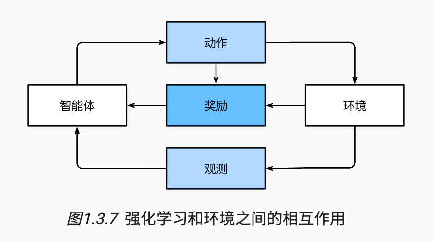

# 1.引言

## 1.2 机器学习中的关键组件

首先介绍一些核心组件。无论什么类型的机器学习问题，都会遇到这些组件：

1. 可以用来学习的*数据*（data）；
2. 如何转换数据的*模型*（model）；
3. 一个*目标函数*（objective function），用来量化模型的有效性；
4. 调整模型参数以优化目标函数的*算法*（algorithm）。

### 1.3.1 监督学习

监督学习的学习过程一般可以分为三大步骤：

1. 从已知大量数据样本中随机选取一个子集，为每个样本获取真实标签。有时，这些样本已有标签（例如，患者是否在下一年内康复？）；有时，这些样本可能需要被人工标记（例如，图像分类）。这些输入和相应的标签一起构成了训练数据集；
2. 选择有监督的学习算法，它将训练数据集作为输入，并输出一个“已完成学习的模型”；
3. 将之前没有见过的样本特征放到这个“已完成学习的模型”中，使用模型的输出作为相应标签的预测。

+ 回归
+ 分类
+ 标记问题
+ 搜索
+ 推荐系统
+ 序列学习：语音转文字，文字转语音，机器翻译

### 1.3.2 无监督学习

+ 聚类
+ 主成分分析
+ 因果关系和概率图模型
+ 生成对抗网络

### 1.3.4 强化学习

+ 当环境可被完全观察到时，强化学习问题被称为*马尔可夫决策过程*（markov decision process）。 
+ 当状态不依赖于之前的操作时，我们称该问题为*上下文赌博机*（contextual bandit problem）。 
+ 当没有状态，只有一组最初未知回报的可用动作时，这个问题就是经典的*多臂赌博机*（multi-armed bandit problem）。

## 1.8 小结

+ 机器学习研究计算机系统如何利用经验（通常是数据）来提高特定任务的性能。它结合了统计学、数据挖掘和优化的思想。通常，它是被用作实现人工智能解决方案的一种手段。
+ 表示学习作为机器学习的一类，其研究的重点是如何自动找到合适的数据表示方式。深度学习是通过学习多层次的转换来进行的多层次的表示学习。
+ 深度学习不仅取代了传统机器学习的浅层模型，而且取代了劳动密集型的特征工程。
+ 最近在深度学习方面取得的许多进展，大都是由廉价传感器和互联网规模应用所产生的大量数据，以及（通过GPU）算力的突破来触发的。
+ 整个系统优化是获得高性能的关键环节。有效的深度学习框架的开源使得这一点的设计和实现变得非常容易。

