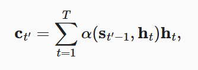

# 10. 注意力机制

 Bahdanau注意力是深度学习中的具有突破性价值的注意力模型，它双向对齐并且可以微分。

最后将描述仅仅基于注意力机制的*Transformer*架构， 该架构中使用了*多头注意力*（multi-head attention） 和*自注意力*（self-attention）。

# 10.1. 注意力提示

## 10.1.1. 生物学中的注意力提示

## 10.1.2. 查询、键和值

自主性的与非自主性的注意力提示解释了人类的注意力的方式

“是否包含自主性提示”将注意力机制与全连接层或汇聚层区别开来。

在注意力机制的背景下，自主性提示被称为*查询*（query）。

给定任何查询，注意力机制通过*注意力汇聚*（attention pooling） 将选择引导至*感官输入*（sensory inputs，例如中间特征表示）。 在注意力机制中，这些感官输入被称为*值*（value）。 更通俗的解释，每个值都与一个*键*（key）配对， 这可以想象为感官输入的非自主提示。更通俗的解释，每个值都与一个*键*（key）配对， 这可以想象为感官输入的非自主提示。 如图所示，可以通过设计注意力汇聚的方式， 便于给定的查询（自主性提示）与键（非自主性提示）进行匹配， 这将引导得出最匹配的值（感官输入）。

## 10.1.3. 注意力的可视化

## 10.1.4. 小结

- 人类的注意力是有限的、有价值和稀缺的资源。
- 受试者使用非自主性和自主性提示有选择性地引导注意力。前者基于突出性，后者则依赖于意识。
- 注意力机制与全连接层或者汇聚层的区别源于增加的自主提示。
- 由于包含了自主性提示，注意力机制与全连接的层或汇聚层不同。
- 注意力机制通过注意力汇聚使选择偏向于值（感官输入），其中包含查询（自主性提示）和键（非自主性提示）。键和值是成对的。
- 可视化查询和键之间的注意力权重是可行的。

# 10.2. 注意力汇聚：Nadaraya-Watson 核回归

1964年提出的Nadaraya-Watson核回归模型 是一个简单但完整的例子，可以用于演示具有注意力机制的机器学习。

## 10.2.1. 生成数据集

## 10.2.2. 平均汇聚

## 10.2.3. 非参数注意力汇聚

Nadaraya-Watson核回归是一个非参数模型。

因此由观察可知“查询-键”对越接近， 注意力汇聚的注意力权重就越高。

## 10.2.4. 带参数注意力汇聚

非参数的Nadaraya-Watson核回归具有*一致性*（consistency）的优点： 如果有足够的数据，此模型会收敛到最优结果

例如，与 [(10.2.6)](https://zh.d2l.ai/chapter_attention-mechanisms/nadaraya-waston.html#equation-eq-nadaraya-watson-gaussian)略有不同， 在下面的查询x和键xi之间的距离乘以可学习参数w：

### 10.2.4.1. 批量矩阵乘法

## 10.2.5. 小结

- Nadaraya-Watson核回归是具有注意力机制的机器学习范例。
- Nadaraya-Watson核回归的注意力汇聚是对训练数据中输出的加权平均。从注意力的角度来看，分配给每个值的注意力权重取决于将值所对应的键和查询作为输入的函数。
- 注意力汇聚可以分为非参数型和带参数型。

# 10.3. 注意力评分函数

高斯核指数部分可以视为*注意力评分函数*（attention scoring function）， 简称*评分函数*（scoring function）， 然后把这个函数的输出结果输入到softmax函数中进行运算。 通过上述步骤，将得到与键对应的值的概率分布（即注意力权重）。 最后，注意力汇聚的输出就是基于这些注意力权重的值的加权和。

 [图10.3.1](https://zh.d2l.ai/chapter_attention-mechanisms/attention-scoring-functions.html#fig-attention-output)说明了 如何将注意力汇聚的输出计算成为值的加权和， 其中a表示注意力评分函数。 由于注意力权重是概率分布， 因此加权和其本质上是加权平均值。

用数学语言描述，假设有一个查询 q∈Rq和 m个“键－值”对 (k1,v1),…,(km,vm)， 其中ki∈Rk，vi∈Rv。 注意力汇聚函数f就被表示成值的加权和：

其中查询q和键ki的注意力权重（标量） 是通过注意力评分函数a将两个向量映射成标量， 再经过softmax运算得到的：

正如上图所示，选择不同的注意力评分函数a会导致不同的注意力汇聚操作。 本节将介绍两个流行的评分函数，稍后将用他们来实现更复杂的注意力机制。

## 10.3.1. 掩蔽softmax操作

 在某些情况下，并非所有的值都应该被纳入到注意力汇聚中。为了仅将有意义的词元作为值来获取注意力汇聚， 可以指定一个有效序列长度（即词元的个数）， 以便在计算softmax时过滤掉超出指定范围的位置。

## 10.3.2. 加性注意力

一般来说，当查询和键是不同长度的矢量时，可以使用加性注意力作为评分函数。给定查询q∈Rq和 键k∈Rk， *加性注意力*（additive attention）的评分函数为

## 10.3.3. 缩放点积注意力

使用点积可以得到计算效率更高的评分函数， 但是点积操作要求查询和键具有相同的长度d。 假设查询和键的所有元素都是独立的随机变量， 并且都满足零均值和单位方差， 那么两个向量的点积的均值为0，方差为d。 为确保无论向量长度如何， 点积的方差在不考虑向量长度的情况下仍然是1， 我们再将点积除以d， 则*缩放点积注意力*（scaled dot-product attention）评分函数为：

## 10.3.4. 小结

- 将注意力汇聚的输出计算可以作为值的加权平均，选择不同的注意力评分函数会带来不同的注意力汇聚操作。
- 当查询和键是不同长度的矢量时，可以使用可加性注意力评分函数。当它们的长度相同时，使用缩放的“点－积”注意力评分函数的计算效率更高。

# 10.4. Bahdanau 注意力

 Bahdanau等人提出了一个没有严格单向对齐限制的 可微注意力模型 ([Bahdanau *et al.*, 2014](https://zh.d2l.ai/chapter_references/zreferences.html#id6))。在预测词元时，如果不是所有输入词元都相关，模型将仅对齐（或参与）输入序列中与当前预测相关的部分。这是通过将上下文变量视为注意力集中的输出来实现的。

## 10.4.1. 模型

其中，时间步t′−1时的解码器隐状态st′−1是查询， 编码器隐状态ht既是键，也是值， 注意力权重α是使用 [(10.3.2)](https://zh.d2l.ai/chapter_attention-mechanisms/attention-scoring-functions.html#equation-eq-attn-scoring-alpha) 所定义的加性注意力打分函数计算的。

## 10.4.2. 定义注意力解码器

首先，初始化解码器的状态，需要下面的输入：

1. 编码器在所有时间步的最终层隐状态，将作为注意力的键和值；
2. 上一时间步的编码器全层隐状态，将作为初始化解码器的隐状态；
3. 编码器有效长度（排除在注意力池中填充词元）。

在每个解码时间步骤中，解码器上一个时间步的最终层隐状态将用作查询。 因此，注意力输出和输入嵌入都连结为循环神经网络解码器的输入。

## 10.4.3. 训练

## 10.4.4. 小结

- 在预测词元时，如果不是所有输入词元都是相关的，那么具有Bahdanau注意力的循环神经网络编码器-解码器会有选择地统计输入序列的不同部分。这是通过将上下文变量视为加性注意力池化的输出来实现的。
- 在循环神经网络编码器-解码器中，Bahdanau注意力将上一时间步的解码器隐状态视为查询，在所有时间步的编码器隐状态同时视为键和值。

# 10.5. 多头注意力

在实践中，当给定相同的查询、键和值的集合时， 我们希望模型可以基于相同的注意力机制学习到不同的行为， 然后将不同的行为作为知识组合起来， 捕获序列内各种范围的依赖关系 （例如，短距离依赖和长距离依赖关系）。 因此，允许注意力机制组合使用查询、键和值的不同 *子空间表示*（representation subspaces）可能是有益的。

为此，与其只使用单独一个注意力汇聚， 我们可以用独立学习得到的h组不同的 *线性投影*（linear projections）来变换查询、键和值。  然后，这h组变换后的查询、键和值将并行地送到注意力汇聚中。 最后，将这h个注意力汇聚的输出拼接在一起， 并且通过另一个可以学习的线性投影进行变换， 以产生最终输出。 这种设计被称为*多头注意力*（multihead attention）对于h个注意力汇聚输出，每一个注意力汇聚都被称作一个*头*（head）。

## 10.5.1. 模型

## 10.5.2. 实现

在实现过程中通常选择缩放点积注意力作为每一个注意力头。 

## 10.5.3. 小结

- 多头注意力融合了来自于多个注意力汇聚的不同知识，这些知识的不同来源于相同的查询、键和值的不同的子空间表示。
- 基于适当的张量操作，可以实现多头注意力的并行计算。

# 10.6. 自注意力和位置编码

在深度学习中，经常使用卷积神经网络（CNN）或循环神经网络（RNN）对序列进行编码。 想象一下，有了注意力机制之后，我们将词元序列输入注意力池化中， 以便同一组词元同时充当查询、键和值。 具体来说，每个查询都会关注所有的键－值对并生成一个注意力输出。 由于查询、键和值来自同一组输入，因此被称为 *自注意力*（self-attention） ([Lin *et al.*, 2017](https://zh.d2l.ai/chapter_references/zreferences.html#id94), [Vaswani *et al.*, 2017](https://zh.d2l.ai/chapter_references/zreferences.html#id174))， 也被称为*内部注意力*（intra-attention） ([Cheng *et al.*, 2016](https://zh.d2l.ai/chapter_references/zreferences.html#id22), [Parikh *et al.*, 2016](https://zh.d2l.ai/chapter_references/zreferences.html#id119), [Paulus *et al.*, 2017](https://zh.d2l.ai/chapter_references/zreferences.html#id121))。 本节将使用自注意力进行序列编码，以及如何使用序列的顺序作为补充信息。

## 10.6.1. 自注意力

## 10.6.2. 比较卷积神经网络、循环神经网络和自注意力

总而言之，卷积神经网络和自注意力都拥有并行计算的优势， 而且自注意力的最大路径长度最短。 但是因为其计算复杂度是关于序列长度的二次方，所以在很长的序列中计算会非常慢。

## 10.6.3. 位置编码

在处理词元序列时，循环神经网络是逐个的重复地处理词元的， 而自注意力则因为并行计算而放弃了顺序操作。 为了使用序列的顺序信息，通过在输入表示中添加 *位置编码*（positional encoding）来注入绝对的或相对的位置信息。

位置编码可以通过学习得到也可以直接固定得到。

### 10.6.3.1. 绝对位置信息

### 10.6.3.2. 相对位置信息

## 10.6.4. 小结

- 在自注意力中，查询、键和值都来自同一组输入。
- 卷积神经网络和自注意力都拥有并行计算的优势，而且自注意力的最大路径长度最短。但是因为其计算复杂度是关于序列长度的二次方，所以在很长的序列中计算会非常慢。
- 为了使用序列的顺序信息，可以通过在输入表示中添加位置编码，来注入绝对的或相对的位置信息。

# 10.7. Transformer

自注意力同时具有并行计算和最短的最大路径长度这两个优势。

Transformer模型完全基于注意力机制，没有任何卷积层或循环神经网络层

尽管Transformer最初是应用于在文本数据上的序列到序列学习，但现在已经推广到各种现代的深度学习中，例如语言、视觉、语音和强化学习领域。

## 10.7.1. 模型

Transformer作为编码器－解码器架构的一个实例，其整体架构图在 [图10.7.1](https://zh.d2l.ai/chapter_attention-mechanisms/transformer.html#fig-transformer)中展示。

Transformer的编码器和解码器是基于自注意力的模块叠加而成的，源（输入）序列和目标（输出）序列的*嵌入*（embedding）表示将加上*位置编码*（positional encoding），再分别输入到编码器和解码器中。

从宏观角度来看，**Transformer的编码器**是由多个相同的层叠加而成的，每个层都有两个子层（子层表示为sublayer）。

第一个子层是*多头自注意力*（multi-head self-attention）汇聚；

第二个子层是*基于位置的前馈网络*（positionwise feed-forward network）。

具体来说，在计算编码器的自注意力时，查询、键和值都来自前一个编码器层的输出。

受 [7.6节](https://zh.d2l.ai/chapter_convolutional-modern/resnet.html#sec-resnet)中残差网络的启发，每个子层都采用了*残差连接*（residual connection）。

在残差连接的加法计算之后，紧接着应用*层规范化*（layer normalization）

因此，输入序列对应的每个位置，Transformer编码器都将输出一个d维表示向量。

**Transformer解码器**也是由多个相同的层叠加而成的，并且层中使用了残差连接和层规范化。

除了编码器中描述的两个子层之外，解码器还在这两个子层之间插入了第三个子层，称为*编码器－解码器注意力*（encoder-decoder attention）层。

在编码器－解码器注意力中，查询来自前一个解码器层的输出，而键和值来自整个编码器的输出。

在解码器自注意力中，查询、键和值都来自上一个解码器层的输出。

但是，解码器中的每个位置只能考虑该位置之前的所有位置。这种*掩蔽*（masked）注意力保留了*自回归*（auto-regressive）属性，确保预测仅依赖于已生成的输出词元。

## 10.7.2. 基于位置的前馈网络

基于位置的前馈网络对序列中的所有位置的表示进行变换时使用的是同一个多层感知机（MLP），这就是称前馈网络是*基于位置的*（positionwise）的原因。

## 10.7.3. 残差连接和层规范化

现在让我们关注 [图10.7.1](https://zh.d2l.ai/chapter_attention-mechanisms/transformer.html#fig-transformer)中的*加法和规范化*（add&norm）组件。

层规范化和批量规范化的目标相同，但层规范化是基于特征维度进行规范化。

## 10.7.4. 编码器

有了组成Transformer编码器的基础组件，现在可以先实现编码器中的一个层。下面的`EncoderBlock`类包含两个子层：多头自注意力和基于位置的前馈网络，这两个子层都使用了残差连接和紧随的层规范化。

## 10.7.5. 解码器

Transformer解码器也是由多个相同的层组成。在`DecoderBlock`类中实现的每个层包含了三个子层：解码器自注意力、“编码器-解码器”注意力和基于位置的前馈网络。这些子层也都被残差连接和紧随的层规范化围绕。

正如在本节前面所述，在掩蔽多头解码器自注意力层（第一个子层）中，查询、键和值都来自上一个解码器层的输出。关于*序列到序列模型*（sequence-to-sequence model），在训练阶段，其输出序列的所有位置（时间步）的词元都是已知的；然而，在预测阶段，其输出序列的词元是逐个生成的。因此，在任何解码器时间步中，只有生成的词元才能用于解码器的自注意力计算中。

## 10.7.6. 训练

## 10.7.7. 小结

- Transformer是编码器－解码器架构的一个实践，尽管在实际情况中编码器或解码器可以单独使用。
- 在Transformer中，多头自注意力用于表示输入序列和输出序列，不过解码器必须通过掩蔽机制来保留自回归属性。
- Transformer中的残差连接和层规范化是训练非常深度模型的重要工具。
- Transformer模型中基于位置的前馈网络使用同一个多层感知机，作用是对所有序列位置的表示进行转换。
