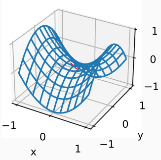
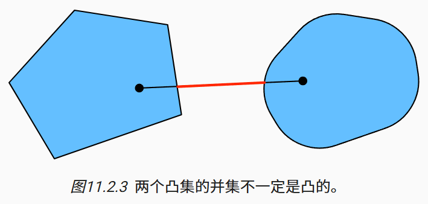
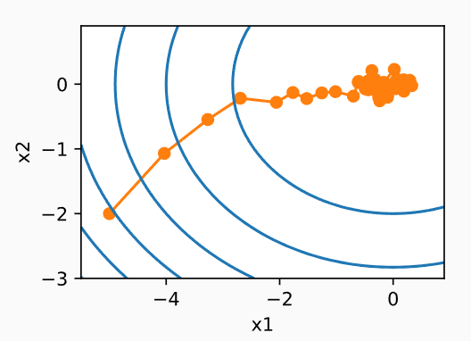

# 11.优化算法

优化算法对于深度学习非常重要。一方面，训练复杂的深度学习模型可能需要数小时、几天甚至数周。优化算法的性能直接影响模型的训练效率。另一方面，了解不同优化算法的原则及其超参数的作用将使我们能够以有针对性的方式调整超参数，以提高深度学习模型的性能。

深度学习中出现的几乎所有优化问题都是*非凸*的。尽管如此，在*凸问题*背景下设计和分析算法是非常有启发性的。

# 11.1. 优化和深度学习

对于深度学习问题，我们通常会先定义*损失函数*。一旦我们有了损失函数，我们就可以使用优化算法来尝试最小化损失。在优化中，损失函数通常被称为优化问题的*目标函数*。

## 11.1.1. 优化的目标

训练误差和泛化误差通常不同：由于优化算法的目标函数通常是基于训练数据集的损失函数，因此优化的目标是减少训练误差。但是，深度学习（或更广义地说，统计推断）的目标是减少泛化误差。

**经验风险**是训练数据集的平均损失，而**风险**则是整个数据群的预期损失。

## 11.1.2. 深度学习中的优化挑战

本章将关注优化算法在最小化目标函数方面的性能，而不是模型的泛化误差。

### 11.1.2.1. 局部最小值

对于任何目标函数f(x)，如果在x处对应的f(x)值小于在x附近任意其他点的f(x)值，那么f(x)可能是局部最小值。如果f(x)在x处的值是整个域中目标函数的最小值，那么f(x)是全局最小值。

深度学习模型的目标函数通常有许多局部最优解。当优化问题的数值解接近局部最优值时，随着目标函数解的梯度接近或变为零，通过最终迭代获得的数值解可能仅使目标函数*局部*最优，而不是*全局*最优。只有一定程度的噪声可能会使参数跳出局部最小值。事实上，这是**小批量随机梯度下降**的有利特性之一。在这种情况下，小批量上梯度的自然变化能够将参数从局部极小值中跳出。

### 11.1.2.2. 鞍点

除了局部最小值之外，鞍点是梯度消失的另一个原因。***鞍点*（saddle point）**是指函数的所有梯度都消失但既不是全局最小值也不是局部最小值的任何位置。

我们假设函数的输入是k维向量，其输出是标量，因此其Hessian矩阵（也称黑塞矩阵）将有k个特征值（参考[特征分解的在线附录](https://d2l.ai/chapter_appendix-mathematics-for-deep-learning/eigendecomposition.html))。函数的解可能是局部最小值、局部最大值或函数梯度为零位置处的鞍点：

- 当函数在零梯度位置处的Hessian矩阵的特征值全部为正值时，我们有该函数的局部最小值；
- 当函数在零梯度位置处的Hessian矩阵的特征值全部为负值时，我们有该函数的局部最大值；
- 当函数在零梯度位置处的Hessian矩阵的特征值为负值和正值时，我们有该函数的一个鞍点。

### 11.1.2.3. 梯度消失

可能遇到的最隐蔽问题是梯度消失。

事实证明，这是在引入ReLU激活函数之前训练深度学习模型相当棘手的原因之一。

## 11.1.3. 小结

- 最小化训练误差并*不能*保证我们找到最佳的参数集来最小化泛化误差。
- 优化问题可能有许多局部最小值。
- 一个问题可能有很多的鞍点，因为问题通常不是凸的。
- 梯度消失可能会导致优化停滞，重参数化通常会有所帮助。对参数进行良好的初始化也可能是有益的。

# 11.2. 凸性

*凸性*（convexity）在优化算法的设计中起到至关重要的作用， 这主要是由于在这种情况下对算法进行分析和测试要容易。

 此外，即使深度学习中的优化问题通常是非凸的， 它们也经常在局部极小值附近表现出一些凸性。

## 11.2.1. 定义

在进行凸分析之前，我们需要定义*凸集*（convex sets）和*凸函数*（convex functions）。

### 11.2.1.1. 凸集

*凸集*（convex set）是凸性的基础。（最优化课程学过）

凸集的并集不一定是凸的，即*非凸*（nonconvex）的。

通常，深度学习中的问题是在凸集上定义的。 例如， $\mathbb{R}^d$ ，即实数的d-维向量的集合是凸集（毕竟Rd中任意两点之间的线存在Rd）中。 

### 11.2.1.2. 凸函数

现在我们有了凸集，我们可以引入*凸函数*（convex function）f。

给定一个凸集X，如果对于所有x,x′∈X和所有λ∈[0,1]，函数f:X→R是凸的，我们可以得到

$$
\lambda f(x)+(1-\lambda)f(x^{\prime})\geq f(\lambda x+(1-\lambda)x^{\prime}).
$$

### 11.2.1.3. 詹森不等式

给定一个凸函数f，最有用的数学工具之一就是*詹森不等式*（Jensen’s inequality）。 它是凸性定义的一种推广：

$$
\sum_i\alpha_if(x_i)\geq f\left(\sum_i\alpha_ix_i\right)\mathrm{~and~}E_X[f(X)]\geq f\left(E_X[X]\right),
$$

## 11.2.2. 性质

### 11.2.2.1. 局部极小值是全局极小值

首先凸函数的局部极小值也是全局极小值。可以用反证法给出证明

### 11.2.2.2. 凸函数的下水平集是凸的

我们可以方便地通过凸函数的*下水平集*（below sets）定义凸集。 具体来说，给定一个定义在凸集X上的凸函数f，其任意一个下水平集是凸的。

$$
\mathcal{S}_b:=\{x|x\in\mathcal{X}\mathrm{~and~}f(x)\leq b\}
$$

### 11.2.2.3. 凸性和二阶导数

当一个函数的二阶导数f:Rn→R存在时，我们很容易检查这个函数的凸性。 

## 11.2.3. 约束

凸优化的一个很好的特性是能够让我们有效地处理*约束*（constraints）。 即它使我们能够解决以下形式的*约束优化*（constrained optimization）问题：

$$
\begin{aligned}&\mathrm{minimize~}f(\mathbf{x})\\&\text{subject to }c_i(\mathbf{x})\leq0\text{ for all }i\in\{1,\ldots,N\}.\end{aligned}
$$

这里f是目标函数，ci是约束函数。

### 11.2.3.3. 投影

满足约束条件的另一种策略是*投影*（projections）。

## 11.2.4. 小结

在深度学习的背景下，凸函数的主要目的是帮助我们详细了解优化算法。 我们由此得出梯度下降法和随机梯度下降法是如何相应推导出来的。

- 凸集的交点是凸的，并集不是。
- 根据詹森不等式，“一个多变量凸函数的总期望值”大于或等于“用每个变量的期望值计算这个函数的总值“。
- 一个二次可微函数是凸函数，当且仅当其Hessian（二阶导数矩阵）是半正定的。
- 凸约束可以通过拉格朗日函数来添加。在实践中，只需在目标函数中加上一个惩罚就可以了。
- 投影映射到凸集中最接近原始点的点。

# 11.3. 梯度下降

*预处理*（preconditioning）是梯度下降中的一种常用技术， 还被沿用到更高级的算法中。

## 11.3.1. 一维梯度下降

### 11.3.1.1. 学习率

*学习率*（learning rate）决定目标函数能否收敛到局部最小值，以及何时收敛到最小值。 

如果我们使用的学习率太小，将导致x的更新非常缓慢，需要更多的迭代。 

相反，如果我们使用过高的学习率，x的迭代不能保证降低f(x)的值

### 11.3.1.2. 局部最小值

## 11.3.2. 多元梯度下降

$$
\nabla f(\mathbf{x})=\left[\frac{\partial f(\mathbf{x})}{\partial x_1},\frac{\partial f(\mathbf{x})}{\partial x_2},\ldots,\frac{\partial f(\mathbf{x})}{\partial x_d}\right]^\top.
$$

## 11.3.3. 自适应方法

选择“恰到好处”的学习率η是很棘手的。 如果我们把它选得太小，就没有什么进展；如果太大，得到的解就会振荡，甚至可能发散。 如果我们可以自动确定η，或者完全不必选择学习率，会怎么样？ 

### 11.3.3.3. 预处理

计算和存储完整的Hessian非常昂贵，而改善这个问题的一种方法是“预处理”。

### 11.3.3.4. 梯度下降和线搜索

梯度下降的一个关键问题是我们可能会超过目标或进展不足， 解决这一问题的简单方法是结合使用线搜索和梯度下降。

## 11.3.4. 小结

- 学习率的大小很重要：学习率太大会使模型发散，学习率太小会没有进展。
- 梯度下降会可能陷入局部极小值，而得不到全局最小值。
- 在高维模型中，调整学习率是很复杂的。
- 预处理有助于调节比例。
- 牛顿法在凸问题中一旦开始正常工作，速度就会快得多。
- 对于非凸问题，不要不作任何调整就使用牛顿法。

# 11.4. 随机梯度下降

本节继续更详细地说明*随机梯度下降*（stochastic gradient descent）。

## 11.4.1. 随机梯度更新

在深度学习中，目标函数通常是训练数据集中每个样本的损失函数的平均值。

随机梯度下降（SGD）可降低每次迭代时的计算代价。

## 11.4.2. 动态学习率

用与时间相关的学习率η(t)取代η增加了控制优化算法收敛的复杂性。

特别是，我们需要弄清η的衰减速度。如果太快，我们将过早停止优化。如果减少的太慢，我们会在优化上浪费太多时间。

关于如何设置学习率，还有更多的选择。例如，我们可以从较小的学习率开始，然后使其迅速上涨，再让它降低，尽管这会更慢。我们甚至可以在较小和较大的学习率之间切换。

## 11.4.5. 小结

- 对于凸问题，我们可以证明，对于广泛的学习率选择，随机梯度下降将收敛到最优解。
- 对于深度学习而言，情况通常并非如此。但是，对凸问题的分析使我们能够深入了解如何进行优化，即逐步降低学习率，尽管不是太快。
- 如果学习率太小或太大，就会出现问题。实际上，通常只有经过多次实验后才能找到合适的学习率。
- 当训练数据集中有更多样本时，计算梯度下降的每次迭代的代价更高，因此在这些情况下，首选随机梯度下降。
- 随机梯度下降的最优性保证在非凸情况下一般不可用，因为需要检查的局部最小值的数量可能是指数级的。

# 11.5. 小批量随机梯度下降

随机梯度下降并不特别“计算高效”。 这便涉及到*小批量随机梯度下降*（minibatch gradient descent）。

## 11.5.1. 向量化和缓存

使用小批量的决策的核心是计算效率。 

## 11.5.2. 小批量

之前我们会理所当然地读取数据的*小批量*，而不是观测单个数据来更新参数，现在简要解释一下原因。 处理单个观测值需要我们执行许多单一矩阵-矢量（甚至矢量-矢量）乘法，这耗费相当大，而且对应深度学习框架也要巨大的开销。 这既适用于计算梯度以更新参数时，也适用于用神经网络预测。

## 11.5.6. 小结

- 由于减少了深度学习框架的额外开销，使用更好的内存定位以及CPU和GPU上的缓存，向量化使代码更加高效。
- **随机梯度下降的“统计效率”与大批量一次处理数据的“计算效率”之间存在权衡。小批量随机梯度下降提供了两全其美的答案：计算和统计效率。**
- 在小批量随机梯度下降中，我们处理通过训练数据的随机排列获得的批量数据（即每个观测值只处理一次，但按随机顺序）。
- 在训练期间降低学习率有助于训练。
- **一般来说，小批量随机梯度下降比随机梯度下降和梯度下降的速度快，收敛风险较小。**

# 11.6. 动量法

在 [11.4节](https://zh.d2l.ai/chapter_optimization/sgd.html#sec-sgd)一节中，我们详述了如何执行随机梯度下降，即在只有嘈杂的梯度可用的情况下执行优化时会发生什么。 对于嘈杂的梯度，我们在选择学习率需要格外谨慎。 如果衰减速度太快，收敛就会停滞。 相反，如果太宽松，我们可能无法收敛到最优解。

## 11.6.1. 基础

本节将探讨更有效的优化算法，尤其是针对实验中常见的某些类型的优化问题。

### 11.6.1.1. 泄漏平均值

上述推理构成了“加速”梯度方法的基础，例如具有动量的梯度。 在优化问题条件不佳的情况下（例如，有些方向的进展比其他方向慢得多，类似狭窄的峡谷），“加速”梯度还额外享受更有效的好处。 此外，它们允许我们对随后的梯度计算平均值，以获得更稳定的下降方向。 诚然，即使是对于无噪声凸问题，加速度这方面也是动量如此起效的关键原因之一。

### 11.6.1.2. 条件不佳的问题

### 11.6.1.3. 动量法

*动量法*（momentum）使我们能够解决上面描述的梯度下降问题。

### 11.6.2.1. 从零开始实现

相比于小批量随机梯度下降，动量方法需要维护一组辅助变量，即速度。 它与梯度以及优化问题的变量具有相同的形状。 

## 11.6.4. 小结

- **动量法用过去梯度的平均值来替换梯度，这大大加快了收敛速度。**
- 对于无噪声梯度下降和嘈杂随机梯度下降，动量法都是可取的。
- 动量法可以防止在随机梯度下降的优化过程停滞的问题。
- 由于对过去的数据进行了指数降权，有效梯度数为11−β。
- 在凸二次问题中，可以对动量法进行明确而详细的分析。
- 动量法的实现非常简单，但它需要我们存储额外的状态向量（动量v）。

# 11.7. AdaGrad算法

## 11.7.1. 稀疏特征和学习率

AdaGrad算法 ([Duchi *et al.*, 2011](https://zh.d2l.ai/chapter_references/zreferences.html#id36))通过将粗略的计数器s(i,t)替换为先前观察所得梯度的平方之和来解决这个问题。 它使用s(i,t+1)=s(i,t)+(∂if(x))2来调整学习率。 **这有两个好处**：首先，我们不再需要决定梯度何时算足够大。 其次，它会随梯度的大小自动变化。通常对应于较大梯度的坐标会显著缩小，而其他梯度较小的坐标则会得到更平滑的处理。 在实际应用中，它促成了计算广告学及其相关问题中非常有效的优化程序。 但是，它遮盖了AdaGrad固有的一些额外优势，这些优势在预处理环境中很容易被理解。

## 11.7.6. 小结

- AdaGrad算法会在单个坐标层面动态降低学习率。
- **AdaGrad算法利用梯度的大小作为调整进度速率的手段：用较小的学习率来补偿带有较大梯度的坐标。**
- 在深度学习问题中，由于内存和计算限制，计算准确的二阶导数通常是不可行的。梯度可以作为一个有效的代理。
- 如果优化问题的结构相当不均匀，AdaGrad算法可以帮助缓解扭曲。
- AdaGrad算法对于稀疏特征特别有效，在此情况下由于不常出现的问题，学习率需要更慢地降低。
- 在深度学习问题上，AdaGrad算法有时在降低学习率方面可能过于剧烈。我们将在 [11.10节](https://zh.d2l.ai/chapter_optimization/adam.html#sec-adam)一节讨论缓解这种情况的策略。

# 11.8. RMSProp算法

([Tieleman and Hinton, 2012](https://zh.d2l.ai/chapter_references/zreferences.html#id168))建议以RMSProp算法作为将速率调度与坐标自适应学习率分离的简单修复方法。

## 11.8.4. 小结

- RMSProp算法与Adagrad算法非常相似，因为两者都使用梯度的平方来缩放系数。
- RMSProp算法与动量法都使用泄漏平均值。但是，RMSProp算法使用该技术来调整按系数顺序的预处理器。
- 在实验中，学习率需要由实验者调度。
- 系数γ决定了在调整每坐标比例时历史记录的时长。

# 11.9. Adadelta

Adadelta是AdaGrad的另一种变体（ [11.7节](https://zh.d2l.ai/chapter_optimization/adagrad.html#sec-adagrad)）， 主要区别在于前者减少了学习率适应坐标的数量。 此外，广义上Adadelta被称为没有学习率，因为它使用变化量本身作为未来变化的校准。 Adadelta算法是在 ([Zeiler, 2012](https://zh.d2l.ai/chapter_references/zreferences.html#id194))中提出的。

## 11.9.1. Adadelta算法

简而言之，Adadelta使用两个状态变量，st用于存储梯度二阶导数的泄露平均值，Δxt用于存储模型本身中参数变化二阶导数的泄露平均值。

## 11.9.3. 小结

- Adadelta没有学习率参数。相反，它使用参数本身的变化率来调整学习率。
- Adadelta需要两个状态变量来存储梯度的二阶导数和参数的变化。
- Adadelta使用泄漏的平均值来保持对适当统计数据的运行估计。

# 11.10. Adam算法

在本节讨论之前，我们先详细回顾一下这些技术：

- 在 [11.4节](https://zh.d2l.ai/chapter_optimization/sgd.html#sec-sgd)中，我们学习了：随机梯度下降在解决优化问题时比梯度下降更有效。（随机梯度下降）
- 在 [11.5节](https://zh.d2l.ai/chapter_optimization/minibatch-sgd.html#sec-minibatch-sgd)中，我们学习了：在一个小批量中使用更大的观测值集，可以通过向量化提供额外效率。这是高效的多机、多GPU和整体并行处理的关键。（小批量随机梯度下降）
- 在 [11.6节](https://zh.d2l.ai/chapter_optimization/momentum.html#sec-momentum)中我们添加了一种机制，用于汇总过去梯度的历史以加速收敛。（动量法）
- 在 [11.7节](https://zh.d2l.ai/chapter_optimization/adagrad.html#sec-adagrad)中，我们通过对每个坐标缩放来实现高效计算的预处理器。（AdaGrad）
- 在 [11.8节](https://zh.d2l.ai/chapter_optimization/rmsprop.html#sec-rmsprop)中，我们通过学习率的调整来分离每个坐标的缩放。（RMSProp）

Adam算法 ([Kingma and Ba, 2014](https://zh.d2l.ai/chapter_references/zreferences.html#id83))将所有这些技术汇总到一个高效的学习算法中。

## 11.10.1. 算法

Adam算法的关键组成部分之一是：它使用指数加权移动平均值来估算梯度的动量和二次矩，即它使用状态变量

## 11.10.4. 小结

- Adam算法将许多优化算法的功能结合到了相当强大的更新规则中。
- Adam算法在RMSProp算法基础上创建的，还在小批量的随机梯度上使用EWMA。
- 在估计动量和二次矩时，Adam算法使用偏差校正来调整缓慢的启动速度。
- 对于具有显著差异的梯度，我们可能会遇到收敛性问题。我们可以通过使用更大的小批量或者切换到改进的估计值st来修正它们。Yogi提供了这样的替代方案。

# 11.11. 学习率调度器

到目前为止，我们主要关注如何更新权重向量的优化算法，而不是它们的更新速率。 然而，调整学习率通常与实际算法同样重要，有如下几方面需要考虑：

- 首先，学习率的大小很重要。如果它太大，优化就会发散；如果它太小，训练就会需要过长时间，或者我们最终只能得到次优的结果。我们之前看到问题的条件数很重要（有关详细信息，请参见 [11.6节](https://zh.d2l.ai/chapter_optimization/momentum.html#sec-momentum)）。直观地说，这是最不敏感与最敏感方向的变化量的比率。
- 其次，衰减速率同样很重要。如果学习率持续过高，我们可能最终会在最小值附近弹跳，从而无法达到最优解。 [11.5节](https://zh.d2l.ai/chapter_optimization/minibatch-sgd.html#sec-minibatch-sgd)比较详细地讨论了这一点，在 [11.4节](https://zh.d2l.ai/chapter_optimization/sgd.html#sec-sgd)中我们则分析了性能保证。简而言之，我们希望速率衰减，但要比O(t−12)慢，这样能成为解决凸问题的不错选择。
- 另一个同样重要的方面是初始化。这既涉及参数最初的设置方式（详情请参阅 [4.8节](https://zh.d2l.ai/chapter_multilayer-perceptrons/numerical-stability-and-init.html#sec-numerical-stability)），又关系到它们最初的演变方式。这被戏称为*预热*（warmup），即我们最初开始向着解决方案迈进的速度有多快。一开始的大步可能没有好处，特别是因为最初的参数集是随机的。最初的更新方向可能也是毫无意义的。
- 最后，还有许多优化变体可以执行周期性学习率调整。这超出了本章的范围，我们建议读者阅读 ([Izmailov *et al.*, 2018](https://zh.d2l.ai/chapter_references/zreferences.html#id76))来了解个中细节。例如，如何通过对整个路径参数求平均值来获得更好的解。

## 11.11.2. 学习率调度器

我们可以在每个迭代轮数（甚至在每个小批量）之后向下调整学习率。 例如，以动态的方式来响应优化的进展情况。

这比以前好一些：曲线比以前更加平滑，并且过拟合更小了。 

## 11.11.3. 策略

虽然我们不可能涵盖所有类型的学习率调度器，但我们会尝试在下面简要概述常用的策略：多项式衰减和分段常数表。 

### 11.11.3.1. 单因子调度器

多项式衰减的一种替代方案是乘法衰减

### 11.11.3.2. 多因子调度器

训练深度网络的常见策略之一是保持学习率为一组分段的常量，并且不时地按给定的参数对学习率做乘法衰减。

### 11.11.3.3. 余弦调度器

余弦调度器是 ([Loshchilov and Hutter, 2016](https://zh.d2l.ai/chapter_references/zreferences.html#id101))提出的一种启发式算法。 它所依据的观点是：我们可能不想在一开始就太大地降低学习率，而且可能希望最终能用非常小的学习率来“改进”解决方案。

### 11.11.3.4. 预热

预热阶段限制了非常深的网络中参数的发散程度

## 11.11.4. 小结

- 在训练期间逐步降低学习率可以提高准确性，并且减少模型的过拟合。
- 在实验中，每当进展趋于稳定时就降低学习率，这是很有效的。从本质上说，这可以确保我们有效地收敛到一个适当的解，也只有这样才能通过降低学习率来减小参数的固有方差。
- 余弦调度器在某些计算机视觉问题中很受欢迎。
- 优化之前的预热期可以防止发散。
- 优化在深度学习中有多种用途。对于同样的训练误差而言，选择不同的优化算法和学习率调度，除了最大限度地减少训练时间，可以导致测试集上不同的泛化和过拟合量。

