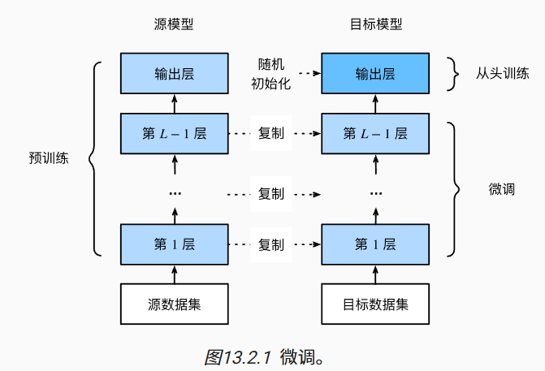

# 13.计算机视觉

# 13.1.图像增广

图像增广在对训练图像进行一系列的随机变化之后，生成相似但不同的训练样本，从而扩大了训练集的规模。此外，应用图像增广的原因是，随机改变训练样本可以减少模型对某些属性的依赖，从而提高模型的泛化能力。 

## 13.1.1. 常用的图像增广方法

### 13.1.1.1. 翻转和裁剪

左右翻转图像通常不会改变对象的类别。这是最早且最广泛使用的图像增广方法之一。

将随机裁剪一个面积为原始面积10%到100%的区域，该区域的宽高比从0.5～2之间随机取值。

### 13.1.1.2. 改变颜色

另一种增广方法是改变颜色。 我们可以改变图像颜色的四个方面：亮度、对比度、饱和度和色调。

### 13.1.1.3. 结合多种图像增广方法

在实践中，我们将结合多种图像增广方法。

## 13.1.3. 小结

- 图像增广基于现有的训练数据生成随机图像，来提高模型的泛化能力。
- 为了在预测过程中得到确切的结果，我们通常对训练样本只进行图像增广，而在预测过程中不使用带随机操作的图像增广。
- 深度学习框架提供了许多不同的图像增广方法，这些方法可以被同时应用。

# 13.2. 微调

另一种解决方案是应用*迁移学习*（transfer learning）将从*源数据集*学到的知识迁移到*目标数据集*。

## 13.2.1. 步骤

本节将介绍迁移学习中的常见技巧:*微调*（fine-tuning）。如 [图13.2.1](https://zh.d2l.ai/chapter_computer-vision/fine-tuning.html#fig-finetune)所示，微调包括以下四个步骤。

1. 在源数据集（例如ImageNet数据集）上预训练神经网络模型，即*源模型*。
2. 创建一个新的神经网络模型，即*目标模型*。这将复制源模型上的所有模型设计及其参数（输出层除外）。我们假定这些模型参数包含从源数据集中学到的知识，这些知识也将适用于目标数据集。我们还假设源模型的输出层与源数据集的标签密切相关；因此不在目标模型中使用该层。
3. 向目标模型添加输出层，其输出数是目标数据集中的类别数。然后随机初始化该层的模型参数。
4. 在目标数据集（如椅子数据集）上训练目标模型。输出层将从头开始进行训练，而所有其他层的参数将根据源模型的参数进行微调。

当目标数据集比源数据集小得多时，微调有助于提高模型的泛化能力。

## 13.2.3. 小结

- 迁移学习将从源数据集中学到的知识*迁移*到目标数据集，微调是迁移学习的常见技巧。
- 除输出层外，目标模型从源模型中复制所有模型设计及其参数，并根据目标数据集对这些参数进行微调。但是，目标模型的输出层需要从头开始训练。
- 通常，微调参数使用较小的学习率，而从头开始训练输出层可以使用更大的学习率。

