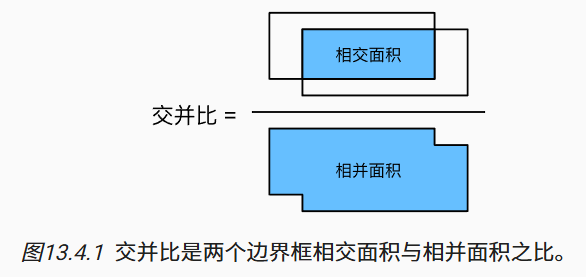
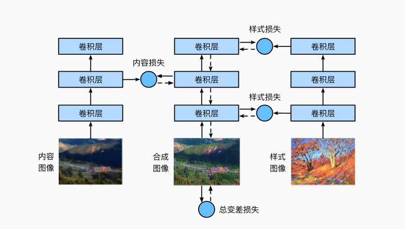

# 13.计算机视觉

# 13.1.图像增广

图像增广在对训练图像进行一系列的随机变化之后，生成相似但不同的训练样本，从而扩大了训练集的规模。此外，应用图像增广的原因是，随机改变训练样本可以减少模型对某些属性的依赖，从而提高模型的泛化能力。 

## 13.1.1. 常用的图像增广方法

### 13.1.1.1. 翻转和裁剪

左右翻转图像通常不会改变对象的类别。这是最早且最广泛使用的图像增广方法之一。

将随机裁剪一个面积为原始面积10%到100%的区域，该区域的宽高比从0.5～2之间随机取值。

### 13.1.1.2. 改变颜色

另一种增广方法是改变颜色。 我们可以改变图像颜色的四个方面：亮度、对比度、饱和度和色调。

### 13.1.1.3. 结合多种图像增广方法

在实践中，我们将结合多种图像增广方法。

## 13.1.3. 小结

- 图像增广基于现有的训练数据生成随机图像，来提高模型的泛化能力。
- 为了在预测过程中得到确切的结果，我们通常对训练样本只进行图像增广，而在预测过程中不使用带随机操作的图像增广。
- 深度学习框架提供了许多不同的图像增广方法，这些方法可以被同时应用。

# 13.2. 微调

另一种解决方案是应用*迁移学习*（transfer learning）将从*源数据集*学到的知识迁移到*目标数据集*。

## 13.2.1. 步骤

本节将介绍迁移学习中的常见技巧:*微调*（fine-tuning）。如 [图13.2.1](https://zh.d2l.ai/chapter_computer-vision/fine-tuning.html#fig-finetune)所示，微调包括以下四个步骤。

1. 在源数据集（例如ImageNet数据集）上预训练神经网络模型，即*源模型*。
2. 创建一个新的神经网络模型，即*目标模型*。这将复制源模型上的所有模型设计及其参数（输出层除外）。我们假定这些模型参数包含从源数据集中学到的知识，这些知识也将适用于目标数据集。我们还假设源模型的输出层与源数据集的标签密切相关；因此不在目标模型中使用该层。
3. 向目标模型添加输出层，其输出数是目标数据集中的类别数。然后随机初始化该层的模型参数。
4. 在目标数据集（如椅子数据集）上训练目标模型。输出层将从头开始进行训练，而所有其他层的参数将根据源模型的参数进行微调。

当目标数据集比源数据集小得多时，微调有助于提高模型的泛化能力。

## 13.2.3. 小结

- 迁移学习将从源数据集中学到的知识*迁移*到目标数据集，微调是迁移学习的常见技巧。
- 除输出层外，目标模型从源模型中复制所有模型设计及其参数，并根据目标数据集对这些参数进行微调。但是，目标模型的输出层需要从头开始训练。
- 通常，微调参数使用较小的学习率，而从头开始训练输出层可以使用更大的学习率。

# 13.3. 目标检测和边界框

很多时候图像里有多个我们感兴趣的目标，我们不仅想知道它们的类别，还想得到它们在图像中的具体位置。 在计算机视觉里，我们将这类任务称为*目标检测*（object detection）或*目标识别*（object recognition）。

在目标检测中，我们通常使用*边界框*（bounding box）来描述对象的空间位置。 边界框是矩形的，由矩形左上角的以及右下角的x和y坐标决定。 另一种常用的边界框表示方法是边界框中心的(x,y)轴坐标以及框的宽度和高度。

## 13.3.2. 小结

- 目标检测不仅可以识别图像中所有感兴趣的物体，还能识别它们的位置，该位置通常由矩形边界框表示。
- 我们可以在两种常用的边界框表示（中间，宽度，高度）和（左上，右下）坐标之间进行转换。

# 13.4. 锚框

不同的模型使用的区域采样方法可能不同。 这里我们介绍其中的一种方法：以每个像素为中心，生成多个缩放比和宽高比（aspect ratio）不同的边界框。 这些边界框被称为*锚框*（anchor box）

## 13.4.1. 生成多个锚框

## 13.4.2. 交并比（IoU）

我们刚刚提到某个锚框“较好地”覆盖了图像中的狗。 如果已知目标的真实边界框，那么这里的“好”该如何如何量化呢？ 直观地说，可以衡量锚框和真实边界框之间的相似性。 *杰卡德系数*（Jaccard）可以衡量两组之间的相似性。 给定集合A和B，他们的杰卡德系数是他们交集的大小除以他们并集的大小：

## 13.4.3. 在训练数据中标注锚框

## 13.4.5. 小结

- 我们以图像的每个像素为中心生成不同形状的锚框。
- 交并比（IoU）也被称为杰卡德系数，用于衡量两个边界框的相似性。它是相交面积与相并面积的比率。
- 在训练集中，我们需要给每个锚框两种类型的标签。一个是与锚框中目标检测的类别，另一个是锚框真实相对于边界框的偏移量。
- 预测期间可以使用非极大值抑制（NMS）来移除类似的预测边界框，从而简化输出。

# 13.5. 多尺度目标检测

## 13.5.3. 小结

- 在多个尺度下，我们可以生成不同尺寸的锚框来检测不同尺寸的目标。
- 通过定义特征图的形状，我们可以决定任何图像上均匀采样的锚框的中心。
- 我们使用输入图像在某个感受野区域内的信息，来预测输入图像上与该区域位置相近的锚框类别和偏移量。
- 我们可以通过深入学习，在多个层次上的图像分层表示进行多尺度目标检测。

# 13.6. 目标检测数据集

## 13.6.4. 小结

- 我们收集的香蕉检测数据集可用于演示目标检测模型。
- 用于目标检测的数据加载与图像分类的数据加载类似。但是，在目标检测中，标签还包含真实边界框的信息，它不出现在图像分类中。

# 13.7. 单发多框检测（SSD）

## 13.7.4. 小结

- 单发多框检测是一种多尺度目标检测模型。基于基础网络块和各个多尺度特征块，单发多框检测生成不同数量和不同大小的锚框，并通过预测这些锚框的类别和偏移量检测不同大小的目标。
- 在训练单发多框检测模型时，损失函数是根据锚框的类别和偏移量的预测及标注值计算得出的。

# 13.8. 区域卷积神经网络（R-CNN）系列

## 13.8.5. 小结

- R-CNN对图像选取若干提议区域，使用卷积神经网络对每个提议区域执行前向传播以抽取其特征，然后再用这些特征来预测提议区域的类别和边界框。
- Fast R-CNN对R-CNN的一个主要改进：只对整个图像做卷积神经网络的前向传播。它还引入了兴趣区域汇聚层，从而为具有不同形状的兴趣区域抽取相同形状的特征。
- Faster R-CNN将Fast R-CNN中使用的选择性搜索替换为参与训练的区域提议网络，这样后者可以在减少提议区域数量的情况下仍保证目标检测的精度。
- Mask R-CNN在Faster R-CNN的基础上引入了一个全卷积网络，从而借助目标的像素级位置进一步提升目标检测的精度。

# 13.9. 语义分割和数据集

- *图像分割*将图像划分为若干组成区域，这类问题的方法通常利用图像中像素之间的相关性。它在训练时不需要有关图像像素的标签信息，在预测时也无法保证分割出的区域具有我们希望得到的语义。以 [图13.9.1](https://zh.d2l.ai/chapter_computer-vision/semantic-segmentation-and-dataset.html#fig-segmentation)中的图像作为输入，图像分割可能会将狗分为两个区域：一个覆盖以黑色为主的嘴和眼睛，另一个覆盖以黄色为主的其余部分身体。
- *实例分割*也叫*同时检测并分割*（simultaneous detection and segmentation），它研究如何识别图像中各个目标实例的像素级区域。与语义分割不同，实例分割不仅需要区分语义，还要区分不同的目标实例。例如，如果图像中有两条狗，则实例分割需要区分像素属于的两条狗中的哪一条。

## 13.9.3. 小结

- 语义分割通过将图像划分为属于不同语义类别的区域，来识别并理解图像中像素级别的内容。
- 语义分割的一个重要的数据集叫做Pascal VOC2012。
- 由于语义分割的输入图像和标签在像素上一一对应，输入图像会被随机裁剪为固定尺寸而不是缩放。

# 13.10. 转置卷积

## 13.10.4. 小结

- 与通过卷积核减少输入元素的常规卷积相反，转置卷积通过卷积核广播输入元素，从而产生形状大于输入的输出。
- 如果我们将X输入卷积层f来获得输出Y=f(X)并创造一个与f有相同的超参数、但输出通道数是X中通道数的转置卷积层g，那么g(Y)的形状将与X相同。
- 我们可以使用矩阵乘法来实现卷积。转置卷积层能够交换卷积层的正向传播函数和反向传播函数。

# 13.11. 全卷积网络

## 13.11.6. 小结

- 全卷积网络先使用卷积神经网络抽取图像特征，然后通过1×1卷积层将通道数变换为类别个数，最后通过转置卷积层将特征图的高和宽变换为输入图像的尺寸。
- 在全卷积网络中，我们可以将转置卷积层初始化为双线性插值的上采样。

# 13.12. 风格迁移

## 13.12.8. 小结

- 风格迁移常用的损失函数由3部分组成：（1）内容损失使合成图像与内容图像在内容特征上接近；（2）风格损失令合成图像与风格图像在风格特征上接近；（3）全变分损失则有助于减少合成图像中的噪点。
- 我们可以通过预训练的卷积神经网络来抽取图像的特征，并通过最小化损失函数来不断更新合成图像来作为模型参数。
- 我们使用格拉姆矩阵表达风格层输出的风格。

