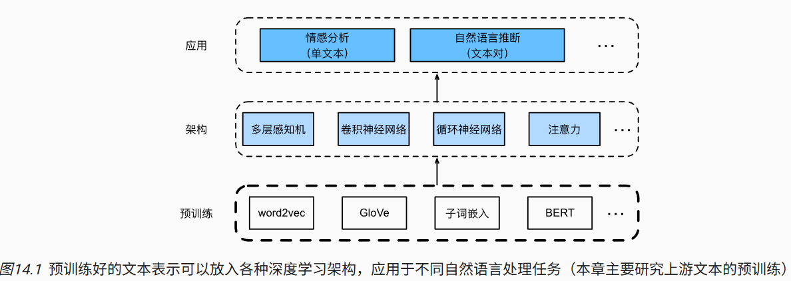
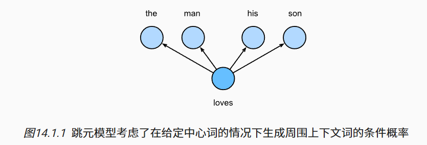
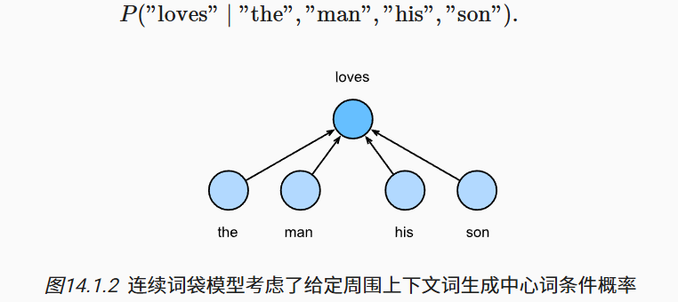
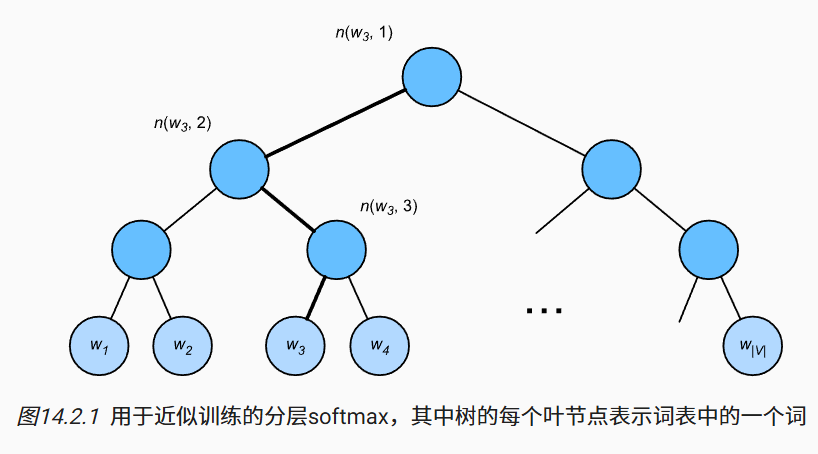
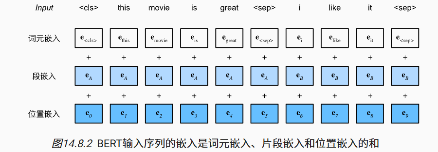

# 14. 自然语言处理：预训练

要理解文本，我们可以从学习它的表示开始。 利用来自大型语料库的现有文本序列， *自监督学习*（self-supervised learning） 已被广泛用于预训练文本表示， 例如通过使用周围文本的其它部分来预测文本的隐藏部分。 通过这种方式，模型可以通过有监督地从*海量*文本数据中学习，而不需要*昂贵*的标签标注！

本章我们将看到：当将每个单词或子词视为单个词元时， 可以在大型语料库上使用word2vec、GloVe或子词嵌入模型预先训练每个词元的词元。 经过预训练后，每个词元的表示可以是一个向量。 

# 14.1. 词嵌入（word2vec）

*词向量*是用于表示单词意义的向量， 并且还可以被认为是单词的特征向量或表示。 将单词映射到实向量的技术称为*词嵌入*。 

## 14.1.1. 为何独热向量是一个糟糕的选择

虽然独热向量很容易构建，但它们通常不是一个好的选择。一个主要原因是独热向量不能准确表达不同词之间的相似度，比如我们经常使用的“余弦相似度”。

独热向量不能编码词之间的相似性。

## 14.1.2. 自监督的word2vec

word2vec工具包含两个模型，即*跳元模型*（skip-gram） ([Mikolov *et al.*, 2013](https://zh.d2l.ai/chapter_references/zreferences.html#id110))和*连续词袋*（CBOW） ([Mikolov *et al.*, 2013](https://zh.d2l.ai/chapter_references/zreferences.html#id109))。

对于在语义上有意义的表示，它们的训练依赖于条件概率，条件概率可以被看作使用语料库中一些词来预测另一些单词。由于是不带标签的数据，因此跳元模型和连续词袋都是自监督模型。

## 14.1.3. 跳元模型（Skip-Gram）

跳元模型假设一个词可以用来在文本序列中生成其周围的单词。

## 14.1.4. 连续词袋（CBOW）模型

*连续词袋*（CBOW）模型类似于跳元模型。与跳元模型的主要区别在于，连续词袋模型假设中心词是基于其在文本序列中的周围上下文词生成的。

## 14.1.5. 小结

- 词向量是用于表示单词意义的向量，也可以看作词的特征向量。将词映射到实向量的技术称为词嵌入。
- word2vec工具包含跳元模型和连续词袋模型。
- 跳元模型假设一个单词可用于在文本序列中，生成其周围的单词；而连续词袋模型假设基于上下文词来生成中心单词。

# 14.2. 近似训练

为了降低上述计算复杂度，本节将介绍两种近似训练方法：*负采样*和*分层softmax*。 由于跳元模型和连续词袋模型的相似性，我们将以跳元模型为例来描述这两种近似训练方法。

## 14.2.1. 负采样

负采样修改了原目标函数。

## 14.2.2. 层序Softmax

作为另一种近似训练方法，*层序Softmax*（hierarchical softmax）使用二叉树（ [图14.2.1](https://zh.d2l.ai/chapter_natural-language-processing-pretraining/approx-training.html#fig-hi-softmax)中说明的数据结构），其中树的每个叶节点表示词表V中的一个词。

## 14.2.3. 小结

- 负采样通过考虑相互独立的事件来构造损失函数，这些事件同时涉及正例和负例。训练的计算量与每一步的噪声词数成线性关系。
- 分层softmax使用二叉树中从根节点到叶节点的路径构造损失函数。训练的计算成本取决于词表大小的对数。

# 14.3. 用于预训练词嵌入的数据集

## 14.3.7. 小结

- 高频词在训练中可能不是那么有用。我们可以对他们进行下采样，以便在训练中加快速度。
- 为了提高计算效率，我们以小批量方式加载样本。我们可以定义其他变量来区分填充标记和非填充标记，以及正例和负例。

# 14.4. 预训练word2vec

## 14.4.4. 小结

- 我们可以使用嵌入层和二元交叉熵损失来训练带负采样的跳元模型。
- 词嵌入的应用包括基于词向量的余弦相似度为给定词找到语义相似的词。

# 14.5. 全局向量的词嵌入（GloVe）

## 14.5.4. 小结

- 诸如词-词共现计数的全局语料库统计可以来解释跳元模型。
- 交叉熵损失可能不是衡量两种概率分布差异的好选择，特别是对于大型语料库。GloVe使用平方损失来拟合预先计算的全局语料库统计数据。
- 对于GloVe中的任意词，中心词向量和上下文词向量在数学上是等价的。
- GloVe可以从词-词共现概率的比率来解释。

# 14.6. 子词嵌入

## 14.6.3. 小结

- fastText模型提出了一种子词嵌入方法：基于word2vec中的跳元模型，它将中心词表示为其子词向量之和。
- 字节对编码执行训练数据集的统计分析，以发现词内的公共符号。作为一种贪心方法，字节对编码迭代地合并最频繁的连续符号对。
- 子词嵌入可以提高稀有词和词典外词的表示质量。

# 14.7. 词的相似性和类比任务

## 14.7.3. 小结

- 在实践中，在大型语料库上预先练的词向量可以应用于下游的自然语言处理任务。
- 预训练的词向量可以应用于词的相似性和类比任务。

# 14.8. 来自Transformers的双向编码器表示（BERT）

## 14.8.7. 小结

- word2vec和GloVe等词嵌入模型与上下文无关。它们将相同的预训练向量赋给同一个词，而不考虑词的上下文（如果有的话）。它们很难处理好自然语言中的一词多义或复杂语义。
- 对于上下文敏感的词表示，如ELMo和GPT，词的表示依赖于它们的上下文。
- ELMo对上下文进行双向编码，但使用特定于任务的架构（然而，为每个自然语言处理任务设计一个特定的体系架构实际上并不容易）；而GPT是任务无关的，但是从左到右编码上下文。
- BERT结合了这两个方面的优点：它对上下文进行双向编码，并且需要对大量自然语言处理任务进行最小的架构更改。
- BERT输入序列的嵌入是词元嵌入、片段嵌入和位置嵌入的和。
- 预训练包括两个任务：掩蔽语言模型和下一句预测。前者能够编码双向上下文来表示单词，而后者则显式地建模文本对之间的逻辑关系。

# 14.9. 用于预训练BERT的数据集

## 14.9.3. 小结

- 与PTB数据集相比，WikiText-2数据集保留了原来的标点符号、大小写和数字，并且比PTB数据集大了两倍多。
- 我们可以任意访问从WikiText-2语料库中的一对句子生成的预训练（遮蔽语言模型和下一句预测）样本。

# 14.10. 预训练BERT

## 14.10.3. 小结

- 原始的BERT有两个版本，其中基本模型有1.1亿个参数，大模型有3.4亿个参数。
- 在预训练BERT之后，我们可以用它来表示单个文本、文本对或其中的任何词元。
- 在实验中，同一个词元在不同的上下文中具有不同的BERT表示。这支持BERT表示是上下文敏感的。

