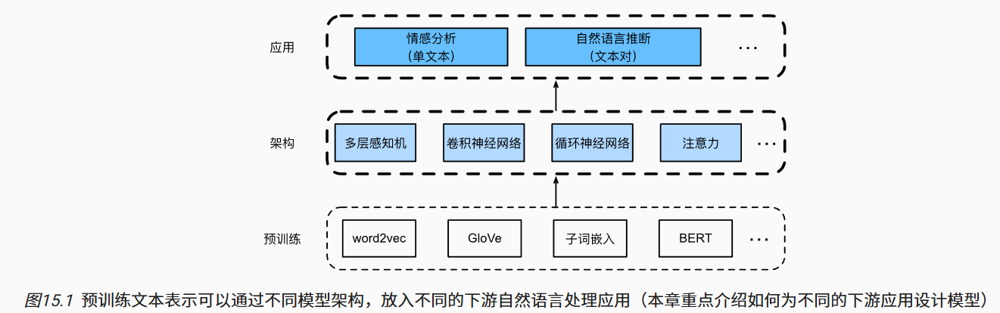

# 15.自然语言处理：应用

本章将探讨两种流行且具有代表性的下游自然语言处理任务： 情感分析和自然语言推断，它们分别分析单个文本和文本对之间的关系。

# 15.1. 情感分析及数据集

在本章中，我们将使用斯坦福大学的[大型电影评论数据集（large movie review dataset）](https://ai.stanford.edu/~amaas/data/sentiment/)进行情感分析。它由一个训练集和一个测试集组成，其中包含从IMDb下载的25000个电影评论。在这两个数据集中，“积极”和“消极”标签的数量相同，表示不同的情感极性。

## 15.1.5. 小结

- 情感分析研究人们在文本中的情感，这被认为是一个文本分类问题，它将可变长度的文本序列进行转换转换为固定长度的文本类别。
- 经过预处理后，我们可以使用词表将IMDb评论数据集加载到数据迭代器中。

# 15.2. 情感分析：使用循环神经网络

## 15.2.4. 小结

- 预训练的词向量可以表示文本序列中的各个词元。
- 双向循环神经网络可以表示文本序列。例如通过连结初始和最终时间步的隐状态，可以使用全连接的层将该单个文本表示转换为类别。

# 15.3. 情感分析：使用卷积神经网络

## 15.3.4. 小结

- 一维卷积神经网络可以处理文本中的局部特征，例如n元语法。
- 多输入通道的一维互相关等价于单输入通道的二维互相关。
- 最大时间汇聚层允许在不同通道上使用不同数量的时间步长。
- textCNN模型使用一维卷积层和最大时间汇聚层将单个词元表示转换为下游应用输出。

# 15.4. 自然语言推断与数据集

## 15.4.3. 小结

- 自然语言推断研究“假设”是否可以从“前提”推断出来，其中两者都是文本序列。
- 在自然语言推断中，前提和假设之间的关系包括蕴涵关系、矛盾关系和中性关系。
- 斯坦福自然语言推断（SNLI）语料库是一个比较流行的自然语言推断基准数据集。

# 15.5. 自然语言推断：使用注意力

## 15.5.3. 小结

- 可分解注意模型包括三个步骤来预测前提和假设之间的逻辑关系：注意、比较和聚合。
- 通过注意力机制，我们可以将一个文本序列中的词元与另一个文本序列中的每个词元对齐，反之亦然。这种对齐是使用加权平均的软对齐，其中理想情况下较大的权重与要对齐的词元相关联。
- 在计算注意力权重时，分解技巧会带来比二次复杂度更理想的线性复杂度。
- 我们可以使用预训练好的词向量作为下游自然语言处理任务（如自然语言推断）的输入表示。

# 15.6. 针对序列级和词元级应用微调BERT

## 15.6.5. 小结

- 对于序列级和词元级自然语言处理应用，BERT只需要最小的架构改变（额外的全连接层），如单个文本分类（例如，情感分析和测试语言可接受性）、文本对分类或回归（例如，自然语言推断和语义文本相似性）、文本标记（例如，词性标记）和问答。
- 在下游应用的监督学习期间，额外层的参数是从零开始学习的，而预训练BERT模型中的所有参数都是微调的。

# 15.7. 自然语言推断：微调BERT

## 15.7.4. 小结

- 我们可以针对下游应用对预训练的BERT模型进行微调，例如在SNLI数据集上进行自然语言推断。
- 在微调过程中，BERT模型成为下游应用模型的一部分。仅与训练前损失相关的参数在微调期间不会更新。

