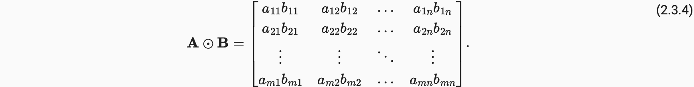

# 2. 预备知识

## 2.1数据操作

### 2.1.3 广播机制

1. 通过适当复制元素来扩展一个或两个数组，以便在转换之后，两个张量具有相同的形状；
2. 对生成的数组执行按元素操作。

## 2.2pands

使用`pandas`预处理原始数据，并将原始数据转换为张量格式

+ `pandas`软件包是Python中常用的数据分析工具中，`pandas`可以与张量兼容。
+ 用`pandas`处理缺失的数据时，我们可根据情况选择用插值法和删除法。

## 2.3线性代数

 需要明确：

+ *向量*或*轴*的维度被用来表示*向量*或*轴*的长度，即向量或轴的元素数量。 
+ 然而，张量的维度用来表示张量具有的轴数。
+  在这个意义上，张量的某个轴的维数就是这个轴的长度。

**A * B 代表点乘**

**小结**

+ 标量、向量、矩阵和张量是线性代数中的基本数学对象。
+ 向量泛化自标量，矩阵泛化自向量。
+ 标量、向量、矩阵和张量分别具有零、一、二和任意数量的轴。
+ 一个张量可以通过`sum`和`mean`沿指定的轴降低维度。
+ 两个矩阵的按元素乘法被称为他们的Hadamard积。它与矩阵乘法不同。
+ 在深度学习中，我们经常使用范数，如范数、范数和Frobenius范数。
+ 我们可以对标量、向量、矩阵和张量执行各种操作。

## 2.4微积分

