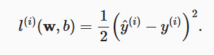
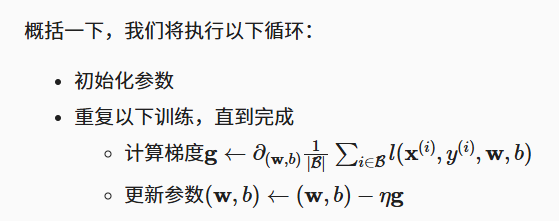

# 3.线性神经网络

## 3.1 线性回归

回归经常用来表示输入和输出之间的关系。

### 3.1.1 线性回归的基本元素

+ 在机器学习的术语中，该数据集称为*训练数据集*（training data set） 或*训练集*（training set）。 
+ 每行数据（比如一次房屋交易相对应的数据）称为*样本*（sample）， 也可以称为*数据点*（data point）或*数据样本*（data instance）。 
+ 我们把试图预测的目标（比如预测房屋价格）称为*标签*（label）或*目标*（target）。
+  预测所依据的自变量（面积和房龄）称为*特征*（feature）或*协变量*（covariate）。

#### 3.1.1.2损失函数

*损失函数*（loss function）能够量化目标的*实际*值与*预测*值之间的差距。

**回归问题中最常用的损失函数是平方误差函数。**

当样本i的预测值为y^(i)，其相应的真实标签为y(i)时， 平方误差可以定义为以下公式：

#### 3.1.1.3 解析解

概念：线性回归的解可以用一个公式简单地表达出来， 这类解叫作解析解（analytical solution）

#### 3.1.1.4 随机梯度下降

通过不断地在损失函数递减的方向上更新参数来降低误差。

在每次需要计算更新的时候随机抽取一小批样本， 这种变体叫做*小批量随机梯度下降*（minibatch stochastic gradient descent）。**MSGD**

算法的步骤如下： 

1. 初始化模型参数的值，如随机初始化； 
2. 从数据集中随机抽取小批量样本且在负梯度的方向上更新参数，并不断迭代这一步骤。 

这些可以调整但不在训练过程中更新的参数称为***超参数*（hyperparameter）**

 ***调参*（hyperparameter tuning）**是选择超参数的过程。

更难做到的是找到一组参数，这组参数能够在我们从未见过的数据上实现较低的损失， 这一挑战被称为***泛化*（generalization）**。

### 3.1.2 矢量化加速

在训练我们的模型时，我们经常希望能够同时处理整个小批量的样本。 为了实现这一点，需要我们对计算进行矢量化， 从而利用线性代数库，而不是在Python中编写开销高昂的for循环。

### 3.1.3 正态分布与平方损失

根据极大似然估计法选择的估计量称为*极大似然估计量*。

 虽然使许多指数函数的乘积最大化看起来很困难， 但是我们可以在不改变目标的前提下，通过最大化似然对数来简化。 由于历史原因，优化通常是说最小化而不是最大化。

### 3.1.4 从线性回归到深度网络

 **由于模型重点在发生计算的地方，所以通常我们在计算层数时不考虑输入层。** 

我们可以将线性回归模型视为仅由单个人工神经元组成的神经网络，或称为单层神经网络。

对于线性回归，每个输入都与每个输出相连， 我们将这种变换称为*全连接层*（fully-connected layer）或称为*稠密层*（dense layer）。

### 3.1.5 小结

- 机器学习模型中的关键要素是训练数据、损失函数、优化算法，还有模型本身。
- 矢量化使数学表达上更简洁，同时运行的更快。
- **最小化目标函数和执行极大似然估计等价。**
- 线性回归模型也是一个简单的神经网络。

## 3.2 线性回归的从零开始实现

### 3.2.1 生成数据集

### 3.2.2 读取数据集

### 3.2.3 初始化模型参数

### 3.2.4 定义模型

### 3.2.5 定义损失函数

### 3.2.6 定义优化算法

### 3.2.7 训练

### 3.2.8 小结

- 我们学习了深度网络是如何实现和优化的。在这一过程中只使用张量和自动微分，不需要定义层或复杂的优化器。
- 这一节只触及到了表面知识。在下面的部分中，我们将基于刚刚介绍的概念描述其他模型，并学习如何更简洁地实现其他模型。

## 3.3 线性回归的简洁实现

- 我们可以使用PyTorch的高级API更简洁地实现模型。
- 在PyTorch中，`data`模块提供了数据处理工具，`nn`模块定义了大量的神经网络层和常见损失函数。
- 我们可以通过`_`结尾的方法将参数替换，从而初始化参数。

## 3.4 softmax回归

### 3.4.1 分类问题

一种表示分类数据的简单方法：*独热编码*（one-hot encoding）

在我们的例子中，标签y将是一个三维向量， 其中(1,0,0)对应于“猫”、(0,1,0)对应于“鸡”、(0,0,1)对应于“狗”

### 3.4.2 网络架构

与线性回归一样，softmax回归也是一个单层神经网络

### 3.4.4 softmax运算

softmax函数能够将未规范化的预测变换为非负数并且总和为1，同时让模型保持 可导的性质。

softmax运算不会改变未规范化的预测o之间的大小次序，只会确定分配给每个类别的概率。 

尽管softmax是一个非线性函数，但softmax回归的输出仍然由输入特征的仿射变换决定。 因此，softmax回归是一个*线性模型*（linear model）。

### 3.4.5 小批量样本的矢量化

为了提高计算效率并且充分利用GPU，我们通常会对小批量样本的数据执行矢量计算。

### 3.4.6 损失函数

*交叉熵损失*（cross-entropy loss），它是分类问题最常用的损失之一

### 3.4.8 模型预测和评估

我们使用*精度*（accuracy）来评估模型的性能

### 3.4.9 小结

- softmax运算获取一个向量并将其映射为概率。
- softmax回归适用于分类问题，它使用了softmax运算中输出类别的概率分布。
- 交叉熵是一个衡量两个概率分布之间差异的很好的度量，它测量给定模型编码数据所需的比特数。

## 3.5 图像分类数据集

MNIST数据集

