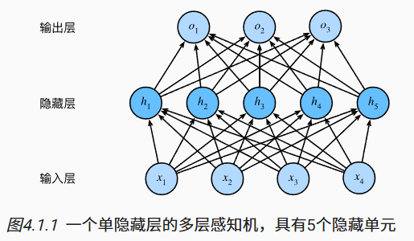
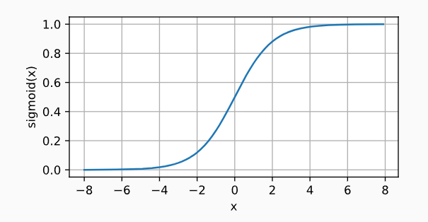
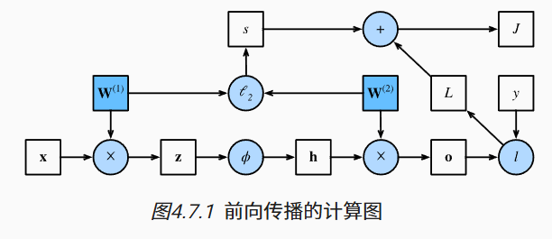

# 4.多层感知机

## 4.1 多层感知机

### 4.1.1 隐藏层

我们可以把前L−1层看作表示，把最后一层看作线性预测器。 这种架构通常称为*多层感知机*（multilayer perceptron），通常缩写为*MLP*。



### 4.1.2 激活函数

*激活函数*（activation function）通过计算加权和并加上偏置来确定神经元是否应该被激活， 它们将输入信号转换为输出的可微运算。

 大多数激活函数都是非线性的。

#### 4.1.2.1 ReLU函数

最受欢迎的激活函数是*修正线性单元*（Rectified linear unit，*ReLU*）


ReLU函数的导数


#### 4.1.2.2 sigmoid函数

对于一个定义域在R中的输入， *sigmoid函数*将输入变换为区间(0, 1)上的输出。

因此，sigmoid通常称为*挤压函数*（squashing function）： 它将范围（-inf, inf）中的任意输入压缩到区间（0, 1）中的某个值：




sigmoid函数的导数图像如下所示


#### 4.1.2.3 tanh函数

与sigmoid函数类似， tanh(双曲正切)函数也能将其输入压缩转换到区间(-1, 1)上


tanh函数的导数图像如下所示


### 4.1.3 小结

- 多层感知机在输出层和输入层之间增加一个或多个全连接隐藏层，并通过激活函数转换隐藏层的输出。
- 常用的激活函数包括ReLU函数、sigmoid函数和tanh函数。


## 4.2 多层感知机的从零开始实现

## 4.4 模型选择、欠拟合和过拟合

将模型在训练数据上拟合的比在潜在分布中更接近的现象称为*过拟合*（overfitting）， **用于对抗过拟合的技术称为*正则化*（regularization）。**

### 4.4.1 训练误差和泛化误差

*训练误差*（training error）是指， 模型在训练数据集上计算得到的误差。

 *泛化误差*（generalization error）是指， 模型应用在同样从原始样本的分布中抽取的无限多数据样本时，模型误差的期望。

#### 4.4.1.1 统计学习理论

当我们训练模型时，我们试图找到一个能够尽可能拟合训练数据的函数。 但是如果它执行地“太好了”，而不能对看不见的数据做到很好泛化，就会导致过拟合。 这种情况正是我们想要避免或控制的。 深度学习中有许多启发式的技术旨在防止过拟合。

#### 4.4.1.2 模型复杂性

当我们有简单的模型和大量的数据时，我们期望泛化误差与训练误差相近。

 当我们有更复杂的模型和更少的样本时，我们预计训练误差会下降，但泛化误差会增大。

本节为了给出一些直观的印象，我们将重点介绍几个倾向于影响模型泛化的因素。

1. 可调整参数的数量。当可调整参数的数量（有时称为*自由度*）很大时，模型往往更容易过拟合。
2. 参数采用的值。当权重的取值范围较大时，模型可能更容易过拟合。
3. 训练样本的数量。即使模型很简单，也很容易过拟合只包含一两个样本的数据集。而过拟合一个有数百万个样本的数据集则需要一个极其灵活的模型。

### 4.4.2 模型选择

#### 4.4.2.1 验证集

解决此问题的常见做法是将我们的数据分成三份， 除了训练和测试数据集之外，还增加一个*验证数据集*（validation dataset）， 也叫*验证集*（validation set）。

#### 4.4.2.2 K折交叉验证

原始训练数据被分成K个不重叠的子集。 然后执行K次模型训练和验证，每次在K−1个子集上进行训练， 并在剩余的一个子集（在该轮中没有用于训练的子集）上进行验证。 最后，通过对K次实验的结果取平均来估计训练和验证误差。

### 4.4.3 欠拟合还是过拟合？

当我们比较训练和验证误差时，我们要注意两种常见的情况。 

+ 首先，我们要注意这样的情况：训练误差和验证误差都很严重， 但它们之间仅有一点差距。 如果模型不能降低训练误差，这可能意味着模型过于简单（即表达能力不足）， 无法捕获试图学习的模式。 此外，由于我们的训练和验证误差之间的*泛化误差*很小， 我们有理由相信可以用一个更复杂的模型降低训练误差。 这种现象被称为***欠拟合*（underfitting）**。
+ 另一方面，当我们的训练误差明显低于验证误差时要小心， 这表明严重的***过拟合*（overfitting）**。 注意，*过拟合*并不总是一件坏事。 特别是在深度学习领域，众所周知， 最好的预测模型在训练数据上的表现往往比在保留（验证）数据上好得多。 最终，我们通常更关心验证误差，而不是训练误差和验证误差之间的差距。

是否过拟合或欠拟合可能取决于模型复杂性和可用训练数据集的大小， 这两个点将在下面进行讨论。

#### 4.4.3.1 模型复杂性


#### 4.4.3.2 数据集大小

训练数据集中的样本越少，我们就越有可能（且更严重地）过拟合。

随着训练数据量的增加，泛化误差通常会减小。

### 4.4.4 多项式回归


### 4.4.5 小结

- 欠拟合是指模型无法继续减少训练误差。过拟合是指训练误差远小于验证误差。
- 由于不能基于训练误差来估计泛化误差，因此简单地最小化训练误差并不一定意味着泛化误差的减小。机器学习模型需要注意防止过拟合，即防止泛化误差过大。
- 验证集可以用于模型选择，但不能过于随意地使用它。
- 我们应该选择一个复杂度适当的模型，避免使用数量不足的训练样本。

## 4.5 权重衰减

限制特征的数量是缓解过拟合的一种常用技术。 然而，简单地丢弃特征对这项工作来说可能过于生硬。 

在训练参数化机器学习模型时， *权重衰减*（weight decay）是最广泛使用的正则化的技术之一， 它通常也被称为L2*正则化*。 

此外，为什么我们首先使用L2范数，而不是L1范数。 事实上，这个选择在整个统计领域中都是有效的和受欢迎的。 L2正则化线性模型构成经典的*岭回归*（ridge regression）算法， L1正则化线性回归是统计学中类似的基本模型， 通常被称为*套索回归*（lasso regression）。 使用L2范数的一个原因是它对权重向量的大分量施加了巨大的惩罚。 这使得我们的学习算法偏向于在大量特征上均匀分布权重的模型。 在实践中，这可能使它们对单个变量中的观测误差更为稳定。 相比之下，L1惩罚会导致模型将权重集中在一小部分特征上， 而将其他权重清除为零。 这称为*特征选择*（feature selection），这可能是其他场景下需要的。

### 4.5.1 高维线性回归

### 4.5.4 小结

- 正则化是处理过拟合的常用方法：在训练集的损失函数中加入惩罚项，以降低学习到的模型的复杂度。
- 保持模型简单的一个特别的选择是使用L2惩罚的权重衰减。这会导致学习算法更新步骤中的权重衰减。
- 权重衰减功能在深度学习框架的优化器中提供。
- 在同一训练代码实现中，不同的参数集可以有不同的更新行为。

## 4.6 暂退法（Dropout）

### 4.6.1重新审视过拟合

当面对更多的特征而样本不足时，线性模型往往会过拟合。相反，当给出更多样本而不是特征，通常线性模型不会过拟合。

泛化性和灵活性之间的这种基本权衡被描述为*偏差-方差权衡*（bias-variance tradeoff）。 线性模型有很高的偏差：它们只能表示一小类函数。 然而，这些模型的方差很低：它们在不同的随机数据样本上可以得出相似的结果。

深度神经网络位于偏差-方差谱的另一端。 与线性模型不同，神经网络并不局限于单独查看每个特征，而是学习特征之间的交互。 

### 4.6.2 扰动的稳健性

 在训练过程中，他们建议在计算后续层之前向网络的每一层注入噪声。 因为当训练一个有多层的深层网络时，注入噪声只会在输入-输出映射上增强平滑性。这个想法被称为*暂退法*（dropout）。

 暂退法在前向传播过程中，计算每一内部层的同时注入噪声，这已经成为训练神经网络的常用技术。

在整个训练过程的每一次迭代中，标准暂退法包括在计算下一层之前将当前层中的一些节点置零。

### 4.6.3 实践中的暂退法

### 4.6.5 简洁实现

对于深度学习框架的高级API，我们只需在每个全连接层之后添加一个`Dropout`层， 将暂退概率作为唯一的参数传递给它的构造函数。 在训练时，`Dropout`层将根据指定的暂退概率随机丢弃上一层的输出（相当于下一层的输入）。 在测试时，`Dropout`层仅传递数据。

```python
net = nn.Sequential(nn.Flatten(),
        nn.Linear(784, 256),
        nn.ReLU(),
        # 在第一个全连接层之后添加一个dropout层
        nn.Dropout(dropout1),
        nn.Linear(256, 256),
        nn.ReLU(),
        # 在第二个全连接层之后添加一个dropout层
        nn.Dropout(dropout2),
        nn.Linear(256, 10))

def init_weights(m):
    if type(m) == nn.Linear:
        nn.init.normal_(m.weight, std=0.01)

net.apply(init_weights);
```

### 4.6.6 小结

- 暂退法在前向传播过程中，计算每一内部层的同时丢弃一些神经元。
- 暂退法可以避免过拟合，它通常与控制权重向量的维数和大小结合使用的。
- 暂退法将活性值h替换为具有期望值h的随机变量。
- 暂退法仅在训练期间使用。

## 4.7 前向传播、反向传播和计算图

### 4.7.1 前向传播

*前向传播*（forward propagation或forward pass） 指的是：按顺序（从输入层到输出层）计算和存储神经网络中每层的结果。

### 4.7.2 前向传播计算图



### 4.7.3 反向传播

*反向传播*（backward propagation或backpropagation）指的是计算神经网络参数梯度的方法。

该方法根据微积分中的*链式规则*，按相反的顺序从输出层到输入层遍历网络。 该算法存储了计算某些参数梯度时所需的任何中间变量（偏导数）。

### 4.7.4 训练神经网络

在训练神经网络时，前向传播和反向传播相互依赖。 对于前向传播，我们沿着依赖的方向遍历计算图并计算其路径上的所有变量。 然后将这些用于反向传播，其中计算顺序与计算图的相反。

因此，在训练神经网络时，在初始化模型参数后， 我们交替使用前向传播和反向传播，利用反向传播给出的梯度来更新模型参数。 注意，反向传播重复利用前向传播中存储的中间值，以避免重复计算。

带来的影响之一是我们需要保留中间值，直到反向传播完成。 这也是训练比单纯的预测需要更多的内存（显存）的原因之一。 此外，这些中间值的大小与网络层的数量和批量的大小大致成正比。 因此，使用更大的批量来训练更深层次的网络更容易导致*内存不足*（out of memory）错误。

### 4.7.5 小结

- 前向传播在神经网络定义的计算图中按顺序计算和存储中间变量，它的顺序是从输入层到输出层。
- 反向传播按相反的顺序（从输出层到输入层）计算和存储神经网络的中间变量和参数的梯度。
- 在训练深度学习模型时，前向传播和反向传播是相互依赖的。
- 训练比预测需要更多的内存。

## 4.8 数值稳定性和模型初始化

### 4.8.1 梯度消失和梯度爆炸

不稳定梯度带来的风险不止在于数值表示； 不稳定梯度也威胁到我们优化算法的稳定性。 我们可能面临一些问题。

 要么是*梯度爆炸*（gradient exploding）问题： 参数更新过大，破坏了模型的稳定收敛； 

要么是*梯度消失*（gradient vanishing）问题： 参数更新过小，在每次更新时几乎不会移动，导致模型无法学习。

#### 4.8.1.1 梯度消失

当sigmoid函数的输入很大或是很小时，它的梯度都会消失。

因此，更稳定的ReLU系列函数已经成为从业者的默认选择


#### 4.8.1.2 梯度爆炸

#### 4.8.1.3 打破对称性

神经网络设计中的另一个问题是其参数化所固有的对称性。 

### 4.8.2 参数初始化

解决（或至少减轻）上述问题的一种方法是进行参数初始化， 优化期间的注意和适当的正则化也可以进一步提高稳定性。

#### 4.8.2.1 默认初始化

如果我们不指定初始化方法， 框架将使用默认的随机初始化方法，对于中等难度的问题，这种方法通常很有效。

#### 4.8.2.2 Xavier初始化

### 4.8.3 小结

- 梯度消失和梯度爆炸是深度网络中常见的问题。在参数初始化时需要非常小心，以确保梯度和参数可以得到很好的控制。
- 需要用启发式的初始化方法来确保初始梯度既不太大也不太小。
- ReLU激活函数缓解了梯度消失问题，这样可以加速收敛。
- 随机初始化是保证在进行优化前打破对称性的关键。
- Xavier初始化表明，对于每一层，输出的方差不受输入数量的影响，任何梯度的方差不受输出数量的影响。

## 4.9 环境与分布偏移

### 4.9.1 分布偏移的类型

#### 4.9.1.1 协变量偏移

虽然输入的分布可能随时间而改变， 但标签函数（即条件分布P(y∣x)）没有改变。 统计学家称之为*协变量偏移*（covariate shift）， 因为这个问题是由于协变量（特征）分布的变化而产生的。

#### 4.9.1.2 标签偏移

*标签偏移*（label shift）描述了与协变量偏移相反的问题。 这里我们假设标签边缘概率P(y)可以改变， 但是类别条件分布P(x∣y)在不同的领域之间保持不变。 

#### 4.9.1.3 概念偏移

我们也可能会遇到*概念偏移*（concept shift）： 当标签的定义发生变化时，就会出现这种问题。

### 4.9.2 分布偏移示例

### 4.9.4 学习问题的分类法

#### 4.9.4.1. 批量学习

在*批量学习*（batch learning）中，我们可以访问一组训练特征和标签 {(x1,y1),…,(xn,yn)}， 我们使用这些特性和标签训练f(x)。 然后，我们部署此模型来对来自同一分布的新数据(x,y)进行评分。 

这个系统会被安装在客户家中，基本再也不会更新

#### 4.9.4.2. 在线学习

换句话说，在*在线学习*（online learning）中，我们有以下的循环。 在这个循环中，给定新的观测结果，我们会不断地改进我们的模型。

#### 4.9.4.3. 老虎机

*老虎机*（bandits）是上述问题的一个特例。

 我们之所以列出它，主要是因为这个问题经常被视为一个单独的学习问题的情景。

#### 4.9.4.4. 控制

#### 4.9.4.5. 强化学习

#### 4.9.4.6. 考虑到环境

### 4.9.6 小结

- 在许多情况下，训练集和测试集并不来自同一个分布。这就是所谓的分布偏移。
- 真实风险是从真实分布中抽取的所有数据的总体损失的预期。然而，这个数据总体通常是无法获得的。经验风险是训练数据的平均损失，用于近似真实风险。在实践中，我们进行经验风险最小化。
- 在相应的假设条件下，可以在测试时检测并纠正协变量偏移和标签偏移。在测试时，不考虑这种偏移可能会成为问题。
- 在某些情况下，环境可能会记住自动操作并以令人惊讶的方式做出响应。在构建模型时，我们必须考虑到这种可能性，并继续监控实时系统，并对我们的模型和环境以意想不到的方式纠缠在一起的可能性持开放态度。


