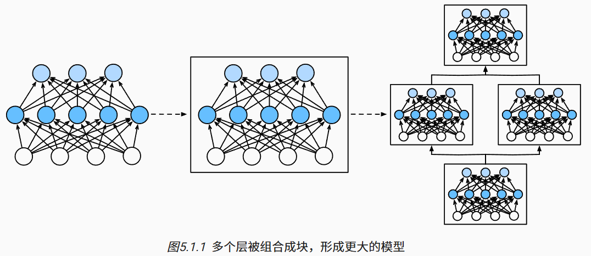

# 5.深度学习计算

## 5.1 层和块

为了实现这些复杂的网络，我们引入了神经网络*块*的概念。 *块*（block）可以描述单个层、由多个层组成的组件或整个模型本身。 使用块进行抽象的一个好处是可以将一些块组合成更大的组件， 这一过程通常是递归的，如所示。 通过定义代码来按需生成任意复杂度的块， 我们可以通过简洁的代码实现复杂的神经网络。



### 5.1.1 自定义块

1. 将输入数据作为其前向传播函数的参数。
2. 通过前向传播函数来生成输出。请注意，输出的形状可能与输入的形状不同。例如，我们上面模型中的第一个全连接的层接收一个20维的输入，但是返回一个维度为256的输出。
3. 计算其输出关于输入的梯度，可通过其反向传播函数进行访问。通常这是自动发生的。
4. 存储和访问前向传播计算所需的参数。
5. 根据需要初始化模型参数。

块的一个主要优点是它的多功能性。 我们可以子类化块以创建层（如全连接层的类）、 整个模型（如上面的`MLP`类）或具有中等复杂度的各种组件。 

### 5.1.2 顺序块

为了构建我们自己的简化的`MySequential`， 我们只需要定义两个关键函数：

1. 一种将块逐个追加到列表中的函数；
2. 一种前向传播函数，用于将输入按追加块的顺序传递给块组成的“链条”。

### 5.1.3 在前向传播函数中执行代码

然而，有时我们可能希望合并既不是上一层的结果也不是可更新参数的项， 我们称之为*常数参数*（constant parameter）。

### 5.1.5 小结

- 一个块可以由许多层组成；一个块可以由许多块组成。
- 块可以包含代码。
- 块负责大量的内部处理，包括参数初始化和反向传播。
- 层和块的顺序连接由`Sequential`块处理。

## 5.2 参数管理

在选择了架构并设置了超参数后，我们就进入了训练阶段。 此时，我们的目标是找到使损失函数最小化的模型参数值。 经过训练后，我们将需要使用这些参数来做出未来的预测。

本节，我们将介绍以下内容：

- 访问参数，用于调试、诊断和可视化；
- 参数初始化；
- 在不同模型组件间共享参数。

### 5.2.1 参数访问

我们从已有模型中访问参数。

#### 5.2.1.1 目标函数

#### 5.2.1.2 一次访问所有参数

#### 5.2.1.3 从嵌套块收集参数

### 5.2.2 参数初始化

深度学习框架提供默认随机初始化， 也允许我们创建自定义初始化方法， 满足我们通过其他规则实现初始化权重。

默认情况下，PyTorch会根据一个范围均匀地初始化权重和偏置矩阵， 这个范围是根据输入和输出维度计算出的。 PyTorch的`nn.init`模块提供了多种预置初始化方法。

#### 5.2.2.1 内置初始化

#### 5.2.2.2 自定义初始化

### 5.2.3 参数绑定

有时我们希望在多个层间共享参数： 我们可以定义一个稠密层，然后使用它的参数来设置另一个层的参数。

### 5.2.4 小结

- 我们有几种方法可以访问、初始化和绑定模型参数。
- 我们可以使用自定义初始化方法。

## 5.3 延后初始化

到目前为止，我们忽略了建立网络时需要做的以下这些事情：

- 我们定义了网络架构，但没有指定输入维度。
- 我们添加层时没有指定前一层的输出维度。
- 我们在初始化参数时，甚至没有足够的信息来确定模型应该包含多少参数。

这里的诀窍是框架的*延后初始化*（defers initialization）， 即直到数据第一次通过模型传递时，框架才会动态地推断出每个层的大小。

### 5.3.2 小结

- 延后初始化使框架能够自动推断参数形状，使修改模型架构变得容易，避免了一些常见的错误。
- 我们可以通过模型传递数据，使框架最终初始化参数。

## 5.4 自定义层

深度学习成功背后的一个因素是神经网络的灵活性： 我们可以用创造性的方式组合不同的层，从而设计出适用于各种任务的架构。 

### 5.4.1 不带参数的层

### 5.4.2 带参数的层

以上我们知道了如何定义简单的层，下面我们继续定义具有参数的层， 这些参数可以通过训练进行调整。 我们可以使用内置函数来创建参数，这些函数提供一些基本的管理功能。 比如管理访问、初始化、共享、保存和加载模型参数。 这样做的好处之一是：我们不需要为每个自定义层编写自定义的序列化程序。

### 5.4.3 小结

- 我们可以通过基本层类设计自定义层。这允许我们定义灵活的新层，其行为与深度学习框架中的任何现有层不同。
- 在自定义层定义完成后，我们就可以在任意环境和网络架构中调用该自定义层。
- 层可以有局部参数，这些参数可以通过内置函数创建。

## 5.5 读写文件

如何加载和存储权重向量和整个模型了。

### 5.5.1 加载和保存张量

对于单个张量，我们可以直接调用`load`和`save`函数分别读写它们。 这两个函数都要求我们提供一个名称，`save`要求将要保存的变量作为输入。

### 5.5.2 加载和保存模型参数

保存单个权重向量（或其他张量）确实有用， 但是如果我们想保存整个模型，并在以后加载它们， 单独保存每个向量则会变得很麻烦。 毕竟，我们可能有数百个参数散布在各处。 因此，深度学习框架提供了内置函数来保存和加载整个网络。 需要注意的一个重要细节是，这将保存模型的参数而不是保存整个模型。 例如，如果我们有一个3层多层感知机，我们需要单独指定架构。 因为模型本身可以包含任意代码，所以模型本身难以序列化。 因此，为了恢复模型，我们需要用代码生成架构， 然后从磁盘加载参数。 让我们从熟悉的多层感知机开始尝试一下。

```python
# 定义网络模型
class MLP(nn.Module):
    def __init__(self):
        super().__init__()
        self.hidden = nn.Linear(20, 256)
        self.output = nn.Linear(256, 10)

    def forward(self, x):
        return self.output(F.relu(self.hidden(x)))

net = MLP()
X = torch.randn(size=(2, 20))
Y = net(X)

# 将模型的参数存储在一个叫做“mlp.params”的文件中。
torch.save(net.state_dict(), 'mlp.params')

# 为了恢复模型，我们实例化了原始多层感知机模型的一个备份。 这里我们不需要随机初始化模型参数，而是直接读取文件中存储的参数。
clone = MLP()
clone.load_state_dict(torch.load('mlp.params'))
clone.eval()
```

### 5.5.3 小结

- `save`和`load`函数可用于张量对象的文件读写。
- 我们可以通过参数字典保存和加载网络的全部参数。
- 保存架构必须在代码中完成，而不是在参数中完成。

## 5.6 GPU

### 5.6.1 计算设备

我们可以指定用于存储和计算的设备，如CPU和GPU。 默认情况下，张量是在内存中创建的，然后使用CPU计算它。

```python
import torch
from torch import nn

torch.device('cpu'), torch.device('cuda'), torch.device('cuda:1')
```

### 5.6.2. 张量与GPU

#### 5.6.2.1. 存储在GPU上

#### 5.6.2.2. 复制

#### 5.6.2.3. 旁注

### 5.6.3. 神经网络与GPU

### 5.6.4. 小结

- 我们可以指定用于存储和计算的设备，例如CPU或GPU。默认情况下，数据在主内存中创建，然后使用CPU进行计算。
- 深度学习框架要求计算的所有输入数据都在同一设备上，无论是CPU还是GPU。
- 不经意地移动数据可能会显著降低性能。一个典型的错误如下：计算GPU上每个小批量的损失，并在命令行中将其报告给用户（或将其记录在NumPy `ndarray`中）时，将触发全局解释器锁，从而使所有GPU阻塞。最好是为GPU内部的日志分配内存，并且只移动较大的日志。

