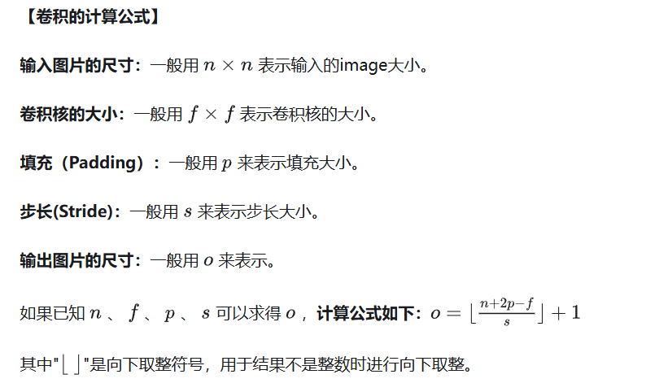
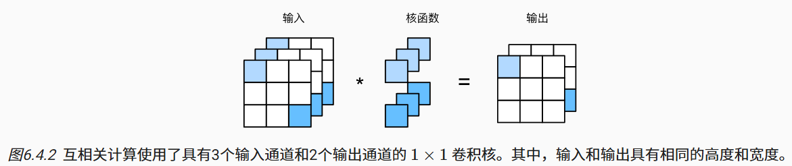
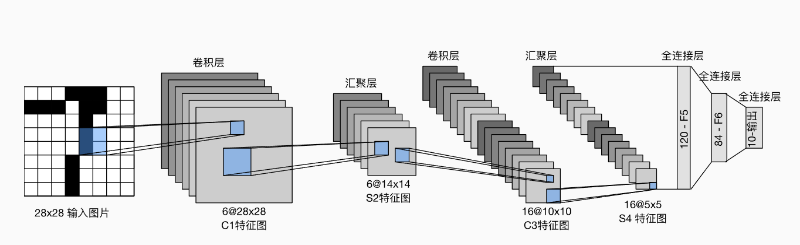
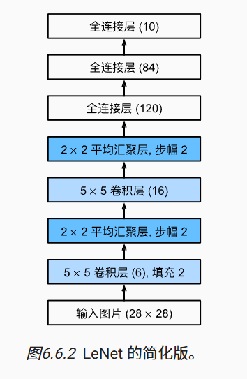
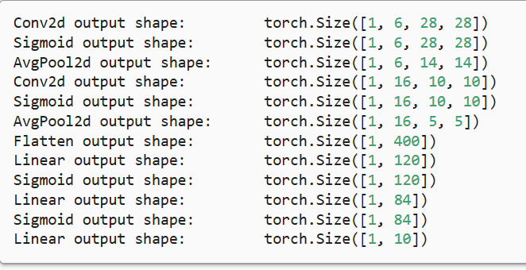

# 6.卷积神经网络

## 6.1 从全连接层到卷积

*卷积神经网络*（convolutional neural networks，CNN）是机器学习利用自然图像中一些已知结构的创造性方法。

### 6.1.1 不变性

卷积神经网络正是将*空间不变性*（spatial invariance）的这一概念系统化，从而基于这个模型使用较少的参数来学习有用的表示。

1. *平移不变性*（translation invariance）：不管检测对象出现在图像中的哪个位置，神经网络的前面几层应该对相同的图像区域具有相似的反应，即为“平移不变性”。
2. *局部性*（locality）：神经网络的前面几层应该只探索输入图像中的局部区域，而不过度在意图像中相隔较远区域的关系，这就是“局部性”原则。最终，可以聚合这些局部特征，以在整个图像级别进行预测。

### 6.1.2 多层感知机的限制

#### 6.1.2.1. 平移不变性

#### 6.1.2.2. 局部性

### 6.1.3 卷积

### 6.1.4. “沃尔多在哪里”回顾

#### 6.1.4.1. 通道

### 6.1.5 小结

- 图像的平移不变性使我们以相同的方式处理局部图像，而不在乎它的位置。
- 局部性意味着计算相应的隐藏表示只需一小部分局部图像像素。
- 在图像处理中，卷积层通常比全连接层需要更少的参数，但依旧获得高效用的模型。
- 卷积神经网络（CNN）是一类特殊的神经网络，它可以包含多个卷积层。
- 多个输入和输出通道使模型在每个空间位置可以获取图像的多方面特征。

## 6.2 图像卷积

### 6.2.1 互相关运算

严格来说，卷积层是个错误的叫法，因为它所表达的运算其实是*互相关运算*（cross-correlation），而不是卷积运算。

### 6.2.2 卷积层

卷积层对输入和卷积核权重进行互相关运算，并在添加标量偏置之后产生输出。

### 6.2.3. 图像中目标的边缘检测

### 6.2.4. 学习卷积核

### 6.2.5. 互相关和卷积

### 6.2.6. 特征映射和感受野

 在卷积神经网络中，对于某一层的任意元素x，其*感受野*（receptive field）是指在前向传播期间可能影响x计算的所有元素（来自所有先前层）。

### 6.2.7. 小结

- 二维卷积层的核心计算是二维互相关运算。最简单的形式是，对二维输入数据和卷积核执行互相关操作，然后添加一个偏置。
- 我们可以设计一个卷积核来检测图像的边缘。
- 我们可以从数据中学习卷积核的参数。
- 学习卷积核时，无论用严格卷积运算或互相关运算，卷积层的输出不会受太大影响。
- 当需要检测输入特征中更广区域时，我们可以构建一个更深的卷积网络。

## 6.3 填充和步幅

### 6.3.1. 填充

卷积神经网络中卷积核的高度和宽度通常为奇数，例如1、3、5或7。 选择奇数的好处是，保持空间维度的同时，我们可以在顶部和底部填充相同数量的行，在左侧和右侧填充相同数量的列。

### 6.3.2. 步幅

我们将每次滑动元素的数量称为*步幅*（stride）。

### 6.3.3. 小结

- 填充可以增加输出的高度和宽度。这常用来使输出与输入具有相同的高和宽。
- 步幅可以减小输出的高和宽，例如输出的高和宽仅为输入的高和宽的1/n（n是一个大于1的整数）。
- 填充和步幅可用于有效地调整数据的维度。



## 6.4 多输入多输出通道

### 6.4.1. 多输入通道

### 6.4.2. 多输出通道

### 6.4.3. 1×1 卷积层

因为使用了最小窗口，1×1卷积失去了卷积层的特有能力——在高度和宽度维度上，识别相邻元素间相互作用的能力。 其实1×1卷积的唯一计算发生在通道上。

使用1×1卷积核与3个输入通道和2个输出通道的互相关计算。 这里输入和输出具有相同的高度和宽度，输出中的每个元素都是从输入图像中同一位置的元素的线性组合。 我们可以将1×1卷积层看作在每个像素位置应用的全连接层，以ci个输入值转换为co个输出值。 因为这仍然是一个卷积层，所以跨像素的权重是一致的。 同时，1×1卷积层需要的权重维度为co×ci，再额外加上一个偏置。



### 6.4.4. 小结

- 多输入多输出通道可以用来扩展卷积层的模型。
- 当以每像素为基础应用时，1×1卷积层相当于全连接层。
- **1×1卷积层通常用于调整网络层的通道数量和控制模型复杂性。**

## 6.5. 汇聚层

本节将介绍*汇聚*（pooling）层，它具有双重目的：降低卷积层对位置的敏感性，同时降低对空间降采样表示的敏感性。

### 6.5.1. 最大汇聚层和平均汇聚层

我们通常计算汇聚窗口中所有元素的最大值或平均值。这些操作分别称为*最大汇聚层*（maximum pooling）和*平均汇聚层*（average pooling）。

### 6.5.2. 填充和步幅

### 6.5.3. 多个通道

### 6.5.4. 小结

- 对于给定输入元素，最大汇聚层会输出该窗口内的最大值，平均汇聚层会输出该窗口内的平均值。
- 汇聚层的主要优点之一是减轻卷积层对位置的过度敏感。
- 我们可以指定汇聚层的填充和步幅。
- 使用最大汇聚层以及大于1的步幅，可减少空间维度（如高度和宽度）。
- 汇聚层的输出通道数与输入通道数相同。

## 6.6. 卷积神经网络（LeNet）

本节将介绍LeNet，它是最早发布的卷积神经网络之一，因其在计算机视觉任务中的高效性能而受到广泛关注。 

总体来看，LeNet（LeNet-5）由两个部分组成：

- 卷积编码器：由两个卷积层组成;
- 全连接层密集块：由三个全连接层组成。

该架构如图所示：



每个卷积块中的基本单元是一个卷积层、一个sigmoid激活函数和平均汇聚层。

```python
import torch
from torch import nn
from d2l import torch as d2l

net = nn.Sequential(
    nn.Conv2d(1, 6, kernel_size=5, padding=2), nn.Sigmoid(),
    nn.AvgPool2d(kernel_size=2, stride=2),
    nn.Conv2d(6, 16, kernel_size=5), nn.Sigmoid(),
    nn.AvgPool2d(kernel_size=2, stride=2),
    nn.Flatten(),
    nn.Linear(16 * 5 * 5, 120), nn.Sigmoid(),
    nn.Linear(120, 84), nn.Sigmoid(),
    nn.Linear(84, 10))
```



```python
X = torch.rand(size=(1, 1, 28, 28), dtype=torch.float32)
for layer in net:
    X = layer(X)
    print(layer.__class__.__name__,'output shape: \t',X.shape)
```



### 6.6.2. 模型训练

### 6.6.3. 小结

- 卷积神经网络（CNN）是一类使用卷积层的网络。
- 在卷积神经网络中，我们组合使用卷积层、非线性激活函数和汇聚层。
- 为了构造高性能的卷积神经网络，我们通常对卷积层进行排列，逐渐降低其表示的空间分辨率，同时增加通道数。
- 在传统的卷积神经网络中，卷积块编码得到的表征在输出之前需由一个或多个全连接层进行处理。
- LeNet是最早发布的卷积神经网络之一。


