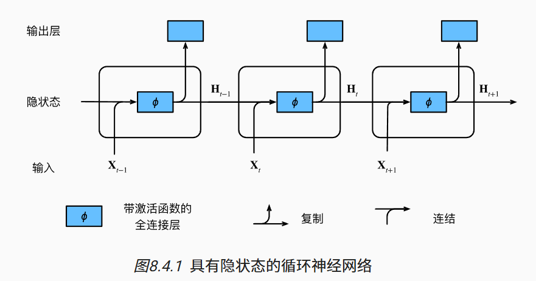
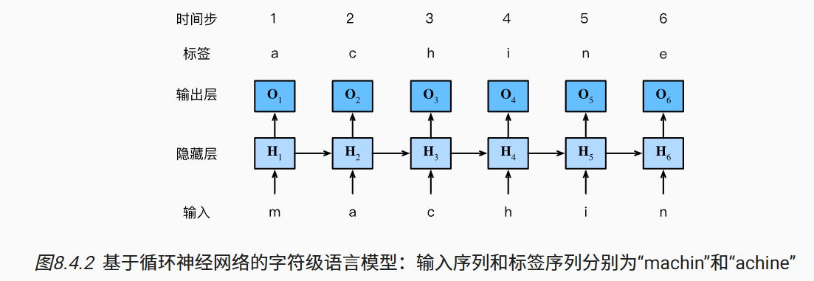

# 8.循环神经网络

简言之，如果说卷积神经网络可以有效地处理空间信息， 那么本章的*循环神经网络*（recurrent neural network，RNN）则可以更好地处理序列信息。 循环神经网络通过引入状态变量存储过去的信息和当前的输入，从而可以确定当前的输出。

许多使用循环网络的例子都是基于文本数据的，因此我们将在本章中重点介绍语言模型。

# 8.1. 序列模型

## 8.1.1. 统计工具

### 8.1.1.1. 自回归模型

第一种策略，假设在现实情况下相当长的序列 xt−1,…,x1可能是不必要的， 因此我们只需要满足某个长度为τ的时间跨度， 即使用观测序列xt−1,…,xt−τ。 当下获得的最直接的好处就是参数的数量总是不变的， 至少在t>τ时如此，这就使我们能够训练一个上面提及的深度网络。 这种模型被称为*自回归模型*（autoregressive models）， 因为它们是对自己执行回归。

第二种策略，如 [图8.1.2](https://zh.d2l.ai/chapter_recurrent-neural-networks/sequence.html#fig-sequence-model)所示， 是保留一些对过去观测的总结ht， 并且同时更新预测x^t和总结ht。 这就产生了基于x^t=P(xt∣ht)估计xt， 以及公式ht=g(ht−1,xt−1)更新的模型。 由于ht从未被观测到，这类模型也被称为 ***隐变量自回归模型*（**latent autoregressive models）。

### 8.1.1.2. 马尔可夫模型

### 8.1.1.3. 因果关系

## 8.1.2. 训练

## 8.1.3. 预测

首先是检查模型预测下一个时间步的能力， 也就是*单步预测*（one-step-ahead prediction）。

通常，对于直到xt的观测序列，其在时间步t+k处的预测输出x^t+k 称为k*步预测*（k-step-ahead-prediction）。

## 8.1.4. 小结

- 内插法（在现有观测值之间进行估计）和外推法（对超出已知观测范围进行预测）在实践的难度上差别很大。因此，对于所拥有的序列数据，在训练时始终要尊重其时间顺序，即最好不要基于未来的数据进行训练。
- 序列模型的估计需要专门的统计工具，两种较流行的选择是自回归模型和隐变量自回归模型。
- 对于时间是向前推进的因果模型，正向估计通常比反向估计更容易。
- 对于直到时间步t的观测序列，其在时间步t+k的预测输出是“k步预测”。随着我们对预测时间k值的增加，会造成误差的快速累积和预测质量的极速下降。

# 8.2. 文本预处理

我们将解析文本的常见预处理步骤。 这些步骤通常包括：

1. 将文本作为字符串加载到内存中。
2. 将字符串拆分为词元（如单词和字符）。
3. 建立一个词表，将拆分的词元映射到数字索引。
4. 将文本转换为数字索引序列，方便模型操作。

## 8.2.1. 读取数据集

## 8.2.2. 词元化

*词元*（token）是文本的基本单位

## 8.2.3. 词表

我们构建一个字典，通常也叫做***词表*（vocabulary）**

我们先将训练集中的所有文档合并在一起，对它们的唯一词元进行统计， 得到的统计结果称之为***语料*（corpus）**。然后根据每个唯一词元的出现频率，为其分配一个数字索引。 很少出现的词元通常被移除，这可以降低复杂性。 

语料库中不存在或已删除的任何词元都将映射到一个特定的未知词元“<unk>”。

我们可以选择增加一个列表，用于保存那些被保留的词元， 例如：填充词元（“<pad>”）； 序列开始词元（“<bos>”）； 序列结束词元（“<eos>”）。

## 8.2.4. 整合所有功能

在使用上述函数时，我们将所有功能打包到`load_corpus_time_machine`函数中， 该函数返回`corpus`（词元索引列表）和`vocab`（时光机器语料库的词表）。 我们在这里所做的改变是：

1. 为了简化后面章节中的训练，我们使用字符（而不是单词）实现文本词元化；
2. 时光机器数据集中的每个文本行不一定是一个句子或一个段落，还可能是一个单词，因此返回的`corpus`仅处理为单个列表，而不是使用多词元列表构成的一个列表。

## 8.2.5. 小结

- 文本是序列数据的一种最常见的形式之一。
- 为了对文本进行预处理，我们通常将文本拆分为词元，构建词表将词元字符串映射为数字索引，并将文本数据转换为词元索引以供模型操作。

# 8.3. 语言模型和数据集

## 8.3.1. 学习语言模型

## 8.3.2. 马尔可夫模型与n元语法

通常，涉及一个、两个和三个变量的概率公式分别被称为 *一元语法*（unigram）、*二元语法*（bigram）和*三元语法*（trigram）模型。

## 8.3.3. 自然语言统计

正如我们所看到的，最流行的词看起来很无聊， 这些词通常被称为***停用词***（stop words）

1. 除了一元语法词，单词序列似乎也遵循齐普夫定律， 尽管公式 [(8.3.7)](https://zh.d2l.ai/chapter_recurrent-neural-networks/language-models-and-dataset.html#equation-eq-zipf-law)中的指数α更小 （指数的大小受序列长度的影响）；
2. 词表中n元组的数量并没有那么大，这说明语言中存在相当多的结构， 这些结构给了我们应用模型的希望；
3. 很多n元组很少出现，这使得拉普拉斯平滑非常不适合语言建模。 作为代替，我们将使用基于深度学习的模型。

## 8.3.4. 读取长序列数据

因此，我们可以从随机偏移量开始划分序列， 以同时获得*覆盖性*（coverage）和*随机性*（randomness）。 下面，我们将描述如何实现*随机采样*（random sampling）和 *顺序分区*（sequential partitioning）策略。

### 8.3.4.1. 随机采样

### 8.3.4.2. 顺序分区

## 8.3.5. 小结

- 语言模型是自然语言处理的关键。
- n元语法通过截断相关性，为处理长序列提供了一种实用的模型。
- 长序列存在一个问题：它们很少出现或者从不出现。
- 齐普夫定律支配着单词的分布，这个分布不仅适用于一元语法，还适用于其他n元语法。
- 通过拉普拉斯平滑法可以有效地处理结构丰富而频率不足的低频词词组。
- 读取长序列的主要方式是随机采样和顺序分区。在迭代过程中，后者可以保证来自两个相邻的小批量中的子序列在原始序列上也是相邻的。

# 8.4. 循环神经网络

*循环神经网络*（recurrent neural networks，RNNs） 是具有隐状态的神经网络。

## 8.4.1. 无隐状态的神经网络

## 8.4.2. 有隐状态的循环神经网络

当前时间步隐藏变量由当前时间步的输入 与前一个时间步的隐藏变量一起计算得出：

基于循环计算的隐状态神经网络被命名为 *循环神经网络*（recurrent neural network）。

循环神经网络的参数开销不会随着时间步的增加而增加。

 在任意时间步t，隐状态的计算可以被视为：

1. 拼接当前时间步t的输入Xt和前一时间步t−1的隐状态Ht−1；
2. 将拼接的结果送入带有激活函数ϕ的全连接层。 全连接层的输出是当前时间步t的隐状态Ht。

## 8.4.3. 基于循环神经网络的字符级语言模型

使用 *字符级语言模型*（character-level language model）， 将文本词元化为字符而不是单词。演示了 如何通过基于字符级语言建模的循环神经网络， 使用当前的和先前的字符预测下一个字符。

在训练过程中，我们对每个时间步的输出层的输出进行softmax操作， 然后利用交叉熵损失计算模型输出和标签之间的误差。 

## 8.4.4. 困惑度（Perplexity）

困惑度的最好的理解是“下一个词元的实际选择数的调和平均数”。 

- 在最好的情况下，模型总是完美地估计标签词元的概率为1。 在这种情况下，模型的困惑度为1。
- 在最坏的情况下，模型总是预测标签词元的概率为0。 在这种情况下，困惑度是正无穷大。
- 在基线上，该模型的预测是词表的所有可用词元上的均匀分布。 在这种情况下，困惑度等于词表中唯一词元的数量。 事实上，如果我们在没有任何压缩的情况下存储序列， 这将是我们能做的最好的编码方式。 因此，这种方式提供了一个重要的上限， 而任何实际模型都必须超越这个上限。

# 8.5. 循环神经网络的从零开始实现

## 8.5.1. 独热编码

我们通常将每个词元表示为更具表现力的特征向量。 最简单的表示称为*独热编码*（one-hot encoding）。简言之，将每个索引映射为相互不同的单位向量： 假设词表中不同词元的数目为N（即`len(vocab)`）， 词元索引的范围为0到N−1。 如果词元的索引是整数i， 那么我们将创建一个长度为N的全0向量， 并将第i处的元素设置为1。 

## 8.5.2. 初始化模型参数

## 8.5.3. 循环神经网络模型

## 8.5.4. 预测

让我们首先定义预测函数来生成`prefix`之后的新字符， 其中的`prefix`是一个用户提供的包含多个字符的字符串。 在循环遍历`prefix`中的开始字符时， 我们不断地将隐状态传递到下一个时间步，但是不生成任何输出。 这被称为*预热*（warm-up）期， 因为在此期间模型会自我更新（例如，更新隐状态）， 但不会进行预测。

## 8.5.5. 梯度裁剪

 梯度裁剪提供了一个快速修复梯度爆炸的方法，它还有一个值得拥有的副作用， 即限制任何给定的小批量数据（以及其中任何给定的样本）对参数向量的影响， 这赋予了模型一定程度的稳定性。

## 8.5.6. 训练

1. 序列数据的不同采样方法（随机采样和顺序分区）将导致隐状态初始化的差异。
2. 我们在更新模型参数之前裁剪梯度。 这样的操作的目的是，即使训练过程中某个点上发生了梯度爆炸，也能保证模型不会发散。
3. 我们用困惑度来评价模型。如 [8.4.4节](https://zh.d2l.ai/chapter_recurrent-neural-networks/rnn.html#subsec-perplexity)所述， 这样的度量确保了不同长度的序列具有可比性。

## 8.5.7. 小结

- 我们可以训练一个基于循环神经网络的字符级语言模型，根据用户提供的文本的前缀生成后续文本。
- 一个简单的循环神经网络语言模型包括输入编码、循环神经网络模型和输出生成。
- 循环神经网络模型在训练以前需要初始化状态，不过随机抽样和顺序划分使用初始化方法不同。
- 当使用顺序划分时，我们需要分离梯度以减少计算量。
- 在进行任何预测之前，模型通过预热期进行自我更新（例如，获得比初始值更好的隐状态）。
- 梯度裁剪可以防止梯度爆炸，但不能应对梯度消失。

# 8.6. 循环神经网络的简洁实现

## 8.6.1. 定义模型

## 8.6.2. 训练与预测

## 8.6.3. 小结

- 深度学习框架的高级API提供了循环神经网络层的实现。
- 高级API的循环神经网络层返回一个输出和一个更新后的隐状态，我们还需要计算整个模型的输出层。
- 相比从零开始实现的循环神经网络，使用高级API实现可以加速训练。

# 8.7. 通过时间反向传播

*通过时间反向传播*（backpropagation through time，BPTT） ([Werbos, 1990](https://zh.d2l.ai/chapter_references/zreferences.html#id182))实际上是循环神经网络中反向传播技术的一个特定应用。 它要求我们将循环神经网络的计算图一次展开一个时间步， 以获得模型变量和参数之间的依赖关系。 然后，基于链式法则，应用反向传播来计算和存储梯度。

## 8.7.1. 循环神经网络的梯度分析

### 8.7.1.1. 完全计算

### 8.7.1.2. 截断时间步

### 8.7.1.3. 随机截断

### 8.7.1.4. 比较策略

- 第一行采用随机截断，方法是将文本划分为不同长度的片断；
- 第二行采用常规截断，方法是将文本分解为相同长度的子序列。 这也是我们在循环神经网络实验中一直在做的；
- 第三行采用通过时间的完全反向传播，结果是产生了在计算上不可行的表达式。

## 8.7.3. 小结

- “通过时间反向传播”仅仅适用于反向传播在具有隐状态的序列模型。
- 截断是计算方便性和数值稳定性的需要。截断包括：规则截断和随机截断。
- 矩阵的高次幂可能导致神经网络特征值的发散或消失，将以梯度爆炸或梯度消失的形式表现。
- 为了计算的效率，“通过时间反向传播”在计算期间会缓存中间值。

