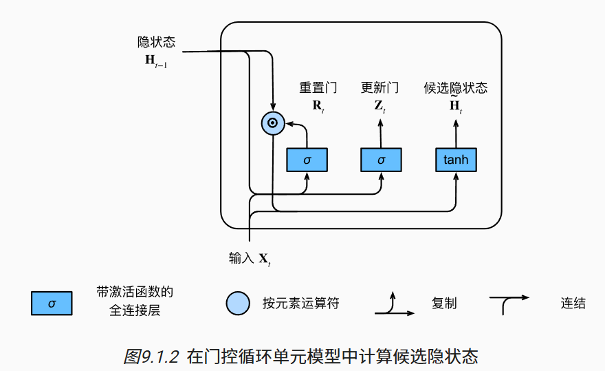
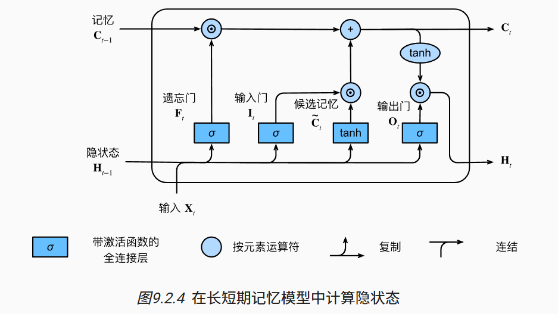
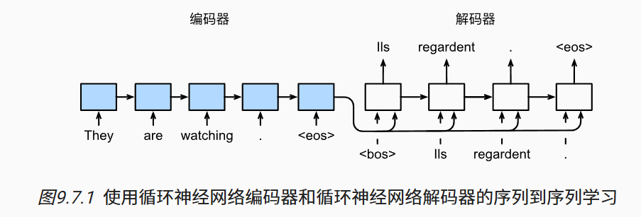

# 9.现代循环神经网络

我们将引入两个广泛使用的网络， 即*门控循环单元*（gated recurrent units，GRU）和 *长短期记忆网络*（long short-term memory，LSTM）。然后，我们将基于一个单向隐藏层来扩展循环神经网络架构。 我们将描述具有多个隐藏层的深层架构， 并讨论基于前向和后向循环计算的双向设计。 

# 9.1. 门控循环单元（GRU）

## 9.1.1. 门控隐状态

门控循环单元与普通的循环神经网络之间的关键区别在于： 前者支持隐状态的门控。这意味着模型有专门的机制来确定应该何时更新隐状态， 以及应该何时重置隐状态。

### 9.1.1.1. 重置门和更新门

我们首先介绍*重置门*（reset gate）和*更新门*（update gate）

重置门允许我们控制“可能还想记住”的过去状态的数量； 更新门将允许我们控制新状态中有多少个是旧状态的副本。

### 9.1.1.2. 候选隐状态

应用重置门之后的计算流程。

### 9.1.1.3. 隐状态

 这就得出了门控循环单元的最终更新公式：

每当更新门Zt接近1时，模型就倾向只保留旧状态。此时，来自Xt的信息基本上被忽略， 从而有效地跳过了依赖链条中的时间步t。 

更新门起作用后的计算流。

总之，门控循环单元具有以下两个显著特征：

- 重置门有助于捕获序列中的短期依赖关系；
- 更新门有助于捕获序列中的长期依赖关系。

## 9.1.4. 小结

- 门控循环神经网络可以更好地捕获时间步距离很长的序列上的依赖关系。
- 重置门有助于捕获序列中的短期依赖关系。
- 更新门有助于捕获序列中的长期依赖关系。
- 重置门打开时，门控循环单元包含基本循环神经网络；更新门打开时，门控循环单元可以跳过子序列。

# 9.2. 长短期记忆网络（LSTM）

长期以来，隐变量模型存在着长期信息保存和短期输入缺失的问题。 解决这一问题的最早方法之一是长短期存储器（long short-term memory，LSTM）

## 9.2.1. 门控记忆元

长短期记忆网络引入了*记忆元*（memory cell），或简称为*单元*（cell）。

为了控制记忆元，我们需要许多门。其中一个门用来从单元中输出条目，我们将其称为*输出门*（output gate）。

 另外一个门用来决定何时将数据读入单元，我们将其称为*输入门*（input gate）。

我们还需要一种机制来重置单元的内容，由*遗忘门*（forget gate）来管理， 这种设计的动机与门控循环单元相同， 能够通过专用机制决定什么时候记忆或忽略隐状态中的输入。

### 9.2.1.1. 输入门、忘记门和输出门

### 9.2.1.2. 候选记忆元

由于还没有指定各种门的操作，所以先介绍*候选记忆元*（candidate memory cell） 它的计算与上面描述的三个门的计算类似， 但是使用tanh函数作为激活函数

### 9.2.1.3. 记忆元

在门控循环单元中，有一种机制来控制输入和遗忘（或跳过）。 类似地，在长短期记忆网络中，也有两个门用于这样的目的： 输入门It控制采用多少来自C~t的新数据， 而遗忘门Ft控制保留多少过去的 记忆元Ct−1∈Rn×h的内容。

如果遗忘门始终为1且输入门始终为0， 则过去的记忆元Ct−1 将随时间被保存并传递到当前时间步。 引入这种设计是为了缓解梯度消失问题， 并更好地捕获序列中的长距离依赖关系。

### 9.2.1.4. 隐状态

只要输出门接近1，我们就能够有效地将所有记忆信息传递给预测部分， 而对于输出门接近0，我们只保留记忆元内的所有信息，而不需要更新隐状态。

## 9.2.4. 小结

- 长短期记忆网络有三种类型的门：输入门、遗忘门和输出门。
- 长短期记忆网络的隐藏层输出包括“隐状态”和“记忆元”。只有隐状态会传递到输出层，而记忆元完全属于内部信息。
- 长短期记忆网络可以缓解梯度消失和梯度爆炸。

# 9.3. 深度循环神经网络

描述了一个具有L个隐藏层的深度循环神经网络， 每个隐状态都连续地传递到当前层的下一个时间步和下一层的当前时间步。

## 9.3.1. 函数依赖关系

## 9.3.4. 小结

- 在深度循环神经网络中，隐状态的信息被传递到当前层的下一时间步和下一层的当前时间步。
- 有许多不同风格的深度循环神经网络， 如长短期记忆网络、门控循环单元、或经典循环神经网络。 这些模型在深度学习框架的高级API中都有涵盖。
- 总体而言，深度循环神经网络需要大量的调参（如学习率和修剪） 来确保合适的收敛，模型的初始化也需要谨慎。

# 9.4. 双向循环神经网络

## 9.4.1. 隐马尔可夫模型中的动态规划

## 9.4.2. 双向模型

 *双向循环神经网络*（bidirectional RNNs） 添加了反向传递信息的隐藏层，以便更灵活地处理此类信息。

图描述了具有单个隐藏层的双向循环神经网络的架构。

### 9.4.2.1. 定义

### 9.4.2.2. 模型的计算代价及其应用

双向循环神经网络的一个关键特性是：使用来自序列两端的信息来估计输出。 

 而在测试期间，我们只有过去的数据，因此精度将会很差。

另一个严重问题是，双向循环神经网络的计算速度非常慢。 其主要原因是网络的前向传播需要在双向层中进行前向和后向递归， 并且网络的反向传播还依赖于前向传播的结果。 

## 9.4.3. 双向循环神经网络的错误应用

## 9.4.4. 小结

- 在双向循环神经网络中，每个时间步的隐状态由当前时间步的前后数据同时决定。
- 双向循环神经网络与概率图模型中的“前向-后向”算法具有相似性。
- 双向循环神经网络主要用于序列编码和给定双向上下文的观测估计。
- 由于梯度链更长，因此双向循环神经网络的训练代价非常高。

# 9.5. 机器翻译与数据集

*机器翻译*（machine translation）指的是 将序列从一种语言自动翻译成另一种语言。 

因为*统计机器翻译*（statistical machine translation）涉及了 翻译模型和语言模型等组成部分的统计分析， 因此基于神经网络的方法通常被称为 *神经机器翻译*（neural machine translation）， 用于将两种翻译模型区分开来。

## 9.5.1. 下载和预处理数据集

 英语是*源语言*（source language）， 法语是*目标语言*（target language）。

## 9.5.2. 词元化

与 [8.3节](https://zh.d2l.ai/chapter_recurrent-neural-networks/language-models-and-dataset.html#sec-language-model)中的字符级词元化不同， 在机器翻译中，我们更喜欢单词级词元化 （最先进的模型可能使用更高级的词元化技术）。

## 9.5.3. 词表

这里我们将出现次数少于2次的低频率词元 视为相同的未知（“<unk>”）词元。 除此之外，我们还指定了额外的特定词元， 例如在小批量时用于将序列填充到相同长度的填充词元（“<pad>”）， 以及序列的开始词元（“<bos>”）和结束词元（“<eos>”）。 这些特殊词元在自然语言处理任务中比较常用。

## 9.5.4. 加载数据集

为了提高计算效率，我们仍然可以通过*截断*（truncation）和 *填充*（padding）方式实现一次只处理一个小批量的文本序列。

## 9.5.5. 训练模型

## 9.5.6. 小结

- 机器翻译指的是将文本序列从一种语言自动翻译成另一种语言。
- 使用单词级词元化时的词表大小，将明显大于使用字符级词元化时的词表大小。为了缓解这一问题，我们可以将低频词元视为相同的未知词元。
- 通过截断和填充文本序列，可以保证所有的文本序列都具有相同的长度，以便以小批量的方式加载。

# 9.6. 编码器-解码器架构

 机器翻译是序列转换模型的一个核心问题， 其输入和输出都是长度可变的序列。为了处理这种类型的输入和输出， 我们可以设计一个包含两个主要组件的架构： 第一个组件是一个*编码器*（encoder）： 它接受一个长度可变的序列作为输入， 并将其转换为具有固定形状的编码状态。 第二个组件是*解码器*（decoder）： 它将固定形状的编码状态映射到长度可变的序列。 这被称为*编码器-解码器*（encoder-decoder）架构

## 9.6.1. 编码器

在编码器接口中，我们只指定长度可变的序列作为编码器的输入`X`。 任何继承这个`Encoder`基类的模型将完成代码实现。

## 9.6.2. 解码器

在下面的解码器接口中，我们新增一个`init_state`函数， 用于将编码器的输出（`enc_outputs`）转换为编码后的状态。 为了逐个地生成长度可变的词元序列， 解码器在每个时间步都会将输入 （例如：在前一时间步生成的词元）和编码后的状态 映射成当前时间步的输出词元。

## 9.6.3. 合并编码器和解码器

总而言之，“编码器-解码器”架构包含了一个编码器和一个解码器， 并且还拥有可选的额外的参数。 在前向传播中，编码器的输出用于生成编码状态， 这个状态又被解码器作为其输入的一部分。

## 9.6.4. 小结

- “编码器－解码器”架构可以将长度可变的序列作为输入和输出，因此适用于机器翻译等序列转换问题。
- 编码器将长度可变的序列作为输入，并将其转换为具有固定形状的编码状态。
- 解码器将具有固定形状的编码状态映射为长度可变的序列。

# 9.7. 序列到序列学习（seq2seq）

 机器翻译中的输入序列和输出序列都是长度可变的。

我们将使用两个循环神经网络的编码器和解码器， 并将其应用于*序列到序列*（sequence to sequence，seq2seq）类的学习任务 

## 9.7.1. 编码器

## 9.7.2. 解码器

## 9.7.3. 损失函数

## 9.7.4. 训练

## 9.7.5. 预测

## 9.7.6. 预测序列的评估

BLEU（bilingual evaluation understudy） 最先是用于评估机器翻译的结果， 但现在它已经被广泛用于测量许多应用的输出序列的质量。

原则上说，对于预测序列中的任意n元语法（n-grams）， BLEU的评估都是这个n元语法是否出现在标签序列中。

我们将BLEU定义为：

其中lenlabel表示标签序列中的词元数和 lenpred表示预测序列中的词元数， k是用于匹配的最长的n元语法。 另外，用pn表示n元语法的精确度，它是两个数量的比值： 第一个是预测序列与标签序列中匹配的n元语法的数量， 第二个是预测序列中n元语法的数量的比率。

具体地说，给定标签序列A、B、C、D、E、F 和预测序列A、B、B、C、D， 我们有p1=4/5、p2=3/4、p3=1/3和p4=0。

根据 [(9.7.4)](https://zh.d2l.ai/chapter_recurrent-modern/seq2seq.html#equation-eq-bleu)中BLEU的定义， 当预测序列与标签序列完全相同时，BLEU为1。 此外，由于n元语法越长则匹配难度越大， 所以BLEU为更长的n元语法的精确度分配更大的权重。

## 9.7.7. 小结

- 根据“编码器-解码器”架构的设计， 我们可以使用两个循环神经网络来设计一个序列到序列学习的模型。
- 在实现编码器和解码器时，我们可以使用多层循环神经网络。
- 我们可以使用遮蔽来过滤不相关的计算，例如在计算损失时。
- 在“编码器－解码器”训练中，强制教学方法将原始输出序列（而非预测结果）输入解码器。
- BLEU是一种常用的评估方法，它通过测量预测序列和标签序列之间的n元语法的匹配度来评估预测。

# 9.8. 束搜索

本节将首先介绍*贪心搜索*（greedy search）策略， 并探讨其存在的问题，然后对比其他替代策略： *穷举搜索*（exhaustive search）和*束搜索*（beam search）。

## 9.8.1. 贪心搜索

## 9.8.2. 穷举搜索

如果目标是获得最优序列， 我们可以考虑使用*穷举搜索*（exhaustive search）： 穷举地列举所有可能的输出序列及其条件概率， 然后计算输出条件概率最高的一个。

## 9.8.3. 束搜索

那么该选取哪种序列搜索策略呢？ 如果精度最重要，则显然是穷举搜索。 如果计算成本最重要，则显然是贪心搜索。 而束搜索的实际应用则介于这两个极端之间。

*束搜索*（beam search）是贪心搜索的一个改进版本。 它有一个超参数，名为*束宽*（beam size）k。 在时间步1，我们选择具有最高条件概率的k个词元。 这k个词元将分别是k个候选输出序列的第一个词元。 在随后的每个时间步，基于上一时间步的k个候选输出序列， 我们将继续从k|Y|个可能的选择中 挑出具有最高条件概率的k个候选输出序列。

## 9.8.4. 小结

- 序列搜索策略包括贪心搜索、穷举搜索和束搜索。
- 贪心搜索所选取序列的计算量最小，但精度相对较低。
- 穷举搜索所选取序列的精度最高，但计算量最大。
- 束搜索通过灵活选择束宽，在正确率和计算代价之间进行权衡。

