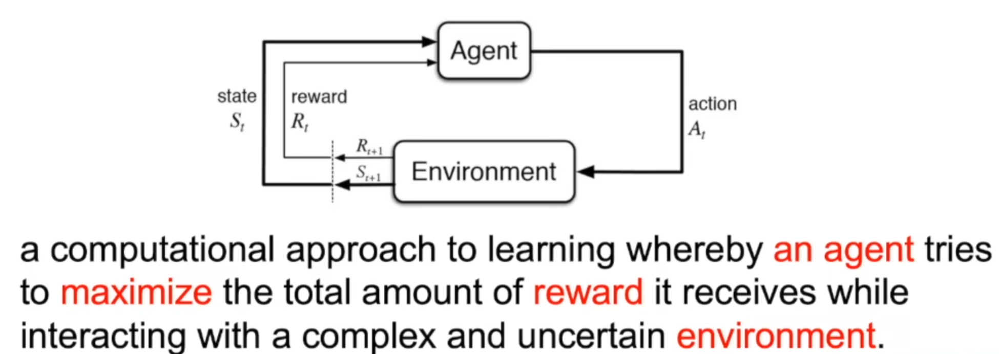

# 强化学习纲要

课程链接：https://space.bilibili.com/511221970/lists/764099?type=series

课程资料参见：https://github.com/zhoubolei/introRL

# 第一课 概括与基础 上

什么是强化学习？

强化学习与监督学习的区别：

+ 输入是序列的数据
+ 没有明确告知正确的行为
+ 通过不断地试错
+ 无监督，只有一个奖励信号

强化学习的特征：

+ 不断探索与试错
+ 延迟奖励
+ 时间重要
+ agent行为影响获取到的数据

# 第一课 概括与基础 下

强化学习是要agent与环境交互过程中获取更多的奖励

但一个问题是很多时候奖励会在很长一段时间后才会显现，这就需要平衡短期奖励与长期奖励之间的取舍

agent根据过去的一系列行为判断当前的行为

agent的组成成分：

+ 决策函数：用于选取下一步的动作policy
+ 价值函数：对当前状态进行估价value
+ 模型：agent对环境如何理解model

决策函数Policy：

+ 决定了agnet的行为
+ 有不同的决策方法

价值函数Value function：

+ 未来奖励的加和
+ 有一个折扣因子
+ Q函数，状态-动作

模型Model：

+ 决定了下一个状态时什么样

有了这三个之后就构成了马尔科夫决策过程（MDPs）

根据强化学习学习策略的不同，将agent分为：

+ 基于价值函数的agent
+ 基于策略导向的agent
+ Actor-Crittic：两者结合

根据agent是否学习到了环境模型来分类：

+ 通过学习状态的转移
+ 没有得到状态的转移，也没得到转移变量，通过学习value function 和 policy function

Exploration and Exploitation

+ Exploitation：选择已知的最好方法
+ Exploration ：尝试新的方法

课后有一些强化学习小游戏

# 第二课 马尔科夫决策过程 上

+ 马尔科夫链
+ 马尔科夫奖励过程（MRPs）
+ 马尔可夫决策过程（MDPs）

马尔科夫特征：一个状态未来的转移只取决于当前的状态，与之前的状态是独立的

马尔科夫奖励过程（MRPs）：定义未来的期望

马尔可夫决策过程（MDPs）

已知一个MDP和policy，可以转化为一个MRP

# 第二课 马尔科夫决策过程 下

马尔可夫决策过程（MDPs）

预测Prediction 和 控制Control 是马尔科夫决策问题的核心问题

寻找最佳策略的过程即 MDP Control

# 第三课 无模型的价值函数估计和控制 上

蒙特卡洛

# 第三课 无模型的价值函数估计和控制 下

# 第四课 价值函数近似 上

