# [一文看懂推荐系统](https://blog.csdn.net/weixin_46838716/article/details/126117590?spm=1001.2014.3001.5502)

# 召回01：基于物品的协同过滤（ItemCF）

+ 推荐系统链路上的最后一环是重排，重排最重要的功能是多样性抽样。需要从几百篇笔记中选出几十篇笔记，常见的方法有MMR和DPP抽样的时候有两个依据。介绍MMR和DPP方法
+ itemcf召回：需要建立两个索引，用户-物品索引、物品-物品索引
  1. 给定用户ID，通过用户-物品索引，找到用户近期感兴趣的物品列表last-n
  2. 对于近期感兴趣的每个物品，通过物品-物品索引，找出top-k相似物品
  3. 对于取回的相似物品（最多n * k个），用公式计算物品的兴趣分数
  4. 返回分数最高的top个物品，作为推荐结果
  5. **索引的意义在于避免枚举所有的物品，用空间换时间，让在线计算速度足够快**（用索引，离线计算量大，线上计算量小）

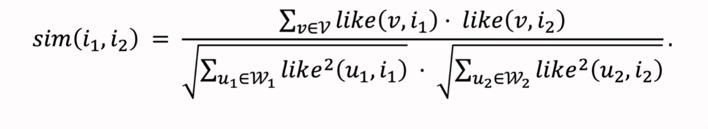

**多样性抽样MMR和DPP**都是用来在推荐系统重排 / rerank 阶段提升 *多样性 + 相关性平衡* 的常见方法。

目的：

+ 用规则打散相似笔记。
+ 插入广告，运营推广内容

# 召回02：Swing模型

Swing Score 提供了一个新的解题思路。它不再简单地统计共同购买次数，而是深入分析用户-物品二部图中的内部子结构，通过捕捉那些在用户行为中反复出现、具备较强“鲁棒性”的共同购买关系来度量物品相似性。其核心洞察是：**如果多个用户在其他共同购买行为较少的情况下，同时购买了同一对物品，那么这对物品之间的关联性就更可信**。

Swing算法的实现可以分为两个主要步骤：先构建用户-物品二部图，再通过分析图中用户对的共同交互模式（即swing结构）来计算物品相似度。

**内部子结构分析**：对集合中的每一对用户 ，统计他们的其他共同购买行为。如果用户 与 的其他交互行为重合较少（即 较小），则认为他们在共同选择物品 和 上的行为更具特异性，应该为这对物品贡献更高的相似度得分。

Swing score 的基础计算公式为：
$$
s(i,j) = \sum_{u \in U_i \cap U_j} \sum_{v \in U_i \cap U_j} 
\frac{1}{\alpha + |I_u \cap I_v|}
$$

# 召回03：基于用户的协同过滤（userFG）

**越热门的物品越无法反映出用户独特的兴趣，对计算相似度就没有用**。

> 拿书籍推荐举个例子，哈利波特是非常热门的物品，不论是大学教授还是中学生都喜欢看哈利波特。
> 既然所有人都喜欢看哈利波特，那么哈利波特对于计算用户相似度是没有价值的。

为了更好的计算用户兴趣的相似度，**我们需要降低热门物品的权重**，

usercf召回：建立两个索引，用户-物品索引、用户-用户索引

1. 给定用户ID，通过用户-用户索引，找到topk相似用户
2. 对于每个topk相似用户，通过用户-物品索引，找到用户最近感兴趣的物品列表（last-n）
3. 对于取回的nk个相似物品，用公式预估用户对每个物品的兴趣分数
4. 返回分数最高的top个物品，作为召回结果

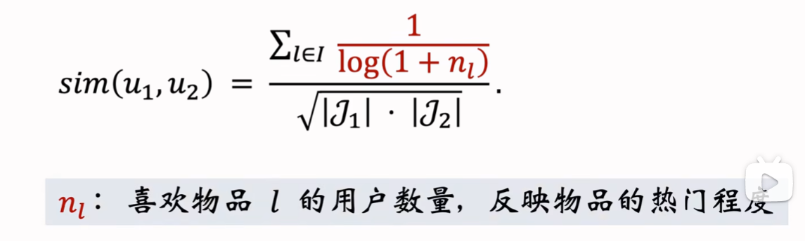

# 召回04：离散特征处理，one-hot编码和embedding特征嵌入

one-hot：把序号映射为高维稀疏向量

embedding：把序号映射为低维稠密向量

one-hot编码局限性，对于类别数量太大，通常不用one-hot编码

**embedding其实就是把one hot的向量乘到一个参数矩阵W上得到的精致向量**。

embedding = 参数矩阵 * one-hot向量

# 召回05：矩阵补充、最近邻查找

工业界基本不用了，但有助于理解双塔模型

目前推荐系统最常用的是余弦相似度，其最近邻是**向量夹角最小的**。
有些系统不支持余弦相似度，但这很好解决。
如果你把所有向量都做归一化，让它们的二范数全都等于一，那么内积就等于余弦相似度。

缺点：

+ 缺点1：仅用IDembedding’没利用物品、用户属性。
+ 缺点2：负样本的选取方式不对。
+ 缺点3：做训练的方法不好。用平方损失（回归），不如用交叉熵损失（分类）

**Milvus、Faiss、HnswLib**

# 召回06：双塔模型

召回模型是后期融合特征，排序模型是前期融合特征

双塔模型可以看作是矩阵补充的升级版

双塔模型的训练方法：

1. Pointwise：独立看待每个正样本、负样本，做简单的二元分类
2. Pariwise：每次取一个正样本、一个负样本，损失函数用triplet hing loss或者triplet logistic loss
3. Listwise：每次取一个正样本、多个负样本，训练方式类似于多元分类

**Pointwise训练**
第一种是pointwise训练，pointwise是最简单的训练方式，
我们把召回看作简单的二元分类任务，正样本意思是历史记录显示用户对物品感兴趣
对于正样本，我们要鼓励向量a和b的cos相似度接近+1
负样本的意思是用户对物品不感兴趣，对于负样本，我们要鼓励向量a和b的cos相似度接近-1这就是个很典型的二元分类问题。
如果做pointwise训练，可以把正负样本的数量控制在1 : 2或者1 : 3。
我也不知道为什么，但是互联网大厂的人都这么做，这算是业内的经验。

**Pairwise训练**

第二种训练双塔模型的方式是pair wise，做训练的时候，每一组的输入是一个**三元组**，包括一个用户ID和两个物品ID。

把用户的特征和物品的特征各自做变换，然后输入神经网络，最终输出三个向量，
用户的特征向量记作a，
两个物品的特征，向量记作B加和B减两个物品，

特征变换映射物品的embedding结构是相同的，里面的embedding层和全连接层都用一样的参数。

分别计算用户对两个物品的兴趣
用户对正样本的兴趣是向量a和向量b加的余弦相似度，这个值越大越好，最好是接近+1。
用户对负样本的兴趣是向量a和向量b减的余弦相似度，这个值越接近-1越好。

**Listwise训练**

第三种训练双塔模型的方式是list wise。
做list wise训练的时候，每次取一个正样本和很多负样本，
需要一个用户把它的特征向量记作a，

取一个正样本，意思是历史记录显示用户喜欢这个物品，把这个物品的特征向量记作B加，
还需要取N个负样本，把它们的特征向量去做B1减到BN减。
做训练的时候要鼓励a和正样本b+的余弦相似度尽量大，
鼓励a和负样本bn-的余弦相似度尽量小。

**三种训练方法的本质都是让用户和正样本物品的余弦相似度大，而用户跟负样本的余弦相似度小。**

# 召回07：双塔模型—正负样本的选择

召回的目的是区分感兴趣和不感兴趣的，精排是区分感兴趣和非常感兴趣的

正样本是有点击的物品，所以正样本大多属于热门物品，
拿过多的热门物品作为正样本，会对冷门物品不公平  ，
这样会让热门物品更热，冷门物品更冷。

解决方案是对冷门物品做过采样，或者对热门物品做降采样。
过采样的英文是up sampling，意思是让一个样本出现多次。
降采样的英文是down sampling，意思是抛弃一些样本。

比如一定概率抛弃热门物品，抛弃的概率与样本点击次数正相关。

**简单负样本：全体物品**

+ 均匀抽样：对冷门物品不公平，正样本大多是热门物品，如果均匀抽样产生负样本，负样本大多是冷门物品
+ **非均匀抽样**：目的是打压热门物品，负样本抽样概率与热门程度（点击次数）正相关，抽样概率正比于点击次数的0.75次方，0.75是个经验值。

**简单负样本：batch内负样本**

什么是batch内负样本？这里举个例子，
第一个用户跟第二个物品可以组成一个负样本。
第一个用户跟第三个物品也可以组成一个负样本，
设一个batch内有N个正样本，那么一个用户跟N-1个物品可以组成负样本，
所以这个batch内一共有N×N-1个负样本，这些都属于简单负样本。

batch内负样本存在一个问题，一个物品出现在**batch内的概率正比于它的点击次数**，也就是它的热门程度。

抽样概率本应该正比于点击次数的0.75次方，
但这里实际上是1次方。
也就是说，任何物品成为负样本的概率过大，
一个物品成为负样本的概率越大，模型对这个物品打压就会越狠，**对负样本应该打压，但这里打压的太狠了**。
这样会造成偏差。

**如何修正偏差？**

双塔模型通常用余弦相似度预估用户对物品I的兴趣分数rate，
Cos中的a是用户的特征向量，
bi是物品i的特征向量，
训练的时候要鼓励正样本的=余弦相似度尽量大，
鼓励负样本的余弦相似度尽量小。

根据Youtube论文的建议，训练双塔模型的时候，
应该把cos（a bi）调整为cos（a bi）- log（pi），
这样可以纠偏，人为地把这个负样本的概率减掉，避免过分打压热门的物品，

训练结束之后在线上做召回的时候，还是用原本的余弦相似度cos（a bi），
线上召回的时候不用做这种调整，不用减 log（pi）。

**p_i 是 item i 在负采样过程被选为负样本（或出现在 batch 或负采样集合） 的概率或近似频率。**

**困难负样本**

困难负样本是被**排序淘汰**的物品，
比如物品被召回，但是被粗排淘汰

困难负样本：

+ 被粗排淘汰的物品(比较困难)
+ 精排分数靠后的物品(非常困难)

对正负样本做二元分类：

+ 全体物品(简单)分类准确率高
+ 被粗排淘汰的物品(比较困难)容易分错
+ 精排分数靠后的物品(非常困难)更容易分错

工业界比较常用的做法是把简单负样本与困难负样本混合起来作为训练数据。

比如50%是简单副样本，就是从全体物品中随机非均匀抽样出来的，
另外50%是困难负样本，也就是从粗排和精排淘汰的物品中随机抽样出来的。

**错误负样本选取，直接就把曝光但是没有点击的物品作为负样本**

**训练召回模型不能用这类负样本**

**训练排序模型会用这类负样本**

召回模型的任务是**区分用户不感兴趣的物品和可能能感兴趣的物品**，
而**不是区分比较感兴趣的物品和非常感兴趣的物品【这是排序干的事】**，这就是选择负样本的基本思路。

曝光但是没有点击的物品已经算是非常匹配的了，**甚至可以拿来做召回的正样本**，
**不应该把曝光但是没有点击的物品作为召回的负样本**，记住这一点。

# 召回08：双塔模型-线上服务、模型更新

线上服务需要离线存物品向量、模型更新分为全量更新和增量更新

**线上服务**

在训练好模型之后，在开始线上服务之前，先用右边的物品塔提取物品的特征，把物品特征向量记作b

至于用户塔，处理方式完全不一样，不要事先计算和存储用户向量，而是当用户发起推荐请求的时候，调用神经网络在线上线算一个特征向量a，然后把向量a作为query去数据库中做检索查找最近邻。

**为什么要区别对待物品向量和用户向量？**

1. 道理是这样的，每做一次召回，只用到一个用户向量a，
   而要用到几亿个物品向量B，拿神经网络现算一个用户向量，计算量不大，算的起。
   但是几亿个物品向量显然是算不起的，
   所以我们不得不离线算好物品向量。
2. 用户的兴趣点是动态变化的，所以应该在线上实时计算用户向量
   而不是事先计算好存起来。
   事先存储用户向量效果不好，
   但事先存储物品向量是OK的，这是因为物品的特征相对比较稳定，
   短期内不会发生变化。

**全量更新**

+ 全量更新：今天凌晨，用昨天全天的数据训练模型
+ 在昨天模型参数的基础上做训练(不是随机初始化)
+ 用昨天的数据，训练1epoch，即每天数据只用一遍  
+ 发布新的用户塔神经网络和物品向量，供线上召回使用
+ 全量更新对数据流、系统的要求比较低

**增量更新online learning**

+ 增量更新：做onlinelearning更新模型参数
+ 用户兴趣会随时发生变化
+ 实时收集线上数据，做流式处理，生成TFRecord文件。
+ 对模型做online learning，增量更新IDEmbedding 参数（不更新神经网络其他部分的参数。
+ 发布用户ID Embedding，供用户塔在线上计算用户向量

**能不能只做增量更新，不做全量更新？**

+ 小时级数据有偏；分钟级数据偏差更大
+ 全量更新：random shuffle一夫的数据，做1epoch 训练
+ 增量更新：按照数据从早到晚的顺序，做1epoch 训练
+ 随机打乱优于按顺序排列数据，全量训练优于增量训练

现在先进的推荐系统都会结合全量更新和增量更新。

# 召回09：双塔模型+自监督学习

自监督学习的目的是为了提高物品的表征

类似于对比学习，同一物品经过特征变换后仍相似，不同物品经过特征变换后仍不相似

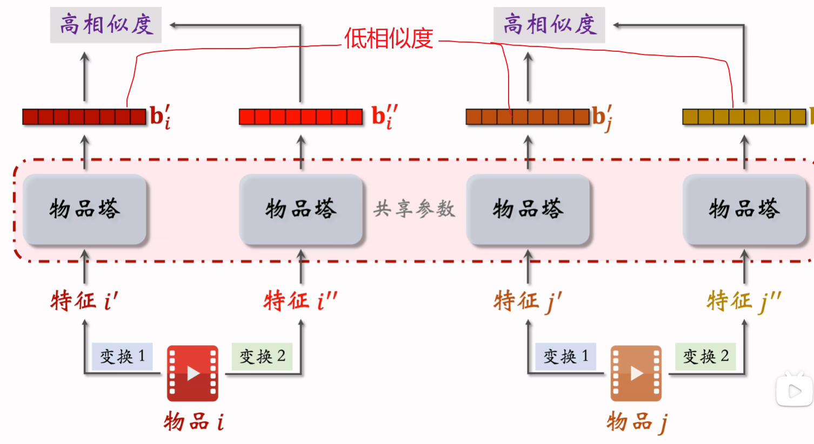

**特征变换：Random Mask**

随机选一些离散特征，把他们遮住

**特征变换：Dropout**（仅对多值离散特征生效）

一个物品可以有多个类目，那么类目是一个多值离散特征。

Dropout：随机丢弃特征中50%的值。

**特征变换：互补特征**

假设物品一共有4种特征： ID,类目，关键词，城市

随机分成两组：{ID，关键词}和{类目，城市}

{ID,default,关键词，default}→物品表征

{default,类目，default,城市}今物品表征

鼓励两个向量相似

**特征变换：Mask一组关联的特征**

设一共有k种特征。离线计算特征两两之间MI,得到kXk的矩阵。

随机选一个特征作为种子，找到种子最相关的k/2种特征。 

Mαsk种子及其相关的k/2种特征，保留其余的 k/2种特征。

好处：比random mask、dropout、互补特征等方法效果更好。

坏处：方法复杂，实现的难度大，不容易维护。

**如何提高模型对低曝光物品的表征？**

双塔模型学不好低曝光物品的向量表征。

+ 自监督学习：
  + 对物品做随机特征变换。
  + 特征向量bi‘和bi’’相似度高（相同物品）。
  + 特征向量bi'和bj'相似度低（不同品）。
+ 实验效果：低曝光物品、新物品的推荐变得更准。

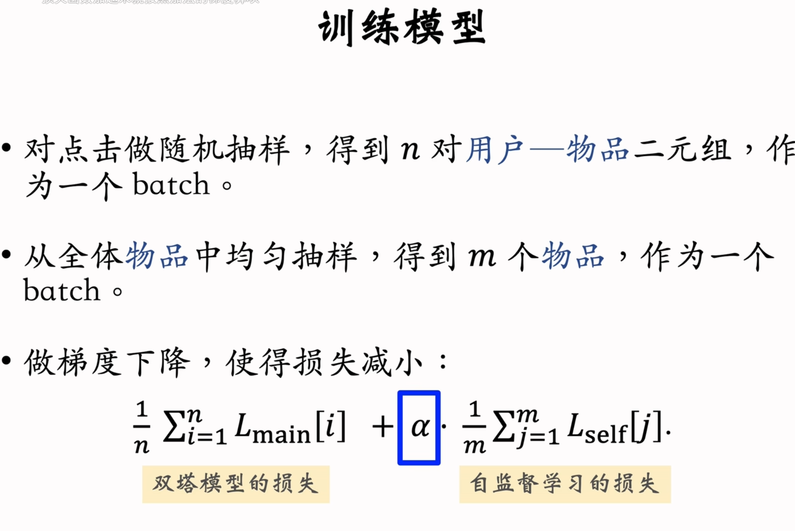

# 召回10：Deep Retrieval 召回（没懂，暂时不去考虑这部分）

经典的双塔模型把用户、物品表示为向量，线上做最近邻查找 

Deep Retrieval把物品表征为路径(path),线上查找用户最匹配的路径。 

Deep Retrieval类似于阿里的TDM

召回：用户：路径→物品

+ 给定用户特征x，用神经网络预估用户对路径 path =[α,b,c]的兴趣，分数记作 p(path|x)
+ 用beam search寻找分数 p(path「x）最高的s条path
+ 利用索引path→List(item)”召回每条路径上的n个物品
+ 一共召回 sXn个物品，对物品做初步排序，返回分数最高的若干物品。

# 召回11：地理位置召回、作者召回、缓存召回

**GeoHahs召回**

+ 用户可能对附近发生的事感兴趣
+ GeoHash：对经纬度的编码，地图上一个长方形区域
+ 索引：GeoHash→优质笔记列表(按时间倒排)
+ 这条召回通道没有个性化

**同城召回**

+ 用户可能对同城发生的事感兴趣
+ 索引：城市→优质笔记列表(按时间倒排)
+ 这条召回通道没有个性化

**关注作者召回**

+ 用户对关注的作者发布的笔记感兴趣。
+ 索引：
  + 用户→关注的作者
  + 作者 →发布的笔记
+ 召回：
  用户→关注的作者→最新的笔记

系统维护两个索引

**有交互的作者召回**

+ 如果用户对某笔记感兴趣(点赞、收藏、转发)，那么用户可能对该作者的其他笔记感兴
+ 索引：用户有交互的作者
+ 召回：用户→有交互的作者->最新的笔记

**相似作者召回**

+ 如果用户喜欢某作者，那么用户喜欢相似的作者
+ 索引：作者→相似作者（k个作者）
+ 召回：用户感兴趣的作者→相似作者→最新的笔记

**缓存召回**

+ 想法：复用前n次推荐精排的结果
+ 背景：
  + 精排输出几百篇笔记，送入重排。
  + 重排做多样性抽样，选出几十篇
  + 精排结果一大半没有曝光，被浪费。
+ 精排前50，但是没有曝光的，缓存起来，作为一条召回通道

+ 缓存大小固定，需要退场机制
+ 一旦笔记成功曝光，就从缓存退场
+ 如果超出缓存大小就移除最先进入缓存
  的笔记。
+ 笔记最多被召回10次，达到10次就退场
+ 每篇笔记最多保存3天，达到3天就退场

# 召回12：曝光过滤 & Bloom Filter

**曝光过滤问题**

+ 如果用户看过某个物品，则不再把该物品曝光给该用户
+ 对于每个用户，记录已经曝光给他的物品。（小红书只召回1个月以内的笔记，因此只需要记录每个用户最近1个月的曝光历史。）
+ 对于每个召回的物品，判断它是否已经给该用户曝光过，排除掉曾经曝光过的物品。
+ 一位用户看过n个物品，本次召回r个物品，如果暴力对比，需要O(nr）的时间，在实际中不可用

**Bloom Filter**

+ Bloom filter 判断一个物品ID是否在已曝光的物品集合中。
+ 如果判断为no，那么该物品一定不在集合中。
+ 如果判断为yes，那么该物品可能在集合中。（可能误伤，错误判断未曝光物品为已曝光，将其过滤掉。）

**Bloom Filter的缺点**

+ Bloom filter 把物品的集合表示成一个二进制向量，每往集合中添加一个物品，只需要把向量k个位置的元素置为 1。（如果原本就是1，则不变。）
+ Bloom filter只支持添加物品，不支持删除物品。从集合中移除物品，无法消除它对向量的影响
+ 每天都需要从物品集合中移除年龄大于1个月的物品（超龄物品不可能被召回，没必要把它们记录在Bloom filter，降低n可以降低误伤率。）

# 排序01：多目标模型

粗排的目的是做快速的初步筛选，
如果不用粗排，直接把很大的精排模型用在几千篇候选笔记上，计算代价承受不住。

**排序依据**

+ 排序模型预估点击率、点赞率、收藏率、转发率等多种分数
+ 融合这些预估分数。（比如加权和）
+ 根据融合的分数做排序、截断。

**实际训练的困难：样本不平衡问题**

+ 困难：类别不平衡
  + 每100次曝光，约有10次点击、90次无点击。
  + 每100次点击，约有10次收藏、90次无收藏°
+ 解决方案：负样本降采样(down-sampling)
  + 保留一小部分负样本。
  + 让正负样本数量平衡；节约计算。

**预估值校准**

+ 正样本、负样本数量为 n+ 和n-
+ 对负样本做降采样，抛弃一部分负样本
+ 使用α·n-个负样本 α∈（0,1)是采样率
+ 由于负样本变少，预估点击率大于真实点击率

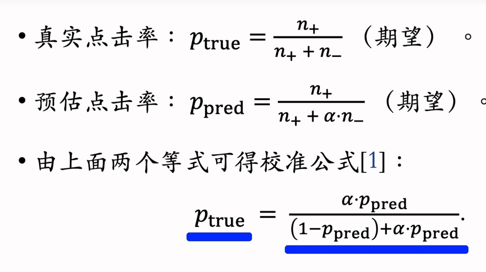

# 排序02：Multi-gate Mixture-of-Experts (MMoE) + PLE

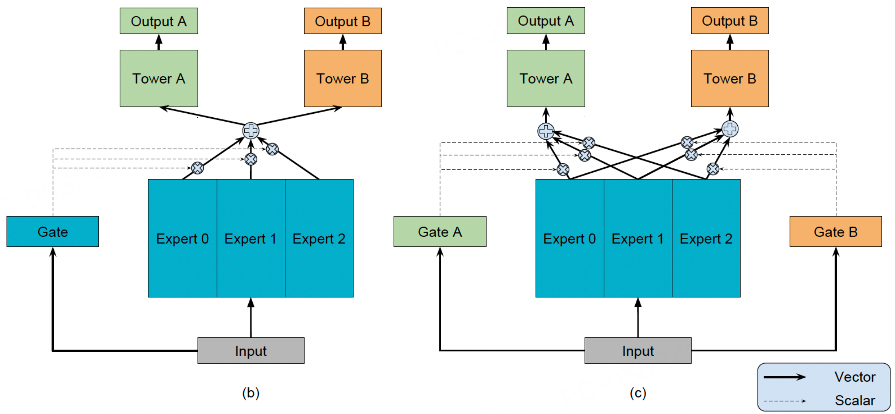

把向量输入三个神经网络。

这三个神经网络结构相同，都是有很多全连接层组成，
**但这三个神经网络结构相同，但参数不同**，三个神经网络各输出一个向量，三个向量叫做X1X2X3。

**这三个神经网络被叫做专家，就是mixture of experts中的experts。**

实践中通常会试一试四个或者八个

**gate 门函数–权重输出**

把下面的特征向量输入另一个神经网络，这个神经网络也有多个全连接层。
在神经网络的最后，**加一个softmax激活函数突出一个三维的向量。**

假设多目标模型只有点击率和点赞率这两个目标，所以用了P和Q这两组权重，假如有十个目标，那么就要用十组权重。

结构模型很简单，就是对神经网络输出的向量X1X2X3做加权平均，
然后用加权平均得到的向量去预估某个业务指标。

**MMoE实践过程中发现有问题，被极化了，就是老是只有一个专家有效，权重是001的形式**

**解决极化问题**

+ 如果有n个“专家”，那么每个softmax 的输入和输出都是n维向量
+ 在训练时，对softmax的输出使用dropout。
  + Softmax 输出的n个数值被 mask 的概率都是10%°
  + 每个“专家"被随机丢弃的概率都是10%°

**不要以为把MMOE用上就一定会有提升**。

**PLE**

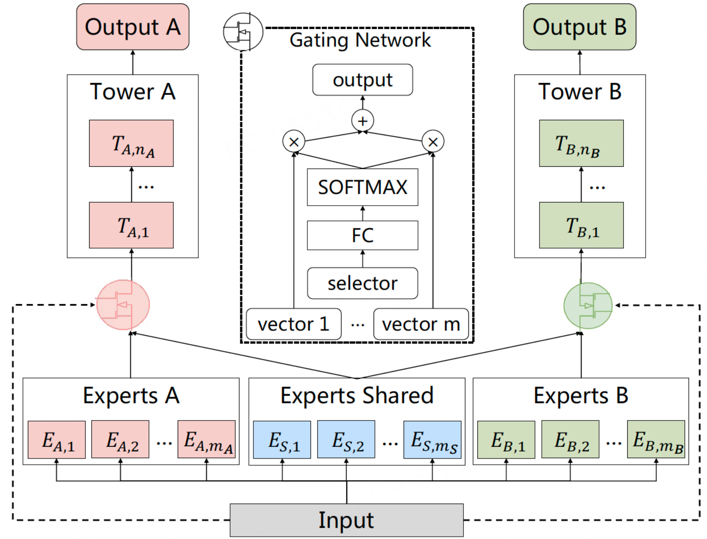

**PLE（Progressive Layered Extraction，渐进式分层抽取模型）**，它是工业界在 **MMoE** 基础上的进一步改进，常用于推荐系统中的 **多任务学习（MTL）**。

MMoE架构仍存在一个根本性局限：所有专家对所有任务门控可见。这种“软隔离”设计在实践中仍面临两大挑战：

+ 负迁移未根除
+ 门控决策负担重

**在 PLE 里，专家被分成两类：**

1. **共享专家（Shared Experts）**：学习各任务共有的模式。
2. **任务专属专家（Task-specific Experts）**：只为特定任务学习独有模式。

**门控网络设计：**

+ 每个任务都有一个门控，门控会从 **共享专家 + 该任务的专属专家** 中进行选择。
+ 此外，还有一个 **共享门控**，它从所有共享专家里挑选信息，供后续层次使用。
+ 任务A的门控完全无法访问其他任务的专属专家，同样，任务A的梯度绝不会更新其他任务的专属专家参数。

# 排序03：预估分数融合

**预估分数融合**

最简单的分数融合方法就是**求各种预估值的加权和**

**海外某短视频APP的融分公式**
$$
(1 + w_{1} \cdot p_{\text{time}})^{\alpha_{1}} \cdot 
(1 + w_{2} \cdot p_{\text{like}})^{\alpha_{2}} \cdots
$$
**国内某电商的容分公式**

电商的转化流程：曝光→点击→加购物车→付款
模型预估：Pclick、Pcart、Ppay
最终融合分数：
$$
p_{\text{click}}^{\alpha_{1}} \times 
p_{\text{cart}}^{\alpha_{2}} \times 
p_{\text{pay}}^{\alpha_{3}} \times 
\text{price}^{\alpha_{4}}
$$

# 排序04：视频播放建模

对于一些视频网站，**时长和完播是最主要的指标，其次才是点击和交互**。

**播放时长**

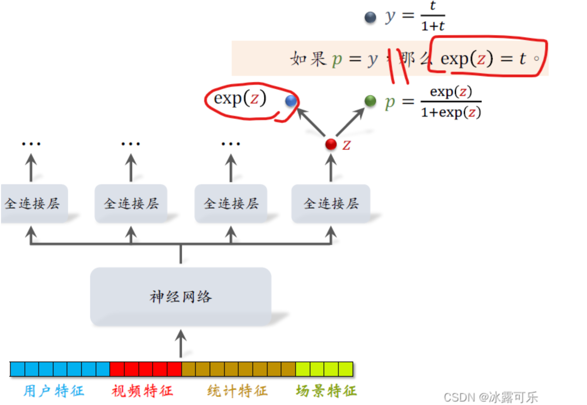

总结一下，右边的全连接层输出Z，对Z做sigmoid的变换，得到P

在训练中要用P，用Y与P的交叉商作为损失函数训练模型，
做完训练之后，P就没有用了。
线上做推理的时候，只用Z的指数函数，把它作为对播放时长T的预估，exp(Z)近似等于T

**视频完播**

对于视频完播，有两种建模的方法，一种是回归，一种是二元分类，需要算法工程师自己定义完播指标。

**回归**

举个例子，视频的长度是十分钟，用户实际播放了四分钟就关掉了，
那么实际的播放率是Y等于0.4，
做训练的时候，让模型预估的播放率P，去拟合Y
Y的大小介于零到一之间，用Y和P的交叉熵作为损失函数。

在线上用P作为对完播率的预估，
比方说模型输出P等于0.73，意思是预计播放73%。
这个预估的完播率就像是点赞率、收藏率一样，反映出用户对物品的兴趣，
预估的完播率会作为融分公式中的一项影响视频的排序，

**二元分类**

比如完播80%，什么意思？
如果一个视频的长度是十分钟，那么播放超过八分钟就算是正样本，
少于八分钟算是负样本，
这里完播80%只是举个例子，

你也可以把完播定义为播放超过20%，或者播放超过50%，怎么样定义完播都行。

训练要做二元分类播放，超过80%算是正样本，小于80%算是负样本，
做完训练之后，可以用这个二元分类器在线上预估完播率。
举个例子，如果模型输出0.73，意思是视频播放超过80%的概率等于0.73，
预估的播放率会跟点击率等指标一起作为排序的依据。

在实践中，如果直接用预估的完播率，**那么会有利于短视频，而对长视频不公平。**

**用函数F对预估的完播率做调整**，**F是视频长度的函数**，视频越长，函数值F越小，把调整之后的分数记作p finish。

把p finish作为容分公式中的一项，与播放时长、点击率、点赞率等指标一起决定视频的排序。

# 排序05：排序模型的特征

**排序模型的特征**

+ 用户画像特征
+ 笔记画像特征
+ 用户统计特征
+ 笔记统计特征
+ 场景特征

# 排序06：粗排三塔模型，性能介于双塔模型和精排模型之间

**粗排的三塔模型**

分别是用户塔、物品塔、交叉塔。
**用户塔的输入是用户特征和场景特征**。
物品塔的输入只有**物品特征**
交叉塔的输入包括**统计特征和交叉特征**，交叉特征是指**用户特征与物品特征做交叉**。

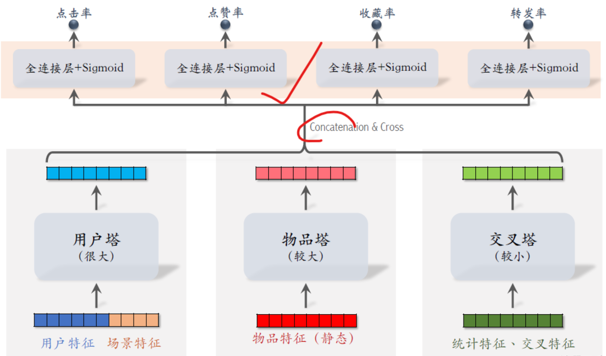

**三塔模型的推理**

+ 从多个数据源取特征：
  + 1个用户的画像、统计特征。
  + n个物品的画像、统计特征。
+ 用户塔：只做1次推理
+ 物品塔：未命中缓存时需要做推理
+ 交叉塔：必须做n次推理
+ 上层网络做n次推理，给n个物品打分

# 特征交叉01：Factorized Machine (FM) 因式分解机

**Factorized Machine**

+ FM是线性模型的替代品，能用线性回归、逻辑回归的场景，都可以用FM
+ FM使用二阶交叉特征，表达能力比线性模型更强
+ 通过做近似 uij = vi * vj 把二阶交叉权重的数量从0(d²) 降低到0(kd)

# 特征交叉02：DCN深度交叉网络

召回和排序都可使用

其主要工作是针对**wide&deep网络中wide部分做了改进**，
在wide&deep网络中，wide部分是个简单的线性模型，其交叉特征依然需要人工设计，
而在DCN中设计了**专门的cross网络用于自动学习交叉特征。**

关于这个cross网络目前存在一定的争议，
比如在xdeepFM这篇论文中认为DCN中cross网络交叉的本质
只是对输入向量x 0 x_0 做了一个和x 0的相关的放缩。

我个人认为，DCN中cross网络还是有一定作用的，但这个交叉是bit-wise的，
并不像FM系列的vector-wise，
所以其交叉能力应该不像FM系列这么强。

**交叉层结构：**

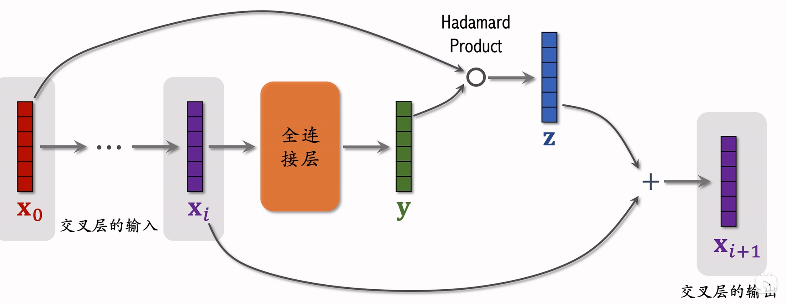

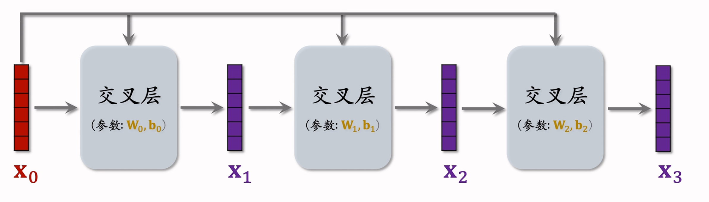

计算公式：

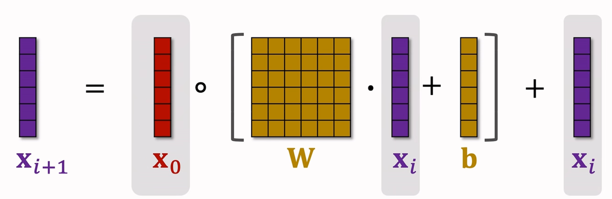

**模型整体架构：**

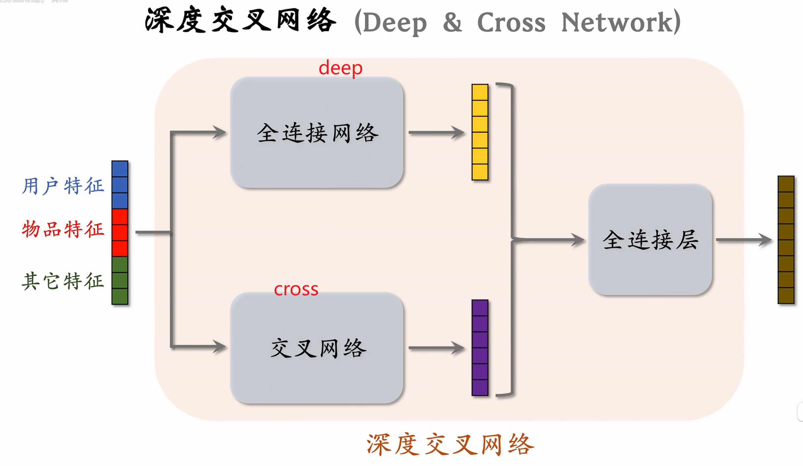

# 特征交叉03：LHUC（PPNet）

Learning Hidden Unit Contributions (LHUC)，LHUC起源于语音识别

快手将LHUC应用在推荐精排，称作PPNet

只能用于精排

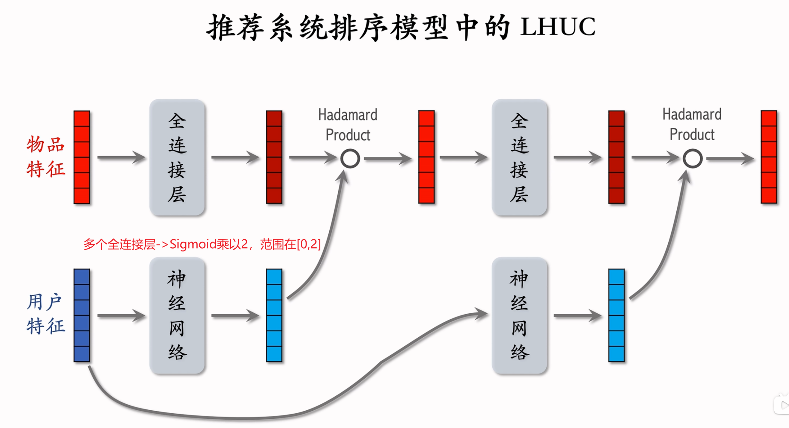

物品特征融合了用户的特征，可以更加个性化

# 特征交叉04：SENet 和 Bilinear交叉、FiBiNet

**SENet**

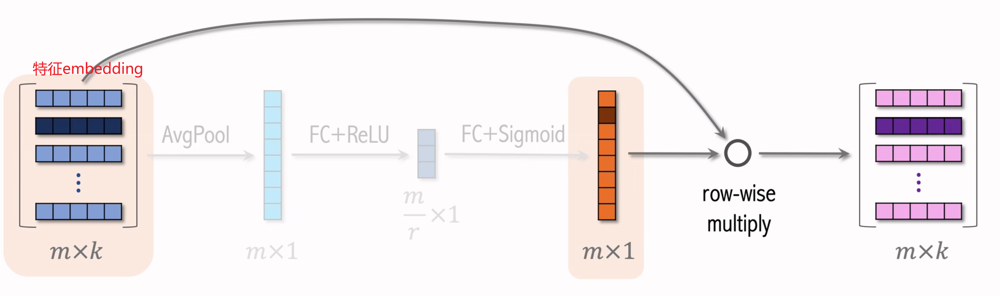

+ SENet对离散特征做field-wise加权。 
+ Field：
  + 用户ID Embedding是64维向量。
  + 64个元素算一个field，获得相同的权重。
+ 如果有m个fields，那么权重向量是m维

**Field间特征交叉**

内积和哈达玛乘积是最简单的特征交叉方法

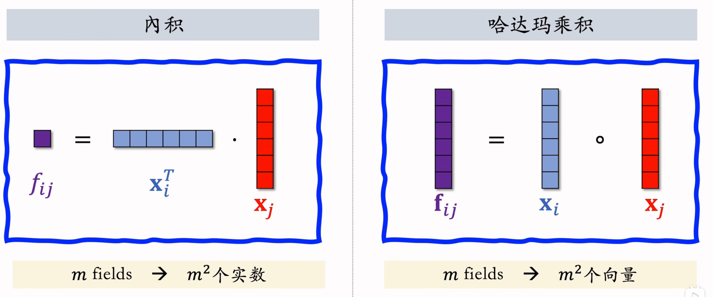

**Bilinear Cross（内积）**

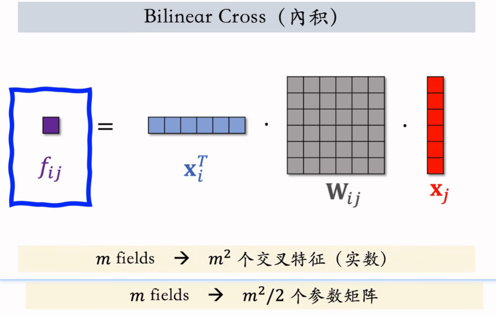

**Bilinear Cross（哈达玛乘积）**

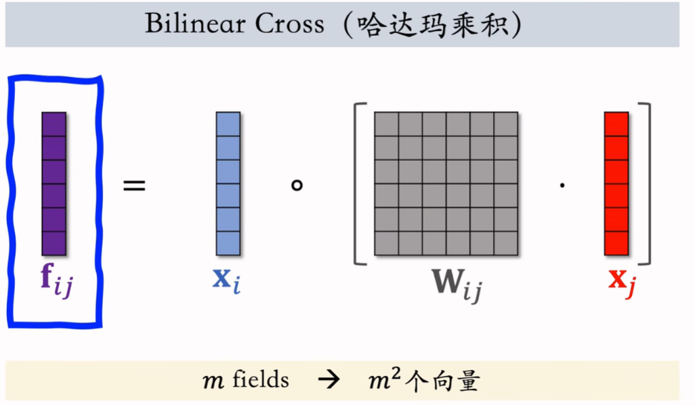

在实践中最好人工制定一部分特征进行交叉

**FiBiNet**

结合SENet和Bilinear Cross

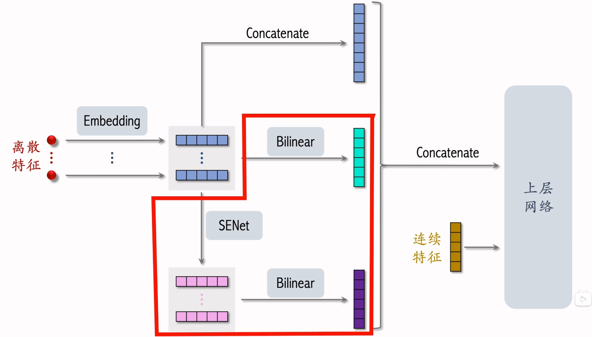

# 行为序列01：用户历史行为序列建模

**LastN特征**

+ LastN：用户最近的n次交互（点击、，点赞等）的物品ID
+ 对LastN物品ID做embedding,得到n个向量。
+ 把n个向量取平均作为用户的一种特征。
+ 适用于召回双塔模型、粗排三塔模型、精排模型。

# 行为序列02：DIN模型（注意力机制）

**DIN模型**

+ 对于某候选物品，计算它与用户LαstN物品的相似度。
+ 以相似度为权重，求用户LastN物品向量的加权和，结果是一个向量。
+ 把得到的向量作为一种用户特征，输入排序模型，预估（用户，候选物品)的点击率、点赞率等指标 
+ 本质是注意力机制（attention)

 **简单平均V.S.注意力机制**

+ 简单平均和注意力机制都适用于精排模型。
+ 简单平均适用于双塔模型、三塔模型。
  + 简单平均只需要用到LastN，属于用户自身的特征。
  + 把LastN向量的平均作为用户塔的输入。
+ 注意力机制不适用于双塔模型、三塔模型。
  + 注意力机制需要用到LαstN+候选物品。
  + 用户塔看不到候选物品，不能把注意力机制用在用户塔。

# 行为序列03：SIM模型（长序列模型）

**DIN模型的缺点**

+ 注意力层的计算量正比于n（用户行为序列的长度)
+ 只能记录最近几百个物品，否则计算量太大。
+ 缺点：关注短期兴趣，遗忘长期兴趣。

**如何改进DIN?**

+ 目标：保留用户长期行为序列（n很大)，而且计算量不会过大。
+ 改进DIN:
  + DIN对LastN向量做加权平均，权重是相似度。
  + 如果某LastN物品与候选物品差异很大，则权重接近零。
  + 快速排除掉与候选物品无关的LastN物品，降低注意力层的计算量。

**SIM模型**

+ 保留用户长期行为记录，的大小可以是几千。
+ 对于每个候选物品，在用户LastN记录中做快速查找，找到k个相似物品。
+ 把LastN变成TopK，然后输入到注意力层 SIM模型减小计算量（从n降到k)。

**第一步：查找**

+ 方法一：Hard Search
  + 根据候选物品的类目，保留LastN物品中类目相同的。
  + 简单，快速，无需训练
+ 方法二：Soft Search
+ 把物品做embedding，变成向量。把候选物品向量作为query，做k近邻查找，保留LastN物品中最接近的k个。
+ 效果更好，编程实现更复杂

**第二步：注意力机制**

把LastN变成TopK

使用时间信息：

+ 用户与某个LastN物品的交互时刻距今为δ。
+ 对δ做离散化，再做embedding，变成向量d。
+ 把两个向量做concatenation，表征一个LastN物品
  + 向量x是物品embedding。
  + 向量d是时间的embedding。

**为什么SIM使用时间信息？**

+ DIN的序列短，记录用户近期行为。 
+ SIM的序列长，记录用户长期行为。
+ 时间越久远重要性越低。

# 重排01：物品相似性的度量、提升多样性的方法

基于物品属性标签的表征

基于物品向量表征

基于图文内容的物品表征

# 重排02：MMR多样性算法

Maximal Marginal Relevance (MMR)，综合考虑了物品的价值和多样性

从n个物品中选出k个，既要有高精排分数也要有多样性。

**MMR多样性算法**

1. 已选中的物品S初始化为空集，未选中的物品R初始化为全集{1，…，n}
2. 选择精排分数rewardi 最高的物品，从集合R移到S。
3. 做k一1轮循环： 
   + 计算集合R中所有物品的分数{MRi}。
   + 选出分数最高的物品，将其从R移到S。

**滑动窗口**

直观理解：如果物品离得比较近，应该有较大相似性，但离得远就没必要去强求更大的多样性

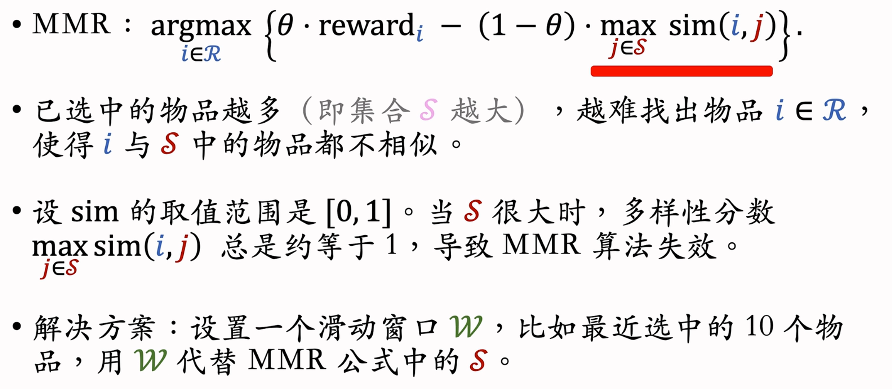

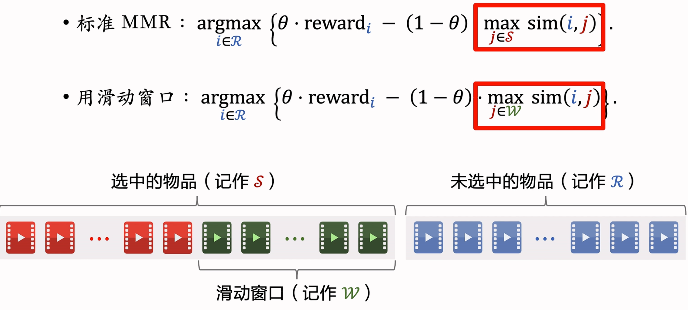

# 重排03：业务规则约束下的多样性算法

**重排的规则**

+ 规则：最多连续出现k篇某种笔记
  + 小红书推荐系统的物品分为图文笔记、视频笔记。
  + 最多连续出现k=5篇图文笔记，最多连续出现k=5篇视频笔记。
  + 如果排i到i+4的全都是图文笔记，那么排在i+5的必须是视频笔记
+ 规则：每k篇笔记最多出现1篇某种笔记
  + 运营推广笔记的精排分会乘以大于1的系数(boost)帮助笔记获得更多曝光。
  + 为了防止boost影响体验，限制每k=9篇笔记最多出现1篇运营推广笔记
  + 如果排第i位的是运营推广笔记，那么排 i+1 到 i+ 8的不能是运营推广笔记。
+ 规则：前t篇笔记最多出现k篇某种笔记
  + 排名前t篇笔记最容易被看到，对用户体验最重要。(小红书的top4为首屏)
  + 小红书推荐系统有带电商卡片的笔记，过多可能会影响体验。
  + 前 t=1篇笔记最多出现k= 0篇带电商卡片的笔记。
  + 前 t=4篇笔记最多出现k=1篇带电商卡片的笔记

**MMR + 重排规则**

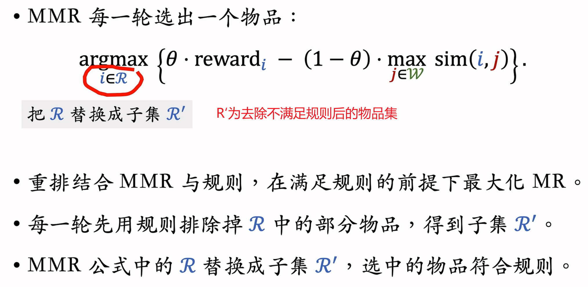

# 重排04：DPP多样性算法（上）

目前公认的最好多样性算法

# 重排05：DPP多样性算法（下）

**多样性问题**

+ 精排给n个物品打分：reward1,…,rewardn。 
+ n个物品的向量表征：v1,…,vn∈Rd。
+ 从n个物品中选出k个物品，组成集合S。
  + 价值大：分数之和∑ rewardj越大越好。
  + 多样性好：S中k个向量组成的超平形体P(S)的体积越大越好。

**贪心算法求解**

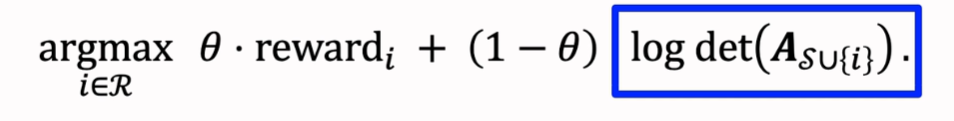

**滑动窗口**

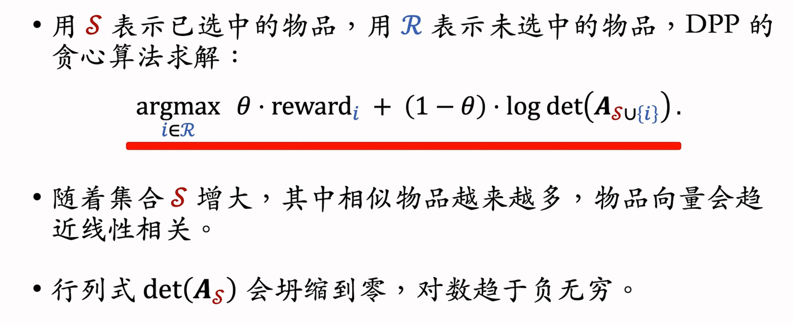

# 物品冷启01：优化目标 & 评价指标

**优化冷启动的目标**

1. 精准推荐：克服冷启的困难，把新笔记推荐给合适的用户，不引起用户反感
2. 激励发布：流量向低曝光新笔记倾斜，激励作者发布
3. 挖掘高潜：通过初期小流量的试探，找到高质量的笔记给与流量倾斜

**冷启动的评价指标**

+ 作者侧指标：
  + 发布渗透率、人均发布量。
+ 用户侧指标：
  + 新笔记指标：新笔记的点击率、交互率。
  + 大盘指标：消费时长、日活、月活。
+ 内容侧指标：
  + 高热笔记占比。

**冷启的重要优化目标是促进发布，增大内容池**

**冷启动主要有两方面的技术**

+ 一个是优化推荐全链路，包括召回和排序，每一个环节都针对新笔记做优化，让新笔记有足够多的机会走完链路被曝光，还要尽量让新笔记的推荐做的准，不要引起用户的反感
+ 另一方面的技术是流量调控，也就是流量怎么在新笔记和老笔记之间分配。
  

# 物品冷启02：简单的召回通道

**冷启召回的困难**

+ 缺少用户交互，还没学好笔记ID embedding，导致双塔模型效果不好
+ 缺少用户交互，导致ItemCF不适用

**召回通道**

+  ItemCF召回(不适用)
+ 双塔模型(改造后适用)
+ 类目、关键词召回(适用)
+ 聚类召回(适用)
+ Look-Alike召回(适用)

**改造双塔模型应对冷启动**

第一种方案是让新笔记使用**defaulting embedding**：新笔记自己的ID embedding向量还没有学到，不如大家先共享一个默认的向量，**这个向量是学出来的**，而不是随机初始化或者全0初始化学出来的，比随机初始化的全0初始化更好。

另一种初始化新笔记ID embedding的方法是利用相似物品的embedding向量，当新笔记发布之后，查找top k内容最相似的**高曝光**笔记，找到的**K篇高曝光笔记的embedding向量取平均**作为新笔记的embedding

**多个向量召回池**

+ 多个召回池，让新笔记有更多曝光机会
  + 1小时新笔记，
  + 6小时新笔记，
  + 24小时新笔记，
  + 30天笔记。
+ 共享同一个双塔模型，那么多个召回池不增
  加训练的代价。

**类目召回通道**

系统维护一份**从类目到笔记的索引**，**每个类目后面是一个笔记的列表**，按照发布时间倒排，最新发布的笔记排在最前面，系统根据这位用户的画像，知道他**对哪些类目感兴趣**，取回这些类目。

**基于关键词的召回**

基于关键词的召回原理跟类目召回是完全一样的，索引上的key是关键词，每个关键词后面有一个笔记列表，按照时间倒排，给用户做推荐的时候，根据用户画像上用户感兴趣的关键词做召回。

**类目召回和关键词召回的缺点**

+ 缺点1：只对刚刚发布的新笔记有效
  + 取回某类目/关键词下最新的k篇笔记
  + 发布几小时之后，就再没有机会被召回。
+ 缺点2：弱个性化，不够精准

# 物品冷启03：聚类召回

**如果用户喜欢一篇笔记，那么他会喜欢内容相似的笔记。**

这个可以用神经网络来做事，先训练一个神经网络。
基于笔记的类目和图文内容，把笔记映射到向量，
**向量的相似度就是笔记内容相似度。**

我们对笔记向量做聚类，划分为1000个cluster，
记录每个cluster的中心方向，对笔记向量做聚类，
所以这种召回通道叫做聚类召回，

**线上召回**

+ 给定用户ID，找到他的last-n交互的笔记列表，把这些笔记作为种子笔记
+ 把每篇种子笔记映射到向量，寻找最相似的cluster（知道了用户对哪些cluster感兴趣。）
+ 从每个cluster 的笔记列表中，取回最新的m篇笔记
+ 最多取回mn篇新笔记

新笔记聚类召回跟类目召回有相同的**缺点**，都是只对刚刚发布的新笔记有效。
一篇笔记发布一两个小时之后，就不太可能被召回了。

**内容相似度模型**

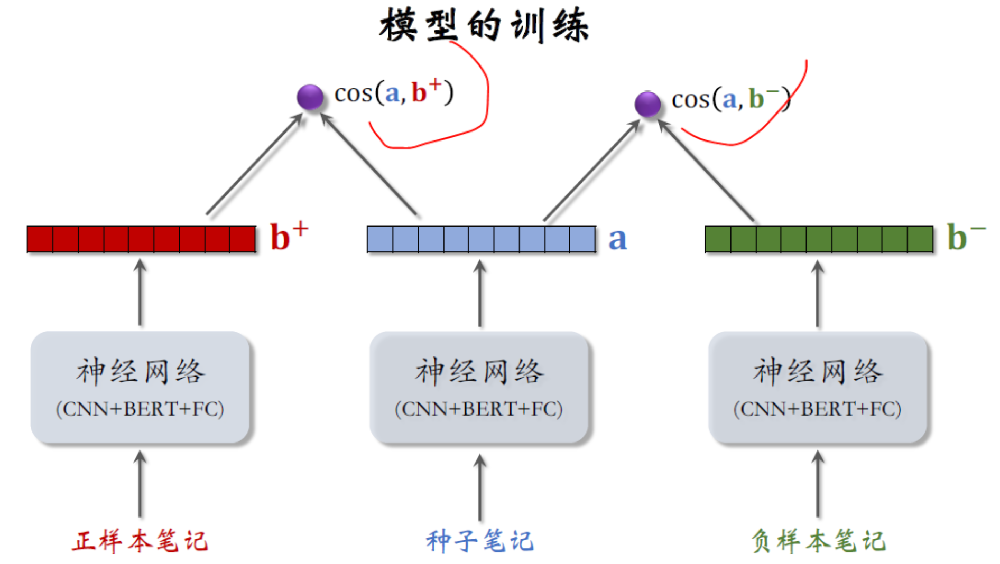

做训练的目标是这样的，
让种子笔记跟正样本的相似度尽量大，
让种子笔记跟负样本的相似度尽量小，
也就是让这两个运行相似度的差尽量大，这是triplelet hinge loss。

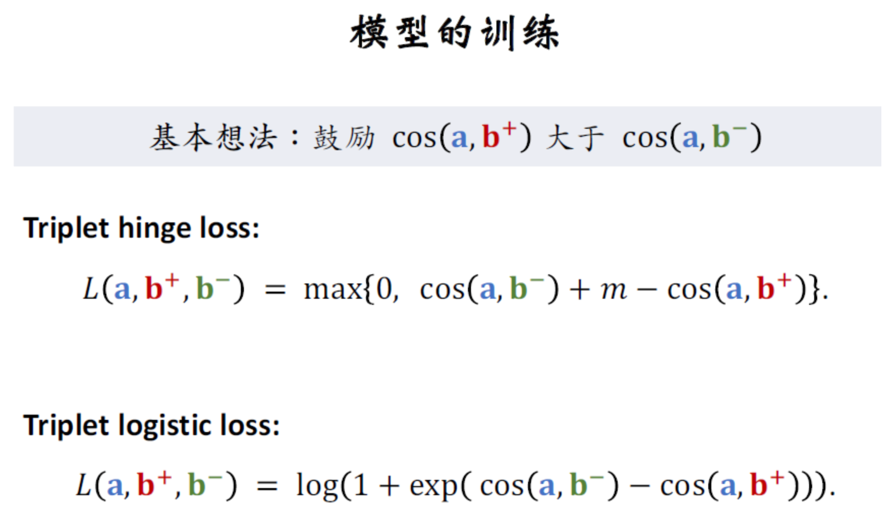

**正负样本的选取**

**正样本：**

+ 方法一：人工标注二元组的相似度

+ 方法二：算法自动选正样本

  筛选条件：

  + 只用高曝光笔记作为二元组（因为有充足的用户交互信息）
  + 两篇笔记有相同的二级类目，比如都是“菜谱教程”。
  + 用ItemCF的物品相似度选正样本。

**负样本：**

从全体笔记中随机选出满足条件的：

+ 字数较多 (神经网络提取的文本信息有效)
+ 笔记质量高，避免图文无关

聚类召回的**基本思想是根据用户的点赞、收藏、转发、记录推荐内容相似的笔记**，
想做聚类召回，需要线下训练一个多模态神经网络，它可以把图文内容映射到向量，
通过比较向量的cos相似度就知道哪两个向量最相似。

# 物品冷启04：Look-Alike 召回，Look-Alike人群扩散

look like本身就起源于互联网广告

假设有个广告主想精准的给100万个目标受众投放广告

假设广告主是特斯拉，他们自己知道model 3的典型用户是这样的。
年龄在25到35，
都是年轻人，
受过良好教育，
学历至少都是本科。
特斯拉车主大多关注科技数码，
而且普遍喜欢苹果的电子产品，

把符合全部条件的用户都圈出来，重点在这个人群中投放广告，
满足所有条件的受众，**被称作种子用户。**

这样的用户数量不会很多，可能只有几万人【很多人是不会给你写标签的】，但是潜在的符合条件的用户可能会很多。
但是我们缺少他们的部分信息，没有办法找到他们。

比方说多数的用户不标自己的学历和年龄，
广告主想给100万用户投放广告，但我们才圈出几万人。
我们该如何发现100万潜在的目标用户？

这就要用到look like人群扩散，寻找跟种子用户相似的用户，把找到的用户称作look like。
**最重要的问题在于如何定义两个用户之间的相似度。**

+ UserCF：两个用户有共同的兴趣点。
+ Embedding：两个用户向量的cosine较大

**Look-Alike⽤于新笔记召回**

如果用户有点击、点赞、收藏、转发的行为，说明用户对笔记可能感兴趣
把有点击、点赞、收藏、转发行为的用户作为**新笔记的种子用户，**
我们知道这些种子用户对新笔记感兴趣。

如果一个用户跟种子用户相似，那么他也可能对这篇新笔记感兴趣，可以把新笔记推荐给他。

这种方法就叫做**look like人群扩散，**
系统对新笔记的推荐通常不太准，有交互行为的用户数量很少。
**一旦有交互行为，我们就要充分利用这种信号**，让推荐变得更准，
取回每个种子用户的embedding向量。

**我们可以复用双塔模型渠道的用户向量，然后取这些用户向量的均值，得到一个向量，**

把得到的**这个向量作为新笔记的表征，这个向量反映出什么样的用户对该笔记感兴趣**。

这个特征向量是要做近线更新的，**近线的意思是不用实时更新，能做到分钟级的更新就可以了。**

**线上召回**是这么做的，把新笔记的特征向量都放在向量数据库里，这些向量数据库都支持最近零查找。

如果有用户刷一下小红书，我们就给这个用户做一次推荐，
用双塔模型计算这个**用户的特征向量【这个并是上面咱们求出来的look alike平均用户向量，这就是一个正常用户】**，
拿用户的特征向量做QUERY，在向量数据库中做最近零查找。

返回几十篇笔记，**这个召回通道就叫做look like。**

# 物品冷启05：流量调控

做冷启动最重要的抓手有两个，

+ 优化全链路（包括召回和排序）
+ 流量调控(流量怎么在新物品、老物品中分配)

**扶持新笔记主要有两个目的**

+ 目的1：促进发布，增大内容池
  + 新笔记获得的曝光越多，作者创作积极性越高。
  + 反映在发布渗透率、人均发布量
+ 目的2：挖掘优质笔记
  + 做探索，让每篇新笔记都能获得足够曝光。
  + 挖掘的能力反映在高热笔记占比。

推荐系统主要分发年龄小于30天的笔记，
超过30天的笔记，通常不会出现在推荐的结果里，只能通过搜索和其他渠道曝光，
假如采用完全的自然分发，让新老笔记公平竞争，
那么年龄小于24小时的新笔记的曝光机会非常少，只有1/30，

**但我们会给新笔记大力度的扶持，让新笔记有足够多的机会曝光。**

小红书年龄小于24小时的新笔记的曝光占比具体是多少，我不方便说，
但这个数字远远大于1/30，也就是说新笔记的流量远远大于自然分发的流量。

**流量调控技术的发展**

1. 在推荐结果中强插新笔记（字面意思）
2. 对新笔记的排序分数做提权(boost)
3. 通过提权，对新笔记做保量
4. 差异化保量

**新笔记提权（boost）**

+ 目标：让新笔记有更多机会曝光
  + 如果做自然分发，24小时新笔记占比为1/30。
  + 做人为干涉，让新笔记占比大幅提升
+ 干涉粗排、重排环节，给新笔记提权

+ 优点：容易实现，投入产出比好。
+ 缺点：
  + 曝光量对提权系数很敏感
  + 很难精确控制曝光量，容易过度曝光和不充分曝光。

**新笔记保量**

+ 保量：不论笔记质量高低-都保证24小时获得100次曝光。
+ 在原有提权系数的基础上，乘以额外的提权的系数

比如：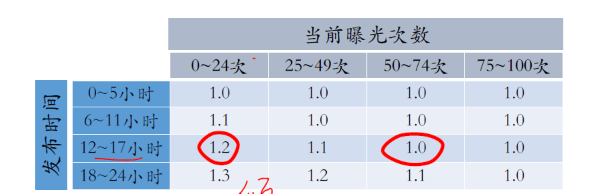

**动态提权保量**

+ 用下面四个值计算提权系数
  + 目标时间：比如24小时
  + 目标曝光：比如100次
  + 发布时间：比如笔记已经发布12小时
  + 已有曝光：比如笔记已经获得20次曝光

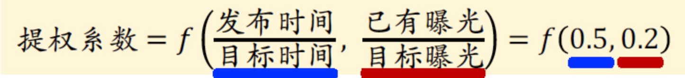

**保量的难点**

+ 保量成功率远低于100%
+ 很多笔记在24小时达不到100次曝光
+ 召回、排序存在不足
+ 提权系数调得不好
+ 线上环境变化会导致保量失败
  + 线上环境变化：新增召回通道、升级排序模型、改变重排打散规则····
  + 线上环境变化后，需要调整提权系数。

**给新笔记分数boost越多，对新笔记越有利?**

+ 好处：分数提升越多，曝光次数越多
+ 坏处：把笔记推荐给不太合适的受众。
  + 点击率、点赞率等指标会偏低
  + 长期会受推荐系统打压，难以成长为热门笔记

在笔记冷启动阶段，分数提升越多，对新笔记的曝光次数越有利，
但是过了冷启动阶段之后，之前大力度的扶持可能会起到反作用。

**差异化保量**

+ 保量：不论新笔记质量高低，都做扶持，在前24小时给100次曝光
+ 差异化保量：不同笔记有不同保量目标，普通笔记保100次曝光，内容优质的笔记保100~500次曝光。

**差异化保量的依据是笔记内容质量和作者质量【这时候体现质量和美学质量评价的好处了】**

+ 基础保量：24小时100次曝光
+ 内容质量：用模型评价内容质量高低；给予额外保量目标，上限是加200次曝光。
+ 作者质量：根据作者历史上的笔记质量，给予额外保量目标，上限是加200次曝光。
+ 一篇笔记最少有100次保量，最多有500次保量。

**总结**

+ 流量调控：流量怎么在新老笔记之间分配。
+ 扶持新笔记单独的召回通道、在排序阶段提权
+ 保量：帮助新笔记在前24小时获得100次曝光
+ 差异化保量：根据内容质量、作者质量，决定保量目标。

# 物品冷启06：冷启的AB测试

可以结合视频或者博客理解本章内容

**新笔记冷启动AB测试**

**用户侧实验**

+ 限定：保量100次曝光
+ 假设：新笔记曝光越多，用户使用APP时长越低。
+ 新策略：把新笔记排序时的权重增大两倍
+ 结果（只看消费指标）
  + AB测试的diff是负数×策略组不如对照组）
  + 如果推全diff会缩小（比如-2%→-1%）

**作者侧实验**

方案一：

缺点：新笔记之间会抢流量

+ 设定：
  + 新老笔记走各自队列，没有竞争。
  + 重排分给新笔记1/3流量，分给老笔记2/3流量
+ 新策略：把新笔记的权重增大两倍
+ 结果（只看发布指标)：
  + AB测试的diff是正数（策略组优于对照组）。
  + 如果推全，diff会消失（比如2%→0）。

方案二：

缺点：新笔记和老笔记抢流量

+ 设定：新老笔记自由竞争。
+ 新策略：把新笔记排序时的权重增大两倍。
+ AB测试时，50%新笔记（带策略)跟100%老笔记抢流量。
+ 推全后，100%新笔记（带策略）跟100%老笔记抢流量。
+ 作者侧AB测试结果与推全结果有些差异。

方案三：

+ 优点：新笔记的两个桶不抢流量，作者侧实验结果更可信。
+ 相同：新笔记剂老笔记抢流量，作者侧AB测试结果与推全结果有些差异。
+ 缺点：新笔记池减小一半，对用户体验造成负面影响

小结

+ 冷层的AB测试需要观测作者发布指标和用户消费指标。
+ 各种AB测试的方案都有缺陷。（小红书有更好的方案，但也不完美。)
+ 设计方案的时候，问自己几个问题：
  + 实验组、对照组新笔记会不会抢流量？
  + 新笔记、老笔记怎么抢流量？
  + 同时隔离笔记、用户会不会让内容池变小？
  + 如果对新笔记做保量，会发生什么？

# 涨指标的方法01：概述

**推荐系统的评价指标**

+ 日活用户数(DAU)和留存是最核心的指标。
+ 目前工业界最常用LT7和LT30衡量留存。
+ 其他核心指标：用户使用时长、总阅读数（即总点击数)、总曝光数。这些指标的重要性低于DAU和留存。
+ 非核心指标：点击率、交互率、等等。
+ 对于UGC平台，发布量和发布渗透率也是核心指标。

**涨指标的方法有哪些？**

1. 改进召回模型，添加新的召回模型
2. 改进粗排和精排模型
3. 提升召回、粗排、精排中的多样性
4. 特殊对待新用户、低活用户等特殊人群
5. 利用关注、转发、评论这三种交互行为

# 涨指标的方法02：召回

+ 推荐系统有几十条召回通道，它们的召回总量是固定的。总量越大，指标越好，粗排计算量越大
+ 双塔模型(two-tower)和item-to-item(I2I)是最重要的两类召回模型，占据召回的大部分配额
+ 有很多小众的模型，占据的配额很少。在召回总量不变的前提下，添加某些召回模型可以提升核心指标
+ 有很多内容池，比如30天物品、1天物品、6小时物品、新用户优质内容池、分人群内容池
+ 同一个模型可以用于多个内容池，得到多条召回通道

改进双塔模型：

1. 方向1：优化正样本、负样本

   + 简单正样本：有点击的（用户，物品)二元组。

   + 简单负样本：随机组合的（用户，物品)二元组
   + 困难负样本：排序靠后的（用户，物品)二元组

2. 方向2：改进神经网络结构

   + Baseline：用户塔、物品塔分别是全连接网络，各输出一个向量，分别作为用户、物品的表征。
   + 改进：用户塔、物品塔分别用DCN代替全连接网络。
   + 改进：在用户塔中使用用户行为序列(last-n)。
   + 改进：使用多向量模型代替单向量模型。（标准的双塔模型也叫单向量模型。)

3. 方向3：改进模型的训练方法

   + Baseline：做二分类，让模型学会区分正样本和负样本。
   + 改进：结合二分类、batch内负采样。（对于batch内负采样，需要做纠偏。)
   + 改进：使用自监督学习方法，让冷门物品的embedding学得更好。

**Item to Item**

+ I2I是一大类模型，基于相似物品做召回。
+ 最常见的用法是U2I2I(user->item->item)
+ 如何计算物品相似度？
+ 方法1：ItemCF及其变体
  + 一些用户同时喜欢物品i1和i2，则认为i1和i2相似。 
  + ItemCF、Online ItemCF、Swing、Online Swing都是基于相同的思想。
  + 线上同时使用上述4种I2I模型，各分配一定配额。
+ 方法2：基于物品向量表征，计算向量相似度。（双塔模型、图神经网络均可计算物品向量表征。)

**小众的召回模型**

+ U2U2I(user>user→item)：已知用户u1与u2相似，且 u2喜欢物品i，那么给用户u1推荐物品i。
+ U2A2I(user→author>item)：已知用户u喜欢作者a，且a发布物品i，那么给用户u推荐物品i。
+ U2A2A2I(user>author>author>item)：已知用户u喜欢作者a1，且a1与a2相似，a2发布物品i，那么给用户u推荐物品i。

**总结**

+ 双塔模型：优化正负样本、改进神经网络结构、改进训练的方法。 
+ I2I模型：同时使用ItemCF及其变体、使用物品向量表征计算物品相似度。
+ 添加小众的召回模型，比如PDN、Deep Retrieval、SINE M2GRL等模型
+ 在召回总量不变的前提下，调整各召回通道的配额。（可以让各用户群体用不同的配额。)

# 涨指标的方法03：排序模型

1. 精排模型的改进
2. 粗排模型的改进
3. 用户行为序列建模
4. 在线学习
5. 老汤模型

**精排模型改进**

**基座：**

+ 基座的输入包括离散特征和连续特征，输出一个向量，作为多目标预估的输入。
+ 改进1：基座加宽加深，计算量更大，预测更准确。
+ 改进2：做自动的特征交叉，比如bilinear和LHUC[2]
+ 改进3：特征工程，比如添加统计特征、多模态内容特征。

**多目标预估：**

+ 基于基座输出的向量，同时预估，点击率等多个目标。
+ 改进1：增加新的预估目标，并把预估结果加入融合公式。
+ 改进2：MMoE、PLE等结构可能有效，但往往无效
+ 改进3：纠正position bias可能有效，也可能无效。

**粗排模型的改进**

+ 粗排的打分量比精排大10倍，因此粗排模型必须够快。
+ 简单模型：多向量双塔模型，同时预估点击率等多个目标
+ 复杂模型：三塔模型效果好，但工程实现难度较大。

+ 蒸馏精排训练粗排，让粗排与精排更一致。
+ 方法1：pointwise蒸馏
  + 设y是用户真实行为，设p是精排的预估。
  + 用（y+p）/2作为排拟合的目标。
  + 例：对于点击率目标，用户有点击（y=1)，精排预估p=0.6，用（y+p）/2=0.8作为粗排拟合的点击率目标。 
+ 方法2：pairwise或listwise蒸馏
  + 给定k个候选物品，按照精排预估做排序。
  + 做learning to rank(LTR)，让粗排拟合物品的序（而非值）
  + 例：对于物品i和j，精排预估点击率为pi>pj。LTR鼓励粗排预估点击率满足qi>qj否则有惩罚。LTR通常使用pairwise logistic loss。
+ 优点：粗精排一致性建模可以提升核心指标
+ 缺点：如果精排出bug,精排预估值p有偏，会污染粗排训练数据。

**用户行为序列建模**

+ 最简单的方法是对物品向量取平均作为一种用户特征。 
+ DIN使用注意力机制，对物品向量做加权平均。
+ 工业界目前沿着SIM的方向发展。先用类目等属性筛选物品，然后用DIN对物品向量做加权平均。

+ 改进1：增加序列长度，让预测更准确，但是会增加计算成本和推理时间。
+ 改进2：筛选的方法，比如用类目、物品向量表征聚类。
+ 改进3：对用户行为序列中的物品，使用ID以外的一些特征。
+ 概括：沿着SIM的方向发展，让原始的序列尽量长，然后做筛选降低序列长度，最后将筛选结果输入DIN。

**在线学习**

全量学习和增量学习

**老汤模型**

+ 用每天新产生的数据对模型做1 epoch的训练。
+ 久而久之，老模型训练得非常好，很难被超过。对模型做改进，重新训练，很难追上老模型…
+ 问题1：如何快速判断新模型结构是否优于老模型？（不需要追上线上的老模型，只需要判断新老模型谁的结构更优。)
  + 对于新、老模型结构，都随机初始化模型全连接层。 
  + Embedding层可以是随机初始化，也可以是复用老模型训练好的参数。
  + 用n天的数据训练新老模型。（从旧到新，训练1 epoch)
  + 如果新模型显著优于老模型，新模型很可能更优。
  + 只是比较新老模型结构谁更好，而非真正追平老模型。
+ 问题2：如何更快追平、超过线上的老模型？（只有几十天的数据，新模型就能追上训练上百天的老模型。)
  + 已经得出初步结论，认为新模型很可能优于老模型。用几十天的数据训练新模型，早日追平老模型
  + 方法1：尽可能多地复用老模型训练好的embedding层，避免随机初始化embedding层。(Embedding层是对用户、物品特点的“记忆”，比全连接层学得慢。)
  + 方法2：用老模型做teacher，蒸馏新模型。（用户真实行为是y’老模型的预测是卫，用（y+p）/2作为训练新模型的目标。)

**总结**

+ 精排模型：改进模型基座（加宽加深、特征交叉、特征工程)，改进多目标预估（增加新目标、MMoB、position bias)
+ 粗排模型：三塔模型（取代多向量双塔模型），粗精排一致性建模
+ 用户行为序列建模：沿着SM的方向迭代升级，加长序列长度改进筛选物品的方法。
+ 在线学习：对指标提升大，但是会降低模型迭代升级效率。
+ 老汤模型制约模型迭代升级效率，需要特殊技巧。

# 涨指标的方法04：多样性

**精排多样性**

+ 精排阶段，结合兴趣分数和多样性分数对物品排序
+ 常用MMR、DPP等方法计算多样性分数，精排使用滑动窗口，粗排不使用滑动窗口。
+ 除了多样性分数，精排还使用打散策略增加多样性。

**粗排多样性**

+ 粗排给5000个物品打分，选出500个物品送入精排。
+ 提升粗排和精排多样性都可以提升推荐系统核心指标。
+ 根据Si对5000个物品排序，分数最高的200个物品送入精排
+ 对于剩余的4800个物品，对每个物品i计算兴趣分数Si和多样性分数di
+ 根据Si+di对剩余4800个物品排序，分数最高的300个物品送入精排 

**召回的多样性**

双塔模型：添加噪声

+ 用户塔将用户特征作为输入，输出用户的向量表征；然后做ANN检索，召回向量相似度高的物品。
+ 线上做召回时（在计算出用户向量之后，在做ANN检索之前)，往用户向量中添加随机噪声。
+ 用户的兴趣越窄（比如用户最近交互的个物品只覆盖少数几个类目)，则添加的噪声越强。
+ 添加噪声使得召回的物品更多样，可以提升推荐系统核心指标。

双塔模型：抽样用户行为序列

+ 用户最近交互的个物品（用户行为序列)是用户塔的输入。
+ 保留最近的r个物品（r<<n)
+ 从剩余的n-r个物品中随机抽样t个物品(t<<n)。(可以是均匀抽样，也可以用非均匀抽样让类目平衡。)
+ 将得到的r+t个物品作为用户行为序列，而不是用全部个物品
+ 抽样用户行为序列为什么能涨指标？
  + 一方面，注入随机性，召回结果更多样化。
  + 另一方面’可以非常大，可以利用到用户很久之前的兴趣

**U2I2I：抽样用户行为序列** 

+ U2I2I(user→item→item)中的第一个item是指用户最近交互的n个物品之一，在U2I2I中叫作种子物品。
+ n个物品覆盖的类目数较少，且类目不平衡。
+ 做非均匀随机抽样，从n个物品中选出t个，让类目平衡。(想法和效果与双塔中的用户行为序列抽样相似。)
+ 用抽样得到的t个物品（代替原本的n个物品)作为U2I2I的种子物品。
+ 一方面，类目更平衡，多样性更好。另一方面，n可以更大，覆盖的类目更多。

**探索流量**

+ 每个用户曝光的物品中有2%是非个性化的，用作兴趣探索
+ 维护一个精选内容池，其中物品均为交互率指标高的优质物品。（内容池可以分人群，比如30~40岁男性内容池。）
+ 从精选内容池中随机抽样几个物品，跳过排序，直接插入最终排序结果。
+ 兴趣探索在短期内负向影响核心指标，但长期会产生正向影响

**总结**

+ 精排：结合兴趣分数和多样性分数做排序；做规则打散。
+ 粗排：只用兴趣分数选出部分物品；结合兴趣分数和多样性分数选出部分物品。
+ 召回：往双塔模型的用户向量添加噪声；对用户行为序列做非均匀随机抽样（对双塔和U2I2I都适用)。
+ 兴趣探索：保留少部分的流量给非个性化推荐。

# 涨指标的方法05：特殊用户人群

**为什么要特殊对待特殊人群？**

1. 新用户、低活用户的行为很少，个性化推荐不准确。
2. 新用户、低活用户容易流失，要想办法促使他们留存
3. 特殊用户的行为（比如，点击率、交互率)不同于主流用户，基于全体用户行为训练出的模型在特殊用户人群上有偏。

**涨指标的方法**

1. 构造特殊内容池，用于特殊用户人群的召回。
2. 使用特殊排序策略，保护特殊用户。
3. 使用特殊的排序模型，消除模型预估的偏差。

**特殊内容池**
为什么需要特殊内容池？

+ 新用户、低活用户的行为很少，个性化召回不准确。（既然个性化不好，那么就保证内容质量好。)
+ 针对特定人群的特，点构造特殊内容池，提升用户满意度。（例如，对于喜欢留评论的中年女性，构造促评论内容池，满足这些用户的互动需求。)

+ 方法1：根据物品获得的交互次数、交互率选择优质物品。
+ 方法2：做因果推断，判断物品对人群留存率的贡献，根据贡献值选物品。

**特殊内容池的召回**

+ 通常使用双塔模型从特殊内容池中做召回。
  + 双塔模型是个性化的。
  + 对于新用户，双塔模型的个性化做不准。
  + 靠高质量内容、弱个性化做弥补。
+ 额外的训练代价？
  + 对于正常用户，不论有多少内容池，只训练一个双塔模型
  + 对于新用户，由于历史交互记录很少，需要单独训练模型
+ 额外的推理代价？
  + 内容池定期更新，然后要更新ANN索引。
  + 线上做召回时，需要做ANN检索。
  + 特殊内容池都很小（比全量内容池小10~100倍)，所以需要的额外算力不大。

**特殊的排序策略**

排除低质量物品

+ 对于新用户、低活用户这样的特殊人群，业务上只关注留存，不在乎消费（总曝光量、广告收入、电商收入)。
+ 对于新用户、低活用户，少出广告、甚至不出广告。
+ 新发布的物品不在新用户、低活用户上做探索。
  + 物品新发布时，推荐做得不准，会损害用户体验。
  + 只在活跃的老用户上做探索，对新物品提权(boost)。
  + 不在新用户、低活用户上做探索，避免伤害用户体验。

差异化融分公式

+ 新用户、低活用户的，点击、交互行为不同于正常用户。
+ 低活用户的人均，点击量很小；没有点击就不会有进一步的交互。
+ 低活用户的融分公式中’提高预估，点击率的权重（相较于普通用户)
+ 保留几个曝光坑位给预估，点击率最高的几个物品。
  + 例：精排从500个物品中选50个作为推荐结果，其中3个坑位给点击率最高的物品，剩余47个坑位由融分公式决定。
  + 甚至可以把点击率最高的物品排在第一，确保用户一定能看到。

差异化的排序模型

+ 方法1：大模型+小模型。
  + 用全体用户行为训练大模型，大模型的预估p拟合用户行为y
  + 用特殊用户的行为训练小模型，小模型的预估q拟合大模型的残差y-p。
  + 对主流用户只用大模型做预估p。
  + 对特殊用户，结合大模型和小模型的预估p+q。
+ 方法2：融合多个experts，类似MMoE。
  + 只用一个模型’模型有多个experts，各输出一个向量。
  + 对experts的输出做加权平均。
  + 根据用户特征计算权重。
  + 以新用户为例，模型将用户的新老、活跃度等特征作为输入，输出权重，用于对experts做加权平均。
+ 方法3：大模型预估之后，用小模型做校准
  + 用大模型预估点击率、交互率。
  + 将用户特征、大模型预估点击率和交互率作为小模型（例如GBDT)的输入。
  + 在特殊用户人群的数据上训练小模型，小模型的输出拟合用户真实行为。

错误做法

+ 每个用户人群使用一个排序模型，推荐系统同时维护多个大模型
+ 短期可以提升指标；维护代价大，长期有害。

**总结**

+ 召回：针对特殊用户人群，构造特殊的内容池，增加相应的召回通道
+ 排序策略：排除低质量物品，保护新用户和低活用户；特殊用户人群使用特殊的融分公式。
+ 排序模型：结合大模型和小模型，小模型拟合大模型的残差；只用一个模型，模型有多个experts;大模型预估之后，用小模型做校准。

# 涨指标的方法06：交互行为（关注、转发、评论）

**关注**

+ 对于一位用户，他关注的作者越多，则平台对他的吸引力越强
+ 用户留存率（r）与他关注的作者数量(f)正相关
+ 如果某用户的f较小，则推荐系统要促使该用户关注更多作者。

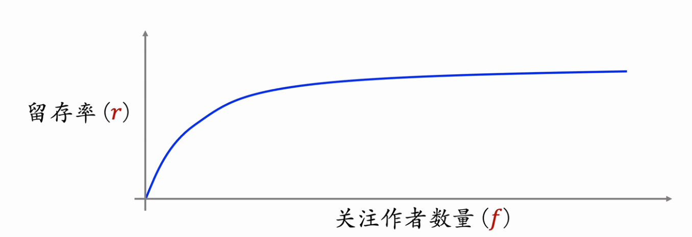

**关注量对留存的价值**
如何利用关注关系提升用户留存？

+ 方法1：用排序策略提升关注量
  + 对于用户u，模型预估候选物品i的关注率为 Pi
  + 设用户u已经关注了f个作者。
  + 我们定义单调递减函数W(f），用户已经关注的作者越多，则w(f）越小
  + 在排序融分公式中添加W(f）·Pi用于促关注。（如果f小且pi大则w(f）·Pi给物品i带来很大加分。）
+ 方法2：构造促关注内容池和召回通道
  + 这个内容池中物品的关注率高，可以促关注。
  + 如果用户关注的作者数f较小，则对该用户使用该内容池
  + 召回配额可以固定，也可以与f负相关。

**粉丝数对促发布的价值**

+ 用排序策略帮助低粉新作者涨粉
+ 某作者a的粉丝数（被关注数）为fa
+ 作者α发布的物品i可能被推荐给用户u，模型预估关注率为 Pui
+ 我们定义单调递减函数w(fa）作为权重；作者α的粉丝越多，则w(fa）越小。
+ 在排序融分公式中添加W（fa）·Pui帮助低粉作者涨粉

**隐式关注关系**

+ 召回通道 U2A2I：user → author →item 
+ 显式关注关系：用户u关注了作者α，将α发布的物品推荐给u。（点击率、交互率指标通常高于其他召回通道。）
+ 隐式关注关系：用户u喜欢看作者α发布的物品，但是u没有关注α。
+ 隐式关注的作者数量远大于显式关注。挖掘隐式关注关系，构造U2A2I召回通道，可以提升推荐系统核心指标

**转发**

**促转发(分享回流)**

+ A平台用户将物品转发到B平台，可以为A吸引站外流量
+ 推荐系统做促转发 (也叫分享回流）可以提升DAU和消费指标
+ 简单提升转发次数是否有效呢？
  + 模型预估转发率为p，融分公式中有一项w·p，让转发率大的物品更容易获得曝光机会
  + 增大权重W可以促转发，吸引站外流量，但是会负面影响点击
    率和其他交互率。

**KOL建模**

+ 目标：在不损害点击和其他交互的前提下，尽量多吸引站外流量。
+ 什么样的用户的转发可以吸引大量站外流量？其他平台的Key Opinion Leader (KOL)!
+ 如何判断本平台的用户是不是其他平台的KOL? 该用户历史上的转发能带来多少站外流量

**促转发的策略**

+ 目标：在不损害点击和其他交互的前提下，尽量多吸引站外流量
+ 识别出的站外KOL之后，该如何用于排序和召回?
+ 方法1：排序融分公式中添加额外的一项ku·Pui
  + ku：如果用户u是站外KOL，则ku大。
  + Pui：为用户u推荐物品i，模型预估的转发率。
  + 如果u是站外KOL，则多给他曝光他可能转发的物品
+ 方法2：构造促转发内容池和召回通道，对站外KOL生效

**评论**

**评论促发布**

+ UGC平台将作者发布量、发布率作为核心指标，希望作者多发布。
+ 关注、评论等交互可以提升作者发布积极性。
+ 如果新发布物品尚未获得很多评论，则给预估评论率提权，让物品尽快获得评论。
+ 排序融分公式中添加额外一项Wi·Pi
  + W;：权重，与物品讠已有的评论数量负相关
  + Pi：为用户推荐物品i，模型预估的评论率。

**评论的其他价值**

+ 有的用户喜欢留评论，喜欢跟作者、评论区用户互动
  + 给这样的用户添加促评论的内容池，让他们更多机会参与讨论。
  + 有利于提升这些用户的留存。
+ 有的用户常留高质量评论 (评论的点赞量高)
  + 高质量评论对作者、其他用户的留存有贡献。（作者、其他用户觉得这样的评论有趣或有帮助。
  + 用排序和召回策略鼓励这些用户多留评论

**总结：利用交互行为**

+ 关注：留存价值（让新用户关注更多作者，提升新用户留存）；发布价值（帮助新作者获得更多粉丝，提升作者发布积极性）；利用隐式关注关系做召回。
+ 转发：判断哪些用户是站外的KOL，利用他们转发的价值，吸引站外的流量。
+ 评论：发布价值（促使新物品获得评论，提升作者发布积极性）；留存价值 (给喜欢讨论的用户创造更多留评机会)；鼓励高质量评论的用户多留评论。

# 排序07：GBDT+LR模型

# 排序08：FM因式分解机

# 排序09：FFM

从FM改进来的，效果不咋地

在FM的基础上添加了域（**field**）的概念

从时间复杂度上来看，FM的时间复杂度可以简化至O ( k n )
而FFM时间复杂度O ( k n 2 )

**这也是FFM在工业界用的比较少的原因。**

从二阶交叉项系数个数来看，FM为n k ，而FFM为n f k ，k 为embedding维度。

因此，虽然FFM添加了field information后，相比较FM刻画的更加精细，

**由此也带来时间复杂度上升和过拟合问题，至于过拟合问题，**

# 排序10：wide&deep模型

wide就是LR负责记忆，deep负责高阶特征交叉而泛化

这篇博客主要介绍谷歌于2016年发表在RecSys上的一篇文章，启发了后面几年推荐系统领域的一些工作，比如：deep&cross，deepFM等

通常而言，**线性模型比如LR比较擅长记忆，而DNN则比较擅长泛化**

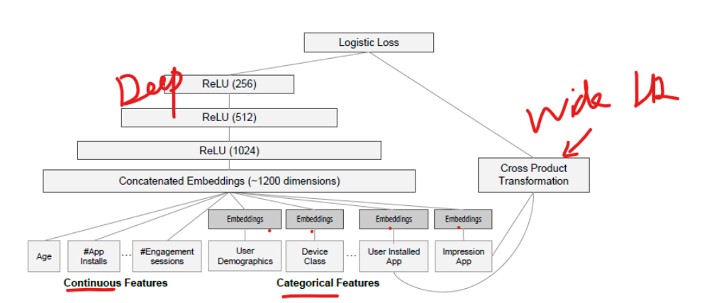

# 排序11：Deep & Cross Network（DCN）

其主要工作是针对**wide&deep网络中wide部分做了改进**，
在wide&deep网络中，wide部分是个简单的线性模型，其交叉特征依然需要人工设计，
而在DCN中设计了**专门的cross网络用于自动学习交叉特征。**

关于这个cross网络目前存在一定的争议，
比如在xdeepFM这篇论文中认为DCN中cross网络交叉的本质
只是对输入向量x 0 x_0 做了一个和x 0的相关的放缩。

我个人认为，DCN中cross网络还是有一定作用的，但这个交叉是bit-wise的，
并不像FM系列的vector-wise，
所以其交叉能力应该不像FM系列这么强。

# 排序12：xDeepFM模型

并不是对DeepFM的改进，而是对DCN的改进

xDeepFM这里包含三部分：
**普通的线性部分、
CIN部分用于构造高阶交叉特征、
普通的DNN部分用于学习隐式特征。**

CIN部分过于复杂，具体细节还没看

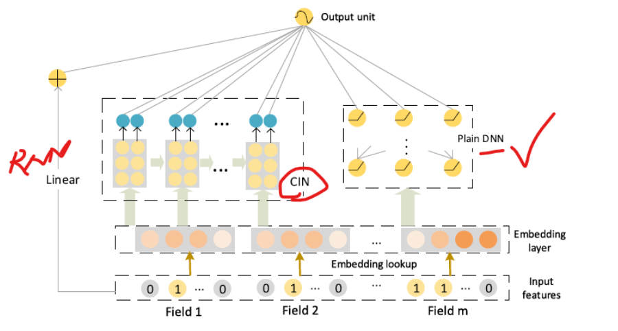

# 排序13：FNN模型（FM+MLP=FNN）

与PNN同属上海交大张楠的作品

FNN是一个两阶段训练的模型，
**阶段一，先训练一个FM模型得到每个field的embedding向量，
阶段二，基于阶段一的embedding向量初始化MLP的embedding层，然后训练一个MLP（DNN）。**

优点
一般在end-to-end训练DNN（MLP）的embedding层向量时，都是随机初始化的。

而FNN把FM训练好的embedding向量用于初始化DNN的embedding向量，
相当于在初始化DNN的embedding向量时引入了先验知识，
因此能够更好更快的收敛DNN。

缺点
正如张伟楠老师在PNN那篇论文中所提到的那样，FNN主要有两个比较大的局限性：

DNN的embedding层质量受限于FM的训练质量。
在FM中进行特征交叉时使用的是隐向量点积，把FM预训练得到的embedding向量送入到MLP中的全链接层，MLP的全链接层本质上做的是特征间的线性加权求和，即做的是『add』的操作，这与FM有点不太统一。

另外，MLP中忽略了不同的field之间的区别，全部采用线性加权求和。

# 排序14：PNN模型（Product-based Neural Networks）

和FNN一个作者，干掉FM，加上LR+Product

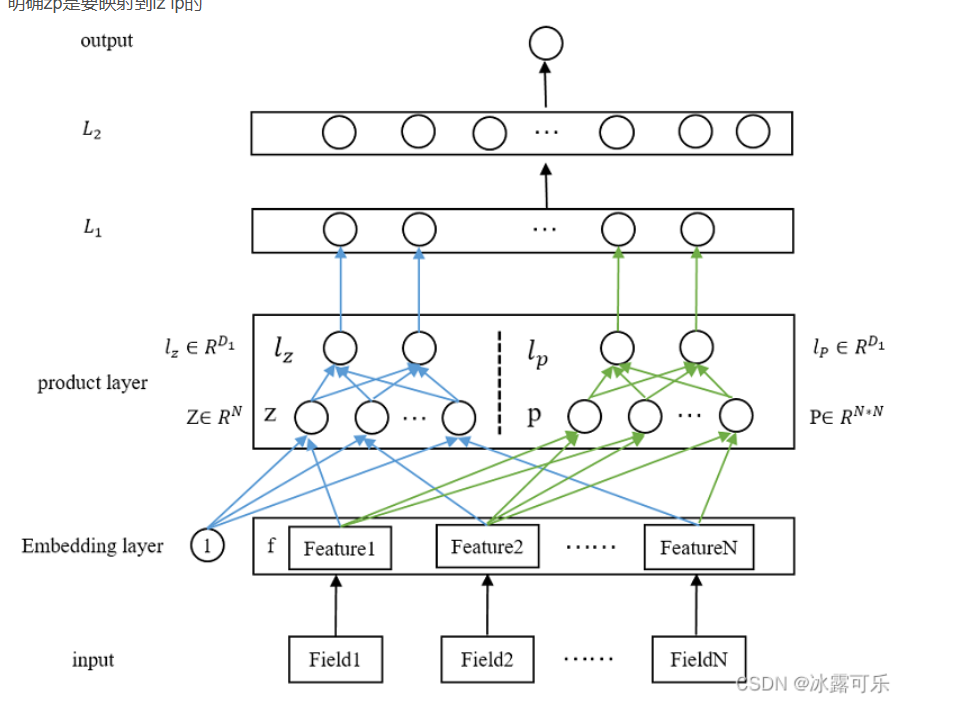

# 排序15：DeepFM模型（Factorization-Machine）

deepFM在wide部分用了**FM**模型来代替**LR**模型

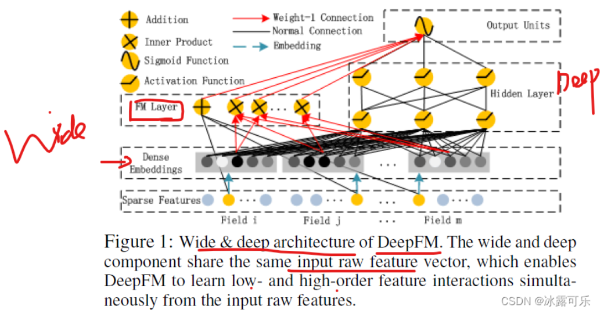

# 经典双塔模型：微软DSSM模型（Deep Structured Semantic Models）

无特征交互，后来美团改进了

**DSSM主要用在召回和粗排阶段。**

DSSM在业界搜广推的影响力目前来说是**超过**前面介绍的任何一个模型，**基本上统治了召回/粗排阶段。**

就是经常提到的双塔模型结构

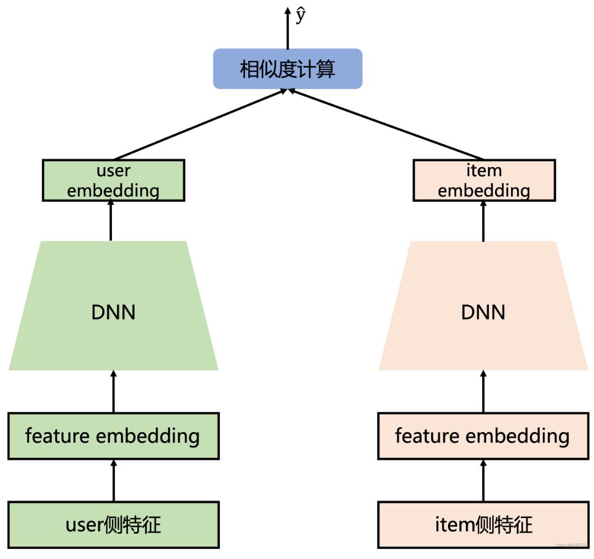

**美团DAT**

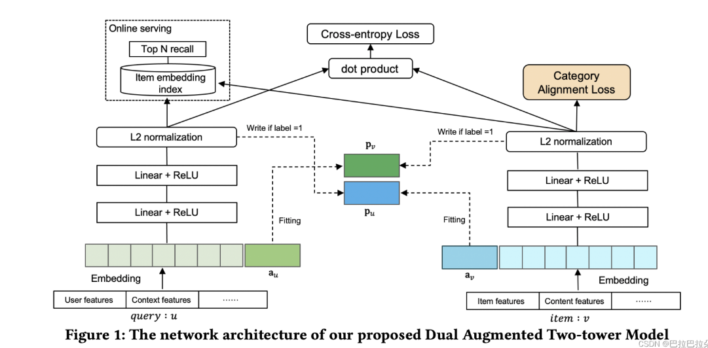

可以看到，一个重要的改动就是user塔的Embedding层多了一个增强向量a u，item塔的Embedding多了一个增量向量a v，user塔的增强向量a u学习item塔的最终输出向量p v，item塔的增强向量学习user塔最终输出向量p u，同时user塔的增强向量a u，也作为user塔的Embedding输入，作为user塔炼丹原材料，最终产出用户塔的输出p u  ，也就是item塔的信息实际上成为了user塔输入的一部分，item塔也是同样的操作。这样就实现了item塔和user的尽可能早的交叉。

# Gate网络（一）：新浪微博GateNet

GateNet就是想用attention的方法去搞，和[SENet](https://so.csdn.net/so/search?q=SENet&spm=1001.2101.3001.7020)一样，都是张俊林的杰作

# Gate网络2：百度GemNN（Gating-Enhanced Multi-Task Neural Networks）

