# 推荐系统公开课笔记

# 概要

## 小红书推荐系统

有效点击：在内容界面进行停留

**转化流程**

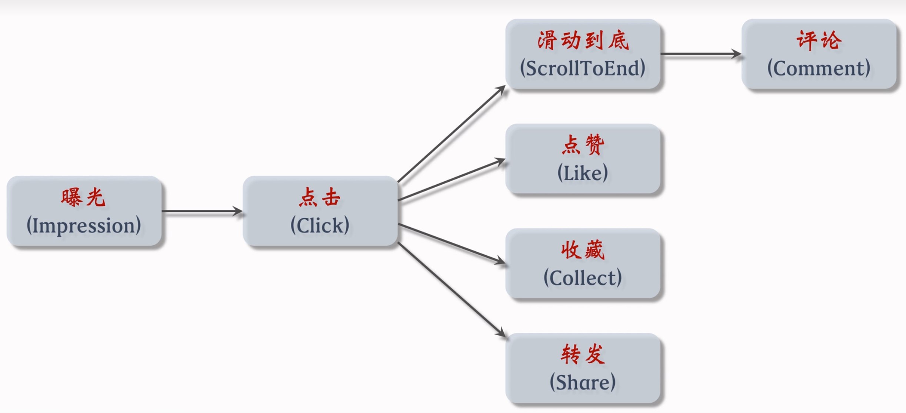

B站、淘宝、快手、知乎等等都有**曝光和点击**，但抖音没有，因为抖音下滑只能看到一个作品

滑动到底、点赞、收藏、转发可以作为推荐的依据

评论则可以塑造更加良好的社区氛围

**消费指标**

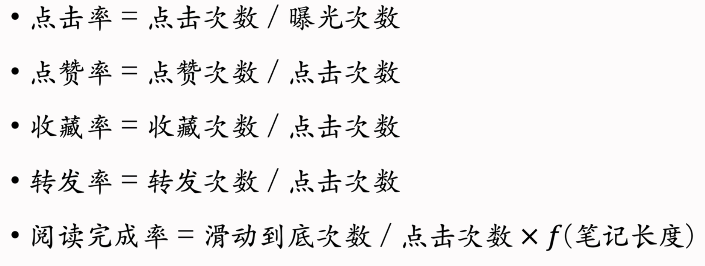

我们希望新的算法能够超越原有算法

这些都是短期消费指标，不是最重要的指标

**北极星指标**

衡量推荐系统好坏的主要指标

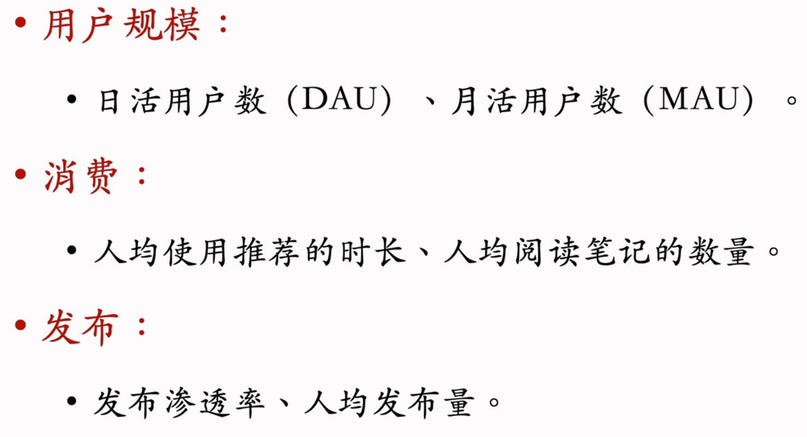

如果消费指标与北极星指标出现冲突，以北极星指标为准

**实验流程**

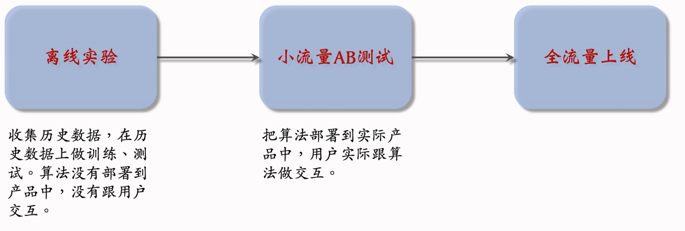

## 推荐系统链路

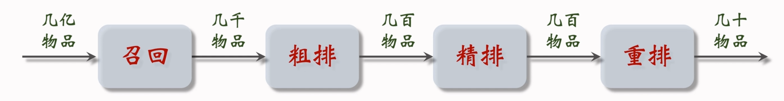

**召回**

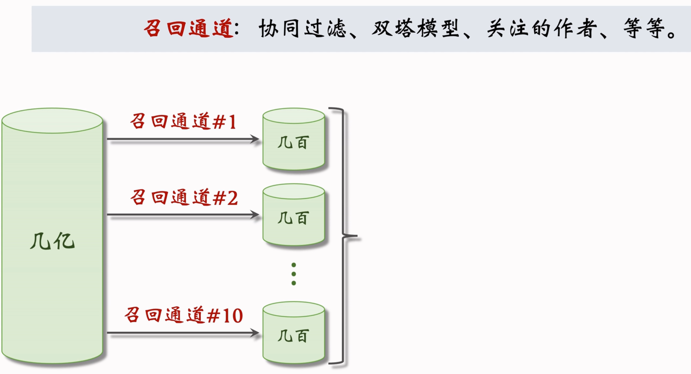

推荐系统会融合这些笔记，然后做去重和过滤，去掉重复内容，过滤掉不喜欢的作者、内容、话题

**排序**

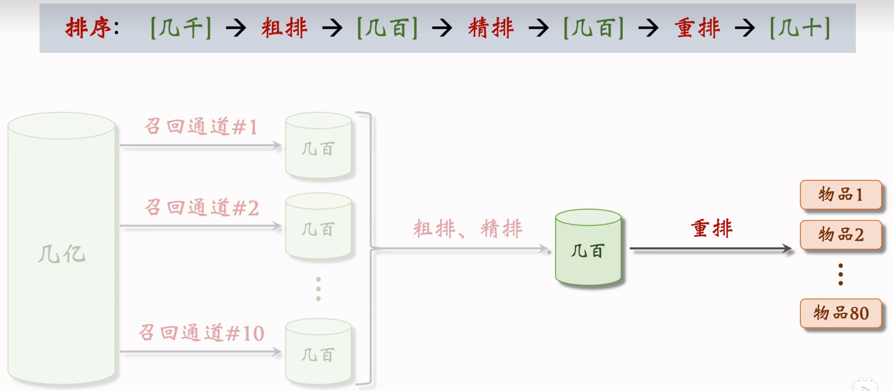

精排之后可以按照评分返回给用户，但此时结果仍存在不足，需要进行重排，重排主要考虑多样性，根据多样性进行随机抽样，从几百篇中选出几十篇，同时将内容相似笔记打散，即可将内容展现给用户。

**粗排、精排：**

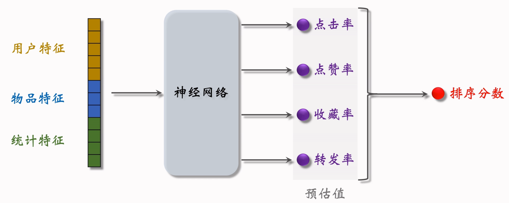

**重排：**

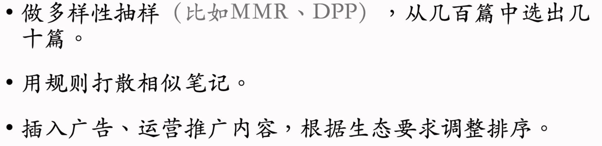

**总结**

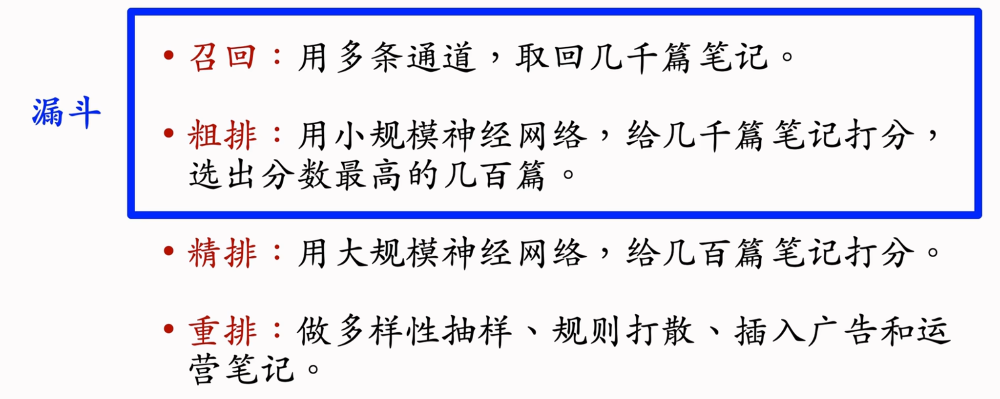

## A/B测试

A/B测试是什么？（例如）

+ 召回团队实现了一种GNN召回通道离线实验结果正向
+ 下一步是做线上的小流量A/B测试，考察新的召回通道对线上指标的影响。
+ 模型中有一些参数，比如GNN的深度取值∈{1,2,3}，需要用A/B测试选取最优参数。

意义：

+ 做线上小流量A/B测试，考察新方法对线上指标的影响
+ 通过A/B测试，选取最优参数
+ 实验组指标显著优于对照组，则值得推全

**随机分桶**

使用哈希函数将用户ID进行映射，分为不同的桶（也就是随机划分）

每一组应用不同的策略，测试新策略是否有效，设置对照组进行对比

**分层实验**

分层实验的目标是解决流量不够用的问题

+ **分层实验：**召回、粗排、精排、重排、用户界面、广告(例如GNN召回通道属于召回层。)
+ **同层互斥：**GNN实验占了召回层的4个桶，其他召回实验只能用剩余的6个桶
+ **不同层正交：**每一层独立随机对用户做分桶。每一层都可以独立用100%的用户做实验。

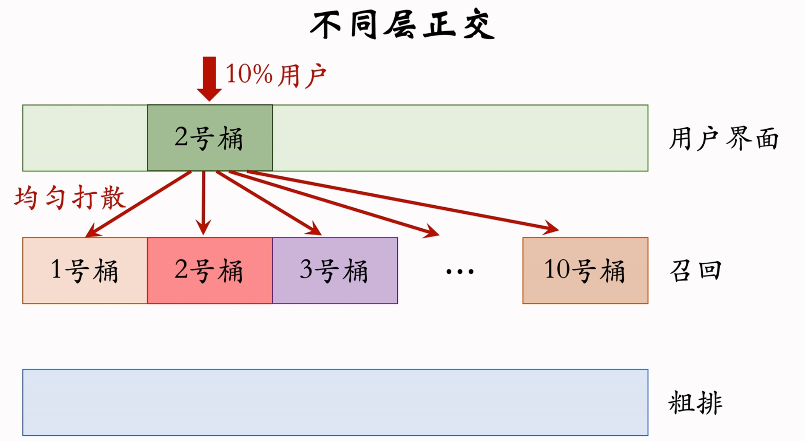

+ 同类的策略天然互斥，可能互相干扰，对于一个用户只能用其中一种。
+ 不同类型的策略通常不会相互干扰，可以正交。

**Holdout机制**

+ 每个实验（召回、粗排、精排、重排)独立汇报对业务指标的提升
+ 公司考察一个部门（比如推荐系统)在一段时间内对业务指标总体的提升 
+ 取10%的用户作为holdout桶，推荐系统使用剩余 90%的用户做实验，两者互斥 
+ 10%holdout桶vs90%实验桶的diff（需要归一化）为整个部门的业务指标收益

 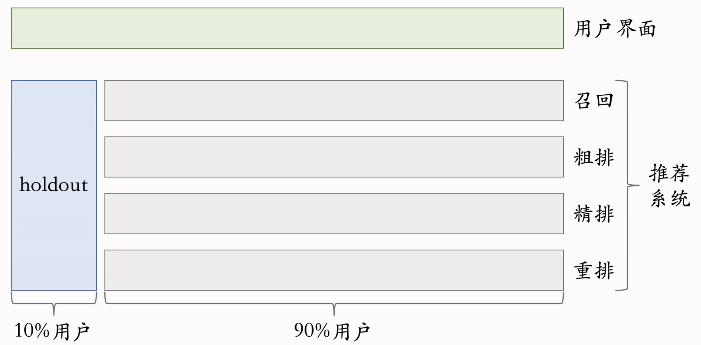

+ ·每个若核周期结束之后，清除holdout桶，让推全实验从90%用户扩大到100%用户
+ 重新随机划分用户，得到holdout桶和实验桶，开始下一轮考核周期。
+ 新的holdout桶与实验桶各种业务指标的diff接近0。
+ 随着召回、粗排、精排、重排实验上线和推全，diff会逐渐扩大。

**实验推全**

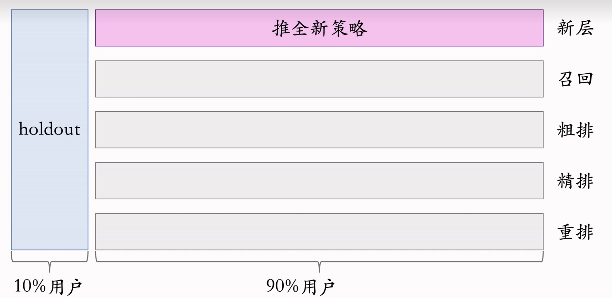

**反转实验**

+ 有的指标（点击、交互)立刻收到新策略影响，有的指标（留存)有滞后性，需要长期观测
+ 实验观测到显著收益后尽快推全新策略。目的是腾出桶供其他实验使用，或需要基于新策略做后续的开发
+ 用反转实验解决上述矛盾，既可以尽快推全，也可以长期观测实验指标
+ 在推全的新层中开一个旧策略的桶，长期观测实验指标

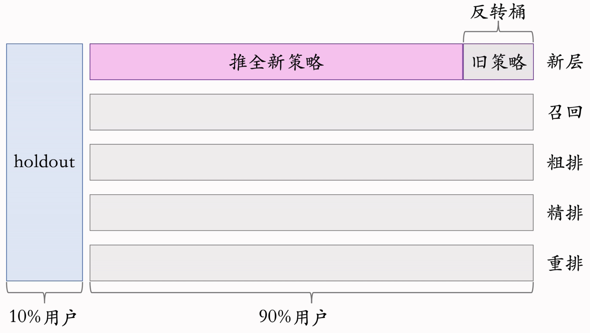

**总结**

+ **分层实验：**同层互斥（不允许两个实验同时影响一位用户)、不同层正交（实验有重叠的用户） 
+ **Holdout：**保留10%的用户，完全不受实验影响，可以考察整个部门对业务指标的贡献。
+ **实验推全：**新建一个推全层，与其他层正交。
+ **反转实验：**在新的推全层上，保留一个小的反转桶，使用旧策略。长期观测新旧策略的dff

# 召回

## 基于物品的协同过滤（ItemCF)

根据用户的喜好和其它兴趣相近的用户推荐物品

应用最广泛的：基于邻域的方法

+ UserCF：推荐相似用户喜欢的东西
+ ItemCF：推荐他人之前喜欢的物品相似的物品

**常用相似度**

+ Jaccard相关系数
+ 余弦相似度
+ 皮尔逊相关系数，相比于余弦相似度，通过用户平均分来减小偏置影响

**召回率：**预测准确的物品占用户实际喜欢物品的比例

**精确率：**对用户准确推荐的物品占总推荐物品的比例

**覆盖率：**推荐系统能够推荐出来的物品占总物品集合的比例

**协同过滤的缺点**

+ 泛化能力弱，无法将两个物品相似的信息推广到其它物品的相似性上
+ 热门物品具有很强的头部效应，容易跟大量物品产生相似，而尾部物品由于特征向量稀疏，导致很少被推荐

**什么时候用UserCF，什么时候用ItemCF，为什么？**

1. UserCF：所以具备更强的社交特性，这样的特点非常适于用户少物品多，时效性较强的场合。比如新闻推荐场景。此外，UserCF可以发现用户潜在但自己尚未察觉的兴趣爱好。
2. ItemCF：适用于兴趣变化较为稳定的应用，适合物品少，用户多，用户兴趣固定持久的场合。比如推荐音乐、电影。

## Swing算法

之前的Item-based CF只关注于ltem-User-ltem的路径，即通过物品与用户的交互，来推断物品与物品之间的相似度，从而进行推荐。忽视了噪声，推荐精度存在局限性。

 Swing通过利用User-ltem-User路径中所包含的信息进行推荐：

若用户u和用户V之间除了购买过ⅰ外，还购买过商品j，则认为两件商品是具有某种程度上的相似的。也就是说，商品与商品之间的相似关系，是通过用户关系来传递的如果这两个用户共同购买的物品越少，即这两个用户原始兴趣不相以，但仍同时购买了两个相同的物品，则物品和的相以性越高。

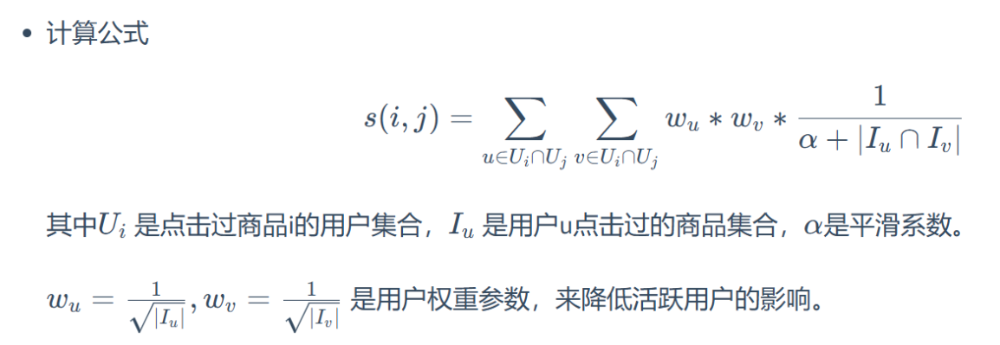

## 矩阵补充

+ 把物品ID、用户ID做embedding,映射成向量。
+ 两个向量的內积 < $a_u$ , $b_i$ > 作为用户u对物品i兴趣的预估。
+ 让 < $a_u$ , $b_i$ > 拟合真实观测的兴趣分数，学习模型的 embedding层参数。
+ 矩阵补充模型有很多缺点，效果不好。

缺点1：仅用ID embedding，没利用物品、用户信息

+ 物品属性：类目、关键词、地理位置、作者信息
+ 用户属性：性别、年龄、地理位置、感兴趣的类目
+ 双塔模型可以看做矩阵补充的升级版

缺点2：负样本的选取方式不对

+ 样本：用户--物品的二元组，记作（u，i）
+ 正样本：曝光之后，有点击、交互（正确的做法）
+ 负样本：曝光之后，没有点击、交互（错误的做法）

缺点3：做训练的方法不好

+ 内积 < $a_u$ , $b_i$ > 不如余弦相似度
+ 用平方损失（回归），不如用交叉熵损失（分类）

## 双塔模型

其中ID和离散特征用Embedding层处理，连续特征用归一化或分桶做处理

用户表征：

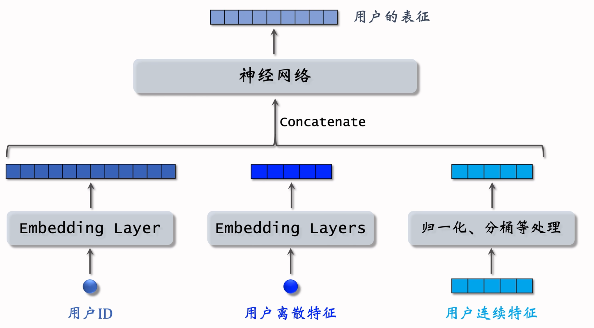

物品表征：

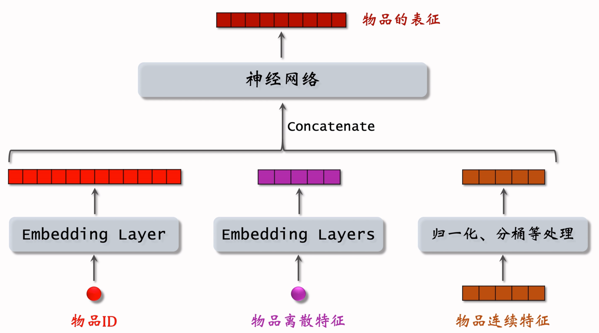

双塔模型：

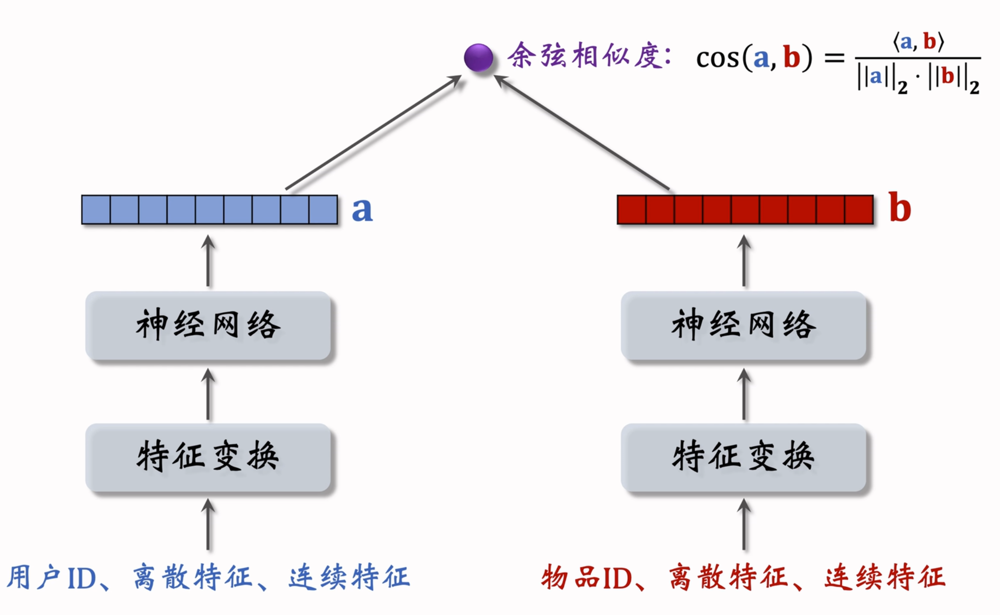

**训练方式：**

1. Pointwise：独立看待每个正样本、负样本，做简单的二元分类

   + 把召回看作二分类任务
   + 对于正样本，鼓励 cos(a, b) 接近+1
   + 对于负样本，鼓励 cos(a, b) 接近-1
   + 正负样本数量控制在1：2或1：3

2. Pairwise：每次取一个正样本、一个负样本

   + 每次输入三元组 <用户a， 正样本b+，负样本b->

   + 基本想法：鼓励 cos(a, b+) 大于 cos(a, b-)

   + 超参数m，正负样本的兴趣之差

   + 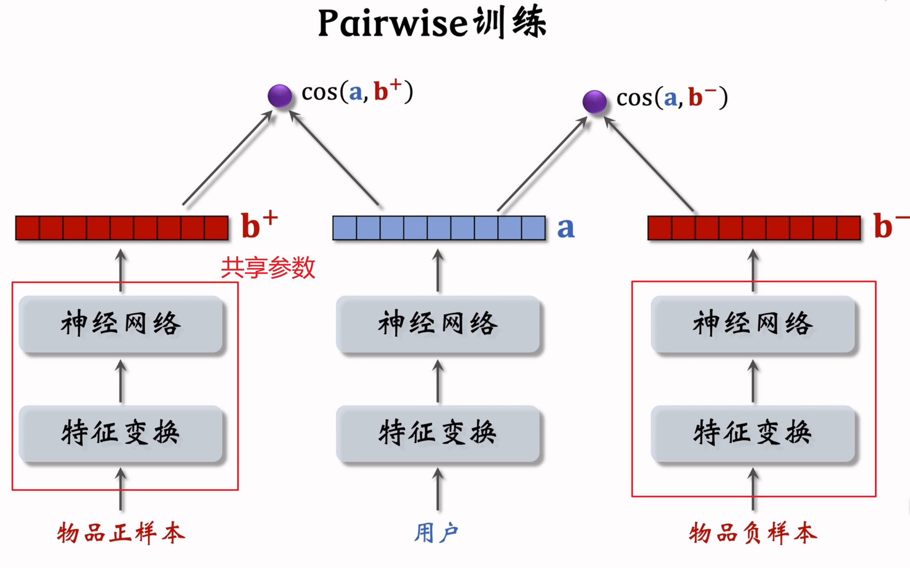

   + 可以通过最小化以下损失函数来训练双塔模型

     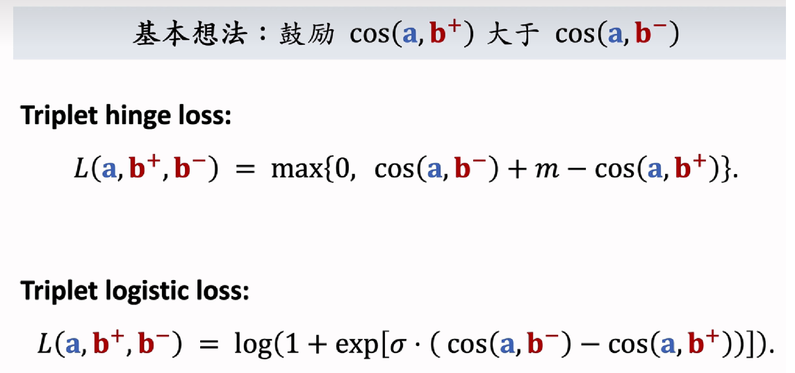

3. Listwise：每次取一个正样本、多个负样本

   + 每次输入一个用户，一个正样本，多个负样本
   + 同样是鼓励 cos(a, b+) 尽量大，cos(a, b-) 尽量小
   + 将 cos(a, b+) 和所有cos(a, b-) 输入softmax进行归一化
   + 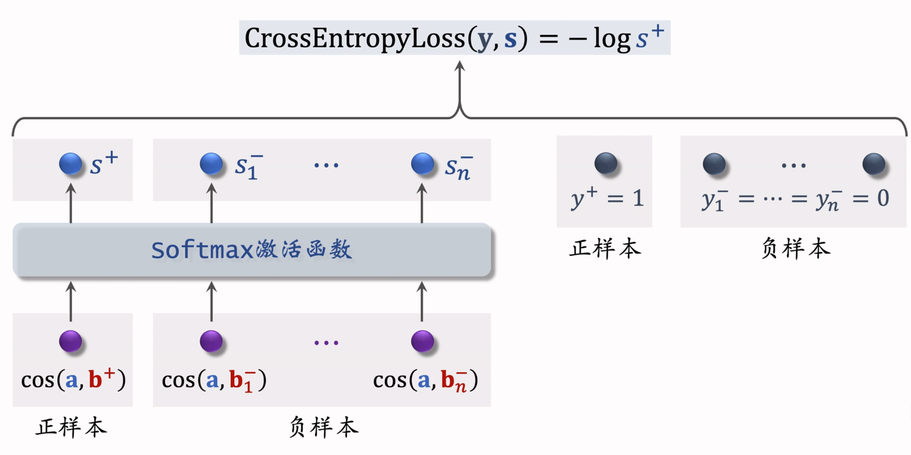
   + 利用交叉熵做损失函数，训练时最小化交叉熵，使得s+接近y+=1，s-接近y-=0

+ 用户塔、物品塔各输出一个向量。
+ 两个向量的余弦相似度作为兴趣的预估值。
+ 三种训练方式：
  + Pointwise：每次用一个用户、一个物品（可正可负)
  + Pairwise：每次用一个用户、一个正样本、一个负样本
  + Listwise：每次用一个用户、一个正样本、多个负样本

下图属于前期融合，属于排序模型，不适用做召回

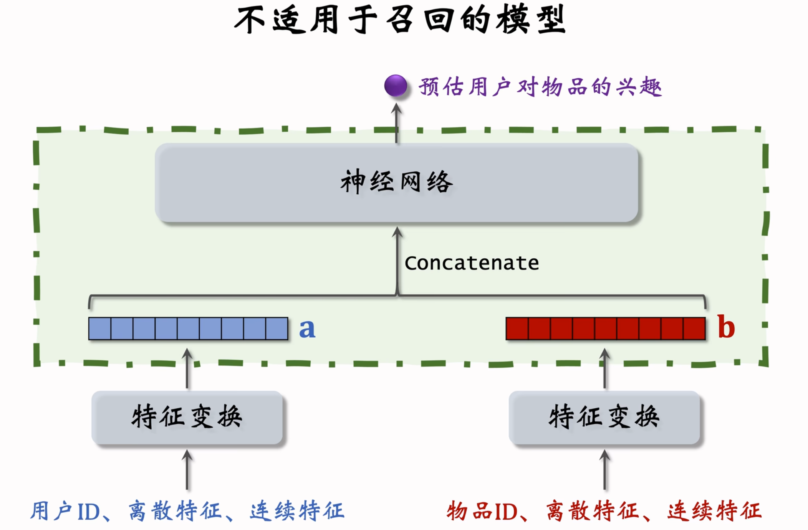

## 双塔模型：正负样本

**正样本：**

+ 曝光且有点击的用户物品二元组
+ 问题：少部分物品占据大量点击导致正样本多是热门物品
+ 解决方法：对冷门物品过采样（采样多次），对热门物品降采样（抛弃一些样本）

**负样本：**

+ 简单负样本

  + 全体物品

    均匀抽样？

    对冷门不公平-因为正样本大多是热门物品，导致负样本中热门物品占比少

    解决方法：非均匀抽样一物品抽样的概率与热门程度正相关

    抽样概率∝点击次数0.75

    使得热门物品成为负样本的概率大

  + batch内负样本

    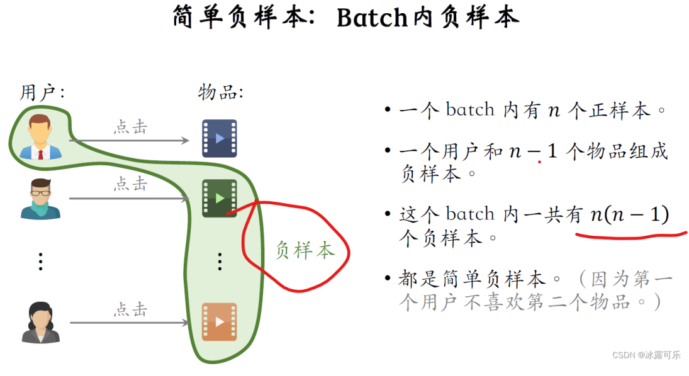

    但这种负样本中，抽样概率∝点击次数，热门物品成为负样本的概率过大

    解决方法：将用户的兴趣调整为 $cos(\mathrm{a,b_i)-}\log p_i$，去偏

    其中 $p_i$ ∝点击次数

+ 困难负样本

  1. 被粗排淘汰的物品（比较困难）
  2. 精排分数靠后的物品（非常困难）

+ 对正负样本做二元分类

  + 全体物品（简单）分类准确率高
  + 被粗排淘汰的物品（比较困难）容易分错
  + 精排分数靠后的物品（非常困难）更容易出错

+ 工业常用做法

  + 混合几种负样本
  + 50%的负样本是全体物品（简单负样本)
  + 50%的负样本是没通过排序的物品（困难负样本)

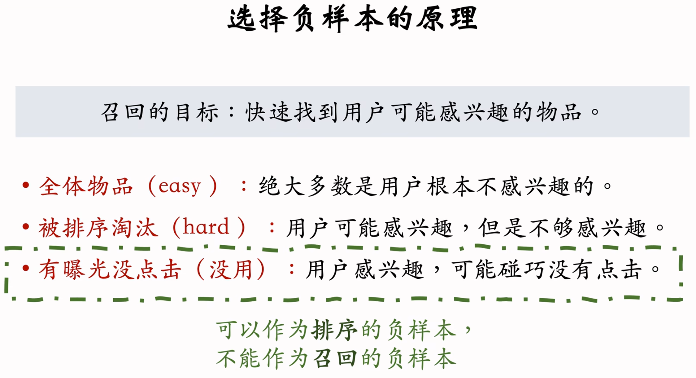

**总结**

+ 正样本：曝光而且有点击
+ 简单负样本：
  + 全体物品
  + batch内负样本
+ 困难负样本：被召回，但是被排序淘汰
+ 错误：曝光、但是未点击的物品做召回的负样本

## 双塔模型：线上服务与模型更新

**离线存储：**把物品向量b存入向量数据库

1. 完成训练之后，用物品塔计算每个物品的特征向量b
2. 把几亿个物品向量b存入向量数据库（比如Milvus Faiss、HnswLib)
3. 向量数据库建索引，以便加速最近邻查找。

**线上召回：**用户塔不事先计算和存储用户向量，而是当用户发起推荐请求的时候，调用神经网络在线上线算一个特征向量a  

1. 给定用户ID和画像，线上用神经网络算用户向量a
2. 最近邻查找：
   + 把向量a作为query，调用向量数据库做最近邻查找
   + 返回余弦相似度最大的k个物品，作为召回结果。

事先存储物品向量b,线上现算用户向量a,why?

+ 每做一次召回，用到一个用户向量a,几亿物品向量b。(线上算物品向量的代价过大。)
+ 用户兴趣动态变化’而物品特征相对稳定。（可以离线存储用户向量，但不利于推荐效果。)

**全量更新：**今天凌晨，用昨天全天的数据训练模型。

+ 在昨天模型参数的基础上做训练。（不是随机初始化)
+ 用昨天的数据，训练1 epoch，即每天数据只用一遍。
+ 发布新的用户塔神经网络和物品向量，供线上召回使用。
+ 全量更新对数据流、系统的要求较低。

**增量更新：**做online learning更新模型参数。

+ 用户兴趣会随时发生变化。
+ 实时收集线上数据，做流式处理，生成TFRecord文件
+ 对模型做online learning，增量更新ID Embedding参数。(不更新神经网络其他部分的参数。)
+ 发布用户ID Embedding，供用户塔在线上计算用户向量

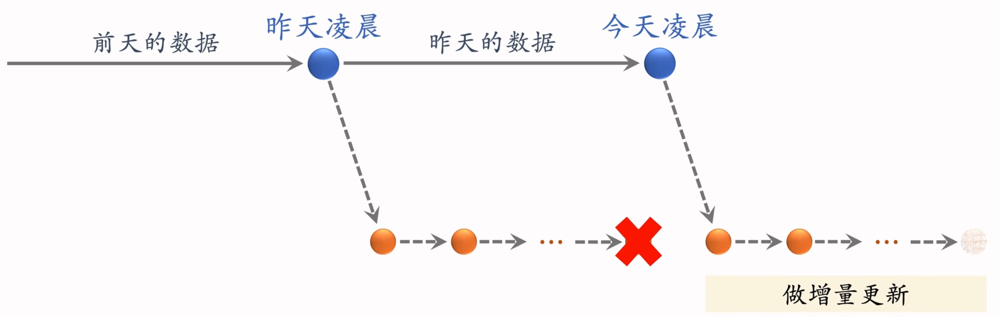

问题：能否只做增量更新，不做全量更新？

+ 小时级数据有偏；分钟级数据偏差更大
+ 全量更新：random shuffle一天的数据，做1 epoch训练
+ 增量更新：按照数据从早到晚的顺序，做1 epoch训练
+ 随机打乱优于按顺序排列数据，全量训练优于增量训练

全量训练的模型更好，而增量训练可以实时捕捉用户的兴趣。  

而增量训练中，小时/分钟级别的数据有偏，与全天的数据差别很大。因此，不能只增量训练，而做全量训练的时候也要随机排列数据  

## 双塔模型+自监督学习

自监督的目的是把物品塔训练的更好

**双塔模型的问题：**

+ 推荐系统的头部效应严重：
  + 少部分物品占据大部分点击。
  + 大部分物品的点击次数不高。
+ 高点击物品的表征学得好，长尾物品的表征学得不好
+ 自监督学习：做data augmentation，更好地学习长尾物品的向量表征。

**双塔模型的训练：**

双塔模型采用Listwise进行训练

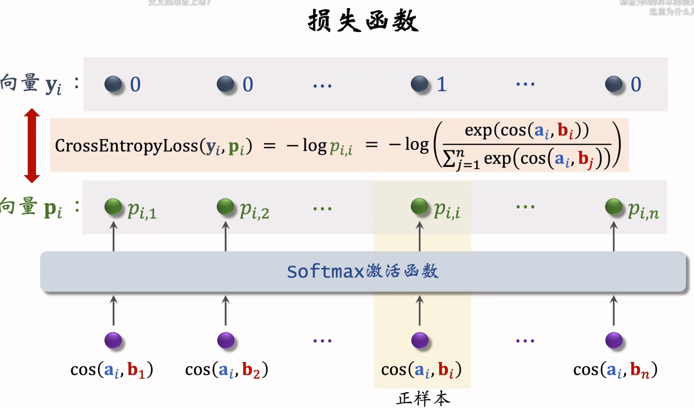

纠偏：

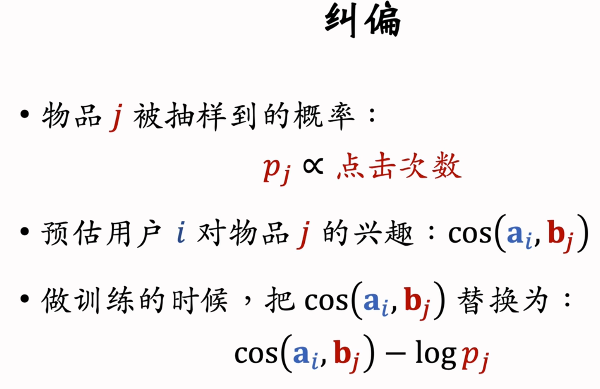

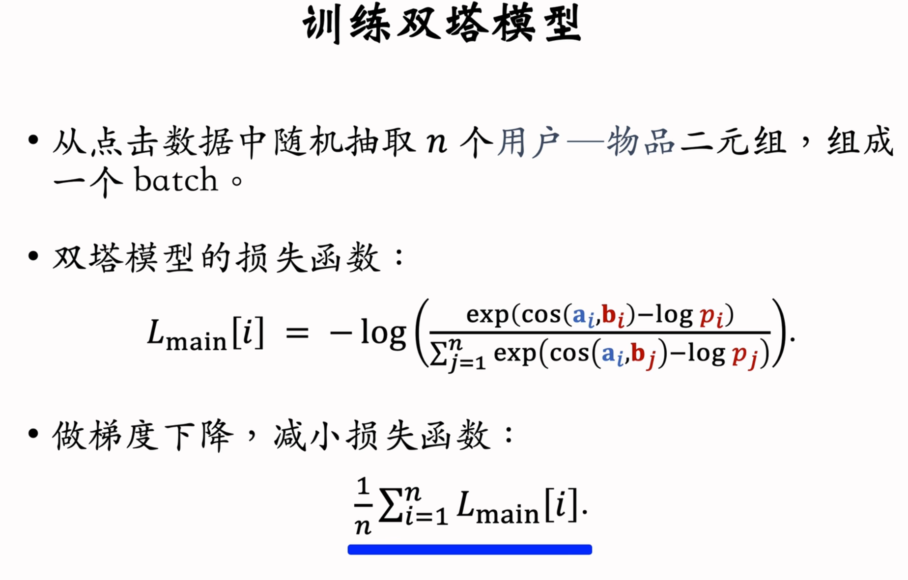

**自监督学习：**

训练物品塔

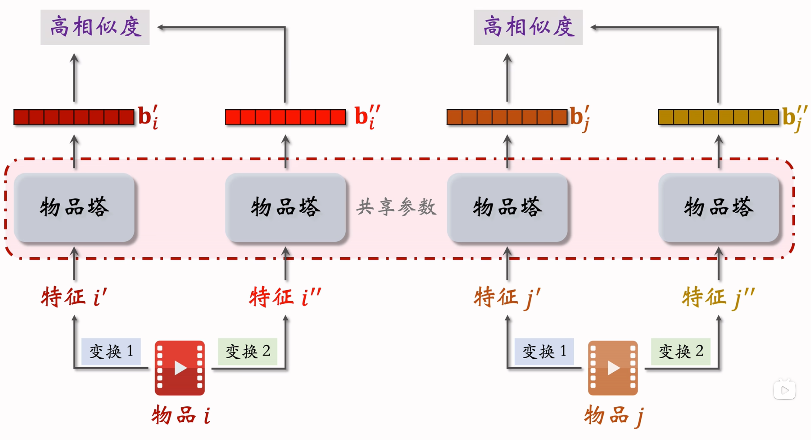

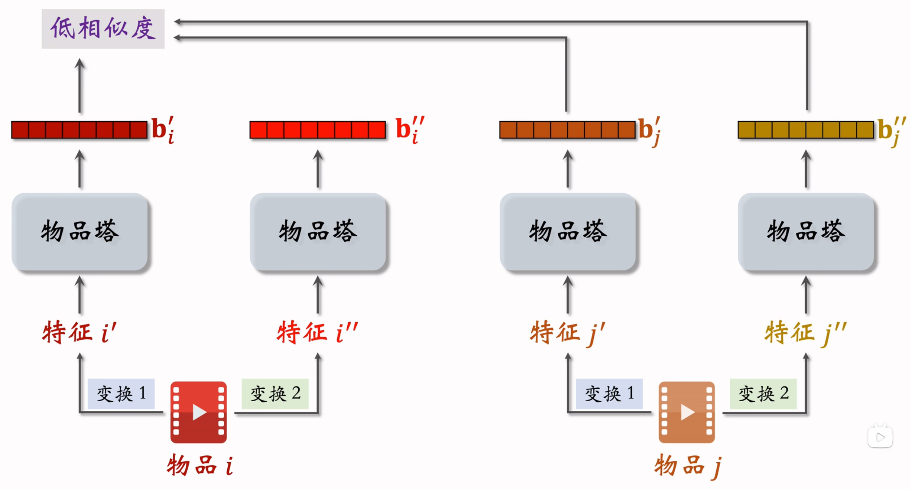

+ 物品i的两个向量表征 $\mathbf{b}_i^{\prime}$ 和 $\mathbf{b}_i^{\prime\prime}$ 有较高的相似度。
+ 物品i和j的向量表征 $\mathbf{b}_i^{\prime}$ 和 $\mathbf{b}_i^{\prime\prime}$ 有较低的相似度。
+ 鼓励cos( $\mathbf{b}_i^{\prime}$ , $\mathbf{b}_i^{\prime\prime}$ )尽量大cos( $\mathbf{b}_i^{\prime}$ , $\mathbf{b}_j^{\prime\prime}$ )尽量小。

**特征变换：Random Mask**

+ 随机选一些离散特征（比如类目)，把它们遮住。
+ 例：某物品的类目特征是U={数码，摄影}，Mask后的类目特征是U'={default}

**特征变换：Dropout（仅对多值离散特征生效)**

+ 一个物品可以有多个类目，那么类目是一个多值离散特征。
+  Dropout：随机丢弃特征中50%的值。
+ 例：某物品的类目特征是U={美妆，摄影}。 Dropout后的类目特征是U'={美妆}

**特征变换：互补特征（complementary)**

+ 假设物品一共有4种特征： ID,类目，关键词，城市
+ 随机分成两组：{ID,关键词}和{类目，城市}
+ {ID,default,关键词，default}→物品表征
+ {default,类目，default,城市}→物品表征
+ 由于是对同一物体的表征，因此这两个物品表征应该相似

**特征变换：Mask一组关联的特征**

+ 受众性别：U={男，女，中性}

+ 类目：v={美妆，数码，足球，摄影，科技，… }

+ u=女和v=美妆同时出现的概率p(u,v)大

+ u=女和v=数码同时出现的概率p(u,v)小。

+ p(u)：某特征取值为u的概率。 

+ p(u,v)：某特征取值为u，另一个特征取值为v，同时发生的概率。

+ 离线计算特征两两之间的关联，用互信息(mutual information)衡量：

  $MI(\mathcal{U},\mathcal{V})=\Sigma_{u\in\mathcal{U}}\Sigma_{v\in\mathcal{V}}p(u,v)\cdot\log\frac{p(u,v)}{p(u)\cdot p(v)}.$

+ 设一共有k种特征。离线计算特征两两之间MI,得到kXk的矩阵

+ 随机选一个特征作为种子，找到种子最相关的k/2种特征

+ Mαsk种子及其相关的k/2种特征，保留其余的k/2种特征

+ 好处：比random mask、dropout、互补特征等方法效果更好。

+ 坏处：方法复杂，实现的难度大，不容易维护。

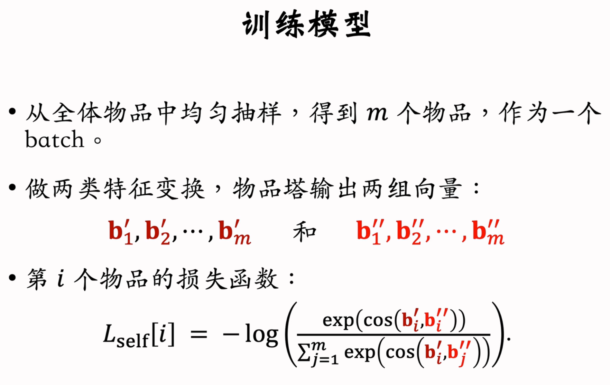

 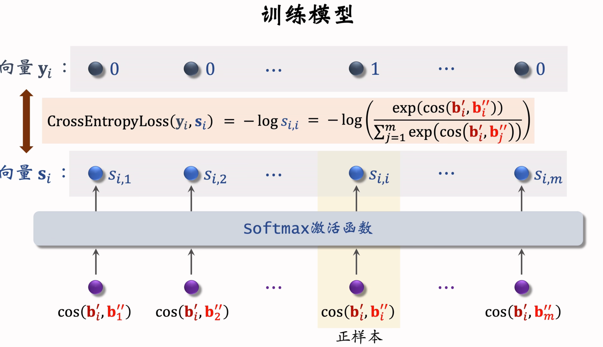

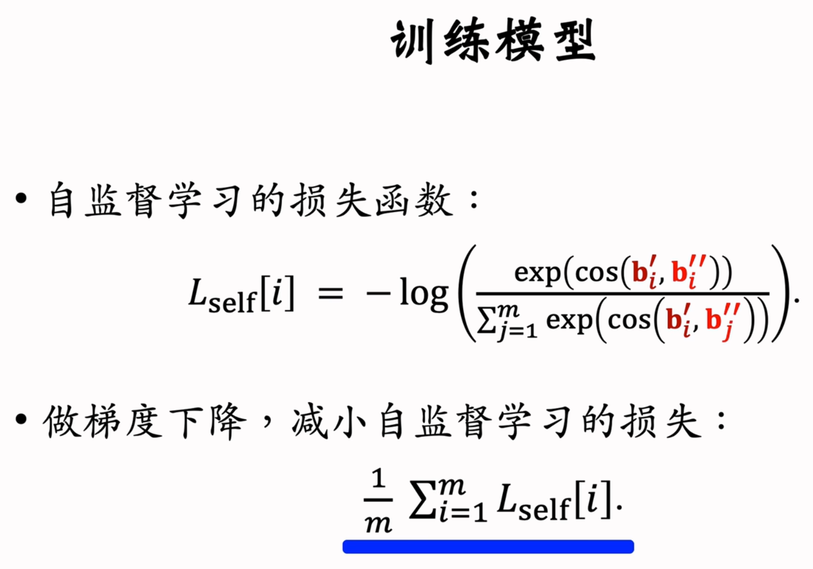

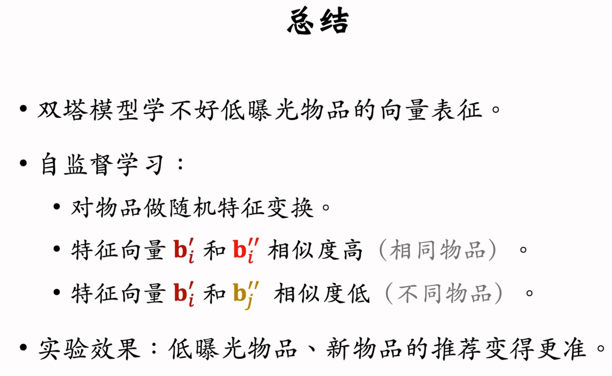

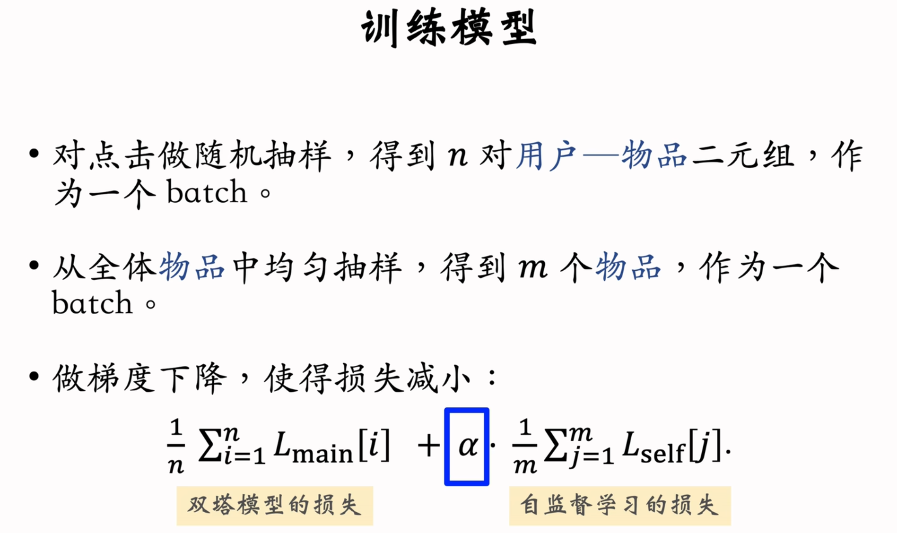

## Deep Retrieval召回

+ 经典的双塔模型把用户、物品表示为向量，线上做最近邻查找。 
+ Deep Retrieval把物品表征为路径（path),线上查找用户最匹配的路径
+ Deep Retrieval类似于阿里的TDM

## 其它召回通道

**地理位置召回：**

**GeoHash召回**

+ 用户可能对附近发生的事感兴趣
+  GeoHash：对经纬度的编码，地图上一个长方形区域
+ 索引：GeoHash→优质笔记列表（按时间倒排) 
+ 这条召回通道没有个性化

**同城召回**

+ 用户可能对同城发生的事感兴趣
+ 索引：城市〉优质笔记列表（按时间倒排）
+ 这条召回通道没有个性化

**作者召回：**

+ 关注作者：用户-关注的作者-最新的笔记
+ 交互作者：用户-有交互的作者-最新的笔记
+ 相似作者：用户-感兴趣作者-相似的作者最新的笔记

**缓存召回：**

+ 复用前n次推荐精排的结果
+ 精排前50但是没有曝光的缓存起来，作为召回通道
+ 退场机制：被曝光，召回次数或缓存时间达标

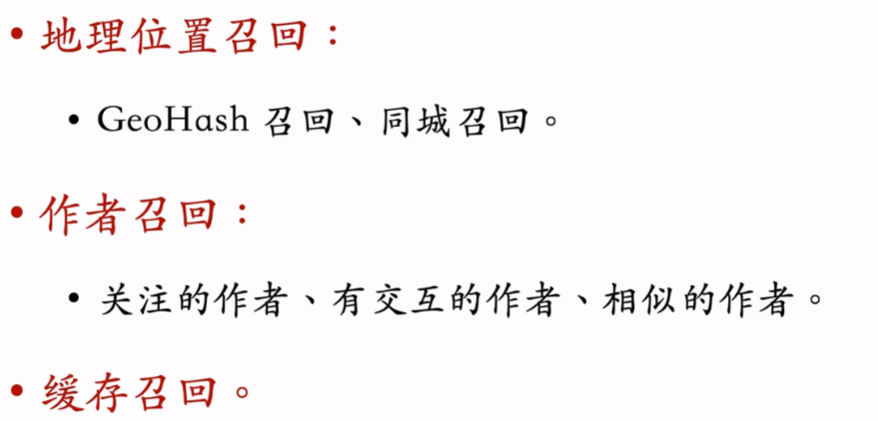

## 曝光过滤&Boom Filter

曝光过滤：不曝光用户已浏览的物品

**Bloom Filter：**

+ Bloom filter判断一个物品ID是否在已曝光的物品集合中
+ 如果判断为no，那么该物品一定不在集合中。
+ 如果判断为yes那么该物品很可能在集合中。（可能误伤，错误判断未曝光物品为已曝光，将其过滤掉。)

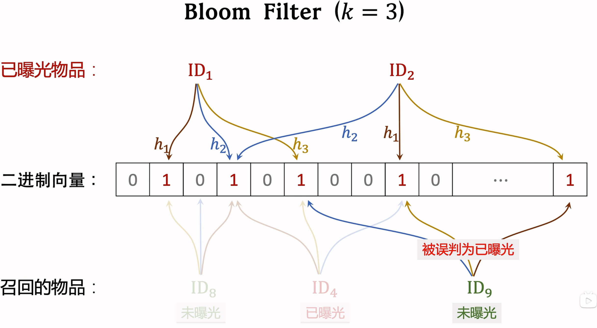

**误伤概率的三个影响因素：**

+ 物品集合n
+ 二进制向量维度m
+ 哈希函数的个数k

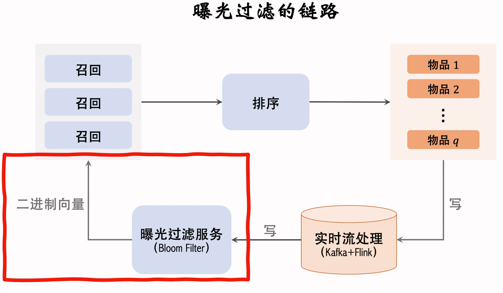

**Bloom Filter的缺点：**

+ Bloom filter把物品的集合表示成一个二进制向量。
+ 每往集合中添加一个物品，只需要把向量k个位置的元素置为1。（如果原本就是1，则不变。) 
+ Bloom filter只支持添加物品，不支持删除物品。从集合中移除物品，无法消除它对向量的影响。
+ 每天都需要从物品集合中移除年龄大于1个月的物品。（超龄物品不可能被召回，没必要把它们记录在 Bloom filter，降低n可以降低误伤率。)

# 排序

## 多目标排序

**指标：**笔记的点击率、点赞率、收藏率、转发率

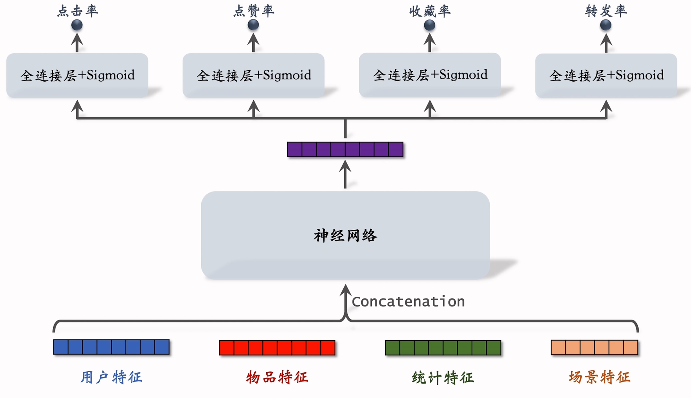

四个神经网络分别输出点击率、点赞率、收藏率、转发率的预估值（0-1）

目标值为用户的真实值

通过交叉熵损失函数的加权和来恒定预估的准确度，通过梯度下降训练神经网络

**实际训练的困难：样本不平衡问题**

+ 正样本少，负样本多
+ 负样本数量会非常不平衡，较多的负样本用途不大，白白浪费计算资源

**解决方案：负样本随机采样**

+ 使用降采样，减少负样本的数量，降低训练的计算代价
+ 由于降采样，预估值会高于实际值，需要进行校准（借助预估点击率，采样率和正样本个数）

## MMOE

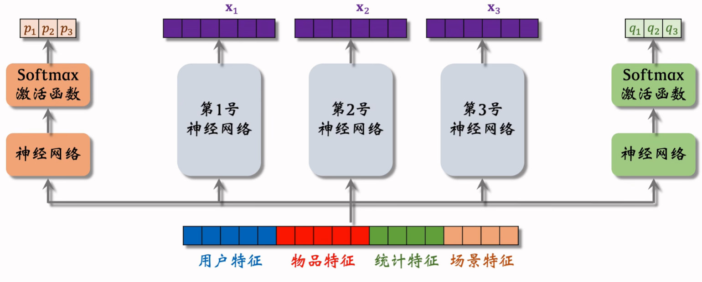

将特征输入三个结构相同，但不共享参数的专家神经网络（通常为4个或8个）得到向量x1,x2,x3

将特征向量输入另外两个神经网络，并以softmax激活，得到都大于0，而且相加等于一向量的两组元素{p1,p2,p3}，{q1,q2,q2}，分别代表权重

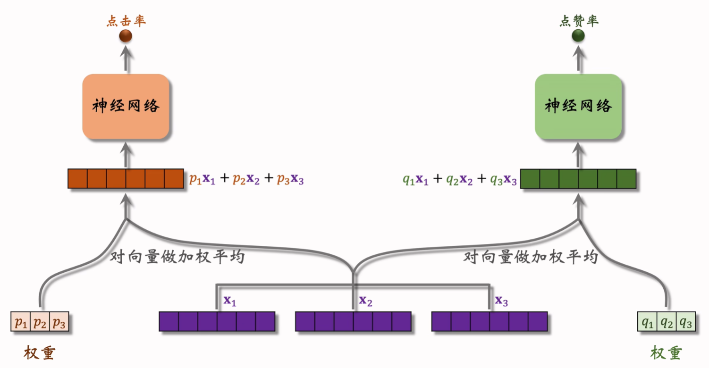

用P和Q这两组元素作为权重，对得到的向量X1X2X3做加权平均，用加权平均得到的向量去预估业务指标（这里是点击率和点赞率，因为有两组权重，假如有十个目标，那么就要用十组权重）

**极化现象**

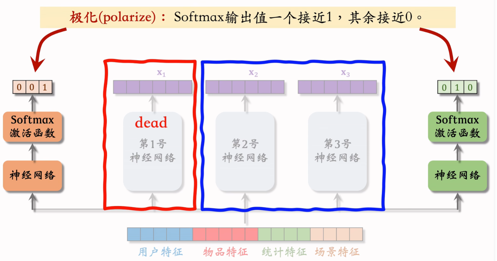

某一权重过小导致没有让三个专家神经网络的输出融合，而是简单使用了一个专家。

**通过dropout解决极化问题**

+ 解决极化现象的一种方法是dropout
+ 在训练的过程中被softmax输出使用dropout
+ 对于softmax输出的N个数值(N为专家的个数)，每个数值都有10%的概率被mask
+ 也就是说在训练的过程中，每个专家被丢弃的概率都是10%。
+ 强迫每个任务根据部分专家做预测

参考文献：

+ Google提出MMoE模型
+ YouTube的论文提出极化问题的解决方案

## 预估分数融合

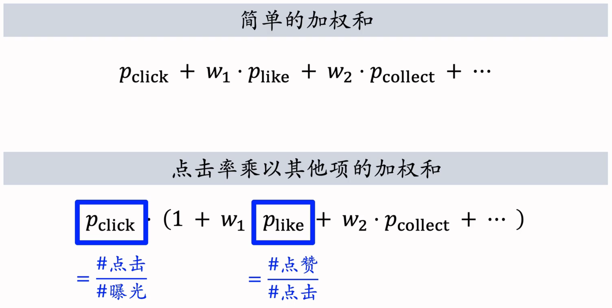

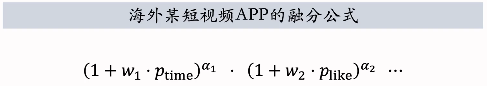

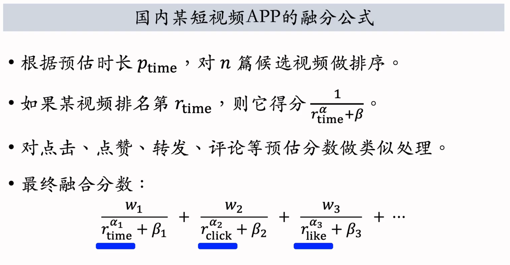

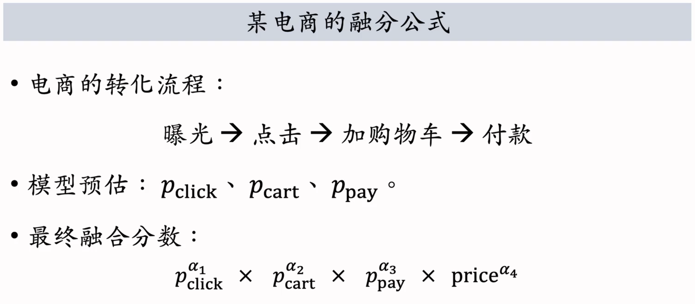

## 视频播放建模

图文笔记和视频排序的依据不同

两个重要指标：播放时长、完播率  

Youtube对视频观看时长的预估方法

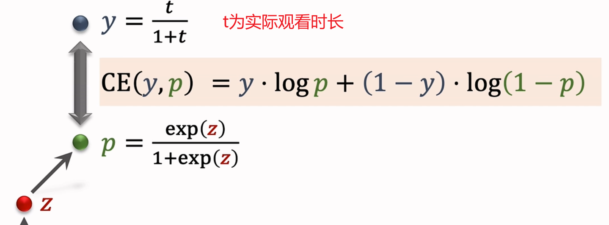

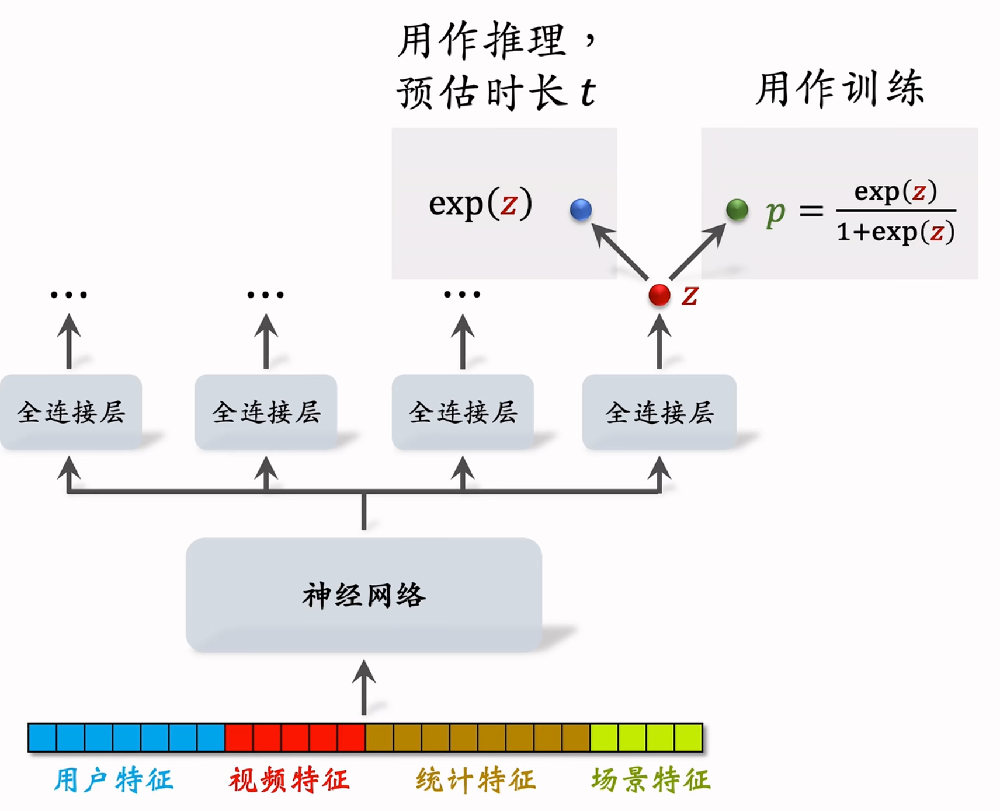

将特征输入多层神经网络，被所有任务共享。

神经网络上有多个全连接层，每个全连接层对应一个目标比如点击、点赞、收藏等

这里只关心对播放时长的预估，对于全连接层得到的Z，做sigmoid后与我们定义的Y(观看时长T进行类 sigmoid变换)，最小化交叉熵。

**视频完播**

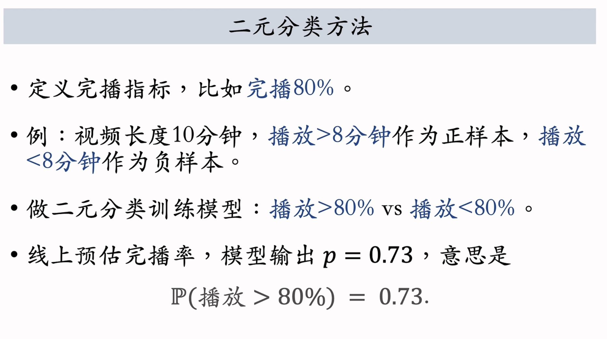

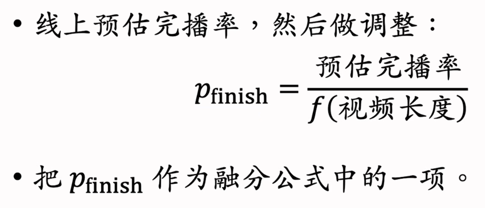

## 排序模型的特征

1. 用户画像
   + 用户ID
   + 人口统计学属性：性别、年龄
   + 账号信息：新老、活跃度
   + 感兴趣的类目、关键词
2. 物品画像
   + 物品lD(embedding)
   + 发布时间
   +  GeoHash
   + 标题、类目、关键词等离散特征
   + 字数、图片书、清晰度等自带属性
3. 用户统计特征
   + 用户最近一段时间的曝光时点击数等
   + 按照图文/视频分桶
   + 按照笔记类分桶
4. 笔记统计特征
   + 笔记最近一段时间的曝光点击等
   + 按照性别、用户年龄等分桶
   + 作者特征
5. 场景特征
   + 用户定位、城市
   + 当前时刻
   + 是否周末节假日等
   + 手机品牌价格等

**特征处理：**

+ 离散特征：做embedding
+ 连续特征： 
  1. 做分桶，变成离散特征 
  2. 其他变换，曝光数点击数等做log(1+x)/转换为点击率点赞率等并做平滑

## 粗排

**精排vs双塔**

精排：先对特征做concatenation再输入神经网络（前期融合）。线上推理代价大n个物品推理n次

双塔：用户、物品分别输入不同神经网络（后期融合）。线上计算小，只需要做一次线上推理

**粗排三塔模型**

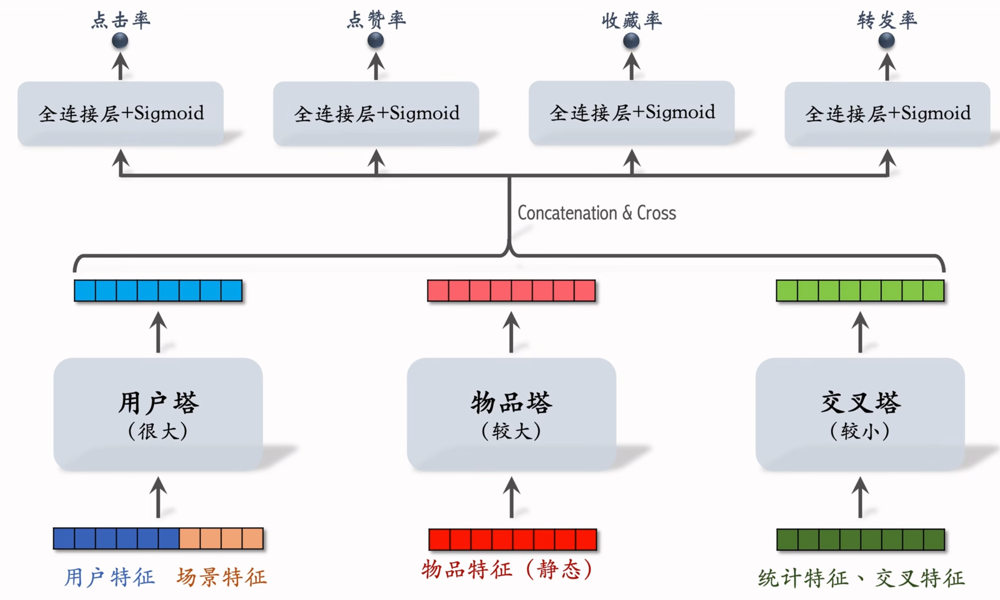

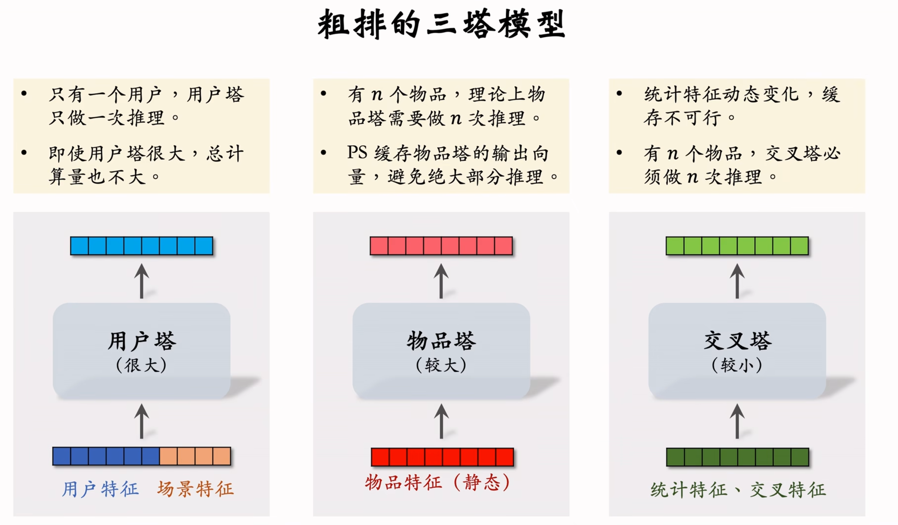

每次粗排，需要取1个用户和个物品的特征

+ 用户塔，只做一次推理
+ 物品塔，未命中缓存时需要做推理（物品特征比较稳定，所以预先计算并缓存）
+ 交叉塔，必须做n次推理，因为统计特征会实时变化
+ 上层网络，做n次推理得到对应指标

# 特征交叉

## Factorized Machine（FM）因式分解机

+ FM是线性模型的替代品，能用线性回归、逻辑回归的场景，都可以用FM
+ FM使用二阶交叉特征，表达能力比线性模型更强
+ 通过做近似 $u_{ij}\approx\mathbf{v}_i^T\mathbf{v}_j$ ，FM把二阶交叉权重的数量从O( $d^2$ )降低到O(kd)。

## 深度交叉网络（DCN）

DCN用来代替简单的全连接网络，既可以用于召回，也可以用于排序

**交叉层**

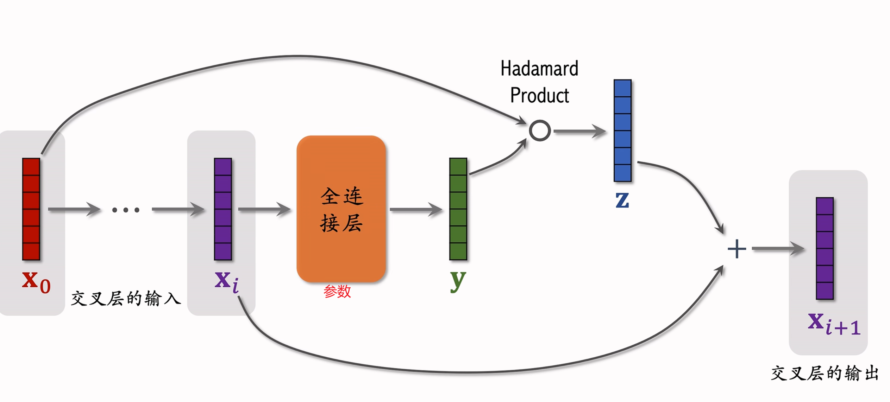

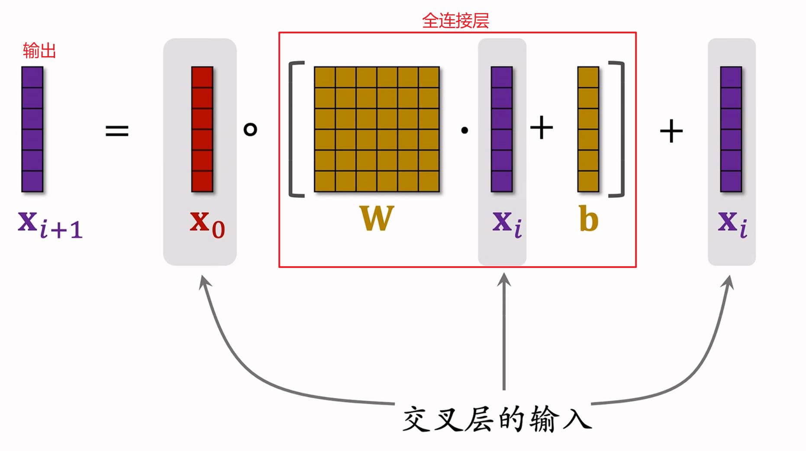

**交叉网络**

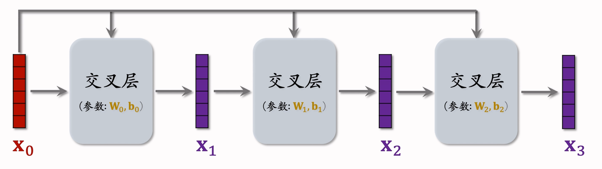

**深度交叉网络**

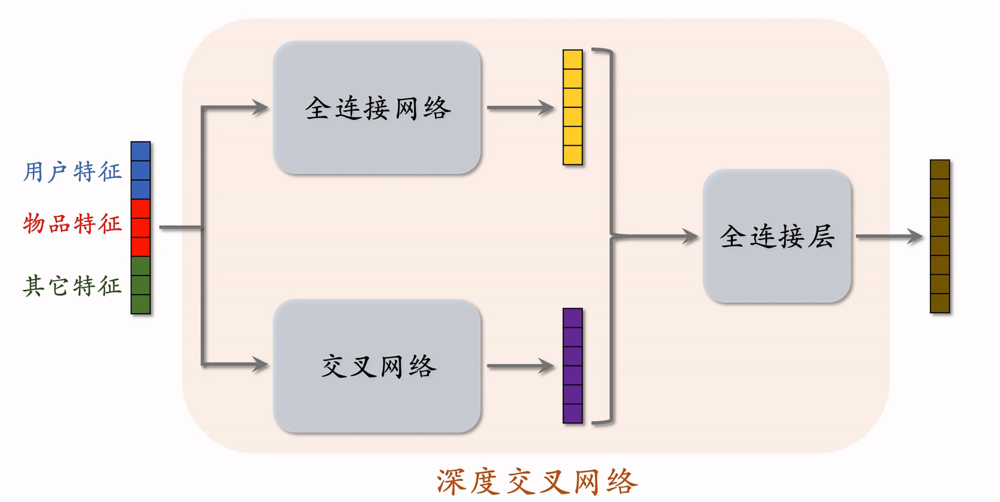

## LHUC（PPNet）

在工业界有效，但是只能用于精排

LHUC起源于语音识别

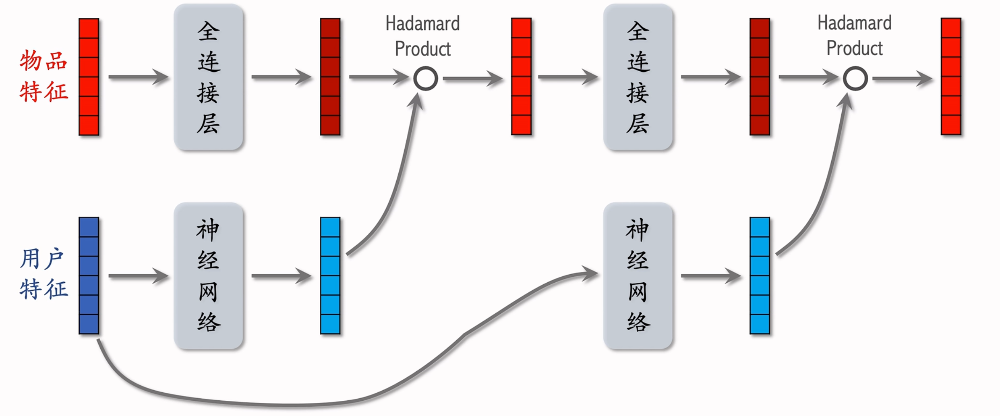

## SENet & Bilinear Cross

**SENet**

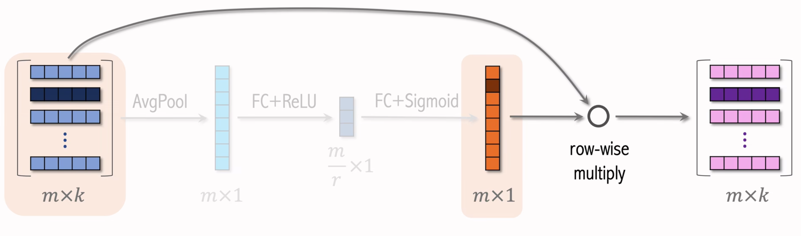

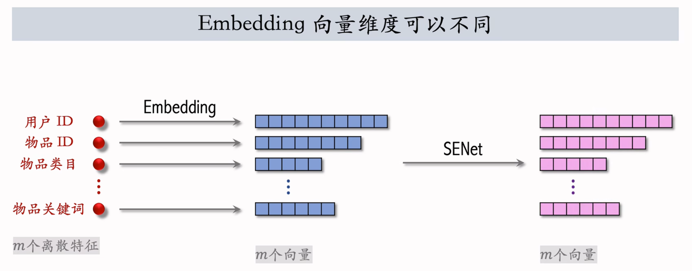

+ SENet对离散特征做field-wise加权
+ Field：
  + 用户ID Embedding是64维向量
  + 64个元素算一个field,获得相同的权重
+ 如果有m个fields,那么权重向量是m维

**Bilinear Cross**

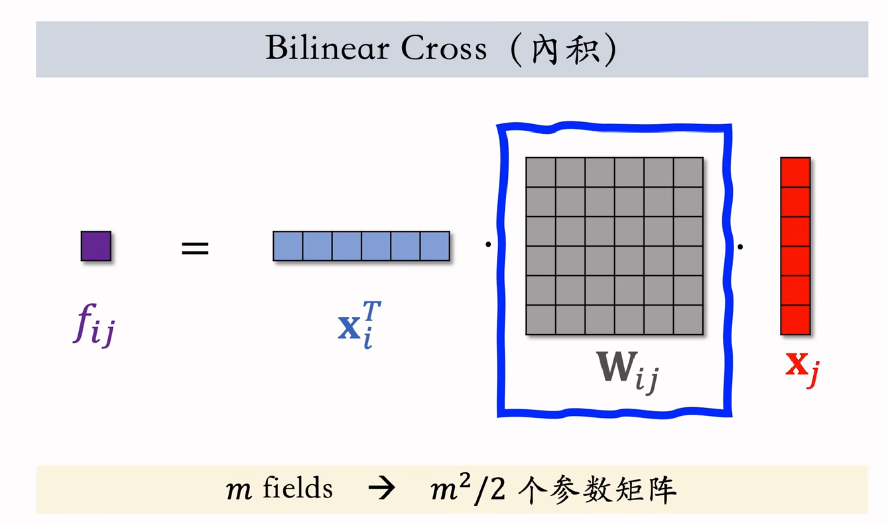

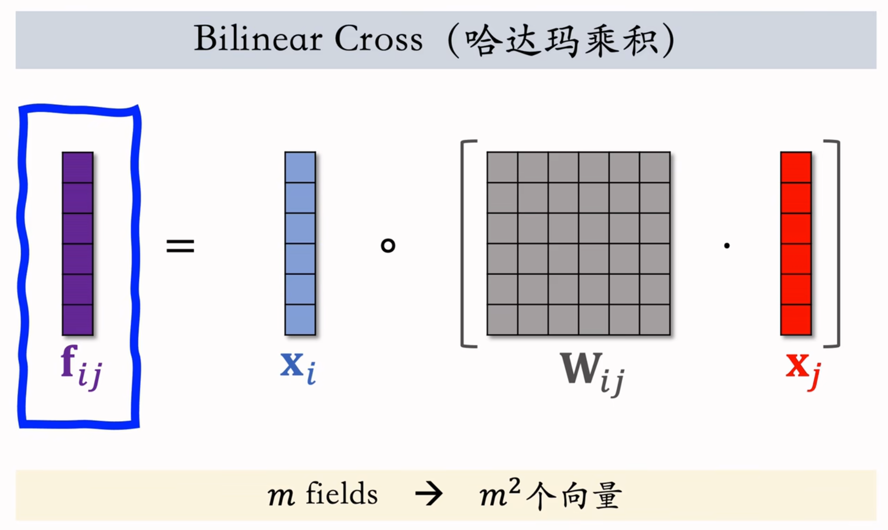

**小结**

1. SENet对离散特征做field-wise加权 
2. Field间特征交叉：
   + 向量內积
   + 哈达玛乘积
   + Bilinear cross

**FiBiNet**

将SENet与Bilinear结合

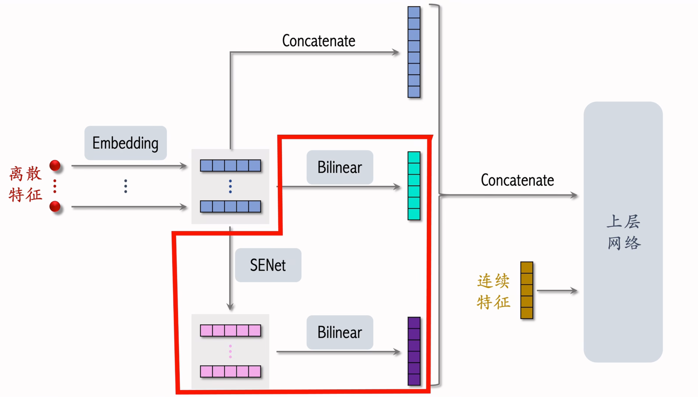

# 行为序列

## 用户历史行为序列建模

**LastN特征**

+ LastN：用户最近的n次交互（点击、点赞等)的物品ID
+ 对LastN物品ID做embedding，得到n个向量
+ 把n个向量取平均，作为用户的一种特征
+ 适用于召回双塔模型、粗排三塔模型、精排模型

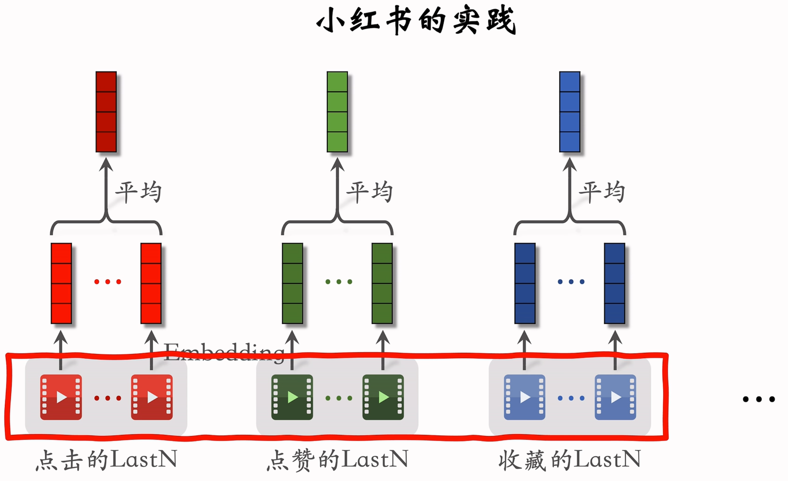

## DIN模型（注意力机制）

+ DIN用加权平均代替平均，即注意力机制(attention)
+ 权重：候选物品与用户LastN物品的相似度

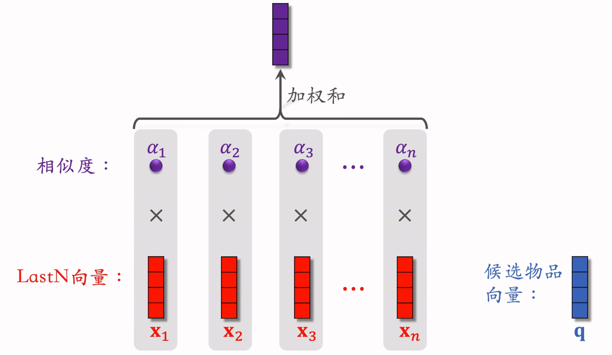

**总结**

+ 对于某候选物品，计算它与用户LastN物品的相似度
+ 以相似度为权重，求用户LastN物品向量的加权和，结果是一个向量
+ 把得到的向量作为一种用户特征，输入排序模型，预估（用户，候选物品）的点击率、点赞率等指标
+ 本质是注意力机制（attention）

**简单平均 VS 注意力机制**

+ 简单平均和注意力机制都适用于精排模型
+ 简单平均适用于双塔模型、三塔模型
  + 简单平均只需要用到LastN，属于用户自身的特征
  + 把LastN向量的平均作为用户塔的输入。
+ 注意力机制不适用于双塔模型、三塔模型。
  + 注意力机制需要用到LastN + 候选物品。
  + 用户塔看不到候选物品，不能把注意力机制用在用户塔

## SIM模型（长序列建模）

**DIN模型的缺点**

+ 注意力层的计算量∝n（用户行为序列的长度)
+ 只能记录最近几百个物品，否则计算量太大
+ 缺点：关注短期兴趣，遗忘长期兴趣

**如何改进DIN？**

**目标：**保留用户长期行为序列（n很大），而且计算量不会过大。

**改进DIN：**

+ DIN对LastN向量做加权平均，权重是相似度。
+ 如果某LastN物品与候选物品差异很大，则权重接近零。
+ 快速排除掉与候选物品无关的LastN 物品，降低注意力层的计算量。

**SIM模型**

+ 保留用户长期行为记录，n的大小可以是几千
+ 对于每个候选物品，在用户LastN记录中做快速查找，找到k个相似物品
+ 把LastN变成TopK，然后输入到注意力层
+ SIM模型减小计算量（从n降到k)

**第一步：查找**

+ 方法一：Hard Search
  + 根据候选物品的类目，保留LastN物品中类目相同的
  + 简单，快速，无需训练。
+ 方法二：Soft Search
  + 把物品做embedding，变成向量。
  + 把候选物品向量作为query，做k近邻查找，保留LastN物品中最接近的k个。
  + 效果更好，编程实现更复杂。

**第二部：注意力机制**

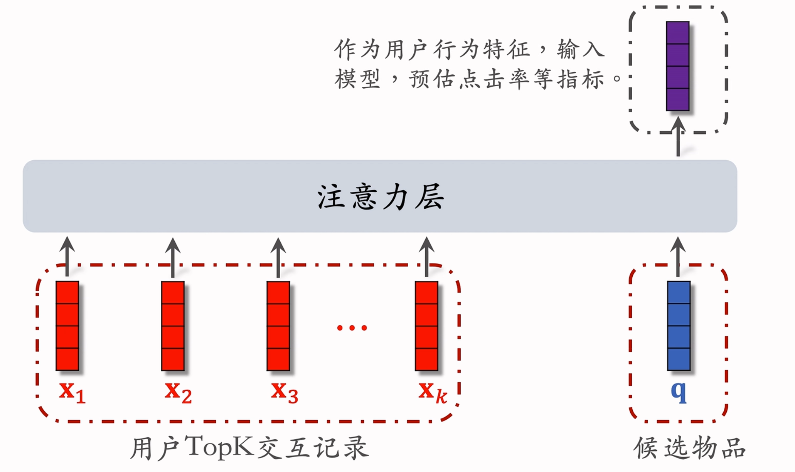

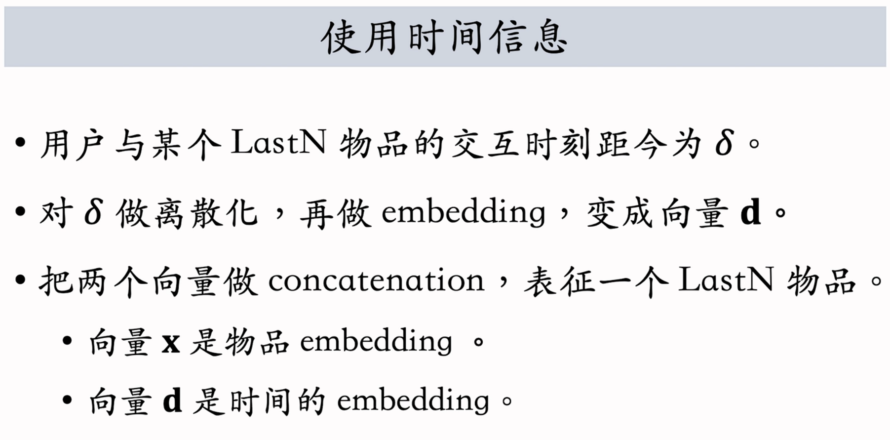

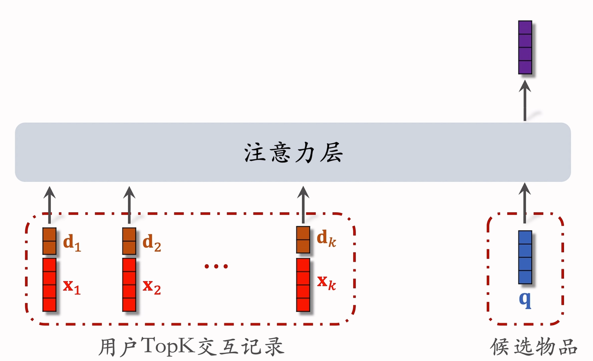

**为什么SIM使用时间信息？**

+ DIN的序列短，记录用户近期行为
+ SIM的序列长，记录用户长期行为
+ 时间越久远，重要性越低。

**结论**

+ 长序列（长期兴趣)优于短序列（近期兴趣）
+ 注意力机制优于简单平均
+  Soft search还是hard search?取决于工程基建
+ 使用时间信息有提升

# 重排

## 物品多样性的度量、提升多样性的方法

**相似性度量**

+ 基于物品属性标签（类目、品牌、关键词）

+ 基于物品向量标签
  + 用于召回的双塔模型学习到的物品向量（不好）
  + 基于内容的向量表征（好）

双塔模型得到的物品表征：效果不好，存在长尾效应

基于图文内容的表征，利用CLIP

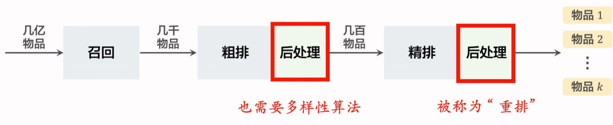

## MMR多样性算法

**多样性**

+ 精排对物品打分后的分数reward1，reward2...rewardn
+ 第i个和第j个物品的相似度为sim（i，j）
+ 从n个物品中选取k个，既要有高精排分数也要有多样性

**多样性算法**

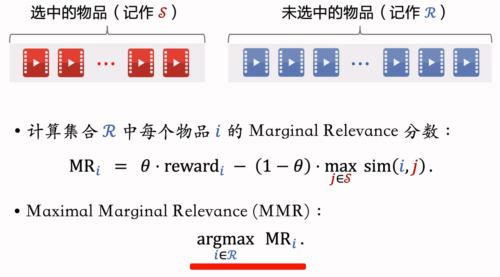

通过未选中物品与已选中物品的相似性来确定是否加入集合

**MMR算法流程**

+ 做初始化，已选中为空，未选中为全集
+ 选择精排分数最高的物品移入选中集合
+ 做k-1轮循环
  + 计算未选中物品的MR分数
  + 选出分数最高的物品移入选中集合

**滑动窗口**

MMR存在问题：已选中的物品过多，sim接近1

解决方法：设置一个滑动窗口，用窗口内物品代替MMR公式中已选中的物品

## 业务规则约束下的多样性算法

**重排的规则**（以xhs为例）

1. 最多连续出现k篇某种笔记
2. 每k篇笔记最多出现1篇某种笔记（指运营推广笔记）
3. 前t篇笔记最多出现k篇某种笔记

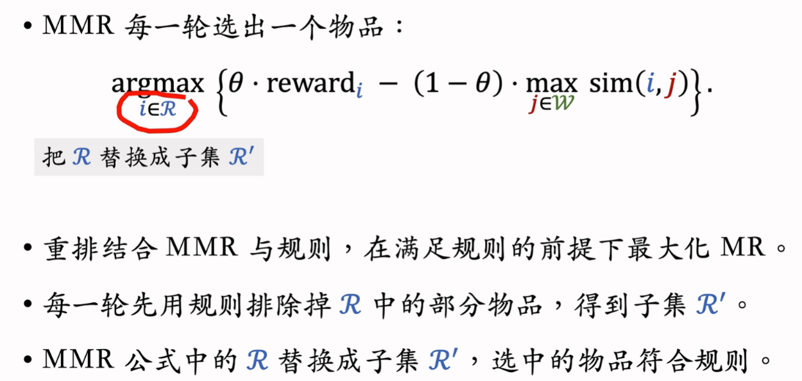

## DPP多样性算法

DPP的目标是从一个集合中尽可能选择多样性的物品

**超平行体**

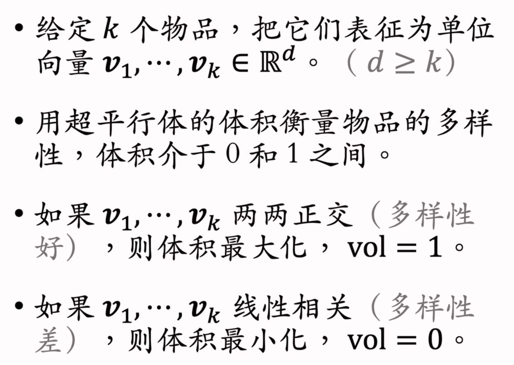

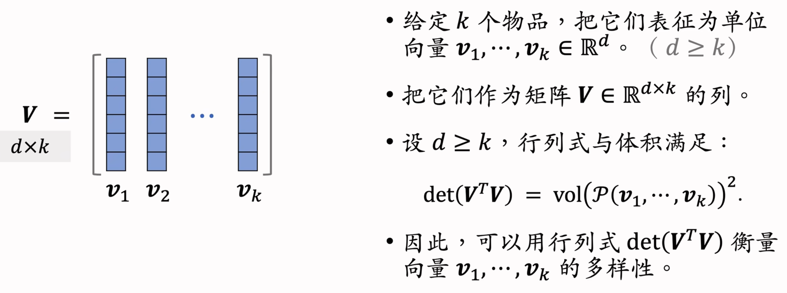

精排给n个物品打分得到：reward1，reward2...

n个物品的向量表征v1，v2...vn

从n个物品中选出k个物品，组成集合S，要求：

+ 价值大，reward之和越高越好
+ 多样性好：k个向量组成的超平行体的体积越大越好，因为k<d，所以此时可以用行列式 $V^TV$ 来计算体积
+ DPP：用行列式衡量多样性

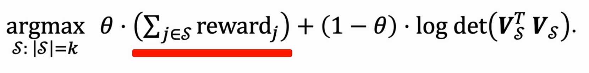

第一项为reward之和，第二项衡量多样性

用贪心算法近似求解公式

和MMR一样存在着S过大时的过相似问题

解决方法：滑动窗口

# 物品冷启动

## 优化目标 & 评价指标

**优化冷启的目标**

+ 精准推荐
+ 激励发布
+ 挖掘高潜

**评价指标**

+ 作者侧指标：
  + 发布渗透率、人均发布量
+ 用户侧指标：
  + 新笔记指标：新笔记的点击率、交互率
  + 大盘指标：消费时长、日活、月活。
+ 内容侧指标：
  + 高热笔记占比。

发布渗透率 = 当日发布人数 / 日活人数

人均发布量 = 当日发布笔记数 / 日活人数

**冷启动的优化点**

+ 优化全链路（包括召回和排序）
+ 流量调控（流量怎么在新物品、老物品中分配）

## 简单的召回通道

**召回的依据**

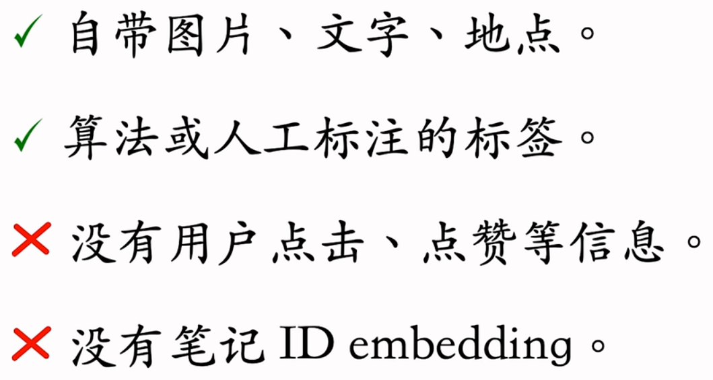

**冷启召回的困难**

+ 缺少用户交互，还没学好笔记ID embedding，导致双塔模型效果不好
+ 缺少用户交互，导致ItemCF不适用

**召回通道**

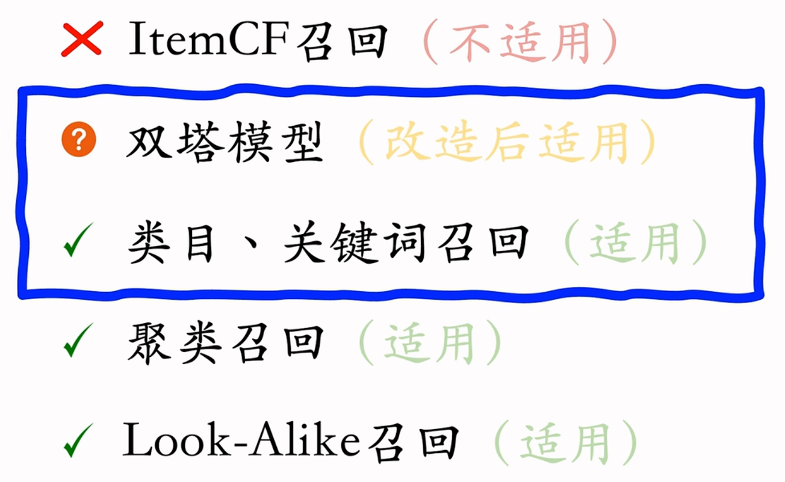

**双塔模型**

+ 改进方案1：新笔记使用 default embedding
+ 改进方案2：利用相似笔记 embedding 向量
+ 在实际中，会设置多个向量召回池，让新笔记有更多曝光机会，共享同一个双塔模型，多个召回池不增加训练代价

**类目召回**

维护用户画像，记录感兴趣类目和关键词

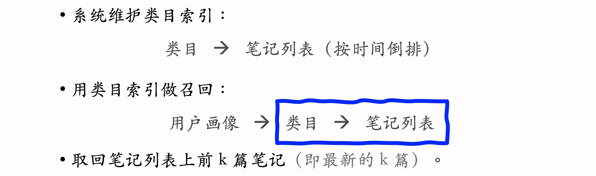

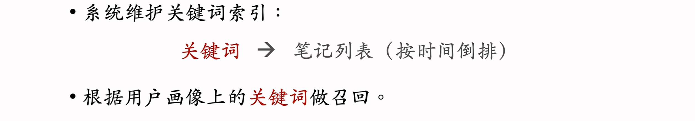

**缺点**

+ 缺点1：只对刚刚发布的新笔记有效
  + 取回某类目/关键词下最新的k篇笔记
  + 发布几小时之后，就再没有机会被召回
+ 缺点2：
  + 弱个性化，不够精准

## 聚类召回

新笔记发布会，用神经网络映射为特征向量，找到与它最相似的笔记的聚类，将其归于该聚类中

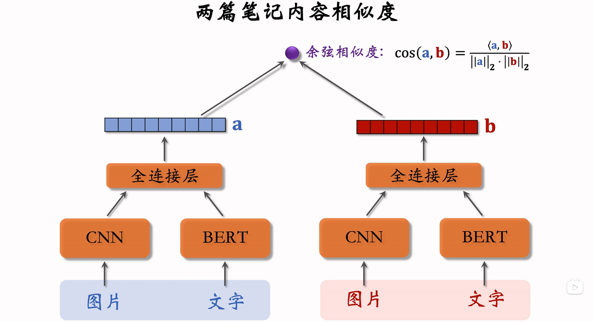

**小结**

+ 基本思想：根据用户的点赞、收藏、转发记录，推荐内容相似的笔记
+ 线下训练：多模态神经网络把图文内容映射到向量
+ 线上服务：用户喜欢的笔记 -> 特征向量 -> 最近的Cluster -> 新笔记

## Look-Alike 人群扩散

+ 点击、，点赞、收藏、转发一用户对笔记可能感兴趣。
+ 把有交互的用户作为新笔记的种子用户。
+ 用look-alike在相似用户中扩散。 

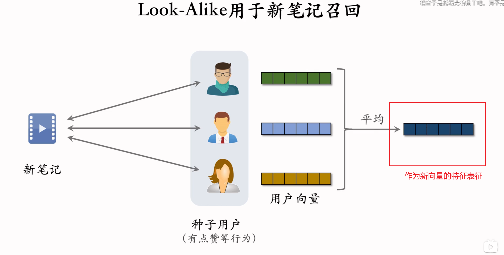

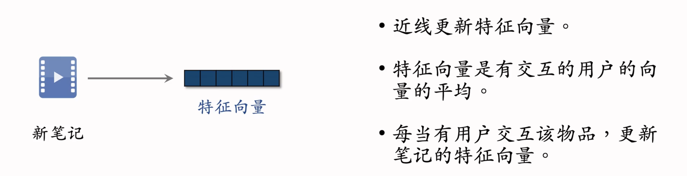

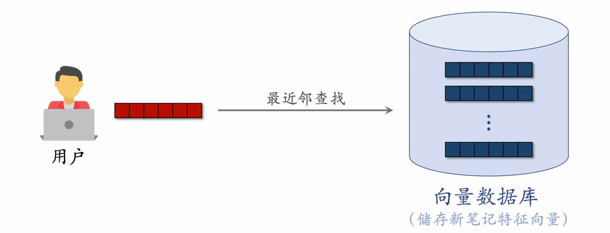

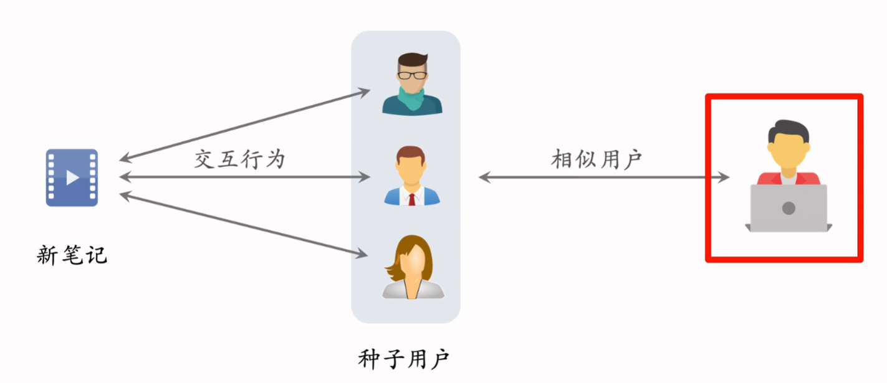

**流量调控**

**扶持新笔记的目的**

+ 目的1：促进发布，增大内容池。
  + 新笔记获得的曝光越多，作者创作积极性越高。
  + 反映在发布渗透率、人均发布量。
+ 目的2：挖掘优质笔记
  + 做探索’让每篇新笔记都能获得足够曝光
  + 挖掘的能力反映在高热笔记占比。

**流量调控技术的发展**

1. 在推荐结果中强插新笔记
2. 对新笔记的排序分数做提权(boost)
3. 通过提权，对新笔记做保量
4. 差异化保量

**新笔记提权（boost）**

+ 目标：让新笔记有更多机会曝光
  + 如果做自然分发，24小时新笔记占比为1/30
  + 做人为干涉，让新笔记占比大幅提升
+ 干涉粗排、重排环节，给新笔记提权
+ 优点：容易实现，投入产出比好
+ 缺点：
  + 曝光量对提权系数很敏感
  + 很难精确控制曝光量，容易过度曝光和不充分曝光

**新笔记保量**

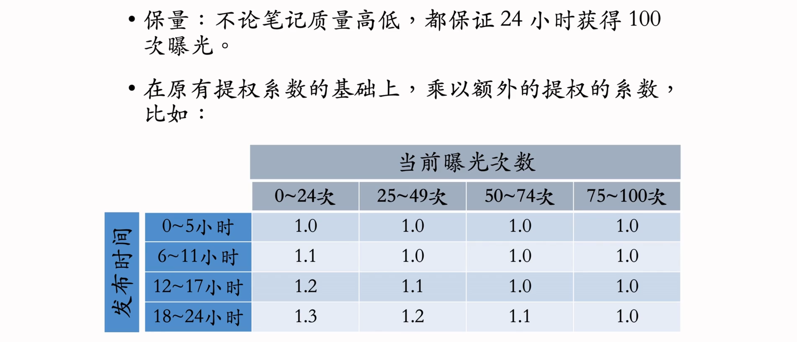

**用下面四个值计算提权系数**

+ 目标时间：比如24小时
+ 目标曝光：比如100次
+ 发布时间：比如笔记已经发布12小时
+ 已有曝光：比如笔记已经获得20次曝光

提权系数 = f(发布时间 /  目标时间，已有曝光 / 目标曝光) = f(0.5 , 0.2)

**保量的难点**

+ 保量成功率远低于100%
+ 线上环境变化会导致保量失败
+ 给新笔记分数bo0st越多，对新笔记越有利？否

**差异化保量**

+ 保量：不论新笔记质量高低，都做扶持，在前24小时给100次曝光。
+ 差异化保量：不同笔记有不同保量目标，普通笔记保100次曝光，内容优质的笔记保100~500次曝光。

**小结**

+ 流量调控：流量怎么在新老笔记之间分配
+ 扶持新笔记：单独的召回通道、在排序阶段提权
+ 保量：帮助新笔记在前24小时获得100次曝光
+ 差异化保量：根据内容质量、作者质量，决定保量目标

## 冷启动的AB测试（未理解）

**总结**

+ 冷启的AB测试需要观测作者发布指标和用户消费指标。
+ 各种AB测试的方案都有缺，点。（小红书有更好的方案，但也不完美。)
+ 设计方案的时候，问自己几个问题：
  + 实验组、对照组新笔记会不会抢流量？
  + 新笔记、老笔记怎么抢流量？
  + 同时隔离笔记、用户，会不会让内容池变小？
  + 如果对新笔记做保量，会发生什么？

# 涨指标的方法

## 概述

**评价指标**

+ 日活用户数(DAU)和留存是最核心的指标
+ 目前工业界最常用LT7和LT30衡量留存
+ 其他核心指标：用户使用时长、总阅读数（即总，点击数)总曝光数。这些指标的重要性低于DAU和留存
+ 非核心指标：点击率、交互率、等等
+ 对于UGC平台，发布量和发布渗透率也是核心指标

**涨指标的方法**

+ 改进召回模型，添加新的召回模型
+ 改进粗排和精排模型
+ 提升召回、粗排、精排中的多样性
+ 特殊对待新用户、低活用户等特殊人群
+ 利用关注、转发、评论这三种交互行为

## 召回

**改进双塔模型**

+ 方向1：优化正、负样本
  + 简单正样本：有点击的（用户，物品）
  + 简单负样本：随机组合的（用户，物品）二元组
  + 困难负样本：排序靠后的（用户，物品）二元组
+ 方向2：改进神经网络结构
  + Baseline：用户塔、物品塔分别是全连接网络，各输出一个向量，分别作为用户、物品的表征
  + 改进：用户塔、物品塔分别用DCN代替全连接网络
  + 改进：在用户塔中使用用户行为序列（last-n）
  + 改进：使用多向量模型代替单向量模型。（标准的双塔模型也叫单向量模型）
+ 方向3：改进模型的训练方法
  + Baseline：做二分类，让模型学会区分正样本和负样本
  + 改进：结合二分类、batch内负采样。（对于batch内负采样，需要做纠偏。)
  + 改进：使用自监督学习方法，让冷门物品的embedding学得更好

**改进I2I模型**

+ 综合使用ItemCF及其变体

  线上同时使用ItemCF、Online ItemCF、Swing、Online Swing模型，各分配一定份额

+ 基于物品向量表征，计算物品相似度

  采用双塔、图神经网络计算表征

**采用小众召回模型**

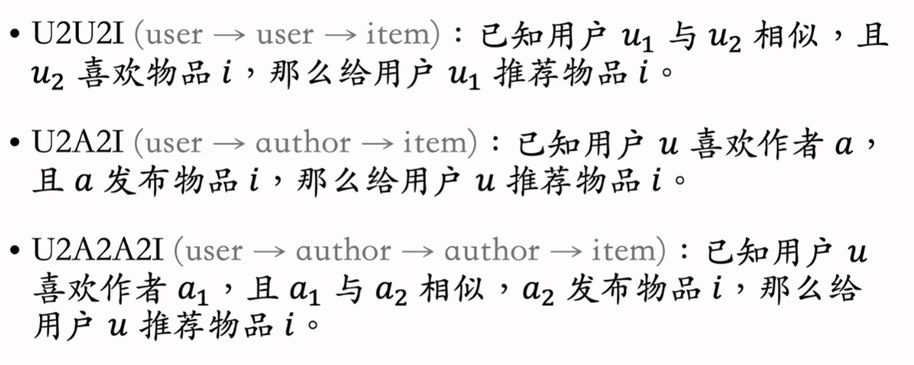

## 排序模型

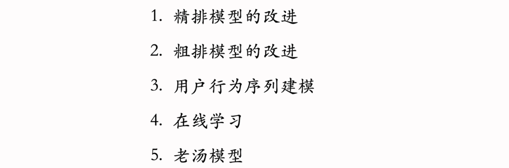

**精排模型的改进**

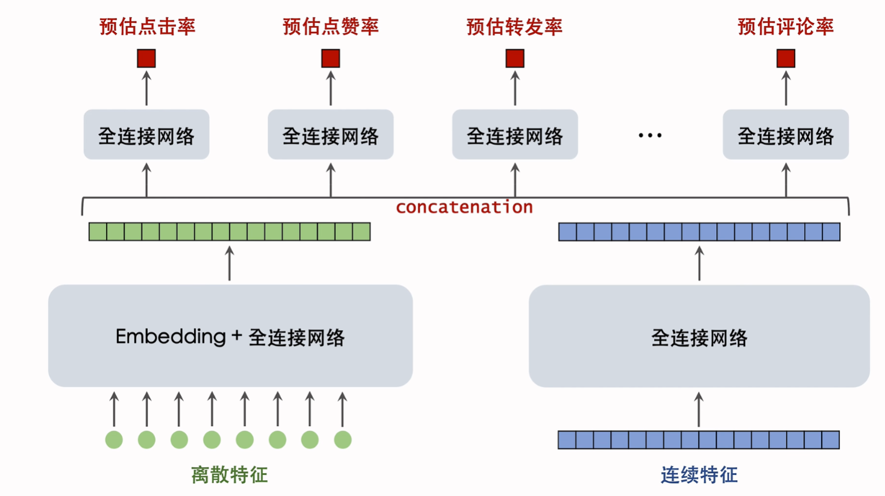

1. 改进基座
   + 基座的输入为连续特征和离散特征，输出一个向量，作为多目标预估的输入
   + 改进1：基座加宽加深，计算量更大，预测更准确
   + 改进2：做自动的特征交叉，比如bilinear和LHUC
   + 改进3：特征工程，比如添加统计特征、多模态内容特征
2. 改进多目标预估
   + 基于基座输出的向量，同时预估点击率等多个目标
   + 改进1：增加新的预估目标，并把预估结果加入融合公式
   + 改进2：MMoE、PLE等结构可能有效，但往往无效
   + 改进3：纠正 position bias 可能有效，也可能无效

**粗排模型**

+ 粗排的打分量比精排大10倍，因此粗排模型必须够快
+ 简单模型：多向量双塔模型，同时预估点击率等多个目标
+ 复杂模型：三塔模型效果好，但工程实现难度较大

**粗精排一致性建模**

+ 蒸馏精排训练粗排，让粗排与精排更一致。
+ 方法1：pointwise蒸馏
+ 方法2：pairwise或listwise蒸馏
+ 优点：粗精排一致性建模可以提升核心指标
+ 缺点：如果精排出bug，精排预估值p有偏，会污染粗排训练数据

**用户行为序列建模**

+ 改进1：增加序列长度，让预测更准确，但是会增加计算成本和推理时间
+ 改进2：筛选的方法，比如用类目、物品向量表征聚类
+ 改进3：对用户行为序列中的物品，使用ID以外的一些特征
+ 概括：沿着SIM的方向发展，让原始的序列尽量长，然后做筛选降低序列长度，最后将筛选结果输入DIN

**在线学习**

在线学习的资源消耗

+ 线上有m个模型，其中1个是holdout，1个是推全的模型，m-2个测试的新模型
+ 每套在线学习的机器成本都很大，因此数量很小，制约模型开发迭代的效率
+ 在线学习对指标的提升巨大，但是会制约模型开发迭代的效率

**老汤模型**

存在问题

老模型训练时间更久，数据更多，新模型训练时间段，对比困难

如何判断新模型更优？

新老模型随机初始化全连接层，用n天的数据训练看结果

如何快速追平老模型？

+ 尽可能复用老模型训练好的embedding层，而非初始化embedding层
+ 用老模型做teacher，蒸馏新模型

## 多样性

+ 精排：结合兴趣分数和多样性分数做排序；做规则打散。
+ 粗排：只用兴趣分数选出部分物品；结合兴趣分数和多样性分数选出部分物品。
+ 召回：往双塔模型的用户向量添加噪声；对用户行为序列做非均匀随机抽样（对双塔和U2I2I都适用）
+ 兴趣探索：保留少部分的流量给非个性化推荐。

## 特殊用户人群

1. 构造特殊内容池，用于特殊用户人群的召回
2. 使用特殊排序策略，保护特殊用户
3. 使用特殊的排序模型，消除模型预估的偏差

**召回：构造特殊内容池**

+ 根据物品获得的交互次数、交互率选择优质物品
+ 做因果推断，判断物品对人群留存率的贡献，按照贡献值选择物品

**排序策略**

+ 排除低质量物品，保护特殊人群的体验
+ 对于特殊用户人群使用特殊的融分公式

**排序模型**

+ 结合大模型和小模型，小模型拟合大模型的残差，对大模型做校准
+ 只用一个模型，模型有多个expert

**差异化的排序模型**

+ 方法1：大模型+小模型
+ 方法2：融合多个experts，类似MMoE
+ 方法3：大模型预估之后，用小模型做校准

**错误做法**

+ 每个用户人群使用一个排序模型，推荐系统同时维护多个大模型
+ 短期可以提升指标；维护代价大，长期有害。

##  利用交互行为

+ 关注：
  + 留存价值（让新用户关注更多作者，提升新用户留存)；
  + 发布价值（帮助新作者获得更多粉丝，提升作者发布积极性)；
  + 利用隐式关注关系做召回。
+ 转发：
  + 判断哪些用户是站外的K○L,利用他们转发的价值，吸引站外的流量。
+ 评论：
  + 发布价值（促使新物品获得评论，提升作者发布积极性)；
  + 留存价值（给喜欢讨论的用户创造更多留评机会)；
  + 鼓励高质量评论的用户多留评论。

