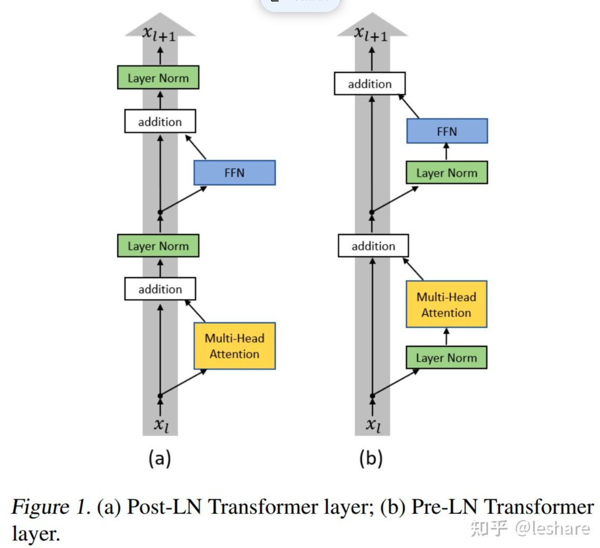

# 面经

## pre norm和post norm的区别

`Pre-Norm` 和 `Post-Norm` 是 Transformer 模型中 **Layer Normalization（层归一化）** 两种不同的放置方式，它们对模型的训练稳定性、收敛速度和最终性能有显著影响。

✅ 1. Post-Norm（后置归一化）

公式：

$$ \text{Output} = \text{LayerNorm}(x + \text{SubLayer}(x)) $$

特点：

+ 优点
  + 残差连接在归一化之前，梯度可以直接流过 $x$，训练更稳定
  + 在浅层网络（如 12 层 BERT）中表现良好
+ 缺点
  + 在深层网络（如 > 50 层）中，**最后一层的 LayerNorm 会“掩盖”前面层的累积信号**，导致模型容量无法充分利用
  + 梯度在深层时容易衰减，训练困难

> 📌 适用于：**层数较少的模型**（如 BERT-base, 12 层）

✅ 2. Pre-Norm（前置归一化）

这是后来在深层模型中广泛采用的方式。

公式：

$$ \text{Output} = x + \text{SubLayer}(\text{LayerNorm}(x)) $$

特点：

+ 优点
  + LayerNorm 在子层之前，先对输入做归一化，**提升子层输入的稳定性**
  + 更适合**深层网络**，因为归一化提前，避免了深层梯度消失
  + 大模型（如 GPT、BERT-large）普遍使用
+ 缺点
  + 由于归一化在残差之前，**模型最后一层没有归一化**，输出的尺度可能不稳定
  + 训练初期可能不如 Post-Norm 稳定

> 📌 适用于：**深层模型**（如 GPT-3、BERT-large）

✅ 二、直观对比表

| 特性                   | Post-Norm               | Pre-Norm              |
| ---------------------- | ----------------------- | --------------------- |
| **LayerNorm 位置**     | 残差连接之后            | 残差连接之前          |
| **公式**               | $\text{LN}(x + F(x))$   | $x + F(\text{LN}(x))$ |
| **提出时间**           | 原始 Transformer (2017) | 后续改进（2018+）     |
| **训练稳定性**         | 浅层稳定，深层不稳定    | 深层更稳定            |
| **适合模型深度**       | 浅层（≤ 12 层）         | 深层（> 12 层）       |
| **梯度流动**           | 残差直接参与归一化      | 归一化提前，稳定输入  |
| **是否最后一层归一化** | ✅ 是                    | ❌ 否（最后一层无 LN） |
| **大模型主流选择**     | ❌ 否                    | ✅ 是                  |

------

✅ 三、为什么 Pre-Norm 更适合大模型？

在深层网络中：

+ Post-Norm 的 LayerNorm 在残差之后，会**重置每一层的输出分布**，导致深层网络的表达能力受限
+ Pre-Norm 提前归一化输入，让每一层的输入更稳定，**缓解梯度消失**，更容易训练

> 📌 实验表明：当模型超过 20 层后，**Pre-Norm 的收敛速度和最终性能通常优于 Post-Norm**。

------

✅ 四、有没有折中方案？—— DeepNorm, Post-LN with Scaling

随着模型变深，人们也在改进：

1. **DeepNorm**（2022）

+ 对残差连接加缩放：$ x + \alpha \cdot F(\text{LayerNorm}(x)) $
+ 配合 Pre-Norm，进一步稳定超深层训练

2. **Post-Norm with Warmup**

+ 使用 Post-Norm，但配合学习率预热和小初始化，也能训练深层模型

------

✅ 五、总结

| 选择建议                           | 推荐方案                        |
| ---------------------------------- | ------------------------------- |
| 训练一个 12 层以内的 BERT          | ✅ Post-Norm（原汁原味）         |
| 训练 GPT、大模型、深层 Transformer | ✅ **Pre-Norm**（工业界标准）    |
| 超深层模型（> 100 层）             | ✅ Pre-Norm + DeepNorm / Scaling |

> ✅ **一句话总结**：
>
> + **Post-Norm**：归一化在残差后，浅层稳定，适合小模型。
> + **Pre-Norm**：归一化在残差前，输入更稳，**大模型标配**。

在实际工程中，如果你在复现 GPT 或训练大模型，**默认使用 Pre-Norm**。