# 知识点扫盲

# 基础知识

## c++中的智能指针

**智能指针（Smart Pointer）** 是 C++ 中管理动态内存的一种重要机制，它能在对象不再被使用时**自动释放内存**，从而避免内存泄漏和悬空指针等问题。

智能指针其实是一个 **类模板**，表现得像普通指针，但会自动管理内存释放。
 在析构函数中调用 `delete`，从而自动清理资源。

## python、java、C++的垃圾回收机制？

+ C++：**手动内存管理 + 智能指针辅助**
+ Java：**自动垃圾回收**
+ Python：**引用计数 + 垃圾回收器（循环检测）**

| 特性         | C++                              | Java                              | Python                        |
| ------------ | -------------------------------- | --------------------------------- | ----------------------------- |
| 内存管理     | 手动 (`new/delete`) + RAII       | JVM 自动GC                        | 引用计数 + 循环GC             |
| 主要机制     | 编译期生命周期控制               | 可达性分析 (Mark-Sweep/Compact等) | 引用计数 + 分代垃圾回收       |
| 回收时机     | 离开作用域                       | 不确定，由GC触发                  | 引用计数实时 + 周期性循环检测 |
| 是否有GC暂停 | ❌ 无                             | ✅ 有（STW）                       | ⚠️ 有时有（gc.collect）        |
| 控制粒度     | 最精确                           | 不可控                            | 部分可控（gc模块）            |
| 性能         | 最高，可预测                     | 稍慢，有GC开销                    | 较慢（解释器+GC）             |
| 内存安全性   | 易出错                           | 安全                              | 安全                          |
| 应用场景     | 高性能、实时系统（游戏、嵌入式） | 大型企业级系统                    | 快速开发、AI、数据分析        |

## 栈和堆

**栈（Stack）**

- 是由**编译器自动分配和释放**的内存区域；
- 用来存放**函数调用信息（栈帧）**、**局部变量**、**函数参数**等；
- 遵循 **后进先出（LIFO）** 原则。

**堆（Heap）**

- 是由**程序员或运行时系统动态分配**的内存；
- 生命周期**不受作用域限制**；
- 需要**手动释放**（或依赖垃圾回收）。

| 对比项       | 栈（Stack）                  | 堆（Heap）                   |
| ------------ | ---------------------------- | ---------------------------- |
| **分配方式** | 自动（系统分配）             | 手动（程序员或GC）           |
| **管理者**   | 编译器 / 操作系统            | 程序员 / 垃圾回收器          |
| **分配效率** | 高（顺序分配）               | 低（动态分配，需查找空闲块） |
| **内存大小** | 较小（通常几MB）             | 较大（受系统限制）           |
| **生命周期** | 随函数调用结束销毁           | 直到手动释放或GC回收         |
| **碎片化**   | 不会碎片化                   | 可能会碎片化                 |
| **访问速度** | 快（连续内存）               | 相对慢（分散分配）           |
| **典型用途** | 局部变量、函数参数、返回地址 | 动态对象、全局共享数据       |

## 进程和线程

进程（Process）

+ 进程是**操作系统资源分配的基本单位**。
+ 每个进程都有自己独立的地址空间、内存、文件句柄等资源。

线程（Thread）

+ 线程是**CPU调度的基本单位**。
+ 它运行在进程之中，共享同一进程的内存与资源。

# 机器学习

## 怎么理解推荐系统中的embedding坍塌？

Embedding 维度坍塌是指特征 Embedding 虽然处在高维空间，但实际仅占据低维子空间，从而导致信息丢失。这种情况在大规模推荐系统中非常常见。  

这是因为后续特征交叉中的 MLP 与 Embedding 之间会产生耦合关系，简单来说就是 rank(AB) ≤ rank(A)，因此只要其中存在一个低秩特征，交叉后的结果也会是低秩的，这一现象同样在 FFM 特征交叉中出现。  

为了衡量 Embedding 是否发生坍塌，可以利用奇异值的分布来度量信息的丰富程度。但特征坍塌也不一定是坏事：在大多数情况下，严重的特征坍塌意味着表征维度被浪费，信息不足，从而损害模型效果。但在某些应用中，适度的坍塌可能是一种正则化效果（高维 Embedding 空间可能过拟合训练集），有助于减少过拟合。在实际推荐系统中，通常会通过减少显式特征交叉（如避免 DCNv2 这类结构），而更多依赖隐式交叉（如 DNN）来缓解坍塌问题。不过，这也可能导致 离线 AUC 下降 或 推荐效果降低 的副作用（显式特征交叉效果优于隐式）。

## 决策树

**基本原理：**

决策树通过 **一系列特征划分** 将样本空间不断分割成更纯的子集。

- 每次划分选择一个特征；
- 依据该特征的某个取值（或阈值）将数据集划分；
- 重复这一过程直到叶节点纯净或达到停止条件。

**“纯度” 的度量**

为了选择最优划分特征，需要定义“纯度（purity）”或“不纯度（impurity）”的度量标准。

 (1) 信息熵（Entropy）

用于 **ID3 / C4.5 算法**。

越纯净（即越倾向于某一类），熵越小。

 (2) 信息增益（Information Gain）

选择划分后，熵减少得越多，越好：

ID3 算法用这个指标选择特征。

(3) 信息增益率（Gain Ratio）

C4.5 用于修正 ID3 的“偏好多值特征”问题：

 (4) 基尼指数（Gini Index）

用于 **CART** 算法：越小代表越纯。

**停止条件**

树会一直分裂，直到：

- 节点样本全属于同一类；
- 或者样本数量小于阈值；
- 或者所有特征都用完。

**ID3**

**信息熵**

信息熵（Entropy）是接受信息量的平均值，用于确定信息的不确定程度，是随机变量的均值。

信息熵表示的是不确定度。均匀分布时，不确定度最大，此时熵就最大。

**信息增益**

当选择某个特征对数据集进行分类时，分类后的数据集信息熵会比分类前的小，其差值表示为信息增益。

**算法流程**

输入：数据集D，特征集A

输出：ID3决策树

- 对当前样本集合计算出所有属性信息的信息增益
- 先选择信息增益最大的属性作为测试属性，将测试属性相同的样本转化为同一个子样本
- 若子样本集的类别属性只含有单个属性，则分支为叶子节点，判断其属性值并标上相应的符号，然后返回调用处，否则对子样本递归调用本算法。

**ID3算法的优点：**

- 算法结构简单；
- 算法清晰易懂；
- 非常灵活方便；
- 不存在无解的危险；
- 可以利用全部训练例的统计性质进行决策，从而抵抗噪音。

**ID3算法简单，但是其缺点也不少：**

- ID3算法采用信息增益来选择最优划分特征，然而人们发现，信息增益倾向与取值较多的特征，对于这种具有明显倾向性的属性，往往容易导致结果误差；
- ID3算法没有考虑连续值，对与连续值的特征无法进行划分；
- ID3算法无法处理有缺失值的数据；
- ID3算法没有考虑过拟合的问题，而在决策树中，过拟合是很容易发生的；
- ID3算法采用贪心算法，每次划分都是考虑局部最优化，而局部最优化并不是全局最优化，当然这一缺点也是决策树的缺点，获得最优决策树本身就是一个NP难题，所以只能采用局部最优；

**C4.5**

**C4.5算法进行了以下几点改进：**

- 用**信息增益率**来选择属性，克服了ID3算法选择属性时偏向选择取值多的属性的不足
- 在决策树的构造过程中进行剪枝，不考虑某些具有很好元素的节点。
- 能够完成对连续属性的离散化处理。
- 能够对不完整数据进行处理。

**算法流程：**

1. 输入：训练数据集 D，包含若干样本和属性，每个样本有一个类标号
2. 输出：决策树
3. 终止条件：
   + 如果数据集中所有样本属于同一类别，则该结点为叶节点，类别为该类。
   + 如果属性集为空，或者样本在属性上取值相同，则将该结点设为叶节点，类别为数据集中样本数最多的类。
4. 选择最优划分属性
   + 计算信息熵、信息增益率
   + 先选出 **信息增益高于平均水平的属性**，再在其中选出 **信息增益率最大的属性** 作为划分属性
5. 处理连续属性：对连续型属性，C4.5 会 **寻找最佳切分点**（通常通过对属性值排序，测试相邻取值的中点作为候选切分点）。
6. 分裂数据集：按选定的属性（或切分点）将数据集划分到子节点，递归地为每个子节点继续建树。
7. **剪枝**：使用 **悲观剪枝法（pessimistic pruning）**，基于验证误差的估计，对生成的决策树进行自底向上的剪枝，防止过拟合。

**CART**

在数据挖掘中，决策树主要有两种类似：分类树和决策树。分类树的输出是样本的类别，回归树的输出是一个实数。分类和回归树，即CART（Classification And Regression Tree），也属于一类决策树。CART算法由决策树生成和决策树剪枝两部分组成：

- 决策树生成：基于训练数据集生成决策树，生成的决策树要尽量的大
- 决策树剪枝：用验证数据集对以生成的树进行剪枝并选择最优子树，这时用损失函数最小作为剪枝的标准。

CART算法既可以用于创建分类树，也可以用于创建回归树。CART算法的重要特点包含以下三个方面：

- 二分(Binary Split)：在每次判断过程中，都是对样本数据进行二分。CART算法是一种二分递归分割技术，把当前样本划分为两个子样本，使得生成的每个非叶子结点都有两个分支，因此CART算法生成的决策树是结构简洁的二叉树。由于CART算法构成的是一个二叉树，它在每一步的决策时只能是“是”或者“否”，即使一个feature有多个取值，也是把数据分为两部分
- 单变量分割(Split Based on One Variable)：每次最优划分都是针对单个变量。
- 剪枝策略：CART算法的关键点，也是整个Tree-Based算法的关键步骤。剪枝过程特别重要，所以在最优决策树生成过程中占有重要地位。有研究表明，剪枝过程的重要性要比树生成过程更为重要，对于不同的划分标准生成的最大树(Maximum Tree)，在剪枝之后都能够保留最重要的属性划分，差别不大。反而是剪枝方法对于最优树的生成更为关键。
- CART树生成就是递归的构建二叉决策树的过程，对回归使用平方误差最小化准则，对于分类树使用基尼指数(Gini index)准则，进行特征选择，生成二叉树。

**基尼指数**

基尼指数跟信息熵的概念是一样的都是描述混乱的程度。基尼指数Gini(D)表示的是集合D的不确定性，基尼指数Gini(D，A)表示数据集D经过特征A划分以后集合D的不确定性，基尼指数越大说明我们集合的不确定性就越大，所以思想基本上和信息熵的概念是一致的。

**我们在候选属性集合A中，选择哪个使得划分后基尼指数最小的属性作为最优划分属性.**

**算法的停止条件有：**

- 节点中的样本个数小于预定阈值，
- 样本集的Gini系数小于预定阈值（此时样本基本属于同一类），
- 或没有更多特征。

## 决策树的剪枝

决策树很容易发生过拟合，可以改善的方法有：

- 通过阈值控制终止条件，避免树形结构分支过细。
- 通过对已经形成的决策树进行剪枝来避免过拟合。
- 基于Bootstrap的思想建立随机森林。

**剪枝的分类**

为了避免决策树过拟合 (Overfitting) 样本，决策树要进行剪枝。CART剪枝算法为了能够对未知数据有更好的预测，从 “完全生长” 的决策树底部剪去一些子树，使决策树变小，模型变简单。预剪枝 (Pre-Pruning) 与后剪枝 (Post-Pruning) 是剪枝的两种情况。

**预剪枝**

预剪枝即是指在决策树的构造过程中，对每个节点在划分前需要根据不同的指标进行估计，如果已经满足对应指标了，则不再进行划分，否则继续划分。

树的增长不能是无限的，因此需要设定一些条件，若树的增长触发某个设定条件时，则树的增长需要进行停止继续。这些设定的条件称作停止条件 (Stopping Criteria), 常用的 停止条件如下：

1. 直接指定树的深度
2. 直接指定叶子节点个数
3. 直接指定叶子节点的样本数
4. 对应的信息增益量
5. 拿验证集中的数据进行验证，看分割前后，精度是否有提高。

由于预剪枝是在构建决策树的同时进行剪枝处理，所以其训练时间开销较少，同时可以有效的降低过拟合的风险。但是，预剪枝有一个问题，会给决策树带来欠拟合的风险，1，2，3，4指标，不用过多解释，对于5指标来说，

虽然，当前划分不能导致性能提高，但是，或许在此基础上的后续划分，却能使性能显著提高呢？

**后剪枝**

后剪枝则是先根据训练集生成一颗完整的决策树，然后根据相关方法进行剪枝。常用的一种方法是，自底向上，对非叶子节点进行考察，同样拿验证集中的数据，来根据精度进行考察。看该节点划分前和划分后，精度是否有提高，如果划分后精度没有提高，则剪掉此子树，将其替换为叶子节点。

相对于预剪枝来说，后剪枝的欠拟合风险很小，同时，泛化能力往往要优于预剪枝，但是，因为后剪枝先要生成整个决策树后，然后才自底向上依次考察每个非叶子节点，所以训练时间长。

**ID3、C4.5、CART之间的区别**

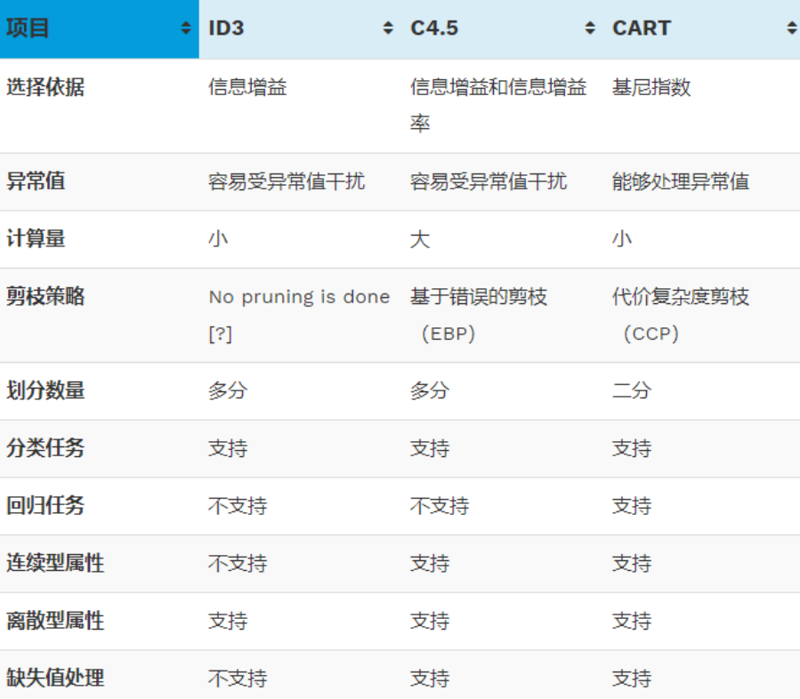

**基于随机森林的决策分类**

随机森林是包含多个决策树的分类器。随机森林算法是由 Leo Breiman和Adele Cutler发展推论出的。随机森林，顾名思义就是用随机的方式建立一个森林，森林里面由很多的决策树组成，且这些决策树之间没有关联。

随机森林就是通过[集成学习](https://www.biaodianfu.com/boosting.html)的思想将多棵树集成的一种算法，它的基本单元是决策树，而它的本质属于机器学习的一个分支—集成学习(Ensemble Learning)方法。集成学习就是使用一系列学习器进行学习，并将各个学习方法通过某种特定的规则进行整合，以获得比单个学习器更好的学习效果的一种机器学习方法。集成学习通过建立几个模型，并将它们组合来解决单一预测问题。它的工作原理主要是生成多个分类器或模型，各自独立的学习和做出预测。

随机森林是由多棵决策树构成的。对于每棵树，它们使用的训练集是采用放回的方式从总的训练集中采样出来的。而在训练每棵树的节点时，使用特征是从所有特征中，采用按照一定比例随机的无回放的方式抽取的。

**随机森林的优点**

- 随机森林算法能解决分类与回归两种类型的问题，并在这两个方面都有相当好的估计表现；
- 随机森林对于高维数据集的处理能力令人兴奋，它可以处理成千上万的输入变量，并确定最重要的变量，因此被认为是一个不错的降维方法。此外，该模型能够输出变量的重要性程度，这是一个非常便利的功能。
- 在对缺失数据进行估计时，随机森林是一个十分有效的方法。就算存在大量的数据缺失，随机森林也能较好地保持精确性。
- 当存在分类不平衡的情况时，随机森林能够提供平衡数据集误差的有效方法。
- 模型的上述性能可以被扩展运用到未标记的数据集中，用于引导无监督聚类、数据透视和异常检测；
- 随机森林算法中包含了对输入数据的重复自抽样过程，即所谓的bootstrap抽样。这样一来，数据集中大约三分之一将没有用于模型的训练而是用于测试，这样的数据被称为out of bag samples，通过这些样本估计的误差被称为out of bag error。
- 研究表明，这种out of bag方法的与测试集规模同训练集一致的估计方法有着相同的精确程度，因此在随机森林中我们无需再对测试集进行另外的设置。
- 训练速度快，容易做成并行化方法

**随机森林的缺点**

- 随机森林在解决回归问题时并没有像它在分类中表现的那么好，这是因为它并不能给出一个连续型的输出。当进行回归时，随机森林不能够作出超越训练集数据范围的预测，这可能导致在对某些还有特定噪声的数据进行建模时出现过度拟合。
- 对于许多统计建模者来说，随机森林给人的感觉像是一个黑盒子——你几乎无法控制模型内部的运行，只能在不同的参数和随机种子之间进行尝试。

**随机森林的构造方法**

随机森林的建立基本由随机采样和完全分裂两部分组成。

1、随机采样

随机森林对输入的数据进行行、列的采样，但两个采样的方法有所不同。对于行采样，采用的方法是有回放的采样，即在采样得到的样本集合中，可能会有重复的样本。假设输入样本为N个，那么采样的样本也是N个，这样使得在训练时，每科树的输入样本都不是全部的样本，所以相对不容易出现over-fitting。对于列采样，采用的方式是按照一定的比例无放回的抽取，从M个feature中，选择m个样本（n<<M）。

2、完全分裂

在形成决策树的过程中，决策树的每个节点都要按完全分裂的方式来分裂，直到节点不能再分裂。采用这种方式建立出的决策树的某一叶子节点要么是无法继续分裂的，要么里面的所有样本都是指向同一个分类。

接下来，将介绍每科树的构造方法，步骤如下：

- 用N表示训练集的个数，M表示变量的数目
- 用m来表示当在一个节点上做决定时会用到的变量的数量
- 从N个训练案例中采用可重复取样的方式，取样N次，形成一组训练集，并使用这棵树来对剩余变量预测其类别，并对误差进行计算。
- 对于每个节点，随机选择m个基于词典上的变量。根据这m个变量，计算其最佳的分割方式。
- 对于森林中的每棵树都不用采用剪枝技术，每棵树都能完整生长。

森林中任意两棵的相关性与森林中棵树的分类能力是影响随机森林分类效果（误差率）的两个重要因素。任意两棵树之间的相关性越大，错误率越大，每棵树的分类能力越强，整个森林的错误率越低。

## CART树

分类：回归树、分类树

选取Gm(x)的方法：

+ 回归树
  + 父节点选取：特征是离散型/连续型时
  + 子节点计算损失：**平均损失**
+ 分类树
  + 父节点选取：特征是离散型/连续型时
  + 子节点计算损失：**基尼系数**

## Adaboost、GBDT和XGBoost区别

1. **Adaboost 与 GBDT 两者 boosting 的不同策略是两者的本质区别。**
2. **Adaboost强调Adaptive（自适应），通过不断修改样本权重（增大分错样本权重，降低分对样本权重），不断加入弱分类器进行boosting**，有文章指出，可以将 Adaboost 看作是 GBDT 的一种特例，个人认为，是否非要这样看见仁见智，无需强求。
3. GBDT 则是在确定损失函数后，本轮 cart 树的拟合目标就是沿着损失函数相对于前一轮组合树模型的负梯度方向进行拟合，也就是希望最快速度地最小化预测值与真实值之间的差异；当损失函数选择为 square loss 时候，其沿着负梯度方向拟合表现为拟合残差（选择其他损失函数不一定表现出拟合残差的性质）

> 总结来说，GBDT算法基树采用CART回归树，树节点的划分指标是平方损失函数，叶子节点的值是落在该叶子节点所有样本的目标均值。树与树之间的Boosting逻辑是：新树拟合的目标是上一轮目标函数负梯度的值，而这个损失函数也可以自定义，只需满足具备一阶可导即可。GBDT最终的输出结果是将样本在所有树上的叶子值相加。
>
> 当选定损失函数为 square loss 时，用回归树去拟合残差其实就是用回归树去拟合目标方程关于 的梯度。 对于任意 i，使得 ，预测值和真实值之间的square loss为 ，我们注意到 令 , 目标函数 , J 关于 的偏导数由链式法则可得正好是 ，则 恰好是 。因此在这里用回归树拟合残差实际上就是用回归树拟合负梯度（**当损失函数不为square loss时残差并不一定等于负梯度！**）。我们实际上是在通过梯度下降法对模型参数进行更新。这样理解的好处在于我们可以把这一算法推广到其它的损失函数上。

1. 而 XGBoost 的 boosting 策略则与 GBDT 类似，均是旨在新加入的基分类器进一步拟合预测值与真实值之间的差异（不一定是残差），只不过 GBDT 是沿着负梯度的方向进行拟合( )，只用到了一阶梯度信息，而 XGBoost 则是直接进行 loss function 进行二阶泰勒展开，得到 ， 是正则叶子分数约束系数，相比于 GBDT，其拟合方向更准、速度更快；
2. XGBoost, GBDT 均支持自定义损失函数，但 XGBoost 进行基分类器拟合的时候需要一阶、二阶梯度信息，故而需要自定义损失函数提供一阶、二阶梯度信息，而 GBDT 因为只用到一阶梯度信息，故而只需提供自定义损失函数的一阶梯度信息；
3. XGBoost 可以看做是 GBDT 的一种升级版实现，其中需要明确的一个概念是，XGBoost 是 Boosting 框架的一种实现结构， lightgbm 也是一种框架实现结构，而 GBDT 则是一种算法实现，其基分类器为 CART 树，可以处理分类、回归任务，处理分类任务则是将分类任务利用 softmax 转换为回归任务进行求解，具体过程可参考博客 [CTR 预测理论（五）：集成学习之Boosting家族(AdaBoost+GBDT)](https://link.zhihu.com/?target=https%3A//blog.csdn.net/Dby_freedom/article/details/81990279)；
4. XGBoost 相比于 GBDT 的差别主要就是 XGBoost 做的优化，其主要内容可参考本博客第 4 小节

> 一个十分值得注意的点是：虽然 GBDT 是采用的 CART 树作为基分类器，但要主要两个损失函数：一是 Boosting 过程中前一轮模型与实际值之间的损失函数，另一个是当前轮 CART 树本身进行拟合前一轮预测值与真实值差异相对于前一轮组合模型的 CART 自身的损失函数，CART 自身的损失函数是确定的，对回归是平方损失函数，但 Boosting 求前轮预测与实际值之前的损失函数则是可以自由选定的，前提是可以一阶可导！
>
> XGBoost 对目标函数直接进行泰勒展开，其泛化形式支持自定义损失函数，当前轮基分类器拟合的目标是 ；GBDT 是否也是支持自定义损失函数？首先说下我个人看法，GBDT 也同样支持自定义损失函数，其拟合目标是 ，即负梯度，但 GBDT 的基分类器已经确定是 CART 树，故而对回归问题，当确定好 Boosting 的损失函数后，计算出前一轮的 ，利用 CART 树的平方损失进行建树拟合 ，而对于分类问题，CART 树对分类问题是采用 softmax + 回归解决的。

## 集成学习

**分类：**

+ boosting：Adaboost、GBDT、XGBoost、LightGBM
+ bagging：随机森林

**Adaboost**

**思路**

+ 数学表达：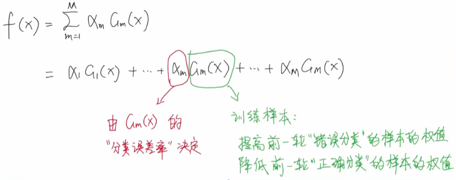
+ 在每一轮中，分别记录好那些被【当前弱分类器】【正确分类】与【错误分类】的【样本】，在下一轮训练时，提高【错误分类样本】的权值，同时降低【正确分类样本】的权值，用以训练新的弱分类器。这样一来，那些没有得到正确分类的数据，由于其权值加大，会受到后一轮的弱分类器的更大关注
+ 【加权多数表决】具体：1、加大【分类误差率】小的弱分类器的权值，使其在表决中起较大作用； 2、减小【分类误差率】大的弱分类器的权值，使其在表决中起较小的作用

**算法流程**

1. 初始化/更新当前训练数据的权值分布（被基本分类器Gm(x)误分类**样本的权值**得以扩大，而被正确分类样本的权值却得以缩小）
2. 训练当前基分类器Gm(x)
3. 计算当前基分类器的权值αm（可以通过分类误差率进行计算）
4. 将αmGm(x)更新到加法模型f(x)中，f(x) = α1G1(x) + α2G2(x) + α3G3(x) + 。。。
5. 判断是否满足循环推出条件
   + 分类器个数是否达到M
   + 总分类器误差率是否低于设定的精度

## GBDT

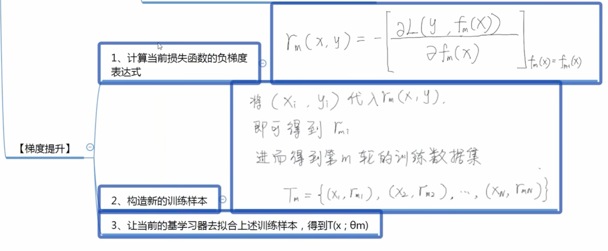

## XGBoost建树的过程？为什么要用二阶导，可以用三阶导吗？

XGBoost（eXtreme Gradient Boosting）是一个 **基于梯度提升（Gradient Boosting）框架的树模型**。

> 它不是一次建一棵大树，而是**逐步叠加很多棵弱树（通常是CART回归树）**，让模型的预测不断逼近真实值。

| 步骤                                       | 说明                 |
| ------------------------------------------ | -------------------- |
| ① 计算每个样本的一阶导 (g_i)、二阶导 (h_i) | 衡量梯度方向与曲率   |
| ② 聚合到每个叶子节点 (G_j, H_j)            | 汇总统计量           |
| ③ 计算分裂收益 Gain                        | 依据目标函数改进程度 |
| ④ 选取 Gain 最大的分裂                     | 决定最佳特征与阈值   |
| ⑤ 递归建树 + 剪枝                          | 控制复杂度           |


**为什么用二阶导？**

✅ 直观解释：

- 一阶导（梯度）告诉我们：**方向** —— 误差往哪里减。
- 二阶导（Hessian）告诉我们：**曲率** —— 步子该多大、变化速率如何。

使用二阶导，能让步长更新更“自适应”，收敛更快、更稳定。

相比之下：

- 只用一阶导（如传统 GBDT）≈ 梯度下降；
- 用二阶导（XGBoost）≈ 牛顿法（Newton’s method），更新更精确。

**而如果再往上展开三阶项：**

得到非线性方程，没有解析解，需要迭代求解，计算复杂度暴涨。增益有限、几乎无收益，反而更噪声、稳定性低（高阶导震荡大）

## LightBoost 对 XGBoost的改进

**:one: 算法层面的改进：**

1. **基于叶子（leaf-wise）的生长策略**

   + XGBoost：按层（level-wise）生长树

     > 一次扩展同一层的所有节点；
     >
     > 每次分裂都保证树是“平衡”的；
     >
     > **优点**：结构规整，防止过拟合；
     >
     > **缺点**：会做很多“无用分裂”，计算量大。

   + LightGBM：按叶子（leaf-wise）生长树

     > 每次只选择**全局增益（Gain）最大的叶子节点**来分裂；
     >
     > 优先扩展最有价值的分支；
     >
     > **优点**：精度更高、收敛更快；
     >
     > **缺点**：树可能很深，容易过拟合（通常用参数 `max_depth` 控制）。

2. **基于直方图（Histogram）的特征分裂**

   + XGBoost 默认是“预排序算法”（Exact Greedy Algorithm）：

     > 每个特征的所有取值都排序；
     >
     > 对每个候选分裂点计算增益；
     >
     > 精确但计算量大、内存占用高。

   + LightGBM 使用 **直方图算法（Histogram-based Algorithm）**：

     > 先把连续特征离散化为固定数量的桶（bins）；
     >
     > 用直方图统计每个桶的梯度与二阶导；
     >
     > 通过累积直方图快速计算增益；
     >
     > 计算复杂度从 O(nlogn) 降到 O(n)。
     >
     > 牺牲一点精度 → 换取极大计算速度和内存节省。

3. **基于梯度的单边采样（GOSS）**

   + 在样本数量特别大的时候，LightGBM 不用所有样本；

     > 取出梯度大的样本（信息量高）全部保留；
     >
     > 从梯度小的样本中随机采样一部分；
     >
     > 并对采样样本的权重进行校正。

   + 保留了“难学样本”的信息，丢弃“已学会样本”的冗余信息，训练速度可提升 10 倍以上，精度几乎不损失。

4. **特征互斥捆绑（EFB, Exclusive Feature Bundling）**

   + 针对高维稀疏特征（如 one-hot 编码），LightGBM 引入 **EFB**；
   + 如果两个特征几乎不会同时非零（互斥），就把它们合并成一个特征；
   + 相当于对特征做“压缩打包”，极大减少特征数量。
   + 减少维度，提高构建直方图的效率，节省内存。

**:two: 工程层面改进**

| 项目           | XGBoost            | LightGBM             |
| -------------- | ------------------ | -------------------- |
| **分裂算法**   | 精确分裂（预排序） | 直方图近似分裂       |
| **样本采样**   | 随机采样           | GOSS（基于梯度）     |
| **特征降维**   | 无                 | EFB（互斥打包）      |
| **树生长策略** | Level-wise         | Leaf-wise            |
| **并行方式**   | 特征级并行         | 直方图级并行，更高效 |
| **内存占用**   | 较高               | 明显更低             |
| **大数据支持** | 好                 | 更好（分布式 + GPU） |

**3️⃣ 其他改进点**

+ **更好的 GPU 支持**
   LightGBM 的直方图算法天然适合 GPU 并行，速度提升显著。
+ **支持类别特征（categorical feature）**
   LightGBM 可以直接输入类别型特征（不需独热编码），自动找到最优分裂。
+ **内存占用更小**
  + 采用 8-bit/16-bit 压缩；
  + 稀疏存储；
  + 高效缓存设计。

**总结：**

| 方向         | 改进点              | 作用                 |
| ------------ | ------------------- | -------------------- |
| 🌿 树生长策略 | Leaf-wise           | 提高精度与收敛速度   |
| 📊 特征分裂   | Histogram           | 降低时间与内存复杂度 |
| 🎯 样本优化   | GOSS                | 加快大数据训练速度   |
| 🧩 特征压缩   | EFB                 | 降低特征维度         |
| ⚙️ 并行化     | 高效直方图并行      | 提升分布式与GPU性能  |
| 💾 内存优化   | 低位存储 + 稀疏支持 | 更轻量、更快         |


## 分类与回归预测差异？（离散类别标签s连续数值，交叉熵s均方误差）

+ 分类预测输出 **离散类别标签**，常用 **交叉熵损失**。
+ 回归预测输出 **连续数值**，常用 **均方误差(MSE)**。

**均方误差损失（Mean Squared Error, MSE）**

$$L_{MSE}=\frac{1}{n}\sum_{i=1}^{n}(y_{i}-\hat{y}_{i})^{2}$$

**交叉熵损失（Cross-Entropy Loss）**

+ 二分类公式：$$L_{CE}=-\frac{1}{n}\sum_{i=1}^{n}[y_{i}\log(\hat{y}_{i})+(1-y_{i})\log(1-\hat{y}_{i})]$$
+ 多分类公式：$$L_{CE}=-\frac{1}{n}\sum_{i=1}^{n}\sum_{k=1}^{K}y_{ik}\log(\hat{y}_{ik})$$


## 聚类算法：KNN、K-means区别？（有监督vs无监督，训练过程描述一下） 

+ **KNN** 是 **有监督**，分类时根据训练集中最近邻样本投票。
+ **K-means** 是 **无监督**，通过迭代更新中心点，把数据聚成 K 个簇。

## Precision与recall计算、F1-score计算 

**Precision（精确率）**

含义：在所有被模型预测为正的样本中，有多少是真的正样本, 衡量“**预测结果的准确性**”。

$$Precision=\frac{TP}{TP+FP}$$

**Recall（召回率）**

在所有真实为正的样本中，有多少被模型找出来了，衡量“**没漏掉多少正样本**”。

$$Recall=\frac{TP}{TP+FN}$$

**F1-score 的公式是 Precision 和 Recall 的调和平均数：**

**F1 兼顾了精确率和召回率，适合样本不均衡的场景。**

$$F1=\frac{2\cdot Precision\cdot Recall}{Precision+Recall}$$


## 处理过拟合手段？（增强数据质量、降低复杂度、正则化、dropout、早停）

+ 增加数据量或增强数据质量。
+ 降低模型复杂度。
+ 加正则化、Dropout。
+ 提前停止训练（Early stopping）。

## 不做缺值补齐分别对SVM(支持向量机)、RF(随机森林)的影响？（对SVM影响类别最优间隔，超平面划分；对 RF影响树的建构，分裂点选择)

+ **SVM**：缺值会影响支持向量的超平面划分，直接训练不了。
+ **RF**：树的分裂点选择会受影响，但能一定程度容忍缺值。

## RF和SVM的包容度哪个更大？(RF,集成投票机制)

**随机森林（RF）** 包容度更大，因为是集成模型，有投票机制，对异常和噪声更鲁棒

## 介绍L1正则化和L2正则化，他们为什么有用？L1正则不可导，如何进行优化？

**L1 正则（Lasso）**

- **公式**：
- $$L_{total}=L_{loss}+\lambda\sum_i|w_i|$$
- **作用**：对权重取绝对值约束。
- **特点**：会产生稀疏解（部分参数变为 0），有利于特征选择。
- **缺点**：优化时不可导点在 0 附近，会带来一定计算复杂度。

**L2 正则（Ridge）**

- **公式**：
- $$L_{total}=L_{loss}+\lambda\sum_iw_i^2$$
- **作用**：对权重平方约束。
- **特点**：会让权重整体变小（趋近于 0 但不为 0），防止过拟合，优化更稳定。
- **缺点**：不会产生稀疏解，特征选择能力弱。

**对比总结（口述版）**

- L1 会让部分权重直接变 0，适合做特征选择；
- L2 会让权重整体缩小，更适合防止过拟合；

**什么是正则化？**

在训练模型时，我们的目标是最小化损失函数，让模型尽可能地拟合训练数据。但是，如果模型过于复杂（例如，参数过多），它可能会“记住”训练数据中的噪声和随机波动，而不是学习到底层的规律。这会导致模型在训练集上表现很好，但在未见过的测试集上表现很差，这种现象就是**过拟合（Overfitting）**。

**正则化（Regularization）** 是一种为了防止过拟合而向损失函数中添加“惩罚项”的技术。这个惩罚项会对模型的复杂度（通常是模型参数的大小）进行惩罚，从而引导模型在拟合数据的同时，保持自身的“简单性”。

新的损失函数 = 原始损失函数 + 惩罚项

L1和L2正则化就是两种最常见的惩罚项。它们都通过限制模型参数（权重 `w`）的大小来降低模型复杂度。

**L2 正则化 (Ridge Regression / 权重衰减)**

L2 正则化是在原始损失函数的基础上，加上所有权重值的**平方和**。

$$L_{L2}=\text{Original Loss}+\lambda\sum_{i=1}^nw_i^2$$

其中：

- wi 是模型的第 i 个权重参数。
- ∑wi2 是惩罚项，即所有权重平方和的L2范数。
- λ (lambda) 是正则化强度系数，是一个超参数。λ 越大，对权重的惩罚就越重，模型就越趋向于选择更小的权重。

**为什么 L2 正则化有用？**

1. **鼓励权重变小，但不为零：** 为了最小化整体损失，模型不仅要减小原始损失，还要减小 ∑wi2。这会驱使模型的权重值都变得非常小。
2. **使模型更平滑、更简单：** 一个模型的权重值普遍较小，意味着输入特征的一个微小变动对输出结果的影响也较小。这样的模型对数据中的噪声不那么敏感，函数图像更平滑，泛化能力更强。
3. **权重衰减 (Weight Decay)：** 在使用梯度下降进行优化时，L2惩罚项对梯度的贡献是 −2λwi。这意味着在每次更新权重时，都会先将权重 wi 乘以一个小于1的系数（使其“衰减”），然后再减去原始损失的梯度。这会不断地将权重拉向0。

**效果总结：L2正则化会使模型的权重参数趋向于接近0，但通常不会等于0。它会让权重分布得更均匀，形成一个由许多小权重构成的“平滑”模型。**

**L1 正则化 (Lasso Regression)**

L1 正则化是在原始损失函数的基础上，加上所有权重值的**绝对值之和**。

$$L_{L1}=\text{Original Ioss}+\lambda\sum_{i=1}^n|w_i|$$

其中：

- ∣wi∣ 是模型第 i 个权重的绝对值。
- ∑∣wi∣ 是惩罚项，即所有权重绝对值之和的L1范数。
- λ 同样是正则化强度系数。

**为什么 L1 正则化有用？**

1. **产生稀疏性 (Sparsity)：** 这是L1正则化最核心、最重要的特性。与L2不同，L1正则化倾向于将许多不重要的特征的权重直接**推向精确的0**。
2. **自动进行特征选择：** 当一个特征对应的权重变为0时，这个特征就相当于从模型中被移除了。因此，L1正则化可以看作是一种自动进行特征选择的方法。这对于处理高维数据（特征非常多）尤为有用，可以帮助我们识别哪些特征是真正重要的。
3. **模型更具可解释性：** 一个稀疏的模型（只有少数非零权重）更容易解释。我们可以清楚地看到是哪些特征在对模型的预测起作用。

**效果总结：L1正则化会产生一个“稀疏”模型，即模型的大部分权重参数都为0。它在惩罚大权重的同时，还能实现自动特征选择。**

**L1 和 L2 的直观对比**

一个经典的几何解释是：

- L2正则化的约束条件 ∑wi2≤C 在二维空间中是一个**圆形**。损失函数的等高线与这个圆形相切时，切点很难恰好落在坐标轴上，所以权重 w1,w2 通常都不为0。
- L1正则化的约束条件 ∑∣wi∣≤C 在二维空间中是一个**菱形**。损失函数的等高线与这个菱形相交时，交点有很大概率出现在菱形的**顶点**上。而这些顶点正是在坐标轴上，这意味着其中一个权重为0。

**L1 正则项不可导，如何进行优化？**

L1惩罚项 λ∣w∣ 在 w=0 这一点是不可导的（有一个尖点），所以标准的梯度下降法不能直接应用。

提出了几种有效的优化算法：

1. **次梯度下降 (Subgradient Descent)**

这是对梯度下降的一种扩展。对于像绝对值函数这样的凸函数，即使在不可导点，我们也可以定义一个**次梯度（Subgradient）**集合。

- 对于 ∣w∣，当 w>0 时，梯度是 1。
- 对于 ∣w∣，当 w<0 时，梯度是 -1。
- 对于 ∣w∣，在 w=0 这个不可导点，它的次梯度是一个区间 `[-1, 1]` 内的任何值。

在次梯度下降算法中，当 w != 0 时，我们正常计算梯度。当 w=0 时，我们从次梯度区间 `[-1, 1]` 中选择一个值（通常选择0）作为梯度。

虽然理论上可行，但次梯度下降在 w=0 附近可能会来回震荡，收敛速度较慢。

2. **近端梯度下降 (Proximal Gradient Descent)**

这是目前解决这类问题更常用、更高效的方法，尤其是在信号处理和机器学习领域。其核心思想是把损失函数拆分为两部分：可导的光滑部分（原始损失）和不可导的凸函数部分（L1惩罚项）。

优化步骤分为两步：

1. **梯度下降步：** 先只对光滑部分（原始损失）进行一次标准的梯度下降更新。
2. **近端映射步 (Proximal Mapping)：** 对上一步更新后的结果，应用一个专门针对L1惩罚项的“修正”操作。这个操作被称为**软阈值算子 (Soft-Thresholding Operator)**。

软阈值函数的作用是：

- 将绝对值小于 λ 的权重直接**置为0**。
- 将绝对值大于 λ 的权重向0的方向**收缩**一个 λ 的距离。

$$\text{SoftThreshold}(w,\lambda)=\begin{cases}w-\lambda&\mathrm{if}w>\lambda\\w+\lambda&\mathrm{if}w<-\lambda\\0&\mathrm{if}|w|\leq\lambda\end{cases}$$

这个过程非常直观地实现了L1正则化的稀疏效果：它创建了一个“死区” `[-λ, λ]`，任何落入这个区间的权重都会被直接“杀死”变为0。

3. **坐标下降法 (Coordinate Descent)**

对于某些特定模型（如线性回归、逻辑回归），坐标下降法非常高效。它不是同时更新所有的权重 w，而是一次只选择一个权重 wi 进行优化，同时固定其他所有权重。这个过程对所有权重轮流进行，直到收敛。因为每次只优化一个变量，问题变得更简单，可以精确地找到使L1损失最小的解。

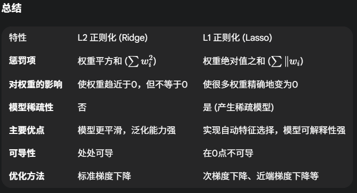

## SVM怎么解决高维线性不可分的问题？

SVM 支持向量机解决高维线性不可分问题的核心武器是 **核技巧 (Kernel Trick)**。将原始特征空间映射到一个更高维的空间，使得在高维空间中数据变得线性可分，从而可以用一个线性超平面进行分类。

**一、线性不可分问题的本质**

当样本在原始输入空间中无法用一条直线（或超平面）正确划分时，就称为**线性不可分**。例如在二维空间中，像“同心圆”那样的数据显然不能用一条直线分开。

**二、SVM 的核心思路**

SVM 的目标是找到一个**最大间隔超平面（Maximum Margin Hyperplane）**来分隔样本。
 当样本线性可分时，这个问题很简单。
 但当样本\**线性不可分**时，SVM 采用两步策略：

:one: **允许部分样本分类错误（软间隔 SVM）**

+ 引入**松弛变量** ξᵢ ≥ 0，允许一部分点被错分；
+ 同时在目标函数中加入惩罚项 C ∑ ξᵢ，控制间隔大小与分类错误之间的权衡；
+ 目标函数：$\min_{\mathbf{w},b,\xi}\frac12\|\mathbf{w}\|^2+C\sum_i\xi_i$
+ 约束条件：$y_i(\mathbf{w}^T\mathbf{x}_i+b)\geq1-\xi_i,\quad\xi_i\geq0$
+ 这就能在原空间中尽量拟合即使有少量噪声或不可分的情况。

:two: **使用核函数将数据映射到高维空间（核技巧）**

如果数据本身无法通过软间隔分开，SVM 通过核函数把它映射到更高维空间，在高维空间中数据可能是线性可分的。

+ 映射过程：$\phi:\mathbf{x}\to\phi(\mathbf{x})$
+ 目标变为：$\min_{\mathbf{w},b}\frac12||\mathbf{w}||^2$
+ 约束：$y_i(\mathbf{w}^T\phi(\mathbf{x}_i)+b)\geq1$
+ 由于直接计算 φ(x) 可能代价很高，SVM 引入了**核技巧（Kernel Trick）**：$K(\mathbf{x}_i,\mathbf{x}_j)=\phi(\mathbf{x}_i)^T\phi(\mathbf{x}_j)$
+ 只需计算样本间的**核函数值**，无需显式地映射到高维空间。

**核函数本质：**

> 在原空间中简单计算 $K(\mathbf{x}_i,\mathbf{x}_j)$，
>  等价于在高维空间中计算 φ(x_i) 与 φ(x_j) 的点积。

👉 我们“假装”做了复杂的高维变换，但实际上只做了一次简单的核函数运算！

| 核函数类型      | 公式                                        | 适用场景                         |
| --------------- | ------------------------------------------- | -------------------------------- |
| 线性核          | $K(x_i, x_j) = x_i^T x_j$                   | 数据本身线性可分或近似线性可分   |
| 多项式核        | $K(x_i, x_j) = (x_i^T x_j + c)^d$           | 适合具有交互特征的中等复杂度问题 |
| RBF核（高斯核） | ( K(x_i, x_j) = e^{-\gamma                  |                                  |
| Sigmoid核       | $K(x_i, x_j) = \tanh(\alpha x_i^T x_j + c)$ | 类似神经网络激活函数             |

**直观解释**

+ 在原始空间中，数据点可能像“环形”或“弯曲”的结构；
+ 核映射将数据“展开”或“拉直”，在更高维空间中形成一个可被线性超平面分开的形态；
+ 超平面再“投影回原空间”时，对应的是一个非线性的决策边界。

## LSTM相比RNN的好处，解决了RNN存在的什么问题

**RNN 存在两个关键问题：**

**梯度消失（Vanishing Gradient）**

- 在反向传播过程中，梯度要一层层乘以权重矩阵；
- 若权重 < 1，梯度会指数级衰减；
- 导致模型只能学习短期依赖，**记不住长序列信息**。

**梯度爆炸（Exploding Gradient）**

- 若权重 > 1，梯度会指数级膨胀；
- 导致训练不稳定，参数更新异常。

结果就是：

> RNN 对长期依赖建模能力差，训练难以收敛。

**LSTM 的设计思想**

通过引入“**门控机制（gating mechanism）**”来**控制信息的记忆与遗忘**，从而解决 RNN 的梯度消失问题。

| 门类型                    | 作用               | 公式                                        | 功能解释         |
| ------------------------- | ------------------ | ------------------------------------------- | ---------------- |
| **遗忘门（Forget Gate）** | 决定丢掉哪些旧信息 | $( f_t = \sigma(W_f[h_{t-1}, x_t] + b_f) )$ | 控制“记忆的遗忘” |
| **输入门（Input Gate）**  | 决定加入哪些新信息 | $( i_t = \sigma(W_i[h_{t-1}, x_t] + b_i) )$ | 控制“记忆的更新” |
| **输出门（Output Gate）** | 决定输出多少状态   | $( o_t = \sigma(W_o[h_{t-1}, x_t] + b_o) )$ | 控制“暴露的记忆” |

**LSTM 如何解决 RNN 的问题**

✅ 1️⃣ 解决梯度消失

- LSTM 的细胞状态 C_t 通过遗忘门控制线性传递；
- 在反向传播时梯度可以**沿着 C_t 直接流动**（几乎不衰减）；
- 相当于为梯度开了一条“高速通道”，保留长期依赖信息。

✅ 2️⃣ 可控记忆机制

- 通过门结构，模型能学习“何时记忆、何时遗忘”；
- 有效过滤噪声信息，只保留关键历史特征；
- 从而在长序列任务中表现更好（如文本翻译、语音识别）。


# 深度学习

| 门类型                    | 作用               | 公式                                      | 功能解释         |
| ------------------------- | ------------------ | ----------------------------------------- | ---------------- |
| **遗忘门（Forget Gate）** | 决定丢掉哪些旧信息 | ( f_t = \sigma(W_f[h_{t-1}, x_t] + b_f) ) | 控制“记忆的遗忘” |
| **输入门（Input Gate）**  | 决定加入哪些新信息 | ( i_t = \sigma(W_i[h_{t-1}, x_t] + b_i) ) | 控制“记忆的更新” |
| **输出门（Output Gate）** | 决定输出多少状态   | ( o_t = \sigma(W_o[h_{t-1}, x_t] + b_o) ) | 控制“暴露的记忆” |

## LLM中为什么常用Decoder Only结构?

1. 架构简洁、适用于语言建模任务

   Decoder-only 模型源于 Transformer 的 Decoder 模块，其核心特点是：

   - **自回归（auto-regressive）生成**：当前时刻的输出只依赖于之前的所有输入（通过 masked self-attention）。
   - **因果掩码（causal mask）** 保证了模型只能看到过去的信息，适合“从左到右”逐字生成任务。

   这正好契合了语言建模任务的目标：预测下一个单词。

2. 推理效率更高，适合大规模部署

   + 生成时只需向前传播一步一步生成，相比 Encoder-Decoder 不需要重复 encode 整个输入。
   + 可以使用KV-Cache，进一步加速推理

3. 预训练目标简单且通用性强

   + Decoder-only 模型通常使用的是 **标准自回归语言建模目标**：
   + 模型易于训练；
   + 预训练语料可覆盖各种任务（QA、对话、总结等）；
   + 一个模型就能泛化多个任务，统一了训练目标，无需人工设计多种任务-specific heads。

4. 架构简化带来更好的工程实现与扩展性

## Self-attention的时间复杂度？整个Transformer的时间复杂度？

**Self-Attention 的时间复杂度**

假设：

- 输入序列长度为 n
- 每个 token 的隐藏维度为 d

时间复杂度 $O(n^2 d)$

**Transformer Encoder 层的整体复杂度**

一个标准的 Transformer Encoder 层包括两部分：

1. **Multi-Head Self-Attention** → $O(n^2 d)$
2. **Feed-Forward Network (FFN)** → $O(n d^2)$

因此单层 Transformer 的总复杂度为：$O(n^2d+nd^2)$


## LLM模型参数量计算？

可视化展示：https://bbycroft.net/llm

设模型的主要超参数为：

- V：词表大小（vocab size）
- d：隐藏层维度（hidden size）
- n：注意力头数（num heads）
- L：Transformer 层数（num layers）
- $d_{ff}$：前馈层中间维度（通常为 4d）

1. Embedding 层：约 V * d

2. Multi-Head Attention

   每一层有：

   - Q、K、V：d * d
   - 输出投影：d * d

   所以 attention block 一层大约是：$3d^2+d^2=4d^2$ 

3. Feedforward 网络

   典型结构为：
    线性 d→  $d_{ff}$ →d，通常  $d_{ff}$ = 4d

   参数量为：  $ d\times4d+4d\times d=\boxed{8d^2} $ 

   

4. LayerNorm 和偏置项：可近似忽略或加个小常数项

5. 输出层（语言建模 head）：约 V * d

6. 总参数量计算公式：

   $\boxed{\mathrm{Params}\approx2\times(V\times d)+L\times12d^2}$

## 大模型MoE负载均衡

**MoE（Mixture of Experts）** 是一种让模型在不同输入上**激活不同子网络（专家）**的结构，核心目的是：

> 在保持模型总参数量巨大的同时，让每次前向计算只激活其中一小部分，显著降低计算开销。

在标准 Transformer 的某些层（通常是 FFN 层）替换为 **MoE 层**：

$$y=\sum_{i=1}^NG(x)_i\cdot E_i(x)$$

其中：

- $E_i(x)$：第 i 个专家（Expert）子网络；
- $G(x)$：门控网络（Gating Network），决定哪些专家被激活；
- $N$：专家总数；
- 通常仅激活前 k 个专家（如 Top-1 或 Top-2）。

**MoE 的负载不均衡问题**

在实际训练中，**Gating 网络的输出分布常常不均衡**，某些专家会被频繁选中，而有的几乎从不被激活。

+ 🚨 **计算不平衡**：某些 GPU 负载过高（热点专家），形成瓶颈；
+ 🚨 **通信不平衡**：All-to-All 通信中部分设备数据量极大；
+ 🚨 **训练不稳定**：部分专家梯度几乎为零，无法学习；
+ 🚨 **收敛变慢 / 模型退化**：模型等效于少数专家在工作。

**MoE 的负载均衡机制**

核心思想是：让门控网络在选择专家时，不仅考虑输入匹配度，还要让专家的激活次数保持均衡。

**常见负载均衡方法**

| 方法                                    | 代表模型                   | 主要思想                                                     | 公式或思路                                        |
| --------------------------------------- | -------------------------- | ------------------------------------------------------------ | ------------------------------------------------- |
| **1️⃣ 辅助损失（Load Balancing Loss）**   | Google Switch Transformer  | 给 gating 网络加正则，使每个专家使用率接近均匀分布           | ( L_{balance} = N \cdot \sum_i p_i \cdot f_i )    |
| **2️⃣ 噪声门控（Noisy Top-k Gating）**    | GShard, Switch Transformer | 在门控输出前加噪声扰动，增加专家多样性                       | ( G(x) = \text{softmax}(xW_g + \text{Noise}) )    |
| **3️⃣ Capacity 限制**                     | GShard, Switch Transformer | 每个专家设定最大容量（每批最多接收 M 个样本），超出部分丢弃或重路由 | 控制通信和显存负载                                |
| **4️⃣ Hash 路由（Hash-based Routing）**   | FastMoE, Megatron-LM MoE   | 直接通过哈希函数分配专家，天然平衡但牺牲自适应性             | ( \text{expert} = hash(\text{token_id}) \bmod N ) |
| **5️⃣ Sinkhorn / Optimal Transport 路由** | BASE Layers, V-MoE         | 使用最优传输或 Sinkhorn-Knopp 平衡 token 分配                | 解耦路由概率分布与专家负载                        |
| **6️⃣ Expert Choice Routing**             | DeepSpeed-MoE              | 专家主动选择 token，使每个专家接收等量输入                   | 反向均衡路由机制                                  |
| **7️⃣ Dynamic Capacity / Token Dropping** | Mixtral, DeepSeekMoE       | 动态调整每个专家容量或随机丢弃低概率 token                   | 平衡性能与效率                                    |

**实际工程中如何做负载均衡**

1. **门控正则化**：
    增加 $L_{balance}$​ 项到总损失中：

   $$L_{total} = L_{task} + \alpha \cdot L_{balance}$$

   其中 α 控制权重。

2. **限制专家容量（capacity factor）**：
    每个专家最多接收：

   $$M = \text{capacity factor} \times \frac{B}{N}$$

   超过部分丢弃或重路由。

3. **混合策略**：
    在 GShard、Switch、Mixtral 等模型中，通常同时使用：

   - 噪声路由（noisy gating）
   - 辅助平衡损失
   - 容量限制


## 为什么attention计算要除以根号d？

**Q 和 K 的点积大小随维度 d 增大而增大**
 假设 Query q 和 Key k 的每个分量服从均值 0、方差 1 的分布：

 $ q\cdot k=\sum_{i=1}^dq_ik_i $ 

期望是 0，但方差是 d。也就是说，随着维度 d 增大，点积的数值会越来越大。

**softmax 对数值大小很敏感**

- 如果输入过大，softmax 会趋近于 one-hot（极端偏向某个位置），导致梯度消失；
- 如果输入过小，softmax 近似平均分布，注意力不明显。

因此需要**控制数值规模**，避免维度增大导致的不稳定。

点积的方差是 d，标准差是 $\sqrt{d}$。
 为了让结果在不同维度下保持 **方差一致（大约为 1）**，所以要除以标准差  $\sqrt{d}$ ，而不是除以 d。

换句话说，**是标准化的思想**，类似 batch norm、layer norm：把数值缩放到合适区间，方便训练。

除以 $\sqrt{d}$ 就是“方差归一化”，保持数值分布稳定。

## transformer中的attention机制有位置感知能力吗？为什么attention中不直接加入位置信息，而是要依赖位置编码？

自注意力机制没有位置感知能力

**为什么不直接在 Attention 计算中加入位置信息？**

理论上，可以设计一种新的 Attention 机制，把位置索引 `i` 和 `j` 作为变量直接引入到 Q-K 点积的计算中。

但这么做有几个潜在的问题：

+ **丧失通用性和简洁性**：原始的自注意力机制非常简洁，它就是一个通用的、可学习的加权求和模块。一旦引入绝对位置 `i` 和 `j`，这个模块就变得复杂，并且与特定的位置绑定，可能会损害其泛化能力。
+ **难以处理长序列和相对位置**：如果直接使用绝对位置索引，模型很难学到“相距 k 个位置的两个词”这种相对位置关系。模型可能会记住“位置5的词对位置8的词很重要”，但无法泛化到“位置15的词对位置18的词也很重要”。模型需要的是通用的、可泛化的相对位置概念。
+ **计算效率：**Transformer 成功的关键之一是其高度的**并行计算能力**。Q, K, V 都可以通过一次矩阵乘法并行计算出来，注意力分数也可以通过一次大的矩阵乘法 `Q @ K.T` 全部算出。如果引入复杂的位置函数 `f`，可能会破坏这种优雅的并行结构。

## Transformer中位置编码为什么要设置为正弦/余弦函数？

Transformer 的自注意力机制（Self-Attention）是**无序的**：

- 它看的是所有 token 之间的相对权重；
- 不像 RNN 有自然的顺序，或 CNN 有固定的局部邻域。

因此，必须 **人为注入位置信息**，否则模型无法区分“猫咬狗”和“狗咬猫”。

$$PE_{(pos,2i)}=\sin\left(\frac{pos}{10000^{2i/d_{model}}}\right)\\PE_{(pos,2i+1)}=\cos\left(\frac{pos}{10000^{2i/d_{model}}}\right)$$

1. 周期性 & 多尺度表示

   + 每个维度对应一个不同频率的正弦/余弦波；
   + 不同频率组合后，可以唯一表示任意位置。 类似于傅里叶基函数：可以把序列位置分解为不同频率的正弦波。

2. 相对位置信息可线性表示

   正弦/余弦编码的一个关键好处是：
    **任意两个位置的相对偏移，可以通过线性变换表示。**

   举个例子：

    $\sin(a+b)=\sin a\cos b+\cos a\sin b$ 

    $\cos(a+b)=\cos a\cos b-\sin a\sin b$ 

   这意味着：如果模型知道位置 a 的编码，它可以通过简单的线性变换推算出位置 a+b 的编码。

   换句话说，**模型能天然捕捉相对位置关系**，而不仅仅是绝对位置。

3. 位置范围可扩展

   因为正弦/余弦是**连续函数**：

   - 理论上可以外推到比训练时更长的序列（比最大训练长度大）；
   - 这点比 **可学习的位置 embedding（learnable positional embedding）** 好（learnable embedding 在没见过的长序列上会失效）。

4. 数值稳定 & 易于实现

   + sin 和 cos 都是 [-1,1] 范围的值，不会随位置爆炸；
   + 不需要额外训练参数；
   + 实现简单，计算高效。

周期性&多尺度表示、相对位置信息可线性表示、位置范围可拓展、数值稳定易于实现

## RoPE位置编码

**正余弦位置编码的复数旋转版本**

**动机**

+ 编码方式要**兼顾绝对位置**与**相对位置**信息
+ 编码方式在 **推理缓存场景**下也要高效（即已生成 token 的 key/value 缓存不需要因为新 token 出现而重新大规模更新）
+ 在自注意力（Attention）机制中能够**自然地体现位置差距**、以便模型学习“距离越远，可能越弱”或“邻近越强”这种偏好。

**概念**

- 核心思想：将 token 的 embedding 向量视为若干对维度（2维一对，类似将 d 维拆成 d/2 个 2维子空间），然后**按 token 所在位置 pos，对每一对维度向量做二维旋转（rotation）**。
- 旋转角度 θ 与位置 pos 和该维度/子空间的频率参数／尺度相关。
- 关键在于：当 Query 和 Key 均应用了这种旋转编码后，它们在计算 $Q \cdot K^\top$ 时，就内隐地包含了**相对位置差**的信息。因为旋转角度随 pos 线性增长，两个 token 的旋转差即代表它们的位置差距。
- 与传统 “embedding + positional_encoding（加法）” 不同，RoPE 是一种 **乘（或旋转变换）** 的方式。

**公式（简化版）**

假设你有维度 d，将其拆分成 d/2 个 2-维对：对于每个对 i（即维度对为 (2i,2i+1)）：

定义频率参数：

$\omega_i = \frac{1}{10000^{2i/d}}$

对于位置  pos：角度

$\theta_{pos,i} = pos \cdot \omega_i$

令 embedding 向量在维度对  (2i,2i+1)  为 $ (x_{2i}, x_{2i+1}) $。那么旋转后表示为：

$$\begin{pmatrix} x'_{2i} \\ x'_{2i+1} \end{pmatrix} =  \begin{pmatrix} \cos \theta_{pos,i} & -\sin \theta_{pos,i} \\ \sin \theta_{pos,i} & \;\cos \theta_{pos,i} \end{pmatrix} \begin{pmatrix} x_{2i} \\ x_{2i+1} \end{pmatrix}$$

这种方式使得 embedding 向量“随位置旋转”而变化。然后，对于 Key 和 Query，都应用这个旋转（或一方应用旋转）。在注意力计算中：

$\langle Q_{pos1}, K_{pos2} \rangle$

因为两边都旋转了不同的角度，最终的 dot product 会隐含角度差 $\theta_{pos1,i} - \theta_{pos2,i} = (pos1 - pos2)\cdot \omega_i$，从而编码了相对位置差。这样，attention 机制就能自然“看见”pos1 和 pos2 之间的距离。这个部分在 Medium 文章里也有形象说明。

**RoPE 的优点与缺点**

**优点**

- ✅ **自然编码相对位置**。不只是绝对位置，还能反映距离。
- ✅ **推理友好、缓存友好**。适用于自动回归生成模型（LLM）场景。
- ✅ **实现简单、效率高**。仅是角度计算 + 向量旋转，开销小。
- ✅ 在很多现代大模型中已被采用（如 LLaMA、GPT‑3 变体模型中），证明其实用。

**缺点 / 限制**

- ❌ **频率设定固定**：如果 ωi 设定不当，或者 pos 超出训练时的最大位置时，可能出现“超出训练窗口”泛化差的问题。
- ❌ 有研究指出：RoPE 的“最小频率”或“低维度”部分或许承载了语义，而“高频率”可能才更多用于位置，因此在距离极长时其相对位置衰减模式可能并不是预期那样。
- ❌ 虽然推理友好，但在 **极长序列（比训练中更长）** 的泛化能力仍然是研究热点— 有些场景下，编码可能不能很好延伸。

**作用位置**

计算 **Query (Q)** 和 **Key (K)** 之后、做注意力分数计算之前。

RoPE 是对 Q、K 向量进行“旋转编码”的操作，Value 不参与旋转。

## 绝对位置编码、相对位置编码、可学习位置编码

**绝对位置编码**

为每个位置 pospospos 分配一个唯一的向量，表示它在序列中的 **绝对位置**。

✅ 优点

- 实现简单（只需加法）
- 正余弦形式可无限延伸
- 可学习版本效果强

❌ 缺点

- 只能表达“绝对位置”，不显式知道词与词之间的**相对距离**
- 可学习版本不能泛化到比训练时更长的序列

**相对位置编码**

让模型不仅知道每个词的“绝对位置”，还知道它与**其他词的相对距离**。

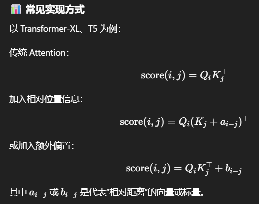

✅ 优点

- 能捕捉**相对距离关系**
- 泛化性更好（在长文本、shifted context 下更稳）
- 支持动态长度输入（如 Transformer-XL）

❌ 缺点

- 实现更复杂（需要对每对 token 计算偏置）
- 推理缓存时需要特殊处理

**可学习位置编码**

这其实是“绝对位置编码”的一个子类，但非常常见，所以单独列出。

为每个位置 pospospos 直接学习一个可训练参数：

在训练过程中，这些向量会自动学习出有用的顺序信息。

✅ 优点

- 简单、效果好
- 模型可自由学习最优的位置信息

❌ 缺点

- **不能泛化** 到比训练长度更长的序列（超过 max length 就没定义）
- 纯粹的“绝对位置”方式，没有相对距离感


## 介绍一下Attention机制，如何计算Query和Key的相似度？

在 Transformer 的经典 “Scaled Dot-Product Attention”（缩放点积注意力）中，Query 和 Key 之间的相似度用的是 **点积**（dot product）加上一个缩放因子。完整公式如下：

$$\text{Attention}(Q,K,V)=\text{softmax}\Big(\frac{QK^\top}{\sqrt{d_k}}\Big)V$$

更细节地：

1. 计算得分矩阵 $S=QK^\top $。如果 Q 的形状是 $(n,d_k)$ ，K 是 $(m,d_k)$ ，那么 S 是 (n,m)，其中 $S_{i,j}=q_{i}^{\mathsf{T}}k_{j}$ 表示 第 i 个查询和 第 j 个键 的相似度（点积）。
2. 然后对每个查询 i 的得分向量做缩放：除以 $\sqrt{d_k}$（这是为了避免点积在高维空间里数值过大、梯度不稳定） —— 这就是所谓 “scaled” 那一部分。
3. 接着对每个查询 i 的得分向量做 softmax，得到注意力权重（每个 j 对于 i 的权重）：

这种结构有以下几个优点：

- 点积计算高效、向量化实现简单；
- 缩放 $\sqrt{d_k}$ 有助于缓解得分过大、softmax 梯度饱和的问题；
- Softmax 保证每个查询对应的权重和为 1，使得输出是一个加权组合。

这个机制也就是 Transformer 论文里所使用的标准 Attention 方式。

## FFN层有什么作用？

简单来说，如果说**自注意力层是负责“收集和融合信息”**（让每个词看到并融合句子中其他所有词的信息），那么 **FFN 层就是负责“消化和提炼信息”**（对融合后的信息进行一次复杂的非线性变换，以提取更深层次的特征）。

:one: **增加非线性 (Adding Non-linearity)**

这是 FFN 层最根本、最基础的作用。

- **背景**：自注意力机制的计算，尽管有 Softmax，但其核心是基于 Q、K、V 的一系列线性变换（矩阵乘法）和加权求和。如果 Transformer 块只由自注意力层堆叠而成，那么整个网络的表达能力将非常有限，因为多层线性变换的叠加本质上还是一个线性变换。
- **作用**：FFN 层包含一个非线性激活函数（通常是 ReLU 或其变体 GELU）。它的存在打破了模型的线性，使得 Transformer 能够学习和拟合远比线性关系复杂得多的函数和模式。**没有非线性，深度学习就没有“深度”可言。**

**:two: 对每个位置的表示进行独立转换(Transformation of Representations)**

FFN 层在 Transformer 块中的位置非常关键：它位于自注意力层之后。

- **输入**：FFN 层的输入是自注意力层输出的向量。这个向量已经是一个“富含上下文”的表示了（比如，句子 "The bank of the river" 中的 "bank" 经过注意力层后，已经融合了 "river" 的信息，知道了自己是“河岸”而不是“银行”）。
- **处理方式**：FFN 层**独立地**对序列中的每一个词向量进行相同的变换。也就是说，它将每个词向量分别通过一个由两个线性层和激活函数组成的小型神经网络。
  - 它的操作是**“Position-wise”**的，即对每个位置（position）的向量应用完全相同的权重（W1, b1, W2, b2），但各个位置之间的计算是完全独立的，互不干扰。
- **输出**：输出一个经过深度加工和提炼后的新向量，这个新向量将被送入下一个 Transformer 块。

**:three: 增加模型容量和复杂度 (Adding Model Capacity)**

FFN 层的结构通常是一个“扩张再压缩”的模式。

$$\mathrm{FFN}(x)=\mathrm{ReLU}(xW_1+b_1)W_2+b_2$$

通常，第一个线性层会将输入向量的维度 dmodel（例如 512）**扩张**到一个更大的中间维度 dff（例如 2048，通常是 dmodel 的 4 倍）。经过 ReLU 激活后，第二个线性层再将其**压缩**回原始维度 dmodel。

**这个“扩张-压缩”结构的作用是：**

1. **提供一个更大的“思考空间”**：在更高维度的空间里，模型可能更容易分离和学习复杂的特征组合。
2. **增加大量参数**：FFN 层是 Transformer 模型中参数量的重要来源。更多的参数意味着模型有更大的容量去学习和记忆数据中的复杂模式。

 :star: **角色分工的类比：一次会议**

我们可以把一个 Transformer 块的工作流程比作一次高效的会议：

1. **自注意力层 (Multi-Head Attention) - 讨论与交流阶段**:
   - 会议室里的每个人（每个词）都有自己的观点（原始词向量）。
   - 为了形成综合意见，每个人都会听取（Attention）其他所有人的发言，并根据发言与自己议题的“相关性”，决定重点吸收哪些人的信息。
   - 这个阶段结束后，每个人脑中的观点都融合了全场的信息，变得更加全面和有上下文。这是**信息在序列成员之间的横向流动**。
2. **FFN 层 (Feed-Forward Network) - 独立思考与决策阶段**:
   - 现在，每个人都带着刚刚吸收到的所有信息，回到自己的座位上**独立思考**。
   - 他们用自己的一套复杂的、非线性的思维模式（FFN 的两层神经网络）对这些信息进行加工、提炼、拔高，形成自己最终的、更深刻的见解。
   - 这个阶段是**每个人内部的纵向深度加工**，与其他人的思考过程是并行的、独立的。

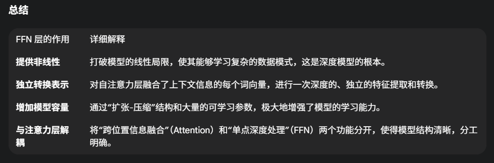

## LSTM与 Transformer的区别

**LSTM 是一个精巧的“串行”处理器，像人一样逐字阅读；而 Transformer 是一个强大的“并行”处理器，像鸟瞰一样一次性审视全局。**

**LSTM**

**架构:** 是一种**循环神经网络 (Recurrent Neural Network, RNN)** 的高级变体。它的核心是“循环”，即通过一个内部的“记忆细胞”（Cell State）来按顺序处理序列。

**处理方式:** **串行处理 (Sequential)**。LSTM 必须逐个时间步（例如，逐个单词）处理数据。要计算第 `t` 个单词的输出，它必须先完成第 `t-1` 个单词的计算，并将隐藏状态传递过来。这种设计天然符合语言的时序性。

**工作机制:** 依靠**门控机制（输入门、遗忘门、输出门）**来决定哪些信息应该被存入记忆、哪些应该被遗忘、哪些应该被输出。这使得它比普通 RNN 更擅长捕捉长距离的依赖关系。

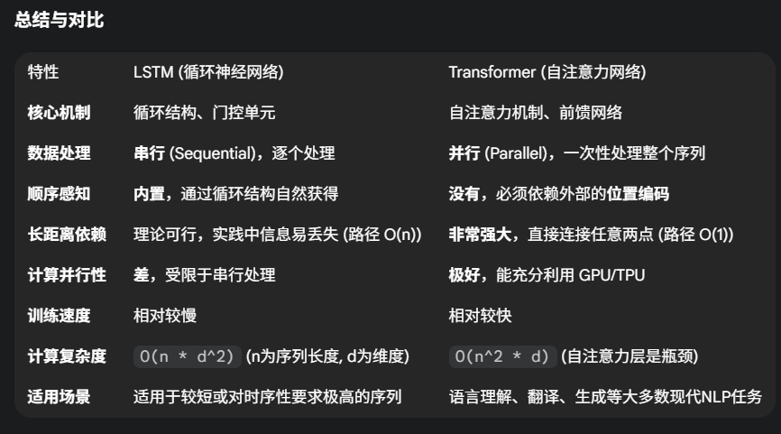


## 推荐模型中的Embedding层维度如何选择？

经验公式：

$$\dim=6\cdot|V|^{0.25}=6\cdot(|V|)^{1/4}$$

其中 $|V|$ 是某个类别特征 / ID 的基数（即候选类别总数或词表大小等）。

这个公式作为经验法则有以下优点 /合理性：

1. **增长温和**
    维度不会随着类别数线性攀升，从而避免维度过度膨胀。
2. **简单易用**
    给定类别数就能快速算一个维度，是初始化 / baseline 的便捷起点。
3. **有部分经验支持**
    在一些社区讨论与代码示例里，人们确实用类似公式作为初步猜测。**可调整系数**
    如果你觉得 6 太大 / 太小，可以把这个系数换成别的常数（比如 5、8 等），以适应你具体的模型 /数据规模。

然而，作为一个启发式公式，它有不少局限与风险。

**它的局限性 /潜在问题**

以下是这个公式在实际应用中可能遇到的问题或不适用的情况：

1. **忽略频次 /稀疏性**
    这个公式只看类别数，却没有考虑每个类别 / ID 的出现频率分布。如果类别中很多是极低频或几乎没用的，给予它们较高的维度容易过拟合。
2. **忽略样本规模 /训练数据量**
    类别数大但样本或交互数据太少，这时即使维度按这个公式算出来，也可能欠拟合 / 噪音太大。最优维度与训练样本数 /信号强度有关。
3. **忽略模型 /下游任务结构**
    不同模型结构（MLP、Transformer、因式分解机、图模型等）对 embedding 表示能力的需求不同。一个公式可能对某些模型有效，对另一些模型并不合适。
4. **尺度常数 6 是任意的 / 无理论支撑**
    “乘以 6”这个系数是经验调试得出，并没有坚实的理论基础。对于不同任务可能需要不同常数。
5. **可能偏低 /偏高**
    对于非常大类别数或非常复杂语义特征，可能这个公式给出的维度不够（表达能力受限）。反之，对中小类别数可能给出维度过高，浪费资源。
6. **忽略正则化 /剪枝 /自动调整机制**
    在现代推荐系统里，很多 embedding 定制 / 剪枝 /动态调整方法（比如 PEP 等）使得“统一公式”不再理想。


## 序列化和反序列化？

+ **序列化**：把对象转换成可存储或可传输的格式（如 JSON、pickle、protobuf）。
+ **反序列化**：把序列化后的数据恢复成内存中的对象。
+ **用途**：网络传输、持久化存储、跨语言/进程通信。

## 讲一下你所了解的transformer ？

为什么要用多头？ 怎么评判多头学习的有效性？矩阵相似度怎么计算？ 为什么要用LN？

**核心结构**：

- Encoder-Decoder 架构（如原始翻译任务）或纯 Encoder（BERT）、纯 Decoder（GPT）。
- **Self-Attention** 机制：计算输入序列中各位置之间的依赖关系，替代 RNN 的序列建模。
- **位置编码**：弥补模型缺乏位置信息的问题。
- **前馈网络（FFN）+ 残差连接 + LayerNorm**：稳定训练、提升表达能力。

**优势**：

- 并行计算高效。
- 长距离依赖建模能力强。
- 易扩展到大规模数据和参数。

**为什么要用多头?**

+ **多头注意力（Multi-Head Attention）**：通过多个注意力头在不同的子空间中学习表示。

+ **好处**：
  + 不同头可以捕捉不同的关系模式（如句法依赖、语义联系）。
  + 提高模型的表达能力与鲁棒性。
  + 避免单一注意力机制的“偏置”问题。

**怎么评判多头学习的有效性**

- **量化指标**：
  - 模型整体的下游任务性能提升（如分类准确率、BLEU、Perplexity）。
  - 各头的注意力分布熵或多样性（避免所有头学到相同模式）。
- **定性分析**：
  - 可视化注意力权重，观察不同头是否关注不同结构（如长距离依赖、局部词组）。
  - Ablation study（移除部分头，观察性能变化）。

**矩阵相似度怎么计算**

常见方法：

- **余弦相似度**：衡量角度是否一致，适合表示语义相似度。
- **欧氏距离 / 曼哈顿距离**：几何距离。
- **核函数（RBF kernel）**：非线性相似度。
- **矩阵相似度**：可以通过 `trace(AᵀB)` 或 Frobenius 内积计算，也可逐行/列计算向量相似度再聚合。

**为什么要用 LayerNorm (LN)？**

+ **作用**：
  + 缓解梯度消失/爆炸。
  + 让不同层的输出分布更加稳定（减少 covariate shift）。
  + 提升训练速度和收敛性。

+ **对比 BN**：
  + LN 在样本维度归一化（不依赖 batch size），适合 NLP 中变长序列输入。
  + BN 依赖 batch 统计特性，更适合 CV 任务。


## 激活函数

**激活函数及每层适合什么样的激活函数？(sigmoid/softmax做输出， ReLU及变体做隐藏等)**

+ **输出层**：分类常用 **sigmoid（二分类）** 和 **softmax（多分类）**；回归任务一般用 **线性**。
+ **隐藏层**：主流是 **ReLU 及其变体**，因为收敛快、计算简单。

**激活函数各自具体的形式和优缺点？（主要从计算速度、梯度问题简单讲一下）**

+ $$\text{Sigmoid: }\sigma(x)=\frac1{1+e^{-x}}$$
  + 优点：输出在 [0,1]，可解释为概率。
  + 缺点：容易饱和，梯度消失，计算相对慢。
+ $$\text{Tanh:}\tanh(x)=\frac{e^x-e^{-x}}{e^x+e^{-x}}$$
  + 优点：输出在 [−1,1]，均值为零，收敛比 sigmoid 快。
  + 缺点：仍有梯度消失问题。
+ $$\text{ReLU: }f(x)=\max(0,x)$$
  + 优点：计算快，梯度传播稳定。
  + 缺点：会出现“死亡 ReLU”，即神经元长期输出 0。

**ReLU的变体？（解决死亡ReLU问题，稍微讲2-3个就行）**

+ **Leaky ReLU**: 给负数部分一个很小的斜率，避免完全死亡。
+ **Parametric ReLU (PReLU)**: 负半轴斜率可学习。
+ **ELU/GELU**: 在负区间平滑过渡，表现更好，常用于大模型。

**目前大模型主要用什么激活函数？**

+ 早期 Transformer 用 **ReLU**。
+ 后来改为 **GELU**，因为平滑且在负值部分更有表达力。
+ 一些最新模型也尝试 **SwiGLU、SiLU** 等。

**MHA的表达与公式？(Q,K,:线性变换；splt;点积与缩放： softmax:权重和累加)**

1. 输入经过线性变换得到

   $$Q=XW^Q,\quad K=XW^K,\quad V=XW^V$$

2. 计算注意力权重：

   $$\mathrm{Attention}(Q,K,V)=\mathrm{softmax}\left(\frac{QK^\top}{\sqrt{d_k}}\right)V$$

3. 多头并行：

   $$\mathrm{MHA}(X)=\mathrm{Concat}(head_1,\ldots,head_h)W^O$$

**为什么要缩放？（避免结果过大导致softmax梯度消失）**

- 没有缩放时，点积随维度增大而变大，softmax 进入饱和区，梯度趋近于 0。
- 缩放后保持数值稳定，避免梯度消失。


## Softmax表达式，导数推导

Softmax 是多分类任务中常见的归一化函数。给定向量 z=(z1,z2,…,zK)，Softmax 定义：

$$\sigma(z_i)=\frac{e^{z_i}}{\sum_{j=1}^Ke^{z_j}}$$

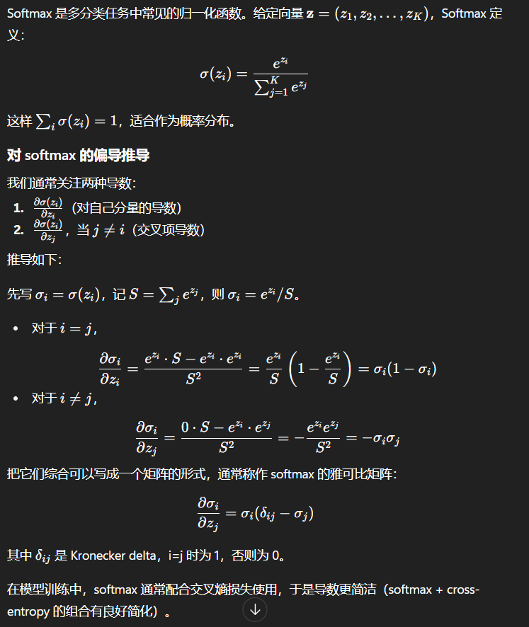

## 低秩分解的数学原理？

1. **基本思想**

假设有一个大矩阵 $$M\in\mathbb{R}^{m\times n}$$，秩为 r（即最多有 r 个线性无关的行/列）。

- 如果 r≪min⁡(m,n)，那么矩阵 M 就是 **低秩的**。
- 低秩矩阵往往能用更少的参数表示，起到 **压缩** 和 **去噪** 的作用。

------

2. **低秩分解的数学形式**

**矩阵分解形式**

任何秩为 r 的矩阵 M，都可以写成两个低维矩阵的乘积：

$$M\approx UV^\top $$

其中：

- $$\begin{aligned}&U\in\mathbb{R}^{m\times k},\\&V\in\mathbb{R}^{n\times k}\\&k\leq r_{s}\end{aligned}$$

这样：

- 原矩阵参数量：O(mn)，
- 分解后参数量：O((m+n)k)，大大降低存储和计算复杂度。

------

**与 SVD 的关系**

奇异值分解（SVD）告诉我们：

$$M=U\Sigma V^\top $$

其中 Σ 是对角矩阵，包含奇异值。

如果我们只保留前 k 个最大的奇异值：

$$M_k=U_k\Sigma_kV_k^\top $$

那么 $M_k$ 就是 **在 Frobenius 范数意义下最优的秩-k 近似矩阵**。

------

3. **优化目标视角**

在推荐系统中，往往不是完整矩阵，而是**稀疏观测**：

比如用户-物品打分矩阵 $R\in\mathbb{R}^{m\times n}$，已知部分元素，未知部分需要预测。

常见做法是：

$$\min_{U,V}\sum_{(i,j)\in\Omega}\left(R_{ij}-U_i^\top V_j\right)^2+\lambda(||U||^2+||V||^2)$$

其中：

- Ω：观测到的样本集合，
- $U_i$：用户 i 的隐向量，
- $V_j$：物品 j 的隐向量。

这就是 **矩阵分解的低秩假设**，即我们假设用户-物品交互矩阵是近似低秩的。

------

4. **数学原理总结**

1. **低秩假设**：数据存在潜在的低维结构。
2. **分解方法**：通过 $M \approx UV^\top$ 或 SVD 截断实现降维。
3. **最优性**：SVD 截断给出 Frobenius 范数下最优的秩-k 近似。
4. **应用**：推荐系统（矩阵补全）、NLP（词向量）、图像压缩、表示学习。

✅ 直白理解：
 低秩分解就是把一个“大而稀疏/冗余的矩阵”用两个“小矩阵”相乘来近似，从而发现数据里的“潜在维度”（latent factors），既能压缩计算量，又能提取出核心结构。


## SVD和PCA的区别，优劣各自是什么？

SVD（奇异值分解）和 PCA（主成分分析）常常一起出现，它们关系紧密，但并不完全一样。下面我给你分层解释：

------

1. **数学定义层面**

- **SVD（Singular Value Decomposition）**

  - 对任意矩阵 $A \in \mathbb{R}^{m \times n}$，都可以分解为：

    $A = U \Sigma V^\top$

    其中：

    - U：列正交的 m×m 矩阵
    - Σ：对角矩阵，奇异值（非负实数），按照大小排序
    - V：列正交的 n×n 矩阵

- **PCA（Principal Component Analysis）**

  - 关注的是**数据的协方差矩阵的特征分解**。

  - 假设数据矩阵 $X \in \mathbb{R}^{n \times d}$（每行是一个样本，已中心化），其协方差矩阵为：

    $C = \frac{1}{n} X^\top X$

  - PCA 就是对 C 做特征值分解，取前 k 个最大特征值对应的特征向量，作为主成分方向。

------

2. **关系**

其实 **PCA 可以通过 SVD 实现**：

- 如果对中心化后的数据矩阵 X 做 SVD：

  $X = U \Sigma V^\top$

- 那么：

  - V 的前 k 列就是 **PCA 的主成分方向**
  - Σ 就是协方差矩阵的特征值

👉 换句话说，PCA = “在协方差矩阵上做特征分解”，而 SVD 是更通用的分解方法。

------

3. **区别**

| 方面                   | **SVD**                                            | **PCA**                                    |
| ---------------------- | -------------------------------------------------- | ------------------------------------------ |
| **输入对象**           | 任意矩阵（方阵/非方阵都可以）                      | 必须是协方差矩阵（对称正定）               |
| **目标**               | 找到矩阵的奇异值与正交基，适用于压缩、求解低秩近似 | 找到数据方差最大的方向，用于降维           |
| **应用场景**           | 矩阵近似、矩阵压缩、隐语义分析（LSA）、推荐系统    | 降维、可视化、去噪、特征提取               |
| **输出**               | 左奇异向量、右奇异向量、奇异值                     | 主成分方向（特征向量）、方差大小（特征值） |
| **是否依赖数据中心化** | 不要求                                             | 必须中心化，否则主成分不正确               |

------

4. **优劣比较**

- **SVD 的优势**
  - 更通用，适用于任意矩阵
  - 在数值稳定性上比直接做特征分解更好
  - 可以用于非方阵情况
- **PCA 的优势**
  - 专门针对数据降维，解释性强（“最大方差方向”）
  - 结果直观，可以直接解释每个主成分对方差的贡献
  - 在机器学习特征提取、压缩数据维度上更自然

------

5. **总结一句**

- **SVD 是数学工具**，能分解任何矩阵。
- **PCA 是统计方法**，目的是找数据最大方差方向，可以通过 SVD 实现。

👉 常见理解：**PCA ⊂ SVD 的应用**。


　　PCA算法的主要优点有：

　　　　1）仅仅需要以方差衡量信息量，不受数据集以外的因素影响。　

　　　　2）各主成分之间正交，可消除原始数据成分间的相互影响的因素。

　　　　3）计算方法简单，主要运算是特征值分解，易于实现。

　　　　PCA算法的主要缺点有：

　　　　1）主成分各个特征维度的含义具有一定的模糊性，不如原始样本特征的解释性强。

　　　　2）方差小的非主成分也可能含有对样本差异的重要信息，因降维丢弃可能对后续数据处理有影响。

## LoRA调参和全局调参的区别，为什么冻结一部份参数达到的效果好

1. **全局调参（Full Fine-tuning）**

- **做法**：在下游任务中，把预训练模型的全部参数都解冻，进行梯度更新。
- **优点**：
  - 表达能力最强，理论上能适配任何下游任务。
- **缺点**：
  - 参数量非常大，显存/存储/训练开销高。
  - 极易 **过拟合**，因为大模型的容量太大，下游小数据集会让模型「忘记」原来的知识（灾难性遗忘）。
  - 迁移到不同任务时，每个任务都要保存一份完整的模型副本（成本高）。

------

2. **LoRA 调参（Low-Rank Adaptation）**

- **做法**：把预训练模型的权重 **冻结**，只在某些关键层（如 Transformer 的 Attention/Feed-Forward 层）插入可训练的「低秩矩阵」，训练时只更新这些额外参数。
- **优点**：
  - **参数量极小**（只需训练插入的低秩参数），内存和显存开销大幅降低。
  - 原模型参数不动，避免灾难性遗忘，保留了大部分的通用能力。
  - 对下游小数据集更鲁棒，不容易过拟合。
  - 一个预训练模型可以配合多个不同的 LoRA 模块（插件化切换）。
- **缺点**：
  - 理论上表达能力比全参更新弱（但在实践中往往足够）。

------

3. **为什么「冻结部分参数」会更好？**

1. **防止灾难性遗忘**
   - 全局调参会让预训练得到的通用知识被快速覆盖，导致原有能力丢失。
   - LoRA/部分冻结只改变一小部分权重，能保持「预训练知识」和「新任务知识」的平衡。
2. **正则化效果（implicit regularization）**
   - 冻结大部分参数，意味着模型搜索空间被限制在一个小范围，不容易在小数据集上过拟合。
   - 类似于在高维参数空间里给模型「加了约束」，让它只能在低维子空间里调整。
3. **利用预训练的强表示能力**
   - 大模型预训练时已经学到了丰富的语言/知识表示。下游任务往往只需要微调某些「任务特定的映射关系」。
   - 因此，不需要全局大改，只要通过 LoRA 模块补充偏移量，就能达到类似甚至更好的效果。
4. **参数效率 & 可复用性**
   - 训练 LoRA 只需存储很小的额外参数，可以同时维护多个任务的 LoRA 模块，而无需为每个任务复制整模型。

------

4. **类比**

- **全局调参**：像是重写一本书，每次新任务都要把整本书改写一遍。
- **LoRA 调参**：像是在书的页边加批注，只改必要的地方，大部分内容保持不动。

------

✅ **结论**：
 冻结大部分参数（如 LoRA）不仅能节省计算资源，还能避免灾难性遗忘、降低过拟合风险，反而比全参调优更稳定、更泛化。


## LayNorm、BatchNorm、RMSNorm

**Batch Normalization（BatchNorm）**

对同一层在一个 batch 中的激活值做均值方差归一化。

对每个特征通道 x：$\hat{\boldsymbol{x}}=\frac{x-\mu_B}{\sqrt{\sigma_B^2+\epsilon}}\\y=\gamma\hat{\boldsymbol{x}}+\beta $

其中：

- $\mu_B, \sigma_B^2$：在一个 batch 内的均值与方差
- $\gamma, \beta$：可学习的缩放和平移参数

🧮 归一化维度

以卷积网络为例：

- 对于输入 shape = `(N, C, H, W)`：
  - **BatchNorm** 在 **N 和 H×W 维度上求均值和方差**（即对每个通道计算统计量）。

✅ 优点

- 加快模型收敛，允许更大学习率；
- 具有轻微的正则化效果；
- 提升模型泛化性能。

⚠️ 缺点

- 对 batch size 敏感（小 batch 时统计不稳定）；
- 在 RNN 中难以使用；
- 推理阶段需使用训练时的滑动均值。

**Layer Normalization（LayNorm / LayerNorm）**

主要为了解决 RNN 无法使用 BatchNorm 的问题。
 它在**单一样本的特征维度上进行归一化**，与 batch 无关。

对单个样本的隐藏状态 $x \in \mathbb{R}^H$：

$$\hat{x}=\frac{x-\mu}{\sqrt{\sigma^{2}+\epsilon}}\\y=\gamma\hat{x}+\beta $$

其中：

- $\mu = \frac{1}{H} \sum_i x_i$
- σ$\sigma^2 = \frac{1}{H} \sum_i (x_i - \mu)^2$
- 归一化是在**特征维度**上进行的。

🧮 归一化维度

- 对每个样本的所有特征（如隐藏层维度）计算均值和方差；
- 与 batch size 无关。

------

✅ 优点

- 可在 **RNN、Transformer 等结构**中稳定使用；
- 对 batch size 不敏感；
- 无需区分训练/推理阶段。

⚠️ 缺点

- 相较 BatchNorm，有时训练速度稍慢；
- 在 CNN 中效果不如 BatchNorm。

**RMS Normalization（RMSNorm）**

**只使用输入的均方根（RMS）而不是均值和方差**，即**不进行均值中心化**。

对输入 $x \in \mathbb{R}^H$：

$$\mathrm{RMS}(x)=\sqrt{\frac{1}{H}\sum_{i}x_{i}^{2}}\\\hat{x}=\frac{x}{\mathrm{RMS}(x)+\epsilon}\\y=\gamma\hat{x}$$

与 LayerNorm 相比，RMSNorm 去掉了“减均值”的步骤，也通常没有偏置 β。

🧮 归一化维度

- 同样在**单一样本的特征维度上归一化**；
- 但仅基于二范数（RMS）。

------

✅ 优点

- 计算更高效；
- 在 Transformer 等模型中性能与 LayerNorm 相近；
- 减少归一化带来的信息损失。

⚠️ 缺点

- 不适合需要去均值的任务；
- 理论上表达能力略低于 LayerNorm（但实践上差别很小）。

| 特性                  | BatchNorm          | LayerNorm          | RMSNorm                            |
| --------------------- | ------------------ | ------------------ | ---------------------------------- |
| 归一化维度            | Batch 内的样本维度 | 每个样本的特征维度 | 每个样本的特征维度                 |
| 是否依赖 Batch Size   | ✅ 是               | ❌ 否               | ❌ 否                               |
| 是否减均值            | ✅ 是               | ✅ 是               | ❌ 否                               |
| 是否适用于 RNN        | ❌ 否               | ✅ 是               | ✅ 是                               |
| 是否需要区分训练/推理 | ✅ 需要             | ❌ 不需要           | ❌ 不需要                           |
| 是否有 γ、β 参数      | ✅ 有               | ✅ 有               | 仅 γ                               |
| 计算代价              | 中等               | 略高               | 较低                               |
| 典型应用              | CNN                | Transformer / RNN  | Transformer（尤其是 LLaMA 等模型） |


## Lazy decoder-only

基于 Transformer Decoder 的自回归架构 + 惰性计算（缓存/按需计算）。

+ “Decoder-only”：只用自回归部分建模序列。
+ “Lazy”：推理时只算新 token/新行为，避免重复算历史，节省大规模推荐系统的计算开销。

在业界（比如阿里、字节、Meta 推荐论文里），“lazy decoder-only” 经常指：

- 用 **Decoder-only Transformer** 来建模用户行为序列。
- **Lazy** 指：
  1. 训练时可以并行，但推理时只计算需要的部分，复用历史结果（比如 KV cache）。
  2. 不像 Encoder 那样全量交互，而是自回归式地预测下一个交互，更贴近推荐场景的 **顺序性**。

## KV cache机制

Transformer 推理时，尤其是自回归模型（如 GPT），每生成一个 token 都要重新计算整个注意力。

原始计算复杂度为：$$O(T^2)$$

其中 T 是上下文长度。

**KV Cache 原理**

在解码阶段：

- 对每个生成的 token，会计算：

  $$K_t = X_t W_K, \quad V_t = X_t W_V$$

- 注意力计算公式：

  $$\text{Attention}(Q_t, K_{1:t}, V_{1:t})$$

👉 这些 K, V向量在生成后不会改变，因此可以 **缓存起来**。

 **好处**

- 避免重复计算前面 token 的 K,V；
- 将时间复杂度从 $O(T^2)$降为 O(T)；
- 对长上下文推理效率提升极大。

**KV Cache 占用内存**

KV cache 是内存消耗的主要来源：

$$\text{Cache Size}\approx2\times T\times n_{layer}\times d_{model}$$

+ 2：K 和 V 各占一份缓存
+ T：当前上下文序列长度（context length）
+ n_layer：Transformer 的层数（blocks 数）
+ d_model：每个 token 的隐藏维度（embedding 维度）


## loss损失函数

**1）点式损失（Point-wise Loss）**

直接把推荐问题当成分类/回归问题，对每个 **用户-物品对** 预测一个分数。

- **交叉熵损失（Binary Cross-Entropy, BCE）**
  最常见的点击率（CTR）预测损失函数：

  $$ L=-\begin{bmatrix}y\log(\hat{y})+(1-y)\log(1-\hat{y})\end{bmatrix} $$

  - y：真实点击 (0/1)
  - y^：预测概率
    👉 用于二分类（点击、不点击）。

  **数学上的含义：**衡量两个概率分布 P与 Q 的差异。最小化它相当于让模型预测分布逼近真实分布。
  
  **工程上：**惩罚错误预测的概率，鼓励模型输出更高置信度的正确类别概率
  
  **推荐系统中：**衡量预测的点击/购买概率与用户实际行为的差异，是CTR/CVR模型最常用损失。
  
- **均方误差（MSE）**

  $$ L=(y-\hat{y})^2 $$

  👉 常用于评分预测（比如 Netflix 推荐的评分 1-5 星）。

- **交叉熵 + 样本权重**
  在推荐场景下正负样本极度不平衡，通常会对正样本/负样本加权，避免模型全预测 0。

**2）对式损失（Pair-wise Loss）**

关心的是 **两个物品之间的相对排序**。

- **BPR（Bayesian Personalized Ranking）**
  推荐领域最经典的 pair-wise loss，用于学习用户偏好排序：

  $$ L=-\sum_{(u,i,j)}\log\sigma(\hat{y}_{ui}-\hat{y}_{uj}) $$

  - 用户 u 对物品 i 有正反馈，对物品 j 没有反馈
  - 目标：让 i 的分数大于 j

- **Hinge Loss（最大间隔损失）**

  $$ L=\max(0,1-(\hat{y}_{ui}-\hat{y}_{uj})) $$

  👉 强调正样本必须比负样本至少大 margin。

- **RankNet Loss**
  基于 pair-wise 的概率建模，早期在搜索/推荐排序里常用。

**3）列表式损失（List-wise Loss）**

直接对一个候选列表进行优化，更接近业务目标。

- **Softmax Loss / ListNet**
  对一组物品预测的相关性做 softmax，再和真实分布对齐。
- **LambdaRank / LambdaMART**
  - 基于排序指标（比如 NDCG）直接优化，常用于学习排序（LTR）。
  - 思想：对 pair-wise 样本动态调整梯度，使得最终对 NDCG 等排序指标更友好。

**4）多任务损失（Multi-task Loss）**

- **加权求和**：

  $$ L=\alpha L_{CTR}+\beta L_{CVR}+\gamma L_{WatchTime} $$

  👉 在多任务模型（MMoE、PLE）里常见。

- **动态加权**：自动学习任务权重，比如 GradNorm、uncertainty weighting。

**🧩 一、回归问题常用的损失函数**

| 名称             | 英文名                         | 公式                                                  | 特点                                                         |
| ---------------- | ------------------------------ | ----------------------------------------------------- | ------------------------------------------------------------ |
| **均方误差损失** | Mean Squared Error (MSE)       | $ L = \frac{1}{n} \sum_i (y_i - \hat{y}_i)^2 $        | 对异常值敏感，平滑可微，最常见，对大误差的惩罚更重           |
| **均方根误差**   | Root Mean Squared Error (RMSE) | $ L = \sqrt{\frac{1}{n} \sum_i (y_i - \hat{y}_i)^2} $ | 与原值同量纲，直观解释误差                                   |
| **平均绝对误差** | Mean Absolute Error (MAE)      | $ L = \frac1n\sum_{i=1}^n$                            | 对所有误差一视同仁，对所有大小的误差都给予相同的线性权重，对离群点更具鲁棒性，更易于解释 |

**🧠 二、分类问题常用的损失函数**

| 名称                | 英文名                            | 公式                                                  | 特点                                                         |
| ------------------- | --------------------------------- | ----------------------------------------------------- | ------------------------------------------------------------ |
| **交叉熵损失**      | Cross-Entropy Loss                | $ L = -\sum_i y_i \log(\hat{y}_i) $                   | 最常用于分类问题（Softmax 输出）                             |
| **二元交叉熵损失**  | Binary Cross-Entropy              | $ L = -[y\log(\hat{y}) + (1-y)\log(1-\hat{y})] $      | 二分类标准损失                                               |
| **分类交叉熵损失 ** | Categorical Cross-Entropy Loss    | $L(y,\hat{p})=-\sum_{c=1}^{O}y_c\cdot\log(\hat{p}_c)$ | 通常与 `Softmax` 激活函数配合使用                            |
| **负对数似然损失**  | Negative Log Likelihood (NLLLoss) |                                                       |                                                              |
| **KL 散度损失**     | Kullback–Leibler Divergence       | $ L = \sum_i p_i \log(\frac{p_i}{q_i}) $              | 衡量两个概率分布的差异                                       |
| **Focal Loss**      | Focal Loss                        | $ L = -(1-\hat{y})^\gamma y\log(\hat{y}) $            | 标准交叉熵损失的一种改进，主要解决类别不平衡（如目标检测）问题 |

**🧩 三、排序与度量学习常用损失**

| 名称                    | 英文名              | 公式                                                      | 应用                                        |
| ----------------------- | ------------------- | --------------------------------------------------------- | ------------------------------------------- |
| **Hinge 损失**          | Hinge Loss          | $L = \max(0, 1 - y \cdot \hat{y}) $                       | 支持向量机（SVM），主要用于**最大间隔分类** |
| **Margin Ranking Loss** | Margin Ranking Loss | $L = \max(0, -y(\hat{y}_1 - \hat{y}_2) + \text{margin}) $ | 序列或排序任务                              |
| **Triplet Loss**        | Triplet Loss        | $L = \max(0, d(a,p) - d(a,n) + m) $                       | 人脸识别、度量学习                          |
| **Contrastive Loss**    | Contrastive Loss    | $ L = (1-y)d^2 + y\max(0,m-d)^2 $                         | 用于孪生网络（Siamese Networks）            |


## infoNCE Loss 和 Triplet Loss

这两个损失函数都常用于 **对比学习（Contrastive Learning）**，在推荐系统里主要用来学习 **用户/物品表示** 或者 **序列表示**，提高向量空间的区分能力。

**InfoNCE Loss（Info Noise Contrastive Estimation）**

InfoNCE 本质是 **带有 softmax 的对比学习损失**。
 给定一个 **正样本对** (q, k^+) 和一组 **负样本对** (q, k^-)，它的形式是：

$$ L=-\log\frac{\exp(s,k^+)/\tau)}{\exp(\sin(q,k^+)/\tau)+\sum_{k^-}\exp(\sin(q,k^-)/\tau)} $$

- q：查询向量（query）
- k^+：正样本（positive key）
- k^-：负样本（negative keys）
- sim(⋅)：相似度（常用点积/余弦）
- $\tau$：温度参数，控制分布平滑度

直观理解

- **目标**：让正样本的相似度比所有负样本都更高。
- **机制**：softmax 正则化，负样本越多，学习效果越强。
- **应用**：SimCLR、CLIP 里广泛使用，在推荐里常用于 **用户-物品对比学习** 或 **序列增强**（比如不同视角的行为序列 embedding）。

温度系数

τ 是 softmax 的“平滑因子”：

+ 缩放相似度→ 改变 logits 的相对差异。
+ 控制分布的平滑程度。

不同温度取值的影响：

+ 较小的 τ（比如 0.05, 0.1）
  + softmax 更尖锐（sharp），差距稍微大一点，相似度最高的样本概率会更接近 1。
  + 模型会 **强烈区分正负样本**，但训练可能不稳定（梯度过大）。
+ 较大的 τ（比如 0.5, 1.0 甚至更高）
  + softmax 更平滑，所有样本的概率差异变小。
  + 模型学习信号更弱，可能导致 **收敛慢或区分度不足**。

锚点

可以将用户序列表示 q作为锚点，与目标 item（正样本）/ 采样的其他 item（负样本）做对比。

工程实现时的小细节

- **归一化**：通常会 L2-normalize（单位化），避免相似度受向量长度影响。
- **投影层**：很多对比学习方法在 encoder 输出后还加一个 MLP 投影层（projection head），再取其作为 anchor，提升表达能力。
- **批内采样**：常见 trick 是直接用 mini-batch 里的其他样本当负样本，这样 anchor 计算只需一次前向传播，非常高效。

**Triplet Loss（三元组损失）**

Triplet loss 直接用 **margin 约束** 来比较正负样本的距离。
 一个三元组 = (anchor, positive, negative)，损失定义：

$$ L=\max(0,\:d(a,p)-d(a,n)+m) $$

- a：anchor（锚点，例如用户 embedding）
- p：正样本（positive，例如用户喜欢的物品）
- n：负样本（negative，例如用户没点的物品）
- d(⋅)：距离函数（欧氏距离/余弦距离）
- m：margin，要求正样本比负样本更接近至少 margin。

直观理解

- 强制：d(a,p)+m<d(a,n)。
- 如果正样本和负样本已经分开了（间隔 > margin），loss = 0。
- **应用**：早期人脸识别（FaceNet），在推荐里常用于 **embedding 学习**，确保用户和正物品比负物品更近。

## KL散度

KL 散度是用来**衡量两个概率分布之间差异**的一种方法。

在机器学习中，我们通常有一个“真实的”概率分布 P（代表客观世界的数据分布），以及一个我们训练的模型所学习到的“近似”概率分布 Q。KL 散度告诉我们，用分布 Q 来近似分布 P 时，会损失多少信息。

KL 散度可以被理解为：**当我们用一个近似分布 Q 来描述真实分布 P 时，所带来的信息损失（Information Loss）**。

- 如果两个分布完全相同（P = Q），那么信息损失为 0，KL 散度为 0。
- 两个分布差异越大，信息损失越多，KL 散度值也越大。

对于**离散**概率分布 P 和 Q，其 KL 散度的计算公式为：

$$D_{KL}(P||Q)=\sum_{x\in X}P(x)\log\left(\frac{P(x)}{Q(x)}\right)$$

对于**连续**概率分布 p 和 q，则将求和替换为积分：

$$D_{KL}(p||q)=\int_{-\infty}^\infty p(x)\log\left(\frac{p(x)}{q(x)}\right)dx$$

**公式解读：**

- P(x)（或 p(x)）：事件 x 在真实分布 P 中的概率。
- Q(x)（或 q(x)）：事件 x 在近似分布 Q 中的概率。
- P(x)/Q(x)：表示在事件 x 这一点上，两个分布概率的比值。
- log(…)：对这个比值取对数。如果 P(x) > Q(x)，则值为正；如果 P(x) < Q(x)，则值为负。
- ∑P(x)…：对所有可能的事件 x，计算这个对数比值的期望。权重是真实分布 P(x)，这意味着 KL 散度更关注**真实分布 P 中概率高的事件**所对应的差异。

**与交叉熵的关系**

在机器学习中，KL 散度与我们常用的**交叉熵损失（Cross-Entropy Loss）** 有着非常紧密的联系。

$$D_{KL}(P||Q)=H(P,Q)-H(P)$$

其中：

- DKL(P∣∣Q) 是 KL 散度。
- H(P,Q) 是 P 和 Q 的**交叉熵**。
- H(P) 是 P 的**熵**。

**交叉熵** H(P,Q) 表示用基于 Q 的编码方案去编码来自 P 的事件时，所需的平均比特数（即我们前面提到的“实际成本”）。 **熵** H(P) 表示最优编码方案（基于 P）去编码来自 P 的事件时，所需的平均比特数（即“理想成本”）。

在机器学习的分类任务中，我们的目标是让模型预测的分布 Q 尽可能地接近真实的标签分布 P。因为真实分布 P（训练数据）是固定的，所以它的熵 H(P) 是一个常数。

因此，**最小化 KL 散度 DKL(P∣∣Q) 就等价于最小化交叉熵 H(P,Q)**。

**关键特性**

+ 非负性 (Non-negativity)
+ 不对称性 (Asymmetry)

**总结**

- **核心思想**：KL 散度衡量用一个概率分布 Q 去近似另一个真实概率分布 P 时所造成的信息损失。
- **直观比喻**：它是用“次优”编码方案替代“最优”方案所付出的额外编码成本。
- **数值意义**：KL 散度为 0 表示两个分布完全相同；值越大，差异越大。
- **重要特性**：它是**非负**且**不对称**的，因此不是一个真正的距离度量。
- **与交叉熵的关系**：在机器学习中，最小化 KL 散度等价于最小化交叉熵损失函数。

## RePO位置编码


# 推荐系统相关

## 常见指标

+ CTR：点击率，含义：点击数 ÷ 曝光数 
+ CVR：转化率，含义：转化数 ÷ 点击数 
+ CTCVR：曝光转化率，含义：转化数 ÷ 曝光数 = CTR × CVR 
+ PR：播放率，含义：播放数 ÷ 曝光数 
+ CR：完播率，含义：完整播放数 ÷ 播放数 
+ ARPU：人均收入，含义：总收入 ÷ 活跃用户数 
+ eCPM：有效千次展示收益，含义：广告收益 ÷ 曝光数 × 1000（平台角度） 
+ MAP：平均精确率均值广告，含义：多个查询的平均精确率 
+ MRR：平均倒数排名，含义：相关结果首次出现的排名倒数的平均值 
+ eCPC：有效点击成本，含义：广告花费 ÷ 点击数（广告主角度） 
+ eCPA：有效转化成本，含义：广告花费 ÷ 转化数（广告主角度） 
+ ROI：广告回报率，含义：广告带来收益 ÷ 广告花费
+ GMV（成交金额）

## 推荐系统排序指标 CG、DCG、NDCG、Hit Rate、MRR、MAP

[详细介绍连接](https://bbs.huaweicloud.com/blogs/353253)

**CG，累计增益 Cumulative Gain**

CG 是最基础、最简单的概念。它只关心推荐出的 K 个物品的总价值（相关性），而不考虑它们的顺序。

CG表示对K个item的Gain进行累加，其中Gain表示列表中每一个item的相关性分数 r(i)，CG即：

$$\mathrm{CG@K}=\sum_{\mathrm{i}}^\mathrm{K}\mathrm{r}(\mathrm{i})$$

**缺点**：CG 的致命弱点是**对位置不敏感**。它完全忽略了物品的排序。

**DCG，折损累计增益 Discounted cumulative gain**

DCG 在 CG 的基础上引入了位置惩罚机制。它的核心思想是：**排在越靠后的物品，其价值（相关性得分）需要被“折损”或“打折”**。所以就加了衰减因子:

$$\mathrm{DCG_p=\sum_{i=1}^p\frac{rel_i}{\log_2(i+1)}=rel_1+\sum_{i=2}^p\frac{rel_i}{\log_2(i+1)}}$$

还有一个公式广泛在工业界和kaggle比赛中，对应的公式和代码如下：

$$\mathrm{DCGp}=\sum_{1=1}^\text{p}\frac{2^\text{reli}-1}{\log_2(\mathrm{i}+1)}$$

**缺点**：DCG 值本身不具有可比性。不同用户的推荐列表长度可能不同，相关性得分的分布也不同，导致 DCG 的值域会变化。比如，为一个用户推荐了 10 个物品，而为另一个用户推荐了 5 个，这两个 DCG 值很难直接比较。为了解决这个问题，我们需要进行归一化，这就是 NDCG。

**NDCG，归一化折损累计增益 Normalized Discounted Cumulative Gain**

NDCG 是 DCG 的归一化版本，它通过除以**理想情况下的最大 DCG 值 (IDCG)**，使得最终的指标值落在 `[0, 1]` 区间内，从而变得具有可比性。

**思想：** 用当前模型的 DCG 值，除以一个“理想”模型能达到的最大 DCG 值。

$$\mathrm{NDCGk}=\frac{\mathrm{DCG_k}}{\mathrm{IDCG_k}}$$

其中 IDCG 是指ideal DCG，即理想结果下的DCG，对应的公式为：

$$\text{IDCGp}=\sum_{i=1}^{|\text{RELLp}|}\frac{2^{\text{jeli}}-1}{\log_2(\mathrm{i}+1)}$$

简单说：NDCG是由各DCG除以当前DCG中最大的值得到的。
n：Normalization，不同指标大小不同，需要做normalization
D：Position discount,位置越靠前影响越大
C：Cumulating,
G：Gain,可以使相关性、点击率等指标

解读：NDCG 值为 0.925 意味着当前模型的排序质量达到了理想排序的 92.5%，这是一个非常好的结果。如果模型的排序和理想排序完全一致，NDCG 值就是 1。如果模型推荐的物品全都不相关（相关性全为0），NDCG 值就是 0。

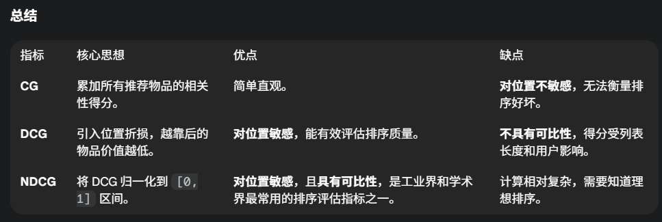

**Hit Rate**

hr指标在top N推荐中经常使用：

$$\mathrm{HR}=\frac{\text{测试集中的item出现在 Top-N 推荐列表中的用户数量}}{\text{用户总数}}$$

**MRR**

平均倒数排名（Mean Reciprocal Rank, MRR）是一个国际上通用的对搜索算法进行评价的机制。

MRR 的核心思想非常简单：**它衡量的是我们的系统在推荐列表中，把第一个“正确”或“相关”的答案排在了什么位置。**适用于**评估系统找到第一个正确答案的能力**。

当你的业务场景非常看重“快准狠”地给出用户想要的首个答案时，MRR 是一个绝佳的衡量标准。但如果你的目标是提供一个多样化且全面的相关项目列表，那么可能需要结合使用其他指标，如 **NDCG** 或 **MAP (Mean Average Precision)**，来进行更全面的评估。

描述：结果列表中，第一个结果匹配，分数为1，第二个匹配分数为0.5，第n个匹配分数为1/n，如果没有匹配的句子分数为0。最终的分数为所有得分之和，再求平均

数学形式：正确检索结果值在检索结果中的排名来评估检索系统的性能。

$$MRR=\frac{1}{Q}\sum_{i=1}^{|Q|}\frac{1}{rank_i}$$

其中，|Q|是用户的个数，ranki 是对于第 i 个用户，推荐列表中第一个在ground-truth结果中的item所在的排列位置。

**MAP**

平均精度均值（Mean Average Precision，MAP），该指标在目标检测、多标签等领域也都有应用，是一个应用很广的评价指标。MAP是计算AP（Average Precision）的均值，因此我们需要先知道如何计算AP。

首先简单介绍一下AP，我们在用评价指标进行评估的时候，Precision和Recall都只能从一个方面来反映模型的性能，最理想的是我们希望Precision和Recall都能很高，但是通常情况下，两者会相互影响，因此可以把Precision看成是Recall的函数，P=f(R)。那么假设R从0到1，我们就可以得到对应的P的值，可以在R上进行积分，得到P的期望，如下式。

$$\text{AP }=\int_0^1P(r)dr$$

当然在推荐场景下他是离散的，可以写成下式，其中hit就是之前HR中的hit函数值域为{0,1}，而这边的p就是在MRR中和位置相关的p。

$$AP=\frac{1}{N}\sum_{i=1}^{N}hit(i)\times\frac{1}{p_{i}}$$

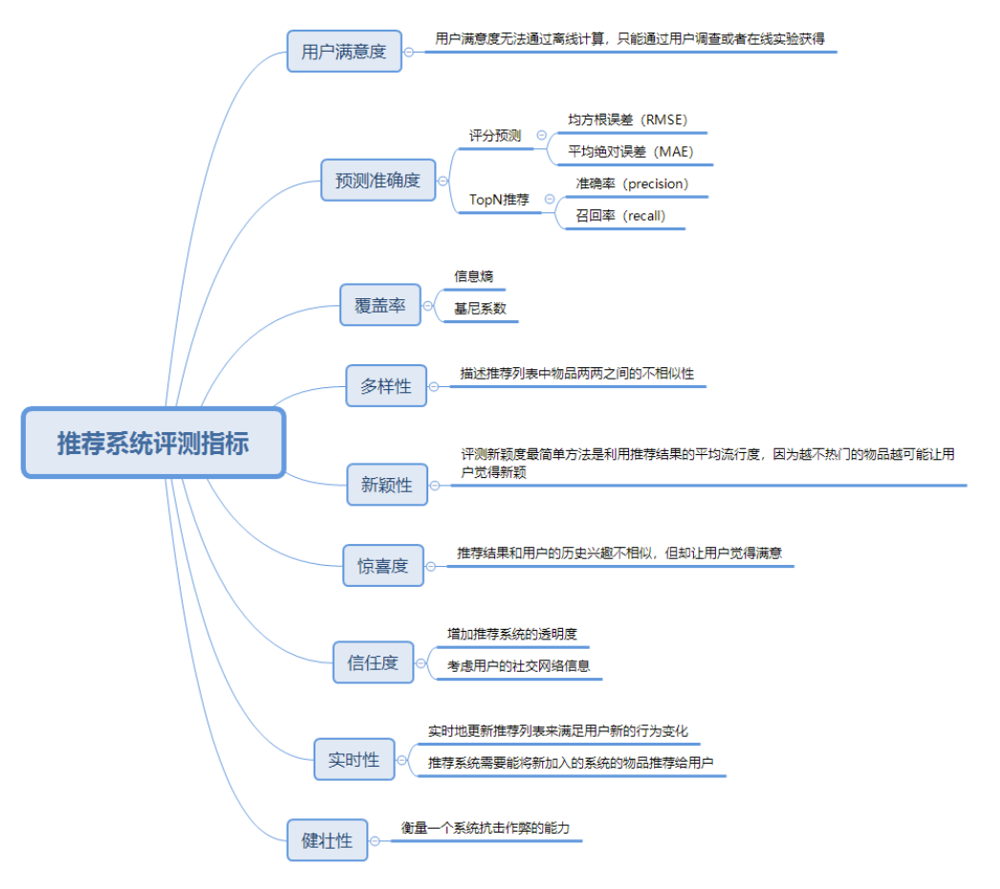

## ROC和AUC

**ROC 曲线是什么？**

**直观理解**：它描述了模型在不同判决阈值下，**真正例率 (TPR)** 与 **假正例率 (FPR)** 的关系。

ROC（Receiver Operating Characteristic）曲线是在**二分类**里，把模型输出分数的阈值从高到低“扫一遍”，每个阈值计算一对：

- **TPR / 召回率**：$\mathrm{TPR}=\frac{\mathrm{TP}}{\mathrm{TP}+\mathrm{FN}}$ , 在所有正样本中，预测为正的比例。
- **FPR / 假阳率**：$\mathrm{FPR}=\frac{\mathrm{FP}}{\mathrm{TN}+\mathrm{FP}}$ , 在所有负样本中，被错判为正的比例。

然后在平面上画点 (FPR,TPR)连成曲线。曲线越靠近左上角（高 TPR、低 FPR），模型越好。

**AUC 是什么？**

AUC（Area Under the Curve）就是**ROC 曲线下的面积**，衡量模型把**正样本排在负样本前面**的能力。

- 概率解释：$\mathrm{AUC}=\mathrm{Pr}\left(s(x^+)>s(x^-)\right)$，等价于 Mann–Whitney U 统计。
- 取值范围：1.0=完美；0.5=随机；<0.5 表示“反着用更好”（把正负翻过来）。
- 性质：对**阈值**和对分数的**任意单调变换**（如加 sigmoid、线性缩放）不敏感——因为只看**排序**。

**何时用、注意点**

- 想评估**排序能力/可分性**（如召回打分、风控评分）：用 ROC AUC 很合适。
- **极度类不平衡**时，ROC AUC 可能乐观；建议同时看 **PR 曲线**与 **PR AUC（或 AP）**，以及业务阈值下的 Precision/Recall/F1。
- AUC 不等于“概率校准好坏”，部署阈值仍需结合 ROC/PR 曲线与成本权衡。

**在推荐系统中的作用**

- 推荐系统通常不是单纯二分类，而是**排序任务**：我们希望正样本（用户真的点击/购买的物品）排在负样本（用户不感兴趣的物品）前面。
- AUC 在排序中的意义：
  - 衡量推荐模型**整体区分能力**，不依赖于某个固定阈值。
  - 越高说明正样本比负样本整体更靠前。
- 但需要注意：
  - AUC 不直接衡量推荐列表的实际用户体验（比如前 10 条推荐的好坏），所以还会搭配 **Precision@K、Recall@K、NDCG** 等指标。

## AUC怎么计算？AUC有什么弊端？(困难样本和高置信样本) 怎么解决这个弊端？

1. **AUC 的计算方法**

AUC 是 **ROC 曲线下面积**，但在推荐/CTR 预估里，通常有更直观的定义：

- **定义**：AUC = 在所有 **正样本-负样本对** 中，模型预测分数正确排序的概率。

换句话说：
 随机取一个正样本和一个负样本，若模型预测正样本的分数更高，则记作一次“成功”；AUC 就是成功次数占所有对比的比例。

**公式表示**
 设：

- $S^+$ = 正样本集合，大小为 m
- $S^-$ = 负样本集合，大小为 n
- f(x) = 模型对样本 x 的预测分数

则：

$$AUC=\frac1{mn}\sum_{x^+\in S^+}\sum_{x^+\in S^+}\sum_{x^-\in S^-}I(f(x^+)>f(x^-))$$

其中 $I(\cdot)$ 是指示函数。

**计算方式**
 在实际实现里，通常通过 **排序** 来计算：

1. 按模型预测分数对所有样本排序；
2. 计算 ROC 曲线（TPR vs FPR）；
3. 积分得到曲线下的面积。

------

2. **AUC 的弊端**

在推荐/广告场景里，直接用 **全局 AUC** 会有以下问题：

1. **受样本分布影响大**
   - 如果某些“头部用户”样本量特别大，他们的行为会主导全局 AUC，导致长尾用户的体验被忽略。
2. **不能反映用户个性化效果**
   - AUC 关注的是整体排序好坏，但推荐系统本质上是“为每个用户排序”。
   - 即使全局 AUC 很高，某些用户可能依然推荐得很差。
3. **对业务指标的映射不直接**
   - AUC 衡量的是排序正确的概率，但和实际点击率、转化率提升并不是完全线性对应。

------

3. **解决办法**

针对 AUC 的弊端，常见改进方式有：

✅ 方法1：GAUC（Group AUC）

- 按用户分组，单独算 AUC，再加权平均。
- 避免单个大用户主导，能更好反映用户层面的排序效果。

✅ 方法2：在不同层次计算 AUC

- 不仅算全局 AUC，还算 **分用户 AUC**、**分地域 AUC**、**分兴趣群体 AUC**。
- 更全面评估模型在不同人群上的效果。

✅ 方法3：结合业务指标

- 单靠 AUC 可能不足，可以配合 **点击率提升、转化率提升、NDCG、Precision@K、Recall@K** 等指标。
- 更贴合推荐系统的最终目标（如用户满意度或广告收入）。

------

📌 **总结**：

- **AUC 计算**：衡量正负样本排序正确的概率，通常通过排序+积分求 ROC 曲线面积。
- **弊端**：易受头部样本主导，缺乏个性化层面解释，和业务目标未必直接对应。
- **解决方案**：常用 GAUC 或分组指标来缓解，还可以结合业务指标做更全面的评估。

## GAUC（Group AUC）

**背景**

- 在推荐系统、广告场景中，不同用户的点击行为差异很大：
  - 有的用户活跃度高、样本量大。
  - 有的用户活跃度低，数据稀疏。
- 如果直接计算整体 AUC，容易被“头部用户”主导，导致模型在长尾用户上的表现被掩盖。

**定义**

- GAUC（Group AUC）是 **按用户（或其他分组）计算 AUC，然后做加权平均**。
- 常见做法：
  1. 按用户 ID 将样本划分成组。
  2. 对每个用户单独计算 AUC。
  3. 将所有用户的 AUC 按 **样本量加权平均**，得到 GAUC。

**公式**
 设用户集合为 U，用户 u 的样本量为 $n_u$，用户的 AUC 为 $AUC_u$​：

$$GAUC=\frac{\sum_{u\in U}n_u\cdot AUC_u}{\sum_{u\in U}n_u}$$

**意义**

- GAUC 更符合推荐/广告业务的实际场景：
  - 避免某些头部用户样本过多，掩盖整体用户体验。
  - 能衡量模型在 **用户层面排序效果**。

**缺点**

稀疏用户可能导致不稳定

---


## PR和PR AUC

**PR 曲线（Precision-Recall Curve）**

- **横轴**：Recall（召回率）

  $$ Recall=\frac{TP}{TP+FN} $$

  表示在所有真实的正样本中，有多少被模型正确预测为正。

- **纵轴**：Precision（精确率）

  $$ Precision=\frac{TP}{TP+FP} $$

  表示在所有预测为正的样本中，有多少是真的正样本。

- **画法**：通过不断调整分类阈值，得到一系列 (Recall, Precision) 点，然后连接成曲线。

------

**PR AUC（Area Under the PR Curve）**

- 就是 **PR 曲线下的面积**，同样范围在 [0,1]。
- **数值含义**：
  - 越接近 1，说明模型在各种召回水平下，都能保持较高的精确率。
  - 如果正样本比例很低（比如点击率预测），PR AUC 更能反映模型的真实性能。

## ROC vs PR 的区别

- **ROC 曲线**：不受数据类别分布（正负样本比例）太大影响，更关注“区分能力”。
- **PR 曲线**：对类别不平衡更敏感，重点关注“正样本的预测效果”。

举例：

- 在推荐系统里，点击率通常 **远小于 1%**（正样本极少）。
- 这时候 **PR 曲线/PR AUC** 更能反映模型在稀疏场景下的性能。
- 如果只看 ROC-AUC，可能觉得模型很好（因为负样本太多，容易把负样本排后），但实际前几条推荐里可能 Precision 很差，用户体验不好。

**总结一句话**

- **PR 曲线**：看模型在不同召回率下，能保持多少精确率。
- **PR AUC**：它的面积，尤其适合类别极度不平衡的推荐场景。
- **对比**：ROC-AUC 衡量“区分能力”，PR-AUC 更关注“正样本预测质量”。
- 在推荐系统这种 **正样本稀少** 的场景下，PR 曲线比 ROC 更敏感、更实用。

**ROC vs P-R 优势**

- **ROC** 对类别分布不敏感，适合正负样本均衡情况。
- **P-R** 更能反映在 **正负样本极度不均衡**时的性能。

## PCOC指标

**Predict click over click** 是指 **预测点击量与实际点击量之比**

PCOC指标是校准之后的点击率与后验点击率（近似真实概率）的比值，越接近于1，意味着在绝对值上越准确，大于1为高估，小于1为低估，是一种常用的高低估评价指标。

但是PCOC存在一定局限性，举个例子：2万个样本，其中1万个样本的预估概率是0.2，后验概率是0.4，计算出PCOC是0.2/0.4=0.5，是显著低估的，另1万个样本PCOC是0.8/0.6= 1.3，明显是高估的。所以校准效果并不好，但是样本放一起看，校准后概率是（0.2+0.8）/2=0.5，后验概率是（0.4+0.6）/2=0.5，整体PCOC是1.0，表现完全正常。（可能一部分高估，一部分低估，但综合到一起后就刚刚好，但这种方式并不恰当）

**单一PCOC指标不能表征样本各维度下的校准水平**

| 指标     | 作用                       | 衡量的方面                 |
| -------- | -------------------------- | -------------------------- |
| **AUC**  | 区分正负样本能力           | 排序能力（discrimination） |
| **PCOC** | 预测概率与真实点击的吻合度 | 校准能力（calibration）    |

一个模型可能 **AUC 很高**（排序好），但 **PCOC 偏离 1**（概率不准），
 这意味着模型虽然能排对顺序，但预测的点击率数值不可信。
 在广告竞价系统中，这会直接影响出价、收入等关键业务指标。


## 样本集从1：500到1：50到1：1，AUC会怎么变？模型会发生哪些变化？

**AUC的变化趋势**

- **高度不平衡 (1:500)**
  - 正样本非常稀少，模型容易被“负样本主导”。
  - 如果模型只是学到“全部预测为负”，Accuracy 看起来很高，但 AUC 往往在 **0.5~0.6 附近**（几乎没学到区分能力）。
  - 如果特征信号强，AUC 仍可能维持较高，但方差很大（因为正样本太少）。
- **中等不平衡 (1:50)**
  - 正样本变多，模型能更好捕捉到正样本的特征。
  - **AUC 通常会提高**，模型在排序区分正负样本方面表现更稳。
- **平衡 (1:1)**
  - 正负样本均衡，训练更容易，模型能充分学习两类特征。
  - **AUC 一般最高且稳定**，但要注意，如果原始数据分布确实是极度不平衡的，直接平衡可能导致模型在真实场景下过拟合少数类。

**整体趋势**：

AUC:1:500      <      1:50      <      1:1

（前提：模型、特征和训练策略保持一致）

------

**模型学习上的变化**

- **决策边界**：
  - 在 1:500 时，模型更倾向于“预测负类”，决策边界偏向负类。
  - 随着比例趋向 1:1，模型会更平衡地考虑正负样本，边界更接近真实分布。
- **参数权重**：
  - 不平衡时，模型可能把某些弱特征权重“放大”，因为它们是极少数正样本能区分负样本的关键。
  - 比例平衡后，权重分布更合理，整体泛化更好。
- **模型稳定性**：
  - 极度不平衡 → 高方差，正样本少导致训练结果不稳定。
  - 趋近平衡 → 方差减小，模型更稳定。

------

**实际问题**

- 在真实业务中，样本往往天然不平衡（如点击率预估、欺诈检测）。
- 直接做成 1:1 虽然能提高 AUC，但可能引入 **数据偏移 (distribution shift)**，导致模型在真实线上表现反而下降。
- 常见做法：
  - 不一定直接采样到 1:1，而是做 **负采样 (sub-sampling)** 或 **正样本过采样 (SMOTE 等)**。
  - 或者 **保持原始比例，但在 loss 里加权**（比如 `class_weight`）。


## 黑话

1. Embedding（向量表示）：把离散的ID（如用户ID、物品ID）映射到低维稠密向量空间，用于计算相似度。 
2. One-hot：稀疏离散特征的基本表示方式。 
3. Feature Crossing（特征交叉）：把两个或多个特征组合在一起，形成更有区分力的新特征。 
4. 冷启动（Cold Start）：新用户或新物品没有历史行为，模型缺少数据，推荐质量难以保证。 
5. 长尾问题（Long-tail Problem）：大多数用户只消费热门内容，冷门内容难以触达。 
6. 曝光（Exposure）偏差：模型学习的数据只来自已经展示过的样本，容易形成反馈闭环。 
7. 负采样（Negative Sampling）：在训练推荐模型时，随机抽取用户未点过的物品当作负样本。 
8. 蒸馏：大模型教小模型的技巧。 
9. Overfitting（过拟合）：模型在训练集表现好，但泛化到新数据表现差。 
10. 梯度爆炸/消失：深度模型训练时常见数值不稳定问题。 
11. A/B Test（灰度实验）：把用户随机分组。 
12. 用户画像（User Profile）：基于历史行为和属性形成的用户兴趣标签集合。 
13. 短期/长期兴趣（Short-term / Long-term Interest）：用户的临时偏好 vs 稳定偏好。 
14. 多任务学习（Multi-task Learning, MTL）：一个模型同时预测多个目标，比如CTR+CVR。 
15. 元学习（Meta Learning）：学会“如何学习”的方法，常见于冷启动/小样本问题。 
16. 特征延迟（Feature Lag）：线上特征和训练特征不同步，导致效果下降。


## 双塔模型

- 双塔模型最大的特点就是**「user和item是独立的两个子网络」**，左侧是用户塔，右侧是item塔，这两个塔的参数不共享；
- 输入层：**「[User特征]」**主要包括和用户相关的特征：用户id、手机系统、地域、年龄、历史行为序列等，**「Item特征」**主要包括和Item相关的特征：ItemId、Item类别、Item来源等；
- 表示层：User特征和Item特征分别输入到特征提取网络（比如说DNN等）得到User Embedding和Item Embedding。之后我们可以计算这两个Embedding之间的余弦距离。**「用户点击过的Item其距离更近，用户没有点击过或者讨厌的Item其距离更远」**。之后利用算得的loss来更新模型的参数。
- 匹配层：拿用户向量去FAISS中和Item向量进行相似度计算，并返回距离最近的Top K个Item作为个性化的召回结果。

## 双塔模型的输出

用“双塔embedding做内积+sigmoid” 和 “求余弦相似度+sigmoid” 的区别

**核心区别：**

+ 内积 (dot product) + sigmoid

    $$ s=u^\mathrm{T}v,\quad\hat{y}=\sigma(s) $$  

  分数受**角度 + 向量范数**共同影响： $ u^\mathrm{T}v=\|u\|\|v\|\cos\theta  $ 

+ 余弦相似度 (cosine) + sigmoid

    $ c=\frac{u^\top v}{\|u\|\|v\|}=\cos\theta,\quad\hat{y}=\sigma(c) $  

  分数只受**角度**影响（范数被归一化掉)

**直接影响**

1. **是否对范数敏感**

   - Dot：敏感。模型可通过**放大范数**来增大打分（常见“热门 item”更大范数→分数全面抬高）。
   - Cos：不敏感。只看方向相似度，避免范数带来的受欢迎度/流量偏置。

2. **输出范围 & 概率可达性**

   - Dot 的 s 无界 → σ(s) 可接近 0 或 1（但也更易**饱和**导致梯度消失）。
   - Cos 的 c∈[−1,1]→ 直接  $ \sigma(c)\in[\sigma(-1),\sigma(1)]\approx[0.269,0.731] $ 
      **如果不加缩放，模型永远不可能给出接近 0/1 的概率！**
      常见做法：用可学习或固定缩放 $ \alpha\colon\hat{y}=\sigma(\alpha\cos\theta),\:\alpha\in[5,30] $ 很常见。

3. **训练动力学与稳定性**

   - Dot：可以靠增大范数快速拉高 logit，但也可能出现**范数爆炸/过拟合**；需配合 weight decay、norm clipping。
   - Cos：先做 L2 归一化，logit 有界，更稳定，不易爆；但若不加缩放，**可分性受限**（梯度也偏小）。

4. **排序不变性**

   - Dot：排序受角度与范数共同决定（同角度时更大范数优先）。
   - Cos：排序只看角度（更“语义纯粹”）。

5. **检索与工程落地**

   - ANN/MIPS 检索常原生支持**内积**。
      如果你想用**余弦**，可以**先 L2 归一化**后再用内积：

      $$\cos(u,v)=\frac{u^\top v}{\|u\|\|v\|}=\left(\frac u{\|u\|}\right)^\top\left(\frac v{\|v\|}\right)$$ 

     这样既能用内积索引，又得到余弦排序。

**什么时候选哪一个**

+ **想让“受欢迎度/信号强度”显式影响分数**（例如 CTR 里热门 item 确实应整体更容易被点）：
   选 **Dot + Sigmoid**（或 Dot + Softmax/InfoNCE）。记得做正则化，防范范数膨胀。
+ **想要“纯语义相似度”**、减少 popularity bias、保证训练更稳：
   选 **Cos**，但务必配**缩放**： $ \hat{y}=\sigma(\alpha\cos\theta) $ 或用 **温度**做 softmax 对比学习。
+ **召回检索**：通常**L2 归一化 + 内积检索**最常见（等价余弦，工程友好）。
+ **概率校准**：
  + Dot 更易得到极端概率，但也更需校准（Platt/温度缩放）。
  + Cos 必须加缩放，否则上限 0.731/下限 0.269 根本不像概率。

## 双塔模型为什么不直接把两个塔合起来输入一个DNN

性能：减少线上运算速度，item塔可以提前训练，线上只需要user的embedding和相似度计算

双塔也有不足：

- 用户和物品向量是分开学的，交互能力有限。
- 很难建模复杂的 **特征交叉** 或 **用户-物品之间的非线性关系**。

所以业界通常的做法是：

- **召回阶段** → 用双塔模型，高效找到候选集（数百～数千个）。
- **精排阶段** → 再用单塔/复杂 DNN（甚至 GBDT+DL、MMoE、Transformer）对候选集做精细打分。


## 多任务建模

**定义**：在一个模型里同时学习多个相关任务（目标函数），共享部分表示（Representation），提高泛化能力。

在推荐里，“任务”往往就是不同的目标，比如：

- CTR（点击率预测）
- CVR（转化率预测）
- 用户停留时长
- GMV（成交金额）
- 甚至业务级目标（留存率、付费率）

单任务建模可能有几个问题：

- **目标冲突**：比如 CTR 高了，但 CVR 低，导致用户点了却不买。
- **数据稀疏**：转化数据很少，如果单独建模 CVR，会严重过拟合。
- **业务多样**：实际推荐系统不是单一指标，平台要平衡点击、停留、转化、营收。

多任务学习的好处：

- **共享信息**：CTR 数据多，可以帮助 CVR 学习（样本共享）。
- **降低过拟合**：通过任务间正则化，让模型更稳健。
- **端到端优化**：统一模型，避免多个独立模型耦合复杂。

**常见多任务建模方法**

1. 硬参数共享（Hard Parameter Sharing）
   + **思想**：多个任务共享底层特征抽取网络（embedding + MLP），上层各任务有独立塔（tower）。
   + **例子**：Google 的 **MMoE（Multi-gate Mixture of Experts）** 就是在共享和独立之间加了灵活的门控机制。

2. 软参数共享（Soft Parameter Sharing）
   + 每个任务有独立参数，但在训练时约束它们的相似性（比如用 L2 正则）。

3. 专家网络（Expert Networks）
   + **MMoE**：每个任务根据 gate 选择性使用不同专家网络。
   + **PLE（Progressive Layered Extraction）**：引入共享专家 + 特定专家，更细粒度控制任务冲突。


## 冷启动策略有哪些？

**用户冷启动（New User）**

用户刚来，没有历史行为。

方法：

- **基于人口统计学特征**（Demographic-based）
  - 利用注册信息（性别、年龄、地域）做相似用户推荐。
- **基于上下文/场景**
  - 根据进入渠道、设备、时间、地点推推荐。
- **问卷/引导式启动**
  - Netflix/Spotify 常用：让用户先选喜欢的类型/物品。
- **热门推荐**
  - 冷启动时推荐全局热门、地区热门，作为“保底策略”。
- **预训练用户画像**
  - 借助跨域信息（比如新用户在短视频平台有行为，可以迁移到电商推荐）。

**物品冷启动（New Item）**

新商品/视频/广告上架，没有交互历史。

方法：

- **基于内容特征（Content-based）**
  - 利用物品的属性特征（标题、描述、品类、embedding），和已有物品计算相似度。
- **知识图谱 / 多模态特征**
  - 融合图像、文本、结构化属性 → 表示新物品。
- **冷启动打流量（探索流量池）**
  - 通过在线实验给新物品分配一定曝光，逐步积累反馈。
- **跨域迁移**
  - 如果物品在其他场景已有数据（比如图书在 Kindle 有点击），可以迁移。

**系统冷启动（New System）**

整个系统刚上线，数据稀缺。

方法：

- **基于规则/热门榜单**
  - 初期用业务规则、热门推荐启动。
- **内容检索 + 基于内容推荐**
  - 不依赖交互，先用内容相似度推荐。
- **迁移学习 / 预训练大模型**
  - 在相似业务已有数据上预训练，然后迁移到新系统。
- **冷启动 AB 测试**
  - 在用户规模不大时快速实验、积累行为数据。

## 元学习

**什么是元学习？**

- **定义**：让模型学会“如何学习”，即不仅仅学习任务本身，而是学习一个 **适应新任务的快速策略**。
- **动机**：普通模型需要大量样本才能训练，但在推荐里，新用户/新物品数据往往极少 → 元学习帮助模型在 **少量样本（few-shot）** 下快速适应。

**元学习的核心思路**

- 把训练过程分为 **两层**：
  1. **元任务级（meta-level）**：学习一个初始化或学习策略，使得模型能快速适应新任务。
  2. **任务级（task-level）**：在少量新数据下进行微调。
- 常见比喻：
  - 普通学习：教你骑自行车。
  - 元学习：教你“如何学会骑任何交通工具”。

**常见元学习方法**

（1）基于优化的元学习

- **MAML (Model-Agnostic Meta-Learning)**

  - 学习一个模型初始化参数，使得它在新任务上 **只需少量梯度更新就能适应**。

  - 公式：

    $$ \theta\leftarrow\theta-\beta\nabla_\theta\sum_{T_i}L_{T_i}(\theta-\alpha\nabla_\theta L_{T_i}(\theta)) $$

  - 推荐应用：冷启动用户/物品建模，快速适应新任务。

- **Reptile, FOMAML**

  - MAML 的简化版，更高效。

（2）基于度量的元学习

- 思路：学习一个 **embedding 空间**，让相似样本更近，不同类更远。
- **Matching Networks**：用注意力机制在支持集里找相似样本。
- **ProtoNet (Prototypical Networks)**：每个类别用一个“原型向量”表示，预测时比谁更近。
- 推荐应用：
  - 用户-物品嵌入空间学习
  - 冷启动用户/物品的 few-shot 推荐

（3）基于模型的元学习

- 思路：直接训练一个“会快速学习”的模型，比如 **记忆增强网络**。
- **Meta-LSTM / Meta-learner**：用 RNN 学习参数更新规则，而不是手工定义优化器。
- 应用较少，但在跨域推荐、session-based 推荐里有探索。

**推荐系统中的应用**

- **冷启动用户推荐**：MAML 在新用户只有几条行为时，快速更新 embedding。
- **冷启动物品推荐**：ProtoNet 用 item 特征学“原型向量”，即便没有交互也能推荐。
- **跨域迁移推荐**：用源域（比如电影）训练元学习，再迁移到目标域（比如音乐）。
- **小样本推荐**：few-shot 学习，让模型在极少数据下也能预测点击/偏好。

**总结一句话**

- **元学习 = 学习如何学习**，能让推荐系统快速适应新用户/新物品。
- 方法分类：
  - **优化型（MAML）** → 学习初始化，快速微调
  - **度量型（ProtoNet, MatchingNet）** → 学习相似度空间
  - **模型型（Meta-LSTM）** → 学习学习算法本身
- 在推荐系统里，主要用来解决 **冷启动、跨域、few-shot 推荐**。

## MAML及其训练方法

**全称**：Model-Agnostic Meta-Learning

**目标**：找到一组模型参数 θ，使得模型在面对一个新任务时，只需 **少量数据 + 几次梯度更新** 就能快速适应。

**特点**：

- 与模型结构无关（agnostic），任何基于梯度下降的模型都能用（DNN、RNN、推荐模型）。
- 强调的是 **学习一个好的初始化参数**。

**MAML 的核心思想**

- 普通训练：在一个任务上最小化损失。
- MAML：在 **多个任务分布 p(T)** 上训练，学一个初始化，使得 **经过任务内的更新后损失更小**。

公式：

1. **任务级更新（inner loop）**：
    对任务 Ti，用支持集数据计算一次梯度更新：

   $$ \theta_i^{\prime}=\theta-\alpha\nabla_\theta L_{T_i}(f_\theta) $$

   - α：inner learning rate
   - θi′：在任务 Ti上更新后的参数

2. **元任务级更新（outer loop）**：
    在查询集上计算更新后参数的损失，并对原始参数 θ 求梯度：

   $$ \theta\leftarrow\theta-\beta\nabla_{\theta}\sum_{T_i}L_{T_i}(f_{\theta_i^{\prime}}) $$

   - β：outer learning rate
   - 注意：这里的梯度要通过 θi′反传回来，所以涉及 **二阶梯度**。

**MAML 的训练过程（算法步骤）**

1. 从任务分布 p(T)中 **采样一批任务**（比如推荐里的不同用户群/物品类别）。
2. 对每个任务 Ti：
   + 从任务中采样 **支持集（support set）** 和 **查询集（query set）**。
   + 用支持集在当前参数 θ 上做一次（或几次）梯度更新 → 得到 θi′。
   + 用查询集在 θi′下计算损失。
3. 聚合所有任务的查询集损失，对 θ 做一次 meta 更新
4. 重复步骤 1~3，直到收敛。

**推荐系统中的应用例子**

- **用户冷启动**：
  - 每个任务 = 一个新用户，支持集 = 该用户的少量交互，查询集 = 预测该用户的更多行为。
  - 训练时在老用户数据上学一个 meta-initialization，测试时新用户来只需少量行为就能快速适应。
- **物品冷启动**：
  - 每个任务 = 一个新物品，支持集 = 该物品的早期点击数据，查询集 = 后续交互。
  - 目标：快速学习新物品 embedding。

**总结一句话**

- **MAML 核心**：学一个“易适应”的初始化参数。
- **训练方法**：双循环结构：
  - **inner loop**：任务级更新，用支持集快速拟合任务。
  - **outer loop**：元任务级更新，用查询集评估并更新初始化参数。
- **推荐应用**：冷启动用户/物品、小样本场景。

## 优化器

| 优化器                                           | 优点 / 强项                                                  | 缺点 / 局限                                          | 典型适用场景                                       | 常用超参数 / 默认值 & 调参建议                               |
| ------------------------------------------------ | ------------------------------------------------------------ | ---------------------------------------------------- | -------------------------------------------------- | ------------------------------------------------------------ |
| **SGD（含动量 / Nesterov）**                     | 简单、内存开销小、泛化好；动量可加速收敛、减缓振荡           | 对学习率敏感；收敛慢；易陷入鞍点；调参困难           | 大型卷积网络、图像分类、希望追求最优泛化性能的任务 | 学习率 ( $\eta$ )（如 0.1，0.01 等）、动量系数 ( $\gamma$ )（典型 0.9）、是否使用 Nesterov；常见做学习率衰减（step decay、cosine decay 等） |
| **AdaGrad**                                      | 自适应每个参数步长，对稀疏特征友好                           | 历史梯度平方累加不断增大，导致学习率逐渐变得极小     | 自然语言、稀疏特征场景（如带有很多 one-hot 特征）  | 学习率 ( $\eta $)（典型 0.01，0.1 等）；平滑项 ( $\varepsilon$  )（如 (1e-8)） |
| **RMSProp**                                      | 通过指数加权平均缓解 AdaGrad 过度衰减的问题，更稳定          | 对超参数仍敏感；有时泛化能力略弱                     | RNN、序列模型、很多自适应方案的基础                | 学习率 ( $\eta$ )（如 0.001、0.0005）、衰减率 ( $\rho$ ) / ( $\beta$ )（典型 0.9）或 0.99、平滑常数 ( $\varepsilon$ ) |
| **Adam（及其变种：AdamW, AMSGrad, Nadam）**      | 收敛快、对超参数相对宽松、兼具动量 + 自适应步长              | 在某些任务上泛化性能不如 SGD；可能出现训练早期不稳定 | 大多数深度学习 / 研究实验任务的首选                | ( $\beta_1$ )（通常 0.9）、( $\beta_2$ )（通常 0.999）、学习率 ( $\eta$ )（如 0.001、0.0001）、平滑项 ( $\varepsilon$ )（如 (1e-8)）；若使用 **AdamW**，还要设置权重衰减（weight decay） |
| **RAdam（Rectified Adam）**                      | 在训练初期做校正，使自适应步长更稳健；减少 warm-up 依赖      | 复杂性略增；在某些任务上优势不总显著                 | 通用任务，尤其对训练早期不稳定敏感                 | 与 Adam 类似的超参数（( $\beta_1, \beta_2, \eta, \varepsilon$ )），但常配合 warm-up 使用 |
| **AdaBelief**                                    | 兼顾 Adam 的快速收敛与 SGD 的良好泛化；在梯度偏差大的方向会保守地调节步伐 | 相对于 Adam 多了计算开销；在某些任务上调参仍需经验   | 图像分类、语言模型、GAN 等多种任务                 | 超参数类似 Adam（( $\beta_1, \beta_2, \eta, \varepsilon$ )），可能还要调节 “信念” 部分的正则化或偏差控制 |
| **LAMB**                                         | 适合大批量训练，对每一层做自适应缩放，能在大规模训练中稳定   | 实现复杂；对小批量训练不一定比 Adam 好               | BERT、Transformer、超大模型 / 大批次训练场景       | 学习率、层级缩放因子、动量 / 一、二阶矩参数等（与 Adam 类似，但需关注层间缩放） |
| **Adan（Adaptive Nesterov Momentum Algorithm）** | 在多个任务中表现出加速训练效果，对大批量训练较鲁棒           | 较新的方法，社区经验较少                             | 通用深度学习任务，尤其大模型 / 大批量训练          | 类似 Adam / AdamW 的参数配置 + Nesterov 风格动量参数         |
| **AMSGrad**                                      | 修正 Adam 在某些情况下可能不收敛的问题，提供理论收敛保证     | 在实践中有时表现与 Adam 差不多；超参数敏感性仍存在   | 想要更稳健收敛、重视理论保证的场景                 | 与 Adam 相同超参数（( $\beta_1, \beta_2, \eta, \varepsilon$ )） |

1. **梯度下降法（Gradient Descent / Batch GD）**
   + 最直观的方法：在每次更新时，计算整个训练集上损失对参数的梯度，然后参数更新：
   + $$\theta\leftarrow\theta-\eta\nabla_\theta L(\theta)$$
   + 其中 η是学习率。
   + 优点：更新方向准确（因为用了全部样本），收敛路径比较平滑（在凸函数时表现良好）。
   + 缺点：对于大规模数据集代价太高；在非凸问题上容易陷在局部极小值或鞍点；更新频率低。
   + 在深度学习实际中，几乎很少直接用全量梯度下降，一般用其变体（如 SGD）。
2. **随机梯度下降（Stochastic Gradient Descent, SGD） & 小批量 SGD（Mini-batch SGD）**
   + **SGD**：每次从训练集中随机抽取一个样本，计算该样本的损失梯度，然后立即更新参数。
   + $$\theta\leftarrow\theta-\eta\nabla_\theta L_i(\theta)$$
   + **Mini-batch SGD**：折中版本，每次用一个小批量（batch，比如 32、64、128 个样本）来计算梯度再更新。通常这是深度学习中最常见的做法。
   + 优点／特点：
     + 计算效率高，可以做在线学习或增量更新。
     + 噪声较大：每次更新的梯度带有噪声，这有利于逃出鞍点或局部最优，但也可能导致训练震荡。
     + 学习率调参敏感：如果学习率太高，可能发散；太低，则收敛慢。
   + 在实践中，经典 SGD（带动量）在很多图像任务中往往仍能获得更好的泛化性能（尤其大模型 + 大批量训练时）。
3. **SGD + Momentum / Nesterov 动量（Momentum / NAG）**
   + **Momentum（动量）**：为了解决 SGD 更新过程中的来回振荡问题，引入了动量项。可以理解为累积之前更新方向的“惯性”：
   + $$ v_{t}=\gamma v_{t-1}+\eta\nabla_{\theta}L(\theta_{t-1})\\\theta_{t}=\theta_{t-1}-v_{t} $$
   + 其中 γ 是动量系数（常见值 0.9 左右）。
   + **Nesterov Accelerated Gradient（NAG / Nesterov 动量）**：先对当前速度做一个“预估”（look-ahead），再在那个位置计算梯度，从而微调更新方向。
   + 动量方法能加速收敛、减少震荡，尤其在曲率变化较大的方向上更稳定。
4. **AdaGrad（Adaptive Gradient）**
   + 对每个参数维护一个累积平方梯度和 G，每次更新时用
   + $$ \theta_i\leftarrow\theta_i-\frac\eta{\sqrt{G_i+\varepsilon}}\nabla_{\theta_i}L $$
   + 其中 $$G_i=\sum_t(\nabla_{\theta_i}L)^2$$ 是参数 i 的历史梯度平方累积。 ε 是一个平滑项，防止除零。
   + 特点：对稀疏特征特别友好：那些很少被更新的参数步骤会较大。
   + 缺点：Gi 会不断增加，使得学习率单调减小，慢慢会趋近于 0，从而导致训练停滞。
5. **Adam（Adaptive Moment Estimation）**
   + Adam 是目前非常流行也比较“全能”的优化器之一。它结合了动量（Momentum）和 RMSProp 的思想，对梯度的一阶矩（mean）和二阶矩（variance）都做指数加权估计：
   + $$m_{t}=\beta_{1}m_{t-1}+(1-\beta_{1})\nabla L\\v_{t}=\beta_{2}v_{t-1}+(1-\beta_{2})(\nabla L)^{2}\\\hat{m}_{t}=\frac{m_{t}}{1-\beta_{1}^{t}},\hat{v}_{t}=\frac{v_{t}}{1-\beta_{2}^{t}}\\\theta\leftarrow\theta-\eta\frac{\hat{m}_{t}}{\sqrt{\hat{v}_{t}}+\varepsilon}$$
   + 其中做了偏置校正（bias correction）以补偿初期 $$m_t,v_t$$ 的偏差。 
   + 特点 & 优劣：
     - 收敛速度通常比标准 SGD 更快，调参相对宽松，是默认选择之一。
     - 但有研究指出，Adam 等自适应方法在某些任务上的泛化能力（generalization）可能不如精心调参的 SGD + 动量。 
     - 在训练非常大模型或大批量训练时，有些变种（如 AdamW、LAMB）更受欢迎。
6. **Adam 的变种：AdamW, AMSGrad, Adamax, Nadam 等**
   + **AdamW**：Adam 的一个改进版本，把权重衰减（L2 正则）变成 decoupled weight decay，从而改善正则化行为。
   + **AMSGrad**：修正了 Adam 可能出现的 v_t 单调下降的问题，以获得更稳定收敛性质。
   + **Adamax**、**Nadam**（Nesterov + Adam）等也是常见变种。Keras / PyTorch 等框架通常都实现了这些选项。 

## 对比Adam和SGD，什么情况下SGD更优？

虽然 Adam 等自适应优化器在训练速度上常常有优势，但在很多真实任务中，**SGD（尤其带动量的 SGD）** 在泛化性（即测试 / 验证集性能）上反而更优。

| 情况 / 特点                      | SGD 更有可能优于 Adam / 自适应方法                           | 原因 / 机理                                                  |
| -------------------------------- | ------------------------------------------------------------ | ------------------------------------------------------------ |
| 模型较大、参数空间复杂、数据充足 | SGD 往往能找到“更平坦”的最小值，从而泛化性能更好             | SGD 的噪声和随机性更大，有助于跳出尖锐极小值，趋向平坦解；而 Adam 自适应缩放会抑制这种噪声扰动，使其可能陷入较尖的极小值区间 |
| 对最终最优性能 / 泛化最敏感      | 即使训练速度慢一点，也愿意做充分调参                         | SGD 虽然调参（尤其学习率 schedule）更麻烦，但调得好之后的泛化往往更稳定 |
| 图像 / 视觉任务（经典 CNN 训练） | 许多论文 /实验证明，在图像分类任务中 SGD + 学习率调度能超越 Adam | 在这些任务上，SGD 在泛化上的优势更为显著                     |
| 训练后期 / fine-tuning 阶段      | 可以从 Adam 切换到 SGD，或者用 SGD 完成最后阶段的优化        | 混合策略（先用 Adam 快速收敛，再换 SGD 以获得更优泛化）在文献中被验证有效 |

换句话说，如果你的目标是 **最终的测试 / 验证性能**，而不是快速收敛或实验迭代速度，那么 SGD（带动量 + 精心设计的学习率调度）在很多场景里比 Adam 更“保险”。

不过，这并不是绝对的。SGD 的劣势也明显：训练速度慢、对学习率敏感、调参难、容易在训练初期不稳定。

| 维度                               | SGD 的优点                                                   | SGD 的劣势 / 风险                                            | 与 Adam 比较                                                 |
| ---------------------------------- | ------------------------------------------------------------ | ------------------------------------------------------------ | ------------------------------------------------------------ |
| **泛化性 / 测试性能**              | 在很多任务上（尤其图像 / 视觉任务）调优好后，SGD 最终在测试 / 验证集上的性能往往优于 Adam；它倾向于找到更 “平坦 / 稳定” 的解 | 如果学习率策略设计不好、训练时间不足，SGD 容易欠拟合或收敛过慢；也可能陷入局部差解 | Adam 在训练初期收敛快，适合快速原型／验证；但其收敛路径可能锁定在尖锐极小值，泛化性能不如 SGD |
| **调参难度 / 鲁棒性 / 使用便利性** | 一旦掌握恰当的学习率 schedule 和动量参数，SGD 的行为较为稳定；在训练后期微调时，SGD 调参相对直观 | 对初始学习率、衰减策略、动量、批量大小极其敏感；在训练初期可能震荡或不稳定；对于复杂 / 非常深 / 非规范化的模型，调参可能非常棘手 | Adam 对超参数更“宽松”：常用默认设置（β1 = 0.9, β2 = 0.999, ε = 1e-8）就经常表现不错；适合快速迭代 / 不想花太多时间在调参上的场景 |


## 如何解决推荐系统中的长尾分布问题？

推荐系统中的 “长尾分布”（即大部分物品很少被交互 / 很少曝光）是个经典且现实的问题。

在推荐系统中，长尾问题通常表现为：

- 少数热门物品得到了绝大部分交互（点击 / 评价 /购买等），而大多数物品处于被忽视状态。
- 协同过滤 / embedding 等基于行为数据的方法对低频 / 无交互物品效果很差（因为信号太弱）。
- 推荐倾向于热门物品，从而形成“富者越富”效应（popular bias / exposure bias）。
- 从业务视角看，忽略长尾意味着潜在收益 / 多样性 /用户探索体验的损失。

| 策略类别                                    | 核心思路 / 技术                                              | 说明 / 方法举例                                              | 优点 /适用场景                                               | 风险 / 注意事项                                              |
| ------------------------------------------- | ------------------------------------------------------------ | ------------------------------------------------------------ | ------------------------------------------------------------ | ------------------------------------------------------------ |
| **混合 / 融合侧信息 /内容增强**             | 利用物品的内容 /元数据 /侧信息辅助表达长尾物品               | 对长尾物品使用内容特征（如文案 / 图像 /类别 /标签 /知识图谱），让它们与热门物品在特征空间上有可比性；混合模型将行为 + 内容融合 | 即使交互稀疏，内容特征可以提供“桥梁”信号；适用于新物品 /冷启动 | 内容特征可能不够区分性；过度依赖内容可能偏离用户真实偏好     |
| **分层 /分组 /聚类策略**                    | 将物品集分成 head / tail / cluster group，对 tail 部分采用不同策略 | 例如在经典论文 “The Long Tail of Recommender Systems and How to Leverage It” 中，就提出将物品切分为 head / tail，然后对 tail 项目做聚类处理，再基于聚类的评分来补偿稀疏性。 或 Park 的 Adaptive Clustering 方法，将长尾物品在某些聚类中共享信息以增强可推荐性。 | 能专门对 tail 部分做“重点处理”，改善 tail 的推荐质量         | 划分 / 聚类不好可能降低整体性能；可能复杂度较高；对 head 部分处理可能有冲突 |
| **重排序 / 再排序 /后处理控制**             | 在最终推荐列表中插入 /调控 long-tail 项的曝光率              | 在排序之后做 re-ranking：例如给一些较小热门度 / 长尾物品插入曝光（例如多样性 / 新颖性控制 /曝光补偿等），或在 top-k 列表中强制保留一定比例的长尾物品 | 不影响主模型训练，比较灵活；常见于工业系统中                 | 如果插入太多可能影响推荐质量；如何平衡 relevance 与 多样性 /曝光非常关键 |
| **正则化 / 对抗 /重加权损失 /优化目标调整** | 在模型训练中对长尾物品给予额外权重 /调节目标，使模型重视长尾 | 例如在损失函数中对长尾物品加权惩罚、对热门物品做衰减；或使用对抗训练 /抽样技巧使长尾物品得到更多“关注” | 在模型内部直接引导增强长尾表现                               | 权重设置困难；过度偏向长尾可能伤害热门物品推荐质量           |
| **自监督 /对比 /图增强 /表示学习**          | 利用无监督 /半监督信号 /图结构增强长尾物品表示               | 最近有工作用图神经网络 (GNN) 或图增强技术对长尾物品做邻居构造 /图补齐；比如论文 “Graph Augmentation for Long-tail Recommendation (GALORE)” 提出一种图增强方法，用额外边 /结构补齐弱节点。 | 能丰富长尾物品在图 /连通结构上的表达；对长尾稀疏节点有帮助   | 增加计算 /存储成本；图噪声 /过度连接可能误导表示             |
| **探索 /Bandit /多臂老虎机插入策略**        | 在推荐中人为注入探索机制，定期尝试推荐长尾物品               | 例如 epsilon-greedy 或上置信界 (UCB) 等策略，让部分推荐机会用于探索长尾物品 | 可以动态发现长尾物品的潜力 /反馈；适用于线上系统             | 探索造成用户体验降低 (推荐质量低)；控制探索-利用平衡是核心问题 |
| **曝光 /分配公平 /供应商公平算法**          | 从系统策略层面控制不同物品的曝光机会 /公平性                 | 例如 FairMatch（graph-based 后处理算法）会在推荐列表中插入低曝光 /长尾物品以改善供应商 / 物品公平性。 新的 “Repurposing Models for Better Long-Tail Recommendation” 提出重新利用已有模型组件来为长尾内容分配曝光机会。 | 保证长尾物品得到基本曝光；兼顾平台生态 /公平性               | 如果曝光控制不当可能严重降低推荐质量 /用户满意度             |
| **重采样 /负采样 /样本平衡**                | 在训练阶段对长尾 /热门样本做不同比例的采样 /重采样           | 对热门物品样本做下采样，或者对长尾物品做上采样；或者在负样本选取中优先选长尾物品 | 平衡训练样本分布，使模型不被热门样本主导                     | 采样策略不当可能引入偏差；可能降低整体训练效率 /稳定性       |

## 如何避免MMoE极化问题

+ 使用dropout策略，避免依赖于某一特征专家，可以设置丢弃概率为10%左右
+ 在 MMoE 的 **gating 网络**里，用 **softmax 温度系数（temperature, τ）** 来缓解极化问题。
  + 门控一般是：
  + $$g_i=\frac{\exp(z_i/\tau)}{\sum_j\exp(z_j/\tau)}$$
  + **τ → 1（默认）**：普通 softmax。
  + **τ → 小（<1）**：分布更尖锐，接近 one-hot，更容易极化。
  + **τ → 大（>1）**：分布更平滑，多个专家能被同时激活，避免少数专家长期独占。
  + **在 MMoE 中的效果**
    - 通过调大 τ，可以让任务在训练早期多探索不同专家，提高专家利用率。
    - 后期也可以动态调节 τ，让分布逐渐变尖锐，从探索到利用，类似 **annealing 策略**。
    - 常见做法是 **温度退火**（先大后小），避免一开始就极化。

**GPT提供方案：**

1. **增加正则约束**（感觉就是softmax温度系数）

- 在 gating 网络的输出分布上加 **熵正则化** 或 **均衡正则**，避免门控长期只激活少数专家。
- 例：鼓励 gate 输出更平滑分布，而不是 one-hot。

1. **引入负采样 / Dropout 思路**（Dropout策略）

- 类似 Dropout，对专家的选择加随机性，迫使任务探索不同专家。
- 如 **Noisy Top-K Gating**（在选择专家时加噪声）。

1. **共享与专属结合**（PLE）

- 结合 **MMoE + Tower 专属层**，即共享专家学习公共模式，专属部分保证任务特性。
- 减少过度依赖单一专家。

1. **任务权重动态调整**

- 使用 **任务不确定性加权** 或 **GradNorm** 动态平衡任务梯度，避免某个任务压制专家利用率。

1. **改进结构**

- PLE（Progressive Layered Extraction）、CGC（Customized Gate Control）等后续改进结构，专门解决 MMoE 专家极化、任务冲突的问题。

## 粗精排一致性建模

1. **粗精排一致性建模概念**

- 在推荐系统中，通常有 **粗排（Recall / Coarse Rank）** 和 **精排（Fine Rank）** 两阶段。
- 一致性建模的目标：**让粗排和精排的排序目标、特征分布、样本构建方式尽量对齐**，避免粗排学到的信号和精排冲突，从而提升整体效果。

------

2. **样本构建方式**

常见做法有：

1. **一致的负采样策略**
   - 粗排和精排使用相似的负样本分布（如同源候选集、相同曝光条件）。
   - 避免粗排采的负样本和精排完全不重合。
2. **一致的标签定义**
   - 保持粗排和精排使用同样的点击/转化定义（如“点击=1，未点=0”），而不是各自定义不同目标。
3. **一致的特征空间**
   - 粗排模型和精排模型共享一部分特征，减少信息断层。
4. **联合建模**
   - 用 **蒸馏** 或 **多任务学习** 让粗排去模仿精排输出（logit distillation）。
   - 或者设计一致性损失，让两个阶段对同一对样本的排序方向保持一致。

------

3. **一致性是不是越高越好？为什么？**

- **不是越高越好**。
- 理由：
  - 粗排和精排 **处于不同阶段，目标不同**。粗排强调 **召回覆盖**、快速过滤；精排强调 **精确排序**。
  - 如果一致性过高（粗排完全模仿精排），粗排会丧失“覆盖多样性”的作用，导致候选过于狭窄，影响最终效果。
- **平衡点**：
  - 需要保证“核心目标一致”避免冲突，同时保留各自差异以发挥互补性。

------

**✅ 面试速答总结版**

粗精排一致性建模是让两个阶段在样本、特征、目标上尽量对齐，常见方法有一致的负采样、标签定义、共享特征、蒸馏学习。
 但一致性不是越高越好，因为粗排追求覆盖，精排追求精度，过度一致会削弱粗排的探索能力。

## 粗排负样本加入全库随机负样本，线上指标降了，你认为问题在哪里？

 **1. 可能的问题点**

1. **负样本分布不一致**
   - 全库随机负样本大多数是“极易判别”的负例（比如用户从不可能点的内容）。
   - 这和线上实际候选集（通常由召回模块产生，质量较高）分布差异很大，造成 **训练/测试分布不一致**。
2. **训练目标偏移**
   - 模型会被迫学会区分“容易的负样本”，但对 **难负样本（hard negatives）**区分能力不足。
   - 导致线下指标看似不错，但线上排序区分力下降。
3. **粗排覆盖性受损**
   - 过多随机负样本让模型趋向保守，弱化了召回候选的多样性，覆盖不足，最终影响 CTR、转化率等指标。

------

 **2. 怎么改进**

- **更合理的负采样**：从 **曝光日志 / 候选集**里采样，而不是全库随机。
- **混合策略**：少量全库随机（增加区分度）+ 大部分近似负样本（保证分布对齐）。
- **难负样本挖掘**：比如从高分但用户没点的候选中采样，训练更贴近线上场景。

------

 ✅ 面试速答版

全库随机负样本分布和线上候选差异太大，训练时模型学到的是“容易区分的负例”，而不是实际的“难负例”。这样导致训练/推理分布不一致，模型线上效果反而下降。

 **为什么全库随机不好，但加一点点反而有用？**

1. **全量随机不好**

- 大量全库随机负样本太“容易”，模型几乎不用学习就能区分，训练信号没价值。
- 还会让模型目标偏离线上场景（线上候选都是相对“难负样本”），导致分布不一致。

1. **少量随机有用**

- 如果 **完全不加随机负样本**，模型只见过候选集里的“近似正样本”，区分能力可能过窄，泛化不足。
- 少量全库随机样本能帮助模型建立“正例和极端负例的边界”，提升鲁棒性和泛化。

1. **关键在于比例**

- 过多 → 训练目标偏移，线上掉指标。
- 少量 → 辅助作用，帮助模型形成“负样本多样性”，效果更稳。

------

 ✅ 面试口述总结版

全库随机负样本太多会破坏分布一致性，让模型学到没用的区分规则；但加一点点能起到“正负边界校正”的作用，提升泛化性。关键是 **随机负样本和候选负样本的比例要平衡**。


## 召回阶段的数据流能不能和精排阶段的混用？为什么？

**不能直接混用**，原因在于两阶段的 **目标、数据粒度、特征处理方式** 都不一样。

**召回 vs 精排的目标差异**

- **召回阶段（Recall）**
  - 目标：快速从海量候选集里筛出一个相对相关的小集合（比如从上亿条 item 里挑出几千条）。
  - 要求：速度快、覆盖面广、低延迟。
  - 模型：一般用向量检索（embedding-based FM/DeepFM/双塔）、协同过滤、粗排打分等。
- **精排阶段（Ranking）**
  - 目标：对召回出的几百/几千候选进行精细化打分和排序。
  - 要求：更精确，复杂模型可用（深度模型、特征交互）。
  - 模型：GBDT、深度 CTR 模型（DIN、DCN、MMoE、DeepFM 等）。

**数据流和特征差异**

- **召回阶段的数据流**
  - 输入往往是 **用户、item 的向量 embedding** 或者少量稀疏特征。
  - 侧重表达“用户和 item 的粗相关性”。
  - 特征量少，维度低，方便向量索引库快速检索。
- **精排阶段的数据流**
  - 输入是用户、上下文、item 的丰富特征（行为序列、统计特征、上下文特征、交叉特征）。
  - 计算量大，不适合放在召回阶段。
  - 这些特征在召回阶段根本没有准备或没法实时算。

**为什么不能混用**

1. **粒度不同**：
   - 召回时面对亿级 item，要求低延迟；
   - 精排时只有千级 item，可以用复杂特征。
2. **特征准备不同**：
   - 召回的数据流通常只包含用户 embedding、item embedding，缺少丰富交互特征；
   - 精排的数据流包含大量特征工程。
3. **计算资源不同**：
   - 召回要保证毫秒级响应，没法算复杂的交叉特征；
   - 精排有更大算力预算，可以做更复杂的模型。
4. **工程实现不同**：
   - 召回一般走 **向量检索服务**；
   - 精排走 **特征服务 + 模型服务**。
   - 两个系统在架构上都不一样。

虽然召回和精排不能直接混用数据流，但可以 **共享一些组件**：

- **embedding 表达**：用户、item 的底层 embedding 可以在召回和精排共用（比如用同一套表示学习模型训练的 embedding）。
- **特征库**：一些基础特征（例如用户属性、item 属性）可以复用。
- **训练样本**：召回模型和精排模型都可以来自同一批用户行为日志，但训练目标和采样方式不同。

## 快慢流

1. **定义**

- **快流（Fast Path / Real-time Stream）**
  - 指的是 **实时数据流**，几乎在毫秒级/秒级就能更新到系统中。
  - 典型场景：用户的点击、曝光、点赞、下单等行为一发生，就通过 Kafka / Flink / Spark Streaming 等流式计算系统传到推荐引擎。
  - 优点：实时性强，能迅速反映用户兴趣变化。
  - 缺点：数据量有限，往往是增量特征，计算资源受限。
- **慢流（Slow Path / Batch Path）**
  - 指的是 **离线批处理数据流**，通常是小时级、天级批处理。
  - 典型场景：用户历史行为统计（7天点击次数、30天购买率）、用户画像（性别、年龄）、物品画像（品类、热度）。
  - 优点：数据全量、特征丰富，质量高。
  - 缺点：延迟大，不能实时反映最新兴趣。

------

2. **快慢流结合**

工业级推荐系统一般采用 **快慢流融合**：

- **快流** 提供最新的行为特征（如“用户刚刚点击了视频A”）。
- **慢流** 提供稳定的统计特征和画像特征（如“用户近30天观看视频数”）。
- 在模型输入时，快慢流特征会被拼接在一起，用来做召回、粗排、精排。

------

3. **举个例子**

假设你在淘宝刷商品：

- 你刚刚点击了“篮球鞋”，**快流**会在几秒内更新“用户对运动鞋兴趣上升”。
- 而系统里长期存着你“男性，25岁，经常买运动装备，近30天买过3次鞋子”的统计信息，这属于 **慢流**。
- 推荐引擎在给你排序时，会把“实时兴趣”+“长期画像”结合起来，既能捕捉你突发的兴趣，又能保证稳定性。

------

4. **总结**

- **快流**：实时更新，秒级响应，反映用户最新兴趣。
- **慢流**：批处理更新，分钟~天级延迟，提供稳定画像和统计特征。
- **快慢流结合**：既保证推荐的时效性，又保证特征的稳定性。


## **推荐系统的链路，每个环节的评价指标**

**召回 -> 粗排 -> 精排 -> 重排**

**:one: 召回 (Retrieval / Matching)**

- **目标**：此阶段的目标是**快速、高效地**从海量的候选物品池（可能是百万、千万甚至上亿级别）中，初步筛选出一个相对较小的候选集（通常是几百到几千个）。召回阶段追求的是“**广度**”和“**快**”，要保证用户可能感兴趣的物品尽可能都在这个候选集里，宁可错杀一千，不可放过一个。
- **常用策略**：
  - 多路召回：同时使用多种不同的策略来保证多样性。例如：
    - 基于内容的召回 (Content-Based)
    - 协同过滤 (User-Based, Item-Based)
    - 向量检索 (Embedding-Based, e.g., using FAISS, Annoy)
    - 热门物品召回 (Trending Items)
    - 社交网络关系召回
- **评价指标**：召回阶段的核心是评估“**找得全不全**”。
  - **召回率 (Recall@K)**：**最核心的指标**。表示最终被用户消费（点击、购买等）的物品中，有多大比例被召回候选集成功覆盖了。例如，`Recall@500` 指的是在返回的500个候选物品中，命中了多少用户最终感兴趣的物品。
  - **命中率 (Hit Rate@K)**：衡量召回策略是否至少为每个用户推荐了一个他们喜欢的物品。计算方法是：命中了的（至少一个）用户数 / 总用户数。
  - **覆盖率 (Coverage)**：衡量推荐系统能够推荐出的物品占总物品库的比例，用于评估系统的**多样性**和**新颖性**。高覆盖率意味着系统能够发掘更多长尾物品。
  - **平均流行度 (Average Popularity)**：衡量推荐出的物品的平均热门程度。这个指标可以帮助判断召回策略是倾向于推荐热门爆款还是长尾物品。

**:two: 粗排 (Pre-ranking)**

- **目标**：此阶段介于召回和精排之间，主要作用是**“承上启下”**。它使用一个相对简单、计算速度快的模型，对召回阶段送来的几百上千个物品进行一次初步排序，进一步筛选出几十到一百多个最有可能被用户喜欢的物品，送给精排。目的是**减轻精排阶段的计算压力**。
- **常用策略**：
  - 使用少量重要特征的简单模型。
  - 逻辑回归 (Logistic Regression)。
  - 浅层神经网络。
  - 特征交叉模型 (e.g., FM)。
- **评价指标**：粗排的目标与精排类似，但更侧重于**排序的初步有效性**和**效率**。
  - **AUC (Area Under the ROC Curve)**：衡量模型区分正负样本的能力，不关心具体的排序位置，只关心正样本排在负样本前面的概率。是分类和排序模型中非常通用的指标。
  - **GAUC (Group AUC)**：在推荐场景下更常用。它是对每个用户分别计算 AUC，然后根据用户的展示或点击次数进行加权平均。GAUC 消除了用户个体差异带来的影响，能更准确地衡量模型的排序能力。
  - **排序一致性**：评估粗排结果与精排结果的排序相关性（如使用肯德尔等级相关系数 Kendall's Tau）。一致性越高，说明粗排在有效替代精排做初步筛选。

**:three: 精排 (Ranking)**

- **目标**：这是整个推荐链路中**最核心、最精细**的环节。它使用一个非常复杂、特征维度极高的深度学习模型，对粗排阶段送来的几十个物品进行精准排序，预测用户对每个物品的偏好度（如点击率 CTR、转化率 CVR 等）。精排追求的是“**准**”，即排序的准确性。
- **常用策略**：
  - 使用所有能用上的用户特征、物品特征、上下文特征、交叉特征。
  - 复杂的深度学习模型，如 Wide & Deep, DeepFM, DIN (Deep Interest Network), ESMM 等。
- **评价指标**：精排直接决定了最终呈现给用户的列表，其指标关注**排序的准确性**和**列表的质量**。
  - **AUC / GAUC**：同样是衡量模型排序能力的核心指标。
  - **NDCG (Normalized Discounted Cumulative Gain)**：**非常核心的位置敏感型指标**。它同时考虑了推荐物品的相关性（Gain）和其在列表中的位置（Discounted），越相关的物品排在越前面，得分越高。非常适合评估 Top-K 推荐列表的质量。
  - **MRR (Mean Reciprocal Rank)**：衡量模型将**第一个**正确答案排在什么位置。非常适用于问答、搜索等用户只想找到一个正确答案的场景。
  - **MAP (Mean Average Precision)**：是另一个衡量排序质量的指标，它综合考虑了每个相关物品位置上的准确率。
  - **在线业务指标**：最终，所有离线指标的好坏都要通过在线 A/B 测试来验证。常用的在线指标包括：
    - **点击率 (CTR)**
    - **转化率 (CVR)**
    - **人均点击/浏览时长**
    - **成交总额 (GMV)**

**:four:  重排 (Re-ranking / Post-ranking)**

- **目标**：此阶段是对精排后的列表进行**最后一次调整和优化**。它不仅仅考虑单个物品的得分，还会从**整个列表的全局视角**出发，优化最终呈现给用户的体验。
- **常用策略**：
  - **多样性提升**：避免推荐结果高度同质化（例如，不要连续推荐同一品牌或同一类目的手机）。
  - **上下文感知**：根据用户当前的行为动态调整。
  - **打散和去重**：将相似物品打散，去除已曝光或已购买的物品。
  - **业务规则**：融入一些运营策略，如新品加权、打压低质量内容等。
  - **公平性**：确保不同类别或创作者的内容有公平的曝光机会。
- **评价指标**：重排的指标关注**列表的整体质量**和**用户体验**。
  - **多样性指标**：
    - **基尼系数 (Gini Coefficient)** / **熵 (Entropy)**：衡量推荐列表中物品类别分布的均衡程度。
    - **ILAD (Intra-List Average Distance)**：计算推荐列表中物品两两之间的平均不相似度。ILAD 越高，说明列表内多样性越好。
  - **新颖性 (Novelty)**：衡量推荐列表中用户之前未曾见过或交互过的物品的比例。
  - **惊喜度 (Serendipity)**：衡量推荐结果有多么“出乎用户意料但又让其满意”。这个指标较难量化，通常需要通过用户调研来评估。

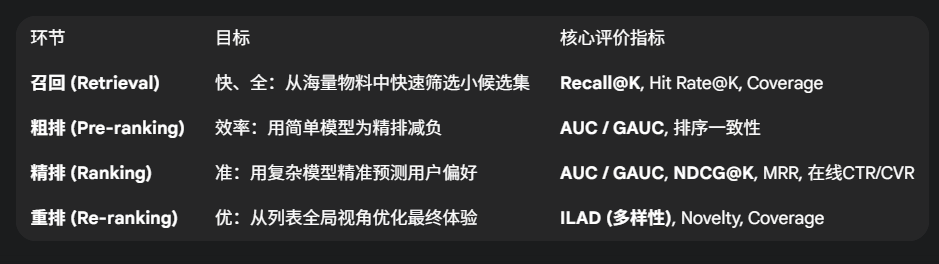

## 针对负采样中热门负样本的一些处理方法

**随机负采样**

如果采用随机负采样，会导致对冷门物品的不公平，因为正样本大多是热门物品，导致负样本中的热门物品占比较少，热门物品成为正样本的概率过高（但实际不是这样的）

因此对热门物品进行过采样，采样概率正比于点击次数的0.75次方（0.75是经验值，个人理解如果完全正比于点击次数，则会导致热门物品成为负样本的概率过高，这点与inbatch负采样原理相似）

**inbatch负采样**

采用inbatch负采样，相当于热门物品的采样概率正比于其出现的次数（这样会导致热门物品成为负样本的概率过高，过度打压热门物品），因此需要进行去偏，去偏就直接使用一个的偏置项，该偏置项正比于物品的点击次数，然后将该偏置项减去

**解决方法**：将用户的兴趣调整为 $cos(\mathrm{a,b_i)-}\log p_i$，去偏（如果将热门物品作为了负样本，减去一个偏置后会让其不至于被过分打压）

## 全量更新和增量更新

**🎯 1. 全量更新（Full Training）**

在早期推荐系统或稳定业务中常见：

+ 每天凌晨跑一次全量训练；
+ 使用过去若干天的全量曝光、点击、转化日志；
+ 重新训练 CTR 模型或召回模型；
+ 生成新的 embedding、模型参数，替换线上旧版本。

优点：

+ 简单易维护；
+ 模型一致性好。

缺点：

+ 计算资源浪费；
+ 模型更新滞后（无法快速反映新热点）。

**⚡ 2. 增量更新（Incremental Training）**

在实时推荐 / 电商 / 广告中更常见：

+ 模型或特征每天甚至每小时更新；
+ 新数据不断流入；
+ 模型通过**增量学习（online / streaming learning）** 或 **增量数据合并** 的方式持续更新。

目标：既保持模型最新，又避免全量重训的成本。

:star: **增量更新实现思路**

增量更新的核心逻辑是：

> “只处理变化的部分（Δ），并正确合并到已有全量（Σ）中。”

根据场景不同，可以分为 **数据增量更新** 和 **模型增量更新** 两类。

**数据层面的增量更新**

** 常见场景**

+ 数据仓库（Data Warehouse）
+ 特征计算（Feature Store）
+ 向量召回库（Embedding Store）

1. 基于时间戳筛选
2. 基于变更日志
3. 基于批次合并

**模型层面的增量更新**

1. 增量训练（Incremental Training）：模型保留上一版本参数，基于新数据继续训练一小步

2. Embedding增量训练

   + 在召回阶段（如向量召回库），常见做法是：

   + 定期批量重建全量 embedding；
   + 实时增量更新新用户/新物品 embedding；
   + 用 Faiss / Milvus / Vespa / Elastic Vector Search 等向量库支持增量插入与删除。

3. 模型版本融合

   增量模型可以与全量模型融合使用：$\text{score} = \alpha \cdot \text{score}{\text{full}} + (1-\alpha) \cdot \text{score}{\text{incremental}}$

**增量更新技术框架**

**“流式+批式融合（Lambda / Kappa 架构）”** 系统

数据源 → 变更捕获 → 实时流处理 → 特征更新 → 模型增量训练 → 在线服务

| **模块**        | **技术栈**                      |
| --------------- | ------------------------------- |
| **数据源**      | MySQL / Kafka / HDFS            |
| **CDC 层**      | Canal / Debezium                |
| **流式计算**    | Apache Flink                    |
| **特征存储**    | HBase + Redis + Feast           |
| **模型训练**    | TensorFlow + TFX + Airflow      |
| **模型服务**    | TensorFlow Serving / TorchServe |
| **召回库**      | Milvus / Faiss                  |
| **调度与编排**  | Airflow / Argo / Kubernetes     |
| **监控 & 回溯** | Prometheus + Grafana + ELK      |


## 传统DLRM与生成式推荐的区别？


**传统 DLRM** 是一种 **判别式推荐模型**，它学习一个函数来判断「用户–物品」是否匹配，输出的是一个**点击概率或评分**。优势：高效、稳定、可解释、易部署，适合工业级 CTR 预测与排序任务。

**生成式推荐** 则是把推荐当作一个**生成任务**，直接学习「用户历史 → 未来物品」的条件分布，输出的是**下一个物品或语义 token**。优势：能建模长期序列与语义关系，具备更强的泛化和多模态理解能力，能支持多样化生成与冷启动场景。

>  DLRM “判别谁更合适”，生成式推荐 “生成谁更可能”。
>  前者注重精准打分与效率，后者追求语义建模与泛化能力。

## 离线在线diff很大是因为什么？样本层面？特征层面？模型层面？业务层面？怎么评估？怎么解决？

**主要原因分类**

| 层面       | 核心问题                 | 常见表现                           |
| ---------- | ------------------------ | ---------------------------------- |
| 🧱 样本层面 | 训练数据与线上分布不一致 | 数据延迟、抽样偏差、冷启动样本     |
| 🔢 特征层面 | 训练/线上特征不一致      | 缺失、滞后、归一化差异             |
| 🧠 模型层面 | 模型泛化或机制差异       | 过拟合、曝光偏差、目标偏移         |
| 💼 业务层面 | 评估指标与业务目标不对齐 | 优化目标不匹配、反馈延迟、策略干预 |

**:one: 样本层面问题**

**典型原因**

1. **时间延迟 / 数据陈旧**
   - 训练样本来自旧数据（比如1周前），用户兴趣早变了。
2. **采样偏差**
   - 负样本采样不均，线上真实曝光分布不同。
3. **冷启动样本**
   - 新用户 / 新物品在训练集几乎未出现。
4. **曝光机制偏差**
   - 训练样本仅来自历史曝光数据（selection bias），而历史曝光本身带偏。

**🔹 评估方式**

- **分时间窗验证**：训练、验证集按时间切分（time-based split）。
- **Distribution Shift 检测**：比较训练集与线上日志的特征分布（KL散度、PSI）。
- **A/B 线上小流量验证**：直接测试分布匹配性。

**🔹 解决方案**

✅ 使用最新日志训练；
 ✅ 时间分层采样（保持时序一致）；
 ✅ 采用偏差校正方法（IPS、Doubly Robust）；
 ✅ 使用冷启动增强模型（meta-learning 或 embedding 初始化）。

**:two: 特征层面问题**

**🔹 典型原因**

1. **线上线下特征计算逻辑不一致**
   - 离线特征脚本与线上实时特征服务不对齐。
   - 例如：统计窗口不同、归一化方式不同。
2. **滞后或缺失**
   - 线上特征延迟更新（如曝光计数更新慢）。
3. **特征泄露**
   - 离线特征用了未来信息，线上无法获得（data leakage）。

**🔹 评估方式**

- 对比 **线上实时特征值与离线重放特征值**；
- 计算分布差异（PSI、Wasserstein 距离）；
- 模拟线上请求，通过日志重放验证。

**🔹 解决方案**

✅ 建立统一特征平台（Feature Store），确保线上/离线一致；
 ✅ 对特征时间戳严格校验，防止泄露；
 ✅ 对核心特征做分布监控（线上特征漂移报警）；
 ✅ 做线上特征校验集（shadow run 对比）。

**:three: 模型层面问题**

**🔹 典型原因**

1. **过拟合 / 泛化差**
   - 模型复杂但样本量不足；
   - 特征噪声导致离线指标虚高。
2. **目标偏移（Label Shift）**
   - 离线训练目标与线上业务目标不同；
   - 比如：离线优化CTR，但线上关注GMV或长时留存。
3. **曝光偏差 / 位置偏差**
   - 模型在已有排序机制下学习，导致线上新排序分布不同。
4. **分布漂移（Distribution Drift）**
   - 用户群体、内容供给变化快，模型更新不及时。

**🔹 评估方式**

- **线上 shadow 测试**（线上推断但不曝光，评估预测分布）；
- **离线模拟曝光分布**（inverse propensity weighting）；
- **监控模型输入输出分布漂移（PSI, JS divergence）**。

**🔹 解决方案**

✅ 加强正则化、Dropout、Early Stopping；
 ✅ 目标统一：offline loss ≈ online metric；
 ✅ 使用偏差校正（Debias Learning、Causal CTR）；
 ✅ 提高模型更新频率（online learning / warm start）。

**:four:业务层面问题**

**🔹 典型原因**

1. **离线指标与线上指标不一致**
   - 离线优化 AUC，但线上关注 CTR、转化、GMV；
   - AUC 高不代表收益高。
2. **曝光策略干预**
   - 线上有规则/打压机制（冷启动打分下调、AB 策略干扰）。
3. **反馈延迟**
   - 部分行为（购买、留存）在离线可见但线上无法实时验证。
4. **上下游依赖**
   - 上游召回、下游过滤逻辑不一致。

**🔹 评估方式**

- 线上 AB 测试；
- 联合指标评估（CTR、CVR、GMV）；
- 用户留存/二跳率分析。

**🔹 解决方案**

✅ 建立统一指标体系（offline-online alignment）；
 ✅ 联动上下游（召回 + 排序 + 重排一致性）；
 ✅ 联合优化多目标（CTR + GMV + 体验分）；
 ✅ 使用线上反馈更新模型（强化学习、bandit）。


流式更新会不会出现离在线不一致的问题？为什么？


超长序列建模？


# 模型相关

| 模型 / 方法                                              | 特点 / 作用                                                  | 补充 / 新的模型 / 方向                                       |
| -------------------------------------------------------- | ------------------------------------------------------------ | ------------------------------------------------------------ |
| **1、早期 embedding / 匹配 / 表征模型**                  |                                                              |                                                              |
| Word2Vec                                                 | 词向量 / embedding 的基本思路，对推荐中的 item embedding /上下文 embedding 提供启示 | —                                                            |
| 矩阵分解 / MF / SVD / SVD++                              | 经典协同过滤 / 隐语义模型，低秩近似，作为推荐系统基础之一    | —                                                            |
| DSSM（Deep Structured Semantic Model）                   | 用深度网络把 query/item 投影到语义向量空间以做匹配           | —                                                            |
| Two-Tower / 双塔模型                                     | 给用户 / item 各自做编码，匹配时做向量相似度（内积 / 余弦）  | —                                                            |
| YouTubeDNN                                               | YouTube 的匹配 /排名系统中的网络结构（双塔 + 特征网络 + 排序网络） | —                                                            |
| AutoRec                                                  | 自编码器风格模型，用于补全 /重构用户-项目矩阵                | —                                                            |
| NeuralCF                                                 | 把协同过滤思想 + 神经网络结合，深化 embedding + 交互         | —                                                            |
| Graph / GNN + embedding 方法                             | 用图结构加强用户 / item 表示能力（知识图、交互图）           | 例如 KNI（知识增强 Neighborhood Interaction）模型等          |
| **2、特征交互 / CTR / 表征增强分支**                     |                                                              |                                                              |
| FM（Factorization Machines）                             | 经典的低阶二阶交互 + 隐向量表示                              | —                                                            |
| AFM                                                      | 给交叉项加注意力权重                                         | —                                                            |
| NFM                                                      | 交叉表示 + 深网络                                            | —                                                            |
| PNN                                                      | 在特征交叉层引入乘积操作                                     | —                                                            |
| Wide & Deep                                              | 组合 “wide”（手工特征 / 交叉特征）+ “deep”（神经网络特征）   | —                                                            |
| Deep & Cross                                             | 在网络中直接设计交叉层 + 残差连接                            | —                                                            |
| DeepFM                                                   | 同时捕捉低阶（FM）和高阶（deep network）交互                 | —                                                            |
| DCN / DCNv2                                              | 把交叉操作设计为残差交叉网络                                 | —                                                            |
| xDeepFM                                                  | 引入 CIN（Compressed Interaction Network）等机制，在向量层面做交互 | —                                                            |
| AutoInt                                                  | 用自注意力机制做特征交互                                     | —                                                            |
| FiBiNET                                                  | 结合特征重要性 + 双线性交互                                  | —                                                            |
| 交叉 / 特征交互变体 / 扩展                               | —                                                            | 例如 **FIDS**（Feature Interaction Dual Self-Attention，用自注意力同时做特征交互 + 序列建模）([Frontiers](https://www.frontiersin.org/journals/neurorobotics/articles/10.3389/fnbot.2024.1456192/full?utm_source=chatgpt.com))； **MMFI**（多场景多任务感知交互模型）([ACM Digital Library](https://dl.acm.org/doi/10.1145/3651312?utm_source=chatgpt.com))；各种 GNN + 交互层融合模型等 |
| **3、序列 / 行为 / 多兴趣 / 动态模型分支**               |                                                              |                                                              |
| DIN                                                      | 用注意力机制对历史行为加权关注                               | —                                                            |
| DIEN                                                     | 在 DIN 基础上加兴趣演化机制（用 GRU / LSTM）                 | —                                                            |
| MIND                                                     | 用多个向量捕捉用户的多元兴趣                                 | —                                                            |
| SDM                                                      | 同时融合长短期兴趣 / 捕捉动态变化                            | —                                                            |
| SASRec                                                   | 用自注意力 / Transformer 架构做序列推荐                      | —                                                            |
| BERT4Rec                                                 | 用双向 Transformer + masked prediction 进行序列建模          | 是 SASRec 的一种常见变体 /并行方向                           |
| gSASRec / eSASRec 等                                     | 针对 SASRec 的改进（如 loss 调整、正负样本调整、正则化等）   | 如 gBCE loss、位置 /衰减机制等                               |
| HSTU                                                     | 针对复杂 “事件流” 输入定制的生成式架构                       | —                                                            |
| TIGER                                                    | 通过生成语义 ID 重塑推荐输出                                 | —                                                            |
| DiffuRec                                                 | 用扩散模型做序列推荐 / 随机化建模                            | 最近有文献在这方向探索                                       |
| GNN + 序列融合模型                                       | 把图结构（物品图 /交互图） + 序列模型联合建模                | 如 SR-GNN、Graph + Transformer 混合模型、多模态 + 序列融合模型。顺便提到“多模态序列推荐”是近年热点。([arXiv](https://arxiv.org/abs/2412.12770?utm_source=chatgpt.com)) |
| 超长序列 / 生成式推荐 / LLM 加持                         | 为极长序列／复杂场景 /生成式推荐做扩展                       | 最近有很多“LLM + 推荐”研究（foundation model 强化推荐）([arXiv](https://arxiv.org/abs/2504.16420?utm_source=chatgpt.com)) |
| **4、生成式 / 输出重塑 / 控制 /多目标 /策略模型分支**    |                                                              |                                                              |
| TIGER                                                    | 重塑推荐输出为语义 ID 生成形式                               | —                                                            |
| HSTU                                                     | 针对复杂事件流的生成式架构                                   | —                                                            |
| RL / 强化学习 / DQN / DRN / TransAct 等                  | 在推荐中融入策略 / 决策 /长期目标优化                        | —                                                            |
| 多目标 / 多任务机制                                      | 同时优化 CTR / 转化 /留存 /多样性 /公平 /稳定性等            | PLE、MMOE、ESMM、STAR、EPNet、PPNet、APG、M2M、MMR、DPP、PRS、CB2CF、MELU、POSO、CGC 等都是这类模型或机制 |
| 因果推荐 / 因果推断机制                                  | 控制偏差 /解释性 /因果干预                                   | 最近很多研究加入因果建模 / counterfactual 推荐方向           |
| 推荐 + LLM / 基础模型融合                                | 用大语言模型 /基础模型来生成推荐、理解用户、生成解释等       | 近期“Foundation Model + 推荐” 是趋势。([arXiv](https://arxiv.org/abs/2504.16420?utm_source=chatgpt.com)) |
| 小众                                                     |                                                              |                                                              |
| PDN、DeepRetrieval、SINE、M2GRL、POSO、PRS、PEPNET(小众) |                                                              |                                                              |


## 阶段 1：Embedding / 语义匹配

**Word2Vec**（更早期的 embedding 技术，用于词语表示，也被启发用于推荐中的 item embedding／序列建模基础）

**DSSM**（Deep Structured Semantic Model）：微软在搜索 / 匹配中用深度网络把 query 与 document 投影到语义空间做匹配，是早期深度匹配模型代表之一

**Two-Tower** 架构（双塔模型）：在推荐 / 检索系统中广泛采用，即一个塔编码用户，一个塔编码 item，匹配时直接计算 embedding 相似度

**YouTubeDNN**：YouTube 在 2016–2017 年公开其推荐系统架构 “Deep Neural Networks for YouTube Recommendations”，其实它在 “匹配 + 排序” 架构里融合了这一类双塔 + 特征网络的设计

**AutoRec**：一种用于协同过滤的自编码器模型

**NeuralCF**：将传统 CF 和神经网络结合起来的一种混合探索

## 阶段 2：特征交互 / CTR + 交叉模型

**FM（Factorization Machines）**：最基础、经典的特征交叉模型（低阶交互 + 隐向量）

**AFM（Attentional FM）**：给 FM 的各维交互加注意力权重  

**NFM（Neural FM）**：把交叉的表示再拿进神经网络

**PNN（Product-based Neural Network）**：在神经网络的特征交互层里增加乘积操作

**Wide & Deep**：Google 的一个结构，把 “wide”（手工交叉特征 + 线性模型）和 “deep”（深度网络）组合

**Deep & Cross**：对高阶交叉进行残差连接建模

**DeepFM**：把低阶的 FM 和高阶深度网络混合建模统一起来

**DCN（Deep & Cross Network）**：在深度网络里加入交叉层（residual cross）

**DCNv2**：DCN 的改进版本

**xDeepFM**：在向量级别做交互（CIN 层，控制组合方式）

**AutoInt**：利用自注意力机制做特征交互

**FiBiNET**：结合特征重要性与双线性交互

**PLE / MMOE / 多目标模型**：虽然这些是多任务 / 多目标模型方向，但经常和交叉 / 表征模型结合

**ESMM / ESM2 / HMoE / STAR / PEPNET / EPNet / PPNet / APG / M2M / MMR / DPP / PRS / CB2CF / MELU / POSO** 等：这些有些是多目标 / 多场景 / 多任务 / 多目标优化 / 输出结构 / 多样性 / 策略机制模型，我把它们看作交互/多目标 / 输出层的补充分支

## 阶段 3：序列 / 行为 / 多兴趣 / 动态兴趣模型

**MIND**：微软在新闻推荐里提出的模型，用多个向量来捕捉用户的多元兴趣

**DIN（Deep Interest Network）**：用注意力机制对用户历史行为加权

**DIEN（Deep Interest Evolution Network）**：在 DIN 的基础上加上兴趣演化，用 GRU / LSTM 机制考虑行为时间顺序和兴趣动态

**TransAct / DRN / DQN（在推荐 /策略 / RL 场景）**：这些偏策略 / 强化学习 /行为决策模型有时会融合在推荐系统里

**SDM**：融合长短期兴趣 / 捕捉兴趣的动态变化

**SASRec**：用自注意力（Transformer）做序列推荐（将推荐序列问题看作语言模型风格）

**HSTU**：针对复杂的“事件流”输入设计的生成式架构

**TIGER**：通过生成语义 ID 重塑推荐系统的输出（把推荐输出看成生成语义 ID）


## Lr

**逻辑回归（Logistic Regression, LR）** 是推荐系统中最基础、最经典的 **CTR 预估模型**。

其核心思想：

> 用一个线性模型预测点击概率，然后通过 **Sigmoid 函数** 将输出映射到 (0, 1) 区间。

$$\hat{y}=\sigma(w^Tx+b)=\frac1{1+e^{-(w^Tx+b)}}$$

**LR 的损失函数**

逻辑回归的训练目标是最小化预测概率与真实标签之间的差距，常用的是 **对数似然损失（Log Loss）**，也叫 **二分类交叉熵（Binary Cross-Entropy Loss）**。

$$L=-\frac1N\sum_{i=1}^N[y_i\log(\hat{y}_i)+(1-y_i)\log(1-\hat{y}_i)]$$

## FM

**FM（因子分解机）**:用向量内积来表示特征之间的二阶交互关系

$$\hat{y}(x)=w_0+\sum_{i=1}^nw_ix_i+\sum_{i=1}^n\sum_{j=i+1}^n\langle v_i,v_j\rangle x_ix_j$$

**FM 的直观理解**

1. 线性部分：表示每个特征单独对点击率的贡献，类似 LR。

2. 二阶交互部分：表示特征 i 与特征 j 的交互关系，用内积建模

   + 如果两个特征在 embedding 空间方向相似（内积大），说明它们在语义上关联性强；

     这样即使 **特征组合未在训练集中出现过**，也能通过向量相似度**泛化**。

**FM 的计算优化**

直接计算二重求和的复杂度是$O(n^2 k)$，太大。
 通过数学变形可以将其优化为 **线性复杂度 $O(nk)$**：


## xDeepFM

 **xDeepFM** 属于 **DeepFM 系列的进阶版本**。

在保留 **DeepFM 的优点（无需人工特征交叉）** 的同时，更**系统地建模高阶特征交互**

xDeepFM 提出了一个新的层结构 ——**CIN（Compressed Interaction Network）**，用于显式建模任意阶特征交互，并结合 DeepFM 的隐式部分。

**xDeepFM 可以看作是三部分组成的融合结构：**

xDeepFM=Linear Part+CIN Part (显式高阶)+DNN Part (隐式高阶)

CIN 是 xDeepFM 的灵魂模块。
 它的目标是：

> 以**显式形式**逐层构建高阶特征交互，同时保证计算效率。

在第 i 层，CIN 将第 l−1 层输出与原始 embedding 相互作用：

$$X^{(l)}=f(W^{(l)}\cdot(X^{(l-1)}\circ X^{(0)}))$$

这样，CIN 第1层学二阶交互，第2层学三阶交互，以此类推。

**xDeepFM 的整体预测公式**

$$\hat{y}=\sigma(y_{\mathrm{linear}}+y_{\mathrm{CIN}}+y_{\mathrm{DNN}})$$


## FNN模型（FM+MLP=FNN）

与PNN同属上海交大张楠的作品

FNN是一个两阶段训练的模型，
**阶段一，先训练一个FM模型得到每个field的embedding向量，
阶段二，基于阶段一的embedding向量初始化MLP的embedding层，然后训练一个MLP（DNN）。**

优点
一般在end-to-end训练DNN（MLP）的embedding层向量时，都是随机初始化的。

而FNN把FM训练好的embedding向量用于初始化DNN的embedding向量，
相当于在初始化DNN的embedding向量时引入了先验知识，
因此能够更好更快的收敛DNN。

缺点
正如张伟楠老师在PNN那篇论文中所提到的那样，FNN主要有两个比较大的局限性：

DNN的embedding层质量受限于FM的训练质量。
在FM中进行特征交叉时使用的是隐向量点积，把FM预训练得到的embedding向量送入到MLP中的全链接层，MLP的全链接层本质上做的是特征间的线性加权求和，即做的是『add』的操作，这与FM有点不太统一。

另外，MLP中忽略了不同的field之间的区别，全部采用线性加权求和。

## PNN模型（Product-based Neural Networks）

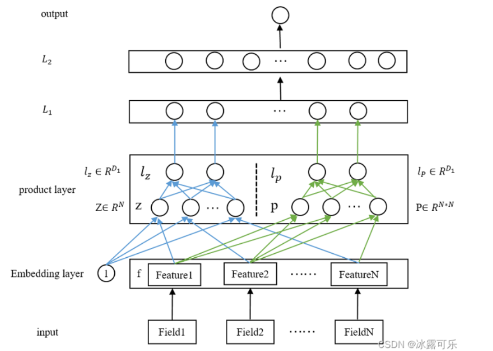


## PPNet（LHUC）

在工业界有效，但是只能用于精排

LHUC起源于语音识别

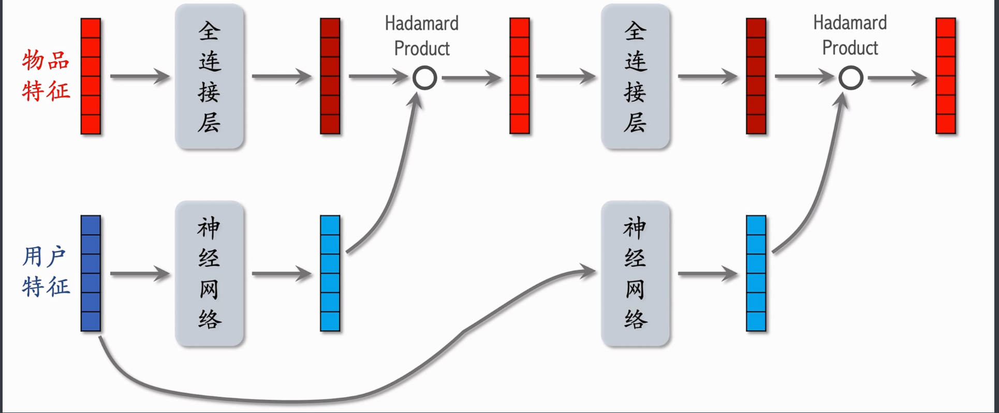

PPNet 是 PEPNet 的一个子模块，作用是 **在 DNN 参数上做个性化调整 / 修改（personalization）**，使得不同用户或不同任务可以“微调”网络参数以适应不同稀疏度或偏好。

+ PPNet 接受**个性化 prior 信息**（可能是用户特征、任务 / 域信息等）作为输入，然后输出一些参数或变换（如 scaling、bias adjustment 等），用于“修正 / 调整 / 调幅”DNN 的参数（例如隐藏层的权重、偏置等）。 
+ 通过这种方式，不同用户、不同任务在同一主网络框架下能拥有一定的参数差异（个性化），但又共享大部分网络结构和全局参数，从而兼顾模型共享与个性化。 

## SENet

+ SENet对离散特征做field-wise加权
+ Field：
  + 用户ID Embedding是64维向量
  + 64个元素算一个field,获得相同的权重
+ 如果有m个fields,那么权重向量是m维

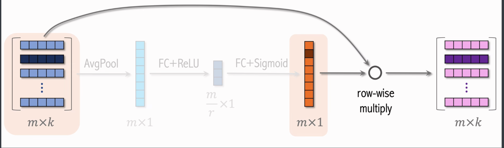

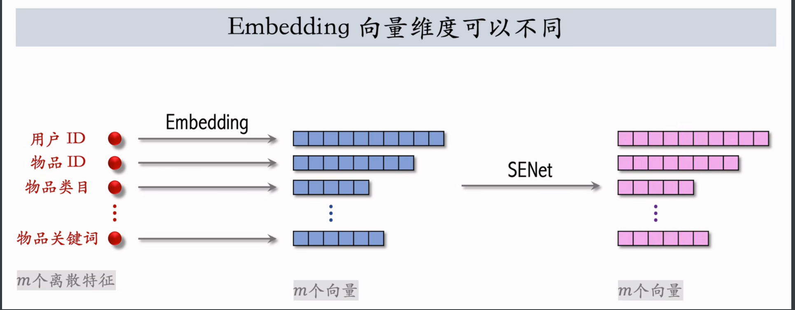

## DCN、DCNv2

**Google 在 2017 年提出了 DCN 模型（Deep & Cross Network）**，它能够**显式地学习高阶特征交叉**，同时结合 DNN 的非线性表示能力。

```
          输入向量 x₀
               │
      ┌────────┴────────┐
      │                 │
 Cross Network      Deep Network
 (显式高阶交叉)       (非线性特征提取)
      │                 │
      └────────┬────────┘
               │
        拼接（concat）
               │
          输出层（预测）
```

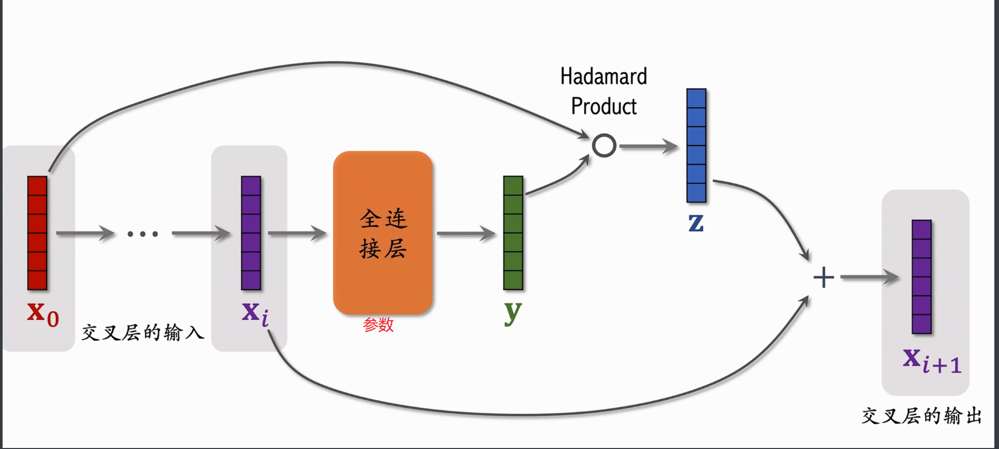

**定义递推关系：**

$$x_{l+1} = x_0 (x_l^T w_l) + b_l + x_l$$

这个递推式会不断叠加更高阶的交叉项：

+ 第 1 层：一阶 + 二阶交叉；
+ 第 2 层：包含三阶；
+ …
+ L 层后，可捕获至多 **(L+1)-阶显式交叉特征**。

Deep 部分通常是多层全连接网络（MLP）,用于提取**非线性组合**与**复杂隐式交互**。

Google 在 2021 年提出 **DCN-V2（Deep & Cross Network V2）**，进一步提升模型表达力。

DCN-V2 提供两种交叉机制：

+ **Low-rank Cross Layer**：通过低秩分解提升效率；
+ **Mix Cross Layer**：引入 gating 机制混合不同交叉模式。

## YouTubuDNN


## DIN、DIEN、SIM

**DIN**

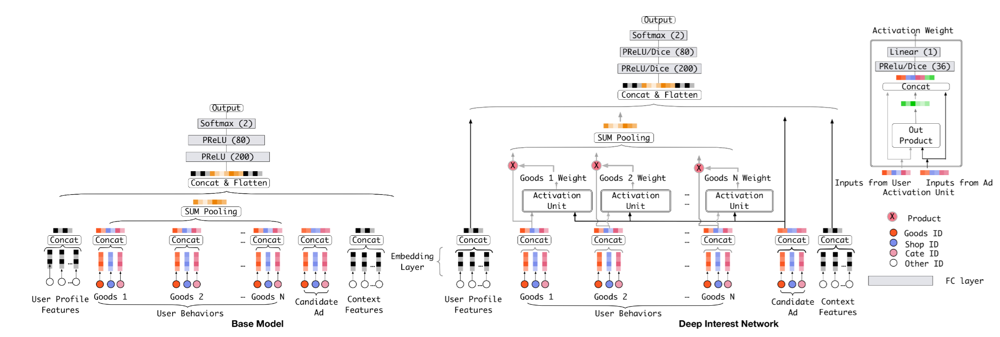

**DIEN**

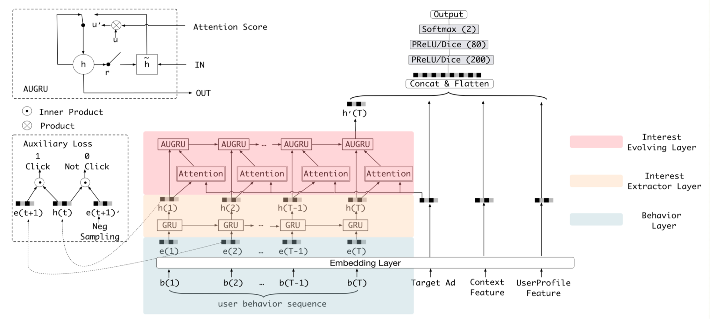

DIEN的整体结构过程为：

1. 特征（User Profile feature, User Behavior feature, Ad feature and Context feature四大类）
2. 经过Embedding层得到低维稠密的embedding向量
3. 然后进入到Interest Extractor层，这里就是个普通的GRU，为了更好的训练，引入了辅助Loss。
4. 然后进入到Interest Evolving层
5. 最终与ad feature，Context feature和User Profile feature的向量做concat，进入到多层全连接层（MLP），然后BP训练。

因为引入了辅助loss，因此整个DIEN模型的loss为:

$$\mathrm{L=L_{target}+\alpha*L_{aux}}$$

**SIM**

从用户丰富的长期历史行为队列中挖掘用户有价值的兴趣点，即与当前候选广告相匹配的兴趣，并提供一种长行为序列线上服务化的可行性方案。

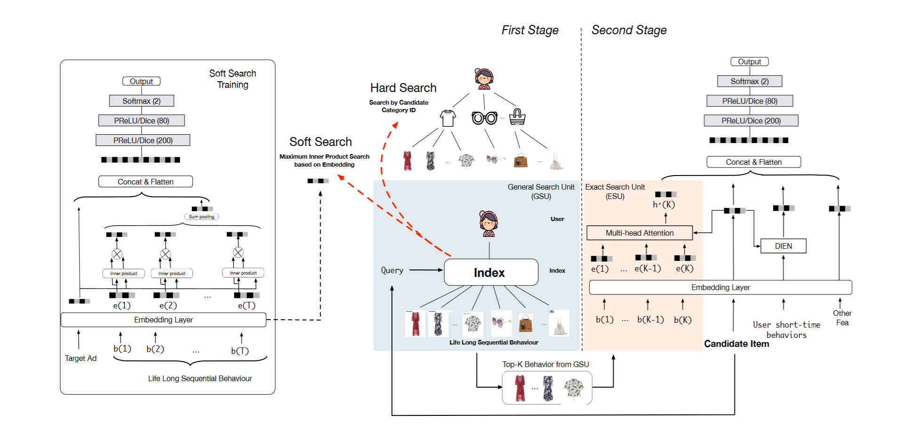

SIM模型包括两个主要的模块，即General Search Unit（GSU）和Exact Search Unit（ESU）。

+ GSU负责从全部用户行为队列中筛选出与当前目标广告相关的候选行为
+ ESU负责对筛选后的行为序列进行深度学习建模，计算CTR。

GSU可以采用两种不同的检索方法，即hard-search+和soft-search。

+ hard-search是基于规则和策略的，比如根据商品类别进行筛选。
+ soft-search是基于Embedding内积相似度的，比如利用一个DNN模型来对每个候选行为序列进行建模，然后将候选广告Embedding和历史行为中的Embedding算一个内积相似度，利用近似最近邻检索方法来得到topK相关的候选行为序列。

ESU可以采用多种深度学习模型来对用户行为序列进行建模，比如基于Attention机制的各种网络结构。ESU的目标是利用筛选后的信息进行有效的特征提取和融合，提升CTR预估的精度。

**SIM模型的优势和创新点如下：**

- 模型从用户丰富的长期历史行为队列中挖掘用户有价值的兴趣点，即与当前候选广告相匹配的兴趣，提高用户兴趣匹配度和CTR预估精度。
- 模型通过检索方法筛选出与当前目标广告相关的候选行为序列，降低线上系统的计算开销和内存占用，提高系统效率和稳定性。
- 模型采用两种不同的检索方法，即hard-search和soft-search，分别基于规则和策略、Embedding内积相似度进行筛选，提高检索的灵活性和准确性。

## DIN、DIEN、SIM的区别？为什么引入GRU？辅助Loss的定义？

**DIN (Deep Interest Network, 2018 KDD)**

**核心思想**

- 用户的兴趣是**多样化的**，并不是所有历史行为都和当前待推荐 item 相关。
- 传统的做法（比如把用户行为 embedding 做 pooling/平均）会稀释掉兴趣。
- DIN 引入了 **Attention 机制**：
  - 用候选广告/商品 embedding 去和用户历史行为交互；
  - 只放大和当前 item 相关的历史行为。

**特点**

- 捕捉“兴趣多样性”；
- 不考虑行为的时序演化，只是“相关性加权”。

------

**DIEN (Deep Interest Evolution Network, 2019 AAAI)**

**问题**：DIN 只能做“静态相关性建模”，但用户兴趣会随时间演化。

**改进**

- DIEN 在 DIN 的基础上，引入了 **时序建模 (GRU/RNN)**，捕捉兴趣的动态演变。
- 核心结构：
  1. **兴趣抽取层**：用 GRU 对行为序列建模，把低级行为 embedding 转化为“兴趣状态”。
  2. **兴趣演化层**：再用 GRU + attention（AUGRU，Attentional Update GRU）建模兴趣随时间对 target item 的演化。
     - AUGRU = GRU + attention gate，只保留与目标 item 相关的兴趣更新。

------

**SIM (Search-based Interest Model, 2020 CIKM/2021 TOIS)**

**问题**：DIEN 要把完整的用户行为序列都过一遍 GRU，长序列（几千个点击）计算量非常大。

**改进**：SIM 提出 **近邻搜索 + 多尺度建模**：

- 不再把全量历史行为序列输入模型，而是用 **高效检索方法**（ANN/向量索引）找出与 target item 最相关的子序列。
- 然后在检索到的子序列上做 **短序列建模**（GRU/attention），降低计算成本。

**特点**

- 面向工业级大规模推荐，强调 **效率 + 长序列利用**。
- DIN/DIEN 更强调“建模方法”，SIM 更强调“系统化落地”。

------

4. 为什么引入 GRU？

GRU 的作用主要在 **DIEN** 中：

1. **序列建模**：用户行为是时序相关的，GRU 能捕捉“兴趣随时间演化”。
2. **避免信息稀释**：相比简单平均/attention，RNN 能逐步演化兴趣状态。
3. **AUGRU 的提出**：在 GRU 的 update gate 里引入 attention，让“与 target item 不相关的历史行为”在更新时被抑制。

------

5. 辅助 Loss（Auxiliary Loss）

出现在 **DIEN** 中。

**问题**

- 仅靠最终 CTR 标签监督，GRU 学到的“兴趣状态”可能过于弱化/模糊，无法保证兴趣演化表示真的合理。

**解决**

- 给兴趣抽取层增加一个 **辅助任务**：
  - 用当前时刻的兴趣隐藏状态，去预测“下一个用户行为 item”。
  - 类似于语言模型里的“下一个词预测”。

**定义**
 设：

- 第 t 个行为的 hidden state 为 $h_t$
- 下一个行为的 item embedding 为 $e_{t+1}$

辅助 loss 就是二分类交叉熵：预测 hth_tht 与 et+1e_{t+1}et+1 的匹配概率。

$$L_{aux}=-\sum_t\left(y_{t+1}\log\sigma(h_t^\top e_{t+1})+(1-y_{t+1})\log(1-\sigma(h_t^\top e_{t+1}))\right)$$

这样，模型在学 CTR 的同时，也被迫学会“兴趣序列的合理演化”。

------

6. 总结区别

| 模型     | 核心思想             | 技术点                      | 局限               |
| -------- | -------------------- | --------------------------- | ------------------ |
| **DIN**  | 兴趣多样性           | Attention (target-aware)    | 无时序建模         |
| **DIEN** | 兴趣演化             | GRU + AUGRU + 辅助 loss     | 序列长时计算开销大 |
| **SIM**  | 大规模长序列高效建模 | 检索相关子序列 + 多尺度建模 | 更偏工程优化       |

## DSSM

个人觉得与双塔模型区别不大

双塔召回模型的离线训练步骤为：

将用户侧的特征concat起来，输入一个DNN网络中，最终得到一个user embedding；
将物品侧的特征concat起来，输入一个DNN网络中，最终得到一个item embedding；
拿user embedding与item embedding，做点积或cosine，得到logit，代表user和item之间的匹配程度；
设计loss训练模型，一般loss都选择weighted cross entropy loss或Focal loss，这些loss都是point wise方法。

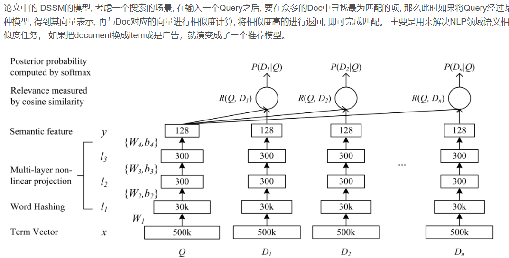

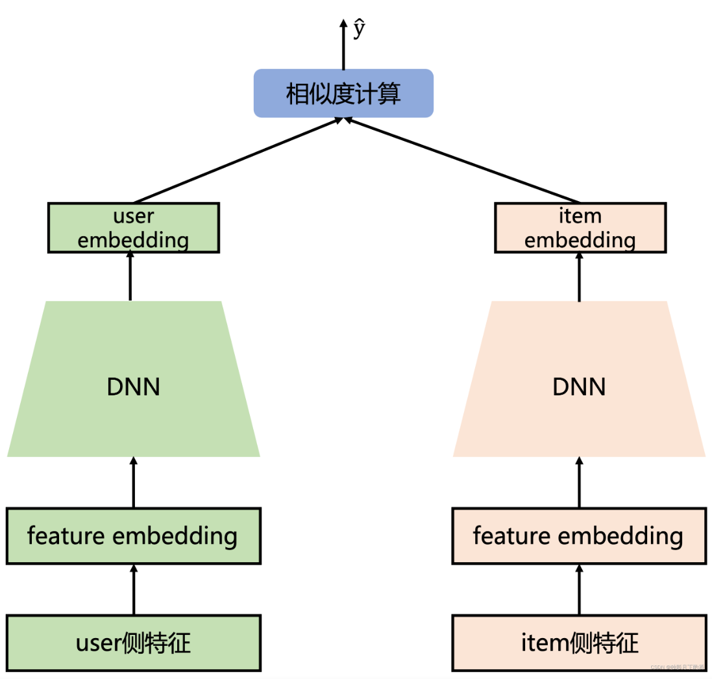

## ESMM、MMoE、PLE

**ESMM**

阿里巴巴在 2018 年提出的，用于解决推荐系统中**CVR（Conversion Rate）预测**的核心难题。

**ESMM**(Entire Space Multi-Task Model)是针对任务依赖而提出，比如电商推荐中的多目标预估经常是ctr和cvr，其中转换这个行为只有在点击发生后才会发生。

cvr任务在训练时只能利用点击后的样本，而预测时，是在整个样本空间，这样导致训练和预测样本分布不一致，即**样本选择性偏差**。同时点击样本只占整个样本空间的很小比例，比如在新闻推荐中，点击率通常只有不到10%，即**样本稀疏性问题**。

为了解决这个问题，**ESMM**提出了转化公式：

$$p\left(z=1|y=1,x\right)=\frac{p\left(y=1,z=1|x\right)}{p\left(y=1|x\right)}$$

那么，我们可以通过分别估计pctcvr(即$p\left(y=1,z=1|x\right)$)和pctr(即  $p\left(y=1|x\right)$)，然后通过两者相除来解决。而pctcvr和pctr都可以在**全样本空间进行训练和预估**。但是这种除法在实际使用中，会引入新的问题。因为pctr其实是一个很小的值，预估时会出现pctcvr>pctr的情况，导致pcvr预估值大于1。**ESSM**巧妙的通过将除法改成乘法来解决上面的问题。它引入了pctr和pctcvr两个辅助任务，训练时，loss为两者相加。

$$L\left(\theta_{cvr},\theta_{ctr}\right)=\sum_{i=1}^{N}l\left(y_{i},f\left(x_{i};\theta_{ctr}\right)\right)+\sum_{i=1}^{N}l\left(y_{i}\&z_{i},f\left(x_{i};\theta_{ctr}\right)\times f\left(x_{i};\theta_{cvr}\right)\right)$$

+ $L_{ctr}$：CTR 任务的交叉熵损失（在全量样本上计算）；
+ $L_{ctcvr}$：CTCVR 任务的交叉熵损失（同样在全量样本上计算）。

```
输入特征 x
    │
 ┌──┴───────────────────────────┐
 │                             │
CTR 子网络               CTCVR 子网络
│ (预测点击概率)           │ (预测点击且转化概率)
│                           │
│   P(click|x) = y₁          │   P(click ∧ conversion|x) = y₂
│                           │
└──────────┬────────────────┘
           │
           │   P(conversion|click, x) = y₂ / y₁
           ▼
        CVR 估计
```


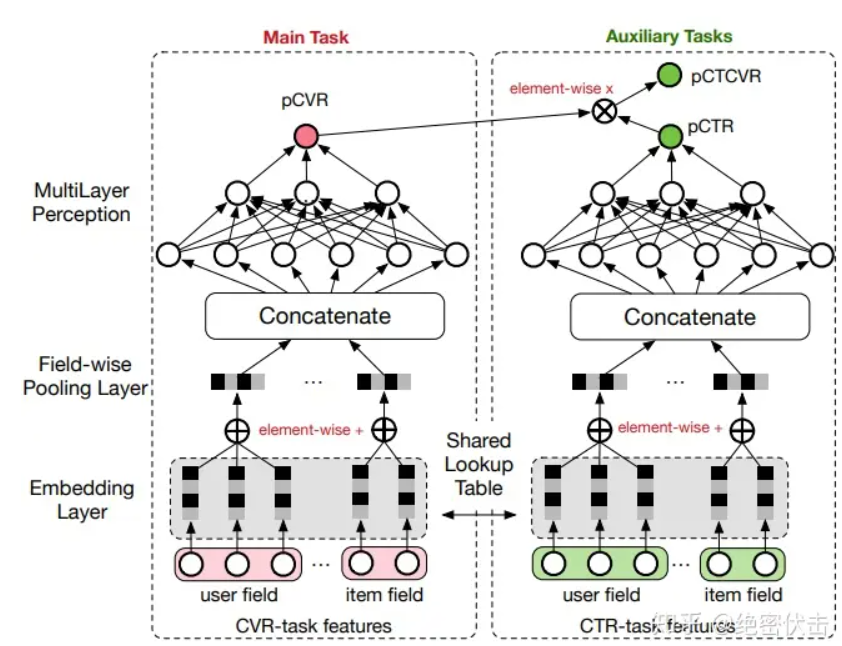


**MMoE**

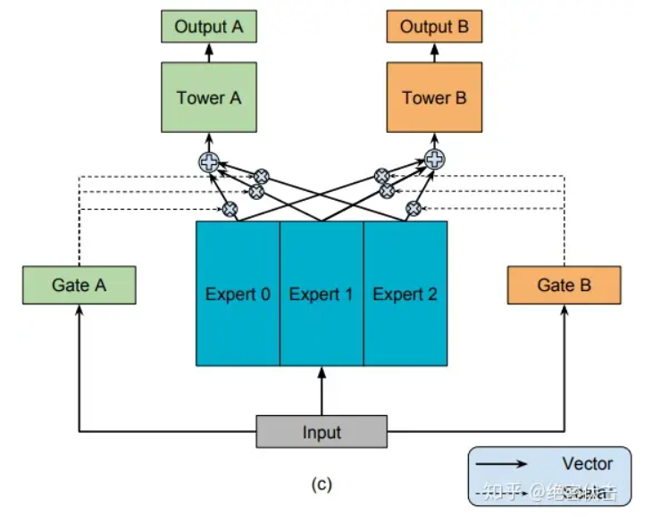

在推荐系统中，我们往往有多个相关但不同的目标：

- 比如：点击率（CTR）、转化率（CVR）、停留时长、留存、GMV 等。
   传统的多任务模型（如 shared-bottom）用 **一个共享特征提取层 + 多个任务头**，但：

> 不同任务的梯度方向可能冲突（task conflict），共享层难以同时兼顾。

 **MMoE核心思想**：让多个任务“共享部分专家网络”，但每个任务通过自己的“门控（Gate）”来动态选择不同的专家组合。

+ 各任务共享专家参数，但通过门控选择性使用；
+ 避免梯度冲突（gradient conflict）；
+ 学会任务间隐式相关性；
+ 提升多目标同时优化的效果。

**如何处理多个目标不平衡**

- 任务加权
- 采样平衡
- Gating 分布约束,给门控网络加上熵正则,防止主任务独占部分专家

**专家数量（E）如何确定**

一般经验规则：建议专家数要多于任务数（2倍或者更多）

**极化现象**

不同任务的 Gate 输出趋于集中在少数专家上

原因分析：

+ 门控网络过度集中（softmax 输出过“尖”）；
+ 各任务目标高度相关，gating 难以区分；
+ 训练初期梯度不均导致局部最优；
+ 缺乏专家多样性约束。

**解决方案：**

| 方法                                  | 思想                                | 实现方式                                                 |
| ------------------------------------- | ----------------------------------- | -------------------------------------------------------- |
| dropout                               |                                     |                                                          |
| **1️⃣ Gating 熵正则化**                 | 提高门控多样性                      | 在 loss 中加 (L_{entropy} = -\sum_i g_{t,i}\log g_{t,i}) |
| **2️⃣ Expert Diversity Loss**           | 让专家间输出去相关                  | 增加 (\sum_{i\neq j}                                     |
| **3️⃣ Noisy Gating**                    | 在 gate logits 加噪声               | 防止任务固定选同一专家                                   |
| **4️⃣ Load Balancing Loss（负载均衡）** | 控制每个专家激活比例                | 类似 MoE 的机制                                          |
| **5️⃣ Sparse / Top-K Gating**           | 限制每任务激活少量专家              | 提高差异性                                               |
| **6️⃣ 温度调节（Temperature Scaling）** | 调节 softmax 温度 T：(softmax(z/T)) | T 大 → 分布平滑，减少极化                                |


**PLE**

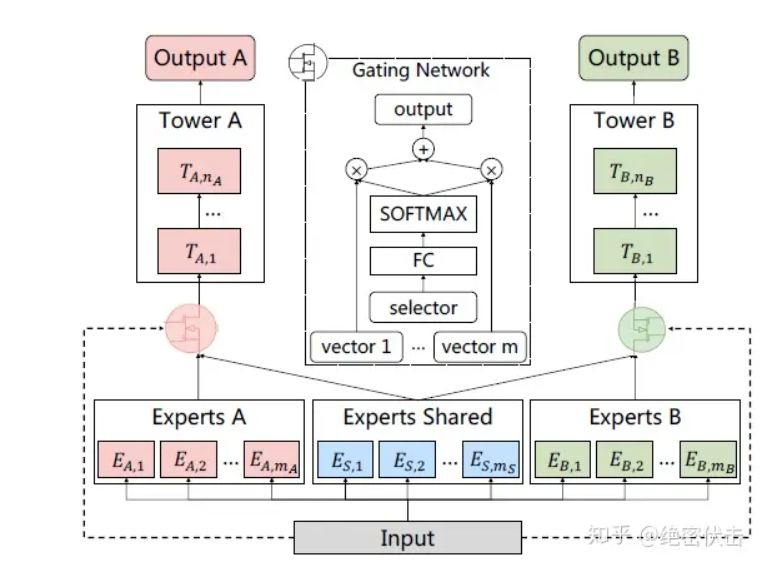


## MMoE 解決负迁移最核心的思路是什么? 如何将mmoe，esmm联合起来，并行+串行

MMoE (Multi-gate Mixture-of-Experts) 解决负迁移最核心的思路是：**通过软参数共享（Soft Parameter Sharing）来代替硬参数共享（Hard Parameter Sharing）。**

为了理解这个核心思路，我们先看它要解决的问题：

- **硬参数共享（Hard Sharing）**：这是传统的多任务学习方法，如下图左侧所示。多个任务共享一个底层的网络（Shared Bottom），然后各自接上自己的任务塔（Task-specific Towers）。这种方法的优点是能有效防止过拟合，但缺点是如果多个任务之间相关性不强，共享层会被相互冲突的梯度“拉扯”，导致所有任务的效果都变差，这就是典型的**负迁移（Negative Transfer）**。
- **MMoE 的软参数共享**：MMoE 认为，不同任务之间可能既有共性，也有特性。强行让它们共享一个完全相同的底层网络是不合理的。于是，MMoE 提出了“混合专家（Mixture-of-Experts）”的结构，如下图右侧所示。

MMoE 的核心思路具体实现如下：

1. **设置多个“专家网络”（Experts）**：模型底层不再是一个共享网络，而是由多个结构相同但参数不共享的“专家”子网络组成。每个专家都可以被看作是一个独立的特征提取器，它们从不同角度学习数据的特征。
2. **为每个任务设置一个“门控网络”（Gating Network）**：这是MMoE的精髓。每个任务都有一个自己专属的、可学习的门控网络。这个门控网络的输入是原始的输入特征，输出是一组权重。
3. **按需“定制”共享层**：门控网络输出的权重，决定了该任务应该如何“混合”所有专家的输出。例如，对于任务A，它的门控网络可能会给专家1、3、5分配高权重；而对于任务B，它的门控网络可能会给专家2、3、6分配高权重。

**总结核心思路**：MMoE 不再强迫所有任务共享同一个“知识库”，而是提供一个包含多种“知识”（Experts）的“图书馆”，然后给每个任务派发一个聪明的“图书管理员”（Gating Network），让它自己判断并组合利用这些知识。

通过这种方式：

- 如果任务相关性强，它们的门控网络可以学会选择相似的专家组合。
- 如果任务相关性弱，它们的门控网络则可以选择不同的专家组合，互不干扰。

这样，模型就**通过门控机制动态地、有选择性地共享信息**，从而极大地缓解了负迁移问题

---


**如何将MMoE，ESMM联合起来，并行+串行**

将 MMoE 和 ESMM 结合是一个非常强大且在工业界常见的思路，因为它能同时利用 MMoE 的并行多任务处理能力和 ESMM 的串行依赖建模能力。

**背景回顾：**

- **MMoE** 擅长处理多个**并行**且相关性不一的任务（例如，同时预测点击率、收藏率、分享率）。
- **ESMM** 专门处理具有**串行**依赖关系的任务链（例如，曝光 -> 点击 -> 转化）。

结合这两者的目标是：**在处理更复杂的业务场景时，既能处理并行的多目标，又能对其中具有序列依赖的目标进行无偏估计。**

下面是一种非常经典的**“并行+串行”**结合架构：

**模型架构详解：**

1. **底层：MMoE 结构 (并行部分)**
   - 模型的底部是一个标准的 MMoE 结构。输入特征首先经过共享的 Embedding 层，然后进入多个专家网络（Experts）。
   - 我们为场景中多个**并行的、最终的业务目标**设置各自的门控网络和任务塔。在图中，我们假设除了点击和转化，还关心用户的**互动时长（Duration）和收藏（Favorite）**。
   - 因此，我们设置了四个门控网络，分别对应四个任务。
2. **顶层：ESMM 结构 (串行部分)**
   - ESMM 的核心是利用 pCVR=pCTCVR/pCTR。我们将这个结构嫁接到 MMoE 的顶层。
   - **CTR 任务**：这个任务相对独立，可以直接由 MMoE 的一个分支来建模。CTR Gate 会混合专家的输出，然后通过 CTR Tower 得到 **pCTR** 的预测值。它的训练样本是**全局曝光样本**，标签是`is_click`。
   - **CTCVR 任务**：这是 ESMM 的关键。我们同样为它设置一个 CTCVR Gate，混合专家的输出后，通过 CTCVR Tower 得到 **pCTCVR** 的预测值。它的训练样本也是**全局曝光样本**，标签是`is_click AND is_conversion`。
   - **计算 pCVR**：在线上预测时，我们不直接使用任何一个塔的输出作为 pCVR。而是通过 pCVR=pCTCVRpred/pCTRpred 来计算得到。**pCVR 是隐式学习的，没有自己独立的网络塔**。
3. **其他并行任务**：
   - 像 **互动时长** 和 **收藏** 这类可以独立于点击->转化链条的任务，则作为 MMoE 的其他并行分支。它们各自拥有独立的门控和任务塔，使用对应的标签进行训练。

**优势与工作流程：**

- **优势**：
  1. **解决负迁移**：底层的 MMoE 结构让 CTR、CTCVR、时长、收藏等多个任务可以和谐地共享信息，即使它们之间的相关性有强有弱。
  2. **解决 CVR 预估偏差**：顶层的 ESMM 结构专门负责处理 CTR -> CVR 的序列依赖，通过在全局空间建模 pCTCVR，解决了传统 CVR 模型的样本选择偏差（SSB）和数据稀疏（DS）问题。
  3. **扩展性强**：这个框架非常灵活，可以轻松地增加或删除其他的并行任务（如分享、关注等），只需添加相应的门控和任务塔即可。
- **训练流程**：
  - 模型的总损失函数是所有显式任务塔损失的总和： Losstotal=LossCTR+LossCTCVR+LossDuration+LossFavorite
  - 所有任务塔的梯度会同时反向传播，共同更新底层的专家网络和各自的门控网络。

通过这种“并行MMoE + 串行ESMM”的混合架构，我们构建了一个既能处理多目标优化，又能保证关键路径（CVR预估）无偏的强大推荐模型。


# SASRec

它是第一个把 **Transformer 自注意力机制（Self-Attention）** 引入推荐任务的模型，奠定了之后所有 Transformer-based 推荐模型（如 BERT4Rec、FDSA、HSTU）的基础。

>  用 Transformer 的 **Self-Attention** 来建模用户行为序列，
>  捕捉用户短期与长期兴趣，并预测下一个可能点击的物品。

传统的序列推荐模型（如 GRU4Rec、Caser）使用 RNN 或 CNN：

- RNN：只能顺序建模，难并行；
- CNN：只能捕捉局部模式，难建长程依赖。

SASRec 则完全基于 Self-Attention：

- 不需要循环；
- 可以全局建模；
- 支持并行计算；
- 训练稳定，收敛快。

```
用户行为序列 → 物品Embedding + 位置Embedding
             ↓
     [Self-Attention × N 层]
             ↓
        最后时刻的输出向量
             ↓
      与候选物品Embedding计算相似度
             ↓
         预测点击概率

```

通常使用两种损失：

| 损失                     | 形式                                | 含义                       |
| ------------------------ | ----------------------------------- | -------------------------- |
| **Binary Cross-Entropy** | 对正负样本做分类                    | 是否点击该物品             |
| **BPR Loss**             | $(-\log \sigma(s_{pos} - s_{neg}))$ | 排序目标，让正样本得分更高 |

1️⃣ **首次引入 Transformer 到推荐系统**
 → 摆脱 RNN/CNN 顺序依赖，提升并行效率。

2️⃣ **使用 Masked Self-Attention 实现自回归预测**
 → 模型只能“看过去”，模拟真实推荐场景。

3️⃣ **可解释性强**
 → 注意力权重可视化能显示哪些历史物品影响预测。

4️⃣ **通用性好**
 → 可扩展到跨域、冷启动、序列预训练场景（如 BERT4Rec, SSE-PT）。


# TIGER

**rqvae损失函数**

作者给出：$$L(x):=L_{\mathrm{recon}}+L_{\mathrm{rqvae}}$$

其中Lrecon为重建损失，Lrqvae为量化相关损失

1. **重建损失Lrecon**

   对量化后再解码得到的重建向量 x^\hat{x}x^ 与原始 embedding xxx 之间的距离（典型是 MSE / L2 距离或平方误差）

   $$L_{\mathrm{recon}}=\|x-\hat{x}\|^2$$

2. **量化误差 / 码本误差**（Codebook loss）

   这是在编码－量化过程中，编码器的输出来到最近码本向量时，会有一个误差残差。**常见做法是在训练中加入一个项，使得码本向量（codebook vectors）靠近编码器输出（或残差）以缩小量化误差**。例如，对于标准 VQ-VAE，有项像

   $$\|\mathrm{sg}(z_e)-e\|^2$$

3. 在论文的实现／配置中，他们还设置一个系数 β（在文中 β = 0.25）来平衡这两部分的权重。

   $$L=L_{\mathrm{recon}}+\beta\cdot L_{\mathrm{rqvae}}$$

   

**rqvae系列的改进路径？**

**语义特征怎么构造的？**

论文中采用的是T5模型，根据物品简介，生成物品的语义Embedding

**如何融入协同信号？**

**码本冲突率怎么解决？**

k-means聚类

**生成了不存在的id如何处理？** 

1. 丢弃，论文中表明生成不存在id的概率极低（百分之0点几）
2. 前缀匹配，选择语义ID相似的物品

**rankmixer特征怎么分组？**

RQ-Kmeans

R-VQ

# HSTU


# OneRec


## OneRec

**端到端的根本优势是什么？**

1. **效率更高**: 这一点可能颠覆固有认知：单一模型的算力利用率实际上远高于级联系统！
2. **智能上限更高**: 生成式任务相比判别式任务拥有更大的解空间和更强的复杂性，训练所得的模型具备更高的智能潜力，更能充分发挥大规模算力的价值。

传统推荐系统通常采用“召回-粗排-精排”的级联架构，每一阶段从候选集中筛选出TopK个条目传递至下一阶段。<u>这种模式下，各阶段往往独立优化，前序环节的效果制约了后续环节的上限，容易导致误差累积和系统整体一致性较弱。</u>OneRec提出了一种新的范式：使用单一生成模型直接替代传统的多阶段级联漏斗，直接生成由若干物品组成的推荐会话,显著提升一致性.

架构效率层面：推荐大模型可能比多阶段小模型更“经济”通常认为，端到端的大模型在算力消耗上远超由多个小模型构成的级联系统。然而，OneRec团队研究指出，传统非端到端的级联系统整体复杂度高，<u>其资金成本和延迟资源中，大部分并未用于模型计算本身，而是消耗在通信与存储环节</u>。相比之下，大语言模型(LLM)训练中的模型浮点运算利用率(MFU)可达40%-50%，而传统推荐系统因历史架构惯性，算力利用率极低，难以享受LLM时代算力发展的红利。

**效果上限**

+ 判别式模型：建模条件概率分布p(y|x)，即预测在给定用户与物料情境下，用户产生特定行为（如点击、转化)的概率。其训练数据仅包含已曝光的真实物品，而推理时则需面对全量候选集，存在训练与推理场景不一致的问题。
+ 生成式模型：建模联合概率分布p(x,y)，即对用户、物料及行为进行整体建模。模型需先融合用户与上下文信息，再基于此隐式地推断用户对全部潜在物料的偏好程度。这种建模方式更贴近真实推荐场景的复杂决策过程。

**Tokenizer**

传统推荐系统通常基于ItemlD进行构建，然而高基数且动态变化的ItemlD并不适合直接作为生成模型中的token。

一方面，高维稀疏的ItemlD之间共现信号稀少，难以充分发挥生成式模型在Next Token Prediction任务中的优势；

另一方面，这种做法也难以有效处理物品冷启动问题。

 Google在Tiger工作中提出使用RQ-VAE生成语义ID作为物品的分词表示，但该方法仅依赖物品自身多模态内容信息，未引入推荐系统中重要的协同信号先验。为此，OneRec在语义表征提取过程中显式引入协同过滤先验，以增强ID的推荐相关性。

编码器输入：

涵盖标题、标签、封面图采样帧、ASR语音转写文本、OCR识别文本等多模态信息，全面捕捉物品语义。编码器结构与输出：将上述多模态信息拼接后，输入到多模态大模型miniCPM-V-8B,输出1280维 token.序列，再经Q-Former)压缩为3个token作为物品的语义标识。

编码器训练目标：

+ 协同过滤对齐：通过物品对的对比学习损失，拉近行为共现物品的语义表示。Item Pairs采用两种方式构建：一是基于用户序列，将点击的Target Item.与其最近的正向行为ltem组成Pair;二是使用 Swing等I2I算法，选取相似度分数超过阈值的物品组成Pair。
+ 语义重建损失：将Q-Former输出的token输入LLaMa进行文本重建，确保语义ID保留原始多模态内容的语义信息。

在该方法中，OneRec借鉴了快手在QARM论文中提出的RQ-Kmeans技术（这里不再赘述，可看前面)，通过构造Item-to-tem配对样本，再结合基于残差量化的Kmeans方法生成语义ID。与RQ-VAE相比，Kmeans版本的残差量化在实际应用中更具友好性。笔者在实际实验中也发现，使用RQ- VAE进行训练时常出现码本(codebook)利用率低、语义ID分布极不均衡的问题。一个关键细节在于，该方法所采用的是均衡Kmeans(Balanced Kmeans),以缓解类别不均衡对语义划分的影响。

[完整连接](https://www.xiaohongshu.com/explore/68de114700000000070340d4?xsec_token=ABlBXHTPparZ3r2LzJnIiI2y7JMxxPaPXShR9zbqeIxRM=&xsec_source=pc_feed)

**OneRec v2**


**OneRec v1 和 v2 的改进在哪？**


